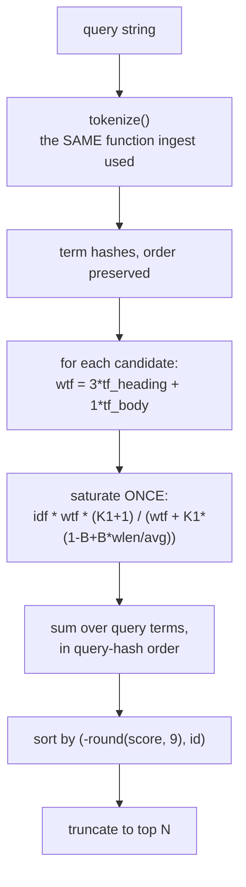
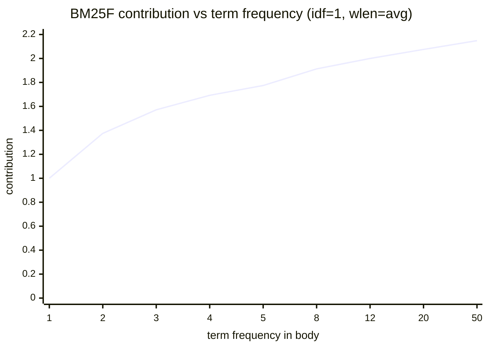

# ADR-RANKING — how documents are scored and ordered

- **Name:** `ADR-RANKING` — cite this everywhere; never cite the number
- **Status:** proposed
- **Supersedes (on acceptance):** nothing — ranking had no record of its own
- **Owns (on acceptance):** `src/fux/query/rank.py`, `src/fux/query/bm25f.py`,
  `src/fux/query/tokenize.py` — more specific than [ADR-ASK](0004_ask.md)'s
  claim on `src/fux/query/`, which stands for the rest of the package
- **Laws:** L1, L3 — see [ADR-LAWS](0001_laws.md); never restated here
- **Date:** 2026-08-18
- **Feature:** scoring, ordering, and the analyzer they share with ingest
- **Evidence:** [`work/regression/2026-08-18-query-verbs/`](../../work/regression/2026-08-18-query-verbs/report.md)

---

## §1 — For humans

Fux ranks with **BM25F over two fields**, `heading` and `body`, with a heading
occurrence worth three body occurrences.

The "F" matters, and it is the one thing implementers get wrong. BM25F does
**not** mean "score each field with BM25 and add the results". It means combine
the fields' term frequencies into one weighted count *first*, then saturate
that once. Summing per-field BM25 scores saturates twice and lets a term that
appears in both fields outrank one that appears many times in either.

**Saturation is the point of the model.** The tenth occurrence of a word tells
you almost nothing the third did not. So the contribution curve rises fast and
flattens: with these constants it can never exceed `K1 + 1 = 2.2` per term, no
matter how many times a word appears.

Two smaller decisions carry weight out of proportion to their size. **The same
tokenizer runs at ingest and at query time** — one function, so the two sides
of a match cannot drift. And **the order is rounded before sorting**, then
tie-broken by `id`, which is what makes the two query paths byte-identical
rather than merely close.

**Diagram — Mermaid and its ASCII twin. Update both, always, together.**



<details>
<summary><b>ASCII twin</b> — the same diagram, for terminals, diffs, and any reader without a Mermaid renderer</summary>

```text
   query string
        |
        v
   tokenize()          <- the SAME function ingest used to build `terms`
        |
        v
   term hashes, order preserved   (order is load-bearing: the sum is in it)
        |
        v
   per candidate:  wtf = 3*tf_heading + 1*tf_body      <- weight FIRST
        |
        v
   saturate ONCE:  idf * wtf * (K1+1)
                   -----------------------------------
                   wtf + K1 * (1 - B + B * wlen/avg)
        |
        v
   sum over query terms, in query-hash order
        |
        v
   sort by (-round(score, 9), id)      <- rounded, then tie-broken by id
        |
        v
   top N
```

</details>

### Examples

Scores are visible in `ask`, and identical in `find --json`:

```console
$ fux ask "index format canonical" --top 3
4.0239  The committed index format  (docs/index-format.md)
0.6807  The refer plane  (docs/refer.md)
0.4647  Pruning was measured and failed  (docs/pruning.md)
```

The float that the rounded sort protects:

```json
{ "loc": "docs/index-format.md", "score": 4.0238871954264575 }
```

### Charts

**Saturation — why the tenth occurrence barely counts.** One term, body only,
at an average-length document, `idf` held at 1.0 to isolate the shape.



<details>
<summary><b>ASCII twin</b> — the same chart, for terminals, diffs, and any reader without a Mermaid renderer</summary>

```text
  contribution (idf = 1, wlen = avg)          ceiling = K1 + 1 = 2.2
  2.2 - - - - - - - - - - - - - - - - - - - - - - - - - - - - - -
  2.0 |                                   *        *        *
      |                        *
  1.5 |         *    *    *
      |
  1.0 |    *
      |
  0.0 +----+----+----+----+----+---------+---------+-----------+--
       tf=1    2    3    4    5         8        12          50

  tf 1 -> 2 buys +0.375.   tf 12 -> 50 buys +0.148.
  The curve can never reach 2.2, however often a word appears.

  source: computed from src/fux/query/bm25f.py (K1=1.2, B=0.75)
```

</details>

**Length normalisation**, the other half of the same formula — weighted tf held
at 3.0, `idf` at 1.0:

<details>
<summary><b>ASCII twin</b> — a short document says more with the same word count</summary>

```text
  wlen (avg = 100)      contribution
      25                1.8723
      50                1.7600
     100                1.5714     <- an average-length document
     200                1.2941
     400                0.9565

  Four times the length costs roughly half the contribution.
  source: computed from src/fux/query/bm25f.py (K1=1.2, B=0.75)
```

</details>

---

## §2 — For agents

### Context

Ranking is where a retrieval engine is judged, and it is also where two
implementations of one query can diverge invisibly. Fux has two candidate
generators — the reference scan and the derived accelerator — and a promise
that they return identical bytes.

That promise is not achievable by writing the scorer carefully twice. It is
achievable by writing it once.

### Decision

**1. BM25F over two fields**, `heading` and `body`. The archived engine's third
`path` field is dropped.

**2. Weight then saturate — once.** `wtf = 3.0*tf_heading + 1.0*tf_body`, then
one saturation over `wtf`. **Never per-field BM25 summed.**

**3. Constants: `K1 = 1.2`, `B = 0.75`, heading 3.0, body 1.0** — the archived
non-path weights, carried forward unchanged so the archived engine's recorded
numbers remain a free correctness check.

**4. `idf(df, n) = log((n - df + 0.5) / (df + 0.5) + 1)`** — the `+1` form, so
`idf` never goes negative on a term in most of the corpus.

**5. Corpus statistics are inputs, never derived inside the scorer.** `df`,
`n`, `avg_wlen` are computed by the candidate generator in the same pass that
finds candidates, and never stored.

**6. One scorer, one sort, one file.** `rank()` scores, sorts and truncates for
both paths. Nothing else may.

**7. The sum is in query-hash order**, so both generators must derive that
order identically from the same string.

**8. The order is `(-round(score, 9), id)`.** Rounding before comparison makes
the order stable across paths; `id` makes ties deterministic. Both halves are
load-bearing — the accelerator's skip test is written against exactly this
comparison ([ADR-T1-ACCELERATOR](0011_accelerator.md)).

**9. One tokenizer, shared by ingest and query.** Lowercase runs of
`[a-z0-9_]`, minus a fixed English stopword list.

**10. Stopwords are filtered**, added after R2 measured their absence: a
glossary's dictionary-style repetition of "what"/"is"/"the" outranked a
focused, correct answer on a natural-language question. Standard IR practice,
and the list is the archived engine's own.

**11. A record without `wlen` contributes to the corpus denominator and not the
numerator** — the scan's behaviour, which the build asserts the accelerator
reproduces.

### Consequences

- **The differential law is achievable at all.** One scorer in one order is
  what makes byte-identical `--json` possible between two very different
  candidate generators.
- **Ranking changes are expensive by design.** Any change to the constants,
  the fields, or the saturation invalidates `block_bound` and the skipping
  proof — the accelerator must be re-argued, not just re-tested.
- **Hashed records rank normally.** `title_h` does not participate in scoring;
  only `terms` does.
- **A heading occurrence is exactly three body occurrences** — both give
  `wtf = 3.0` and contribute 1.5714 at average length. That equivalence is a
  choice, not an accident, and it is the knob to turn if titles feel
  under- or over-weighted.
- **Scores are not comparable across corpora.** `idf` depends on `n` and `df`,
  so `4.02` means nothing except relative to the other documents in that same
  index at that moment.

### Alternatives considered

- **Per-field BM25, summed.** Rejected: saturates twice. It is the standard
  wrong implementation of BM25F and the reason law-level wording exists in
  `CLAUDE.md`.
- **Keep the archived `path` field.** Rejected: M1's schema carries
  `heading`/`body` only, and path tokens mostly re-state the title.
- **Sort on raw floats.** Rejected: the two paths' low-order bits differ by
  construction, so raw-float ordering would make the differential law
  unachievable — this is the decision the whole two-path design rests on.
- **Tune the constants against the graded corpus.** Rejected for now: tuning on
  50 goldens overfits, and the archived numbers give a cross-build correctness
  check that a tuned set would forfeit. A tuning run is a pre-registered
  measurement, not a preference.
- **Drop stopword filtering as "not in the spec".** Rejected on measurement —
  R2 showed the failure directly.

### Reference (required)

- The scorer — [`src/fux/query/bm25f.py`](../../src/fux/query/bm25f.py); the
  single sort — [`rank.py`](../../src/fux/query/rank.py) (its docstring is the
  normative statement of why scoring is shared); the analyzer —
  [`tokenize.py`](../../src/fux/query/tokenize.py).
- Scores and the differential demonstration —
  [`work/regression/2026-08-18-query-verbs/`](../../work/regression/2026-08-18-query-verbs/report.md).
- The stopword measurement — ADR-RECORD §Consequences (R2, question 2).
- BM25 and BM25F, the model — Robertson & Zaragoza, *The Probabilistic
  Relevance Framework: BM25 and Beyond* (2009), §3.2 for the weight-then-
  saturate rule:
  https://www.staff.city.ac.uk/~sbrp622/papers/foundations_bm25_review.pdf
- The original field-weighted formulation — Robertson, Zaragoza & Taylor,
  *Simple BM25 Extension to Multiple Weighted Fields* (CIKM 2004):
  https://dl.acm.org/doi/10.1145/1031171.1031181

### Veto condition

**Reopen this decision if** scoring appears outside `rank()`/`bm25f.py`, if the
sort stops being rounded and `id`-tie-broken, or if a pre-registered tuning run
beats these constants on the graded corpus.

**How to check it:**

```bash
# 1. one scorer, one sort — a third file scoring is the veto
grep -rln 'K1\|score_record\|def rank(' src/fux/query/
# expect: bm25f.py and rank.py only

# 2. the order is still rounded and id-tie-broken (the accelerator depends on it)
grep -n 'round(' src/fux/query/rank.py
# expect: the sort key, rounding to 9 places

# 3. ingest and query still share one tokenizer
grep -rn 'from .tokenize import\|from ..query.tokenize import' src/fux/
# expect: both ingest/ and query/ importing the same module

# 4. the constants still match the archived baseline the checks rest on
grep -nE 'HEADING_WEIGHT|BODY_WEIGHT|^K1|^B ' src/fux/query/bm25f.py
# expect: 3.0, 1.0, 1.2, 0.75
```
---

## References

*Every source this record cites, gathered in one place. §2's **Reference
(required)** names the grounding; this is the complete list. An archived
document is never listed here — the body may name one, but archive is not
evidence.*

**Records** — [ADR-LAWS](0001_laws.md) · [ADR-ASK](0004_ask.md) ·
[ADR-T1-ACCELERATOR](0011_accelerator.md)

**Code**

- [`src/fux/query/bm25f.py`](../../src/fux/query/bm25f.py)
- [`src/fux/query/rank.py`](../../src/fux/query/rank.py)
- [`src/fux/query/tokenize.py`](../../src/fux/query/tokenize.py)

**Measured evidence**

- [`work/regression/2026-08-18-query-verbs/report.md`](../../work/regression/2026-08-18-query-verbs/report.md)

**Papers and specifications**

- Robertson & Zaragoza, *The Probabilistic Relevance Framework: BM25 and
  Beyond* (2009) — the scoring model
  <https://www.staff.city.ac.uk/~sbrp622/papers/foundations_bm25_review.pdf>
- Robertson, Zaragoza & Taylor, *Simple BM25 Extension to Multiple Weighted
  Fields* (CIKM 2004) — the original field-weighted formulation
  <https://dl.acm.org/doi/10.1145/1031171.1031181>
