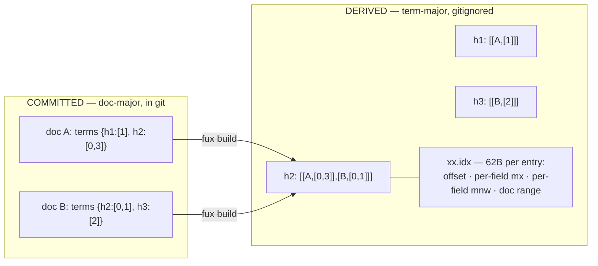

# ADR-POSTINGS — the postings, committed and derived

- **Name:** `ADR-POSTINGS` — cite this everywhere; never cite the number
- **Status:** proposed
- **Supersedes (on acceptance):** nothing — the postings shape was recorded
  only in passing, across two other records
- **Owns:** **`tools/pruning-eval/`** — the gate harness and its frozen pre-registrations, **re-homed here 2026-08-22** when W-38 was dropped and left it orphaned; it belongs with the record that owns the pruning decision and now carries its standing law. Otherwise **no module** — this record specifies a format that
  [ADR-INDEX-LIFECYCLE](0009_index-lifecycle.md) and
  [ADR-T1-ACCELERATOR](0011_accelerator.md) implement on their two sides
- **Laws:** L2, L3 — see [ADR-LAWS](0001_laws.md); never restated here
- **Date:** 2026-08-18
- **Feature:** the postings — `terms` in the committed record, `postings/` in
  the derived plane
- **Evidence:** [`work/regression/2026-08-18-ingest-and-index/`](../../work/regression/2026-08-18-ingest-and-index/report.md) §§2–3

---

## §1 — For humans

A posting is the atom of retrieval: *this term occurs in this document, this
many times, in these fields*. Fux stores the same set of postings **twice, in
two shapes**, because the two consumers want opposite things.

**Git wants doc-major.** One document's edit should touch one line. So the
committed record carries its own postings inline: `terms` maps a 16-hex term
hash to a **five-element sparse tf list**, one slot per field in `TF_FIELDS`
order and trailing zeros omitted. Edit one document, and exactly one line of one
shard changes. A term-major committed index would spray that edit across every
term the document contains — an unreviewable diff and a merge conflict per term.

> **Amended 2026-08-24 (W-76 Phase 1).** This read *"`terms` maps a term hash to
> `[heading_tf, body_tf]`"* — two fields, both always written. There are five
> now (`body`, `heading`, `title`, `path`, `ctx`), and the list is **sparse**:
> trailing zeros are not written at all, so a body-only posting is `[1]` rather
> than `[1,0,0,0,0]`. That is not a cosmetic saving and it is why `body` is
> first in the order. Measured on this repo, **92.5 % of postings are
> body-only**, so the sparse body-first encoding came in **-36.7 %** on tf
> bytes *while the field count went from two to five*; the naive dense
> five-slot form would have been **+24 %**. The field order is therefore a
> committed format decision, not a preference — see
> [ADR-RANKING](0012_ranking.md).

**Queries want term-major.** Answering "index format canonical" means walking
three terms, not five thousand documents. So the derived plane inverts it: one
line per block of 128 postings for a term, with a binary side-table giving each
block's position and its best possible score.

**The full postings are permanent.** Pruning them was measured and failed —
the best selector landed 35.9 points below unpruned recall@20 at 6 % retention.
That branch is closed, not paused.

**Diagram — Mermaid and its ASCII twin. Update both, always, together.**



<details>
<summary><b>ASCII twin</b> — the same diagram, for terminals, diffs, and any reader without a Mermaid renderer</summary>

```text
  COMMITTED  (doc-major, in git)          DERIVED  (term-major, gitignored)
  ------------------------------         ---------------------------------
  doc A: terms { h1:[1],                 h1 -> [[A,[1]]]
                 h2:[0,3] }              h2 -> [[A,[0,3]], [B,[0,1]]]
  doc B: terms { h2:[0,1],   --build-->  h3 -> [[B,[2]]]
                 h3:[2] }
                                         xx.idx: 62 bytes per entry
  tf slots are (body, heading, title,           offset · length
  path, ctx) with trailing zeros                mx[5] · mnw[5]   <- per field,
  omitted -- [1] is body-only                                       UNWEIGHTED
                                                first_doc · last_doc · count
  edit doc A -> ONE line changes
  (this is why git gets doc-major)

  Same postings. Opposite shapes. One is reviewed; the other is rebuilt.
```

</details>

> **Amended 2026-08-24 (W-76 Phase 1) — both halves of the pair, together.**
> Both diagrams drew two-element tf pairs, a flat `[docidx, heading_tf,
> body_tf]` derived posting, and a 40-byte offset entry carrying one scalar
> `mx` and one scalar `mnw`. All three are stale. The tf slot is a **sparse
> five-element list**, so the derived posting nests it — `[docidx, [tf…]]` —
> rather than spreading it across the row, which is what keeps the shape
> readable as the field count changes. The offset entry is **62 bytes**, and
> its `mx`/`mnw` are **per-field arrays and deliberately unweighted**, because
> a weighted extremum cannot be precomputed once when the weights are
> query-time tune keys; `derive/accel.py::block_bound` recombines them at the
> weights in force ([ADR-T1-ACCELERATOR](0011_accelerator.md)).

### Examples

**Committed** — postings inline in the document's own record, a sparse
five-slot tf list per term hash, in `TF_FIELDS` order and with trailing zeros
omitted. From this record's own line in the live index:

```json
"terms": {
  "0097ee914e37dedf": [1],
  "0434edd58f20e873": [1, 1],
  "1fc5bd8679f757f5": [35, 0, 0, 1],
  "70d128b81140b42d": [22, 1, 1, 1]
}
```

Read those four in order: body only; body and heading; a term that occurs 35
times in the body and once in the **path**, where the interior zeros must be
written because a later slot is non-zero; and a term in body, heading, title
and path at once. The same trimming applies to `flen`, which for this document
is `[1827, 141, 6, 6]` — four numbers, not five, because `ctx` is empty and an
empty trailing field is not written at all.

**Derived** — one line per block, `[term_hash, [[docidx, [tf…]], …]]`:

```console
$ grep -m1 '"0327703c9f10dbf6"' .fux/runtime/postings/03.jsonl
["0327703c9f10dbf6",[[291,[2]],[295,[2]]]]
```

**The field order is not guessable, so it is pinned** in every shard's header:

```json
{"_format":"fux.index.v2","analyzer":"v2","tf_fields":["body","heading","title","path","ctx"]}
```

> **Amended 2026-08-24 (W-76 Phase 1).** This block was introduced as the
> current pinned header and read
> *`{"_format":"fux.index.v1","analyzer":"v1","tf_fields":["heading","body"]}`*.
> All three values moved at once, and they moved together on purpose: the tf
> arity, the tf **order**, and the analyzer are exactly the three things a
> reader cannot recover from the postings themselves, so a shard that pins one
> without the others is worse than useless. `store/reader.py` **refuses** a
> shard whose header does not match the running build rather than mixing it in
> — two analyzers in one index is undetectable at query time and corrupts every
> `df`, and a `[1, 2]` read under the old order silently swaps body for
> heading. The examples above it were re-taken from the live `v2` index rather
> than rewritten by hand.

---

## §2 — For agents

### Context

An inverted index is term-major by default — that is what "inverted" means, and
every textbook builds it that way. Fux commits its index to git, which changes
the calculation completely.

A term-major committed index means a one-word edit touches every term line that
word appears on. The diff is unreadable, two branches editing unrelated
documents conflict on shared terms, and the review that the committed-index
premise exists to enable becomes impossible.

Doc-major in git solves that and makes querying linear in the corpus. Hence two
shapes — and the obligation to keep them equal.

> **Re-checked against the 10 000-document design point, 2026-08-22 (W-65).**
> This paragraph used to open *"At 10⁵–10⁶ documents…"*, and that phrase was
> the reason W-65 named this record *"the one to think hardest about"*: the
> scale looked like the premise of the doc-major decision.
>
> **It is not, and the decision does not move.** What makes term-major
> unreviewable in git is *structural* — a posting list is keyed by term, so
> editing one document rewrites every line for every word it contains,
> whatever the corpus size. Scale sets the **magnitude** of the damage, not
> its direction. At 10 000 documents with an ordinary Zipfian vocabulary a
> common term's posting list still runs to thousands of entries, so a one-word
> edit still produces a diff nobody reads and still conflicts with an unrelated
> branch touching the same word.
>
> The scale clause was therefore removed rather than divided by ten: it was
> emphasis, and leaving a number there would have implied the decision is
> re-derivable from arithmetic it never rested on. **The argument survives at
> the new design point unchanged, and the smallest corpus at which it stops
> holding has never been measured** — nobody has needed it to be, because the
> committed index is doc-major at every size fux ships.

### Decision

**1. Committed postings are inline and doc-major.** `terms` in the record maps
a **16-hex term hash** to a **five-element sparse tf list** — one slot per field
in `TF_FIELDS` order, trailing zeros omitted.

> **Amended 2026-08-24 (W-76 Phase 1).** This read *"maps a 16-hex term hash to
> `[heading_tf, body_tf]`"*. The hash is unchanged; the value is not. Five
> fields (`body`, `heading`, `title`, `path`, `ctx`) replaced two because two
> could not carry enrichment vocabulary or a path without folding them into
> `body`, where no field weight could reach them ([ADR-RANKING](0012_ranking.md)
> decision 1). **Sparsity is what paid for the extra three**: trailing zeros are
> never written, 92.5 % of postings are body-only, and body-first ordering
> measured **-36.7 %** on tf bytes *while going from two fields to five*. The
> integer rule below (decision 4) is untouched, and so is the one-line-per-
> document property this decision exists for.

**2. The key is a hash, not the term.** 8-byte blake2b. It bounds the key size,
and it means the committed index does not carry a readable vocabulary of a
private corpus. **Collisions fail the build** — two distinct terms sharing a
digest would silently merge their postings, so a single tracker spans the whole
ingest run and raises on any clash.

**3. Field order is pinned in the header**, not by convention. `tf_fields`
makes `[0, 1]` unambiguous to a reader that has never seen this code.

**4. Term frequencies are integers.** No floats anywhere in the committed
plane — floats are not byte-reproducible across platforms, and the
byte-identical guarantee is the whole basis of the design.

**5. Derived postings are term-major and blocked at 128.** One JSON line per
block: `[term_hash, [[docidx, [tf…]], …]]`. `docidx` is a position in
`docs.jsonl`, not an `id` — an integer keeps the block line small and the block
scan tight.

> **Amended 2026-08-24 (W-76 Phase 1).** This read *"`[term_hash, [[docidx,
> heading_tf, body_tf], …]]`"* — a flat row, with the tf values spread out
> beside the `docidx`. The tf list is **nested** now, one element of the row
> rather than the tail of it. That is the shape that survives a field count
> changing: a flat row has to be re-specified every time the arity moves, and a
> reader has no way to tell a two-field row from a truncated three-field one.
> Nesting also lets the derived posting reuse the committed record's tf list
> **verbatim**, trailing zeros already trimmed, which is what makes the two
> planes checkably the same information rather than two encodings of it.

**6. Each postings shard has a binary offset table beside it**, 62 bytes per
entry, sorted by `(term, block_no)` so a term's blocks are one bisect and a
contiguous read. Contents and rationale in
[ADR-T1-ACCELERATOR](0011_accelerator.md).

> **Amended 2026-08-24 (W-76 Phase 1 + W-73).** This read *"40 bytes per
> block"*. The entry grew to **62 bytes** because its two summary scalars
> became **per-field arrays** — `mx` and `mnw` are now `5H` and `5I`, and
> deliberately **unweighted**. A *weighted* extremum cannot be precomputed once
> when the field weights are query-time tune keys, which was W-73's defect;
> `derive/accel.py::block_bound` recombines the arrays at the weights in force
> instead. The cost of the looser per-field bound was measured at **+0.0 %
> blocks scanned**. **The offset table is derived and disposable**, so growing
> it by 22 bytes an entry costs a rebuild and nothing in git — which is exactly
> why the arrays could go here rather than into the committed plane. The
> layout itself belongs to [ADR-T1-ACCELERATOR](0011_accelerator.md); this
> record only names its size.

**7. Both planes shard on the first hash byte** — the committed store by
document id, the postings by term hash. Same 256-way split, same reasoning.

**8. Postings are never pruned.** Measured and closed: the gate failed at 35.9
points below unpruned recall@20. Any future pruning work is forbidden outside
the M8 deferred item.

**9. Stopwords never become postings.** Filtering happens in the shared
tokenizer, so a stopword is absent from both planes rather than filtered at
query time ([ADR-RANKING](0012_ranking.md)).

### Consequences

- **Pruning work is forbidden outside a dedicated, sign-off'd item — re-homed
  here 2026-08-22.** This was W-38's "standing law" and moved when Arpit removed
  that item from the queue. **It is a consequence of P1, not a preference:**
  [P1-RERUN](../../work/regression/2026-08-09-pruning-rerun/VERDICT.md) measured
  five selectors at matched retention and the best arm came in **35.9 points
  below unpruned recall@20**, which is what put *full postings, permanently*
  (option E) into this record. **If pruning appears in any other milestone's
  diff, that is a plan violation, not a bonus** — and the reason is that a
  pruning change looks like a size win and is measured as a recall loss, so it
  is exactly the kind of work that gets waved through on the wrong metric.
  The parked idea itself survives as
  `query-log-pruning.md` (archived 2026-08-25).


- **A document edit is one line in one shard.** The reviewable-diff property
  the committed index exists for.
- **Merges land per document.** Two branches editing different documents touch
  different lines, usually different shards.
- **The committed index carries no readable vocabulary.** A consequence of
  hashing keys, and a real privacy property for a private corpus.
- **The derived plane is roughly the same information again**, on disk, so
  `.fux/runtime/` is comparable in size to `.fux/index/`. It is gitignored, so
  this costs disk and not repository size.
- **A term hash is only meaningful within one analyzer version.** `analyzer` in
  the header is what makes that checkable; change the tokenizer and every
  posting must be rebuilt.
- **Full postings set the committed size floor.** P1-RERUN closed the
  only lever that would have lowered it; M6's density target has to be met
  another way.

### Alternatives considered

- **Term-major in the committed plane** — the textbook shape. Rejected: it
  destroys the per-document diff and merge behaviour, which is the reason the
  index is in git at all.
- **Store terms as plain strings.** Rejected: larger keys, and it publishes the
  corpus's vocabulary into git.
- **Prune low-impact postings** to shrink the committed plane. **Measured and
  rejected** — best arm 35.9 points below unpruned recall@20 at 6 % retention.
- **Positions, not just frequencies**, to enable phrase queries. Rejected for
  now: it multiplies committed size for a capability nothing has asked for. A
  phrase-query requirement is the evidence that reopens it.
- **Impact-quantised postings** (4-bit impacts, as the wire-format compare doc
  proposed). Superseded for the committed plane by the tiered-JSONL decision;
  it survives inside tier T2, which is M6.
- **Skip the derived plane; query the committed shards term-major on the fly.**
  Rejected on measurement: that is the scan, at 4 248.8 ms p95.

### Reference (required)

- Committed side — [`src/fux/store/writer.py`](../../src/fux/store/writer.py)
  (`hash_terms`), [`format.py`](../../src/fux/store/format.py) (`term_hash`),
  [`collisions.py`](../../src/fux/store/collisions.py).
- Derived side — [`src/fux/derive/build.py`](../../src/fux/derive/build.py) and
  [`format.py`](../../src/fux/derive/format.py) (the 62-byte entry layout —
  **amended 2026-08-24**, this said *"the 40-byte entry layout"*; that module's
  own docstring now carries the `<8sHQI` + `5H` + `5I` + `IIH` breakdown and
  the reason the two extrema became per-field arrays).
- Both shapes, captured —
  [`work/regression/2026-08-18-ingest-and-index/`](../../work/regression/2026-08-18-ingest-and-index/report.md) §§2–3.
- The pruning verdict — P1-RERUN and
  [`work/regression/2026-08-09-pruning-rerun/`](../../work/regression/2026-08-09-pruning-rerun/).
- Inverted-index organisation, doc-major vs term-major — Zobel & Moffat,
  *Inverted Files for Text Search Engines* (ACM Computing Surveys, 2006):
  https://dl.acm.org/doi/10.1145/1132956.1132959
- The other generated files the derived plane writes alongside `postings/`,
  each with its own record — [ADR-CACHEDIR-TAG](0023_cachedir-tag.md),
  [ADR-DOCS-TABLE](0024_docs-table.md), [ADR-CODES-TABLE](0025_codes-table.md),
  [ADR-RUNTIME-MANIFEST](0026_runtime-manifest.md),
  [ADR-RUNTIME-STAMP](0027_runtime-stamp.md),
  [ADR-RUNTIME-STATS](0028_runtime-stats.md).

### Veto condition

**Reopen this decision if** the two shapes stop agreeing, if a phrase-query
requirement arrives, or if committed density blocks M6.

**How to check it:**

```bash
# 1. the two shapes still agree — the differential law over the whole corpus
python3 tools/differential/run.py

# 2. no floats have appeared in a committed posting
grep -oE '"[0-9a-f]{16}":\[[^]]*\]' .fux/index/*.jsonl | grep '\.' && echo "VETO: float in postings"

# 3. collisions still fail the build rather than merging silently
grep -n 'term-hash collision' src/fux/store/collisions.py

# 4. committed index size — informational only, no threshold, by ruling.
#    ⚠ 2026-08-22 (Arpit): **R7 IS RETIRED AND HAS NO SUCCESSOR.** The budget
#    read "<= 250 MB packed @100k docs", frozen against a 10^5-10^6 design
#    point. Arpit retired the promise outright rather than re-deriving it:
#    "remove that promise, it's not needed... nothing related to fifty
#    thousand or hundred thousand should be tested or committed, or have
#    rules or promises for it."
#    So this is a MEASUREMENT, never a gate. Print the number, watch it over
#    time, and read NO pass or fail off it. A size promise returns only if
#    Arpit reopens one, at 10 000 documents, as a new prediction with a new id.
#    `du -sh` is working-tree size, not "packed" — isolate the index in a
#    scratch repo and measure the real pack.
bash work/regression/2026-08-21-r7-preliminary-analysis/evidence/pack_compression.sh
```

**R7 preliminary read (2026-08-21, not a measured verdict — no
pre-registration exists):** real git-pack compression on this repo's own
committed index measures **2.429×**, extrapolating to **~470 MB at 100k
docs — ~2× over budget**. That number is against today's plain-JSON
placeholder, not this record's designed encoding, which is still unbuilt —
see [the analysis](../../work/regression/2026-08-21-r7-preliminary-analysis/ANALYSIS.md)
before treating this as evidence the design itself is too big.
---

## References

*Every source this record cites, gathered in one place. §2's **Reference
(required)** names the grounding; this is the complete list. An archived
document is never listed here — the body may name one, but archive is not
evidence.*

**Records** — [ADR-LAWS](0001_laws.md) ·
[ADR-INDEX-LIFECYCLE](0009_index-lifecycle.md) ·
[ADR-T1-ACCELERATOR](0011_accelerator.md) · [ADR-RANKING](0012_ranking.md) ·
[ADR-CACHEDIR-TAG](0023_cachedir-tag.md) ·
[ADR-DOCS-TABLE](0024_docs-table.md) · [ADR-CODES-TABLE](0025_codes-table.md)
· [ADR-RUNTIME-MANIFEST](0026_runtime-manifest.md) ·
[ADR-RUNTIME-STAMP](0027_runtime-stamp.md) ·
[ADR-RUNTIME-STATS](0028_runtime-stats.md)

**Code**

- [`src/fux/derive/build.py`](../../src/fux/derive/build.py)
- [`src/fux/derive/format.py`](../../src/fux/derive/format.py)
- [`src/fux/store/collisions.py`](../../src/fux/store/collisions.py)
- [`src/fux/store/format.py`](../../src/fux/store/format.py)
- [`src/fux/store/writer.py`](../../src/fux/store/writer.py)

**Measured evidence**

- [`work/regression/2026-08-09-pruning-rerun/`](../../work/regression/2026-08-09-pruning-rerun/)
- [`work/regression/2026-08-09-pruning-rerun/VERDICT.md`](../../work/regression/2026-08-09-pruning-rerun/VERDICT.md)
- [`work/regression/2026-08-18-ingest-and-index/report.md`](../../work/regression/2026-08-18-ingest-and-index/report.md)
- [`work/regression/2026-08-21-r7-preliminary-analysis/ANALYSIS.md`](../../work/regression/2026-08-21-r7-preliminary-analysis/ANALYSIS.md)

**Project docs**

- `work/proposals/query-log-pruning.md` (archived 2026-08-25)

**Papers and specifications**

- Zobel & Moffat, *Inverted Files for Text Search Engines* (ACM Computing
  Surveys, 2006) — doc-major vs term-major organisation
  <https://dl.acm.org/doi/10.1145/1132956.1132959>
