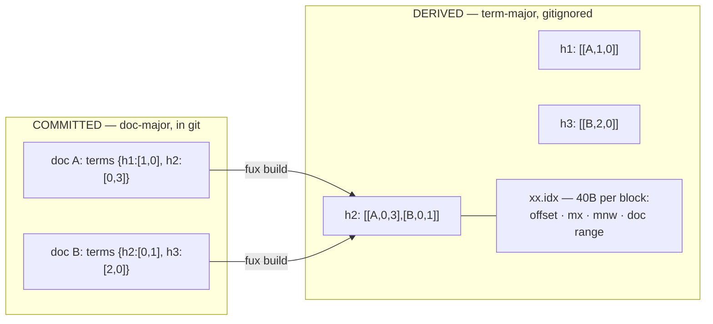

# ADR-POSTINGS — the postings, committed and derived

- **Name:** `ADR-POSTINGS` — cite this everywhere; never cite the number
- **Status:** proposed
- **Supersedes (on acceptance):** nothing — the postings shape was recorded
  only in passing, across two other records
- **Owns (on acceptance):** no module. This record specifies a format that
  [ADR-INDEX-LIFECYCLE](0009_index-lifecycle.md) and
  [ADR-T1-ACCELERATOR](0011_accelerator.md) implement on their two sides
- **Laws:** L2, L3 — see [ADR-LAWS](0001_laws.md); never restated here
- **Date:** 2026-08-18
- **Feature:** the postings — `terms` in the committed record, `postings/` in
  the derived plane
- **Evidence:** [`work/regression/2026-08-18-ingest-and-index/`](../../work/regression/2026-08-18-ingest-and-index/report.md) §§2–3

---

## §1 — For humans

A posting is the atom of retrieval: *this term occurs in this document, this
many times, in these fields*. Fux stores the same set of postings **twice, in
two shapes**, because the two consumers want opposite things.

**Git wants doc-major.** One document's edit should touch one line. So the
committed record carries its own postings inline: `terms` maps a term hash to
`[heading_tf, body_tf]`. Edit one document, and exactly one line of one shard
changes. A term-major committed index would spray that edit across every term
the document contains — an unreviewable diff and a merge conflict per term.

**Queries want term-major.** Answering "index format canonical" means walking
three terms, not five thousand documents. So the derived plane inverts it: one
line per block of 128 postings for a term, with a binary side-table giving each
block's position and its best possible score.

**The full postings are permanent.** Pruning them was measured and failed —
the best selector landed 35.9 points below unpruned recall@20 at 6 % retention.
That branch is closed, not paused.

**Diagram — Mermaid and its ASCII twin. Update both, always, together.**



<details>
<summary><b>ASCII twin</b> — the same diagram, for terminals, diffs, and any reader without a Mermaid renderer</summary>

```text
  COMMITTED  (doc-major, in git)          DERIVED  (term-major, gitignored)
  ------------------------------         ---------------------------------
  doc A: terms { h1:[1,0],               h1 -> [[A,1,0]]
                 h2:[0,3] }              h2 -> [[A,0,3], [B,0,1]]
  doc B: terms { h2:[0,1],   --build-->  h3 -> [[B,2,0]]
                 h3:[2,0] }
                                         xx.idx: 40 bytes per block
  edit doc A -> ONE line changes                offset · length
  (this is why git gets doc-major)              mx · mnw
                                                first_doc · last_doc · count

  Same postings. Opposite shapes. One is reviewed; the other is rebuilt.
```

</details>

### Examples

**Committed** — postings inline in the document's own record, `[heading_tf,
body_tf]` per term hash:

```json
"terms": {
  "15b18d006e8a6e50": [0, 1],
  "3d48c93aa729e567": [1, 0],
  "590407b549d6e3b4": [0, 2]
}
```

**Derived** — one line per block, `[term_hash, [[docidx, heading_tf,
body_tf], …]]`:

```console
$ head -1 .fux/runtime/postings/03.jsonl
["0344439b989e1c65",[[0,0,1]]]
```

**The field order is not guessable, so it is pinned** in every shard's header:

```json
{"_format":"fux.index.v1","analyzer":"v1","tf_fields":["heading","body"]}
```

---

## §2 — For agents

### Context

An inverted index is term-major by default — that is what "inverted" means, and
every textbook builds it that way. Fux commits its index to git, which changes
the calculation completely.

At 10⁵–10⁶ documents, a term-major committed index means a one-word edit
touches every term line that word appears on. The diff is unreadable, two
branches editing unrelated documents conflict on shared terms, and the review
that the committed-index premise exists to enable becomes impossible.

Doc-major in git solves that and makes querying linear in the corpus. Hence two
shapes — and the obligation to keep them equal.

### Decision

**1. Committed postings are inline and doc-major.** `terms` in the record maps
a **16-hex term hash** to `[heading_tf, body_tf]`.

**2. The key is a hash, not the term.** 8-byte blake2b. It bounds the key size,
and it means the committed index does not carry a readable vocabulary of a
private corpus. **Collisions fail the build** — two distinct terms sharing a
digest would silently merge their postings, so a single tracker spans the whole
ingest run and raises on any clash.

**3. Field order is pinned in the header**, not by convention. `tf_fields`
makes `[0, 1]` unambiguous to a reader that has never seen this code.

**4. Term frequencies are integers.** No floats anywhere in the committed
plane — floats are not byte-reproducible across platforms, and the
byte-identical guarantee is the whole basis of the design.

**5. Derived postings are term-major and blocked at 128.** One JSON line per
block: `[term_hash, [[docidx, heading_tf, body_tf], …]]`. `docidx` is a
position in `docs.jsonl`, not an `id` — an integer keeps the block line small
and the block scan tight.

**6. Each postings shard has a binary offset table beside it**, 40 bytes per
block, sorted by `(term, block_no)` so a term's blocks are one bisect and a
contiguous read. Contents and rationale in
[ADR-T1-ACCELERATOR](0011_accelerator.md).

**7. Both planes shard on the first hash byte** — the committed store by
document id, the postings by term hash. Same 256-way split, same reasoning.

**8. Postings are never pruned.** Measured and closed: the gate failed at 35.9
points below unpruned recall@20. Any future pruning work is forbidden outside
the M8 deferred item.

**9. Stopwords never become postings.** Filtering happens in the shared
tokenizer, so a stopword is absent from both planes rather than filtered at
query time ([ADR-RANKING](0012_ranking.md)).

### Consequences

- **A document edit is one line in one shard.** The reviewable-diff property
  the committed index exists for.
- **Merges land per document.** Two branches editing different documents touch
  different lines, usually different shards.
- **The committed index carries no readable vocabulary.** A consequence of
  hashing keys, and a real privacy property for a private corpus.
- **The derived plane is roughly the same information again**, on disk, so
  `.fux/runtime/` is comparable in size to `.fux/index/`. It is gitignored, so
  this costs disk and not repository size.
- **A term hash is only meaningful within one analyzer version.** `analyzer` in
  the header is what makes that checkable; change the tokenizer and every
  posting must be rebuilt.
- **Full postings set the committed size floor.** P1-RERUN closed the
  only lever that would have lowered it; M6's density target has to be met
  another way.

### Alternatives considered

- **Term-major in the committed plane** — the textbook shape. Rejected: it
  destroys the per-document diff and merge behaviour, which is the reason the
  index is in git at all.
- **Store terms as plain strings.** Rejected: larger keys, and it publishes the
  corpus's vocabulary into git.
- **Prune low-impact postings** to shrink the committed plane. **Measured and
  rejected** — best arm 35.9 points below unpruned recall@20 at 6 % retention.
- **Positions, not just frequencies**, to enable phrase queries. Rejected for
  now: it multiplies committed size for a capability nothing has asked for. A
  phrase-query requirement is the evidence that reopens it.
- **Impact-quantised postings** (4-bit impacts, as the wire-format compare doc
  proposed). Superseded for the committed plane by the tiered-JSONL decision;
  it survives inside tier T2, which is M6.
- **Skip the derived plane; query the committed shards term-major on the fly.**
  Rejected on measurement: that is the scan, at 4 248.8 ms p95.

### Reference (required)

- Committed side — [`src/fux/store/writer.py`](../../src/fux/store/writer.py)
  (`hash_terms`), [`format.py`](../../src/fux/store/format.py) (`term_hash`),
  [`collisions.py`](../../src/fux/store/collisions.py).
- Derived side — [`src/fux/derive/build.py`](../../src/fux/derive/build.py) and
  [`format.py`](../../src/fux/derive/format.py) (the 40-byte entry layout).
- Both shapes, captured —
  [`work/regression/2026-08-18-ingest-and-index/`](../../work/regression/2026-08-18-ingest-and-index/report.md) §§2–3.
- The pruning verdict — P1-RERUN and
  [`work/regression/2026-08-09-pruning-rerun/`](../../work/regression/2026-08-09-pruning-rerun/).
- Inverted-index organisation, doc-major vs term-major — Zobel & Moffat,
  *Inverted Files for Text Search Engines* (ACM Computing Surveys, 2006):
  https://dl.acm.org/doi/10.1145/1132956.1132959
- The other generated files the derived plane writes alongside `postings/`,
  each with its own record — [ADR-CACHEDIR-TAG](0024_cachedir-tag.md),
  [ADR-DOCS-TABLE](0025_docs-table.md), [ADR-CODES-TABLE](0026_codes-table.md),
  [ADR-RUNTIME-MANIFEST](0027_runtime-manifest.md),
  [ADR-RUNTIME-STAMP](0028_runtime-stamp.md),
  [ADR-RUNTIME-STATS](0029_runtime-stats.md).

### Veto condition

**Reopen this decision if** the two shapes stop agreeing, if a phrase-query
requirement arrives, or if committed density blocks M6.

**How to check it:**

```bash
# 1. the two shapes still agree — the differential law over the whole corpus
python3 tools/differential/run.py

# 2. no floats have appeared in a committed posting
grep -oE '"[0-9a-f]{16}":\[[^]]*\]' .fux/index/*.jsonl | grep '\.' && echo "VETO: float in postings"

# 3. collisions still fail the build rather than merging silently
grep -n 'term-hash collision' src/fux/store/collisions.py

# 4. committed density against the M6 budget (<= 250 MB packed @100k docs).
#    `du -sh` is working-tree size, not "packed" — isolate the index in a
#    scratch repo and measure the real pack, the way the 2026-08-21
#    preliminary analysis did (see below, and its evidence/pack_compression.sh)
bash work/regression/2026-08-21-r7-preliminary-analysis/evidence/pack_compression.sh
```

**R7 preliminary read (2026-08-21, not a measured verdict — no
pre-registration exists):** real git-pack compression on this repo's own
committed index measures **2.429×**, extrapolating to **~470 MB at 100k
docs — ~2× over budget**. That number is against today's plain-JSON
placeholder, not this record's designed encoding, which is still unbuilt —
see [the analysis](../../work/regression/2026-08-21-r7-preliminary-analysis/ANALYSIS.md)
before treating this as evidence the design itself is too big.
