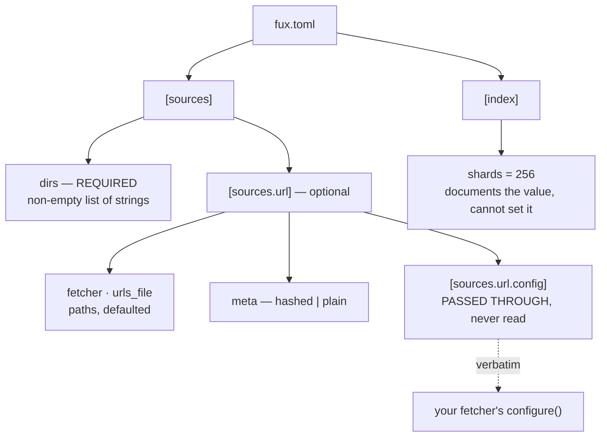

# ADR-CONFIG — `fux.toml` and every property in it

- **Name:** `ADR-CONFIG` — cite this everywhere; never cite the number
- **Status:** accepted
- **Supersedes:** `ADR-FUX-DIR` — **archived 2026-08-18** at
  [`archive/adr/`](../../archive/adr/README.md); it may be named, never cited
- **Owns:** `src/fux/config.py` — more specific than
  [ADR-DOTFUX](0003_fux-directory.md)'s claim, which keeps `fuxdir.py` and
  `doctor.py`
- **Laws:** L4, L5, L7 — see [ADR-LAWS](0001_laws.md); never restated here
- **Date:** 2026-08-18
- **Feature:** `fux.toml` — discovery, schema, validation
- **Evidence:** [`work/regression/2026-08-18-ingest-and-index/`](../../work/regression/2026-08-18-ingest-and-index/report.md) §6

---

## §1 — For humans

A working `fux.toml` is three lines:

```toml
[sources]
dirs = ["docs"]
```

That is the whole required surface. Everything else is either a default worth
seeing written down, or the URL source, which is opt-in.

Two properties of the schema are worth knowing before you read the table.

**Every key fux reads is validated, loudly, with the file and the offending
value named.** A typo is a stopped run, not a silent default — a
misconfigured source that quietly indexes nothing looks exactly like a ranking
problem, and costs a day to diagnose.

**Exactly one table is deliberately *not* read: `[sources.url.config]`.** It is
handed to your fetcher verbatim and fux never looks inside it. That is what
stops one fetcher's vocabulary — `cdp_port`, `settle_ms` — from leaking into
fux's schema and turning the adapter cap into a formality. Same discipline as
PEP 518's `[tool.*]` tables.

**Diagram — Mermaid and its ASCII twin. Update both, always, together.**



<details>
<summary><b>ASCII twin</b> — the same diagram, for terminals, diffs, and any reader without a Mermaid renderer</summary>

```text
   fux.toml
     |
     +-- [sources]
     |     +-- dirs            REQUIRED  non-empty list of strings
     |     |
     |     +-- [sources.url]   optional -- the whole URL source
     |           +-- fetcher   path, default .fux/fetchers/cdp.py
     |           +-- urls_file    path, default .fux/sources/urls
     |           +-- meta         "hashed" (default) | "plain"
     |           +-- [sources.url.config]
     |                 PASSED THROUGH VERBATIM -- fux never reads a key
     |                        |
     |                        +--> your fetcher's configure(config)
     |
     +-- [index]
           +-- shards = 256   documents the value; cannot change it
```

</details>

### Examples

Minimal — the only required key:

```toml
[sources]
dirs = ["docs"]
```

Everything, annotated — from the fixture behind the capture:

```toml
[sources]
dirs = ["docs", "work", "README.md", "CLAUDE.md", "archive/v0.26-docs"]

[sources.url]
fetcher = ".fux/fetchers/demo.py"   # YOUR code; fux loads it by path
urls_file  = ".fux/sources/urls"         # one URL per line, a file not an array
meta       = "hashed"                    # the default; "plain" for public content

[sources.url.config]
greeting = "hello"                       # the fetcher's vocabulary, never fux's

[index]
shards = 256                             # documents the value, cannot set it
```

A rejected key, named precisely rather than defaulted:

```console
$ fux ingest
error: /repo/fux.toml: [sources.url] meta must be "hashed" or "plain" (got 'hased')
# exit 1
```

---

## §2 — For agents

### Context

Configuration is where a tool's scope quietly expands. Every adapter wants a
key; every key becomes a compatibility obligation; and a schema that knows
about `cdp_port` has already absorbed one integration's vocabulary into the
engine.

Fux's adapter cap only survives if configuration stays small enough that
extending it is visibly a decision rather than a convenience.

### Decision

**1. Root discovery: the nearest ancestor holding `fux.toml` or `.git`.**
`fux.toml` wins when both are at the same level. Not finding a root is not an
error in the loader — the caller decides whether it is fatal, which is why
`fux doctor` can report on a directory that `fux ask` refuses.

**2. There are no required keys.** Amended 2026-08-19: `[sources] dirs` was
the one required key and is now **retired** — the corpus lives in
`.fux/sources/dirs`, one entry per line ([ADR-DIR-LIST](0023_dir-list.md)
decision 1). `[sources] dirs_file` says where that file is and defaults to it,
so a `fux.toml` holding nothing but `[index] shards` is valid. **`fux.toml` is
policy; the source lists are the corpus**, and that is the whole reason the key
moved.

**3. `[index] shards` documents 256 and cannot change it.** Supplying any other
value is an error, not a silent override: the shard function is
`blake2b(id, digest_size=1)`, and changing the count rewrites every path in the
tree. The key exists so the number is *visible* rather than folklore.

**4. `[sources.url]` is entirely optional.** Absent means no URL source, and
`--refresh-urls` has nothing to do.

**5. `fetcher` and `urls_file` default to `.fux/fetchers/http.py` and
`.fux/sources/urls`.** Both are repo-relative paths, and both defaults are the
declared `.fux/` layout ([ADR-DOTFUX](0003_fux-directory.md)). **Amended
2026-08-19:** the default was `.fux/fetchers/cdp.py` and is now the plain-GET
fetcher, because a URL line carrying no `fetch=` means `fetch=http`
([ADR-HTTP-FETCHER](0021_http-fetcher.md) decision 1).

**`fetcher` carries two things, deliberately.** It is the file used by a line
that declares no `fetch=`, **and** its directory is where a `fetch=<name>`
resolves — `<parent of fetcher>/<name>.py`. One key, so a consumer who keeps
their fetchers somewhere other than `.fux/fetchers/` moves all of them at
once and no line has to know. A second key naming the directory would be two
values that must agree.

**6. `meta` is `"hashed"` by default, `"plain"` by explicit opt-in.** Hashed
closes an ACL-mismatch leak, so the default is a safety property rather than a
preference. Any other value is an error.

**7. A retired key errors with instructions.** Three of them now, and the
pattern is the same each time — a retired key that silently does nothing is
worse than one that stops the run, because "silently does nothing" here means
indexing the wrong corpus or fetching through the wrong file.

| retired key | says | since |
|---|---|---|
| `[sources.url] urls` | put one URL per line in `.fux/sources/urls` | 0.31.x |
| `[sources.url] middleware` | renamed to `fetcher`; move the file to `.fux/fetchers/` | 2026-08-19, [ADR-FETCHER](0019_fetcher.md) decision 7 |
| `[sources] dirs` | put one directory per line in `.fux/sources/dirs`; a line may carry `archived=true` | 2026-08-19, [ADR-DIR-LIST](0023_dir-list.md) decision 1 |

**A retired key errors whatever its value.** `dirs = []` stops the run exactly
as `dirs = ["docs"]` does: the key is retired, not merely unused, and a reader
that tolerates the empty form teaches people the key still exists.

**8. `[sources.url.config]` is validated as *a table* and nothing more.** It is
passed to the fetcher's `configure()` verbatim. Fux never reads a key inside
it, and must never gain a reason to.

**9. Validation errors name the file and the offending value.** `FuxError` at
the boundary, rendered by the CLI, exit 1.

### Consequences

- **A third source-list path constant, and still no required key**
  (2026-08-20). `DEFAULT_TYPES_FILE = ".fux/sources/types"` joins `dirs_file`
  and `urls_file` here because paths have one home — but unlike those two it
  has **no `fux.toml` key at all**, and deliberately: the types list is
  optional, its absence is meaningful (the built-in default applies), and a key
  whose only job is to relocate an optional file is surface nobody asked for.
  Decided in [ADR-TYPES](0032_types-list.md).

- **The config fits on a screen**, so a new consumer reads all of it.
- **The adapter cap holds at the schema level.** Adding a fetcher needs no
  fux change at all — which is the property that makes "three adapters" a
  decision rather than a queue.
- **`shards` is a documentation-only key**, which is unusual and mildly
  surprising. Worth the surprise: the alternative is folklore about where 256
  comes from.
- **`work` had to be added to `dirs` when the docs moved** (2026-08-18), or the
  engine would have stopped being able to answer questions about its own state
  of play. An include-only source list makes that an easy thing to forget.
- **`dirs` is include-only, with no exclusions** — so committed measurement
  evidence under `work/regression/` contaminates the corpus it measures. Filed
  as [W-45](../../archive/open/W-45-source-exclusion.md).

### Alternatives considered

- **Configure in `pyproject.toml` under `[tool.fux]`.** Rejected: fux indexes
  repositories that are not Python projects, and half of them have no
  `pyproject.toml`.
- **Read `cdp_port` and friends directly**, so the CDP template needs no
  `configure()`. Rejected explicitly: it puts one fetcher's vocabulary in
  fux's schema and breaches the adapter cap through the back door.
- **Make `shards` configurable.** Rejected until measured. It is a
  format-affecting constant; M6 is where a different value could be justified.
- **Default `meta` to `"plain"` for readability.** Rejected: the default has to
  be the safe one, and hashed is the ACL-safe one.
- **Accept unknown keys silently** for forward compatibility. Rejected: a typo
  in `urls_file` that silently indexes nothing is indistinguishable from a
  retrieval bug.
- **URLs as a TOML array.** Rejected on diff and merge behaviour at enterprise
  scale — the reason the retired key errors loudly today.

### Reference (required)

- The loader and every validation message —
  [`src/fux/config.py`](../../src/fux/config.py); the `[sources.url]`
  dataclass docstring is the normative statement of the opaque-table rule.
- A real config and the errors it produces —
  [`work/regression/2026-08-18-ingest-and-index/`](../../work/regression/2026-08-18-ingest-and-index/report.md) §6
  and its [fixture](../../work/regression/2026-08-19-w54/evidence/fixture.sh),
  which builds a repo from nothing with `fux setup` and runs the whole URL
  path offline.
- The opaque-table discipline this copies — PEP 518 `[tool.*]`:
  https://peps.python.org/pep-0518/#tool-table
- TOML, the format: https://toml.io/en/v1.0.0

### Veto condition

**Reopen this decision if** fux ever reads a key inside `[sources.url.config]`,
or if a source cannot be expressed without a new engine-level key.

**How to check it:**

```bash
# 1. the opaque table is still opaque — this is the adapter cap, at the schema level
grep -rn 'config\[' src/fux/ | grep -v 'test'
# expect: no output. Fux validates that it is a table and passes it on.

# 2. the config surface has not grown
grep -oE '\braw\.get\("[a-z_]+"\)|data\.get\("[a-z]+"' src/fux/config.py | sort -u
# expect: sources, index, fetcher, urls_file, meta, config — and nothing else

# 3. every rejected value still names the file and the value
fux ingest 2>&1 | head -1
# on a bad key, expect: error: <path>/fux.toml: <what> must be <what> (got <value>)
```
