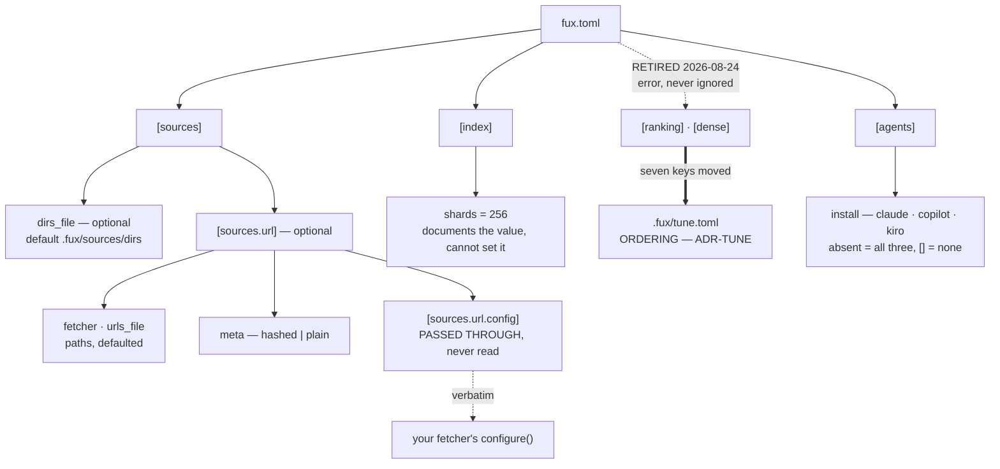

# ADR-CONFIG — `fux.toml` and every property in it

- **Name:** `ADR-CONFIG` — cite this everywhere; never cite the number
- **Status:** accepted
- **Supersedes:** `ADR-FUX-DIR` — **archived 2026-08-18** at
  [`archive/adr/`](../../archive/adr/README.md); it may be named, never cited
- **Owns:** `src/fux/config.py` — more specific than
  [ADR-DOTFUX](0003_fux-directory.md)'s claim, which keeps `fuxdir.py` and
  `doctor.py`
- **Laws:** L4, L5, L7 — see [ADR-LAWS](0001_laws.md); never restated here
- **Date:** 2026-08-18
- **Feature:** `fux.toml` — discovery, schema, validation
- **Evidence:** [`work/regression/2026-08-18-ingest-and-index/`](../../work/regression/2026-08-18-ingest-and-index/report.md) §6

---

> ## Amended 2026-08-25 — the dense lane and the embedding model were DELETED
>
> **`[dense]` in `fux.toml` now names its REMOVAL rather than a new home.**
> The table was retired to `.fux/tune.toml` on 2026-08-24 (ADR-TUNE decision
> 7); on 2026-08-25 the lane itself was deleted, so the forwarding address
> stopped existing too.
>
> **A config old enough to carry `[dense]` is old enough to be forwarded
> twice**, and the second hop would have landed on nothing. The error now
> states the removal, the verdict behind it, and that **ranking does not move**
> — `mode` defaulted to `off`.
>
> `[ranking]`'s retirement is unchanged: it still points at `tune.toml`,
> because `tune.toml` still has it.

## §1 — For humans

A working `fux.toml` is three lines:

```toml
[sources]
dirs = ["docs"]
```

That is the whole required surface. Everything else is either a default worth
seeing written down, or the URL source, which is opt-in.

Two properties of the schema are worth knowing before you read the table.

**Every key fux reads is validated, loudly, with the file and the offending
value named.** A typo is a stopped run, not a silent default — a
misconfigured source that quietly indexes nothing looks exactly like a ranking
problem, and costs a day to diagnose.

**Exactly one table is deliberately *not* read: `[sources.url.config]`.** It is
handed to your fetcher verbatim and fux never looks inside it. That is what
stops one fetcher's vocabulary — `cdp_port`, `settle_ms` — from leaking into
fux's schema and turning the adapter cap into a formality. Same discipline as
PEP 518's `[tool.*]` tables.

**Diagram — Mermaid and its ASCII twin. Update both, always, together.**



<details>
<summary><b>ASCII twin</b> — the same diagram, for terminals, diffs, and any reader without a Mermaid renderer</summary>

```text
   fux.toml
     |
     +-- [sources]
     |     +-- dirs_file       optional  default .fux/sources/dirs
     |     |
     |     +-- [sources.url]   optional -- the whole URL source
     |           +-- fetcher      path, default .fux/fetchers/http.py
     |           +-- urls_file    path, default .fux/sources/urls
     |           +-- meta         "hashed" (default) | "plain"
     |           +-- [sources.url.config]
     |                 PASSED THROUGH VERBATIM -- fux never reads a key
     |                        |
     |                        +--> your fetcher's configure(config)
     |
     +-- [index]
     |     +-- shards = 256   documents the value; cannot change it
     |
     +-- [agents]
     |     +-- install        absent = claude, copilot, kiro; [] = none
     |
     +-- [ranking]  RETIRED 2026-08-24 --+   an ERROR naming the new home,
     +-- [dense]    RETIRED 2026-08-24 --+   at any value, never ignored
                                         |
                                         v
                            .fux/tune.toml   ORDERING ONLY -- ADR-TUNE
                              archived_weight · superseded_weight
                              recency_half_life_days · rerank_weight
                              dense mode · threshold · weight
```

</details>

> **Amended 2026-08-24 (W-68, W-44 and W-76 Phases 2, 6 and 7) — both halves of
> the pair, together.** Both diagrams drew **two** tables, `[sources]` and
> `[index]`, and stopped. `config.py` reads **five**: `data.get("agents")`,
> `data.get("dense")`, `data.get("index")`, `data.get("ranking")` and
> `data.get("sources")`. **This record's title is *"`fux.toml` and every
> property in it"***, and the picture at the top of it was the fastest way for
> a reader to conclude that `[ranking]`, `[dense]` and `[agents]` are not
> schema — three of them are validated as loudly as `meta` is, and one of them
> (`[dense] mode`) decides whether a second retrieval lane runs at all.
>
> Two smaller corrections rode along, because a diagram is redrawn whole or not
> at all. **`dirs` is drawn as `dirs_file`**: decision 2 retired the array on
> 2026-08-19 and the loader now *errors* on it with instructions, so the node
> marked `REQUIRED` named the one key that is guaranteed to fail. And the
> twin's fetcher default read `.fux/fetchers/cdp.py`, which decision 5 replaced
> with `.fux/fetchers/http.py` on the same day — the Mermaid half had never
> carried the path, which is exactly how a twin drifts.
>
> **Named rather than rewritten:** the two `dirs = ["docs"]` snippets below
> are stale for the same reason, and would now *error* rather than work. The
> second is a dated capture from the fixture behind this record's Evidence
> line, so it stays as the artefact it is; the first is the older minimal
> example. Decision 2 carries the retirement in full — read `dirs_file` for
> `dirs` in both, and the diagram above for the shape.

### Examples

Minimal — the only required key:

```toml
[sources]
dirs = ["docs"]
```

Everything, annotated — from the fixture behind the capture:

```toml
[sources]
dirs = ["docs", "work", "README.md", "CLAUDE.md", "archive/v0.26-docs"]

[sources.url]
fetcher = ".fux/fetchers/demo.py"   # YOUR code; fux loads it by path
urls_file  = ".fux/sources/urls"         # one URL per line, a file not an array
meta       = "hashed"                    # the default; "plain" for public content

[sources.url.config]
greeting = "hello"                       # the fetcher's vocabulary, never fux's

[index]
shards = 256                             # documents the value, cannot set it
```

A rejected key, named precisely rather than defaulted:

```console
$ fux ingest
error: /repo/fux.toml: [sources.url] meta must be "hashed" or "plain" (got 'hased')
# exit 1
```

---

## §2 — For agents

### Context

Configuration is where a tool's scope quietly expands. Every adapter wants a
key; every key becomes a compatibility obligation; and a schema that knows
about `cdp_port` has already absorbed one integration's vocabulary into the
engine.

Fux's adapter cap only survives if configuration stays small enough that
extending it is visibly a decision rather than a convenience.

### Decision

**1. Root discovery: the nearest ancestor holding `fux.toml` or `.git`.**
`fux.toml` wins when both are at the same level. Not finding a root is not an
error in the loader — the caller decides whether it is fatal, which is why
`fux doctor` can report on a directory that `fux ask` refuses.

**2. There are no required keys.** Amended 2026-08-19: `[sources] dirs` was
the one required key and is now **retired** — the corpus lives in
`.fux/sources/dirs`, one entry per line ([ADR-DIR-LIST](0022_dir-list.md)
decision 1). `[sources] dirs_file` says where that file is and defaults to it,
so a `fux.toml` holding nothing but `[index] shards` is valid. **`fux.toml` is
policy; the source lists are the corpus**, and that is the whole reason the key
moved.

**3. `[index] shards` documents 256 and cannot change it.** Supplying any other
value is an error, not a silent override: the shard function is
`blake2b(id, digest_size=1)`, and changing the count rewrites every path in the
tree. The key exists so the number is *visible* rather than folklore.

**4. `[sources.url]` is entirely optional.** Absent means no URL source, and
`fux update` has nothing to do.

**5. `fetcher` and `urls_file` default to `.fux/fetchers/http.py` and
`.fux/sources/urls`.** Both are repo-relative paths, and both defaults are the
declared `.fux/` layout ([ADR-DOTFUX](0003_fux-directory.md)). **Amended
2026-08-19:** the default was `.fux/fetchers/cdp.py` and is now the plain-GET
fetcher, because a URL line carrying no `fetch=` means `fetch=http`
([ADR-HTTP-FETCHER](0021_http-fetcher.md) decision 1).

**`fetcher` carries two things, deliberately.** It is the file used by a line
that declares no `fetch=`, **and** its directory is where a `fetch=<name>`
resolves — `<parent of fetcher>/<name>.py`. One key, so a consumer who keeps
their fetchers somewhere other than `.fux/fetchers/` moves all of them at
once and no line has to know. A second key naming the directory would be two
values that must agree.

**6. `meta` is `"hashed"` by default, `"plain"` by explicit opt-in.** Hashed
closes an ACL-mismatch leak, so the default is a safety property rather than a
preference. Any other value is an error.

**7. A retired key errors with instructions.** Three of them now, and the
pattern is the same each time — a retired key that silently does nothing is
worse than one that stops the run, because "silently does nothing" here means
indexing the wrong corpus or fetching through the wrong file.

| retired key | says | since |
|---|---|---|
| `[sources.url] urls` | put one URL per line in `.fux/sources/urls` | 0.31.x |
| `[sources.url] middleware` | renamed to `fetcher`; move the file to `.fux/fetchers/` | 2026-08-19, [ADR-FETCHER](0019_fetcher.md) decision 7 |
| `[sources] dirs` | put one directory per line in `.fux/sources/dirs`; a line may carry `archived=true` | 2026-08-19, [ADR-DIR-LIST](0022_dir-list.md) decision 1 |

**A retired key errors whatever its value.** `dirs = []` stops the run exactly
as `dirs = ["docs"]` does: the key is retired, not merely unused, and a reader
that tolerates the empty form teaches people the key still exists.

> **Amended 2026-08-24 ([ADR-TUNE](0038_tuning.md) built) — the first retired
> *tables*, and they take seven keys with them.**
>
> | retired table | says | since |
> |---|---|---|
> | `[ranking]` | moved to `.fux/tune.toml`; run `fux setup` to write the file, move the keys across, delete the table | 2026-08-24, ADR-TUNE decision 7 |
> | `[dense]` | the same | 2026-08-24 |
>
> The seven that moved are `archived_weight`, `superseded_weight`,
> `recency_half_life_days`, `rerank_weight`, `dense_mode`, `dense_threshold`
> and `dense_weight`. **The `Config` dataclass no longer carries any of
> them**, and `config.py` no longer validates them — `tune.py` does, against
> the same rules.
>
> **It follows the `middleware` → `fetcher` precedent in the table above,
> deliberately and for the same reason.** A key that is quietly not read is
> worse than one that stops the run, because the reader believes their setting
> is in force and diagnoses a ranking problem instead of a config one. So
> `[ranking]` and `[dense]` raise a `FuxError` naming `.fux/tune.toml`, at any
> value, including an empty table.
>
> **The cost, said out loud: this breaks every repo that set one of the
> seven.** Nothing migrates automatically, because a migrator would have to
> write TOML into a file this project promised never to rewrite. The error
> message is the migration instruction, which is the whole of what is offered.
>
> **The two amendments above are now history rather than schema.** Both
> predicted this move — *"both belong in `.fux/tune.toml` and are here only
> because ADR-TUNE is not built"*, and *"each belongs in `.fux/tune.toml` with
> the other three when ADR-TUNE is built"* — and both were right. They are
> left standing as the record of a relocation that was argued before it
> happened; read them for **why** the keys left, never for what `fux.toml`
> holds today.
>
> **Both diagrams are redrawn in this change, together, and the amendment
> under them is now history too.** It corrected a two-table picture to five;
> the loader reads **three** — `[sources]`, `[index]`, `[agents]` — and
> *refuses* two. The pair now draws the refusal and where the keys went, which
> is the fact a reader of a five-table picture would have got wrong.

**8. `[sources.url.config]` is validated as *a table* and nothing more.** It is
passed to the fetcher's `configure()` verbatim. Fux never reads a key inside
it, and must never gain a reason to.

**9. Validation errors name the file and the offending value.** `FuxError` at
the boundary, rendered by the CLI, exit 1.

### Consequences

- **A third source-list path constant, and still no required key**
  (2026-08-20). `DEFAULT_TYPES_FILE = ".fux/sources/types"` joins `dirs_file`
  and `urls_file` here because paths have one home — but unlike those two it
  has **no `fux.toml` key at all**, and deliberately: the types list is
  optional, its absence is meaningful (the built-in default applies), and a key
  whose only job is to relocate an optional file is surface nobody asked for.
  Decided in [ADR-TYPES](0031_types-list.md).

- **The config fits on a screen**, so a new consumer reads all of it.
- **The adapter cap holds at the schema level.** Adding a fetcher needs no
  fux change at all — which is the property that makes "three adapters" a
  decision rather than a queue.
- **`shards` is a documentation-only key**, which is unusual and mildly
  surprising. Worth the surprise: the alternative is folklore about where 256
  comes from.
- **`work` had to be added to `dirs` when the docs moved** (2026-08-18), or the
  engine would have stopped being able to answer questions about its own state
  of play. An include-only source list makes that an easy thing to forget.
- **`dirs` is include-only, with no exclusions** — so committed measurement
  evidence under `work/regression/` contaminates the corpus it measures. Filed
  as [W-45](../../archive/open/W-45-source-exclusion.md).
- **`[agents] install` joined the schema, 2026-08-22 (W-68).** Which vendors
  `fux setup` writes policy renderings for
  ([ADR-AGENT-POLICY](0035_agent-policy.md) decision 5). **A closed, validated
  set** — `claude`, `copilot`, `kiro` — because the failure mode of a typo here
  is the worst kind: the file a consumer asked for is simply never written and
  nothing says so. Unknown names are a loud `FuxError`.
  **Absent and `[]` are deliberately different**, which is unusual for this
  schema and is the point: every other key here treats absent as *"take the
  default"*, and so does this one — but `install = []` is a consumer who said
  **no**, and it is the durable form of `--no-agents`. Collapsing the two would
  make the opt-out unwritable.
  **Order is normalised, not preserved.** The loader returns the vendors in a
  fixed order regardless of how they were typed, so what gets written cannot
  depend on the order someone happened to list them in — the same instinct as
  ADR-DIR-LIST's *"the loader dedupes and sorts, so file order is presentation
  only"*.
- **`[ranking] archived_weight` joined the schema, 2026-08-22 (W-44).** A
  score multiplier for documents under a directory declared `archived=true`
  ([ADR-ARCHIVED-CONTENT](0037_archived-content.md) decision 6). Default `1.0`, validated as
  a non-negative number — a bool is rejected explicitly, since `bool` is an
  `int` subclass in Python and `archived_weight = true` would otherwise parse
  silently as `1`. **This loader enforces the type, not the process rule**:
  nothing here stops a session from setting it to something other than `1.0`,
  but [ADR-ARCHIVED-CONTENT](0037_archived-content.md)'s veto condition still fires if that
  ships without the pre-registered query set and second corpus
  ([W-52](../../archive/open/W-52-df-over-the-union.md)).

> **Amended 2026-08-26 (W-82 §3.3) — `[sources.url] max_parallel`.**
>
> How many URLs may be fetched at once. **`None` means
> `min(what the fetcher declares, 4)`** — see the W-83 amendment below, which
> corrected the code rather than this record.
>
> **Two values wear one name and get different kinds of refusal**, per Arpit's
> standing rule *state the cost, don't clamp the knob*:
>
> | value | kind | treatment |
> |---|---|---|
> | `MAX_PARALLEL` in the fetcher module | **capability** | exceeding it is a correctness violation → **clamped down, loudly**, naming the module and the number |
> | `[sources.url] max_parallel` | **policy** | merely rude → **honoured, with a warning stating the cost**; never clamped down |
> | `max_parallel < 1` | **broken** | `FuxError` — the treatment `cache_ttl_seconds < 0` already gets |
>
> **Default `4` when a fetcher declares more, and it is a judgement rather than
> a measurement** — polite to a single intranet host without configuration, high
> enough that the difference from sequential is visible. Cheap to change.
> **Global, not per-host.** The crawler literature's politeness constraint is
> per-host, and the common case at the design point is one wiki; shipping both
> now would mean picking a second default with no more evidence than the first.
> A per-host key is promoted **when a 429 is actually observed**.
>
> ⚠ **It belongs here and not in `.fux/tune.toml`.** ADR-TUNE's mechanical test
> is *does changing it change a byte in `.fux/index/`?* — and this does not, so
> the test alone would misfile it. The second clause settles it: it is not a
> ranking value either. It is **operational**, so it sits beside the other
> `[sources.url]` keys.

> **Amended 2026-08-26 (W-83) — the default was in this record and not in the
> code, and the key was in neither `fux.toml` nor `fux doctor`.**
>
> Arpit: the number of parallel requests a networked verb may open must be a
> stated property, *"otherwise it'll become one of a DDoS attack."* Three
> findings, and **the first is the one worth carrying**:
>
> **1 · The record was right and the code was wrong — the rare direction.**
> The W-82 amendment above stated *"default `4` when a fetcher declares more"*
> and, four paragraphs earlier, *"`None` means whatever the fetcher declares"*.
> **Those two sentences contradict each other**, and the code implemented the
> second: `resolve_parallel(module, None)` returned `declared`, and the shipped
> `http.py` declares `8`. `DEFAULT_MAX_PARALLEL = 4` existed in
> `ingest/urlsrc.py`, carried the politeness rationale in its docstring, and
> **was referenced by nothing**. An unconfigured `fux update` over a large list
> therefore opened **eight** concurrent connections to one intranet host.
> The code now applies `min(declared, DEFAULT_MAX_PARALLEL)`; the first
> sentence is repaired above.
>
> **What that says about Law zero, and it is not the usual lesson.** The
> freshness gate checks that a record was *touched*, never that it is
> *coherent* — so a record can be amended and self-contradicting in the same
> commit, and the check is satisfied. A contradiction inside one amendment is
> invisible to every mechanical check fux has.
>
> **2 · Silence is politeness, not the fetcher's ceiling.** A declaration
> answers *what is safe* — `http.py`'s `8` is a true statement about a fetcher
> that builds a fresh `Request` per call — and never *what is polite unasked*.
> Nobody declared `8` for a given repo's wiki. The default can only ever
> **lower**: `cdp.py`'s `MAX_PARALLEL = 1` still wins. And it decides only what
> **saying nothing** means — `max_parallel = 8` against a fetcher declaring `8`
> returns `8`, silently, so *state the cost, don't clamp the knob* is untouched.
>
> **3 · A key nobody can find is not a key.** `fux setup` wrote a
> `[sources.url]` block naming `fetcher`, `urls_file` and `meta` and omitting
> this one; the only way to discover the guard was to read `config.py`. The
> written `fux.toml` now carries it, **with the number interpolated from
> `DEFAULT_MAX_PARALLEL` rather than typed** — a comment stating a constant is
> the exact drift this amendment is fixing one file over — and
> `tests/test_setup.py` fails if anyone un-interpolates it. `fux doctor`'s URL
> section states the policy in force.
>
> ⚠ **`fux doctor` reports POLICY and refuses to compute the product.** The
> effective value is `min(configured, declared)` and `declared` lives in a
> consumer-owned Python file, so reading it means importing it. Doctor is the
> command a person runs when something is *already* wrong; it may not be the
> command that executes their fetcher. It names the rule and leaves `fux update`
> to apply it.
>
> **Unchanged and worth restating: the bound is per fetcher group, not per
> host.** Twenty hosts behind `http.py` share one budget — politer than needed —
> and five hundred URLs on one host get that same budget, which is the case it
> exists for. The conservative direction is the wrong one here, so per-host
> stays unbuilt and its trigger stands: **promoted when a 429 is observed.**
>
> **Reference:** `src/fux/ingest/urlsrc.py:resolve_parallel` ·
> `tests/ingest/test_url_parallel.py` · `tests/test_setup.py` ·
> [the archived item](../../archive/open/W-83-the-unconfigured-fetch-ceiling.md).

> **Amended 2026-08-26 (W-85) — `max_parallel` is REQUIRED, and `[sources.url]`
> now ships live.**
>
> **Arpit, ruling on W-83's output the same day:** *"I wanted a property
> exposed. Where is that property? It should be present by default."* — and,
> shown the commented line W-83 had written: **"never commented. If it is
> commented, throw an error that the value has to be present."**
>
> **W-83 exposed nothing.** Its line was `#max_parallel = 4`, inside an
> already-commented `[sources.url]` table, so a consumer opening `fux.toml` saw
> a comment about a number rather than a number.
>
> | case | behaviour |
> |---|---|
> | `[sources.url]` live, `max_parallel` live | its value, validated as before |
> | `[sources.url]` live, `max_parallel` absent or commented | **`FuxError`**, naming the key and quoting the line to paste |
> | `[sources.url]` absent entirely | **no error** — nothing fetches, so there is nothing to bound |
>
> **The third row is a drawn line, not an oversight.** A docs-only repo forced
> to declare a fetch bound is a repo where the key is noise, and **noise is how
> a safety value stops being read**. What is forbidden is a repo that *can*
> fetch and does not say how hard.
>
> ⚠ **This is the only key in `fux.toml` with no default**, which reverses the
> file's own preamble (*"every key below has a default"*) for exactly one line.
> The justification is the failure mode: an implicit concurrency is not a thing
> a person discovers by reading their config, and the damage it prevents — a
> hundred sockets opened at their own intranet — lands on a third party who
> never chose it.
>
> **Requiredness is the migration path, and nothing else could have been.**
> `fux setup` is write-if-missing ([ADR-DOTFUX](0003_fux-directory.md)), so a
> template change reaches **new repos only** — this repo's own `fux.toml`, and
> every existing user's, gained nothing at all from W-83. A loader error
> reaches them, because it puts the key in front of the person on their next
> command with the value to type. **A rewrite was refused**: it would eat a
> consumer's annotations, which is the same reason `fux tune` prints a specimen
> instead of editing.
>
> ⚠ **`[sources.url]` now ships LIVE, and one behaviour changes with it.**
> `fux add <URL>` previously recorded the line and printed *"no `[sources.url]`
> in fux.toml, so nothing can fetch this line yet"*; in a repo scaffolded after
> this change it fetches. **The gate did not disappear — it moved to where it
> always really was:** `.fux/sources/urls` is empty, and the only thing that
> puts an address in it is an explicit `fux add <URL>`. **L4's *explicit,
> fenced, opt-in* is satisfied by the verb, not by a commented table** — and a
> table you must uncomment before the tool works is friction, not a fence.
> The refusal branch stays for repos that genuinely have no `[sources.url]`.
>
> **Reference:** `src/fux/config.py:_load_url_source` ·
> `src/fux/setup.py:_CONFIG` · `tests/test_setup.py` ·
> [the archived item](../../archive/open/W-85-max-parallel-is-required.md).

### Alternatives considered

- **Configure in `pyproject.toml` under `[tool.fux]`.** Rejected: fux indexes
  repositories that are not Python projects, and half of them have no
  `pyproject.toml`.
- **Read `cdp_port` and friends directly**, so the CDP template needs no
  `configure()`. Rejected explicitly: it puts one fetcher's vocabulary in
  fux's schema and breaches the adapter cap through the back door.
- **Make `shards` configurable.** Rejected until measured. It is a
  format-affecting constant; M6 is where a different value could be justified.
- **Default `meta` to `"plain"` for readability.** Rejected: the default has to
  be the safe one, and hashed is the ACL-safe one.
- **Accept unknown keys silently** for forward compatibility. Rejected: a typo
  in `urls_file` that silently indexes nothing is indistinguishable from a
  retrieval bug.
- **URLs as a TOML array.** Rejected on diff and merge behaviour at enterprise
  scale — the reason the retired key errors loudly today.

### Reference (required)

- The loader and every validation message —
  [`src/fux/config.py`](../../src/fux/config.py); the `[sources.url]`
  dataclass docstring is the normative statement of the opaque-table rule.
- A real config and the errors it produces —
  [`work/regression/2026-08-18-ingest-and-index/`](../../work/regression/2026-08-18-ingest-and-index/report.md) §6
  and its [fixture](../../work/regression/2026-08-19-w54/evidence/fixture.sh),
  which builds a repo from nothing with `fux setup` and runs the whole URL
  path offline.
- The opaque-table discipline this copies — PEP 518 `[tool.*]`:
  https://peps.python.org/pep-0518/#tool-table
- TOML, the format: https://toml.io/en/v1.0.0

**Amended 2026-08-23 (W-76 Phase 2).** `[ranking]` gains two keys, both
defaulting to no-ops so a corpus that configures nothing scores byte-identically
to before they existed:

| key | default | what it does |
|---|---|---|
| `superseded_weight` | `1.0` | multiplier for a document another document declares it supersedes |
| `recency_half_life_days` | `0.0` (off) | exponential decay on a document's last-commit timestamp |

**Both are validated the same way `archived_weight` is** — non-negative
numbers, `bool` rejected explicitly because `True` is an `int` in Python and
would silently become `1.0`.

**Both belong in `.fux/tune.toml` and are here only because ADR-TUNE is not
built.** They pass decision 1's membership test cleanly — changing either
changes no byte in `.fux/index/`, which is [the measured gate](../../tests/query/test_tunable_weights.py)
Phase 1 added — and ADR-TUNE decision 7 already relocates `archived_weight`.
These move with it, in the same change, or `[ranking]` ends up split across
two files.

**Neither is a fact about a document.** `superseded` and `mtime` are facts and
live in the committed record; these are the weights applied to those facts.
That split is the whole of decision 1.

> **Amended 2026-08-24 (W-76 Phases 6 and 7) — the amendment above is itself
> two keys and a whole table short.** It opens *"`[ranking]` gains two keys"*
> and says *"**Both** are validated the same way `archived_weight` is"*. Phases
> 6 and 7 landed after it was written and neither came back to it, so this
> record — whose title promises **every property in `fux.toml`** — documented
> four of the seven keys the loader actually reads outside `[sources]` and
> `[index]`.
>
> | key | default | what it does |
> |---|---|---|
> | `[ranking] rerank_weight` | `0.0` (off) | bounded uplift from the proximity reranker ([ADR-RERANK](0041_rerank.md)) |
> | `[dense] mode` | `"off"` | `off` · `gated` · `always` — whether the per-chunk vector lane fuses at all |
> | `[dense] threshold` | `0.0` | the lexical-confidence score below which `gated` decides to fuse |
> | `[dense] weight` | `0.0` | how much the fused dense score may move a finished lexical ranking |
>
> **`rerank_weight` is validated exactly as the other three `[ranking]` keys
> are** — non-negative number, `bool` rejected explicitly. `[dense] mode` is
> the one key on this surface validated against a **closed set of strings**
> rather than a range, and for the reason decision 6 gives for `meta`: a
> mistyped `"gated "` that quietly meant `off` would present as a ranking
> problem, not a config one. `threshold` and `weight` take the numeric rule.
>
> **All four ship as no-ops, and that is a discipline rather than a
> coincidence.** Each one changes **ordering** and not a byte of `.fux/index/`,
> so each is a tune key by decision 1's membership test and each belongs in
> `.fux/tune.toml` with the other three when [ADR-TUNE](0038_tuning.md) is
> built. **A change to ordering ships dark until a golden run says what it
> did** — which is why `[dense] mode` defaults to `off` even though the vectors
> are committed either way: the fusion waits on a gate, the storage does not.

### Veto condition

**Reopen this decision if** fux ever reads a key inside `[sources.url.config]`,
or if a source cannot be expressed without a new engine-level key.

**How to check it:**

```bash
# 1. the opaque table is still opaque — this is the adapter cap, at the schema level
grep -rn 'config\[' src/fux/ | grep -v 'test'
# expect: no output. Fux validates that it is a table and passes it on.

# 2. the config surface has not grown
# Amended 2026-08-24 (W-68, W-44, W-76 Phases 2 and 7): this expected
# "sources, index, fetcher, urls_file, meta, config" and REPORTED FAILURE ON A
# HEALTHY TREE. Two faults, and the second is the instructive one. The surface
# genuinely grew -- [ranking], [dense] and [agents] are all read now. But the
# `raw.get("...")` half of the pattern never matched anything even in 2026-08:
# every real call passes a default, so the `")` in the alternation cannot hit,
# and `fetcher`/`urls_file`/`meta`/`config` were never in this output. A check
# nobody has run is indistinguishable from a check that passes.
# Amended 2026-08-24 (ADR-TUNE built): [ranking] and [dense] are retired --
# they are REFUSED by name now, not read, so they no longer appear here.
grep -oE '\bdata\.get\("[a-z]+"' src/fux/config.py | sort -u
# expect exactly: agents, index, sources — and nothing else.
# A FOURTH top-level table is the veto; a new key inside these three is not.

# 2b. the retired tables still error rather than being silently ignored
grep -n 'for retired in' src/fux/config.py
# expect: the ("ranking", "dense") loop. Deleting it does not restore the
# keys -- it makes a stale fux.toml quietly index-and-rank the wrong way.

# 3. every rejected value still names the file and the value
fux ingest 2>&1 | head -1
# on a bad key, expect: error: <path>/fux.toml: <what> must be <what> (got <value>)
```
---

## References

*Every source this record cites, gathered in one place. §2's **Reference
(required)** names the grounding; this is the complete list. An archived
document is never listed here — the body may name one, but archive is not
evidence.*

**Records** — [ADR-LAWS](0001_laws.md) · [ADR-DOTFUX](0003_fux-directory.md) ·
[ADR-FETCHER](0019_fetcher.md) · [ADR-HTTP-FETCHER](0021_http-fetcher.md) ·
[ADR-DIR-LIST](0022_dir-list.md) · [ADR-TYPES](0031_types-list.md) ·
[ADR-AGENT-POLICY](0035_agent-policy.md) ·
[ADR-ARCHIVED-CONTENT](0037_archived-content.md) · [ADR-TUNE](0038_tuning.md)

**Code**

- [`src/fux/config.py`](../../src/fux/config.py)
- [`src/fux/tune.py`](../../src/fux/tune.py) — where the seven retired
  `[ranking]`/`[dense]` keys are read and validated as of 2026-08-24

**Measured evidence**

- [`work/regression/2026-08-18-ingest-and-index/report.md`](../../work/regression/2026-08-18-ingest-and-index/report.md)
- [`work/regression/2026-08-19-w54/evidence/fixture.sh`](../../work/regression/2026-08-19-w54/evidence/fixture.sh)

**Papers and specifications**

- PEP 518 `[tool]` table — the opaque-config-table discipline this copies
  <https://peps.python.org/pep-0518/#tool-table>
- TOML v1.0.0 — the config format
  <https://toml.io/en/v1.0.0>
