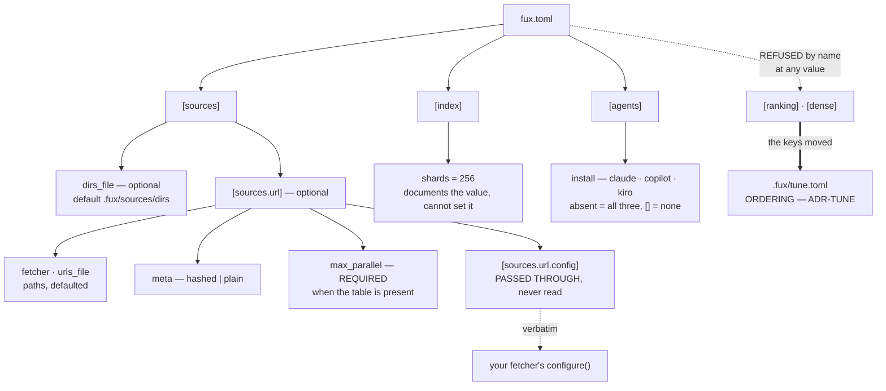

# ADR-CONFIG — `fux.toml` and every property in it

## §1 — For humans

`fux.toml` is **policy. The source lists are the corpus.** That split is why
the file is so small: a repo with nothing but `[index] shards` in it is valid,
because what gets indexed lives in `.fux/sources/dirs`, one entry per line.

Three properties of the schema are worth knowing before you read the table.

**Every key fux reads is validated, loudly, with the file and the offending
value named.** A typo is a stopped run, not a silent default — a misconfigured
source that quietly indexes nothing looks exactly like a ranking problem, and
costs a day to diagnose.

**Exactly one table is deliberately *not* read: `[sources.url.config]`.** It is
handed to your fetcher verbatim and fux never looks inside it. That is what
stops one fetcher's vocabulary — `cdp_port`, `settle_ms` — from leaking into
fux's schema and turning the adapter cap into a formality. Same discipline as
PEP 518's `[tool.*]` tables.

**Two tables are refused by name rather than ignored.** `[ranking]` and
`[dense]` moved to `.fux/tune.toml`, and a config carrying either stops the run
with the new home in the message. A key that is quietly not read is worse than
one that stops the run, because the reader believes their setting is in force
and diagnoses a ranking problem instead of a config one.

**Diagram — Mermaid and its ASCII twin. Update both, always, together.**



<details>
<summary><b>ASCII twin</b> — the same diagram, for terminals, diffs, and any reader without a Mermaid renderer</summary>

```text
   fux.toml
     |
     +-- [sources]
     |     +-- dirs_file       optional  default .fux/sources/dirs
     |     |
     |     +-- [sources.url]   optional -- the whole URL source
     |           +-- fetcher       path, default .fux/fetchers/http.py
     |           +-- urls_file     path, default .fux/sources/urls
     |           +-- meta          "hashed" (default) | "plain"
     |           +-- max_parallel  REQUIRED -- the only key with no default
     |           +-- [sources.url.config]
     |                 PASSED THROUGH VERBATIM -- fux never reads a key
     |                        |
     |                        +--> your fetcher's configure(config)
     |
     +-- [index]
     |     +-- shards = 256   documents the value; cannot change it
     |
     +-- [agents]
     |     +-- install        absent = claude, copilot, kiro; [] = none
     |
     +-- [ranking]  REFUSED --+   an ERROR naming the new home,
     +-- [dense]    REFUSED --+   at any value, never ignored
                              |
                              v
                 .fux/tune.toml   ORDERING ONLY -- ADR-TUNE
```

</details>

### Examples

Everything the loader reads, annotated:

```toml
[sources]
dirs_file = ".fux/sources/dirs"      # optional; this IS the default

[sources.url]
fetcher      = ".fux/fetchers/http.py"  # YOUR code; fux loads it by path
urls_file    = ".fux/sources/urls"      # one URL per line, a file not an array
meta         = "hashed"                 # the default; "plain" for public content
max_parallel = 4                        # REQUIRED when this table is present

[sources.url.config]
greeting = "hello"                      # the fetcher's vocabulary, never fux's

[index]
shards = 256                            # documents the value, cannot set it

[agents]
install = ["claude", "copilot", "kiro"] # absent = all three; [] = none
```

A rejected key, named precisely rather than defaulted:

```console
$ fux ingest
error: /repo/fux.toml: [sources.url] meta must be "hashed" or "plain" (got 'hased')
# exit 1
```

---

## §2 — For agents

### Context

Configuration is where a tool's scope quietly expands. Every adapter wants a
key; every key becomes a compatibility obligation; and a schema that knows
about `cdp_port` has already absorbed one integration's vocabulary into the
engine.

Fux's adapter cap only survives if configuration stays small enough that
extending it is visibly a decision rather than a convenience.

### Decision

**1. Root discovery: the nearest ancestor holding `fux.toml` or `.git`.**
`fux.toml` wins when both are at the same level. Not finding a root is not an
error in the loader — the caller decides whether it is fatal, which is why
`fux doctor` can report on a directory that `fux ask` refuses.

**2. `fux.toml` is policy; the source lists are the corpus.** There are no
required *tables*: a file holding nothing but `[index] shards` is valid.
`[sources] dirs_file` says where the directory list is and defaults to
`.fux/sources/dirs` ([ADR-DIR-LIST](0022_dir-list.md) decision 1).

**3. `[index] shards` documents 256 and cannot change it.** Supplying any other
value is an error, not a silent override: the shard function is
`blake2b(id, digest_size=1)`, and changing the count rewrites every path in the
tree. The key exists so the number is *visible* rather than folklore.

**4. `[sources.url]` is entirely optional.** Absent means no URL source, and
`fux update` has nothing to do.

**5. `fetcher` and `urls_file` default to `.fux/fetchers/http.py` and
`.fux/sources/urls`.** Both are repo-relative paths, and both defaults are the
declared `.fux/` layout ([ADR-DOTFUX](0003_fux-directory.md)). The default is
the plain-GET fetcher because a URL line carrying no `fetch=` means
`fetch=http` ([ADR-HTTP-FETCHER](0021_http-fetcher.md) decision 1).

**`fetcher` carries two things, deliberately.** It is the file used by a line
that declares no `fetch=`, **and** its directory is where a `fetch=<name>`
resolves — `<parent of fetcher>/<name>.py`. One key, so a consumer who keeps
their fetchers somewhere other than `.fux/fetchers/` moves all of them at once
and no line has to know. A second key naming the directory would be two values
that must agree.

**6. `meta` is `"hashed"` by default, `"plain"` by explicit opt-in.** Hashed
closes an ACL-mismatch leak, so the default is a safety property rather than a
preference. Any other value is an error.

**7. `max_parallel` is REQUIRED whenever `[sources.url]` is present**, and it is
the only key in the file with no default.

| case | behaviour |
|---|---|
| `[sources.url]` live, `max_parallel` live | its value, validated |
| `[sources.url]` live, `max_parallel` absent or commented | **`FuxError`**, naming the key and quoting the line to paste |
| `[sources.url]` absent entirely | **no error** — nothing fetches, so there is nothing to bound |

**The third row is a drawn line, not an oversight.** A docs-only repo forced to
declare a fetch bound is a repo where the key is noise, and **noise is how a
safety value stops being read.** What is forbidden is a repo that *can* fetch
and does not say how hard.

⚠ **Reversing the file's own "every key has a default" for exactly one line is
justified by the failure mode**: an implicit concurrency is not a thing a person
discovers by reading their config, and the damage it prevents — a hundred
sockets opened at their own intranet — lands on a third party who never chose
it.

**Requiredness is also the migration path, and nothing else could have been.**
`fux setup` is write-if-missing ([ADR-DOTFUX](0003_fux-directory.md)), so a
template change reaches **new repos only**. A loader error reaches existing
ones, because it puts the key in front of the person on their next command with
the value to type. A rewrite was refused: it would eat a consumer's
annotations.

**7a. Two values wear the name `max_parallel`, and they get different kinds of
refusal** — Arpit's standing rule, *state the cost, don't clamp the knob*:

| value | kind | treatment |
|---|---|---|
| `MAX_PARALLEL` in the fetcher module | **capability** | exceeding it is a correctness violation → **clamped down, loudly**, naming the module and the number |
| `[sources.url] max_parallel` | **policy** | merely rude → **honoured, with a warning stating the cost**; never clamped down |
| `max_parallel < 1` | **broken** | `FuxError` |

**Silence is politeness, not the fetcher's ceiling.** A declaration answers
*what is safe* — `http.py`'s `8` is a true statement about a fetcher that
builds a fresh `Request` per call — and never *what is polite unasked*. Nobody
declared `8` for a given repo's wiki, so the resolver applies
`min(declared, DEFAULT_MAX_PARALLEL)`. The default can only ever **lower**:
`cdp.py`'s `MAX_PARALLEL = 1` still wins. And it decides only what **saying
nothing** means — `max_parallel = 8` against a fetcher declaring `8` returns
`8`, silently.

**The bound is per fetcher group, not per host.** Twenty hosts behind `http.py`
share one budget — politer than needed — and five hundred URLs on one host get
that same budget, which is the case it exists for. The crawler literature's
politeness constraint is per-host, and the common case at the design point is
one wiki; shipping both now would mean picking a second default with no more
evidence than the first. **A per-host key is promoted when a 429 is actually
observed**, and not before.

⚠ **This key belongs here and not in `.fux/tune.toml`.** ADR-TUNE's mechanical
test is *does changing it change a byte in `.fux/index/`?* — and this does not,
so the test alone would misfile it. The second clause settles it: it is not a
ranking value either. It is **operational**, so it sits beside the other
`[sources.url]` keys.

**8. `[sources.url.config]` is validated as *a table* and nothing more.** It is
passed to the fetcher's `configure()` verbatim. Fux never reads a key inside it,
and must never gain a reason to.

**9. `[agents] install` is a closed, validated set** — `claude`, `copilot`,
`kiro` — naming which vendors `fux setup` writes policy renderings for
([ADR-AGENT-POLICY](0035_agent-policy.md) decision 5). The set is closed
because the failure mode of a typo here is the worst kind: the file a consumer
asked for is simply never written and nothing says so.

**Absent and `[]` are deliberately different**, which is unusual for this schema
and is the point: every other key treats absent as *"take the default"*, and so
does this one — but `install = []` is a consumer who said **no**, and it is the
durable form of `--no-agents`. Collapsing the two would make the opt-out
unwritable. **Order is normalised, not preserved**, so what gets written cannot
depend on the order someone happened to list them in.

**10. A retired key errors with instructions — at any value.** `dirs = []` stops
the run exactly as `dirs = ["docs"]` does: the key is retired, not merely
unused, and a reader that tolerates the empty form teaches people the key still
exists.

| retired | says |
|---|---|
| `[sources.url] urls` | put one URL per line in `.fux/sources/urls` |
| `[sources.url] middleware` | renamed to `fetcher`; move the file to `.fux/fetchers/` ([ADR-FETCHER](0019_fetcher.md) decision 7) |
| `[sources] dirs` | put one directory per line in `.fux/sources/dirs`; a line may carry `archived=true` ([ADR-DIR-LIST](0022_dir-list.md) decision 1) |
| `[ranking]` (whole table) | moved to `.fux/tune.toml`; run `fux setup` to write the file, move the keys across, delete the table ([ADR-TUNE](0038_tuning.md) decision 7) |
| `[dense]` (whole table) | **removed**, not relocated — the lane it configured no longer exists ([ADR-ASK](0004_ask.md) decision 9). The error states the removal, the verdict behind it, and that ranking does not move, because `mode` defaulted to `off` |

⚠ **`[dense]` is the case worth noting.** It was retired to `tune.toml` and
then the lane was deleted, so a config old enough to carry it is old enough to
be forwarded twice — and **the second hop would have landed on nothing.** A
forwarding address must point at something that exists, or it is worse than a
plain refusal.

**The cost of the table retirements, said out loud: this breaks every repo that
set one of the keys.** Nothing migrates automatically, because a migrator would
have to write TOML into a file this project promised never to rewrite. The error
message is the migration instruction, which is the whole of what is offered.

**11. Validation errors name the file and the offending value.** `FuxError` at
the boundary, rendered by the CLI, exit 1. Numeric keys are validated as
non-negative numbers with **`bool` rejected explicitly**, because `bool` is an
`int` subclass in Python and `archived_weight = true` would otherwise parse
silently as `1`.

### Consequences

- **The config fits on a screen**, so a new consumer reads all of it.
- **The adapter cap holds at the schema level.** Adding a fetcher needs no fux
  change at all — which is the property that makes "three adapters" a decision
  rather than a queue.
- **`shards` is a documentation-only key**, which is unusual and mildly
  surprising. Worth the surprise: the alternative is folklore about where 256
  comes from.
- **A third source-list path constant lives here, with no key at all.**
  `DEFAULT_TYPES_FILE = ".fux/sources/types"` joins `dirs_file` and `urls_file`
  because paths have one home — but it has **no `fux.toml` key**, deliberately:
  the types list is optional, its absence is meaningful (the built-in default
  applies), and a key whose only job is to relocate an optional file is surface
  nobody asked for. Decided in [ADR-TYPES](0031_types-list.md).
- ⚠ **The directory list is include-only, with no exclusions** — so committed
  measurement evidence under `work/regression/` contaminates the corpus it
  measures. That cost is stated rather than discovered.
- ⚠ **`[sources.url]` now ships live in a scaffolded repo, and one behaviour
  changes with it.** `fux add <URL>` used to record the line and print *"no
  `[sources.url]` in fux.toml, so nothing can fetch this line yet"*; in a repo
  scaffolded after `max_parallel` became required, it fetches. **The gate did
  not disappear — it moved to where it always really was:**
  `.fux/sources/urls` is empty, and the only thing that puts an address in it is
  an explicit `fux add <URL>`. **L4's *explicit, fenced, opt-in* is satisfied by
  the verb, not by a commented table** — and a table you must uncomment before
  the tool works is friction, not a fence. The refusal branch stays for repos
  that genuinely have no `[sources.url]`.
- ⚠ **A record can be amended and self-contradicting in the same commit, and
  every mechanical check will pass.** This record once stated *"`None` means
  whatever the fetcher declares"* four paragraphs above *"default `4` when a
  fetcher declares more"*; the code implemented the second sentence's opposite,
  and an unconfigured `fux update` opened eight concurrent connections to one
  intranet host. **The freshness gate checks that a record was *touched*, never
  that it is *coherent*.** That is the reason this record carries no amendment
  layers at all.

### Alternatives considered

- **Configure in `pyproject.toml` under `[tool.fux]`.** Rejected: fux indexes
  repositories that are not Python projects, and half of them have no
  `pyproject.toml`.
- **Read `cdp_port` and friends directly**, so the CDP template needs no
  `configure()`. Rejected explicitly: it puts one fetcher's vocabulary in fux's
  schema and breaches the adapter cap through the back door.
- **Make `shards` configurable.** Rejected until measured. It is a
  format-affecting constant.
- **Default `meta` to `"plain"` for readability.** Rejected: the default has to
  be the safe one, and hashed is the ACL-safe one.
- **Accept unknown keys silently** for forward compatibility. Rejected: a typo
  in `urls_file` that silently indexes nothing is indistinguishable from a
  retrieval bug.
- **URLs as a TOML array.** Rejected on diff and merge behaviour at enterprise
  scale — the reason the retired key errors loudly today.
- **Ship `max_parallel` commented out with a default.** Rejected: a consumer
  opening `fux.toml` would see a comment about a number rather than a number,
  which exposes nothing. A required key is what puts it in front of them.
- **A per-host concurrency key alongside the per-fetcher one.** Rejected for
  now under decision 7a: it means picking a second default with no more evidence
  than the first.

### Reference (required)

- The loader and every validation message —
  [`src/fux/config.py`](../../src/fux/config.py); the `[sources.url]` dataclass
  docstring is the normative statement of the opaque-table rule; the resolver —
  `resolve_parallel` in
  [`ingest/urlsrc.py`](../../src/fux/ingest/urlsrc.py); the written template —
  `_CONFIG` in [`setup.py`](../../src/fux/setup.py).
- A real config and the errors it produces —
  [`work/regression/2026-08-18-ingest-and-index/`](../../work/regression/2026-08-18-ingest-and-index/report.md) §6
  and its [fixture](../../work/regression/2026-08-19-w54/evidence/fixture.sh),
  which builds a repo from nothing with `fux setup` and runs the whole URL path
  offline.
- The opaque-table discipline this copies — PEP 518 `[tool.*]`:
  https://peps.python.org/pep-0518/#tool-table
- TOML, the format: https://toml.io/en/v1.0.0

### Veto condition

**Reopen this decision if** fux ever reads a key inside `[sources.url.config]`,
if a fourth top-level table appears, or if a source cannot be expressed without
a new engine-level key.

**How to check it:**

```bash
# 1. the opaque table is still opaque — this is the adapter cap, at the schema level
grep -rn 'config\[' src/fux/ | grep -v 'test'
# expect: no output. Fux validates that it is a table and passes it on.

# 2. the config surface has not grown
grep -oE '\bdata\.get\("[a-z]+"' src/fux/config.py | sort -u
# expect exactly: agents, index, sources — and nothing else.
# A FOURTH top-level table is the veto; a new key inside these three is not.

# 3. the retired tables still error rather than being silently ignored
grep -n 'ranking' src/fux/config.py
# expect: the refusal, naming .fux/tune.toml. Deleting it does not restore the
# keys — it makes a stale fux.toml quietly index-and-rank the wrong way.

# 4. every rejected value still names the file and the value
fux ingest 2>&1 | head -1
# on a bad key, expect: error: <path>/fux.toml: <what> must be <what> (got <value>)

# 5. the written template still interpolates the concurrency default
grep -n 'DEFAULT_MAX_PARALLEL' src/fux/setup.py src/fux/ingest/urlsrc.py
# expect: setup.py interpolates the constant rather than typing a number —
# a comment restating a constant is exactly the drift this key was added to fix
```

---

## References

*Every source this record cites, gathered in one place. §2's **Reference
(required)** names the grounding; this is the complete list. An archived
document is never listed here — the body may name one, but archive is not
evidence.*

**Records** — [ADR-LAWS](0001_laws.md) · [ADR-DOTFUX](0003_fux-directory.md) ·
[ADR-ASK](0004_ask.md) · [ADR-FETCHER](0019_fetcher.md) ·
[ADR-HTTP-FETCHER](0021_http-fetcher.md) · [ADR-DIR-LIST](0022_dir-list.md) ·
[ADR-TYPES](0031_types-list.md) · [ADR-AGENT-POLICY](0035_agent-policy.md) ·
[ADR-ARCHIVED-CONTENT](0037_archived-content.md) · [ADR-TUNE](0038_tuning.md)

**Code**

- [`src/fux/config.py`](../../src/fux/config.py)
- [`src/fux/ingest/urlsrc.py`](../../src/fux/ingest/urlsrc.py)
- [`src/fux/setup.py`](../../src/fux/setup.py)
- [`src/fux/tune.py`](../../src/fux/tune.py)
- [`tests/ingest/test_url_parallel.py`](../../tests/ingest/test_url_parallel.py)
- [`tests/test_setup.py`](../../tests/test_setup.py)

**Measured evidence**

- [`work/regression/2026-08-18-ingest-and-index/report.md`](../../work/regression/2026-08-18-ingest-and-index/report.md)
- [`work/regression/2026-08-19-w54/evidence/fixture.sh`](../../work/regression/2026-08-19-w54/evidence/fixture.sh)

**Papers and specifications**

- PEP 518 `[tool]` table — the opaque-config-table discipline this copies
  <https://peps.python.org/pep-0518/#tool-table>
- TOML v1.0.0 — the config format
  <https://toml.io/en/v1.0.0>
