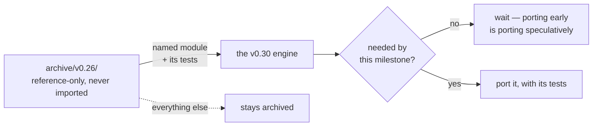

# ADR-PORT-LIST — port, don't rewrite, and this is the complete list

- **Name:** `ADR-PORT-LIST` — cite this everywhere; never cite the number
- **Status:** proposed
- **Supersedes (on acceptance):** nothing — this was `PLAN.md`
  §Port-don't-rewrite, which was archived on 2026-08-18
- **Owns (on acceptance):** no module. This record governs *where code comes
  from*, not what any component does
- **Laws:** L1, L3 — see [ADR-LAWS](0001_laws.md); never restated here
- **Date:** 2026-08-18
- **Feature:** the boundary between the archived engine and this one

---

## §1 — For humans

The v0.19–0.26 engine is archived at [`archive/v0.26/`](../../archive/v0.26/),
runnable and reference-only. It contains working, tested code for problems this
build still has: a frontmatter parser, a tokenizer, BM25F, an embedder.

Rewriting those from scratch would be waste. Copying the whole engine forward
would be worse — it is a *substrate* engine, and this one is index-and-refer.
Its architecture is the thing that was reset.

So: **nine modules are named, and nothing else comes back.** Each arrives with
its tests, and only when the milestone that needs it arrives. The list being
closed is the point — an open list is how a rewrite quietly becomes a port of
the thing you were trying to leave.

**Diagram — Mermaid and its ASCII twin. Update both, always, together.**



<details>
<summary><b>ASCII twin</b> — the same diagram, for terminals, diffs, and any reader without a Mermaid renderer</summary>

```text
   archive/v0.26/          nine NAMED modules, each with its tests
   reference-only,   -------------------------------------------->  the v0.30 engine
   never imported                                                        ^
        |                                                                |
        +-- everything else --> stays archived                    needed by THIS
                                                                  milestone? --no--> wait
   The list is closed. An open list is how a rewrite
   becomes a port of the thing you were leaving.
```

</details>

*No Examples or Charts section: this record governs provenance, not a
user-visible surface.*

---

## §2 — For agents

### Context

The second reset archived a working engine. Some of its code solves problems
that did not change with the architecture — tokenizing text, scoring BM25F,
parsing frontmatter — and that code is already tested and already correct
against recorded numbers.

Two failure modes sit either side of the decision. Rewrite everything and you
burn months re-earning tested behaviour, and lose the archived engine's
recorded numbers as a cross-check. Port freely and the substrate architecture
comes back a module at a time, which is exactly what the reset was for.

### Decision

**1. Port only from this list.** Anything not named here does not come
forward; reviving it needs its own record and Arpit's sign-off.

| module | used by | port in |
|---|---|---|
| frontmatter parser | ingest, snapshot mode | M1 |
| tokenizer + analyzer chain | ingest, query | M1 |
| BM25F scoring math + exact-df discipline | kernel | M1 (scan) / M2 (accelerated) |
| FuxVec embed + 32 B codes | the `code` property, dense lane | M1 / M2 |
| ~~RRF fusion (k=60)~~ | ~~kernel~~ | **ported M2, RETIRED 2026-08-26** |
| PPR-lite + edge extraction | graph lane | M3 |
| chunker (heading-aware) | passage re-score | M4 |
| converters (fidelity tiers) | transient convert | M4 |
| CLI verb surface (`ask`/`find`/`answer`/`explain`/`graph`/`path`) | UX contract | M2–M4 |

> **RRF is retired from the list, 2026-08-26 (W-79).** It was ported in M2 and
> both its consumers are now gone — `query/hybrid.py` deleted earlier the same
> day, then `query/fuse.py` itself. The live dense lane fuses via
> `query/dense.py::fuse`, a bounded multiplicative uplift, which is **not** a
> port and is owned by [ADR-ASK](0004_ask.md) decision 9. The row is struck
> rather than removed so a reader who remembers RRF is here finds out what
> happened to it. **Reviving it needs a new record and Arpit's sign-off**, per
> rule 1 — a retired row is not a standing licence.

**2. Each module arrives with its tests.** A port without its tests is a
rewrite wearing the old code's name.

**3. Port when the milestone needs it, not before.** Porting early is porting
speculatively, and speculative ports are how the list grows.

**4. The archive is never modified and never imported.** Wrap it if you need
its behaviour in a harness; look for an existing seam before concluding an
archived module has to change.

**5. The archived engine's recorded numbers are a free correctness check.**
The M1 harness reproduced the archived lexical eval exactly (hit@5 0.952 /
MRR 0.833, orbit 0.887) — which is what makes "we varied only the index" a
verified fact rather than an intention.

**6. Explicitly out of scope**, and named so nobody re-proposes them casually:
the SQLite substrate, the per-file cache, the lean profile, the state plane,
`fux.lock`, adapters beyond the capped three, and every M8 item.

### Consequences

- **The list is auditable.** "Where did this come from?" has a table for an
  answer rather than an archaeology exercise.
- **Ports are cheap and dated.** Each lands inside a milestone that needed it,
  so the reason is on the record.
- **Some duplication is accepted.** A ported module may look near-identical to
  the archived one; that is the point — the *architecture* was reset, not the
  arithmetic.
- **Un-ported archive code stays runnable**, so the baselines it establishes
  stay available even for modules never ported.

### Alternatives considered

- **Rewrite everything from scratch.** Rejected: it forfeits tested behaviour
  *and* the archived numbers that make M1's harness verifiable rather than
  merely plausible.
- **Import the archived package as a dependency.** Rejected: it makes a
  reference-only artifact load-bearing, and it would drag the substrate
  architecture in through its own imports.
- **Leave the list open, decide per module.** Rejected — that is the failure
  mode. A closed list makes each addition a visible decision.

### Reference (required)

- The archived engine — [`archive/v0.26/`](../../archive/v0.26/); the archive
  map — [`archive/README.md`](../../archive/README.md).
- Ports already landed, with their modules named in docstrings —
  [`src/fux/frontmatter.py`](../../src/fux/frontmatter.py),
  [`src/fux/query/tokenize.py`](../../src/fux/query/tokenize.py),
  [`src/fux/query/bm25f.py`](../../src/fux/query/bm25f.py).
- The archived baselines this rests on —
  [`work/regression/README.md`](../../work/regression/README.md) §Archived runs.
- Migrated from `PLAN.md` §Port-don't-rewrite, archived 2026-08-18 as
  [`archive/PLAN-v0.30.md`](../../archive/PLAN-v0.30.md).

### Veto condition

**Reopen this decision if** a module not on the list is proposed for porting,
or if `src/` ever imports the archive.

**How to check it:**

```bash
# 1. the archive is still never imported by live code
grep -rn 'archive' src/fux/ --include='*.py' | grep -E '^\S+:\s*(import|from)'
# expect: no output

# 2. the archive is still unmodified
git log --oneline -- archive/v0.26/ | head -3
# expect: nothing since it was archived

# 3. a port names where it came from
grep -rln 'archive/v0.26' src/fux/
# expect: docstrings in the ported modules, and only those
```
---

## References

*Every source this record cites, gathered in one place. §2's **Reference
(required)** names the grounding; this is the complete list. An archived
document is never listed here — the body may name one, but archive is not
evidence.*

**Records** — [ADR-LAWS](0001_laws.md)

**Code**

- [`src/fux/frontmatter.py`](../../src/fux/frontmatter.py)
- [`src/fux/query/bm25f.py`](../../src/fux/query/bm25f.py)
- [`src/fux/query/tokenize.py`](../../src/fux/query/tokenize.py)

**Measured evidence**

- [`work/regression/README.md`](../../work/regression/README.md)
