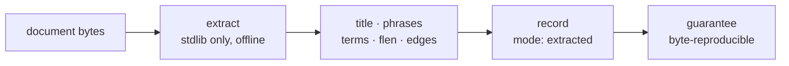

# ADR-EXTRACTED — the deterministic ingest mode

## §1 — For humans

Every record Fux commits carries `"mode":"extracted"`. This record says what
that word promises: **everything in the record was taken from the document's own
bytes, and nothing was invented.** Title, phrases, terms, per-field lengths,
edges — each is a function of the file, computed by stdlib code, offline, with
no model anywhere in the path.

That is why the mode is worth naming at all. `mode` is not documentation — it is
a property in the committed wire format, sitting beside `meta` in every line of
`.fux/index/*.jsonl`. A reader who sees `extracted` may rely on the whole chain:
same bytes in, same index out, no network, no model, no drift. **Every guarantee
stated in the paper is stated for this mode and no other.**

The name was chosen to *agree* with the ported edge-grade vocabulary rather than
merely avoid it: `EXTRACTED` already means "deterministic, no model" as an edge
grade, so the mode and the grade say the same thing with the same word. Its
counterpart is [ADR-ENRICH](0040_enrich.md), which absorbed ADR-ENRICHED on
2026-08-27 (W-82 ruling 6) and carries its taxonomy verbatim; it is accepted and
unbuilt.

**Diagram — Mermaid and its ASCII twin. Update both, always, together.**



<details>
<summary><b>ASCII twin</b> — the same diagram, for terminals, diffs, and any reader without a Mermaid renderer</summary>

```text
  +----------+     +------------------+     +----------------------+
  | document | --> | extract          | --> | title · phrases      |
  |  bytes   |     | stdlib only,     |     | terms · flen         |
  |          |     | offline          |     | edges                |
  +----------+     +------------------+     +---------+------------+
                                                      |
                                                      v
                                        +-----------------------------+
                                        | record: mode = "extracted"  |
                                        | guarantee: byte-reproducible|
                                        +-----------------------------+
```

</details>

### Examples

**What the mode looks like on disk.** One record from this repo's own committed
index, pretty-printed; `terms` is truncated from 299 entries and `edges` from
42, marked where. **Keys are shown in a reading order and the shard sorts them
alphabetically** — every *value* is verbatim, the byte sequence is not. The
shard itself is one record per line, unindented.

```json
{
  "_format": "fux.index.v2",   // the shard's first line, once per file
  "analyzer": "v2",
  "tf_fields": ["body", "heading", "title", "path", "ctx"]
}
{
  "id":      "file:docs/index.md",
  "src":     "git",
  "loc":     "docs/index.md",
  "sha":     "e8005dd97a8caeb59205e0e4a945b1ed92acdc13",
  "ver":     1,
  "mode":    "extracted",
  "meta":    "plain",
  "mtime":   1787122917,
  "title":   "Fux docs — knowledge bundle root",
  "phrases": ["Fux docs — knowledge bundle root",
              "Core (read in this order)", "Decisions", "Build"],
  "terms":   {"0097ee914e37dedf": [1],
              "031b0e9051c7d6b4": [1],
              "0387c9370a386785": [1]},      // … 299 total
  "flen":    [691, 13, 8, 3],
  "edges":   [{"dst": "file:CLAUDE.md",           "grade": 10, "kind": "code"},
              {"dst": "file:README.md",           "grade": 10, "kind": "code"},
              {"dst": "file:docs/GLOSSARY.md",    "grade":  8, "kind": "code"}]  // … 42 total
}
```

**Read it as the contract.** Every value above is a function of
`docs/index.md`'s bytes, its path, and the corpus's own recorded link structure,
and of nothing else:

- `title` and `phrases` are the document's own headings.
- `terms` are hashes of tokens that literally appear in it, with per-field
  frequencies; the tf list is trimmed of trailing zeros, and most postings are
  body-only.
- `flen` is its per-field token counts, five of them, **raw and unweighted** —
  the weighting is a query-time policy and deliberately not committed.
- `mtime` is the document's git **commit** timestamp, which is a fact about the
  corpus's history rather than about the file on disk, and is committable for
  exactly that reason: a filesystem mtime differs per machine and would break the
  reproducibility this mode's name asserts.
- `edges` are links the document actually contains, graded `10` when the target
  resolved unambiguously and `8` when a backtick path resolved only by basename.

**Grade `6` — `INFERRED` — does not appear here and cannot**:
[`ingest/edges.py`](../../src/fux/ingest/edges.py) reserves it and states it is
unused until the enriched tier. **That absence is the mode, visible in the
bytes.**

**And the guarantee it asserts** — same sources, same bytes:

```console
$ sha1sum .fux/index/*.jsonl > /tmp/a && fux ingest >/dev/null \
  && sha1sum .fux/index/*.jsonl > /tmp/b && diff /tmp/a /tmp/b && echo IDENTICAL
IDENTICAL
```

---

## §2 — For agents

### Context

The naming collided head-on with the ported edge-grade vocabulary, where
`EXTRACTED` already means deterministic and `INFERRED` already means
model-derived. The fork was worked in
[`work/compare/ingest-mode-naming.compare.md`](../../work/compare/ingest-mode-naming.compare.md).

It stopped being a taste call the moment `mode` entered the committed wire
format. A rename now costs a format bump and a re-ingest of every corpus that
ever committed an index — a cost that is near zero today and rises with every
adopter, which is exactly the shape of damage CLAUDE.md's priority rule ranks
first.

### Decision

**1. The deterministic ingest mode is named `extracted`**, and that string is
the committed value of the `mode` property.

**2. `extracted` asserts a contract, not a label.** A record in this mode
guarantees: every property is a pure function of the document's bytes, its path
and the corpus's link structure; no model was consulted at any point; no network
was touched (L4's fenced paths fetch *bytes*, and extraction is still
deterministic over them); the run is byte-reproducible.

**3. It is the default, and today it is the only mode that exists.** A record
carrying any other `mode` value is a defect until
the `enriched` mode ([ADR-ENRICH](0040_enrich.md)) is built.

**4. Every guarantee in the paper and in every regression run is stated for this
mode.** A measurement taken under any other mode is a different experiment and
may not be compared against a pre-registered threshold.

**5. `inferred` is retired as a mode value** and is not valid. It survives only
in the frozen archived fidelity vocabulary.

**6. Extraction produces five tf fields** — `body`, `heading`, `title`, `path`,
`ctx`, in `store.TF_FIELDS` order — plus `flen`, the raw per-field token counts.

- **`title` and `path` are fields, not new content.** Both were already *in* the
  record (as `title`, and as `loc`); nothing is invented, because the title's own
  tokens and the path's own segments are taken from the document and its
  location. `title` used to be folded into the heading tokens because there was
  nowhere else to put it, and was silently double-counted; it now has its own
  field.
- **`ctx` carries enrichment vocabulary and is empty on a document nothing has
  enriched.** An empty trailing field is not written at all, so it costs nothing.
- **`flen` rather than a weighted length**, because a weighted length computed
  at ingest is a function of a query-time tunable
  ([ADR-TUNE](0038_tuning.md) decision 6). Raw counts are facts; the weighting
  happens in `query/bm25f.py::derive_wlen`.

**7. Nothing model-derived is emitted, and no model is loaded.** `Extracted` is
four fields — `title`, `phrases`, `terms`, `flen` — every one a pure function of
the document's bytes and the analyzer.

⚠ **This makes the extracted-mode law easier to state, not harder.** *Every
field is taken from the document; nothing is invented* was always slightly
awkward about an embedding: **a vector is not *in* the bytes, it is a model's
reading of them** — and the model was a binary blob whose recipe was not in the
repo. A dense lane was built and measured and deleted
([ADR-ASK](0004_ask.md) decision 9); that awkwardness went with it.
`tests/ingest/test_extract.py` keeps a test asserting its absence, because **a
removal is a decision, and a decision with no test is one a later session
re-implements by accident.**

**8. The heading grammar follows the file type.** Extraction once derived
headings with `^#{1,6}` alone while the type allowlist admitted `.rst`, `.adoc`
and `.org` — so **every heading in three of the six allowed types landed in the
body field**, and their `phrases` list was empty. Each format now gets its own
grammar: reStructuredText's full-width underline, AsciiDoc's `= Title` /
`== Section`, Org's `* Heading`. Two guards are the substance rather than the
regexes:

- **Org requires the space** after the asterisk run, or `*emphasis*` and
  `**bold**` at the start of a line read as headings — the false positive that
  format invites.
- **reStructuredText requires the rule to run the width of the text**, which is
  the spec's own rule and is what keeps a row of dashes inside a table out of the
  heading field.

**A decoded document always uses the Markdown grammar**, because a decoder emits
Markdown by contract ([ADR-DECODE](0042_decode.md) decision 2). Only an
already-prose file takes a different pattern.

### Consequences

- **The word is load-bearing in two vocabularies at once**, deliberately: the
  mode and the edge grade agree. A change to either is a change to both.
- **Renaming later is a format change**, not a rename — `_format`/`analyzer`
  bump plus re-ingest everywhere. That is the cost this ratification buys out.
- ⚠ **Decision 8 re-ranks existing corpora**, in the direction the field weights
  intend: text that was body becomes heading. It is a **correctness fix to
  shipped behaviour**, not a new capability.
- **`extract.py` belongs to this record**, out of ADR-INGEST's claim on
  `src/fux/ingest/`. Most specific wins. ADR-INGEST keeps how ingest *runs*;
  this record owns what extraction *promises*.
- ⚠ **`fux enrich` does not build the enriched mode, and the difference is
  easy to get backwards.** It plans and validates enrichment that a coding agent
  generates; the result is pinned text that ingest tokenizes into the `ctx`
  field, and the record it lands on stays `"mode": "extracted"` — correctly,
  because **a pinned file is bytes fux read, not something fux inferred**.
  the `enriched` mode ([ADR-ENRICH](0040_enrich.md)) remains unbuilt.

### Alternatives considered

- **`derived` / `enriched`** *(runner-up)* — collision-free and visually
  distinct from its counterpart; loses only because it merely avoids the edge
  grades rather than agreeing with them.
- **`inferred` / `enriched`** — rejected: leaves `mode = inferred` (no model)
  beside `grade: INFERRED` (model-derived), reproducing the collision one word
  to the left.
- **`inferred` / `extracted`** — matches the original phrasing but requires
  renaming the ported edge grades and *still* leaves `inferred` colliding.
- **Leave it unnamed until the second mode exists** — rejected: the string is
  already in the committed format, so "unnamed" is not one of the options.
- **Keep emitting a model-derived field under this mode.** Rejected under
  decision 7, on a measured gate rather than on principle — but the principle is
  what makes the removal a simplification rather than a loss.

Full matrix:
[`work/compare/ingest-mode-naming.compare.md`](../../work/compare/ingest-mode-naming.compare.md).

### Reference (required)

- The extractor —
  [`src/fux/ingest/extract.py`](../../src/fux/ingest/extract.py); the property
  is written at both record sites in
  [`run.py`](../../src/fux/ingest/run.py).
- The reserved grade that must never appear —
  [`src/fux/ingest/edges.py`](../../src/fux/ingest/edges.py).
- Determinism, captured —
  [`work/regression/2026-08-18-ingest-and-index/`](../../work/regression/2026-08-18-ingest-and-index/report.md) §4.
- The fork and its matrix —
  [`work/compare/ingest-mode-naming.compare.md`](../../work/compare/ingest-mode-naming.compare.md).
- How ingest runs, as distinct from what extraction promises —
  [ADR-INGEST](0007_ingest.md).

### Veto condition

**Reopen this decision if** any committed record carries a `mode` value this
record has not ratified, or if re-ingesting an unchanged corpus stops producing
byte-identical shards, or if an `edges` entry ever carries grade `6` on an
`extracted` record. Each means the contract this name asserts is no longer true
of the bytes.

⚠ **The condition is written against the bytes, not against a module path.** It
once read *"before `src/fux/enrich/` exists"* — and when a module of that name
appeared for an unrelated feature, the condition read as a window that had
already closed, which is the opposite of the truth. **A trip-wire keyed to a
filename goes stale when the file is renamed; one keyed to a committed value
does not.**

**How to check it:**

```bash
# 1. no mode value exists that this record has not ratified
grep -oh '"mode":"[a-z]*"' .fux/index/*.jsonl | sort -u
# expect exactly: "mode":"extracted"

# 1b. no inferred-grade edge on a deterministic record
grep -c '"grade": *6' .fux/index/*.jsonl | grep -v ':0$'
# expect: no output

# 2. the byte-reproducibility the name promises
sha1sum .fux/index/*.jsonl > /tmp/a && fux ingest >/dev/null \
  && sha1sum .fux/index/*.jsonl > /tmp/b && diff /tmp/a /tmp/b && echo OK
```

---

## References

*Every source this record cites, gathered in one place. §2's **Reference
(required)** names the grounding; this is the complete list. An archived
document is never listed here — the body may name one, but archive is not
evidence.*

**Records** — [ADR-LAWS](0001_laws.md) · [ADR-ASK](0004_ask.md) ·
[ADR-INGEST](0007_ingest.md) · [ADR-ENRICH](0040_enrich.md) ·
[ADR-TUNE](0038_tuning.md) · [ADR-DECODE](0042_decode.md)

**Code**

- [`src/fux/ingest/edges.py`](../../src/fux/ingest/edges.py)
- [`src/fux/ingest/extract.py`](../../src/fux/ingest/extract.py)
- [`src/fux/ingest/run.py`](../../src/fux/ingest/run.py)
- [`tests/ingest/test_extract.py`](../../tests/ingest/test_extract.py)

**Measured evidence**

- [`work/regression/2026-08-18-ingest-and-index/report.md`](../../work/regression/2026-08-18-ingest-and-index/report.md)

**Project docs**

- [`work/compare/ingest-mode-naming.compare.md`](../../work/compare/ingest-mode-naming.compare.md)
