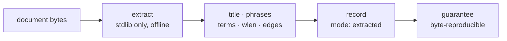

# ADR-EXTRACTED — the deterministic ingest mode

- **Name:** `ADR-EXTRACTED` — cite this everywhere; never cite the number
- **Status:** accepted
- **Date:** 2026-08-19
- **Feature:** the `extracted` ingest mode — the value in every committed record's `mode` property, and the contract it asserts
- **Owns:** `src/fux/ingest/extract.py`
- **Laws:** L1, L2, L3, L4 — see [ADR-LAWS](0001_laws.md); never restated here
- **Ratifies:** [W-30](../../work/OPEN-WORK.md), Arpit 2026-08-19 — the naming call open since 2026-08-09

---

## §1 — For humans

Every record Fux commits today carries `"mode":"extracted"`. This record says
what that word promises: **everything in the record was taken from the
document's own bytes, and nothing was invented.** Title, phrases, terms,
length, edges, dense code — each is a function of the file, computed by
stdlib code, offline, with no model anywhere in the path.

That is why the mode is worth naming at all. `mode` is not documentation — it
is a property in the committed wire format, sitting beside `meta` in every
line of `.fux/index/*.jsonl`. A reader who sees `extracted` may rely on the
whole chain: same bytes in, same index out, no network, no model, no drift.
**Every guarantee stated in the paper is stated for this mode and no other.**

The name was chosen to *agree* with the ported edge-grade vocabulary rather
than merely avoid it: `EXTRACTED` already means "deterministic, no model" as
an edge grade, so the mode and the grade now say the same thing with the same
word. Its counterpart is [ADR-ENRICHED](0017_enriched-mode.md), which is
proposed and unbuilt.

**Diagram — Mermaid and its ASCII twin. Update both, always, together.**



<details>
<summary><b>ASCII twin</b> — the same diagram, for terminals, diffs, and any reader without a Mermaid renderer</summary>

```text
  +----------+     +------------------+     +--------------------+
  | document | --> | extract          | --> | title · phrases    |
  |  bytes   |     | stdlib, offline  |     | terms · wlen · edge|
  +----------+     +------------------+     +---------+----------+
                                                      |
                                                      v
                                        +-----------------------------+
                                        | record: mode = "extracted"  |
                                        | guarantee: byte-reproducible|
                                        +-----------------------------+
```

</details>

### Examples

**What the mode looks like on disk.** One record, captured from this repo's own
committed index (`.fux/index/c0.jsonl`), pretty-printed; `terms` is truncated
from 215 entries and `edges` from 27, marked where. Every other byte is
verbatim. The shard itself is one record per line, unindented.

```json
{
  "_format": "fux.index.v1",   // the shard's first line, once per file
  "analyzer": "v1",
  "tf_fields": ["heading", "body"]
}
{
  "id":      "file:docs/index.md",
  "src":     "git",
  "loc":     "docs/index.md",
  "sha":     "d900ba5fd6538df613c47b62d804228b53e92349",
  "ver":     2,
  "mode":    "extracted",
  "meta":    "plain",
  "title":   "Fux docs — knowledge bundle root (v0.30 rebuild)",
  "phrases": ["Fux docs — knowledge bundle root (v0.30 rebuild)",
              "Core (read in this order)", "Decisions", "Build"],
  "terms":   {"025ca789b62d1a8c": [0, 1],
              "02ed1a6e6bbb346c": [0, 2],
              "0444cc705e1aa5d0": [0, 3]},   // … 215 total
  "wlen":    444,
  "code":    "c-oipo_E6Ew44yT0wlJqDbvYgp01Ju-n4hqhqWTXlUw",
  "edges":   [{"dst": "file:CLAUDE.md",           "grade": 10, "kind": "code"},
              {"dst": "file:docs/GLOSSARY.md",    "grade":  8, "kind": "code"},
              {"dst": "file:docs/GLOSSARY.md",    "grade": 10, "kind": "ref"}]  // … 27 total
}
```

**Read it as the contract.** Every value above is a function of
`docs/index.md`'s bytes and the corpus's link structure, and of nothing else:
`title` and `phrases` are the document's own headings; `terms` are hashes of
tokens that literally appear in it, with per-field frequencies; `wlen` is its
token count; `code` is the bundled static model's sign-quantized vector — a
lookup table, not an inference; `edges` are links the document actually
contains, graded `10` when the target resolved unambiguously and `8` when a
backtick path resolved only by basename. **Grade `6` — `INFERRED` — does not
appear here and cannot**: [`ingest/edges.py`](../../src/fux/ingest/edges.py)
reserves it and states it is "unused until the enriched tier". That absence is
the mode, visible in the bytes.

**And the guarantee it asserts** — same sources, same bytes:

```console
$ sha1sum .fux/index/*.jsonl > /tmp/a && fux ingest >/dev/null \
  && sha1sum .fux/index/*.jsonl > /tmp/b && diff /tmp/a /tmp/b && echo IDENTICAL
IDENTICAL
```

---

## §2 — For agents

### Context

The naming was opened by Arpit's 2026-08-09 directive — *"ingest needs to
happen without ai model … ingest with AI model can be extracted mode"* — which
collided head-on with the ported edge-grade vocabulary, where `EXTRACTED`
already means deterministic and `INFERRED` already means model-derived. The
fork was worked in [`work/compare/ingest-mode-naming.compare.md`](../../work/compare/ingest-mode-naming.compare.md)
and the recommendation has carried `⏳ proposed` since.

It stopped being a taste call the moment `mode` entered the committed wire
format. A rename now costs a format bump and a re-ingest of every corpus that
ever committed an index — a cost that is zero today and rises with every
adopter, which is exactly the shape of damage CLAUDE.md's priority rule
ranks first.

### Decision

**1. The deterministic ingest mode is named `extracted`**, and that string is
the committed value of the `mode` property. Ratified by Arpit, 2026-08-19.

**2. `extracted` asserts a contract, not a label.** A record in this mode
guarantees: every property is a pure function of the document's bytes and the
corpus's link structure; no model was consulted at any point; no network was
touched (L4's fenced exceptions — `fux add <URL>` and `fux update` — fetch *bytes* and
still extracts from them deterministically); the run is byte-reproducible.

**3. It is the default, and today it is the only mode that exists.** A record
carrying any other `mode` value is a defect until
[ADR-ENRICHED](0017_enriched-mode.md) is accepted.

**4. Every guarantee in the paper and in every regression run is stated for
this mode.** A measurement taken under any other mode is a different
experiment and may not be compared against a pre-registered threshold.

**5. `inferred` is retired as a mode value** and is not valid in v0.30+. It
survives only in the frozen archived fidelity vocabulary.

### Consequences

- **The word is load-bearing in two vocabularies at once**, deliberately: the
  mode and the edge grade agree. A change to either is a change to both.
- **Renaming later is a format change**, not a rename — `_format`/`analyzer`
  bump plus re-ingest everywhere. That is the cost this ratification buys out.
- **The paper's §3.2 is stale in the other direction** — it still calls this
  tier "Inferred mode". That text is superseded by this record; the paper is
  rewritten to measured values at M6 ([W-26](../../archive/open/W-26-m6-scale-t2.md)).
- **`extract.py` moves to this record** in the ownership table, out of
  ADR-INGEST's claim on `src/fux/ingest/`. Most specific wins, exactly as
  `store/fuxdir.py` already resolves against `store/`. ADR-INGEST keeps how
  ingest *runs*; this record owns what extraction *promises*.

### Alternatives considered

- **`derived` / `enriched`** *(runner-up)* — collision-free and visually
  distinct from its counterpart; loses only because it merely avoids the edge
  grades rather than agreeing with them.
- **`inferred` / `enriched`** — rejected: leaves `mode = inferred` (no model)
  beside `grade: INFERRED` (model-derived), reproducing the collision one word
  to the left.
- **`inferred` / `extracted`** (Arpit's original assignment) — matches his
  phrasing but requires renaming the ported edge grades and *still* leaves
  `inferred` colliding.
- **Leave it unnamed until the second mode exists** — rejected: the string is
  already in the committed format, so "unnamed" is not one of the options.

Full matrix: [`work/compare/ingest-mode-naming.compare.md`](../../work/compare/ingest-mode-naming.compare.md).

### Reference (required)

- The extractor — [`src/fux/ingest/extract.py`](../../src/fux/ingest/extract.py);
  the property is written at [`run.py`](../../src/fux/ingest/run.py) lines 102
  and 123.
- Determinism, captured — [`work/regression/2026-08-18-ingest-and-index/`](../../work/regression/2026-08-18-ingest-and-index/report.md) §4.
- The fork and its matrix — [`work/compare/ingest-mode-naming.compare.md`](../../work/compare/ingest-mode-naming.compare.md).
- How ingest runs, as distinct from what extraction promises —
  [ADR-INGEST](0007_ingest.md).

**Amended 2026-08-23 (W-76 Phase 1).** Extraction now produces **five tf
fields** — `body`, `heading`, `title`, `path`, `ctx`, in `store.TF_FIELDS`
order — and **`flen` in place of `wlen`**.

- **`title` and `path` are new fields, not new content.** Both were already
  *in* the record (as `title`, and as `loc`); extracted-mode law is unchanged
  because nothing is invented — the title's own tokens and the path's own
  segments are taken from the document and its location. `title` previously
  had to be folded into the heading tokens because there was nowhere else to
  put it; it now has its own field and is **no longer double-counted**.
- **`ctx` is declared and always empty** until Phase 8's `fux enrich` exists.
  An empty field is a trailing zero and is not written at all, so it costs
  nothing to reserve.
- **`flen` replaces `wlen` because `wlen` was a function of a tunable** —
  ADR-TUNE decision 6. `flen` carries raw per-field token counts, which are
  facts; the weighting happens at query time in `query/bm25f.py::derive_wlen`.
- **`code` is no longer emitted.** It was 0.4 % of the index and **91 % of a
  full ingest**; Phase 7 returns the same Hamming scan as a *derived*
  prefilter over per-chunk vectors. `Extracted.code` is retained as a field
  and is always `None`, so the shape of the dataclass does not churn twice.

### Veto condition

**Reopen this decision if** a committed record carries a `mode` value other
than `extracted` before `src/fux/enrich/` exists (the enriched mode is
ratified but unbuilt — [ADR-ENRICHED](0017_enriched-mode.md)), or if
re-ingesting an unchanged corpus stops producing byte-identical shards, or if
an `edges` entry ever carries grade `6` on an `extracted` record — each means
the contract this name asserts is no longer true of the bytes.

**How to check it:**

```bash
# 1. no mode value exists that this record has not ratified
grep -oh '"mode":"[a-z]*"' .fux/index/*.jsonl | sort -u
# expect exactly: "mode":"extracted"

# 1b. no inferred-grade edge on a deterministic record
grep -c '"grade": *6' .fux/index/*.jsonl | grep -v ':0$'
# expect: no output

# 2. the byte-reproducibility the name promises
sha1sum .fux/index/*.jsonl > /tmp/a && fux ingest >/dev/null \
  && sha1sum .fux/index/*.jsonl > /tmp/b && diff /tmp/a /tmp/b && echo OK
```
---

## References

*Every source this record cites, gathered in one place. §2's **Reference
(required)** names the grounding; this is the complete list. An archived
document is never listed here — the body may name one, but archive is not
evidence.*

**Records** — [ADR-LAWS](0001_laws.md) · [ADR-INGEST](0007_ingest.md) ·
[ADR-ENRICHED](0017_enriched-mode.md)

**Code**

- [`src/fux/ingest/edges.py`](../../src/fux/ingest/edges.py)
- [`src/fux/ingest/extract.py`](../../src/fux/ingest/extract.py)
- [`src/fux/ingest/run.py`](../../src/fux/ingest/run.py)

**Measured evidence**

- [`work/regression/2026-08-18-ingest-and-index/report.md`](../../work/regression/2026-08-18-ingest-and-index/report.md)

**Project docs**

- [`work/OPEN-WORK.md`](../../work/OPEN-WORK.md)
- [`work/compare/ingest-mode-naming.compare.md`](../../work/compare/ingest-mode-naming.compare.md)
