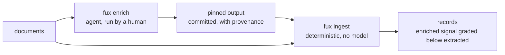

# ADR-ENRICHED — the model-assisted ingest mode

- **Name:** `ADR-ENRICHED` — cite this everywhere; never cite the number
- **Status:** accepted — **the name and the boundary are ratified; the build is not authorized**
- **Date:** 2026-08-19
- **Feature:** the `enriched` ingest mode — the second value of a record's `mode` property, and the boundary that keeps it legal
- **Owns:** nothing yet — `src/fux/enrich/` does not exist. Its ownership row is added in the change that creates it
- **Laws:** L1, L2, L3, L4 — see [ADR-LAWS](0001_laws.md); never restated here
- **Gate:** [W-38](../../work/open/W-38-m8-deferred.md) — M8, parked behind M6. **Nothing here starts because it is interesting.**
- **Ratifies:** [W-30](../../work/OPEN-WORK.md), Arpit 2026-08-19 — the naming, and this record accepted the same day

---

## §1 — For humans

`enriched` names what a coding agent — Claude Code, Copilot, Codex, Kiro —
adds to the index that deterministic extraction structurally cannot: bridging
vocabulary a document never literally uses, edges two documents mean to have
but never wrote, and the retirement signal that no amount of reading the bytes
will reveal.

**The whole design is one boundary.** L3 forbids a model in the maintenance
path — "not to be smarter at ingest, not once" — and `fux ingest` *is* the
maintenance path. So enrichment is **not a flag on ingest**. It is its own
command or skill, run deliberately by a human, whose output is **pinned**:
written down with provenance, committed, and thereafter re-read exactly like
any other committed fact. The agent is a *source*, never a step in the
pipeline. Ingest stays deterministic; the enriched signal is data that already
exists by the time ingest sees it.

The second rule is grading. Wherever enriched signal competes with
deterministic signal, it ranks below it and says so — the same `EXTRACTED` >
`INFERRED` ordering the ported edge vocabulary already carries. A model may
add to the index; it may never outrank the document.

**This record exists to fence the mode before anyone builds it**, because the
expensive version of this mistake is discovering the boundary after
`src/fux/enrich/` has a model call inside `ingest/`.

**Diagram — Mermaid and its ASCII twin. Update both, always, together.**



<details>
<summary><b>ASCII twin</b> — the same diagram, for terminals, diffs, and any reader without a Mermaid renderer</summary>

```text
   +-----------+
   | documents |-------------------------------+
   +-----+-----+                               |
         |                                     v
         v                          +----------------------+
  +---------------------+           | fux ingest           |
  | fux enrich          |           | deterministic        |
  | agent, human-run    |           | NO model (law L3)    |
  +----------+----------+           +-----------+----------+
             |                                  ^
             v                                  |
  +-------------------------+                   |
  | pinned output           |-------------------+
  | committed + provenance  |
  +-------------------------+
                                    result: enriched signal is graded
                                            BELOW extracted signal
```

</details>

### Examples

> **Specimen, not a capture.** The mode is unbuilt, so these bytes were
> hand-written to make the contract above concrete — they are the only example
> in this repo's records that was not copied from a run, and they are marked as
> such deliberately. **The decisions in §2 bind; these key names do not** until
> M8 files the record that builds them.

**Before** — `docs/adr/0011_accelerator.md` as `fux ingest` writes it today,
truncated (real shape; see [ADR-EXTRACTED](0016_extracted-mode.md) for a
verbatim capture):

```json
{
  "id":    "file:docs/adr/0011_accelerator.md",
  "sha":   "3f9c…", "ver": 4,
  "mode":  "extracted",
  "meta":  "plain",
  "terms": {"a1b2c3d4e5f60718": [1, 12], "…": []},
  "edges": [{"dst": "file:docs/adr/0009_index-lifecycle.md", "grade": 10, "kind": "ref"}],
  "wlen":  1180
}
```

**After** — the same document once an enrichment run has been pinned and
re-ingested:

```json
{
  "id":     "file:docs/adr/0011_accelerator.md",
  "sha":    "3f9c…", "ver": 4,
  "mode":   "enriched",
  "meta":   "plain",
  "terms":  {"a1b2c3d4e5f60718": [1, 12], "…": []},
  "terms_e": {"7e11aa93b4c05d26": [0, 1],
              "b0d4417c9e2af335": [0, 1]},
  "edges":  [{"dst": "file:docs/adr/0009_index-lifecycle.md", "grade": 10, "kind": "ref"},
             {"dst": "file:docs/adr/0013_postings.md",        "grade":  6, "kind": "infer"}],
  "wlen":   1180,
  "enrich": {"by":     "claude-code",
             "at_sha": "3f9c…",
             "run":    "2026-08-20T09:14Z/7c1e",
             "ver":    1}
}
```

**Four things the diff is trying to make unmissable.**

- **`terms` is byte-identical.** Enriched vocabulary lands in a *separate*
  `terms_e` map, never merged. `df` over `terms` stays a pure function of the
  corpus's literal vocabulary, so an enrichment run cannot move the score of a
  document it never touched — the contamination risk named in §Candidates.
- **The new edge is grade `6`.** That is `INFERRED_GRADE`, already reserved in
  [`ingest/edges.py`](../../src/fux/ingest/edges.py) and documented there as
  "unused until the enriched tier". The slot exists; enrichment fills it.
- **`enrich.at_sha` is the whole freshness story.** It records the `sha` the
  agent actually read. When the document changes, `sha != at_sha` and the
  enrichment is *detectably* stale rather than silently trusted — which is what
  makes "pinned, re-read forever" safe rather than merely cheap.
- **No new prose key.** There is no `summary`, no `abstract`, no `description`.
  Decision 5, visible in the bytes.

**And the cost this shape admits.** Two new properties mean a reader that does
not know them must refuse rather than guess, so this is an `_format` bump —
`fux.index.v1` → `v2` — plus a re-ingest. That is a real migration and it is
M8's to pay; it is stated here so nobody discovers it late.

---

## §2 — For agents

### Context

The paper has specified this tier since the reset (§3.2: "AI-assisted mode …
outputs are **pinned** into the index with provenance and re-read forever
(never re-generated on any query path), and they carry a distinct grade
wherever they compete with deterministic signal"), but that text sits inside a
research paper, not a record — so the constraint was invisible to every
session that read only the ADRs. The naming half sat unratified in
[W-30](../../work/OPEN-WORK.md) since 2026-08-09 with no stated meaning at all,
which is what made it un-ratifiable: nobody could say what `enriched` was
*for*.

Arpit stated the meaning on 2026-08-19: **the index is generated or refined by
a chat agent** — Claude Code, Copilot, Codex, Kiro — re-reading ingested files
or URLs and adding vocabulary and signal. That definition makes the L3
question unavoidable, and answering it is what this record is for.

### Decision

**1. The model-assisted ingest mode is named `enriched`.** Ratified by Arpit,
2026-08-19, together with [ADR-EXTRACTED](0016_extracted-mode.md); the pair
was one call.

**2. Enrichment never runs inside the maintenance path.** It is a separate
command or agent skill, invoked deliberately. `fux ingest` gains no model
call, no network path, and no `--enrich` flag — not as a convenience, not
behind a default-off toggle. L3 is preserved by construction, not by
discipline.

**3. Output is pinned, then ingested like any other committed content.** The
enrichment step writes a committed artifact with provenance — what produced
it, from which document at which `sha`, when. Ingest reads that artifact
deterministically. **Nothing is regenerated on a query path, ever.**

**4. Enriched signal is graded below deterministic signal** wherever the two
compete, reusing the ported `EXTRACTED` > `INFERRED` edge-grade ordering
rather than inventing a second scale.

**5. Enriched output stays statistic-shaped.** Terms, phrases, edges, flags —
the things the index already holds. **Prose summaries are excluded**: a
paragraph of model-written prose in the committed index is durable content in
every sense that matters to L2, whatever the technicality. If summaries are
ever wanted, they go through the existing per-source `mode = snapshot` policy
as an explicit, visible exception — never silently as a side effect of
enrichment.

**6. Accepting this record does not authorize the work.** It ratifies the
name, the boundary and the shape — nothing more. The M8 gate in
[W-38](../../work/open/W-38-m8-deferred.md) — one ADR plus Arpit's sign-off,
blocked behind M6 — stands unchanged. **A session that reads this record as
permission to build `src/fux/enrich/` has misread it**; the gate is the
permission, and it has not been given.

### The candidate enrichments, and why each needs a model

Recorded so M8 designs against a list rather than a mood. **None is approved.**

| candidate | what deterministic extraction cannot do | risk |
|---|---|---|
| **semantic term expansion** | KL selection and YAKE-class phrases see only literal page vocabulary — a query for "OOM" never reaches a doc that says "memory exhaustion" | dilutes `df`; needs a graded, separable term set or it contaminates the statistics every document is scored against |
| **inferred edges** | links two documents mean to have but never wrote — "this design implements that decision", with no hyperlink | must carry `INFERRED`; a wrong edge is worse than a missing one because it is invisible |
| **retirement / supersession flags** | nothing in the bytes distinguishes a live document from a retired one — this is [W-44](../../work/open/W-44-archived-content-signalling.md) open right now | if it reorders rather than annotates, it violates the ruling W-44 already reached |
| **richer embeddings** | the bundled distilled model is 256-dim, stdlib, deliberately small | **L1 collision** — a larger or API-served model may be *called once and pinned*, never imported into the runtime. Note the existing dense lane is already measured and **ships default-off** (net −6) |

### Consequences

- **A second `mode` value becomes legal**, which makes
  [ADR-EXTRACTED](0016_extracted-mode.md)'s veto condition fire by design.
  Both records change in that same commit.
- **The differential law gains a case nobody has measured**: an index
  containing enriched records must still return identical scores through the
  scan and the accelerator.
- **Every pre-registered threshold was measured under `extracted`.** An
  enriched corpus is a different experiment and may not be compared against
  them.
- **An accepted record owns nothing here**, which is unusual and deliberate:
  this record decides a contract, not a component. `src/fux/enrich/` enters the
  ownership table in the change that creates it, not this one.
- **The shape in §1 Examples costs an `_format` bump.** `terms_e` and `enrich`
  are new properties, and ADR-RECORD's rule is that a reader which does not
  know `_format` must refuse rather than guess — so building this mode is also
  a migration, `fux.index.v1` → `v2`.

### Alternatives considered

- **A flag on `fux ingest`** (`--enrich`, or `[ingest] mode = enriched`) —
  rejected: it puts a model in the maintenance path, which L3 forbids in terms
  that read as though written for exactly this case. This is the alternative
  that would have been chosen by default had the boundary not been written
  down first.
- **Regenerate enriched signal at query time** — rejected: non-deterministic
  answers, an unbounded cost on the answer path, and no provenance to cite.
- **Commit model-written summaries** — rejected under L2; see decision 5.
- **Leave the mode unnamed until M8 designs it** — rejected: `mode` is already
  a committed wire-format property, and an unnamed second value invites
  `inferred` to creep back in, which is the exact collision
  [ADR-EXTRACTED](0016_extracted-mode.md) exists to close.
- **Adopt a vector database for the enriched tier** — rejected long before
  this record, on L1; see [`src/fux/embed/fuxvec.py`](../../src/fux/embed/fuxvec.py)'s
  module docstring.

### Reference (required)

- The specification this record promotes into a decision —
  [`work/paper/the-fux-index-paper.md`](../../work/paper/the-fux-index-paper.md)
  §3.2, and §3.1 for the `snapshot` policy decision 5 defers to.
- The naming fork and its matrix —
  [`work/compare/ingest-mode-naming.compare.md`](../../work/compare/ingest-mode-naming.compare.md).
- The gate that governs when this may be built —
  [`work/open/W-38-m8-deferred.md`](../../work/open/W-38-m8-deferred.md).
- The deterministic counterpart — [ADR-EXTRACTED](0016_extracted-mode.md).
- The existing dense lane, which is *not* this and needs no model —
  [`src/fux/embed/`](../../src/fux/embed/__init__.py), measured in
  [`work/regression/2026-08-12-m2-accelerator/report.md`](../../work/regression/2026-08-12-m2-accelerator/report.md).

### Veto condition

**Reopen this decision if** any of the following becomes true: `src/fux/`
gains a model or network call reachable from `fux ingest` without
the networked fetch paths; a committed record carries `"mode":"enriched"` before
`src/fux/enrich/` exists and W-38's gate has been given; or M6's measured
results show the deterministic
lexical+dense lanes already meet the recall the enrichment was meant to buy —
in which case the mode is unnecessary, not merely unbuilt.

**How to check it:**

```bash
# 1. no model or network reachable from the maintenance path
grep -rn "urllib\|http\|requests\|openai\|anthropic" src/fux/ingest/ \
  | grep -v urlsrc.py
# expect: no output

# 2. the mode is ratified but unbuilt — nothing may claim it yet
test -d src/fux/enrich && echo "BUILT — W-38's gate must have been given"
grep -oh '"mode":"[a-z]*"' .fux/index/*.jsonl | sort -u
# expect exactly: "mode":"extracted"

# 3. the recall question, once M6 has filed a run
ls work/regression/*-m6-* 2>/dev/null
```
