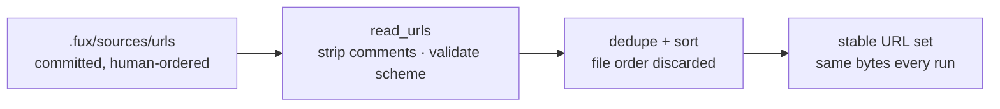

# ADR-URL-LIST — the committed URL list

- **Name:** `ADR-URL-LIST` — cite this everywhere; never cite the number
- **Status:** accepted
- **Date:** 2026-08-19
- **Feature:** `.fux/sources/urls` — the file format itself, as distinct from what fetches its entries
- **Owns:** nothing in `src/` — this record decides a committed *file format*, not a component. The loader (`read_urls`) stays with [ADR-URL-INGEST](0008_url-ingest.md), which owns `ingest/urlsrc.py`
- **Laws:** L2, L3, L4 — see [ADR-LAWS](0001_laws.md); never restated here
- **Split from:** [ADR-URL-INGEST](0008_url-ingest.md) decisions 5 and 6, which shipped in 0.31.x and are restated nowhere

---

## §1 — For humans

The list of URLs Fux indexes is **a file, not a config array**: one URL per
line, `#` comments, blank lines ignored, committed to your repo.

That is the whole decision, and it is not cosmetic. A TOML array of 5 000
entries is **one diff hunk and one merge conflict** — two people adding a URL
in the same week collide, and a reviewer cannot see what changed. One entry per
line is what makes the list reviewable at the size it actually reaches.

The second half is that **the loader sorts and dedupes**. File order is
presentation only. You can group entries by team, by system, by whatever helps
a human read it, and it cannot change a single committed byte — which is what
keeps [ADR-INGEST](0007_ingest.md)'s byte-reproducibility true when two people
maintain the same list in different orders.

The third part is **per-URL attributes**, decided here and built later: a line
may carry `key=value` pairs after the URL, `.gitattributes`-style. **There are
two, and the set is closed.**

| attribute | values | default | decides |
|---|---|---|---|
| **`fetch`** | `http` · `cdp` | `http` | who retrieves the document |
| **`meta`** | `plain` · `hashed` | `hashed` | whether the index may hold readable display text |

```console
$ cat .fux/sources/urls
https://example.com/handbook/oncall                        # both defaults
https://example.com/docs/api             meta=plain
https://wiki.corp/display/ENG/runbook    fetch=cdp
https://app.corp/reports/q3              fetch=cdp meta=plain
```

**A line with no attributes means every default applies** — which is why this
can be decided before it is built: every list valid today stays valid forever.
The full set, what each does to a record, and the candidates deliberately left
out are in §2.

This record exists separately from [ADR-URL-INGEST](0008_url-ingest.md) because
the two answer different questions: that record owns **what fetches a URL**,
this one owns **what the file says**. `fetch=` is the seam between them — this
record fixes the *grammar* and the closed set of attributes; the fetcher records
define what `fetch=` selects.

**Diagram — Mermaid and its ASCII twin. Update both, always, together.**



<details>
<summary><b>ASCII twin</b> — the same diagram, for terminals, diffs, and any reader without a Mermaid renderer</summary>

```text
  .fux/sources/urls        read_urls              dedupe + sort        stable set
  +------------------+   +----------------+   +-----------------+   +-------------+
  | committed        |-->| strip comments |-->| file order is   |-->| same bytes  |
  | human-ordered    |   | validate http  |   | DISCARDED here  |   | every run   |
  +------------------+   +----------------+   +-----------------+   +-------------+
                                 |
                                 v  non-http(s) line
                          error: <file>:<lineno>
```

</details>

### Examples

Captured from the filed fixture,
[`evidence/fixture.sh`](../../work/regression/2026-08-18-ingest-and-index/evidence/fixture.sh):

```console
$ cat .fux/sources/urls
# one URL per line; `#` comments and blank lines are ignored
https://example.invalid/handbook/oncall
https://example.invalid/handbook/deploys
https://example.invalid/gone
```

A URL that fails to fetch is a **skip**, not a deletion — the list is the
statement of intent, and only removing a line removes a document:

```console
$ fux ingest --refresh-urls
ingested 4 docs (2 changed), 3 skipped, 2 shards written
  skip https://example.invalid/gone: fetch failed: 404 not found
```


---

## §2 — For agents

### Context

Three properties had to hold at once, and each rules out an obvious shape.

**It has to merge.** The design point is a corporate corpus, so the list
reaches thousands of entries maintained by people who do not coordinate. Any
format where one logical addition touches a shared line produces conflicts
proportional to team size.

**It has to be reviewable.** A URL entering the index is a decision about what
an agent will treat as authoritative. It belongs in a diff a human reads, not
in a value nested three levels into a config file.

**It must not affect committed bytes.** Two people can hold the same set in
different orders; the index must not know. This is a direct consequence of
L3 — same sources, byte-identical index — applied to *config* rather than
content.

### Decision

**1. The URL list is a file, not a TOML array.** Default
`.fux/sources/urls`, declared **committed** by
[ADR-DOTFUX](0003_fux-directory.md). The path is configurable
([ADR-CONFIG](0014_config.md)); the format is not.

**2. One URL per line.** Blank lines are ignored. This is the property that
makes the file merge line-by-line at any size, and it is the reason the file
exists rather than an array — the same reasoning that shards the index.

**3. `#` starts a comment**, and the rest of the line is discarded. Groups,
owners, and *why this URL is here* are the reason a human can maintain the
file at all. **See §Consequences for the fragment defect this creates.**

**4. The loader dedupes and sorts.** File order is presentation only. A
duplicate line is not an error — it is a merge artefact, and failing the run
for one would make the file hostile to the collaboration it was designed for.

**5. A non-`http(s)` line is a loud error naming `file:lineno`**, never a
silent skip. The house pattern from `store/reader.py`: a typo'd scheme that
quietly fetches nothing is worse than a stopped run, because the corpus is
then wrong in a way nothing surfaces.

**6. The list is intent, not state.** A line present means *this document
belongs in the index*. A fetch that fails keeps the prior record and reports a
skip; only removing the line removes the document
([ADR-URL-INGEST](0008_url-ingest.md) decision 4). The file never records
fetch outcomes.

**7. A line may carry attributes after the URL**, separated by whitespace:
`<url> key=value [key=value ...]`. **Decided here, built later** — no code
reads them yet, and this record does not authorize the parser. A line with no
attributes means every default applies, so **every list that is valid today
stays valid forever**.

**8. `key=value` is the only form.** No bare flags, no `-key` unset, no `!key`
revert — `.gitattributes` needs four states because its entries are *patterns*
that overlap; ours are exact URLs that do not. One form, one meaning, nothing
to resolve. Values carry no whitespace and no quoting; a value that needs
either is a new decision, not a parser feature.

**9. An unknown key is a loud error naming `file:lineno`.** Same rule
[ADR-RECORD](0010_index-record.md) applies to `_format`: a reader that does not
know a key must refuse rather than guess. Silently ignoring one is how a
typo'd `mata=plain` ships a private document to a public index — the failure
being wrong quietly, which decision 5 already refuses in the other direction.

**10. A line attribute beats the source-wide setting.** `meta=plain` on a line
overrides `[sources.url] meta` ([ADR-CONFIG](0014_config.md)) **for that URL
only**. The default stays the strict one — L5 is a safety property, so opting
out is per-document and visible in a diff, never a blanket flip. Two lines
carrying the same URL with **different** attributes are a loud error naming
both line numbers, not a last-wins merge: exact URLs cannot legitimately
disagree, and quietly picking one would make a merge artefact into a policy
change.

**11. The attribute set is closed, and it is two.** `fetch` and `meta`, defined
below. **Adding one is a change to this record**, not a config addition — which
is what makes decision 9's unknown-key error safe to be strict about: the error
is never wrong, because there is nothing legitimate it can reject.

**12. A fux-written line carries every attribute, explicitly.** When the
managing command writes a line it emits the complete set — `fetch=… meta=…` —
even where the value equals the default. **A generated file holds no implicit
state**: the line says what it means, and changing a policy is a one-word diff
rather than the appearance or disappearance of a key. This is the property
[ADR-RECORD](0010_index-record.md) already gives `meta` inside a record ("*a
record read years later still says what rule it was written under*"), now given
to the source list that produced it.

**13. The reader is lenient; the writer is strict.** A missing attribute takes
its default **when read**, so a hand-made list, an older file, or a merge that
dropped a key still loads. But a line missing any attribute **was not written by
fux**, and that is worth reporting: a completeness check turns *"the list is not
edited manually"* from a policy into an observation anyone can make. The check
belongs to `fux doctor` ([ADR-DOTFUX](0003_fux-directory.md)); the rule is here
because it is a property of the format.

### The attribute set

**Complete. Anything not in this table is an error at
`file:lineno`** (decision 9).

**A fux-written line always states both** (decision 12). The *default* column
is therefore what a **missing** attribute means to the reader — which, in a
correctly generated file, never happens.

| attribute | values | default when absent | defined by | changes committed bytes? |
|---|---|---|---|---|
| **`fetch`** | `http` · `cdp` | `http` | [ADR-HTTP-FETCHER](0021_http-fetcher.md) · [ADR-CDP-FETCHER](0020_cdp-fetcher.md) | **no** — it selects *who* retrieves the document, not what the record says. A record does not carry which fetcher produced it |
| **`meta`** | `plain` · `hashed` | `hashed` (L5) | [ADR-CONFIG](0014_config.md) · [ADR-RECORD](0010_index-record.md) | **yes** — `plain` writes `title` + `phrases`, `hashed` writes `title_h` instead. The value is recorded per record, so a record read years later still says which rule wrote it |

**`fetch` is a routing decision.** It picks which file under `.fux/fetchers/`
is called for this URL. Exactly one runs ([ADR-FETCHER](0019_fetcher.md)
decision 4), and nothing escalates from one to another
([ADR-HTTP-FETCHER](0021_http-fetcher.md) decision 3) — so the value on the
line is the whole story, every run.

**`meta` is a privacy decision, and it only ever loosens per URL.** The
source-wide setting is the floor; a line may opt one document *out* of hashing
because that document is public. There is deliberately no way to make one URL
stricter than the source — a source that needs hashing needs it for everything,
and per-line strictness would invite the mistake of leaving one line off.

**Two attributes on one line are independent**, in any order, and a line may
carry either, both, or neither:

| line | fetcher | display fields |
|---|---|---|
| `https://a/x` | `http` | hashed |
| `https://a/x  meta=plain` | `http` | plain |
| `https://a/x  fetch=cdp` | `cdp` | hashed |
| `https://a/x  fetch=cdp meta=plain` | `cdp` | plain |

### Considered for the set, and deliberately excluded

**Fetcher tunables** — `wait=`, `settle=`, `port=`, `timeout=`. **Rejected on
principle, permanently.** Those are one fetcher's vocabulary, and
`[sources.url.config]` exists precisely to carry it without fux learning it
([ADR-FETCHER](0019_fetcher.md) decision 8). A `settle=500` in this grammar is
fux knowing what Chrome is, which is the adapter cap breached through the back
door rather than the front.

**Content overrides** — `title=`, `summary=`. **Rejected:** the document owns
its content. Everything in a record is taken from the fetched bytes
([ADR-EXTRACTED](0016_extracted-mode.md)), and a title supplied by the list
would be the one field in the index that no document said.

**Three that the grammar could hold and this record does not decide** — named
so nobody re-argues them from scratch, and so nobody adds one quietly:

| candidate | what it would do | why not here |
|---|---|---|
| `snapshot` | commit a machine-made copy of the content, per URL | the `refer`/`snapshot` policy is per *source* today and belongs to the M4 refer plane ([W-24](../../work/open/W-24-m4-refer-plane.md)); a per-URL form is an L2 decision, not a grammar one |
| `tag` | give a URL document the frontmatter tags a repo file has | URL documents have no frontmatter, so their `tag` edges are always empty — a real gap. But it invents corpus structure in a config file, which needs its own record |
| `max_age` | per-URL freshness bound at answer time | freshness is the refer plane's, and its threshold is prediction **R4**. Deciding it here would fix a number no one has measured |

Each would be a new row in the table above **and a change to this record**,
which is the point of decision 11.

### Consequences

- **The file is becoming tool-managed** (Arpit, 2026-08-19 —
  [W-54](../../work/open/W-54-sources-rewrite.md)): a CLI command will write
  the URL and its attributes, and the list is *"not to be edited manually"*.
  That turns it into a **lockfile** — generated, committed, reviewed in a diff —
  and it changes what three decisions above are *for*, without changing what
  they say. Decision 3's comments stop being how a human annotates and become
  what a writer must preserve; decision 4's "a duplicate is a merge artefact"
  becomes "a writer must not emit one"; and the canonical ordering decision 4
  gives the loader is better done once by the writer. **This record is amended
  in the change that builds that command**, not before — the grammar it fixes is
  unaffected, which is why the amendment can wait for something to amend
  against.

- **Two files now describe one subsystem**, deliberately: this record for the
  format, [ADR-URL-INGEST](0008_url-ingest.md) for the fetch contract. The
  split exists because they are about to diverge —
  [W-54](../../work/open/W-54-sources-rewrite.md) changes this grammar and
  nothing about the fetcher contract.
- **A URL fragment is silently truncated, until decision 7 is built.**
  Decision 3 strips from the first `#` anywhere on the line, so
  `https://x/page#section` loads as `https://x/page`. Two lines differing only
  by fragment collapse into one under decision 4, and a document disappears
  with no error — exactly the failure decision 5 exists to prevent, reached by
  a different route. **Filed as
  [W-54](../../work/open/W-54-sources-rewrite.md).** Decision 7 forces
  the fix rather than merely permitting it: once a line is
  whitespace-delimited, `#` **must** mean a comment only at line start or after
  whitespace, or `<url>#frag meta=plain` cannot be parsed at all. The two land
  together.
- **Attributes are decided and unbuilt**, which is a state this repo now has a
  precedent for ([ADR-ENRICHED](0017_enriched-mode.md)). The risk is a session
  reading decisions 7–11 as permission to write the parser. It is not: the
  grammar is fixed so that W-49 and W-50 build against one rule instead of
  three, and the parser lands with whichever of them lands first.
- **An attribute that changes committed bytes needs a home in the record.**
  `meta=plain` does — it decides `title`/`phrases` versus `title_h`. Today
  `meta` is already a record property, so per-URL `meta` needs no schema
  change. A future attribute that changes bytes without one would be an
  `_format` question, same class as the `enriched` shape.
- **A duplicate is invisible.** Accepted under decision 4, at the cost that a
  reviewer cannot see from the diff that a line was already present.

### Alternatives considered

- **A TOML array in `fux.toml`** (`urls = [...]`) — the original shape,
  **retired with an erroring key** ([ADR-CONFIG](0014_config.md) decision 7).
  One diff hunk, one merge conflict, and it buries a corpus decision inside
  config.
- **Erroring on duplicates.** Rejected: duplicates are what merges produce, and
  a list that fails the build after a clean merge trains people to stop
  maintaining it.
- **Preserving file order.** Rejected: it makes committed bytes a function of
  how someone chose to group their list, which is L3 lost for a cosmetic gain.
- **Sections** (`[http]` / `[cdp]`) — rejected: they reintroduce order
  significance, which decision 4 spent effort removing, and moving a URL
  between mechanisms becomes a two-line diff instead of a one-word one.
- **A file per mechanism** (`urls`, `urls.cdp`) — rejected: no parser change,
  but it multiplies files the moment a second attribute exists, and one already
  does (`meta`). It also makes "which file is this URL in?" a question, where
  decision 7 makes it a column.
- **The four `.gitattributes` states** (set / unset / valued / revert) —
  rejected under decision 8. Those exist to resolve overlapping *patterns*;
  exact URLs never overlap, so three of the four states would only ever be
  spelling variants of the fourth.
- **Last-wins on a duplicate URL with conflicting attributes** — rejected under
  decision 10. It is what `.gitattributes` does, and it is right there because
  later lines are deliberate overrides. Here a duplicate is a merge artefact
  (decision 4 says so), and silently letting a merge artefact decide a privacy
  policy is the worst available outcome.

### Reference (required)

- The loader and its rules — [`read_urls`](../../src/fux/ingest/urlsrc.py),
  whose docstring states the sort-and-dedupe guarantee.
- A real list, and the fetch behaviour it drives —
  [`work/regression/2026-08-18-ingest-and-index/`](../../work/regression/2026-08-18-ingest-and-index/report.md)
  §6, with its committed fixture at
  [`evidence/fixture.sh`](../../work/regression/2026-08-18-ingest-and-index/evidence/fixture.sh).
- The fetch contract this record is split from —
  [ADR-URL-INGEST](0008_url-ingest.md) decisions 4, 5 and 6.
- Prior art for per-entry attributes on a line-oriented committed file —
  git's `gitattributes` format (`pattern attr1 attr2…`, set / unset / valued):
  https://git-scm.com/docs/gitattributes
- Prior art for explicit per-entry fetch mechanism rather than automatic
  fallback — `scrapy-playwright`, where browser rendering is a per-request
  opt-in and there is no automatic escalation:
  https://github.com/scrapy-plugins/scrapy-playwright

### Veto condition

**Reopen this decision if** an attribute is wanted that cannot be written as a
whitespace-free `key=value` — a value needing quoting or spaces breaks decision
8 and the grammar has to grow rather than bend. **Or** if a committed list is
ever found where two lines carry the same URL and conflicting attributes and
someone wants that to *work* rather than to error: that is decision 10 being
wrong about who writes duplicates.

**How to check it:**

```bash
# 1. does any committed list want a value the grammar cannot hold?
grep -nE '[a-z]+="|[a-z]+=[^ ]* [^ ]*=' .fux/sources/urls 2>/dev/null
# expect: no output — a quoted or spaced value means decision 8 is under strain

# 2. does any URL appear twice with different attributes?
awk '!/^ *#/ && NF {print $1}' .fux/sources/urls 2>/dev/null | sort | uniq -d
# expect: no output; a hit must be an error, per decision 10

# 3. is the parser built yet? (decisions 7-11 are decided, not authorized)
grep -c "key=value\|attrs\|attributes" src/fux/ingest/urlsrc.py
# 0 means unbuilt, which is the current and expected state
```
