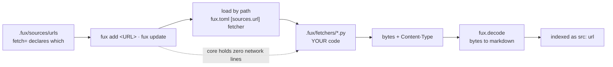

# ADR-FETCHER — the consumer-owned fetcher

## §1 — For humans

**Fux never fetches. Your fetcher does.** A Python file in your repo, named in
`fux.toml`, loaded by path, called once per URL under either fenced path —
`fux add <URL>` (that URL only) or `fux update` (all of them). Core holds **zero
network lines**, and that is the property this record exists to keep true.

The file is called a *fetcher* and not middleware. Middleware composes: Django,
Express, Rack, Scrapy's downloader middlewares all chain, each wrapping the
next, each free to pass through or short-circuit. **Nothing here chains.** One
file, one `fetch(url) -> tuple[bytes, str]`, exactly one of them running for any
given URL. A thing that does not compose should not carry the name of the
pattern whose defining property is composition.

The name also had to avoid a collision. [ADR-RECORD](0010_index-record.md)
already defines `src` as *which **adapter** owns this document*, so calling the
consumer file an adapter would give one word two referents in adjacent code —
the exact collision [ADR-EXTRACTED](0016_extracted-mode.md) exists to close.
**`fetcher` fits and agrees**: the file, the function, the config key and the
per-URL attribute all say one word.

**Diagram — Mermaid and its ASCII twin. Update both, always, together.**



<details>
<summary><b>ASCII twin</b> — the same diagram, for terminals, diffs, and any reader without a Mermaid renderer</summary>

```text
  .fux/sources/urls          fux add <URL> · fux update
  (fetch= declares which) -->  |  load by path from fux.toml
                               v
                     .fux/fetchers/*.py   <-- YOUR code, fux never rewrites it
                               |              core holds ZERO network lines
                               v
                     bytes + Content-Type
                               |
                               v
                    fux.decode  -->  markdown  -->  indexed as src:"url"

  exactly ONE fetcher runs per URL — no chain, no wrapping, no passthrough
```

</details>

### Examples

The contract, from the file that implements it in this repo
([`.fux/fetchers/cdp.py`](../../.fux/fetchers/cdp.py)):

```python
configure(config: dict) -> None  # optional; once after import, before connect()
connect() -> None                # optional; once, before the first fetch
fetch(url: str) -> tuple[bytes, str]
                                 # required; the bytes the server sent plus the
                                 # Content-Type it declared. Fux decodes them.
close() -> None                  # optional; once, after the last fetch — even if fetch raised

validate(url: str) -> str | None # optional; decision 12
is_rate_limited(exc) -> bool     # optional; decision 13 — "was that a refusal
                                 # for asking too fast?" Declared, never sniffed.

MAX_PARALLEL = 1                 # optional module constant; absent means 1
```

The retired key stops the run and says what to do:

```console
$ fux update
error: fux.toml: [sources.url] middleware was renamed to fetcher — rename the
key, and move the file from .fux/middleware/ to .fux/fetchers/ (ADR-FETCHER)
# exit 1
```

---

## §2 — For agents

### Context

Two things forced this record, and only one of them is the name.

**The name was actively misleading.** The closest neighbour in the field —
Scrapy — uses "downloader middleware" for something that genuinely composes, and
a chained-list option was on the table when the rename was decided. A reader who
knows the pattern would reasonably assume chaining works here. It does not, and
decision 4 says so out loud so that assumption cannot survive contact.

**The contract was recorded inside a record about something else.**
[ADR-URL-INGEST](0008_url-ingest.md) owns *how URL ingestion behaves* — refresh
semantics, failure handling, normalization. The fetch **contract** is a separate
thing with a separate audience: a consumer writing a file, not a maintainer
reading the pipeline.

### Decision

**1. Fux never fetches; a consumer-owned fetcher does.** `src/fux/` holds no
network code, no HTTP client, no browser driver, and no dependency for any of
them. This is the **adapter cap**, and it is what makes the source list a design
choice rather than a dependency budget.

**2. The contract is four functions, one required.**
`fetch(url) -> tuple[bytes, str]` is required — the bytes the server sent plus
the `Content-Type` it declared; `configure(config)`, `connect()` and `close()`
are optional. `close` is called even if a fetch raised.

⚠ **The tuple is load-bearing twice over.** The fetcher is the only thing that
ever sees the HTTP charset header — a file on disk has none, which is why
`htmldoc` sniffs `<meta charset>` — so for a URL the header is authoritative and
strictly better than sniffing. And it is what lets a **non-HTML URL reach the
right decoder at all**.

⚠ **A bare `str` return is still accepted, and that is a transition ramp rather
than an oversight.** A `str` is treated as already-prose markdown, which is
exactly what the previous contract returned. **This is the one place the old
contract survives**, and it is what converts a breaking change into a
deprecation. ⚠ **The cost of removing it has never been measured** —
`fux-engine` is on PyPI and nobody has checked whether a consumer fetcher exists
outside this repo. **Do not remove the ramp without measuring what it
protects.**

**3. It is called a *fetcher*, not middleware, not an adapter.** The file, the
required function, the config key and the per-URL attribute all say `fetch`.

**4. Exactly one fetcher runs per URL.** No chain, no wrapping, no
passthrough-to-the-next. A URL resolves to one fetcher and that fetcher either
returns a document or raises. **This is the decision that keeps decision 3
true** — the day a chain lands, the name is wrong again.

**5. Which fetcher a URL uses is declared, never detected.** Via
[ADR-URL-LIST](0018_url-list.md)'s `fetch=` attribute, which resolves to
`<fetchers dir>/<name>.py` — the directory being the parent of
`[sources.url] fetcher` ([ADR-CONFIG](0014_config.md) decision 5). **A fetcher
no line names is never imported**, which is what keeps a repo that only wants
plain HTTP from loading WebSocket code. Automatic escalation from one fetcher to
another would make the committed bytes a function of network conditions at that
instant — L3 lost on the one path that is already the exception. This follows
`scrapy-playwright`, which makes browser rendering a per-request opt-in with no
automatic fallback at all.

**5a. Content-type resolution follows the same rule: declared first, path
second, never sniffed.** The HTTP header wins; a URL's extension is a fallback
hint; the bytes are never inspected. A heuristic here would make the committed
index a function of how confident a guesser felt.

**6. Fetchers live in `.fux/fetchers/`**, a child declared **committed** by
[ADR-DOTFUX](0003_fux-directory.md). Plural, because decision 5 presumes more
than one can exist in a repo at once.

**Fux ships two of them and imports neither.** `http.py` and `cdp.py` live in
the wheel as package data under `src/fux/templates/`, **with an extension
Python's import machinery cannot resolve**, and `fux setup` copies them out
write-if-missing.

⚠ **The two shipped files are on the same axis, and it is *whose session*, not
*how hard it tries*.** `http.py` uses none; `cdp.py` borrows the one your
browser already holds. **Neither renders a page** — `cdp.py` stopped on
2026-09-01 (W-98) and now intercepts the response, so both return the bytes the
server sent and the type it declared, and `fux.decode` converts. That matters
here rather than only in [ADR-CDP-FETCHER](0020_cdp-fetcher.md): decision 5
forbids escalation between fetchers, which is only coherent while the two
produce the *same kind of thing* for the same URL. A renderer and a downloader
on one axis would have made "which fetcher ran" a fact about the committed
index, and that is L3 demoted to a code comment. That is decision 1 made **structural**: a `.py` in the package
could be imported by a later edit, a `.py.txt` cannot be. It also answers the
question a shipped default otherwise raises — how an air-gapped consumer gets a
working fetcher without being told to copy a file from GitHub.

**7. `[sources.url] middleware` is a retired key that errors with
instructions**, naming both the new key and the directory move. A retired key
that silently does nothing is worse than one that stops the run, and here
"silently does nothing" would mean falling back to a default path and fetching
the wrong thing.

**8. `[sources.url.config]` is passed to `configure()` verbatim** and fux never
reads a key inside it. It is the back door through which the adapter cap would
otherwise leak: a `cdp_port` in fux's schema is fux knowing about Chrome.

**9. A fetcher may declare `MAX_PARALLEL = n` as an optional module constant.
Absent the declaration the value is 1.** This is decision 5's own principle —
*declared, never detected* — applied to a second property, and it is
deliberately a **constant rather than a function**: the four-function contract
has survived two callers unchanged, and a capability flag is not a capability.

⚠ **A declaration is a CEILING on what a consumer may ask for, never a FLOOR on
what fux will do unasked.** When the consumer has configured nothing, fux uses
`min(declared, DEFAULT_MAX_PARALLEL)` — see [ADR-CONFIG](0014_config.md)
decision 7a. `MAX_PARALLEL` answers *what is safe*; it was never a claim about
what the consumer's host can absorb, and reading it as one is how `http.py`'s
honest `8` became eight live connections to a wiki nobody asked about.
**Fetcher authors: declare the truth about your module and nothing about
politeness** — the second half is the consumer's to say, in `fux.toml`.

⚠ **Why a blanket pool was refused, and it is not "it crashes".** The shipped
`cdp.py` sets a module-global `_session` holding **one WebSocket** that every
`fetch()` reuses. Two threads writing frames onto it produce **plausible
documents attributed to the wrong URLs** — which lands in the committed index,
**passes every determinism check**, and is found only by a human reading an
answer. `http.py` builds a fresh request per call and is safe. A blanket pool
would have been correct for the fetcher most consumers use and silently
corrupting for the one the enterprise design point exists to serve.

**`connect()` / `close()` stay once per group, never once per worker.** Only
`fetch` runs concurrently, so a fetcher declaring `MAX_PARALLEL > 1` is
declaring exactly *my `fetch` is reentrant given one `connect`*.

**The shipped `cdp.py` declares `1` explicitly rather than omitting it.**
Omission and `1` behave identically; the explicit line is where the *reason*
gets written for the consumer who copies the file and starts editing it.
`http.py` declares `8`: if the safe fetcher does not opt in, the mechanism ships
dead.

**10. Per-URL error isolation stays in fux.** A raising `fetch` becomes one
`Skipped` and the batch continues — [ADR-URL-INGEST](0008_url-ingest.md)
decision 3 in code. That is why an optional `fetch_many` was rejected: under it
every fetcher author would have to reimplement that correctly, and most would
not.

**11. A skip must say WHICH of two things happened, and consumer decoders reach
URL bytes.** Amended 2026-08-27, on
[a run against real external URLs](../../work/regression/2026-08-27-daemon-real-url/report.md).

- **The defect.** `https://httpbin.org/uuid` was skipped as *"no decoder for
  application/json"* while `jsondoc` is **built in**, claims `.json`, ran, and
  correctly dropped a bare UUID — leaving nothing. The message **states a
  falsehood** and sends a reader to write a decoder that already exists.
- **The rule.** The reason comes from `decode.reason()`, which has always
  distinguished *nothing claims this type* from *a decoder owned it and got
  nothing out*. Its own docstring says conflating them *"would make the queue
  useless"*; the **file** path used it and this path did not.
- ⚠ **And `decode()` is called with `root`**, which it was not. Without it
  `registry(None)` returns built-ins only, so **a consumer's own decoder in
  `.fux/decoders/` never applied to a fetched document** — ADR-DECODE's premise,
  *a consumer may bring a dependency fux may not*, stopping at exactly the
  boundary where an unusual content type is most likely to arrive.
- ⚠ **What is NOT decided here:** the file path routes an unreadable document
  into `.fux/enrich/queue.tsv`; this path routes it nowhere, so **a URL that
  needs a model can never be queued for one.** `queue.tsv` is committed, so
  that is a scope call. **Named, not taken.**

**12. `validate(url) -> str | None` — the optional fifth function.** W-87 P4
fork 3, ruled by Arpit 2026-08-28 once [P3](../../work/regression/2026-08-27-p3-sha-stability/VERDICT.md)
cleared its gate at 19/19.

⚠ **THE INVARIANT, and it is the whole of the design: a changed token must NEVER
mean a changed record.**

| the fetcher says | fux does |
|---|---|
| a token **equal** to last run's | **skips the body fetch** — the only thing `validate` may do |
| a **different** token | fetches, **then still compares the sanitized sha** |
| `None` — *"I cannot tell"* | fetches, exactly as before |
| raises | fetches. An optimisation may not fail a run |

**So a chatty `ETag` costs a wasted fetch and cannot churn a shard.**
`validate` can only ever save work — byte-determinism is untouched **by
construction**, not by test. Verified live: `Special:Random`'s token rotates
every request, and it is re-fetched every run while three stable URLs are not.

- **Zero migration.** `None` and a missing function are the same thing, so every
  fetcher written before this keeps working.
- **The token is opaque.** Fux hashes and compares; it never parses one. That is
  what stops `validate` smuggling HTTP semantics into an engine that has none.
- **The shipped `http.py` implements it** — a `HEAD` for `ETag`, falling back to
  `Last-Modified` — which is the clean test that the fifth function is not dead
  weight. ⚠ **It names its own cost**: a `HEAD` is not free, is not always
  honoured, and some servers compute a different `ETag` for it. The docstring
  says to delete the function if that is your intranet.
- ⚠ **It reaches existing repos only when they copy it in.** `fux setup` is
  write-if-missing and never rewrites a consumer's fetcher — the same freeze
  ADR-DOTFUX decision 6 names. Measured: a repo created before this change
  learned **0 of 7** tokens until its `http.py` was replaced by hand.
  ✅ **Made visible 2026-08-28, by the mechanism ADR-DOTFUX decision 6 names for
  exactly this** — *a loader refusal or a `doctor` check, never a rewrite.*
  `doctor._fetcher_capabilities` reads the consumer's fetcher **as text, never
  importing it** (doctor is offline, and a fetcher may open a session at import)
  and names each optional function the file lacks, the record that added it, and
  what the repo forfeits without it. A **warning, never an error**: absence is
  legal by contract, and reporting a supported configuration as a failure trains
  people to ignore a red doctor. ⚠ **The gap is now visible, not closed** — a
  consumer must still copy the function in themselves, which is the freeze
  working as designed rather than a defect in it.
- **A validated URL is neither a fetch nor a skip**, and is counted separately —
  its prior record is correct and carried forward, which is the opposite of a
  failure. `fux update` prints the count, because **an optimisation that fails
  silently in the safe direction looks identical to one that never ran.**

**13. `is_rate_limited(exc) -> bool` — the optional sixth function. Ratified by
Arpit 2026-08-28.** W-82 ruling 12 built it, a real `429` exercised it, and
⚠ **no record decided it until now** — it was in the shipped `http.py`, read by
`urlsrc.py`, and absent from this contract block and from every decision here.
**A mechanism with a gate and no record is the shape this project keeps paying
for**; L8 was the same class three days earlier.

**Why the fetcher answers and not the engine.** This is decision 5's *declared,
never detected* and decision 9's capability/policy split, applied to a third
property. **The fetcher speaks HTTP and can see a `429`; fux deliberately
cannot** — it never reads a status code, a header, or an error string. A
`429` is an HTTP fact, and `cdp.py` or a future gRPC fetcher would express the
same refusal completely differently.

⚠ **`"429" in str(exc)` was the obvious alternative and is refused.** It is
branching on prose: it works until a fetcher rewords one message, and then it
**silently stops backing off** and nobody finds out. Same defect as reading a
note's wording instead of its boolean.

⚠ **A fux-shipped `RateLimited` exception was considered and refused**, and it
is the strongest alternative: `isinstance()` needs no `getattr`, and consumer
code could not throw from it. It costs the property that **fetchers import
nothing from fux** — verified 2026-08-28, `http.py` has zero fux imports and
the engine has never heard of its `FetcherError`. That isolation is why a
fetcher is consumer-owned code rather than a plugin, and a typed exception
would make every existing consumer file need editing to keep working.

**What fux does with a `True`, and what it refuses to do.** Bounded exponential
backoff (`RATE_LIMIT_RETRIES = 3`, 1 s → 2 s → 4 s), refusals counted **by host
rather than by URL** — twelve refusals across twelve pages of one wiki is one
fact — reported on stderr during the run **and** persisted for `fux doctor`.
⚠ **It never lowers `[sources.url] max_parallel`.** State the cost, do not
clamp the knob: an auto-lowered cap is a number the consumer did not pick and
cannot predict, and `doctor` names the host so they can lower it themselves.

**Optional, and absence is not an error.** A fetcher that declares nothing gets
no retries and behaves exactly as it did before ruling 12 — every fetcher
written earlier keeps working untouched.

⚠ **A predicate that RAISES warns and returns `False`** (Arpit, 2026-08-28).
Decision 10's per-URL isolation applies to the predicate as well as to `fetch`
— one consumer bug must never end an ingest of 10 000 documents — but until
this ruling it failed **silently**, so a broken predicate and a host that never
refuses you were indistinguishable: no backoff, no count, no warning, and
`doctor` reporting nothing wrong. It now says so once per run, on stderr, and
still does not raise. **Once per run, not once per URL** — a predicate that
throws throws on every attempt of every URL, and thousands of identical lines
is how a warning becomes something people filter out.

### Consequences

- **The contract survived gaining a second caller unchanged.** The refer plane
  needed a fetch and nothing more, so it reuses this contract instead of adding
  a second fetch mechanism to the engine.
- **`sanitize` is shared, not duplicated, and the reason is sharp.** A
  verify-time sha is compared against an ingest-time sha, so a one-character
  divergence between two copies of the normalizer would mark **every** URL
  document permanently stale — a defect that presents as a working freshness
  feature. Asserted by *function identity* in `tests/refer/test_source.py`, not
  by a string match.
- **Concurrency inside `fetch_all` is invisible to L3.** Sequential fetching was
  never what made the index deterministic — the trailing
  `fetched.sort(...)` / `skipped.sort(...)` is, so completion order never
  reaches a committed byte. `concurrent.futures` is stdlib, so L1 is untouched.
- ⚠ **One test earns its place and no manual checking substitutes for it**: a
  fetcher declaring `1` is **observed** never to have two `fetch` calls in
  flight, via a counter inside a test fetcher — with a control arm proving a
  fetcher declaring more genuinely does run concurrently, so a pool that never
  parallelised could not pass by doing nothing.
- ⚠ **The shipped fetchers import `fux.decode`, and that inverts the dependency
  direction.** Fux imports the fetcher and the fetcher used to import nothing of
  fux — which is what made *"it is your code"* literally true. A shipped fetcher
  now carries `from fux.decode.htmldoc import …`, so **a consumer's committed
  file depends on fux's internal module layout**: renaming `htmldoc` breaks every
  copy in every consumer repo, and those copies are files fux has promised never
  to rewrite. The `.py.txt` extension still keeps the template un-importable, so
  nothing about L4 changes; what changed is that `fux.decode.htmldoc` is
  **public surface in practice** even though nothing declares it so. **Weigh
  that before renaming anything under `decode/`.**
- **Conversion left the fetchers entirely.** Both templates used to hold their
  own copy of the HTML→Markdown pass — **four hand-maintained copies of one
  converter**, and the templates are what `fux setup` writes into every new
  consumer's repo, so the duplication was **shipped**. `http.py`'s own docstring
  had stated the consequence as a rule nothing enforced: *both fetchers must
  produce the same markdown from the same bytes, or which fetcher retrieved a
  document would change the committed index*. **That is L3 written as a coding
  convention**; decision 2's byte return makes it structural instead.
- **Renaming the key is a breaking change for anyone with a `[sources.url]`
  block**, and decision 7 makes it a stopped run with instructions rather than a
  silent wrong fetch.
- **Fetchers are not linted.** They live in a dotdir, and ruff skips those by
  default. Accepted — it is consumer code, not a fux CI target.
- **Decision 4 constrains any future fetcher work.** A chained fetcher is not
  merely disfavoured, it contradicts an accepted record; taking it means
  superseding this one, not amending it.

### Alternatives considered

- **Keep "middleware".** Rejected: it names a composition pattern for something
  that cannot compose, and the nearest neighbour in the field uses the word for
  something that genuinely does.
- **"adapter"** — the tempting one, because the surrounding prose already says
  "the adapter cap". Rejected: [ADR-RECORD](0010_index-record.md) defines `src`
  as *which adapter owns this document*, meaning the in-core source type. One
  word, two referents, in adjacent code.
- **"driver"** — accurate, but carries hardware and database connotations that
  make a reader look for a registry and a lifecycle that do not exist.
- **"provider", "backend", "plugin"** — respectively vague, already meaning
  storage, and implying a discovered set of many optional things. Here there is
  one file, named by path, required for the feature to work at all.
- **`fetch(url) -> str`, returning markdown.** Rejected under decision 2: it
  made every fetcher do two jobs, put the *"both fetchers must agree"* rule in a
  docstring where nothing could enforce it, and made a URL serving a PDF
  unindexable.
- **An optional `fetch_many`.** Rejected under decision 10.
- **A blanket thread pool over `fetch`.** Rejected under decision 9, on the
  shipped `cdp.py`'s single shared WebSocket.
- **Renaming later.** Rejected on the same reasoning that ratified `mode`: the
  key and the directory path are in every consumer's committed repo, so the cost
  of the rename only rises.

### Reference (required)

- Fux's half of the contract —
  [`src/fux/ingest/urlsrc.py`](../../src/fux/ingest/urlsrc.py):
  `load_fetcher`, `configure_fetcher`, `resolve_parallel`, `fetch_all`.
- The shipped templates —
  [`src/fux/templates/`](../../src/fux/templates/), `http.py.txt` and
  `cdp.py.txt`; a real fetcher implementing the contract —
  [`.fux/fetchers/cdp.py`](../../.fux/fetchers/cdp.py) and
  [ADR-CDP-FETCHER](0020_cdp-fetcher.md).
- The retired-key error — [`src/fux/config.py`](../../src/fux/config.py).
- The behaviour around the contract — [ADR-URL-INGEST](0008_url-ingest.md),
  captured in
  [`work/regression/2026-08-18-ingest-and-index/`](../../work/regression/2026-08-18-ingest-and-index/report.md) §6.
- Prior art for per-request opt-in with **no** automatic fallback —
  `scrapy-playwright`: https://github.com/scrapy-plugins/scrapy-playwright

### Veto condition

**Reopen this decision if** more than one fetcher ever runs for a single URL —
a chain, a fallback, a wrapper — because at that moment the thing composes and
decision 3's argument against "middleware" collapses.

**Or if decision 13's boundary regresses** — check these, do not wait for them:

- **`urlsrc.py` mentions a status code, a header name, or matches text inside an
  exception.** The engine has started speaking HTTP, and the fetcher plane's
  whole reason for existing is gone.
- **The retry path can see `max_parallel` or the worker count.** That is one
  edit away from auto-lowering it, which ruling 12 refused.
- **A raising predicate stops warning.** It reverts to the silent failure Arpit
  ruled out on 2026-08-28, and every test still passes.
- **A fetcher template acquires a `fux` import.** The isolation that refused a
  typed `RateLimited` exception has been spent on something else, and the
  argument in decision 13 should be re-run rather than assumed.

**Or if either half of decision 11 regresses:**

- **A skip reason is built from the content type rather than from
  `decode.reason()`.** The message goes back to asserting a decoder is missing
  when one ran.
- **`decode()` or `claims()` is called from this module without `root`.** A
  consumer decoder silently stops applying to URLs, and every test still
  passes because the built-ins cover the common types.

**How to check it:**

```bash
# 1. one fetcher per URL: the config holds a path, never a list
grep -n "fetcher" src/fux/config.py | grep -c "list\|tuple\|\[\]"
# expect: 0

# 2. core still holds zero network lines
grep -rn "urllib\|http.client\|socket\|requests" src/fux/ --include=*.py
# expect: no output — urlsrc.py loads a file, it does not open a connection

# 3. the retired key still stops the run
grep -c 'middleware' src/fux/config.py
# expect: the guard and its message, nothing else

# 4. the shipped templates are still un-importable package data
ls src/fux/templates/*.py 2>/dev/null
# expect: no output — a `.py` here could be imported, which is decision 6's point

# 5. decision 11: the registry is asked with `root`, so consumer decoders apply
grep -n "decode_mod\.\(decode\|claims\)" src/fux/ingest/urlsrc.py
# expect: every call passes `root` as its last argument

# 6. decision 11: no skip reason is assembled from the content type
grep -n "no decoder for {content_type" src/fux/ingest/urlsrc.py
# expect: exactly one — the branch where NOTHING claims the type
```

---

## References

*Every source this record cites, gathered in one place. §2's **Reference
(required)** names the grounding; this is the complete list. An archived
document is never listed here — the body may name one, but archive is not
evidence.*

**Records** — [ADR-LAWS](0001_laws.md) · [ADR-DOTFUX](0003_fux-directory.md) ·
[ADR-URL-INGEST](0008_url-ingest.md) · [ADR-RECORD](0010_index-record.md) ·
[ADR-CONFIG](0014_config.md) · [ADR-EXTRACTED](0016_extracted-mode.md) ·
[ADR-URL-LIST](0018_url-list.md) · [ADR-CDP-FETCHER](0020_cdp-fetcher.md) ·
[ADR-HTTP-FETCHER](0021_http-fetcher.md) · [ADR-REFER](0030_refer-plane.md) ·
[ADR-DECODE](0042_decode.md)

**Code**

- [`.fux/fetchers/cdp.py`](../../.fux/fetchers/cdp.py)
- [`src/fux/config.py`](../../src/fux/config.py)
- [`src/fux/ingest/urlsrc.py`](../../src/fux/ingest/urlsrc.py)
- [`src/fux/templates/`](../../src/fux/templates/)
- [`tests/ingest/test_url_parallel.py`](../../tests/ingest/test_url_parallel.py)

**Measured evidence**

- [`work/regression/2026-08-18-ingest-and-index/report.md`](../../work/regression/2026-08-18-ingest-and-index/report.md)
- [`work/regression/2026-08-19-w54/report.md`](../../work/regression/2026-08-19-w54/report.md)

**Papers and specifications**

- `scrapy-playwright` — prior art for a per-request browser opt-in with no
  automatic escalation
  <https://github.com/scrapy-plugins/scrapy-playwright>
