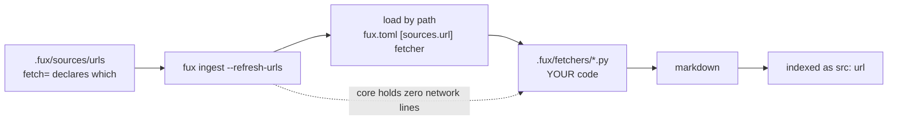

# ADR-FETCHER — the consumer-owned fetcher

- **Name:** `ADR-FETCHER` — cite this everywhere; never cite the number
- **Status:** accepted
- **Date:** 2026-08-19
- **Feature:** the fetch contract and what it is called — renamed from *middleware* on Arpit's instruction, 2026-08-19
- **Owns:** `src/fux/ingest/urlsrc.py` — fux's half of the contract
- **Laws:** L1, L3, L4 — see [ADR-LAWS](0001_laws.md); never restated here
- **Split from:** [ADR-URL-INGEST](0008_url-ingest.md) decisions 1, 2 and 7

---

## §1 — For humans

**Fux never fetches. Your fetcher does.** A Python file in your repo, named in
`fux.toml`, loaded by path, called once per URL under `--refresh-urls`. Core
holds **zero network lines**, and that is the property this record exists to
keep true.

The file used to be called *middleware*, and that was wrong. Middleware
composes: Django, Express, Rack, Scrapy's downloader middlewares all chain, each
wrapping the next, each free to pass through or short-circuit. **Nothing here
chains.** One file, one `fetch(url) -> str`, exactly one of them running for any
given URL. A thing that does not compose should not carry the name of the
pattern whose defining property is composition.

The replacement had to avoid a collision as well as fit.
[ADR-RECORD](0010_index-record.md) already defines `src` as *"which **adapter**
owns this document"*, so calling the consumer file an adapter would give one
word two referents in adjacent code — the exact collision
[ADR-EXTRACTED](0016_extracted-mode.md) exists to close. **`fetcher` fits and
agrees**: the file, the function, the config key and the per-URL attribute all
say one word.

| | before | after |
|---|---|---|
| config key | `middleware = …` | **`fetcher = …`** |
| directory | `.fux/middleware/` | **`.fux/fetchers/`** |
| contract function | `fetch(url)` | `fetch(url)` |
| line attribute ([ADR-URL-LIST](0018_url-list.md)) | — | **`fetch=cdp`** |

**Diagram — Mermaid and its ASCII twin. Update both, always, together.**



<details>
<summary><b>ASCII twin</b> — the same diagram, for terminals, diffs, and any reader without a Mermaid renderer</summary>

```text
  .fux/sources/urls          fux ingest --refresh-urls
  (fetch= declares which) -->  |  load by path from fux.toml
                               v
                     .fux/fetchers/*.py   <-- YOUR code, fux never rewrites it
                               |              core holds ZERO network lines
                               v
                          markdown  -->  indexed as src:"url"

  exactly ONE fetcher runs per URL — no chain, no wrapping, no passthrough
```

</details>

### Examples

The contract, from the file that implements it in this repo
([`.fux/fetchers/cdp.py`](../../.fux/fetchers/cdp.py)):

```python
configure(config: dict) -> None  # optional; once after import, before connect()
connect() -> None                # optional; once, before the first fetch
fetch(url: str) -> str           # required; one URL -> one markdown document
close() -> None                  # optional; once, after the last fetch — even if fetch raised
```

The retired key stops the run and says what to do:

```console
$ fux ingest --refresh-urls
error: fux.toml: [sources.url] middleware was renamed to fetcher — rename the
key, and move the file from .fux/middleware/ to .fux/fetchers/ (ADR-FETCHER,
2026-08-19)
# exit 1
```

---

## §2 — For agents

### Context

Two things forced this record, and only one of them is the name.

**The name was actively misleading.** The closest neighbour in the field —
Scrapy — uses "downloader middleware" for something that genuinely composes,
and a chained-list option was on the table when the rename was decided. A
reader who knows the pattern would reasonably assume
chaining works here. It does not, and the decision below says so out loud so
that assumption cannot survive contact.

**The contract was recorded inside a record about something else.**
[ADR-URL-INGEST](0008_url-ingest.md) owns *how URL ingestion behaves* — refresh
semantics, failure handling, normalization. The fetch **contract** is a
separate thing with a separate audience: a consumer writing a file, not a
maintainer reading the pipeline. It was decisions 1, 2 and 7 of a record nobody
writing a fetcher would think to open.

### Decision

**1. Fux never fetches; a consumer-owned fetcher does.** `src/fux/` holds no
network code, no HTTP client, no browser driver, and no dependency for any of
them. This is the **adapter cap**, and it is what makes the M4 source list a
design choice rather than a dependency budget.

**2. The contract is four functions, one required.** `fetch(url) -> str` is
required; `configure(config)`, `connect()` and `close()` are optional. `close`
is called even if a fetch raised. Unchanged from
[ADR-URL-INGEST](0008_url-ingest.md) decision 2 — restated here because this is
now its home, not paraphrased alongside it.

**3. It is called a *fetcher*, not middleware, not an adapter.** Middleware
composes and this does not; `adapter` is already taken by
[ADR-RECORD](0010_index-record.md)'s `src` property. The file, the required
function, the config key and the per-URL attribute all say `fetch`.

**4. Exactly one fetcher runs per URL.** No chain, no wrapping, no
passthrough-to-the-next. A URL resolves to one fetcher and that fetcher either
returns a document or raises. **This is the decision that keeps decision 3
true** — the day a chain lands, the name is wrong again.

**5. Which fetcher a URL uses is declared, never detected.** Via
[ADR-URL-LIST](0018_url-list.md)'s `fetch=` attribute, which resolves to
`<fetchers dir>/<name>.py` — the directory being the parent of
`[sources.url] fetcher` ([ADR-CONFIG](0014_config.md) decision 5). **A fetcher
no line names is never imported**, which is what keeps a repo that only wants
plain HTTP from loading 28 KB of WebSocket code. Automatic escalation
from one fetcher to another makes the committed bytes a function of network
conditions at that instant, which is L3 lost on the one path that is already
the exception. This follows `scrapy-playwright`, which makes browser rendering
a per-request opt-in and has no automatic fallback at all.

**6. Fetchers live in `.fux/fetchers/`**, a child declared **committed** by
[ADR-DOTFUX](0003_fux-directory.md). Plural, because decision 5 presumes more
than one can exist in a repo at once.

**Fux ships two of them and imports neither.** `http.py` and `cdp.py` live in
the wheel as package data under `src/fux/templates/`, with an extension
Python's import machinery cannot resolve, and `fux setup` copies them out
write-if-missing. That is decision 1 made **structural**: a `.py` in the
package could be imported by a later edit, a `.py.txt` cannot be. It also
answers the question a shipped default otherwise raises — how an air-gapped
consumer gets a working fetcher without being told to copy a file from
GitHub.

**7. `[sources.url] middleware` is a retired key that errors with
instructions**, naming both the new key and the directory move — the pattern
[ADR-CONFIG](0014_config.md) decision 7 already establishes. A retired key that
silently does nothing is worse than one that stops the run, and here "silently
does nothing" would mean falling back to a default path and fetching the wrong
thing.

**8. `[sources.url.config]` is passed to `configure()` verbatim** and fux never
reads a key inside it. Restated from [ADR-URL-INGEST](0008_url-ingest.md)
decision 7 because it is the back door through which the adapter cap would
otherwise leak: a `cdp_port` in fux's schema is fux knowing about Chrome.

### Consequences

- **`_sanitize` became `sanitize`, and the refer plane calls it** (2026-08-20,
  [ADR-REFER](0031_refer-plane.md) decision 3). Fetched-text normalization is
  now shared rather than duplicated, because a verify-time sha is compared
  against an ingest-time sha: a one-character divergence between two copies
  would mark **every** URL document permanently stale — a defect that presents
  as a working freshness feature. Asserted by function identity in
  `tests/refer/test_source.py`, not by a string match.
- **The contract now has a second caller, and it did not change.** That is the
  evidence for decision 1's shape: verify-time fetch needed `fetch(url) -> str`
  and nothing more, so the refer plane reuses this contract instead of adding a
  second fetch mechanism to the engine.

- **This is a breaking change for anyone with a `[sources.url]` block.** Rename
  the key, move the directory. Decision 7 makes it a stopped run with
  instructions rather than a silent wrong fetch. **The cost is near zero
  today** — `v0.32.0`, no external consumers — and it only ever rises.
- **The default fetcher path points at a file fux does not write and does not
  ship.** `DEFAULT_FETCHER` is `.fux/fetchers/cdp.py`, `GENERATED_FILES` is
  `("README.md", ".gitignore")`, and the wheel packaged no fetcher at all — so a
  fresh consumer following the documented default got *"fetcher not found"*, and
  two live docstrings claimed otherwise. **Closed 2026-08-19** by decision 6
  above: both fetchers ship as package data and `fux setup` copies them out. It
  is the reason [ADR-HTTP-FETCHER](0021_http-fetcher.md) generates rather than
  assumes ([run](../../work/regression/2026-08-19-w54/report.md)).
- **Fetchers are not linted.** They live in a dotdir, and ruff skips those by
  default. Accepted, and inherited from
  [ADR-DOTFUX](0003_fux-directory.md) decision 7 — it is consumer code, not a
  fux CI target.
- **Decision 4 is now a constraint on W-50.** The chained-fetcher option is not
  merely disfavoured, it contradicts an accepted record; taking it means
  superseding this one, not amending it.

### Alternatives considered

- **Keep "middleware".** Rejected: it names a composition pattern for something
  that cannot compose, and the nearest neighbour in the field uses the word for
  something that genuinely does.
- **"adapter"** — the tempting one, because the surrounding prose already says
  "the adapter cap". Rejected: [ADR-RECORD](0010_index-record.md) defines `src`
  as *which adapter owns this document*, meaning the in-core source type. One
  word, two referents, in adjacent code — the `extracted`/`INFERRED` collision
  again.
- **"driver"** — accurate, but carries hardware and database connotations that
  make a reader look for a registry and a lifecycle that do not exist.
- **"provider", "backend", "plugin"** — respectively vague, already meaning
  storage, and implying a discovered set of many optional things. Here there is
  one file, named by path, required for the feature to work at all.
- **Renaming later.** Rejected on the same reasoning that ratified `mode`: the
  key and the directory path are in every consumer's committed repo, so the
  cost of the rename is zero now and strictly increasing.

### Reference (required)

- Fux's half of the contract — [`src/fux/ingest/urlsrc.py`](../../src/fux/ingest/urlsrc.py):
  `load_fetcher`, `configure_fetcher`, `fetch_all`.
- The retired-key error — [`src/fux/config.py`](../../src/fux/config.py), and
  the pattern it follows, [ADR-CONFIG](0014_config.md) decision 7.
- A real fetcher implementing the contract —
  [ADR-CDP-FETCHER](0020_cdp-fetcher.md), [`.fux/fetchers/cdp.py`](../../.fux/fetchers/cdp.py).
- The behaviour around the contract — [ADR-URL-INGEST](0008_url-ingest.md)
  decisions 3, 4, 6 and 8, captured in
  [`work/regression/2026-08-18-ingest-and-index/`](../../work/regression/2026-08-18-ingest-and-index/report.md) §6.
- Prior art for per-request opt-in with **no** automatic fallback —
  `scrapy-playwright`: https://github.com/scrapy-plugins/scrapy-playwright

### Veto condition

**Reopen this decision if** more than one fetcher ever runs for a single URL —
a chain, a fallback, a wrapper — because at that moment the thing composes and
decision 3's argument against "middleware" collapses.

**How to check it:**

```bash
# 1. one fetcher per URL: the config holds a path, never a list
grep -n "fetcher" src/fux/config.py | grep -c "list\|tuple\|\[\]"
# expect: 0

# 2. core still holds zero network lines
grep -rn "urllib\|http.client\|socket\|requests" src/fux/ --include=*.py
# expect: no output — urlsrc.py loads a file, it does not open a connection

# 3. the retired key still stops the run
grep -c 'middleware' src/fux/config.py
# expect: 3 — the guard and its message, nothing else
```
