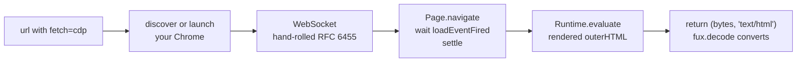

# ADR-CDP-FETCHER — the browser fetcher

## §1 — For humans

Some documents do not exist in the HTML a plain GET returns. A Confluence page,
an internal dashboard, anything rendered client-side — the bytes on the wire are
a loading shell, and the document you wanted appears only after JavaScript runs.
Worse, the ones worth indexing are usually the ones behind a login.

`cdp.py` handles both by **driving the browser you already have**. It attaches
to your running Chrome over the Chrome DevTools Protocol, navigates, waits for
load, settles, and reads the rendered `outerHTML`. Because it is *your* browser,
it is *your* session: pages you are logged into are pages it can read, with no
credential ever entering fux's config.

Two properties are worth stating because neither was forced:

**It carries no dependency.** The WebSocket client is hand-rolled RFC 6455 on
stdlib `socket`. L1 binds fux's runtime, not your fetcher — this file could have
imported `websockets` and nothing would have broken. It does not, so
`pip install fux-engine` remains the whole install even for the browser path.

**It is never escalated to.** A URL uses this fetcher because a human wrote
`fetch=cdp` on its line ([ADR-URL-LIST](0018_url-list.md)), not because a
cheaper fetch failed and something retried. That is
[ADR-FETCHER](0019_fetcher.md) decision 5, and it is what keeps the same URL
producing the same bytes on a bad network day.

**Diagram — Mermaid and its ASCII twin. Update both, always, together.**



<details>
<summary><b>ASCII twin</b> — the same diagram, for terminals, diffs, and any reader without a Mermaid renderer</summary>

```text
  url (fetch=cdp)
        |
        v
  discover or launch YOUR Chrome  --(never a bundled browser)
        |
        v
  WebSocket: hand-rolled RFC 6455 on stdlib socket  --(no dependency)
        |
        v
  Page.navigate -> wait loadEventFired -> settle_ms
        |
        v
  Runtime.evaluate: rendered outerHTML
        |
        v
  return (utf-8 bytes, "text/html")   -->  fux.decode  -->  markdown

  This file does NOT convert. Agreement with http.py is structural.
```

</details>

### Examples

Declare it per URL — only lines that need a browser get one
([ADR-URL-LIST](0018_url-list.md)):

```console
$ cat .fux/sources/urls
https://example.com/docs/api                 # plain GET; no fetcher decision
https://wiki.corp/display/ENG/runbook        fetch=cdp
```

Tune it from `fux.toml`, never by editing the file, so your edits and an upgrade
cannot collide:

```toml
[sources.url]
fetcher = ".fux/fetchers/cdp.py"

[sources.url.config]        # fux passes this VERBATIM and reads no key in it
cdp_port       = 9222
settle_ms      = 500
load_timeout_s = 30
launch_chrome  = true
```

---

## §2 — For agents

### Context

[ADR-FETCHER](0019_fetcher.md) says fux never fetches, which is only useful if a
fetcher exists that can reach the documents the design point actually cares
about. The litmus is a large corporate corpus: Confluence, SharePoint, internal
wikis. Those are the JavaScript-rendered, session-gated case, not the
static-file case — so the **first** fetcher had to be the hard one, or the cap
would have looked like a way to avoid the problem rather than a way to place it.

The transport was already solved and thrown away once: the archived engine
shipped and dogfooded this exact path. Porting it was cheaper than rebuilding
it, and is covered by [ADR-PORT-LIST](0015_port-list.md)'s discipline of porting
with tests rather than rewriting.

### Decision

**1. Drive the user's existing Chrome; never bundle or download a browser.**
Discover a running instance on the configured port, or launch the one already
installed. A tool that downloads a browser has a several-hundred-megabyte
install and an air-gap story it cannot tell.

**2. Stdlib only, by choice.** RFC 6455 hand-rolled on `socket`. L1 binds fux's
runtime and not consumer code, so this is a choice — made so that the browser
path costs no install step and the file stays readable as a worked example of
the contract.

**3. Ported from the archived engine, with its tests.** Named, not cited — the
archive is not evidence.

**4. Tunables come from `[sources.url.config]`, not from editing the file.**
The constants in the file are *defaults*; the table overrides them. This keeps a
consumer's `fux.toml` diff small and their fetcher file mergeable, and it is
[ADR-FETCHER](0019_fetcher.md) decision 8 in use.

**5. It returns bytes and a declared content type, and converts nothing.**
`fetch()` returns the rendered HTML encoded as UTF-8 and **states**
`text/html` — a browser capture has no server header, which is precisely why
the type is declared rather than left for fux to guess. `fux.decode` does the
conversion.

⚠ **Agreement with `http.py` is structural rather than shared.** This file once
carried its own copy of the HTML→Markdown pass, marked *"Kept identical to…"* by
a comment and kept identical by nothing. **There is now nothing left in either
file that could disagree** — which matters because *which fetcher retrieved a
document* must never change a committed byte.

**Link extraction stays here.** Crawling is this fetcher's job and has no
business in the decoder plane, which may not open a socket (L4).

**6. This fetcher is chosen by declaration.** `fetch=cdp` on the URL's line. It
is never the target of an automatic escalation from a cheaper fetcher.

**7. `MAX_PARALLEL = 1`, declared explicitly rather than omitted.** Omission and
`1` behave identically; the explicit line is where the reason gets written for
the consumer who copies the file and starts editing it. ⚠ **The reason is a
module-global `_session` holding one WebSocket that every `fetch()` reuses** —
two threads writing frames onto it produce plausible documents attributed to the
wrong URLs, which lands in the committed index and passes every determinism
check.

**8. It is yours.** Committed to your repo, never rewritten by fux, and every
part of it — port, wait strategy, extraction, even the transport — is editable.
Swapping in Playwright is a supported outcome; fux imports none of it, only the
entry points.

**9. It reaches your repo through `fux setup`, and only then.** The file ships
in the wheel as package data
([`src/fux/templates/cdp.py.txt`](../../src/fux/templates/cdp.py.txt)) with an
extension Python cannot import, and `fux setup` copies it into
`.fux/fetchers/cdp.py` write-if-missing. **Ingest never writes it** — a repo
that indexes only local files never sees a byte of WebSocket code, which is what
decision 1's *never bundle a browser* is worth nothing without.

### What it looks like

**The entry points, as this file implements them:**

```python
def configure(config: dict) -> None: ...   # [sources.url.config], verbatim;
                                           # module constants are only defaults
def connect() -> None: ...                 # discover Chrome on cdp_port, or
                                           # launch the installed one
def fetch(url: str) -> tuple[bytes, str]: ...
                                           # navigate -> loadEventFired ->
                                           # settle -> outerHTML -> (bytes, type)
                                           # Raises: fux skips, keeps prior record
def close() -> None: ...                   # called even if a fetch raised

MAX_PARALLEL = 1                           # one shared WebSocket — decision 7
```

**A run**, captured against the no-network fetcher that stands in for this one
in [the filed fixture](../../work/regression/2026-08-18-ingest-and-index/report.md) §6.
The lifecycle is the real thing; only the transport differs:

```console
$ fux update
  [fetcher] configure({'greeting': 'hello'})
  [fetcher] connect()
  [fetcher] close()
ingested 4 docs (2 changed), 3 skipped, 2 shards written
  skip https://example.invalid/gone: fetch failed: 404 not found
```

`configure` receives the table verbatim, `connect`/`close` bracket the batch,
and a failed page is a **skip** that keeps the previous record — never a
deletion.

**What lands in the index.** Nothing in the record says a browser was involved:
`fetch=` is a routing decision, not a property of the document. Captured with
`meta` at its `hashed` default — note `title_h`, its `h:` prefix
([ADR-RECORD](0010_index-record.md) rule 2), and the absence of
`title`/`phrases`. The capture predates the `flen` field and is not edited:

```json
{
  "id":      "url:https://example.invalid/handbook/oncall",
  "loc":     "https://example.invalid/handbook/oncall",
  "src":     "url",
  "meta":    "hashed",
  "mode":    "extracted",
  "sha":     "2643f1afb68339f2f808d85f67aad193b820dd86",
  "title_h": "h:30aef0c52cf11116",
  "ver":     1,
  "wlen":    11
}
```

**`mode` is `extracted`.** A browser rendered the page and the record is still
deterministic: what the fetcher returns is *bytes*, and everything after that is
the same extraction any repo file gets
([ADR-EXTRACTED](0016_extracted-mode.md)). **Rendering is not enrichment.**

### Consequences

- **A browser must exist on the machine that ingests.** Fine for a developer
  laptop and for most CI, and it is the price of reading pages that only exist
  after JavaScript. A URL that does not need it should not declare `fetch=cdp`.
- **This is the slow path.** A browser round trip per URL, plus a settle. It is
  why [ADR-HTTP-FETCHER](0021_http-fetcher.md) is the default and this is the
  opt-in, rather than the other way round.
- **It is not linted** and it is several hundred lines of consumer code carrying
  a protocol implementation. Its test exists precisely because nothing else
  guards it.
- ⚠ **Decision 7 caps it at one worker, so a large URL list on `fetch=cdp` is
  strictly sequential** — the honest cost of a shared session, stated rather
  than discovered when someone wonders why `fux update` is slow.

### Alternatives considered

- **Playwright or Selenium.** Rejected for the default reference fetcher: a
  dependency plus a browser download, and the thing being demonstrated is that
  the contract needs neither. Still fully supported as *your* choice —
  decision 8.
- **A bundled headless browser.** Rejected under decision 1: install size, and
  it breaks the air-gapped and locked-down-corporate story that is the whole
  design point.
- **`requests` + a readability heuristic.** Rejected: a dependency, and it does
  not solve the case this fetcher exists for — a page that has not rendered yet
  has nothing to be readable about.
- **Making this the default fetcher.** Rejected: it demands a browser for URLs
  that a plain GET would have answered. See
  [ADR-HTTP-FETCHER](0021_http-fetcher.md).
- **Keeping a private HTML→Markdown copy here.** Rejected under decision 5: two
  copies of one converter make *which fetcher ran* a fact about the committed
  index, which is L3 demoted to a code comment.
- **A per-worker `connect()`/`close()` so this could parallelise.** Rejected:
  it changes the contract for every fetcher to accommodate one, and a consumer
  who wants it can raise `MAX_PARALLEL` in their own copy after making `fetch`
  reentrant.

### Reference (required)

- The file itself — [`.fux/fetchers/cdp.py`](../../.fux/fetchers/cdp.py), whose
  module docstring states the contract it implements; the shipped template —
  [`src/fux/templates/cdp.py.txt`](../../src/fux/templates/cdp.py.txt).
- Its test, including that it lives in the declared plane —
  [`tests/ingest/test_cdp_fetcher.py`](../../tests/ingest/test_cdp_fetcher.py).
- The contract — [ADR-FETCHER](0019_fetcher.md).
- The behaviour around it, captured against a no-network fetcher —
  [`work/regression/2026-08-18-ingest-and-index/`](../../work/regression/2026-08-18-ingest-and-index/report.md) §6.
- The WebSocket framing this implements — RFC 6455:
  https://www.rfc-editor.org/rfc/rfc6455
- The protocol it speaks — Chrome DevTools Protocol:
  https://chromedevtools.github.io/devtools-protocol/

### Veto condition

**Reopen this decision if** the file acquires an `import` outside the standard
library, or if it stops being reachable only by declaration — either means the
two properties §1 claims for it are no longer true of the bytes.

**How to check it:**

```bash
# 1. stdlib only
grep -nE "^\s*(import|from) " .fux/fetchers/cdp.py \
  | grep -vE "socket|ssl|json|base64|hashlib|struct|os|sys|time|re|html|urllib.parse|subprocess|shutil|pathlib|typing|dataclasses|__future__"
# expect: no output

# 2. no browser is downloaded or bundled
grep -niE "download|install|playwright|selenium" .fux/fetchers/cdp.py
# expect: no output outside prose about swapping it yourself

# 3. it is still chosen by declaration, not escalation
grep -rn "fetch=cdp\|escalat\|fallback" src/fux/ingest/urlsrc.py
# expect: no automatic-escalation logic in fux's half

# 4. it still converts nothing
grep -n "markdown\|html_to_\|fux.decode" .fux/fetchers/cdp.py
# expect: no conversion — decision 5
```

---

## References

*Every source this record cites, gathered in one place. §2's **Reference
(required)** names the grounding; this is the complete list. An archived
document is never listed here — the body may name one, but archive is not
evidence.*

**Records** — [ADR-LAWS](0001_laws.md) · [ADR-RECORD](0010_index-record.md) ·
[ADR-PORT-LIST](0015_port-list.md) · [ADR-EXTRACTED](0016_extracted-mode.md) ·
[ADR-URL-LIST](0018_url-list.md) · [ADR-FETCHER](0019_fetcher.md) ·
[ADR-HTTP-FETCHER](0021_http-fetcher.md) · [ADR-DECODE](0042_decode.md)

**Code**

- [`.fux/fetchers/cdp.py`](../../.fux/fetchers/cdp.py)
- [`src/fux/templates/cdp.py.txt`](../../src/fux/templates/cdp.py.txt)
- [`tests/ingest/test_cdp_fetcher.py`](../../tests/ingest/test_cdp_fetcher.py)

**Measured evidence**

- [`work/regression/2026-08-18-ingest-and-index/report.md`](../../work/regression/2026-08-18-ingest-and-index/report.md)
- [`work/regression/2026-08-19-w54/report.md`](../../work/regression/2026-08-19-w54/report.md)

**Papers and specifications**

- Chrome DevTools Protocol — the transport the shipped browser template uses
  <https://chromedevtools.github.io/devtools-protocol/>
- RFC 6455 (The WebSocket Protocol) — the framing this implements
  <https://www.rfc-editor.org/rfc/rfc6455>
