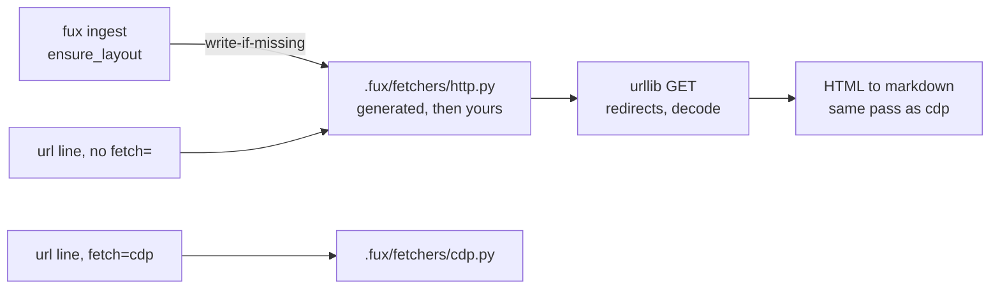

# ADR-HTTP-FETCHER — the default fetcher

- **Name:** `ADR-HTTP-FETCHER` — cite this everywhere; never cite the number
- **Status:** accepted — **the decision is ratified; the file is not written yet**
- **Date:** 2026-08-19
- **Feature:** `.fux/fetchers/http.py` — the fetcher a URL gets when its line says nothing
- **Owns (on build):** nothing in `src/` — like every fetcher it is consumer code. What lands in `src/` is one entry in `fuxdir.py`'s generated set
- **Laws:** L1, L4, L5 — see [ADR-LAWS](0001_laws.md); never restated here
- **Implements:** [ADR-FETCHER](0019_fetcher.md) · **Answers *where the default fetcher lives*** — built 2026-08-19, [run](../../work/regression/2026-08-19-w54/report.md)

---

## §1 — For humans

Most documents worth indexing are served as HTML by a server that has already
rendered them. Requiring a browser for those is absurd — and until this record,
that is exactly what fux required, because the only fetcher that existed drove
Chrome.

**The default becomes a plain GET.** A URL whose line carries no `fetch=` gets
`http.py`: `urllib.request`, follow redirects, decode, convert to markdown with
the same deterministic pass the CDP fetcher uses. A URL that needs a browser
says so — `fetch=cdp` — and that is the only way it happens.

The interesting part is **where the default lives**. Putting `urllib` in
`src/fux/` would be the obvious move and would cost the adapter cap: core would
hold network code, and *"fux never fetches"* would become *"fux fetches, except
when it doesn't"*. Instead fux **generates** `.fux/fetchers/http.py` into your
repo, write-if-missing — the same mechanism
[ADR-DOTFUX](0003_fux-directory.md) decision 6 already uses for `.fux/README.md`
and `.fux/.gitignore`. You get a working default with no configuration; core
ships a *template*, never a fetch path; and the file is yours from birth —
committed, editable, reviewable.

**There is no automatic escalation.** If the plain GET returns a shell that
needed JavaScript, fux does not quietly retry through Chrome. It returns what it
got. Deciding a page needs a browser is a judgement a human makes once and
writes down, because the alternative is committed bytes that depend on how a
server felt that afternoon.

**Diagram — Mermaid and its ASCII twin. Update both, always, together.**



<details>
<summary><b>ASCII twin</b> — the same diagram, for terminals, diffs, and any reader without a Mermaid renderer</summary>

```text
  fux ingest / ensure_layout
        |  write-if-missing (never overwrite)
        v
  .fux/fetchers/http.py    <-- generated once, then YOUR file
        ^
        |  url line with no fetch=  (the default)
        |
  url line with fetch=cdp  -->  .fux/fetchers/cdp.py

  core src/fux/ still holds ZERO network lines — it writes a template,
  it does not open a connection.  No escalation between the two, ever.
```

</details>

### Examples

**Specimen, not a capture** — the file is not written yet.

*Before:* a URL source needs a browser, or a hand-written fetcher, for a page a
plain GET would have served.

```console
$ fux ingest --refresh-urls
error: [sources.url] fetcher not found: .fux/fetchers/cdp.py
# exit 1
```

*After:* the default works with no fetcher decision at all, and the browser is
opt-in per line.

```console
$ cat .fux/sources/urls
https://example.com/docs/api
https://wiki.corp/display/ENG/runbook    fetch=cdp

$ fux ingest --refresh-urls
wrote .fux/fetchers/http.py
ingested 2 docs (2 changed), 0 skipped, 2 shards written
```

`wrote …` appears **once, ever** — `ensure_layout` is write-if-missing, so the
next run is silent and your edits survive it
([ADR-DOTFUX](0003_fux-directory.md) decision 6). The generated file itself, and
the failure this record refuses to paper over, are in §2.
---

## §2 — For agents

### Context

Arpit, 2026-08-19: *"whether a URL should be fetched using middleware or not is
optional — by default it should be fetched without CDP."* Correct, and the
research agreed with the second half of the instinct rather than the first: the
field's answer to "which pages need a browser" is either **explicit per-request
opt-in with no fallback** (`scrapy-playwright`) or **static-first with heuristic
escalation** (the crawler vendors). The heuristics exist because an open-web
crawler cannot enumerate its corpus. **Fux's URL list is committed and
enumerable**, so declaration is available, and declaration is strictly better:
it survives review, it diffs, and it produces the same bytes every run.

That left one genuinely open question — *where does the default fetcher live* —
and one defect that answered it. The default fetcher path already pointed at a
file fux neither wrote nor shipped, so "ship it and write it at setup" was
already the missing behaviour, not a new one.

### Decision

**1. A plain HTTP GET is the default.** A URL whose line carries no `fetch=`
attribute is fetched by `http.py`: `urllib.request`, redirects followed,
response decoded, converted with the same deterministic HTML→markdown pass
[ADR-CDP-FETCHER](0020_cdp-fetcher.md) uses.

**2. It is generated into the consumer's repo, write-if-missing** — never
imported from `src/fux/`. **Amended 2026-08-19 (Arpit):** the writer is
**`fux setup`**, not `ensure_layout`. This record originally said ingest would
write it, and that is wrong for a reason worth stating: `ensure_layout` runs at
the head of *every* ingest, so putting a fetcher there means a repo that only
wanted an index gets 28 KB of code it never asked for, on its first run. Setup
is optional, explicit, and once per repo — a consumer asked for it.

The file itself ships in the wheel as **package data** with an extension
Python's import machinery cannot resolve (`templates/http.py.txt`), so it is
copied out and never imported. **Core keeps zero network lines and zero network
imports**, and the adapter cap is structural rather than remembered.

`ensure_layout` still writes `.fux/README.md` and `.fux/.gitignore` at every
ingest, and still never overwrites ([ADR-DOTFUX](0003_fux-directory.md)
decision 6) — the two moments are now a table in that record.

**3. There is no automatic escalation to another fetcher, ever.** Not on
non-2xx, not on an empty body, not on a rendered-shell heuristic. A plain GET
that returns something useless returns something useless, and a human writes
`fetch=cdp` on that line. [ADR-FETCHER](0019_fetcher.md) decision 5 is the rule;
this is the case that would otherwise have broken it.

**4. Hashed meta still applies** — L5 is a property of the *source*, not of the
transport, and a default fetcher does not make a URL public. Per-URL
`meta=plain` remains the explicit opt-in
([ADR-URL-LIST](0018_url-list.md) decision 10).

**5. Both generated fetchers are consumer code from birth.** Committed,
editable, never rewritten. Fux writing the first version does not make it fux's
file — the same relationship `.fux/README.md` already has.

**6. Built 2026-08-19**, together with the
`fetch=` value set it selects on. The generated file is at
[`src/fux/templates/http.py.txt`](../../src/fux/templates/http.py.txt).

**7. Its HTML→markdown pass is byte-identical to `cdp.py`'s.** Not "the same
approach" — the same code, and a test asserts the two agree on the same input.
`fetch=` is a routing decision and a record does not say which fetcher produced
it ([ADR-URL-LIST](0018_url-list.md) §The attribute set), so two converters
that drifted would make the committed index a function of which fetcher ran.

### What it looks like

**Specimen, not a capture.** The shape is what decisions 1–3 fix; the exact
bytes are the build's.

**The whole fetcher.** It is short on purpose: the point of the contract is that
a useful fetcher is a page of stdlib, and the point of *generating* it is that
this page lives in your repo rather than in fux.

```python
"""Default URL fetcher — a plain GET. Generated by fux, owned by you.

Fux writes this file once if it is missing and never rewrites it. Edit it:
add headers, a proxy, a retry, an auth token from your environment. Fux
imports none of that — only the entry points below.
"""
import urllib.request

_SETTINGS = {"timeout_s": 30, "user_agent": "fux/0.x (+https://github.com/arpitarya/fux)"}

def configure(config: dict) -> None:
    _SETTINGS.update(config)          # [sources.url.config], verbatim

def fetch(url: str) -> str:
    req = urllib.request.Request(url, headers={"User-Agent": _SETTINGS["user_agent"]})
    with urllib.request.urlopen(req, timeout=_SETTINGS["timeout_s"]) as resp:
        raw = resp.read()
        charset = resp.headers.get_content_charset() or "utf-8"
    return html_to_markdown(raw.decode(charset, errors="replace"))
```

No `connect`/`close`: they are optional, and a stateless GET has no batch to
bracket ([ADR-FETCHER](0019_fetcher.md) decision 2).

**The failure decision 3 refuses to paper over.** A client-rendered page returns
a shell, and fux indexes the shell:

```console
$ fux ingest --refresh-urls
ingested 3 docs (3 changed), 0 skipped, 3 shards written

$ fux find "oncall rotation" --json | head -4
{
  "results": [
    {"score": 0.0000, "title": "Loading…", "loc": "https://app.corp/handbook", "wlen": 3}
```

**`wlen: 3` is the signal**, and it is one a human reads once:

```console
$ cat .fux/sources/urls
https://app.corp/handbook    fetch=cdp     # renders client-side
```

Fux does not retry through Chrome on its own. That is decision 3, and the
alternative — a classifier deciding what "too thin" means — is how a navigation
bar gets indexed as a runbook.

### Consequences

- **URL ingestion works out of the box for the first time.** Today the
  documented default path names a file that does not exist for any consumer;
  after this, `[sources.url]` plus a list is enough.
- **`fetch=` gets its first two values** — `http` (default, implicit) and `cdp`.
  [ADR-URL-LIST](0018_url-list.md) decision 11 reserved the attribute for
  exactly this.
- **A shell page indexes as a shell page.** Decision 3 makes that visible rather
  than papered over: a near-zero `wlen` on a URL is the signal, and it is a
  signal a human reads once and fixes with an attribute. **This is the accepted
  cost of determinism**, and the alternative — a classifier — can silently index
  a navigation bar as a runbook.
- **Two generated fetchers now exist**, so `.fux/fetchers/` is genuinely plural
  and [ADR-FETCHER](0019_fetcher.md) decision 6 stops being anticipatory.
- **A discovery aid is still wanted and is not this record.** "Which of my URLs
  came back suspiciously thin?" is a real question; answering it in `fux doctor`
  as an *advisory* is compatible with decision 3, because advising is not
  escalating. It stays in W-50.

### Alternatives considered

- **`urllib` inside `src/fux/`.** The obvious placement; L1 and L4 both survive
  (`urllib` is stdlib, and it would sit inside the `--refresh-urls` fence).
  Rejected because it spends the **adapter cap**, which is the thing that has
  kept `src/fux/` dependency-free across two rebuilds and is what makes M4's
  source list a design choice rather than a dependency budget. Once core fetches
  once, every future "just add Confluence" argument gets easier.
- **Static-first with automatic escalation to CDP.** Arpit's first framing, and
  what the crawler vendors do. Rejected under decision 3: same URL, two runs,
  different bytes, no record of why — L3 lost on the one path already excepted
  from it. Its own advantage (not paying browser cost per page) is delivered by
  declaration anyway.
- **Detect once, then write the verdict back into the URL list.** The strongest
  version of escalation, and genuinely deterministic after the first run. Held,
  not taken: it makes `ingest` a writer of a *human-maintained source file*,
  which is a new and larger behaviour than this record needs. It stays live in
  W-50 as an explicit opt-in command rather than a default.
- **A chained fetcher list** (`["http.py", "cdp.py"]`). Rejected: it contradicts
  [ADR-FETCHER](0019_fetcher.md) decision 4, and it is where the adapter cap
  leaks least visibly — core would own fallback policy while claiming to own no
  fetching.
- **Ship `http.py` inside the wheel and import it.** Rejected: a fetcher fux
  imports is a fetcher fux owns, which is decision 2 undone.

### Reference (required)

- The contract it implements — [ADR-FETCHER](0019_fetcher.md).
- The generation mechanism it reuses, already shipped —
  [`src/fux/store/fuxdir.py`](../../src/fux/store/fuxdir.py) `ensure_layout` /
  `GENERATED_FILES`, and [ADR-DOTFUX](0003_fux-directory.md) decision 6.
- The defect that made "generate it" the answer, and the capture that closed
  it — [`2026-08-19-w54`](../../work/regression/2026-08-19-w54/report.md) §1.
- The per-URL attribute that selects a non-default fetcher —
  [ADR-URL-LIST](0018_url-list.md) decisions 7–11.
- Prior art: explicit per-request opt-in, no automatic fallback —
  https://github.com/scrapy-plugins/scrapy-playwright
- The position this record rejects, stated by its proponents —
  https://webclaw.io/blog/javascript-rendering-api-browser-fallback-web-scraping

### Veto condition

**Reopen this decision if** `src/fux/` gains a network call reachable from
`fux ingest`, or if any code path selects a fetcher without a human having
written the choice into the URL list. Either means the placement in decision 2
or the no-escalation rule in decision 3 has been abandoned, and the cap is gone
whichever way it happened.

**How to check it:**

```bash
# 1. core still holds zero network lines
grep -rn "urllib\|http.client\|socket\|requests" src/fux/ --include=*.py
# expect: no output — generating a template is a file write, not a connection

# 2. no escalation: nothing picks a fetcher that a line did not name
grep -rniE "fallback|escalat|retry_with|if .*failed.*cdp" src/fux/ingest/urlsrc.py
# expect: no output

# 3. built yet? (accepted, unbuilt — 'http.py' absent from the generated set)
grep -n "GENERATED_FILES" src/fux/store/fuxdir.py
# http.py present means W-50/W-51 landed and this record is in force, not pending
```
