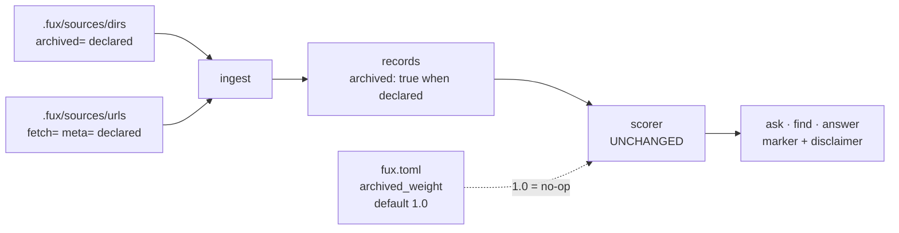

# ADR-DIR-LIST — the committed directory list

- **Name:** `ADR-DIR-LIST` — cite this everywhere; never cite the number
- **Status:** accepted — **the file and the declaration are built** (2026-08-19, W-54); the *signal* is gated, see decision 10. **Extended 2026-08-22 (Arpit): decisions 11 (a configurable demotion, default `1.0`) and 12 (a response-level disclaimer), and decision 6 amended from "may not change an order" to "may not change an order *at the default*"** — the demotion knob is ungated because at its default nothing reorders; **moving that default is a ranking change and stays behind [W-52](../../work/open/W-52-df-over-the-union.md)'s gate**, and the disclaimer sits under decision 10's instrument gate until Arpit lifts it
- **Date:** 2026-08-19
- **Feature:** `.fux/sources/dirs` — what the engine indexes, and which of it is retired
- **Owns:** nothing new in `src/` — it moved a key out of `config.py` and added `read_dirs`/`source_dirs` to `ingest/gitdir.py`, on the one parser in `ingest/sourcelist.py`
- **Laws:** L3, L6 — see [ADR-LAWS](0001_laws.md); never restated here
- **Supersedes:** `ADR-ARCHIVED-SIGNAL` (0022) — **archived 2026-08-19** at [`archive/adr/`](../../archive/adr/README.md); it may be named, never cited. Its decisions are carried below, one of them changed
- **Amends:** [ADR-CONFIG](0014_config.md) decision 2 · [ADR-DOTFUX](0003_fux-directory.md) decision 2

---

## §1 — For humans

Fux has two kinds of source — directories and URLs — and until now they were
kept in two different *shapes*: URLs in a committed line-oriented file, and
directories in a TOML array inside `fux.toml`. **They become the same shape.**

```console
$ cat .fux/sources/dirs
docs
work
README.md
CLAUDE.md
archive/v0.26-docs        archived=true
```

Same reasons as the URL list ([ADR-URL-LIST](0018_url-list.md)): one entry per
line so it merges rather than conflicts, `#` comments so a human can say *why*
a directory is indexed, and the loader sorts so file order can never change
committed bytes.

**The new part is `archived=true`.** A directory declared archived is still
indexed — its documents are the honest answer to *"why does this look the way
it does"* — and the plan is that every record from it carries `archived: true`
and every verb says so:

### Examples — with and without archived

**None of the three is shipped.** They are what decisions 5, 7, 11 and 12
describe, written down so the design can be argued about before it is built.
The query is this record's own worked failure case.

**A · Without the signal — what the engine does today.**

```console
$ fux ask "what is the ingest cache" --top 5
5.9021  Ingest cache and chunker        (archive/v0.26-docs/adr/0002-ingest-cache-chunker.md)
4.8813  Per-file cache invalidation     (archive/v0.26-docs/adr/0006-cache-invalidation.md)
3.9902  Chunker tuning                  (archive/v0.26-docs/adr/0009-chunk-sizing.md)
3.1150  Cache observability             (archive/v0.26-docs/adr/0012-debug-observability.md)
2.7734  Substrate storage               (archive/v0.26-docs/adr/0003-sqlite-substrate.md)
```

Five confident, well-written documents describing the **per-file cache**, a
subsystem CLAUDE.md forbids porting back. Nothing says so. The only signal is a
path prefix.

**B · With the signal, at the shipped default (`archived_weight = 1.0`).**

```console
$ fux ask "what is the ingest cache" --top 5
5.9021  [archived] Ingest cache and chunker     (archive/v0.26-docs/adr/0002-...)
4.8813  [archived] Per-file cache invalidation  (archive/v0.26-docs/adr/0006-...)
3.9902  [archived] Chunker tuning               (archive/v0.26-docs/adr/0009-...)
3.1150  [archived] Cache observability          (archive/v0.26-docs/adr/0012-...)
2.7734  [archived] Substrate storage            (archive/v0.26-docs/adr/0003-...)

note: 5 of 5 results are from archived sources — retired from the live
      corpus. An archived document records what was true when it was
      retired, not what is true now.
```

**Every score and the whole order are byte-identical to A** — compare them
column by column. That is decision 6 holding at the default, and it is the
property this record's veto checks.

**C · With a demotion the user asked for.**

```toml
# fux.toml
[ranking]
archived_weight = 0.5
```

```console
$ fux ask "what is the ingest cache" --top 5
3.4417             How ingest works today        (docs/adr/0007_ingest.md)
2.9511  [archived] Ingest cache and chunker      (archive/v0.26-docs/adr/0002-...)
2.4407  [archived] Per-file cache invalidation   (archive/v0.26-docs/adr/0006-...)
2.1188             Delta ingest and reuse        (docs/adr/0007_ingest.md)
1.9951  [archived] Chunker tuning                (archive/v0.26-docs/adr/0009-...)

note: 3 of 5 results are from archived sources (demoted, weight 0.50) —
      retired from the live corpus. An archived document records what was
      true when it was retired, not what is true now.
```

Live documents surface. **This output is unreachable at the shipped default** —
it exists only because someone set the weight, which is the whole of decision
11's safety argument.

**`--json` carries the flag rather than the prefix**, because a machine reader
should not parse a title:

```console
$ fux ask "what is the ingest cache" --top 1 --json
{"results": [{"id": "...", "title": "Ingest cache and chunker",
              "loc": "archive/v0.26-docs/adr/0002-ingest-cache-chunker.md",
              "score": 5.9021, "archived": true}]}
```

> **`fux find` is why the note is not on stdout.** `find` prints bare paths so
> it can pipe — `fux find "..." | xargs wc -l` is in
> [ADR-FIND](0005_find.md)'s own examples. A prefix or a note on stdout there
> is swallowed by `xargs` as a filename:
>
> ```console
> $ fux find "what is the ingest cache" --top 3
> archive/v0.26-docs/adr/0002-ingest-cache-chunker.md
> archive/v0.26-docs/adr/0006-cache-invalidation.md
> docs/adr/0007_ingest.md
> note: 2 of 3 results are from archived sources.   <-- would be piped
> ```
>
> So the note goes to **stderr**, and `--json` carries `archived` per result.
> Decision 12 already required stdout stability for the `--json` contract and
> the surface captures; this is the second, independent reason, and it is the
> concrete one.

**The ranking does not change at the default. Not by a byte.** The flag exists
to carry a **fact** into the answer — *this document is retired* — not to
improve a result, and **not to tell the reader what to conclude from it**
(decision 12, amended 2026-08-22). A rule
enforced by whether a reader notices a path prefix inside a context window is a
rule with no mechanism; this is the mechanism. **The demotion in C is a separate
mechanism with a separate default**, and conflating the two is how "annotate,
never reorder" turned into a reorder without anyone deciding it.

**No attribute means not archived.** Every list that exists today stays correct.

**What ships today is the declaration, not the marker.** `.fux/sources/dirs` is
read and `archived=` is parsed and validated; the record property and the
`[archived]` prefix above wait for a pre-registered query set, because changing
what a verb says about a document is a claim that needs an instrument. Decision
10 says why the split falls exactly there.

**Diagram — Mermaid and its ASCII twin. Update both, always, together.**



<details>
<summary><b>ASCII twin</b> — the same diagram, for terminals, diffs, and any reader without a Mermaid renderer</summary>

```text
  .fux/sources/dirs   (archived=)  --+
                                     |--> ingest --> records carrying
  .fux/sources/urls   (fetch= meta=)-+              archived: true when declared
                                                          |
                                                          v
   fux.toml [ranking] archived_weight ------->  scorer
   default 1.0  =  no-op, same score, same order      |
   set below 1.0 = the user asked for a demotion      |
                                                      v
                              ask . find . answer
                                |-- stdout : [archived] prefix (ask), bare paths (find)
                                |-- stderr : the disclaimer, when any result is archived
                                +-- --json : "archived": true, per result

  two source kinds, one file shape, one grammar
```

</details>

---

## §2 — For agents

### Context

Two problems met, and one file answers both.

**The shapes had diverged.** `[sources] dirs` was a TOML array while URLs were a
committed file, so the same argument — a 5 000-entry inline array is one diff
hunk and one merge conflict — had been accepted for one source kind and not the
other. There was never a reason; URLs simply got the attention.

**And the archived signal needed somewhere to live.** The superseded record
derived it from the path: *is `loc` under the repo's one `archive/` directory*.
That is exact **for this repo**, because the one-archive law is enforced by
`tests/test_archive_law.py` — and it is only a *convention* for anyone else,
whose retired documents might sit in `old/` or `deprecated/` or nowhere in
particular. A derived signal that works for its author and degrades silently for
everyone else is the wrong shape for a corporate design point. **Declaring it
fixes that**, and the file this record creates is where a declaration goes.

The measurement that opened it, from the committed index on 2026-08-19: **34 of
128 records (26.6%)** are archived; **974 distinct terms (11.4%)** exist only in
archived documents; **3 174 of 7 533 live terms (42.1%)** carry a `df` inflated
by them.

### Decision

**1. Source directories live in `.fux/sources/dirs`**, one entry per line, a
committed file beside `urls`. `[sources] dirs` in `fux.toml` becomes a **retired
key that errors with instructions** — the pattern [ADR-CONFIG](0014_config.md)
decision 7 establishes and [ADR-FETCHER](0019_fetcher.md) decision 7 has already
used once.

**2. The grammar is [ADR-URL-LIST](0018_url-list.md)'s**, by reference and not
restated: one entry per line, `#` comments, blank lines ignored, loader dedupes
and sorts, `<entry> key=value …` attributes, **an unknown key is a loud
`file:lineno` error**, and a duplicate entry with conflicting attributes is an
error rather than a last-wins merge. One grammar, two files.

**2a. A `!` prefix subtracts a path from the walk** (added 2026-08-20, W-45
verdict **E**, decided by Arpit). `!work/regression/*/evidence` is a
repo-relative glob that removes matching paths — and **anything beneath
them** — from every included root.

> **It is an entry, not an attribute, and that was the fork.** This record
> originally anticipated an exclusion *attribute* on a directory line. The
> attribute grammar describes properties of the thing on the line — `fetch=`,
> `meta=`, `archived=` each say something about *that* URL or *that* directory
> — whereas an exclusion is a statement about a **different** path that happens
> to sit underneath. Encoding one path inside another's attribute value is the
> mismatch, and the symptom is that attribute values carry no whitespace and no
> quoting ([ADR-URL-LIST](0018_url-list.md) decision 8) while a repeated key is
> an error (decision 10) — so two exclusions would have needed a comma
> sub-grammar the format has never had. Argued in
> [`work/compare/source-exclusion.compare.md`](../../work/compare/source-exclusion.compare.md).

**2b. Exclusions are order-independent, and there is no un-exclude.** The
loader sorts, so file order cannot change a committed byte — L3 applied to
config. `!` subtracts and nothing adds back, which means there is **no
precedence order to remember and none to get wrong**; `!!` is an error rather
than a negation. An exclusion also carries **no attributes**: `archived=true`
describes a directory whose documents are history, and means nothing about a
path being removed.

**2c. `*` does not cross a `/`.** `fnmatch` is not used, because its `*` would
make `work/regression/*/evidence` also match `work/regression/a/b/evidence` —
not what anyone writing that line means. `**` is the explicit any-depth form,
and the matcher is hand-rolled like every other codec here (L1).

**2d. Removal reuses `!`, and which branch it took is stated** (2026-08-21,
W-63). `fux remove <path>` has two cases and they are not interchangeable:

| the path | how it leaves | why |
|---|---|---|
| has its own line | the line is deleted | it is there because someone listed it |
| is covered by a listed ancestor | `!<path>` is written | it is there because an ancestor is listed, and the ancestor should stay |

**The grammar already had subtraction, so nothing was invented.** The
alternative — deleting the ancestor's line and re-adding its siblings — is a
many-line diff for a one-document change, and it silently changes what happens
when a new sibling appears later: the re-added list would not include it, so
removing one document would quietly stop indexing every future one.

A path that is neither listed nor covered is an **error naming both checks**,
not a no-op. "Nothing to remove" and "you typed the wrong path" look identical
otherwise, and only one of them is fine.

**2e. `docs` and `docs/` are one entry.** The parser dedupes on the exact
string and therefore cannot see that duplicate, so the verbs normalise a
trailing slash away before writing. Found by running `fux add docs/` against a
list already holding `docs`: it wrote a second line for the same directory,
which makes this file say two things where the corpus has one. URLs are
exempt — a trailing slash there is the server's business, not ours.

**3. The attribute set for this file is one: `archived`.** Values `true` /
`false`; **absent means `false`**. Closed, exactly as the URL list's set is
closed — adding to it is a change to this record.

**3a. An explicitly added file does not outrank the type allowlist**
(2026-08-21, W-63). `fux add docs/architecture.pdf` writes the line, and the
document is still skipped if `.fux/sources/types` does not admit it — the verb
says so, and says which command would change it.

This follows from the three conditions being a **conjunction with no
precedence** (§1), and is not a new rule; what is new is a command that could
plausibly have been read as an override. Making an `add` win would be W-55's
invisible filter arriving from the opposite direction — a document indexed for
a reason nobody could see in either list.

**4. `archived` is declared, never derived.** No path heuristic, no `archive/`
special case in code. **This is the one decision that changed on the way in from
the superseded record**, and it is why that record was replaced rather than
amended: the derived form was correct here and silently wrong everywhere else.

**5. A record from an archived source carries `archived: true`**, written at
ingest and stored per record — the way `mode` and `meta` already are, and for
[ADR-RECORD](0010_index-record.md)'s reason: a record read years later states
the rule it was written under rather than having it inferred by whoever reads
it. Absent when false, so no existing record changes shape.

**6. The ranking is byte-identical *at the default*. This record may not change
an order unless someone asks it to.** Scores, sort, and the differential law
between scan and accelerator are untouched. An implementation that reorders
anything at the default has not implemented this record.

> **Amended 2026-08-22 (Arpit).** This read *"may not change an order"*, full
> stop, until Arpit ruled that archived documents should be demotable and that
> **the demotion is configurable** (decision 11). The words *at the default* are
> the whole amendment, and they are load-bearing: at the shipped default the
> weight is `1.0`, nothing reorders, and this decision's veto still fires on any
> drift. What is now permitted is a **user** asking for a demotion — not this
> record taking one.

**7. Every verb surfaces it, and they agree.** `--json` carries `"archived":
true`; text output prefixes the title with `[archived]`. `find` and `ask` show
the same marker, because [ADR-FIND](0005_find.md) makes `find` a projection of
`ask` rather than a second strategy.

**8. `df` stays out of scope, deliberately.** Computing it over non-archived
documents only is a ranking change across 42% of live terms and belongs to
[W-52](../../work/open/W-52-df-over-the-union.md), behind a pre-registration.
**This record is honest about being partial**: it fixes what a reader is told,
not what the scorer computes.

**9. The two source files differ in who writes them, and that is deliberate.**
The URL list is **tool-written**: `fux add` records the URL and every attribute
explicitly ([ADR-URL-LIST](0018_url-list.md) decision 12). This file is
**human-written** — you add a directory because you decided to — so absence
carries meaning here (decision 3) in a way it does not there. Same grammar,
different authorship, and the reader is lenient for both.

**10. The file ships now; the *signal* waits for its instrument.** Amended
2026-08-19 (Arpit), because the two halves
of this record turned out to have different risk:

| half | decisions | state |
|---|---|---|
| the file, the grammar, the **declaration** | 1, 2, 3, 4, 9 | **built** — `.fux/sources/dirs` is read, `archived=` is parsed and validated |
| the **signal** — a record property, and a marker in every verb | 5, 7 | **gated**, on a pre-registered query set with expected live-vs-archived answers, frozen before the mechanism ships ([W-44](../../work/open/W-44-archived-content-signalling.md)) |
| the **disclaimer** — a response-level note when any archived document is returned | 12 | **gated, by the same sentence** — it changes what a verb says, and it says *more* than the marker does. Ruled 2026-08-22; whether it may ship ahead of the instrument is **Arpit's to lift**, and is not assumed here |
| the **demotion weight** — a configurable multiplier | 11 | **ungated at the default**, because `1.0` reorders nothing and this record's veto still guards it. **Moving the default is a ranking change** and stays behind [W-52](../../work/open/W-52-df-over-the-union.md)'s pre-registration *plus a second corpus* |

The split is safe in exactly one direction. Parsing a declaration nothing reads
changes no committed byte and no score, so it cannot be wrong; **changing what a
verb says about a document is a claim that needs an instrument**, and five
hand-picked probes is not a measurement — the playground goldens are a different
corpus and cannot see this. Building the declaration first also means W-44
arrives to a corpus that has already declared itself, rather than having to
invent the declaration and the measurement at once.

**11. Archived documents are demotable, and the demotion is configurable.**
Ruled by Arpit, 2026-08-22, reversing the "never reorder" half of decision 6.

- **The default is `1.0` — no demotion.** That is what keeps this shippable: at
  the default no score and no order changes, so nothing here is a ranking change
  and CLAUDE.md's *never ship a ranking change off a single corpus* rule is not
  engaged. **What ships is the capability, not the change.**
- **Moving that default IS a ranking change** and is gated — on the
  pre-registered query set *and* a second corpus, per
  [W-52](../../work/open/W-52-df-over-the-union.md)'s trigger. No session may
  move it because a number looked good on this repo.
- **It keys off the declaration, never a path.** Decision 4 stands:
  `loc.startswith("archive/")` is not a test, here or anywhere.
- **Where it lives: `fux.toml`, not `.fux/sources/dirs`.** Arpit left the
  location to this record; both options and their costs are stated so the
  reasoning survives. **A weight is a ranking parameter, not a source
  attribute** — it says what the *scorer* does, where every other attribute on a
  dirs line says what a *source is*. Decision 3 also caps that file's attribute
  set at exactly one, and a per-source weight would both break that cap and
  create a per-source ranking knob nobody asked for. The cost of choosing
  `fux.toml` is that a reader now looks in two files to understand how an
  archived source is treated, and decision 12's disclaimer is part of why that
  is acceptable: the behaviour announces itself at the point of use.
- **This is not `df`.** A score multiplier on a finished score is a different
  mechanism from computing `df` over a different population — decision 8 stands
  and [W-52](../../work/open/W-52-df-over-the-union.md) is untouched by this.

**12. When any archived document is returned, the response carries a
disclaimer.** Ruled by Arpit, 2026-08-22.

- **Response-level, not per-result**, and that is the point. Decision 7's
  `[archived]` prefix marks each row; this states *what archived means* once,
  where it cannot be skimmed past. It is the direct answer to this record's own
  complaint that **"a rule enforced by whether a reader notices a path prefix
  inside a context window is a rule with no mechanism"** — a prefix is such a
  prefix.
- **Conditional.** It appears only when at least one returned document is
  archived. A disclaimer on every answer is a disclaimer nobody reads.
- **It states what archived *is*, not what the reader should *do* about it.**
  Amended 2026-08-22, and this is the substantive part of decision 12.

  > `note: 3 of 5 results are from archived sources — retired from the live`
  > `corpus. An archived document records what was true when it was retired,`
  > `not what is true now.`

  The wording it replaced — *archived content may be named, but the build is
  based on the records* — **silently assumed the reader was building.** Fux is
  queried from at least three stances and the same archived document is a
  different thing under each:

  | the question | archived content is | so the reader wants |
  |---|---|---|
  | *why did we choose X* — history, business | **the answer** | to read it as authoritative for its period |
  | *how does X work now* — architecture | **misleading** | the live document, with this as contrast |
  | *implement X* — an agent building | **dangerous** | never to port from it |

  A single sentence cannot instruct all three, and **the list is not closed** —
  there are stances nobody has enumerated. So the disclaimer states the fact and
  stops. **What to do about the fact is the consumer's policy, not the engine's**
  — see [`consumer-intent-policy.md`](../../archive/proposals/consumer-intent-policy.md).
- **Fux does not take an `--intent` flag, and that is a decision.** Carrying a
  taxonomy of reader intents means shipping an enum that is provably incomplete
  on the day it ships, and putting policy inside an engine whose whole argument
  is that it ships **facts** and lets the caller decide. The
  [refer plane](0030_refer-plane.md) already set this precedent: it returns
  `current`/`stale`/`unverified` and **refuses to collapse "we did not look"
  into "we looked and it was fine"** — the caller supplies the policy. Archived
  is the same shape of claim and gets the same treatment.
- **It does not replace decision 7.** Both ship: the marker says *which*, the
  disclaimer says *what that means*.
- **stdout stability applies.** `--json` is a contract and the surface captures
  compare bytes; whether the disclaimer is a new `--json` key or stderr-only is
  an [ADR-CLI](0002_cli-surface.md) decision, taken there, not settled in code.

### Consequences

- **A single file was always a legal entry; the CLI is new, the grammar is
  not.** `_candidate_paths` has branched on `base.is_file()` since this record
  was written, so `fux add docs/onboarding.md` needed no list, no attribute
  and no parser change — which is most of why W-63 was small.
- **`fux add --types` seeds the built-in allowlist when it creates the file**
  ([ADR-TYPES](0031_types-list.md)'s "absent means the default"), because the
  file replaces that default rather than extending it. Without the seed,
  adding one pattern un-indexed every document already in the corpus —
  measured, in [the capture](../../work/regression/2026-08-21-source-verbs/ANALYSIS.md).
- **The include-only whitelist ended on 2026-08-20** (W-45). It was measured
  first: **33 of 150 documents (22.0 %) came from `work/regression/`, 16 of
  them raw evidence**, and a committed `fixture.sh` outranked the very record
  it was written to illustrate. The prior remedy — dot-prefixing `.evidence/`
  so the walker's dotfile skip caught it — was **measurably decaying**: 2 of 7
  filed runs used it and 5 did not, including every run filed after the item
  was opened. An invisible convention is followed until it is not.
- **`fux ingest --list-skipped` now reports exclusions by the pattern that
  removed them** (`excluded by !work/regression/*/evidence`). A filter nobody
  can see is the failure this item was opened about, so silence was not an
  option.
- **This file is now one of three, not one of two.**
  [ADR-TYPES](0031_types-list.md) adds `.fux/sources/types`: `dirs` says
  *where*, `types` says *what*, `urls` says *what else*. The three conditions
  are a **conjunction** — no rule overrides another — so there is no precedence
  between the files either.

- **`fux.toml` stops being where the corpus is defined.** It keeps policy —
  `[index] shards`, `[sources.url]` — and the *what* moves to two files under
  `.fux/sources/`. That is a clearer split than it sounds: config is how the
  engine behaves, the source lists are what it looks at.
- **This is a breaking change**, and a second one in the same area after the
  `middleware` → `fetcher` rename. Both are stopped runs with instructions, and
  both are cheapest now — `v0.32.0`, no external consumers.
- **[W-45](../../archive/open/W-45-source-exclusion.md) now has an obvious home.**
  It wants to exclude machine-generated subtrees from an indexed directory, and
  an attribute on a directory line is the natural shape. **Not decided here** —
  the set is closed at one, and W-45 is a fork with real options that deserves
  its compare doc. But it is no longer waiting on a schema.
- **The archived declaration is only as honest as the person writing it.** A
  derived signal cannot be forgotten; a declared one can. What it buys is
  working correctly for a consumer whose layout does not match this repo's — the
  trade the design point makes everywhere else too.
- **`fux doctor` gains an obvious check**: an entry in the file that does not
  exist on disk. Not specified here; named so it is not invented twice.

### Alternatives considered

- **Derive `archived` from `loc.startswith("archive/")`** — the superseded
  record's decision 3. Zero configuration and exact *here*, because
  [`tests/test_archive_law.py`](../../tests/test_archive_law.py) enforces one
  archive at the root. Rejected: that law is this repo's, and for a consumer
  `archive/` is a name someone may or may not have used. Correct-for-the-author,
  silently-wrong-for-everyone-else is the failure mode this project keeps
  writing tests against.
- **Keep `dirs` in `fux.toml` and add a parallel `archived_dirs` key.**
  Rejected: two keys that must agree, and the merge problem stays.
- **A TOML array of tables** (`[[sources.dir]] path = … archived = true`).
  Rejected for the reason decision 1 exists: it is still one diff hunk, and it
  puts a corpus decision three levels into a config file.
- **Down-rank archived documents.** Rejected under decision 6, and it is the
  ruling the v0.26 line already reached for this failure mode — *annotate, never
  reorder*. A rank change needs the measurement W-52 is gated on.
- **Filter archived results out by default.** Rejected: it makes the historical
  question unanswerable, which is the reason the set is indexed at all, and
  trades a visible wrong answer for an invisible missing one.
- **Two attributes, `archived` and `retired`, for different flavours of
  not-current.** Rejected: one word, one meaning. L6 discipline.

### Reference (required)

- The grammar this record reuses — [ADR-URL-LIST](0018_url-list.md) decisions
  2–13.
- The key it retires — [ADR-CONFIG](0014_config.md) decision 2, and the
  retired-key pattern at decision 7.
- The layout it extends — [ADR-DOTFUX](0003_fux-directory.md) decision 2,
  `sources/` as a committed child.
- The finding that opened it —
  [`work/regression/2026-08-12-r2-close/report.md`](../../work/regression/2026-08-12-r2-close/report.md)
  §Finding 2 and its [`ANALYSIS.md`](../../work/regression/2026-08-12-r2-close/ANALYSIS.md) §2.
- The record schema the property joins — [ADR-RECORD](0010_index-record.md).
- The ranking half, not decided here —
  [W-52](../../work/open/W-52-df-over-the-union.md).
- Prior art for per-entry attributes on a line-oriented committed file —
  `gitattributes(5)`: https://git-scm.com/docs/gitattributes

### Veto condition

**Reopen this decision if** an archived document is ever returned without the
marker, if a score or an order differs **at the default weight** between an
index built with the property and one without it, or if the `archived`
attribute is ever set anywhere other than a line in this file.

**Added 2026-08-22, with decisions 11 and 12:**

- **The demotion default ships as anything other than `1.0`** — or is moved
  without the pre-registered query set *and* a second corpus. That default is
  the entire reason decision 11 is not a ranking change, and moving it quietly
  is how it becomes one.
- **An archived document is returned with no disclaimer on the response** once
  decision 12 ships — the per-result marker does not satisfy it, which is the
  distinction decision 12 exists to draw.
- **The weight is read from anywhere but `fux.toml`**, or a per-source weight
  appears on a `dirs` line — decision 3 caps that file's attributes at one.

**How to check it:**

```bash
# 1. no archived document is returned unmarked
fux find "ingest cache" --json | python3 -c "import json,sys; rs=json.load(sys.stdin)['results']; \
print([r['loc'] for r in rs if r.get('archived') is None and 'archive' in r['loc']])"
# expect: []  (and note the test is the DECLARATION, not the path — the path is a hint)

# 2. declared, never derived: no archive path special-case in the engine
grep -rn "archive/" src/fux/ --include=*.py
# expect: no output

# 3. the file is built; the SIGNAL is not. `archived` must be parsed and unread.
grep -rn "archived" src/fux/ --include=*.py | grep -v sourcelist.py | grep -v "not yet read"
# expect: no output — decisions 5 and 7 are W-44's, not this change's
```
