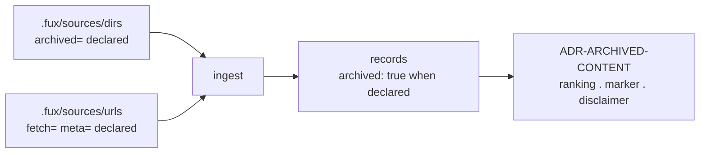

# ADR-DIR-LIST — the committed directory list

- **Name:** `ADR-DIR-LIST` — cite this everywhere; never cite the number
- **Status:** accepted — **the file and the declaration are built** (2026-08-19,
  W-54).
- **Date:** 2026-08-19
- **Feature:** `.fux/sources/dirs` — what the engine indexes, which of it is
  retired, and the grammar for declaring so. **Not** what an `archived=true`
  declaration triggers once it exists — that is
  [ADR-ARCHIVED-CONTENT](0037_archived-content.md).
- **Owns:** nothing new in `src/` — it moved a key out of `config.py` and added
  `read_dirs`/`source_dirs` to `ingest/gitdir.py`, on the one parser in
  `ingest/sourcelist.py`
- **Laws:** L3, L6 — see [ADR-LAWS](0001_laws.md); never restated here
- **Supersedes:** `ADR-ARCHIVED-SIGNAL` (0022) — **archived 2026-08-19** at
  [`archive/adr/`](../../archive/adr/README.md); it may be named, never cited.
  Decision 4 below — `archived` declared, never derived from a path — is the
  one decision that changed on the way in from that record, and is the reason
  it was replaced rather than amended.
- **Amends:** [ADR-CONFIG](0014_config.md) decision 2 · [ADR-DOTFUX](0003_fux-directory.md) decision 2
- **Carved 2026-08-22 (Arpit):** this record used to also decide what an
  `archived=true` declaration *does* once it exists — the record property,
  ranking, the marker, the disclaimer. That behaviour is now
  [ADR-ARCHIVED-CONTENT](0037_archived-content.md), same substance,
  renumbered. What stayed here (decisions 1-4, 9, renumbered 1-5) is the file
  and its grammar. **Existing citations to this record's former decisions
  5-8 and 10-12 have been repointed** to ADR-ARCHIVED-CONTENT's decisions
  1-7, except inside frozen regression reports and `WORKLOG.md`'s past
  entries, which this repo's own rules never edit — see
  [ADR-ARCHIVED-CONTENT](0037_archived-content.md)'s Consequences for exactly
  which citations that leaves stale, by design.

---

## §1 — For humans

Fux has two kinds of source — directories and URLs — and until now they were
kept in two different *shapes*: URLs in a committed line-oriented file, and
directories in a TOML array inside `fux.toml`. **They become the same shape.**

```console
$ cat .fux/sources/dirs
docs
work
README.md
CLAUDE.md
archive/v0.26-docs        archived=true
```

Same reasons as the URL list ([ADR-URL-LIST](0018_url-list.md)): one entry per
line so it merges rather than conflicts, `#` comments so a human can say *why*
a directory is indexed, and the loader sorts so file order can never change
committed bytes.

**The new part is `archived=true`.** A directory declared archived is still
indexed — its documents are the honest answer to *"why does this look the way
it does"* — and every record from it carries `archived: true`. **What that
property then does** — ranking, a verb marker, a disclaimer — is
[ADR-ARCHIVED-CONTENT](0037_archived-content.md), not this record.

**Diagram — Mermaid and its ASCII twin. Update both, always, together.**



<details>
<summary><b>ASCII twin</b> — the same diagram, for terminals, diffs, and any reader without a Mermaid renderer</summary>

```text
  .fux/sources/dirs   (archived=)  --+
                                     |--> ingest --> records carrying
  .fux/sources/urls   (fetch= meta=)-+              archived: true when declared
                                                          |
                                                          v
                                        ADR-ARCHIVED-CONTENT
                                        (ranking, marker, disclaimer)

  two source kinds, one file shape, one grammar
```

</details>

---

## §2 — For agents

### Context

Two problems met, and one file answers both.

**The shapes had diverged.** `[sources] dirs` was a TOML array while URLs were a
committed file, so the same argument — a 5 000-entry inline array is one diff
hunk and one merge conflict — had been accepted for one source kind and not the
other. There was never a reason; URLs simply got the attention.

**And the archived signal needed somewhere to live.** The superseded record
derived it from the path: *is `loc` under the repo's one `archive/` directory*.
That is exact **for this repo**, because the one-archive law is enforced by
`tests/test_archive_law.py` — and it is only a *convention* for anyone else,
whose retired documents might sit in `old/` or `deprecated/` or nowhere in
particular. A derived signal that works for its author and degrades silently for
everyone else is the wrong shape for a corporate design point. **Declaring it
fixes that**, and the file this record creates is where a declaration goes.

The measurement that opened it, from the committed index on 2026-08-19: **34 of
128 records (26.6%)** are archived; **974 distinct terms (11.4%)** exist only in
archived documents; **3 174 of 7 533 live terms (42.1%)** carry a `df` inflated
by them. (What those numbers imply for ranking is
[ADR-ARCHIVED-CONTENT](0037_archived-content.md)'s decision 4 and
[W-52](../../archive/open/W-52-df-over-the-union.md) — not decided here.)

### Decision

**1. Source directories live in `.fux/sources/dirs`**, one entry per line, a
committed file beside `urls`. `[sources] dirs` in `fux.toml` becomes a **retired
key that errors with instructions** — the pattern [ADR-CONFIG](0014_config.md)
decision 7 establishes and [ADR-FETCHER](0019_fetcher.md) decision 7 has already
used once.

**2. The grammar is [ADR-URL-LIST](0018_url-list.md)'s**, by reference and not
restated: one entry per line, `#` comments, blank lines ignored, loader dedupes
and sorts, `<entry> key=value …` attributes, **an unknown key is a loud
`file:lineno` error**, and a duplicate entry with conflicting attributes is an
error rather than a last-wins merge. One grammar, two files.

**2a. A `!` prefix subtracts a path from the walk** (added 2026-08-20, W-45
verdict **E**, decided by Arpit). `!work/regression/*/evidence` is a
repo-relative glob that removes matching paths — and **anything beneath
them** — from every included root.

> **It is an entry, not an attribute, and that was the fork.** This record
> originally anticipated an exclusion *attribute* on a directory line. The
> attribute grammar describes properties of the thing on the line — `fetch=`,
> `meta=`, `archived=` each say something about *that* URL or *that* directory
> — whereas an exclusion is a statement about a **different** path that happens
> to sit underneath. Encoding one path inside another's attribute value is the
> mismatch, and the symptom is that attribute values carry no whitespace and no
> quoting ([ADR-URL-LIST](0018_url-list.md) decision 8) while a repeated key is
> an error (decision 10) — so two exclusions would have needed a comma
> sub-grammar the format has never had. Argued in
> [`work/compare/source-exclusion.compare.md`](../../work/compare/source-exclusion.compare.md).

**2b. Exclusions are order-independent, and there is no un-exclude.** The
loader sorts, so file order cannot change a committed byte — L3 applied to
config. `!` subtracts and nothing adds back, which means there is **no
precedence order to remember and none to get wrong**; `!!` is an error rather
than a negation. An exclusion also carries **no attributes**: `archived=true`
describes a directory whose documents are history, and means nothing about a
path being removed.

**2c. `*` does not cross a `/`.** `fnmatch` is not used, because its `*` would
make `work/regression/*/evidence` also match `work/regression/a/b/evidence` —
not what anyone writing that line means. `**` is the explicit any-depth form,
and the matcher is hand-rolled like every other codec here (L1).

**2d. Removal reuses `!`, and which branch it took is stated** (2026-08-21,
W-63). `fux remove <path>` has two cases and they are not interchangeable:

| the path | how it leaves | why |
|---|---|---|
| has its own line | the line is deleted | it is there because someone listed it |
| is covered by a listed ancestor | `!<path>` is written | it is there because an ancestor is listed, and the ancestor should stay |

**The grammar already had subtraction, so nothing was invented.** The
alternative — deleting the ancestor's line and re-adding its siblings — is a
many-line diff for a one-document change, and it silently changes what happens
when a new sibling appears later: the re-added list would not include it, so
removing one document would quietly stop indexing every future one.

A path that is neither listed nor covered is an **error naming both checks**,
not a no-op. "Nothing to remove" and "you typed the wrong path" look identical
otherwise, and only one of them is fine.

**2e. `docs` and `docs/` are one entry.** The parser dedupes on the exact
string and therefore cannot see that duplicate, so the verbs normalise a
trailing slash away before writing. Found by running `fux add docs/` against a
list already holding `docs`: it wrote a second line for the same directory,
which makes this file say two things where the corpus has one. URLs are
exempt — a trailing slash there is the server's business, not ours.

**3. The attribute set for this file is one: `archived`.** Values `true` /
`false`; **absent means `false`**. Closed, exactly as the URL list's set is
closed — adding to it is a change to this record.

**3a. An explicitly added file does not outrank the type allowlist**
(2026-08-21, W-63). `fux add docs/architecture.pdf` writes the line, and the
document is still skipped if `.fux/sources/types` does not admit it — the verb
says so, and says which command would change it.

This follows from the three conditions being a **conjunction with no
precedence** (§1), and is not a new rule; what is new is a command that could
plausibly have been read as an override. Making an `add` win would be W-55's
invisible filter arriving from the opposite direction — a document indexed for
a reason nobody could see in either list.

**4. `archived` is declared, never derived.** No path heuristic, no `archive/`
special case in code. **This is the one decision that changed on the way in from
the superseded record**, and it is why that record was replaced rather than
amended: the derived form was correct here and silently wrong everywhere else.

**5. The two source files differ in who writes them, and that is deliberate.**
The URL list is **tool-written**: `fux add` records the URL and every attribute
explicitly ([ADR-URL-LIST](0018_url-list.md) decision 12). This file is
**human-written** — you add a directory because you decided to — so absence
carries meaning here (decision 3) in a way it does not there. Same grammar,
different authorship, and the reader is lenient for both.

### Consequences

- **A single file was always a legal entry; the CLI is new, the grammar is
  not.** `_candidate_paths` has branched on `base.is_file()` since this record
  was written, so `fux add docs/onboarding.md` needed no list, no attribute
  and no parser change — which is most of why W-63 was small.
- **`fux add --types` seeds the built-in allowlist when it creates the file**
  ([ADR-TYPES](0031_types-list.md)'s "absent means the default"), because the
  file replaces that default rather than extending it. Without the seed,
  adding one pattern un-indexed every document already in the corpus —
  measured, in [the capture](../../work/regression/2026-08-21-source-verbs/ANALYSIS.md).
- **The include-only whitelist ended on 2026-08-20** (W-45). It was measured
  first: **33 of 150 documents (22.0 %) came from `work/regression/`, 16 of
  them raw evidence**, and a committed `fixture.sh` outranked the very record
  it was written to illustrate. The prior remedy — dot-prefixing `.evidence/`
  so the walker's dotfile skip caught it — was **measurably decaying**: 2 of 7
  filed runs used it and 5 did not, including every run filed after the item
  was opened. An invisible convention is followed until it is not.
- **`fux ingest --list-skipped` now reports exclusions by the pattern that
  removed them** (`excluded by !work/regression/*/evidence`). A filter nobody
  can see is the failure this item was opened about, so silence was not an
  option.
- **This file is now one of three, not one of two.**
  [ADR-TYPES](0031_types-list.md) adds `.fux/sources/types`: `dirs` says
  *where*, `types` says *what*, `urls` says *what else*. The three conditions
  are a **conjunction** — no rule overrides another — so there is no precedence
  between the files either.
- **`fux.toml` stops being where the corpus is defined.** It keeps policy —
  `[index] shards`, `[sources.url]` — and the *what* moves to two files under
  `.fux/sources/`. That is a clearer split than it sounds: config is how the
  engine behaves, the source lists are what it looks at.
- **This is a breaking change**, and a second one in the same area after the
  `middleware` → `fetcher` rename. Both are stopped runs with instructions, and
  both are cheapest now — `v0.32.0`, no external consumers.
- **[W-45](../../archive/open/W-45-source-exclusion.md) now has an obvious home.**
  It wants to exclude machine-generated subtrees from an indexed directory, and
  an attribute on a directory line is the natural shape. **Not decided here** —
  the set is closed at one, and W-45 is a fork with real options that deserves
  its compare doc. But it is no longer waiting on a schema.
- **The archived declaration is only as honest as the person writing it.** A
  derived signal cannot be forgotten; a declared one can. What it buys is
  working correctly for a consumer whose layout does not match this repo's — the
  trade the design point makes everywhere else too.
- **`fux doctor` gains an obvious check**: an entry in the file that does not
  exist on disk. Not specified here; named so it is not invented twice.

### Alternatives considered

- **Derive `archived` from `loc.startswith("archive/")`** — the superseded
  record's decision 3. Zero configuration and exact *here*, because
  [`tests/test_archive_law.py`](../../tests/test_archive_law.py) enforces one
  archive at the root. Rejected: that law is this repo's, and for a consumer
  `archive/` is a name someone may or may not have used. Correct-for-the-author,
  silently-wrong-for-everyone-else is the failure mode this project keeps
  writing tests against.
- **Keep `dirs` in `fux.toml` and add a parallel `archived_dirs` key.**
  Rejected: two keys that must agree, and the merge problem stays.
- **A TOML array of tables** (`[[sources.dir]] path = … archived = true`).
  Rejected for the reason decision 1 exists: it is still one diff hunk, and it
  puts a corpus decision three levels into a config file.

### Reference (required)

- The grammar this record reuses — [ADR-URL-LIST](0018_url-list.md) decisions
  2–13.
- The key it retires — [ADR-CONFIG](0014_config.md) decision 2, and the
  retired-key pattern at decision 7.
- The layout it extends — [ADR-DOTFUX](0003_fux-directory.md) decision 2,
  `sources/` as a committed child.
- The finding that opened it —
  [`work/regression/2026-08-12-r2-close/report.md`](../../work/regression/2026-08-12-r2-close/report.md)
  §Finding 2 and its [`ANALYSIS.md`](../../work/regression/2026-08-12-r2-close/ANALYSIS.md) §2.
- The record schema the property joins — [ADR-RECORD](0010_index-record.md).
- **What the declaration triggers, not decided here** —
  [ADR-ARCHIVED-CONTENT](0037_archived-content.md).
- Prior art for per-entry attributes on a line-oriented committed file —
  `gitattributes(5)`: https://git-scm.com/docs/gitattributes

### Veto condition

**Reopen this decision if** the `archived` attribute is ever set anywhere
other than a line in `.fux/sources/dirs`, or if a directory's presence in
this file stops being sufficient on its own to determine whether it is
indexed (a second file, a second flag, a precedence rule between this file
and something else).

**How to check it:**

```bash
# declared, never derived: no archive path special-case in the engine
grep -rn "archive/" src/fux/ --include=*.py
# expect: no output
```
---

## References

*Every source this record cites, gathered in one place. §2's **Reference
(required)** names the grounding; this is the complete list. An archived
document is never listed here — the body may name one, but archive is not
evidence.*

**Records** — [ADR-LAWS](0001_laws.md) · [ADR-DOTFUX](0003_fux-directory.md) ·
[ADR-RECORD](0010_index-record.md) · [ADR-CONFIG](0014_config.md) ·
[ADR-URL-LIST](0018_url-list.md) · [ADR-FETCHER](0019_fetcher.md) ·
[ADR-TYPES](0031_types-list.md) ·
[ADR-ARCHIVED-CONTENT](0037_archived-content.md)

**Code**

- [`tests/test_archive_law.py`](../../tests/test_archive_law.py)

**Measured evidence**

- [`work/regression/2026-08-12-r2-close/ANALYSIS.md`](../../work/regression/2026-08-12-r2-close/ANALYSIS.md)
- [`work/regression/2026-08-12-r2-close/report.md`](../../work/regression/2026-08-12-r2-close/report.md)
- [`work/regression/2026-08-21-source-verbs/ANALYSIS.md`](../../work/regression/2026-08-21-source-verbs/ANALYSIS.md)

**Project docs**

- [`work/compare/source-exclusion.compare.md`](../../work/compare/source-exclusion.compare.md)

**Papers and specifications**

- `gitattributes(5)` — prior art for per-entry attributes on a line-oriented
  committed file
  <https://git-scm.com/docs/gitattributes>
