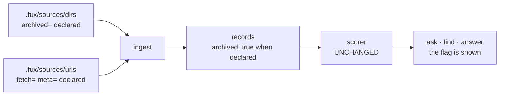

# ADR-DIR-LIST — the committed directory list

- **Name:** `ADR-DIR-LIST` — cite this everywhere; never cite the number
- **Status:** accepted — **the file and the declaration are built** (2026-08-19, W-54); the *signal* is gated, see decision 10
- **Date:** 2026-08-19
- **Feature:** `.fux/sources/dirs` — what the engine indexes, and which of it is retired
- **Owns:** nothing new in `src/` — it moved a key out of `config.py` and added `read_dirs`/`source_dirs` to `ingest/gitdir.py`, on the one parser in `ingest/sourcelist.py`
- **Laws:** L3, L6 — see [ADR-LAWS](0001_laws.md); never restated here
- **Supersedes:** `ADR-ARCHIVED-SIGNAL` (0022) — **archived 2026-08-19** at [`archive/adr/`](../../archive/adr/README.md); it may be named, never cited. Its decisions are carried below, one of them changed
- **Amends:** [ADR-CONFIG](0014_config.md) decision 2 · [ADR-DOTFUX](0003_fux-directory.md) decision 2

---

## §1 — For humans

Fux has two kinds of source — directories and URLs — and until now they were
kept in two different *shapes*: URLs in a committed line-oriented file, and
directories in a TOML array inside `fux.toml`. **They become the same shape.**

```console
$ cat .fux/sources/dirs
docs
work
README.md
CLAUDE.md
archive/v0.26-docs        archived=true
```

Same reasons as the URL list ([ADR-URL-LIST](0018_url-list.md)): one entry per
line so it merges rather than conflicts, `#` comments so a human can say *why*
a directory is indexed, and the loader sorts so file order can never change
committed bytes.

**The new part is `archived=true`.** A directory declared archived is still
indexed — its documents are the honest answer to *"why does this look the way
it does"* — and the plan is that every record from it carries `archived: true`
and every verb says so:

```console
$ fux ask "what is the ingest cache"
5.9021  [archived] Ingest cache and chunker  (archive/v0.26-docs/adr/0002-ingest-cache-chunker.md)
```

**The ranking does not change. Not by a byte.** The flag exists to carry a rule
into the answer — *archived content may be named, but the build is based on the
records* (Arpit, 2026-08-19) — not to improve a result. A rule enforced by
whether a reader notices a path prefix inside a context window is a rule with no
mechanism; this is the mechanism.

**No attribute means not archived.** Every list that exists today stays correct.

**What ships today is the declaration, not the marker.** `.fux/sources/dirs` is
read and `archived=` is parsed and validated; the record property and the
`[archived]` prefix above wait for a pre-registered query set, because changing
what a verb says about a document is a claim that needs an instrument. Decision
10 says why the split falls exactly there.

**Diagram — Mermaid and its ASCII twin. Update both, always, together.**



<details>
<summary><b>ASCII twin</b> — the same diagram, for terminals, diffs, and any reader without a Mermaid renderer</summary>

```text
  .fux/sources/dirs   (archived=)  --+
                                     |--> ingest --> records carrying
  .fux/sources/urls   (fetch= meta=)-+              archived: true when declared
                                                          |
                                                          v
                                            scorer: UNCHANGED (same score, same order)
                                                          |
                                                          v
                                             ask . find . answer  -->  flag shown

  two source kinds, one file shape, one grammar
```

</details>

---

## §2 — For agents

### Context

Two problems met, and one file answers both.

**The shapes had diverged.** `[sources] dirs` was a TOML array while URLs were a
committed file, so the same argument — a 5 000-entry inline array is one diff
hunk and one merge conflict — had been accepted for one source kind and not the
other. There was never a reason; URLs simply got the attention.

**And the archived signal needed somewhere to live.** The superseded record
derived it from the path: *is `loc` under the repo's one `archive/` directory*.
That is exact **for this repo**, because the one-archive law is enforced by
`tests/test_archive_law.py` — and it is only a *convention* for anyone else,
whose retired documents might sit in `old/` or `deprecated/` or nowhere in
particular. A derived signal that works for its author and degrades silently for
everyone else is the wrong shape for a corporate design point. **Declaring it
fixes that**, and the file this record creates is where a declaration goes.

The measurement that opened it, from the committed index on 2026-08-19: **34 of
128 records (26.6%)** are archived; **974 distinct terms (11.4%)** exist only in
archived documents; **3 174 of 7 533 live terms (42.1%)** carry a `df` inflated
by them.

### Decision

**1. Source directories live in `.fux/sources/dirs`**, one entry per line, a
committed file beside `urls`. `[sources] dirs` in `fux.toml` becomes a **retired
key that errors with instructions** — the pattern [ADR-CONFIG](0014_config.md)
decision 7 establishes and [ADR-FETCHER](0019_fetcher.md) decision 7 has already
used once.

**2. The grammar is [ADR-URL-LIST](0018_url-list.md)'s**, by reference and not
restated: one entry per line, `#` comments, blank lines ignored, loader dedupes
and sorts, `<entry> key=value …` attributes, **an unknown key is a loud
`file:lineno` error**, and a duplicate entry with conflicting attributes is an
error rather than a last-wins merge. One grammar, two files.

**3. The attribute set for this file is one: `archived`.** Values `true` /
`false`; **absent means `false`**. Closed, exactly as the URL list's set is
closed — adding to it is a change to this record.

**4. `archived` is declared, never derived.** No path heuristic, no `archive/`
special case in code. **This is the one decision that changed on the way in from
the superseded record**, and it is why that record was replaced rather than
amended: the derived form was correct here and silently wrong everywhere else.

**5. A record from an archived source carries `archived: true`**, written at
ingest and stored per record — the way `mode` and `meta` already are, and for
[ADR-RECORD](0010_index-record.md)'s reason: a record read years later states
the rule it was written under rather than having it inferred by whoever reads
it. Absent when false, so no existing record changes shape.

**6. The ranking is byte-identical. This record may not change an order.**
Scores, sort, and the differential law between scan and accelerator are
untouched. An implementation that reorders anything has not implemented this
record.

**7. Every verb surfaces it, and they agree.** `--json` carries `"archived":
true`; text output prefixes the title with `[archived]`. `find` and `ask` show
the same marker, because [ADR-FIND](0005_find.md) makes `find` a projection of
`ask` rather than a second strategy.

**8. `df` stays out of scope, deliberately.** Computing it over non-archived
documents only is a ranking change across 42% of live terms and belongs to
[W-52](../../work/open/W-52-df-over-the-union.md), behind a pre-registration.
**This record is honest about being partial**: it fixes what a reader is told,
not what the scorer computes.

**9. The two source files differ in who writes them, and that is deliberate.**
The URL list is **tool-written** ([W-54](../../work/open/W-54-sources-rewrite.md)):
a command records the URL and every attribute explicitly. This file is
**human-written** — you add a directory because you decided to — so absence
carries meaning here (decision 3) in a way it does not there. Same grammar,
different authorship, and the reader is lenient for both.

**10. The file ships now; the *signal* waits for its instrument.** Amended
2026-08-19 (Arpit, in [W-54](../../work/OPEN-WORK.md)), because the two halves
of this record turned out to have different risk:

| half | decisions | state |
|---|---|---|
| the file, the grammar, the **declaration** | 1, 2, 3, 4, 9 | **built** — `.fux/sources/dirs` is read, `archived=` is parsed and validated |
| the **signal** — a record property, and a marker in every verb | 5, 7 | **gated**, on a pre-registered query set with expected live-vs-archived answers, frozen before the mechanism ships ([W-44](../../work/open/W-44-archived-content-signalling.md)) |

The split is safe in exactly one direction. Parsing a declaration nothing reads
changes no committed byte and no score, so it cannot be wrong; **changing what a
verb says about a document is a claim that needs an instrument**, and five
hand-picked probes is not a measurement — the playground goldens are a different
corpus and cannot see this. Building the declaration first also means W-44
arrives to a corpus that has already declared itself, rather than having to
invent the declaration and the measurement at once.

### Consequences

- **`fux.toml` stops being where the corpus is defined.** It keeps policy —
  `[index] shards`, `[sources.url]` — and the *what* moves to two files under
  `.fux/sources/`. That is a clearer split than it sounds: config is how the
  engine behaves, the source lists are what it looks at.
- **This is a breaking change**, and a second one in the same area after the
  `middleware` → `fetcher` rename. Both are stopped runs with instructions, and
  both are cheapest now — `v0.32.0`, no external consumers.
- **[W-45](../../work/open/W-45-source-exclusion.md) now has an obvious home.**
  It wants to exclude machine-generated subtrees from an indexed directory, and
  an attribute on a directory line is the natural shape. **Not decided here** —
  the set is closed at one, and W-45 is a fork with real options that deserves
  its compare doc. But it is no longer waiting on a schema.
- **The archived declaration is only as honest as the person writing it.** A
  derived signal cannot be forgotten; a declared one can. What it buys is
  working correctly for a consumer whose layout does not match this repo's — the
  trade the design point makes everywhere else too.
- **`fux doctor` gains an obvious check**: an entry in the file that does not
  exist on disk. Not specified here; named so it is not invented twice.

### Alternatives considered

- **Derive `archived` from `loc.startswith("archive/")`** — the superseded
  record's decision 3. Zero configuration and exact *here*, because
  [`tests/test_archive_law.py`](../../tests/test_archive_law.py) enforces one
  archive at the root. Rejected: that law is this repo's, and for a consumer
  `archive/` is a name someone may or may not have used. Correct-for-the-author,
  silently-wrong-for-everyone-else is the failure mode this project keeps
  writing tests against.
- **Keep `dirs` in `fux.toml` and add a parallel `archived_dirs` key.**
  Rejected: two keys that must agree, and the merge problem stays.
- **A TOML array of tables** (`[[sources.dir]] path = … archived = true`).
  Rejected for the reason decision 1 exists: it is still one diff hunk, and it
  puts a corpus decision three levels into a config file.
- **Down-rank archived documents.** Rejected under decision 6, and it is the
  ruling the v0.26 line already reached for this failure mode — *annotate, never
  reorder*. A rank change needs the measurement W-52 is gated on.
- **Filter archived results out by default.** Rejected: it makes the historical
  question unanswerable, which is the reason the set is indexed at all, and
  trades a visible wrong answer for an invisible missing one.
- **Two attributes, `archived` and `retired`, for different flavours of
  not-current.** Rejected: one word, one meaning. L6 discipline.

### Reference (required)

- The grammar this record reuses — [ADR-URL-LIST](0018_url-list.md) decisions
  2–13.
- The key it retires — [ADR-CONFIG](0014_config.md) decision 2, and the
  retired-key pattern at decision 7.
- The layout it extends — [ADR-DOTFUX](0003_fux-directory.md) decision 2,
  `sources/` as a committed child.
- The finding that opened it —
  [`work/regression/2026-08-12-r2-close/report.md`](../../work/regression/2026-08-12-r2-close/report.md)
  §Finding 2 and its [`ANALYSIS.md`](../../work/regression/2026-08-12-r2-close/ANALYSIS.md) §2.
- The record schema the property joins — [ADR-RECORD](0010_index-record.md).
- The ranking half, not decided here —
  [W-52](../../work/open/W-52-df-over-the-union.md).
- Prior art for per-entry attributes on a line-oriented committed file —
  `gitattributes(5)`: https://git-scm.com/docs/gitattributes

### Veto condition

**Reopen this decision if** an archived document is ever returned without the
marker, if a score or an order differs between an index built with the property
and one without it, or if the `archived` attribute is ever set anywhere other
than a line in this file.

**How to check it:**

```bash
# 1. no archived document is returned unmarked
fux find "ingest cache" --json | python3 -c "import json,sys; rs=json.load(sys.stdin)['results']; \
print([r['loc'] for r in rs if r.get('archived') is None and 'archive' in r['loc']])"
# expect: []  (and note the test is the DECLARATION, not the path — the path is a hint)

# 2. declared, never derived: no archive path special-case in the engine
grep -rn "archive/" src/fux/ --include=*.py
# expect: no output

# 3. the file is built; the SIGNAL is not. `archived` must be parsed and unread.
grep -rn "archived" src/fux/ --include=*.py | grep -v sourcelist.py | grep -v "not yet read"
# expect: no output — decisions 5 and 7 are W-44's, not this change's
```
