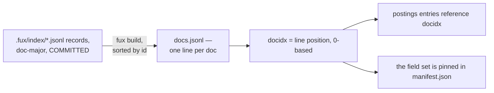

# ADR-DOCS-TABLE — docs.jsonl, the docidx-ordered doc table

## §1 — For humans

`docs.jsonl` is the derived plane's doc table: one JSON object per line, sorted
by `id`, so a document's **position in the file** — its `docidx` — is fixed for
a given committed corpus. That integer is what every other derived structure
references instead of repeating the string `id`: a postings block's entries
carry `[docidx, [tf, …]]`, the tf vector in `TF_FIELDS` order with trailing
zeros trimmed. **Small keys, one source of truth for the mapping, no separate
lookup table required.**

**Diagram — Mermaid and its ASCII twin. Update both, always, together.**



<details>
<summary><b>ASCII twin</b> — the same diagram, for terminals, diffs, and any reader without a Mermaid renderer</summary>

```text
   .fux/index/*.jsonl records, doc-major, COMMITTED
              |
              |  fux build, sorted by id
              v
   docs.jsonl — one line per doc:
     {archived, flen, id, loc, mtime, superseded, title}
              |
              |  docidx = the line's 0-based position
              v
   postings blocks store [docidx, [tf per field, trailing zeros trimmed]]

   the seven-key set is a CHECKED contract: fmt.DOCS_FIELDS is written
   into manifest.json as docs_fields and compared by is_fresh().
```

</details>

### Examples

The first two lines of this repo's `.fux/runtime/docs.jsonl` — `docidx 0` and
`docidx 1`:

```console
$ head -2 .fux/runtime/docs.jsonl
{"archived":false,"flen":[4913,135,10,2],"id":"file:CLAUDE.md","loc":"CLAUDE.md","mtime":1787383116,"superseded":false,"title":"CLAUDE.md — coding-agent guide for the Fux engine"}
{"archived":false,"flen":[945,6,1,2],"id":"file:README.md","loc":"README.md","mtime":1787414909,"superseded":false,"title":"Fux"}
```

Note what the table does that the committed record does not: `archived` and
`superseded` are written **explicitly, even when false**. On the committed line
they are omitted when false, because that line is paid for in every diff; here
the file is derived, disposable, and read by an accelerator that must not have
to distinguish *absent* from *false* on the hot path.

---

## §2 — For agents

### Context

Every derived structure that references a document needs to do so cheaply. The
document's own `id` string is the durable, corpus-independent identifier, but
repeating it inside every postings entry would bloat both the block line and the
**fixed-width** offset-table entry that indexes it
([ADR-T1-ACCELERATOR](0011_accelerator.md)).

### Decision

**1. One JSON object per line: `archived`, `flen`, `id`, `loc`, `mtime`,
`superseded`, `title`** — the set `derive/format.py::DOCS_FIELDS` names. It is
**part of the runtime contract**, written into `manifest.json` as `docs_fields`
and compared by `is_fresh()`
([ADR-RUNTIME-MANIFEST](0026_runtime-manifest.md)).

⚠ **A principle was abandoned here, and it deserves saying so rather than a
longer field list.** The table once held *exactly the fields a hit needs to be
rendered — nothing that participates in scoring*, and that was load-bearing: a
corrupt or stale doc table could produce an ugly result but never a wrong
ranking. **Four of the seven now feed scoring.** `flen` is what
`bm25f.derive_wlen()` turns into the length normaliser, and `archived`,
`superseded` and `mtime` are the facts `rank.Weighting.of()` multiplies by.

**What broke the old principle was a real defect**: a multiplier that reached
the scorer without reaching the accelerator's pruning bound made `--fast` and
`--scan` return **different documents** at any non-default weight. The fix has
to give the accelerator the same facts the scan reads off the record — and the
accelerator's only per-document input is this table. **There is no version of
that fix in which scoring data stays out of `docs.jsonl`.**

**2. What replaced it is narrower and stronger: nothing here is *derived*, only
*carried*.** Every one of the seven is copied verbatim from the committed record
— `bool(r.get("archived", False))`, `r.get("mtime")` — and **never recomputed**
from `loc`, from a configured directory list, or from anything else.

⚠ **Recomputation is precisely how the two paths drift.** A record stamped
`archived: true` whose `loc` no longer matches a configured archived directory
is flagged by the path that reads the stamp and missed by the path that
re-derives it. The separation that survives is **fact versus derivation**, not
display versus scoring, and it is enforced by `docs_fields` in the manifest
rather than by anyone remembering it.

**3. Sorted by `id` before writing.** A given committed corpus always produces
the same `docidx` assignment across two builds — the specific piece of *the
derived plane rebuilds byte-identically* that this file is responsible for.

**4. `docidx` is the line's 0-based position, and the join key everywhere
else.** An integer keeps a postings entry small and makes a fixed-width
offset-table entry possible; a string `id` would do neither.

**5. `docs.jsonl` is one of `DETERMINISTIC_FILES`.** Byte-identical output for
the same committed input, verified the same way as `manifest.json` and
`stats.json`.

### Consequences

- **`docidx` is meaningful only within one build of one corpus.** It is never
  persisted outside `.fux/runtime/`, and nothing may treat it as a stable
  identifier across builds or across corpora — `id` remains the only durable
  identifier.
- **Adding or removing one document can shift every later document's `docidx`.**
  This is safe only because the entire runtime plane is rebuilt together, never
  patched in place ([ADR-T1-ACCELERATOR](0011_accelerator.md)).
- **A change to the field set is a runtime-schema change.** `docs_fields` in the
  manifest is what makes an out-of-date plane refuse rather than answer from a
  shape it does not have — which is the guard that was missing when
  `superseded` and `mtime` first joined the table.

### Alternatives considered

- **Repeat the string `id` in every postings entry.** Rejected: it would
  materially inflate every block line, and make the **fixed-width**
  offset-table entry impossible, since ids are variable-length. The width is the
  argument, not any particular number of bytes.
- **A separate `id -> docidx` side index.** Rejected: redundant.
  `docs.jsonl`'s own line order already is that map, at zero extra storage.
- **Leave `docs.jsonl` unsorted, in shard-read order.** Rejected: it makes
  `docidx` depend on filesystem iteration order, breaking the byte-identical
  rebuild guarantee (L3).
- **Keep scoring data out and let the accelerator re-derive it.** Rejected under
  decision 2 — re-derivation is exactly what made the two query paths disagree.

### Reference (required)

- Generator — [`src/fux/derive/build.py`](../../src/fux/derive/build.py)
  (`_write_docs()`, `_read_committed()`); the field set and the postings entry
  layout — [`src/fux/derive/format.py`](../../src/fux/derive/format.py).
- The consumers of what the table carries —
  [`src/fux/query/bm25f.py`](../../src/fux/query/bm25f.py) (`derive_wlen`) and
  [`src/fux/query/rank.py`](../../src/fux/query/rank.py) (`Weighting.of`).
- The parent record — [ADR-T1-ACCELERATOR](0011_accelerator.md); the freshness
  check that pins the field set —
  [ADR-RUNTIME-MANIFEST](0026_runtime-manifest.md).

### Veto condition

**Reopen this decision if** a use case needs `docidx` to be stable across two
different builds or two different corpora, or if any field in the table is ever
**computed** rather than copied from the committed record.

**How to check it:**

```bash
# 1. nothing caches docidx across builds
grep -rn docidx src/fux/derive/
# expect: every consumer reads docidx fresh from the current build; none caches
# it across builds or writes it anywhere outside .fux/runtime/

# 2. every field is carried, not derived
grep -n '_write_docs' -A 20 src/fux/derive/build.py
# expect: each value read off the record with .get(); no path matching, no
# directory list, no recomputation
```

---

## References

*Every source this record cites, gathered in one place. §2's **Reference
(required)** names the grounding; this is the complete list. An archived
document is never listed here — the body may name one, but archive is not
evidence.*

**Records** — [ADR-LAWS](0001_laws.md) ·
[ADR-T1-ACCELERATOR](0011_accelerator.md) · [ADR-RANKING](0012_ranking.md) ·
[ADR-POSTINGS](0013_postings.md) ·
[ADR-RUNTIME-MANIFEST](0026_runtime-manifest.md)

**Code**

- [`src/fux/derive/build.py`](../../src/fux/derive/build.py)
- [`src/fux/derive/format.py`](../../src/fux/derive/format.py)
- [`src/fux/query/bm25f.py`](../../src/fux/query/bm25f.py)
- [`src/fux/query/rank.py`](../../src/fux/query/rank.py)
