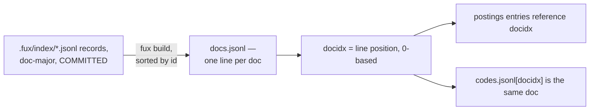

# ADR-DOCS-TABLE — docs.jsonl, the docidx-ordered doc table

- **Name:** `ADR-DOCS-TABLE` — cite this everywhere; never cite the number
- **Status:** proposed
- **Supersedes (on acceptance):** nothing — `docs.jsonl`'s shape was
  previously described only inside [ADR-T1-ACCELERATOR](0011_accelerator.md)'s
  diagram and build.py; this record pulls it out for independent reference and
  changes nothing about that decision
- **Owns (on acceptance):** no module — implemented by
  `derive/build.py::_write_docs()`, which stays owned by ADR-T1-ACCELERATOR
- **Laws:** L3 — see [ADR-LAWS](0001_laws.md); never restated here
- **Date:** 2026-08-19
- **Feature:** `.fux/runtime/docs.jsonl`

---

> ## Amended 2026-08-25 — a citation repointed after the dense lane was deleted
>
> This record cited `src/fux/derive/dense.py` for the doc table's parallel
> `codes` array. **That module was deleted** with the embedding model (Arpit,
> 2026-08-25), and so was the array: `_read_committed` no longer produces one
> and `build()` no longer has a `codes` phase.
>
> The citation is removed rather than repointed at the archive, per
> archive-is-not-evidence. **The doc table itself is unchanged** — same
> `DOCS_FIELDS`, same ordering, same freshness contract.

## §1 — For humans

`docs.jsonl` is the derived plane's doc table: one JSON object per line,
sorted by `id`, so a document's **position in the file** — its `docidx` — is
fixed for a given committed corpus. That integer is what every other derived
structure references instead of repeating the string `id`: a postings block's
entries carry `[docidx, tf]` — the tf vector in `TF_FIELDS` order with
trailing zeros trimmed — and `codes.jsonl` is an array positioned the same
way. Small keys, one source of truth for the mapping, no separate lookup table
required.

> **Amended 2026-08-24 (W-76 Phases 1 and 7).** This read *"a postings block's
> entries carry `[docidx, tf_heading, tf_body]`, and `codes.jsonl` is a plain
> array positioned the same way"*. **The join key is untouched** — `docidx` is
> what this record is about, and it is the one thing here that did not move.
> Both structures it joins did. A postings entry is now a nested pair,
> `[docidx, [tf, …]]`, over five fields
> with trailing zeros omitted, because two fields could not hold enrichment
> vocabulary, `title` and `path` apart ([ADR-RANKING](0012_ranking.md)). And
> `codes.jsonl` is a list **of lists** — one sign code per chunk — since Phase
> 7 made the dense unit the chunk rather than the document
> ([ADR-CODES-TABLE](0025_codes-table.md)). "Positioned the same way" is still
> exactly right; "plain array" is not.

**Diagram — Mermaid and its ASCII twin. Update both, always, together.**



<details>
<summary><b>ASCII twin</b> — the same diagram, for terminals, diffs, and any reader without a Mermaid renderer</summary>

```text
   .fux/index/*.jsonl records, doc-major, COMMITTED
              |
              |  fux build, sorted by id
              v
   docs.jsonl — one line per doc:
     {id, loc, title, flen, archived, superseded, mtime}
              |
              |  docidx = the line's 0-based position
              v
   postings blocks store [docidx, [tf per field, trailing zeros trimmed]]
   codes.jsonl[docidx] is that same document's LIST of per-chunk codes
```

</details>

> **Amended 2026-08-24 (W-76 Phases 1, 2 and 7) — both halves of the pair,
> together.** The Mermaid box reads *"one line per doc"* and stays true
> because it names no fields; the ASCII twin named them, and named the wrong
> four. It drew *"{id, loc, title, wlen}"*, *"[docidx, tf_heading, tf_body]"*
> and *"codes.jsonl[docidx] is that same document's dense code"* — the shape
> of every one of those has changed. The doc table now carries seven keys, and
> that set is a **checked contract**, not a comment: `fmt.DOCS_FIELDS` is
> written into `manifest.json` as `docs_fields` and compared by `is_fresh()`
> ([ADR-RUNTIME-MANIFEST](0026_runtime-manifest.md)).

### Examples

The first two lines of this repo's `.fux/runtime/docs.jsonl` — `docidx 0` and
`docidx 1`, **re-captured 2026-08-24**:

```console
$ head -2 .fux/runtime/docs.jsonl
{"archived":false,"flen":[4913,135,10,2],"id":"file:CLAUDE.md","loc":"CLAUDE.md","mtime":1787383116,"superseded":false,"title":"CLAUDE.md — coding-agent guide for the Fux engine (v0.30 rebuild)"}
{"archived":false,"flen":[945,6,1,2],"id":"file:README.md","loc":"README.md","mtime":1787414909,"superseded":false,"title":"Fux"}
```

Note what the table does that the committed record does not: `archived` and
`superseded` are written **explicitly, even when false**. On the committed
line they are omitted when false, because that line is paid for in every diff;
here the file is derived, disposable, and read by an accelerator that must not
have to distinguish "absent" from "false" on the hot path.

---

## §2 — For agents

### Context

Every derived structure that references a document needs to do so cheaply.
The document's own `id` string is the durable, corpus-independent identifier,
but repeating it inside every postings entry and every dense-code slot would
bloat both — the postings block line and the fixed-width offset-table entry
that indexes it ([ADR-T1-ACCELERATOR](0011_accelerator.md)) are both sized
around small, fixed-width fields.

### Decision

**1. One JSON object per line: `id`, `loc`, `title`, `flen`, `archived`,
`superseded`, `mtime`** — the tuple `derive/format.py::DOCS_FIELDS` names, in
that order. It is **no longer only what a hit needs to be rendered**: four of
the seven feed scoring, and the field set is part of the runtime contract that
`is_fresh()` checks.

> **Amended 2026-08-24 (W-73, W-76 Phases 1 and 2) — a principle was
> abandoned here, and it deserves saying so rather than a longer field list.**
> This read *"`id`, `loc`, `title`, `wlen`. Exactly the fields a hit needs to
> be rendered — **nothing that participates in scoring lives here**; scoring
> reads postings and `stats.json`, never `docs.jsonl`."* Both halves are
> false. The live fields are `{archived, flen, id, loc, mtime, superseded,
> title}`, and `flen`, `archived`, `superseded` and `mtime` **all feed
> scoring**: `flen` is what `bm25f.derive_wlen()` turns into the length
> normaliser, and the other three are the multipliers
> `rank.Weighting.of()` applies.
>
> **The old principle was real and it was load-bearing.** "Rendering data
> here, scoring data there" meant a corrupt or stale doc table could produce
> an ugly result but never a wrong ranking. W-73 is what broke it: a
> multiplier that reached the scorer without reaching the accelerator's
> pruning bound made `--fast` and `--scan` return **different documents** at
> any non-default weight. The fix has to give the accelerator the same facts
> the scan reads off the record — and the accelerator's only per-document
> input is this table. There is no version of that fix in which scoring data
> stays out of `docs.jsonl`.
>
> **What replaced it is narrower and stronger: nothing here is *derived*, only
> *carried*.** Every one of the seven is copied verbatim from the committed
> record — `bool(r.get("archived", False))`, `r.get("mtime")` — and never
> recomputed from `loc`, from a configured directory list, or from anything
> else. Recomputation is precisely how the two paths drift: a record stamped
> `archived: true` whose `loc` no longer matches a configured archived
> directory is flagged by the path that reads the stamp and missed by the path
> that re-derives it. The separation that survives is **fact versus
> derivation**, not **display versus scoring**, and it is enforced by
> `docs_fields` in the manifest rather than by anyone remembering it.

**2. Sorted by `id` before writing.** A given committed corpus always
produces the same `docidx` assignment across two builds — the specific piece
of "the derived plane rebuilds byte-identically"
([ADR-T1-ACCELERATOR](0011_accelerator.md)) that this file is responsible for.

**3. `docidx` is the line's 0-based position, and the join key everywhere
else.** Postings blocks store `[docidx, [tf, …]]` pairs — the tf vector in
`TF_FIELDS` order, trailing zeros trimmed; `codes.jsonl` is a parallel array
indexed the same way, each entry a document's list of per-chunk codes. An
integer keeps both small; a string `id` would not.

> **Amended 2026-08-24 (W-76 Phases 1 and 7).** This read *"Postings blocks
> store `[docidx, tf_heading, tf_body]` tuples; `codes.jsonl` is a parallel
> array indexed the same way."* **This decision is the one thing in this
> record that did not change** — `docidx` is still the line's 0-based
> position and still the only join key — but the two examples it cites to
> make itself concrete both went stale underneath it, which is how a correct
> decision comes to read as a wrong one.

**4. `docs.jsonl` is one of `DETERMINISTIC_FILES`.** Byte-identical output for
the same committed input, verified the same way as `manifest.json` and
`stats.json`.

### Consequences

- `docidx` is meaningful only within one build of one corpus. It is never
  persisted outside `.fux/runtime/`, and nothing may treat it as a stable
  identifier across builds or across corpora — `id` remains the only durable
  identifier.
- Adding or removing one document can shift every later document's `docidx`.
  This is safe only because the entire runtime plane is rebuilt together,
  never patched in place ([ADR-T1-ACCELERATOR](0011_accelerator.md)).

### Alternatives considered

- **Repeat the string `id` in every postings/codes entry.** Rejected: would
  materially inflate every block line, and make the fixed **62-byte**
  offset-table entry impossible, since ids are variable-length.

  > **Amended 2026-08-24 (W-76 Phase 1 + W-73).** This read *"the fixed
  > 40-byte offset-table entry"*. The entry grew to 62 bytes when `mx` and
  > `mnw` became per-field **unweighted** arrays — a weighted extremum cannot
  > be stored once when the weights are query-time tune keys
  > ([ADR-T1-ACCELERATOR](0011_accelerator.md)). **The rejection is
  > unaffected, and the number is not the argument anyway**: what makes the
  > entry possible is that it is *fixed-width*, and a variable-length `id`
  > would break that at 40 bytes and at 62 alike.
- **A separate `id -> docidx` side index.** Rejected: redundant. `docs.jsonl`'s
  own line order already is that map, at zero extra storage.
- **Leave `docs.jsonl` unsorted, in shard-read order.** Rejected: makes
  `docidx` depend on filesystem iteration order, breaking the byte-identical
  rebuild guarantee (L3).

### Reference (required)

- Generator — [`src/fux/derive/build.py`](../../src/fux/derive/build.py)
  (`_write_docs()`, `_read_committed()`).
- Consumers of the `docidx` contract —
  [`src/fux/derive/format.py`](../../src/fux/derive/format.py) (the postings
  entry layout), `src/fux/derive/dense.py` (deleted 2026-08-25)
  (`codes.jsonl`'s array order).
- The parent record — [ADR-T1-ACCELERATOR](0011_accelerator.md).

### Veto condition

**Reopen this decision if** a use case needs `docidx` to be stable across two
different builds or two different corpora — today nothing does, and nothing
may depend on that.

**How to check it:**

```bash
grep -rn docidx src/fux/derive/
# expect: every consumer reads docidx fresh from the current build; none caches
# it across builds or writes it anywhere outside .fux/runtime/
```
---

## References

*Every source this record cites, gathered in one place. §2's **Reference
(required)** names the grounding; this is the complete list. An archived
document is never listed here — the body may name one, but archive is not
evidence.*

**Records** — [ADR-LAWS](0001_laws.md) ·
[ADR-T1-ACCELERATOR](0011_accelerator.md) · [ADR-RANKING](0012_ranking.md) ·
[ADR-CODES-TABLE](0025_codes-table.md) ·
[ADR-RUNTIME-MANIFEST](0026_runtime-manifest.md)

**Code**

- [`src/fux/derive/build.py`](../../src/fux/derive/build.py)
- `src/fux/derive/dense.py` (deleted 2026-08-25)
- [`src/fux/derive/format.py`](../../src/fux/derive/format.py)
- [`src/fux/query/bm25f.py`](../../src/fux/query/bm25f.py)
- [`src/fux/query/rank.py`](../../src/fux/query/rank.py)
