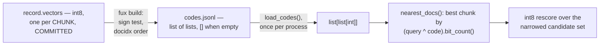

# ADR-CODES-TABLE — codes.jsonl, the dense lane's per-document codes

- **Name:** `ADR-CODES-TABLE` — cite this everywhere; never cite the number
- **Status:** proposed
- **Supersedes (on acceptance):** nothing — `codes.jsonl`'s shape was
  previously described only inside `derive/dense.py`'s own docstring and
  [ADR-T1-ACCELERATOR](0011_accelerator.md)'s ownership line; this record
  pulls it out for independent reference and changes nothing about that
  decision
- **Owns (on acceptance):** no module — implemented by
  `derive/dense.py::build_codes()` / `load_codes()` / `hamming_ranking()`,
  which stay owned by ADR-T1-ACCELERATOR
- **Laws:** L3 — see [ADR-LAWS](0001_laws.md); never restated here
- **Date:** 2026-08-19
- **Feature:** `.fux/runtime/codes.jsonl`, the dense/semantic ranking lane

---

## §1 — For humans

Every committed record may carry `vectors` — one base64url `int8` chunk vector
per chunk. `codes.jsonl` is the **sign test on those vectors**, one 256-bit
code per chunk, lifted into the derived plane as a JSON list of lists,
positioned the same way as `docs.jsonl` — entry `i` is document `docidx i`'s
**list** of per-chunk codes, or `[]` if that document has nothing embeddable.

The point of the file is to pay the decode cost exactly once per process
rather than once per query, and to make the codes searchable by plain integer
XOR and bit-count — no approximate index, no recall anxiety, just a linear
scan over decoded integers, which then narrows the corpus enough for the exact
`int8` rescore to be affordable.

> **Amended 2026-08-24 (W-76 Phases 1 and 7) — this record described a file
> built from a field that no longer exists.** It read *"Every committed record
> may carry a 32-byte, sign-quantized FuxVec code, base64url-encoded.
> `codes.jsonl` is that code lifted into the derived plane as a single JSON
> array … entry `i` is document `docidx i`'s code, or `null`"*. Every clause
> is now false.
>
> **`record.code` was removed in W-76 Phase 1, and for TIME, not bytes.** It
> was 0.4 % of the index and **91 % of every full ingest**. Phase 7 then
> replaced it under Arpit's fork A ruling — *"I'm going to clone the repo and
> run the query. That's all."* — with committed per-chunk `int8` `vectors`
> ([ADR-RECORD](0010_index-record.md)), and **inverted this file's
> relationship to the committed plane**: the sign codes are no longer a
> committed artefact lifted into the derived plane, they are *derived from*
> committed data by `derive/dense.py::build_codes`. Deleting `codes.jsonl` now
> costs speed and nothing else, which is exactly why it belongs where it is
> while the vectors do not.
>
> **The register row for this record says `built: yes`, and that is true by
> the letter and misleading in substance.** A file called `codes.jsonl` is
> built, at the path named, positionally aligned with `docs.jsonl` — and its
> element type, its source field, its unit of granularity and its empty-value
> sentinel have all changed. A reader who trusted the row and skipped the body
> would write `a[0][:24]` and get a `TypeError`. Read the amendments, not the
> row.

**Diagram — Mermaid and its ASCII twin. Update both, always, together.**



<details>
<summary><b>ASCII twin</b> — the same diagram, for terminals, diffs, and any reader without a Mermaid renderer</summary>

```text
   record.vectors — int8 chunk vectors, one per CHUNK, COMMITTED
              |
              |  fux build: sign test per chunk, docidx order
              v
   codes.jsonl — list of lists, docs.jsonl-aligned, [] where no vectors
              |
              |  load_codes(), once per process
              v
   list[list[int]] — base64 decoded once, not once per query
              |
              v
   nearest_docs(): min over a doc's chunks of
                   (query_code ^ code).bit_count(), nearest first
              |
              |  a PREFILTER, not the answer
              v
   int8 rescore over the narrowed candidate set
```

</details>

> **Amended 2026-08-24 (W-76 Phase 7) — both halves of the pair, together.**
> Both drew *"record.code — FuxVec, base64url, **COMMITTED**"* as this file's
> input. That field does not exist; the committed input is `vectors`, and the
> codes are **derived** from it rather than copied out of it. Two further
> boxes were wrong downstream: the loaded type is `list[list[int]]`, not
> `list[int | None]`, and the consumer is `nearest_docs()` — which takes the
> **minimum** over a document's chunks — rather than `hamming_ranking()`,
> which assumes one code per document and raises `TypeError` on any real
> table. **The last box is new because the lane's job changed**: a popcount
> over one int per chunk is now a prefilter that narrows the corpus enough for
> a 256-multiply-add exact score to be affordable, not a ranking that stands
> on its own.

### Examples

The shape of this repo's `.fux/runtime/codes.jsonl` — **re-captured
2026-08-24** — a JSON list of lists, 434 entries for 434 documents holding
4047 chunk codes between them (every document here happens to have at least
one; the schema allows `[]`):

```console
$ python3 -c "import json; a=json.load(open('.fux/runtime/codes.jsonl')); \
    print(len(a), sum(len(x) for x in a), a[0][0][:24]+'…')"
434 4047 M2riJr_GzVx452Dw0hZqDGXI…
```

> **Amended 2026-08-24 (W-76 Phase 7) — the old command does not merely print
> the wrong numbers, it raises.** It read `a[0][:24]+'…'` and printed
> *"128 cmoip5_w6Fx4Z2T1whJKDDH4gt09JG-j5h_xq3b7tWw…"*. `a[0]` is now a
> `list`, so slicing it yields a list and `list + str` is a `TypeError` — the
> indexing has to go one level deeper, `a[0][0]`, to reach a code. **The
> re-capture is real**, run against this repo's live runtime plane; the
> second number, 4047, is the one the old shape could not express at all,
> because there was nothing to count per document.

---

## §2 — For agents

### Context

The dense lane exists because FuxVec codes are already committed and unused —
`ADR-RECORD` writes them at ingest, but nothing queried them until this
milestone. Decoding base64 into a big int per query, on every request, is
avoidable work; decoding once per process is not.

> **Read as of 2026-08-19, not as of today.** This paragraph is the standing
> motivation for the lane and is left as written; the premise it rests on —
> a committed `code` field nobody queried — stopped being true on 2026-08-23,
> per §1's amendment. **The second half is what survived the change and is
> why the file still exists**: pay the decode once per process, never per
> query. That argument was never about which field the codes came from.

### Decision

**1. One JSON list of lists, positionally aligned with `docs.jsonl`.**
`codes.jsonl[i]` is document `docidx i`'s **list of per-chunk codes** — no
separate index needed, the same join key as
[ADR-DOCS-TABLE](0024_docs-table.md).

> **Amended 2026-08-24 (W-76 Phase 7).** This read *"One JSON array …
> `codes.jsonl[i]` is document `docidx i`'s code"*. **The alignment is the
> decision and it is untouched**; the element type is not. Phase 7 moved the
> dense unit from the document to the chunk, and the reason is retrieval
> quality rather than storage: one vector per document averages a long
> document's passages into a blur that matches nothing sharply, and the
> chunker is shared with the refer plane on purpose, so a citation's span and
> a vector's span cannot disagree about what a passage is. `load_codes()`
> still accepts a pre-Phase-7 table — a bare string entry is read as a
> one-element list — so an old runtime degrades rather than crashing.

**2. `[]` means no codes — never a synthesized all-zero code.** A zero code
sits at a misleading middle Hamming distance from every query, which would
make an unembeddable document quietly rankable. An empty list is skipped by
`nearest_docs()` instead.

> **Amended 2026-08-24 (W-76 Phase 7) — the sentinel changed, the reasoning
> did not.** This read *"`null` means no code … `null` is filtered out of
> `hamming_ranking()` instead"*. With a list per document the natural empty
> value is the empty list, and it is strictly better than `null` here: `[]`
> composes with the per-chunk loop (`if not chunk_codes: continue`) with no
> `None` check anywhere, so absence cannot be forgotten by a caller. **The
> argument against an all-zero placeholder is unchanged and is the actual
> content of this decision** — a zero code is a plausible-looking mid-distance
> neighbour, which is a silent wrong answer rather than a visible missing one.
> `load_codes()` maps a legacy `null` to `[]` on read, so the two sentinels
> never coexist in memory.

**3. Decoded once per process by `load_codes()`, not once per query.** The
per-build cost this file exists to amortize; `_decode()` turns base64url into
a Python `int` via `int.from_bytes`.

**4. Feeds a separate, default-off ranking lane.** `hamming_ranking()` is
fused into `ask` only on explicit request — see
[ADR-T1-ACCELERATOR](0011_accelerator.md) and the differential law.
`codes.jsonl` existing changes no lexical answer.

### Consequences

- The dense lane's query cost is one XOR-and-bit-count per document, in
  Python — a full linear scan, not an ANN index, which is the trade FuxVec was
  built to make at the sizes measured.
- `codes.jsonl` is one of `DETERMINISTIC_FILES` — byte-identical for the same
  committed input across two builds.
- A document with no embeddable content is `[]` — **amended 2026-08-24; this
  read `null`, see Decision 2** — so its absence from dense results is a fact
  about the data, not a silent scoring bug.

### Alternatives considered

- **A raw-bytes binary sidecar instead of a base64 JSON array.** Rejected:
  keeps the runtime plane in one format (JSON text) throughout, matching
  `docs.jsonl`/`manifest.json`/`stats.json`, rather than adding a second binary
  shape for one file the way the postings offset table justifiably does.
- **An all-zero placeholder for an unembeddable document.** Rejected on
  `dense.py`'s own stated reasoning: a zero code is a plausible-looking
  mid-distance neighbor, not a signal of absence.
- **Decode base64 lazily, per query.** Rejected on measured intent: this
  file's entire purpose is paying that cost once.

### Reference (required)

- Generator and consumer —
  [`src/fux/derive/dense.py`](../../src/fux/derive/dense.py) (`build_codes()`,
  `load_codes()`, `nearest_docs()`).
- The committed `vectors` field this table is derived from —
  [ADR-RECORD](0010_index-record.md), and its Phase-7 amendment.

  > **Amended 2026-08-24 (W-76 Phases 1 and 7).** These read
  > *"`hamming_ranking()`"* and *"The committed `code` field's origin"*.
  > `hamming_ranking()` is still exported and still correct for the shape it
  > was written against — one code per document — which no live table has;
  > `query/hybrid.py` calls `nearest_docs()` for exactly that reason. Pointing
  > a reader at the function that raises on the file this record specifies was
  > the worst of the stale references here.
- The parent record and the default-off fusion reasoning —
  [ADR-T1-ACCELERATOR](0011_accelerator.md).

### Veto condition

**Reopen this decision if** a corpus is measured where the one-time decode or
the linear Hamming scan becomes the dominant query cost — that would motivate
an approximate index, which today is explicitly not built.

**How to check it:**

```bash
ls work/regression/ | grep -i dense
# expect: no dense-lane latency run yet: this record's veto has not fired
```
---

## References

*Every source this record cites, gathered in one place. §2's **Reference
(required)** names the grounding; this is the complete list. An archived
document is never listed here — the body may name one, but archive is not
evidence.*

**Records** — [ADR-LAWS](0001_laws.md) · [ADR-RECORD](0010_index-record.md) ·
[ADR-T1-ACCELERATOR](0011_accelerator.md) ·
[ADR-DOCS-TABLE](0024_docs-table.md)

**Code**

- [`src/fux/derive/dense.py`](../../src/fux/derive/dense.py)
