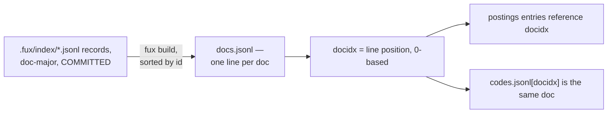

# ADR-DOCS-TABLE — docs.jsonl, the docidx-ordered doc table

- **Name:** `ADR-DOCS-TABLE` — cite this everywhere; never cite the number
- **Status:** proposed
- **Supersedes (on acceptance):** nothing — `docs.jsonl`'s shape was
  previously described only inside [ADR-T1-ACCELERATOR](0011_accelerator.md)'s
  diagram and build.py; this record pulls it out for independent reference and
  changes nothing about that decision
- **Owns (on acceptance):** no module — implemented by
  `derive/build.py::_write_docs()`, which stays owned by ADR-T1-ACCELERATOR
- **Laws:** L3 — see [ADR-LAWS](0001_laws.md); never restated here
- **Date:** 2026-08-19
- **Feature:** `.fux/runtime/docs.jsonl`

---

## §1 — For humans

`docs.jsonl` is the derived plane's doc table: one JSON object per line,
sorted by `id`, so a document's **position in the file** — its `docidx` — is
fixed for a given committed corpus. That integer is what every other derived
structure references instead of repeating the string `id`: a postings block's
entries carry `[docidx, tf_heading, tf_body]`, and `codes.jsonl` is a plain
array positioned the same way. Small keys, one source of truth for the
mapping, no separate lookup table required.

**Diagram — Mermaid and its ASCII twin. Update both, always, together.**



<details>
<summary><b>ASCII twin</b> — the same diagram, for terminals, diffs, and any reader without a Mermaid renderer</summary>

```text
   .fux/index/*.jsonl records, doc-major, COMMITTED
              |
              |  fux build, sorted by id
              v
   docs.jsonl — one line per doc: {id, loc, title, wlen}
              |
              |  docidx = the line's 0-based position
              v
   postings blocks store [docidx, tf_heading, tf_body]
   codes.jsonl[docidx] is that same document's dense code
```

</details>

### Examples

The first two lines of this repo's `.fux/runtime/docs.jsonl` — `docidx 0` and
`docidx 1`:

```console
$ head -2 .fux/runtime/docs.jsonl
{"id":"file:CLAUDE.md","loc":"CLAUDE.md","title":"CLAUDE.md — coding-agent guide for the Fux engine (v0.30 rebuild)","wlen":2831}
{"id":"file:README.md","loc":"README.md","title":"Fux","wlen":606}
```

---

## §2 — For agents

### Context

Every derived structure that references a document needs to do so cheaply.
The document's own `id` string is the durable, corpus-independent identifier,
but repeating it inside every postings entry and every dense-code slot would
bloat both — the postings block line and the fixed-width offset-table entry
that indexes it ([ADR-T1-ACCELERATOR](0011_accelerator.md)) are both sized
around small, fixed-width fields.

### Decision

**1. One JSON object per line: `id`, `loc`, `title`, `wlen`.** Exactly the
fields a hit needs to be rendered — nothing that participates in scoring lives
here; scoring reads postings and `stats.json`, never `docs.jsonl`.

**2. Sorted by `id` before writing.** A given committed corpus always
produces the same `docidx` assignment across two builds — the specific piece
of "the derived plane rebuilds byte-identically"
([ADR-T1-ACCELERATOR](0011_accelerator.md)) that this file is responsible for.

**3. `docidx` is the line's 0-based position, and the join key everywhere
else.** Postings blocks store `[docidx, tf_heading, tf_body]` tuples;
`codes.jsonl` is a parallel array indexed the same way. An integer keeps both
small; a string `id` would not.

**4. `docs.jsonl` is one of `DETERMINISTIC_FILES`.** Byte-identical output for
the same committed input, verified the same way as `manifest.json` and
`stats.json`.

### Consequences

- `docidx` is meaningful only within one build of one corpus. It is never
  persisted outside `.fux/runtime/`, and nothing may treat it as a stable
  identifier across builds or across corpora — `id` remains the only durable
  identifier.
- Adding or removing one document can shift every later document's `docidx`.
  This is safe only because the entire runtime plane is rebuilt together,
  never patched in place ([ADR-T1-ACCELERATOR](0011_accelerator.md)).

### Alternatives considered

- **Repeat the string `id` in every postings/codes entry.** Rejected: would
  materially inflate every block line, and make the fixed 40-byte offset-table
  entry impossible, since ids are variable-length.
- **A separate `id -> docidx` side index.** Rejected: redundant. `docs.jsonl`'s
  own line order already is that map, at zero extra storage.
- **Leave `docs.jsonl` unsorted, in shard-read order.** Rejected: makes
  `docidx` depend on filesystem iteration order, breaking the byte-identical
  rebuild guarantee (L3).

### Reference (required)

- Generator — [`src/fux/derive/build.py`](../../src/fux/derive/build.py)
  (`_write_docs()`, `_read_committed()`).
- Consumers of the `docidx` contract —
  [`src/fux/derive/format.py`](../../src/fux/derive/format.py) (the postings
  entry layout), [`src/fux/derive/dense.py`](../../src/fux/derive/dense.py)
  (`codes.jsonl`'s array order).
- The parent record — [ADR-T1-ACCELERATOR](0011_accelerator.md).

### Veto condition

**Reopen this decision if** a use case needs `docidx` to be stable across two
different builds or two different corpora — today nothing does, and nothing
may depend on that.

**How to check it:**

```bash
grep -rn docidx src/fux/derive/
# expect: every consumer reads docidx fresh from the current build; none caches
# it across builds or writes it anywhere outside .fux/runtime/
```
