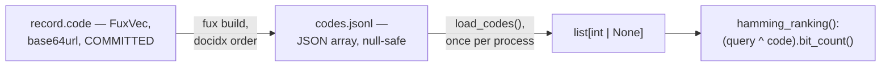

# ADR-CODES-TABLE — codes.jsonl, the dense lane's per-document codes

- **Name:** `ADR-CODES-TABLE` — cite this everywhere; never cite the number
- **Status:** proposed
- **Supersedes (on acceptance):** nothing — `codes.jsonl`'s shape was
  previously described only inside `derive/dense.py`'s own docstring and
  [ADR-T1-ACCELERATOR](0011_accelerator.md)'s ownership line; this record
  pulls it out for independent reference and changes nothing about that
  decision
- **Owns (on acceptance):** no module — implemented by
  `derive/dense.py::build_codes()` / `load_codes()` / `hamming_ranking()`,
  which stay owned by ADR-T1-ACCELERATOR
- **Laws:** L3 — see [ADR-LAWS](0001_laws.md); never restated here
- **Date:** 2026-08-19
- **Feature:** `.fux/runtime/codes.jsonl`, the dense/semantic ranking lane

---

## §1 — For humans

Every committed record may carry a 32-byte, sign-quantized FuxVec code,
base64url-encoded. `codes.jsonl` is that code lifted into the derived plane as
a single JSON array, positioned the same way as `docs.jsonl` — entry `i` is
document `docidx i`'s code, or `null` if that document has nothing
embeddable.

The point of the file is to pay the base64 decode cost exactly once per
process rather than once per query, and to make the codes searchable by plain
integer XOR and bit-count — no approximate index, no recall anxiety, just a
linear scan over decoded integers.

**Diagram — Mermaid and its ASCII twin. Update both, always, together.**



<details>
<summary><b>ASCII twin</b> — the same diagram, for terminals, diffs, and any reader without a Mermaid renderer</summary>

```text
   record.code — FuxVec sign-quantized code, base64url, COMMITTED
              |
              |  fux build, docidx order
              v
   codes.jsonl — one JSON array, docs.jsonl-aligned, null where no code
              |
              |  load_codes(), once per process
              v
   list[int | None] — base64 decoded once, not once per query
              |
              v
   hamming_ranking(): (query_code ^ code).bit_count(), nearest first
```

</details>

### Examples

The shape of this repo's `.fux/runtime/codes.jsonl` — a single JSON array,
128 entries for 128 documents (every document here happens to have a code;
the schema allows `null`):

```console
$ python3 -c "import json; a=json.load(open('.fux/runtime/codes.jsonl')); print(len(a), a[0][:24]+'…')"
128 cmoip5_w6Fx4Z2T1whJKDDH4gt09JG-j5h_xq3b7tWw…
```

---

## §2 — For agents

### Context

The dense lane exists because FuxVec codes are already committed and unused —
`ADR-RECORD` writes them at ingest, but nothing queried them until this
milestone. Decoding base64 into a big int per query, on every request, is
avoidable work; decoding once per process is not.

### Decision

**1. One JSON array, positionally aligned with `docs.jsonl`.** `codes.jsonl[i]`
is document `docidx i`'s code — no separate index needed, the same join key
as [ADR-DOCS-TABLE](0025_docs-table.md).

**2. `null` means no code — never a synthesized all-zero code.** A zero code
sits at a misleading middle Hamming distance from every query, which would
make an unembeddable document quietly rankable. `null` is filtered out of
`hamming_ranking()` instead.

**3. Decoded once per process by `load_codes()`, not once per query.** The
per-build cost this file exists to amortize; `_decode()` turns base64url into
a Python `int` via `int.from_bytes`.

**4. Feeds a separate, default-off ranking lane.** `hamming_ranking()` is
fused into `ask` only on explicit request — see
[ADR-T1-ACCELERATOR](0011_accelerator.md) and the differential law.
`codes.jsonl` existing changes no lexical answer.

### Consequences

- The dense lane's query cost is one XOR-and-bit-count per document, in
  Python — a full linear scan, not an ANN index, which is the trade FuxVec was
  built to make at the sizes measured.
- `codes.jsonl` is one of `DETERMINISTIC_FILES` — byte-identical for the same
  committed input across two builds.
- A document with no embeddable content is `null`, so its absence from dense
  results is a fact about the data, not a silent scoring bug.

### Alternatives considered

- **A raw-bytes binary sidecar instead of a base64 JSON array.** Rejected:
  keeps the runtime plane in one format (JSON text) throughout, matching
  `docs.jsonl`/`manifest.json`/`stats.json`, rather than adding a second binary
  shape for one file the way the postings offset table justifiably does.
- **An all-zero placeholder for an unembeddable document.** Rejected on
  `dense.py`'s own stated reasoning: a zero code is a plausible-looking
  mid-distance neighbor, not a signal of absence.
- **Decode base64 lazily, per query.** Rejected on measured intent: this
  file's entire purpose is paying that cost once.

### Reference (required)

- Generator and consumer —
  [`src/fux/derive/dense.py`](../../src/fux/derive/dense.py) (`build_codes()`,
  `load_codes()`, `hamming_ranking()`).
- The committed `code` field's origin — [ADR-RECORD](0010_index-record.md).
- The parent record and the default-off fusion reasoning —
  [ADR-T1-ACCELERATOR](0011_accelerator.md).

### Veto condition

**Reopen this decision if** a corpus is measured where the one-time decode or
the linear Hamming scan becomes the dominant query cost — that would motivate
an approximate index, which today is explicitly not built.

**How to check it:**

```bash
ls work/regression/ | grep -i dense
# expect: no dense-lane latency run yet: this record's veto has not fired
```
