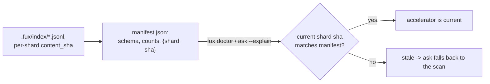

# ADR-RUNTIME-MANIFEST — manifest.json, the accelerator's staleness fingerprint

- **Name:** `ADR-RUNTIME-MANIFEST` — cite this everywhere; never cite the
  number
- **Status:** proposed
- **Supersedes (on acceptance):** nothing — `manifest.json`'s role was
  previously described only inside
  [ADR-T1-ACCELERATOR](0011_accelerator.md)'s decision 8; this record pulls it
  out for independent reference and changes nothing about that decision
- **Owns (on acceptance):** no module — implemented by
  `derive/build.py::build()`, which stays owned by ADR-T1-ACCELERATOR
- **Laws:** L3 — see [ADR-LAWS](0001_laws.md); never restated here
- **Date:** 2026-08-19
- **Feature:** `.fux/runtime/manifest.json`

---

## §1 — For humans

`manifest.json` is the derived plane's fingerprint: schema and analyzer
versions, `block_size`, doc/term/block counts, and — the part that actually
does the work — a **content hash of every committed shard**, keyed by shard
filename. It is the real staleness check: a reader recomputes each committed
shard's hash and compares it to this map. A mismatch names exactly which
shard drifted; `ask` then falls back to the scan rather than trusting a stale
accelerator.

**Diagram — Mermaid and its ASCII twin. Update both, always, together.**



<details>
<summary><b>ASCII twin</b> — the same diagram, for terminals, diffs, and any reader without a Mermaid renderer</summary>

```text
   .fux/index/*.jsonl -- content_sha computed per shard while reading
              |
              v
   manifest.json: {schema, analyzer, block_size, docs, terms, blocks,
                    shards: {shard filename -> content_sha}}
              |
              |  fux doctor / ask --explain
              v
   current shard sha == manifest's sha, for every shard?  --no--> stale,
              |                                                    ask
             yes                                                  falls
              v                                                   back
   accelerator is current, trusted as-is                     to the scan
```

</details>

### Examples

`.fux/runtime/manifest.json` in this repo (128 docs, 8507 terms — the shard
map is abbreviated to two real entries; the full file lists one per committed
shard):

```json
{
  "analyzer": "v1", "block_size": 128, "blocks": 8507, "docs": 128,
  "index_schema": "fux.index.v1", "schema": "fux.runtime.v1", "terms": 8507,
  "shards": {
    "01.jsonl": "a44217eec8539506154631f3500a1f75025fd36f",
    "05.jsonl": "e608571c4242c7c911d3b84050e44b47c0d185ec"
  }
}
```

---

## §2 — For agents

### Context

The derived plane must be provably a pure function of the committed shards
([ADR-T1-ACCELERATOR](0011_accelerator.md)). Proving it — rather than merely
asserting it — needs a way to answer "does `.fux/runtime/` still match
`.fux/index/` as it stands right now?" without re-running the whole build.

### Decision

**1. Fields: `schema`, `index_schema`, `analyzer`, `block_size`, `docs`,
`terms`, `blocks`, and `shards` (shard filename → `content_sha`).** The counts
double as a human-readable build summary.

**2. The per-shard hash reuses the store's own hash family.** The same
`content_sha` (blake2b, 20-byte digest) that the committed ledger already
uses for its own `sha` field
([`store/format.py`](../../src/fux/store/format.py)) — not a second, invented
hash function.

**3. `manifest.json` is one of `DETERMINISTIC_FILES`.** `sort_keys=True` JSON,
byte-identical for the same committed input — two clones that ingest the same
corpus produce byte-identical manifests, which is what makes a CI-built
accelerator directly comparable to a local one.

**4. This is the actual correctness check for staleness, not `stamp.json`.**
`stamp.json` ([ADR-RUNTIME-STAMP](0027_runtime-stamp.md)) is a cheap
pre-filter only; `manifest.json`'s content hashes are what a reader trusts
when it needs to *know*, not guess.

### Consequences

- Verifying freshness this way costs one content hash per committed shard,
  every time it is checked — cheap next to a full accelerator rebuild, but not
  free, which is exactly why `stamp.json` exists as a first-pass filter ahead
  of it.
- Because the map is per-shard rather than one hash over the whole
  `.fux/index/` directory, `fux doctor` can name exactly which shard(s)
  drifted, not just that something did.
- The doc/term/block counts double as a free, at-a-glance summary surface —
  used directly in `fux ingest`/`fux build` output.

### Alternatives considered

- **One hash over the entire committed index directory.** Rejected: cannot
  localize which shard changed, only that something did.
- **Trust `stamp.json`'s mtimes alone, no content check.** Rejected:
  filesystem metadata is not reproducible or trustworthy across checkouts —
  every file in a fresh clone gets "now" as its mtime — so a real correctness
  guarantee needs content, not metadata.
- **Recompute stats/counts at query time instead of caching them here.**
  Rejected: cheap to compute once at build time, and useful as a fast summary
  without opening every other runtime file.

### Reference (required)

- Generator — [`src/fux/derive/build.py`](../../src/fux/derive/build.py)
  (`build()`, `_read_committed()`).
- The reused hash function —
  [`src/fux/store/format.py`](../../src/fux/store/format.py)
  (`content_sha()`).
- The parent record — [ADR-T1-ACCELERATOR](0011_accelerator.md), decision 8.

### Veto condition

**Reopen this decision if** hashing every committed shard on each staleness
check is measured as a real cost at corpus scale.

**How to check it:**

```bash
time fux doctor
# compare against the R3/M2 latency bar in
# work/regression/2026-08-12-m2-accelerator/report.md
```
---

## References

*Every source this record cites, gathered in one place. §2's **Reference
(required)** names the grounding; this is the complete list. An archived
document is never listed here — the body may name one, but archive is not
evidence.*

**Records** — [ADR-LAWS](0001_laws.md) ·
[ADR-T1-ACCELERATOR](0011_accelerator.md) ·
[ADR-RUNTIME-STAMP](0027_runtime-stamp.md)

**Code**

- [`src/fux/derive/build.py`](../../src/fux/derive/build.py)
- [`src/fux/store/format.py`](../../src/fux/store/format.py)
