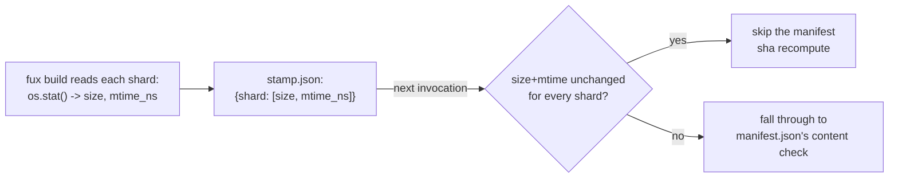

# ADR-RUNTIME-STAMP — stamp.json, the cheap pre-check ahead of the manifest

## §1 — For humans

`stamp.json` records, per committed shard, its `[size, mtime_ns]` at the
moment the accelerator was last built. It exists for one reason: an
`os.stat()` per shard is far cheaper than a content hash per shard, and most
of the time nothing changed at all. A size-and-mtime match is a strong
"probably unchanged" signal that lets `fux` skip
[`manifest.json`](0026_runtime-manifest.md)'s real content-hash check on the
common path.

It is deliberately excluded from the set of files that must be byte-identical
across two builds — filesystem timestamps are not reproducible, by
construction, so this file is volatile on purpose rather than by oversight.

**Diagram — Mermaid and its ASCII twin. Update both, always, together.**



<details>
<summary><b>ASCII twin</b> — the same diagram, for terminals, diffs, and any reader without a Mermaid renderer</summary>

```text
   fux build reads each committed shard: os.stat() -> size, mtime_ns
              |
              v
   stamp.json: {shard filename -> [size_bytes, mtime_ns]}
              |
              |  next fux build / doctor invocation
              v
   size+mtime unchanged for every shard? --yes--> skip the manifest's
              |                                    content-sha recompute
              no
              v
   fall through to manifest.json's real content-hash check
```

</details>

### Examples

Two real entries from this repo's `.fux/runtime/stamp.json`:

```json
{
  "shards": {
    "01.jsonl": [4353, 1786519644986538882],
    "05.jsonl": [10764, 1786519644987126840]
  }
}
```

---

## §2 — For agents

### Context

`manifest.json`'s content-hash check is correct but not free — it costs one
hash over every committed shard's bytes. On the overwhelmingly common case
(nothing changed since the last build), that cost is avoidable if a cheaper
signal can rule out a change first.

### Decision

**1. Fields: per committed shard, `[size_bytes, mtime_ns]`.** Captured in the
same pass `build()` already makes over `.fux/index/*.jsonl`, at no extra I/O.

**2. Deliberately excluded from `DETERMINISTIC_FILES`.** mtimes are not
reproducible across two checkouts of byte-identical content — a fresh clone,
a CI runner, or a different machine all produce different mtimes for the same
bytes. This file is volatile by design, and its absence from the determinism
set says so explicitly rather than leaving it to be discovered.

**3. It is a filter, never the final word.** A size+mtime match is a strong
hint that nothing changed; it is not proof. Only
[`manifest.json`](0026_runtime-manifest.md)'s content-sha map is the record of
truth for actual staleness.

### Consequences

- The common case — nothing changed since the last build — is answered by an
  `os.stat()` per shard instead of a content hash per shard, which is
  materially cheaper at corpus scale.
- A false "unchanged" verdict from a size+mtime match without a content check
  is possible only if a shard's bytes changed while both its size and its
  mtime happened to be preserved exactly — which is why the content-sha check
  remains the real guarantee, never something this file makes redundant.
- Because it sits outside the determinism set, two byte-identical
  `.fux/runtime/` builds made on two different machines or at two different
  times can carry different `stamp.json` bytes. That is expected, not a
  defect, and `stamp.json` must never be read as a correctness signal on its
  own.

### Alternatives considered

- **Skip `stamp.json`; always check `manifest.json`'s content hashes.**
  Rejected on cost at scale: re-hashing every committed shard on every
  `fux doctor`/`ask` invocation, even when nothing changed, is wasted work.
- **Use only mtimes, drop the content-hash check entirely.** Rejected:
  mtimes are exactly the non-reproducible signal Law L3 keeps out of any
  correctness claim — fine as a hint, never as proof.
- **Fold `stamp.json`'s fields into `manifest.json` itself.** Rejected: would
  pull a non-reproducible field into the one file whose whole contract is
  byte-identical reproducibility, breaking that guarantee for the rest of the
  file too.

### Reference (required)

- Generator — [`src/fux/derive/build.py`](../../src/fux/derive/build.py)
  (`build()`, the `shard_stamp` collection, the write to `fmt.STAMP_NAME`).
- The set it is excluded from —
  [`src/fux/derive/format.py`](../../src/fux/derive/format.py)
  (`DETERMINISTIC_FILES`).
- The parent record — [ADR-T1-ACCELERATOR](0011_accelerator.md), decision 9.

### Veto condition

**Reopen this decision if** a real workflow is found where `stamp.json`'s
size+mtime match masks an actual content change that should have been caught
immediately.

**How to check it:**

```bash
# after editing a committed shard, the manifest check must still catch it
# even if stamp.json's fields happen to look unchanged
fux doctor
# expect: [OK]/[WARN] accelerator: stale, driven by manifest.json's content
# hashes, not by stamp.json alone
```
---

## References

*Every source this record cites, gathered in one place. §2's **Reference
(required)** names the grounding; this is the complete list. An archived
document is never listed here — the body may name one, but archive is not
evidence.*

**Records** — [ADR-LAWS](0001_laws.md) ·
[ADR-T1-ACCELERATOR](0011_accelerator.md) ·
[ADR-RUNTIME-MANIFEST](0026_runtime-manifest.md)

**Code**

- [`src/fux/derive/build.py`](../../src/fux/derive/build.py)
- [`src/fux/derive/format.py`](../../src/fux/derive/format.py)
