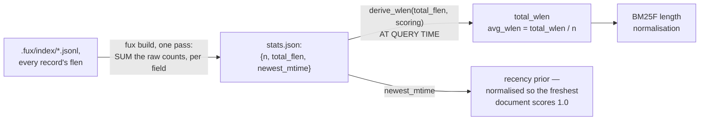

# ADR-RUNTIME-STATS — stats.json, the corpus-wide numbers BM25F needs

- **Name:** `ADR-RUNTIME-STATS` — cite this everywhere; never cite the number
- **Status:** proposed
- **Supersedes (on acceptance):** nothing — `stats.json`'s role was previously
  described only inside [ADR-T1-ACCELERATOR](0011_accelerator.md)'s diagram
  and build.py; this record pulls it out for independent reference and
  changes nothing about that decision
- **Owns (on acceptance):** no module — implemented by
  `derive/build.py::_read_committed()`, which stays owned by
  ADR-T1-ACCELERATOR
- **Laws:** L3 — see [ADR-LAWS](0001_laws.md); never restated here
- **Date:** 2026-08-19
- **Feature:** `.fux/runtime/stats.json`

---

## §1 — For humans

`stats.json` holds three numbers: `n`, the document count; `total_wlen`, the
sum of every document's derived weighted length; and `newest_mtime`, the
newest commit timestamp in the corpus. No single term's postings can supply
any of them — they are properties of the whole corpus — and BM25F's
length-normalisation term needs `total_wlen / n` (the average document length)
on every scored document, every query. Computing that once at build time turns
a per-query, O(corpus) scan into an O(1) lookup.

> **Amended 2026-08-24 (W-76 Phases 1 and 2) — and see the Veto condition,
> which this record's own trigger FIRED without anyone recording it.** This
> read *"holds exactly two numbers"*, and *"`total_wlen`, the sum of every
> document's word length"*. Both are stale. There are **three** fields, and
> `total_wlen` is no longer a sum of committed lengths — it is a sum of
> **derived** ones, `sum(derive_wlen(flen))` over every record, and it is a
> **float** on the wire (`645001.0` here) because the derivation is a weighted
> sum with float weights. A reader that types `stats["total_wlen"]` as `int`
> is reading a schema that has not existed since 2026-08-23.

> **Amended again 2026-08-24 ([ADR-TUNE](0038_tuning.md) built) — and this
> supersedes the note above rather than adding to it.** There is no
> `total_wlen` in this file at all now. The field is **`total_flen`**: five
> **raw** per-field token-count totals, integers, weighted at *query* time by
> whichever `Scoring` the query is running under. `avg_wlen` is still
> `total_wlen / n` — it is just that `total_wlen` is computed on the way past
> rather than stored. Decision 1 below carries the full argument; the amendment
> above is now the history of a schema that lasted one day.

**Diagram — Mermaid and its ASCII twin. Update both, always, together.**



<details>
<summary><b>ASCII twin</b> — the same diagram, for terminals, diffs, and any reader without a Mermaid renderer</summary>

```text
   .fux/index/*.jsonl -- every record's flen and mtime, one pass
              |
              |  fux build: total_flen[i] += flen[i]   RAW, never weighted
              |             newest_mtime = max(mtime)
              v
   stats.json: {n: document count,
                total_flen: five RAW per-field token-count totals,
                newest_mtime: newest commit timestamp in the corpus}
              |
              +-- AT QUERY TIME, under the query's own Scoring:
              |     total_wlen = derive_wlen(total_flen, scoring)
              |     avg_wlen   = total_wlen / n
              |        v
              |   BM25F length normalisation, every scored document
              |   (both paths do this, which is why a field weight
              |    cannot make --fast and --scan disagree)
              |
              +-- newest_mtime
                       v
                  recency prior: the freshest document scores 1.0,
                  so the multiplier can only ever DEMOTE
```

</details>

> **Amended 2026-08-24 (W-76 Phases 1 and 2) — both halves of the pair,
> together.** Both drew the input as *"every record's `wlen`"* and the output
> as *"{n, total_wlen}"*. No record carries a `wlen` any more; the build reads
> `flen` and applies `derive_wlen()` — the same function the scan, the
> accelerator's block bound and the refer plane use, which is what keeps the
> four from drifting apart. **`newest_mtime` is drawn as a second, separate
> consumer path on purpose**: it is not an input to BM25F at all. It
> normalises the recency prior, and that is a different arrow into a different
> multiplier.

> **Amended again 2026-08-24 ([ADR-TUNE](0038_tuning.md) built) — both halves,
> together, and this is the third redraw in two days.** They drew the build
> step as `derive_wlen(flen)` and the output as `total_wlen`. The build now
> sums the **raw** per-field counts and `derive_wlen` has moved to the query
> side of the arrow, where it is applied under the query's own `Scoring`.
> **The arrow that moved is the whole decision**, so the picture is the fastest
> place to see it: a weight applied on the left of `stats.json` is baked, and a
> baked weight cannot be a tune key.

### Examples

`.fux/runtime/stats.json` in this repo — **re-captured 2026-08-24** — 434
documents, average derived length ≈ 1486:

```console
$ cat .fux/runtime/stats.json
{"n":434,"newest_mtime":1787415223,"total_wlen":645001.0}
```

Three fields, sorted keys, and a **float** `total_wlen` — the trailing `.0` is
not cosmetic, it is the visible edge of the weighted derivation that replaced
a committed integer.

> **Annotated, not re-captured, 2026-08-24 ([ADR-TUNE](0038_tuning.md)
> built).** That console block is a **`fux.runtime.v3` capture** and it is left
> as the dated artefact it is. Under v4 the key is `total_flen` and its value
> is a **list of five integers**, the raw per-field totals; there is no
> `total_wlen` on the wire and nothing in this file is a float any more.
> **No replacement capture is written here** — this repo's runtime plane is
> derived and gitignored, and inventing a line of JSON for a build nobody ran
> would be exactly the fabricated evidence a dated capture exists to avoid.
> Run `fux build && cat .fux/runtime/stats.json` for the current shape.

---

## §2 — For agents

### Context

BM25F's length-normalization term needs `avg_wlen` for every scored document,
on every query. Neither the committed record nor any single posting carries a
corpus-wide average — it has to be aggregated across every document, and
doing that per query would scale with corpus size on the hot path.

### Decision

**1. Fields: `n`, `total_wlen`, and `newest_mtime`.** The two numbers BM25F's
length normalisation reads, plus the one the recency prior normalises against
— and nothing else. Still no per-field breakdown, still no percentiles.

> **Amended 2026-08-24 ([ADR-TUNE](0038_tuning.md) built) — `total_wlen` is
> gone, and it is replaced by exactly the thing the sentence above says this
> file does not hold.**
>
> **The field is `total_flen`: the five RAW per-field token-count totals.**
> *"Still no per-field breakdown"* is now false in the letter and right in the
> spirit — the plane holds five numbers where it held one, and it holds them
> **because** it must not hold the derived one. `RUNTIME_SCHEMA` goes
> `fux.runtime.v3` → **`fux.runtime.v4`**, so a v3 plane is refused and rebuilt
> rather than misread.
>
> **What forced it: `total_wlen` had become a stored function of a tunable.**
> It was `sum(derive_wlen(flen))` — the field weights applied at **build**
> time. The moment those weights became `.fux/tune.toml` keys, `avg_wlen` would
> move on the scan path, which derives it per query, and **not** on the
> accelerator path, which read the baked number. Same corpus, two `avg_wlen`s:
> the two paths returning different bytes, which is
> [ADR-ASK](0004_ask.md)'s differential law breaking.
>
> **And it would have needed a `fux build` to repair**, which is the part that
> made it unshippable rather than merely wrong. A knob whose effect requires a
> rebuild is not a knob; the whole claim under ADR-TUNE is that editing
> ordering cannot touch the maintenance path.
>
> **The fix is decision 3's own principle, applied one field further: store the
> observation, not the value derived from it.** `flen` is a fact about a
> document; the weighting is a policy applied to that fact. `total_flen` is the
> corpus-wide sum of the facts, and **both query paths weight it at query
> time** — `derive_wlen` remains the one place that arithmetic exists, so the
> scan and the accelerator cannot drift.
>
> **This is the same shape as the committed-`wlen` defect W-76 Phase 1 removed
> from the record**, one plane up — and the amendments above, which report
> `total_wlen` as *"a sum of DERIVED lengths, a float on the wire"*, are the
> record of the state in between. Read them for the history; the plane no
> longer stores a derived number at all.
>
> **`n` and `newest_mtime` are untouched**, and the membership bar this record
> applies is untouched with them: corpus-wide, unsupplied by any single
> posting, needed on the hot path. `total_flen` passes it five times over
> rather than once.
>
> **⚠ Why this record was amended at all.** It **owns no module** — decision-
> making about `stats.json` lives here, the code lives in `derive/build.py`
> under [ADR-T1-ACCELERATOR](0011_accelerator.md). So
> [`tests/test_adr_freshness.py`](../../tests/test_adr_freshness.py) cannot
> ever point here, and did not: the change satisfied the check by touching the
> accelerator's record. **That is precisely how this record's own veto fired
> unnoticed on 2026-08-23**, as the Veto condition below already says at
> length. It is amended today by a session that went looking, which is
> [W-77](../../work/open/W-77-record-reconciliation.md)'s finding: a record
> that describes a component it does not own has no mechanical protection at
> all.

> **Amended 2026-08-24 (W-76 Phase 2) — this is the fired veto, stated where
> the claim it falsified lives.** This read *"Fields: `n` and `total_wlen`.
> The two numbers `rank()`'s BM25F length normalization reads, **and nothing
> else**"*. A third field, `newest_mtime`, was added on 2026-08-23.
>
> **What forced it.** Phase 2 added a recency prior, and a recency prior needs
> an origin. Scoring a document against wall-clock "now" would make a query's
> results depend on when it was run and break the byte-identity the derived
> plane is built on. Normalising against **the newest commit timestamp in the
> corpus** fixes that and buys something the accelerator cannot do without:
> the freshest document scores exactly `1.0`, so `recency_multiplier` is
> bounded to `(0, 1]` and the prior is a **pure demotion**. That bound is
> load-bearing — `Weighting.maximum` is the supremum the block bound is
> computed from, and an unbounded recency prior would make that supremum
> unbounded and the pruning bound useless. W-73 is the record of what happens
> when a multiplier reaches the scorer without reaching the bound.
>
> **So the third field is not a convenience, and it is not per-corpus
> statistics creeping in.** It is one corpus-wide number that no single
> posting can supply — the same test the original two passed — and it is here
> rather than in the doc table because it is a property of the corpus, not of
> a document.

**2. Computed once, at build time, in the same pass `build()` already makes**
over every committed shard — not recomputed per query.

**3. Lives in the derived plane, not the committed plane.** It is a pure
aggregate of information the committed index already carries — each record's
own `flen` and `mtime` — so committing it separately would be redundant,
derivable bytes, exactly the category
[ADR-DOTFUX](0003_fux-directory.md)'s committed/derived split exists to keep
out of git.

> **Amended 2026-08-24 (W-76 Phases 1 and 2).** This read *"a pure aggregate
> of information the committed index already carries (each record's own
> `wlen`)"*. No record carries a `wlen`; it carries `flen`, and `total_wlen`
> sums `derive_wlen(flen)` over it. **The decision is strengthened rather than
> weakened by the change** — the aggregate is now derived twice over, from
> committed facts *and* from the query-time weights, which makes putting it in
> git worse than it was: a committed `total_wlen` would go stale the moment
> anyone edited a field weight in `tune.toml`, silently and corpus-wide. The
> other source, `newest_mtime`, is `max()` over each record's committed
> `mtime`, and is a committed fact for the reason
> [ADR-RECORD](0010_index-record.md) gives: a query path must not shell out to
> git, and a filesystem mtime would differ on every clone.

**4. One of `DETERMINISTIC_FILES`.** `sort_keys` JSON, byte-identical for the
same committed input.

### Consequences

- `rank()` gets `avg_wlen` as an O(1) lookup instead of an O(corpus) scan on
  every query.
- Because `n`/`total_wlen` are corpus-wide, they are recomputed whenever
  `fux build` runs — adding or removing a document correctly shifts BM25F's
  length normalization for every other document's score too. That is the
  intended BM25F behavior, not a side effect to guard against.

  > **Amended 2026-08-24 ([ADR-TUNE](0038_tuning.md) built) — read
  > `n`/`total_flen`, and note the second thing that now recomputes.** A
  > corpus change still moves length normalisation for every document, exactly
  > as stated. What is new is that **editing a field weight does too, with no
  > `fux build` at all** — `total_wlen` is derived from the stored raw totals
  > per query. That is the property the whole schema change bought: ordering is
  > editable without touching the maintenance path.

- **`avg_wlen` costs a five-element weighted sum per query rather than a
  dict lookup**, and that is the price paid, said plainly. It is five
  multiply-adds against an O(corpus) scan the file exists to avoid — the
  lookup was never the expensive part.

### Alternatives considered

- **Compute `n`/`total_wlen` at query time by scanning `docs.jsonl`.**
  Rejected: turns a build-time, once-paid O(corpus) cost into a per-query
  cost.
- **Fold `n`/`total_wlen` into `manifest.json` instead of a separate file.**
  Rejected: keeps the manifest focused on build fingerprinting and staleness,
  and this file focused on the one thing ranking actually reads — two small
  single-purpose files beat one file serving two unrelated readers.
- **Track richer per-field statistics** (e.g. separate heading-length and
  body-length totals). Rejected for now: nothing in `rank()`'s current BM25F
  implementation needs more than the single `total_wlen`/`n` pair; a real
  requirement is the trigger, not anticipation.

  > **Amended 2026-08-24 ([ADR-TUNE](0038_tuning.md) built) — this alternative
  > was accepted, and by exactly the process its own last sentence names.**
  > *"Separate heading-length and body-length totals"* is what `total_flen`
  > is — five of them. **The rejection is not overturned; the trigger arrived.**
  > A real requirement showed up: field weights became query-time keys, so the
  > only number that could safely be stored was the unweighted one, and the
  > unweighted one is per-field by construction.
  >
  > **Worth keeping as a worked example of a well-written rejection.** It did
  > not say *no*; it said *not without a requirement*, and it named what would
  > count. Written on 2026-08-19, triggered on 2026-08-24 — five days in which
  > nobody had to defend five stored numbers, and then one sentence that
  > justified them.

### Reference (required)

- Generator — [`src/fux/derive/build.py`](../../src/fux/derive/build.py)
  (`_read_committed()`, the `stats` dict, the write to `fmt.STATS_NAME`).
- The consumers — [`src/fux/derive/accel.py`](../../src/fux/derive/accel.py)
  reads this file into `rank.Corpus`;
  [`src/fux/query/scan.py`](../../src/fux/query/scan.py) computes the same
  three numbers from the shards instead, which is what makes the two paths
  comparable; [`src/fux/query/rank.py`](../../src/fux/query/rank.py) consumes
  `Corpus` and never opens this file.

  > **Amended 2026-08-24.** This named `rank.py` as *"the consumer"*, singular.
  > It does not read `stats.json` — it receives a `Corpus` that `accel.py`
  > built from this file or that `scan.py` computed from the shards. Pointing
  > the veto check at it is what made the check vacuous.
- The parent record — [ADR-T1-ACCELERATOR](0011_accelerator.md).
- The scorer that reads this file — [ADR-RANKING](0012_ranking.md).

### Veto condition

**Reopen this decision if** scoring needs a statistic beyond `n`,
`total_wlen` and `newest_mtime` — that is [ADR-RANKING](0012_ranking.md)'s
veto to trigger, and this record's shape would need to grow alongside it.

> ⚠ **THIS VETO FIRED on 2026-08-23, and nothing recorded it until
> 2026-08-24.**
>
> **Amended 2026-08-24 (W-76 Phase 2).** The condition read *"Reopen this
> decision if BM25F scoring needs a statistic beyond `n`/`total_wlen`"*. W-76
> Phase 2's recency prior needed exactly that, and `newest_mtime` was added to
> `stats.json` the same day — **without this record being reopened, amended,
> or even read.** The file grew a field and the record that specifies the file
> went on saying *"and nothing else"* for a day.
>
> **The point of writing this down is not the field, it is the miss.** A veto
> condition is a tripwire whose only value is that someone notices it. This
> one was specific, correct, and aimed at precisely the change that came — and
> the change still landed silently, because it landed in `build.py`,
> `scan.py` and `rank.py`, and nothing in any of the three points back here.
> That is the same failure class as the `docs_fields` bug
> ([ADR-RUNTIME-MANIFEST](0026_runtime-manifest.md)): **a contract that only
> moves when someone remembers to move it does not hold.** The check below has
> been rewritten so that the next such addition fails a grep instead of
> depending on memory.
>
> **The decision is reopened and re-affirmed, not merely patched.**
> `newest_mtime` was tested against the same bar the original two fields
> passed — corpus-wide, unsupplied by any single posting, needed on the hot
> path — and it passes. What is *not* re-affirmed is the word "exactly", which
> has been removed everywhere it appeared: this file's field set is a set that
> grows when ranking needs it to, and the Alternatives entry below already
> said so.

**How to check it:**

```bash
# Amended 2026-08-24: this grepped `stats[` in `src/fux/query/rank.py`, which
# reads `stats` nowhere at all -- so it printed nothing and "expect: only n
# and total_wlen" was satisfied by silence on a healthy tree, which is how the
# veto above fired unnoticed. The reader is `derive/accel.py`; `scan.py`
# computes the same three itself.
# Amended 2026-08-24 (ADR-TUNE built): the key is `total_flen` now -- five RAW
# per-field totals -- and the old expectation would have reported failure on a
# healthy tree, which is how a veto check stops being read.
grep -n 'stats\[\|stats\.get(' src/fux/derive/accel.py
# expect: exactly three keys -- "n", "total_flen", "newest_mtime".
# A fourth is this veto firing again. Nothing at all means the reader moved
# and this check has gone blind -- treat that as a failure, not a pass.

# the stored number must stay RAW: a weight applied on the build side is a
# stored function of a tunable, and only the accelerator path would see it
grep -n 'derive_wlen' src/fux/derive/build.py
# expect: no output. `build.py` sums flen; `accel.py` weights it per query.

grep -n 'newest_mtime' src/fux/query/scan.py src/fux/derive/build.py
# expect: both paths compute it, so `--fast` and `--scan` cannot disagree
```
---

## References

*Every source this record cites, gathered in one place. §2's **Reference
(required)** names the grounding; this is the complete list. An archived
document is never listed here — the body may name one, but archive is not
evidence.*

**Records** — [ADR-LAWS](0001_laws.md) · [ADR-DOTFUX](0003_fux-directory.md) ·
[ADR-RECORD](0010_index-record.md) ·
[ADR-T1-ACCELERATOR](0011_accelerator.md) · [ADR-RANKING](0012_ranking.md) ·
[ADR-RUNTIME-MANIFEST](0026_runtime-manifest.md) · [ADR-TUNE](0038_tuning.md)

**Code**

- [`src/fux/derive/accel.py`](../../src/fux/derive/accel.py)
- [`src/fux/derive/build.py`](../../src/fux/derive/build.py)
- [`src/fux/query/bm25f.py`](../../src/fux/query/bm25f.py)
- [`src/fux/query/rank.py`](../../src/fux/query/rank.py)
- [`src/fux/query/scan.py`](../../src/fux/query/scan.py)
