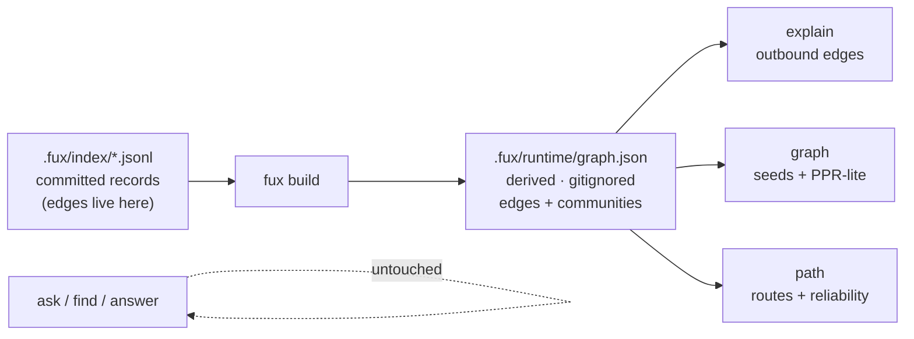
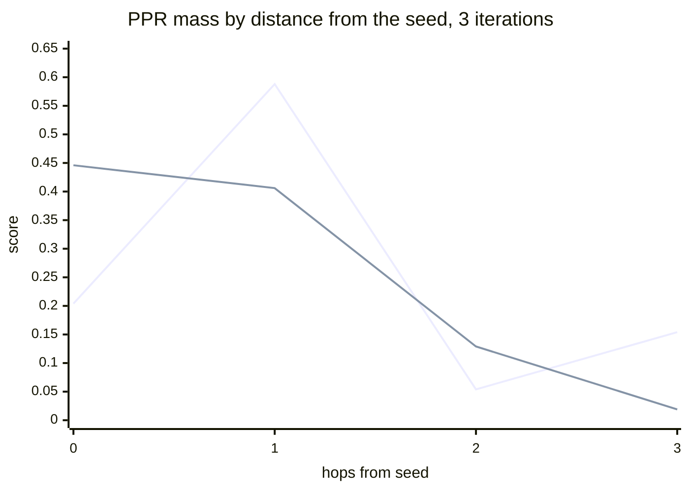

# ADR-GRAPH: the graph lane

- **Name:** `ADR-GRAPH` — cite this everywhere; never cite the number
- **Status:** accepted
- **Date:** 2026-08-20
- **Feature:** M3 — the graph lane
- **Owns:** `src/fux/graph/`
- **Laws:** L1, L2, L3, L4

---

## §1 — For humans

Fux has been extracting `ref` / `tag` / `code` edges since M1 and doing nothing
with them. This milestone makes them answerable. Three verbs land, and none of
them ranks documents by relevance — that is `ask`, and `ask` is byte-identical
before and after this change.

**The lane answers what term statistics cannot.** "Which decision superseded
this one", "what else was decided at the same time", "is this a near-duplicate
of that" — no amount of `df` and `tf` reaches those, because the answer is a
relationship the documents stated, not a word they share.

**Two things here are decisions rather than implementation.** Community
assignment is **unseeded label propagation**, because removing the randomness
is a stronger guarantee than pinning it; and communities live in a **derived**
plane rather than a committed one, because a community label is a global
property and committing it would turn a one-file commit into a corpus-wide
diff.



<details>
<summary><b>ASCII twin</b> — the same diagram, for terminals, diffs, and any reader without a Mermaid renderer</summary>

```text
  .fux/index/*.jsonl                                     +--> explain  (outbound edges)
  committed records      +-----------+   .fux/runtime/   |
  (edges live here)  --> | fux build | --> graph.json  --+--> graph    (seeds + PPR-lite)
                         +-----------+   derived,        |
                                         gitignored      +--> path     (routes + reliability)

  ask / find / answer ......... untouched, byte-identical
```

</details>

### Examples

```console
$ fux explain docs/adr-storage.md
file:docs/adr-storage.md
  ref   file:docs/runbook-rollback.md  (grade 10)
  ref   file:docs/study-capacity.md  (grade 10)
  tag   tag:decisions  (grade 10)
  tag   tag:storage  (grade 10)

  community c0 — 6 other node(s)
```

```console
$ fux path docs/adr-storage.md docs/rota-oncall.md --hops 2
0.5000  file:docs/adr-storage.md -> [ref] file:docs/runbook-rollback.md -> [ref] file:docs/rota-oncall.md
```

```console
$ fux path docs/adr-storage.md docs/unrelated.md --hops 2
No route from file:docs/adr-storage.md to file:docs/unrelated.md within 2 hop(s).
```

### Charts

The parity artefact that forced the walk to be lazy, measured on a four-node
path `a-b-c-d` seeded at `a`. **`d` is three hops away and `c` is two**, so
the archived line is not merely imprecise — it is inverted.



<details>
<summary><b>ASCII twin</b> — the same chart, for terminals, diffs, and any reader without a Mermaid renderer</summary>

```text
  score
  0.60 |        A
  0.45 |  L     L
  0.30 |
  0.15 |  A           .  .  .  .  A     <- archived: 3 hops OUTRANKS 2 hops
  0.00 +--0-----1-----2-----3----------- hops from seed
             A = archived walk   L = lazy walk

  hops:        0       1       2       3
  archived: 0.204   0.588   0.054   0.154   <- inverted at 2 vs 3
  lazy:     0.446   0.406   0.129   0.019   <- monotone

  source: computed from this module's own constants
          (DAMPING 0.85, ITERATIONS 3, LAZINESS 0.5); the assertion is
          tests/graph/test_walk.py::test_ppr_scores_decrease_monotonically_with_distance
```

</details>

---

## §2 — For agents

### Context

M1 shipped `ingest/edges.py`, which resolves three edge kinds off artifacts the
document already contains — a markdown link (`ref`), a frontmatter tag (`tag`),
a backtick-quoted path that names another ingested document (`code`) — graded
`EXTRACTED` 10 · `AMBIG` 8 · `INFERRED` 6, with dangling targets dropped. Those
edges have been committed on every record since, and **nothing read them**.

The playground's supersession, near-duplication and staleness≠wrongness gaps
are the named acceptance targets for this lane precisely because they are the
phenomena no amount of term statistics can answer. (The original named query
ids — `q005`, `q009`, `q011`, `q015` — were in a golden set later lost; the
targets are now these three phenomena, re-scoped 2026-08-20; see
[W-57](../../archive/open/W-57-graph-lane-acceptance.md).)

### Decision

**1. Three flat verbs — `explain`, `graph`, `path`.** No subcommand tree;
`fux graph path` would be the first nesting on this surface and ADR-CLI's
constraint is that there is none.

**2. `explain` reports outbound edges and the document's community.** Outbound,
not both directions: an edge means *this document said something about that
one*, and inbound would silently mix "what I cite" with "who cites me" in one
undifferentiated list.

**3. `path` is directed; `graph` and community are undirected.** They ask
different questions. A route from A to B means A pointed at B. Relatedness is
symmetric, so PPR and community assignment see every edge both ways.

**4. Tag nodes are sinks in directed traversal.** A record carries `tag:ops`
outbound; a tag carries nothing. Without this, every pair of documents sharing
a common tag is two hops apart, which makes `path` useless at exactly the scale
where it matters — a 10⁵-document corpus with a `tag:platform` on ten thousand
of them.

> **10⁵ is a deferred target, not the design point (W-65, 2026-08-22).** The
> design point moved to 10 000 documents on 2026-08-21. The sink rule is
> **unchanged**: the damage it prevents is monotone in how many documents
> share a tag, so it only gets worse with scale and is already real at 10 000 —
> a `tag:platform` on a thousand documents makes them all mutually two hops
> apart just as surely. It is also free, so nothing about it was ever gated on
> a size. This record's *plane-format* fork was the one the scale change
> actually decided, and it was ruled at 10 000 in
> [`graph-plane-format.compare.md`](../../work/compare/graph-plane-format.compare.md).

**5. Community assignment is label propagation (Raghavan, Albert & Kumara
2007), and it is unseeded because the randomness is removed rather than
pinned.** The textbook algorithm is random twice — random visit order, random
tie-break. Both are replaced: nodes are visited in `sorted(nodes)` order
(asynchronous, which also avoids the label oscillation synchronous LPA shows on
bipartite structures — and a corpus of documents-and-tags is full of them), and
ties break on the lexicographically smallest label. A fixed sweep cap replaces
any convergence test on a float.

> **A fixed seed would have been the weaker guarantee.** It makes one
> implementation reproducible; it does not survive a Python version that
> reorders a set, and it hides that the result depends on a number nobody
> chose. `tests/graph/test_community.py` asserts the *absence* of a `random`
> import by parsing the module's AST — the claim is checked, not trusted.

**6. Raw labels are canonicalised to `c0`, `c1`, … by (size descending,
smallest member id).** A raw LPA label is whichever node won, which is stable
but arbitrary, and it means adding one document can rename every community even
when the partition is unchanged. Canonicalising makes the output a function of
the partition rather than of the traversal.

**7. Communities are derived, not committed.** Edges are committed because they
are *local* — an edge belongs to the record that states it, and one file's
change touches one line. A community label is *global*: adding one document can
legally change the label of a document it has no edge to. Committing that turns
a one-file commit into a corpus-wide diff, which is the opposite of what the
committed plane is optimised for.

**8. The plane is `.fux/runtime/graph.json`, and this record owns it** rather
than a separate companion record. The single-file companions (ADR-DOCS-TABLE,
ADR-CODES-TABLE, …) exist because those files were generated under a record
that did not name them; this one is named here, by the feature that generates
and reads it.

**9. The walk is lazy, which is a deliberate correction to the port, not a
port.** See §Alternatives and the chart in §1.

**10. Reliability is the grade product decayed per hop**
(`HOP_DECAY = 0.5`), so a direct `EXTRACTED` link is exactly 1.0 and every
additional hop at least halves it. Two properties are asserted rather than
assumed: bounded by 1.0, and **strictly decreasing with distance**.

**11. Emptiness is an answer.** `path` finding no route is a fact about the
corpus, and the eval pins it as a behaviour rather than treating it as a
fallback.

### Consequences

- **`ask` is untouched, and that is asserted.** `tests_e2e/test_relational.py::test_the_graph_lane_does_not_move_ask`
  runs the differential through the CLI on the graph fixture. The graph plane
  is built by the same `fux build` as the accelerator, so a leak into the
  lexical path is a live possibility and needs a test, not a promise.
- **`edges_from_records` lifts without validating, and that is now actually
  safe (2026-08-21, W-63).** Its docstring claimed dangling edges "were
  already dropped by `ingest/edges.py`" — true only for records **re-resolved
  this run**, and a carried `url:` record is not one. A document removed from
  the corpus therefore survived here as an edge target: a node in the plane
  that no verb could explain, with a community label computed partly from it.
  Fixed in ingest, not here ([ADR-INGEST](0007_ingest.md) decision 10) —
  validating on lift would have made every graph read pay for a defect in the
  write, and would have hidden a wrong committed record rather than fixing it.
- **`fux graph`'s seed query scans by default too (2026-08-21).** The seed is
  an ordinary `run_query`, so it inherits `ask`'s path choice and takes it
  with the same flags — `--fast` to use the accelerator, `--scan` for the
  explicit reference path, mutually exclusive. Deliberately not a separate
  policy: one verb reaching for the accelerator while its sibling does not is
  the kind of divergence [ADR-ASK](0004_ask.md) decision 4 exists to prevent,
  and the seed query is the same query by any other name. **The plane itself
  is unaffected** — it is required for every graph verb regardless of which
  path produced the seeds, and `plane.load()` still refuses a stale one.
- **`fux build` now writes one more file** and `DETERMINISTIC_FILES` gains
  `graph.json`, so two builds of the same index are asserted byte-identical
  including the communities. **This makes ADR-T1-ACCELERATOR's build a
  two-lane build**; `derive/build.py` gained one call and one return value.
- **`graph.json` is written LF only, regardless of host OS (PRIORITY.md P4,
  2026-08-21).** The write used `write_text`'s platform-default newline
  translation, which would commit CRLF on a Windows build and LF everywhere
  else — the one axis this file's byte-identical assertion is actually
  checked across (two builds, two machines). Now writes with `newline="\n"`
  explicitly.
- **The archived relational eval passes on the new kernel** — 7 cases plus 4
  behavioural assertions, 11/11. Its corpus is copied into `tests_e2e/eval/`
  as a live fixture: a test that read out of `archive/` would make the archive
  a live dependency, which archive-is-not-evidence forbids.
- **The eval's edge vocabulary was adapted, and the adaptation is stated.** The
  archived engine classified a link as `references` or `cites` by the heading
  it sat under; this build emits `ref` and makes no such distinction, so two
  `expect` values changed. **Restoring the distinction would be a new edge
  kind**, which is a decision needing its own record — not something a port may
  smuggle in. Documented in `tests_e2e/eval/README-relational.md`.
- **We now owe the named acceptance measurement.** W-23 named `q005`, `q009`,
  `q011`, `q015` in `fux-playground` as this lane's targets and asked for the
  XPASS count. **That was not measured here, and at the time could not be**:
  `fux-playground` did not exist on this machine (W-56, since resolved — the
  environment was rebuilt), and its goldens, including those four query ids,
  were lost in the process. W-57 re-scoped the targets to three phenomena
  (supersession, near-duplication, staleness≠wrongness) instead of retired
  ids; that measurement is still unrun. This record does not claim the gap is
  closed, and veto condition 3 is exactly that measurement.
- **Determinism is verified on one machine, not two.** W-23 asked for
  byte-identical community assignment across two runs *and two machines*. Two
  runs is asserted and passing; two machines is carried by **W-57**. Stated
  rather than rounded up.
- **PPR has three constants and no measurement behind two of them.**
  `DAMPING = 0.85` is PageRank's published default; `ITERATIONS = 3` is the
  archived choice; `LAZINESS = 0.5` is the conventional lazy chain. Only the
  *need* for laziness is measured. They are honest defaults, not tuned values,
  and the veto condition below is what would force them to be earned.

  > **Amended 2026-08-24 ([ADR-TUNE](0038_tuning.md) built) — the constants
  > are now parameters, and the honesty above is what made them tunable rather
  > than something that had to be defended first.**
  >
  > `DAMPING`, `ITERATIONS`, `LAZINESS` and `HOP_DECAY` are keyword parameters
  > on `walk.ppr`, `walk.expand` and `walk.routes`, defaulting to the module
  > constants of the same names. **The default values do not move**, so an
  > unconfigured repo walks exactly the walk this record describes and the
  > charts in §1 still recompute.
  >
  > **`EXPAND_LIMIT` and `SEED_DEPTH` were DELETED**, not parameterised. They
  > were `graph/__init__.py` module constants with no other reader, and they
  > are now `[graph] expand_limit` and `[graph] seed_depth`. Keeping a local
  > copy of a default beside a config key is how the two drift — nothing would
  > have failed if they disagreed; the walk would simply have run at a width
  > nobody configured. **The reasoning outlived the numbers and is kept as a
  > comment where they were.**
  >
  > **Parameters rather than module reads, and that is the whole of the
  > change.** The parity artefact decision 9 corrects is a **joint** property
  > of `iterations` and `laziness` — at three iterations, an unlazy walk ranks
  > a three-hop node above a two-hop one. A caller able to set one without the
  > other could reintroduce it silently; passed together, one call site shows
  > both.
  >
  > **`--hops` stays a CLI argument and is not a tune key**, because it bounds
  > what the search *finds*; `hop_decay` only orders what it found. That is the
  > membership test one level up, applied to a boundary that could plausibly
  > have gone either way.
  >
  > **The tune is loaded once per command**, so `graph`'s seed query and its
  > walk cannot read two different files — a neighbourhood around seeds ranked
  > under weights that did not choose them is the failure that would have made
  > the saving worth nothing.
  >
  > **The three PPR constants are still unmeasured, and a knob does not measure
  > them.** What has changed is only that a consumer can vary them without
  > editing the source — evidence-gathering, not evidence. Veto condition 2
  > below is unaffected: `ITERATIONS` is still the module constant it names,
  > and it still becomes a measured value if a farther node ever outranks a
  > nearer one.
  >
  > **Veto 3's closing phrase names a constant that no longer exists** —
  > *"the lane needs a different shape, not a bigger `EXPAND_LIMIT`"*. Read
  > `[graph] expand_limit` for it; the argument is untouched and is in fact
  > sharper now, because widening the walk is a config edit rather than a
  > release, which makes it the easier wrong answer to reach for.
- **`graph.json`'s cost is now profiled, and it is the plane, not the
  algorithms.** [`2026-08-21-graph-plane-profile`](../../work/regression/2026-08-21-graph-plane-profile/report.md)
  puts **9.34 s of a 9.54 s `fux graph` at 100 000 docs (98 %) in
  `plane.load()`**; PPR-lite itself is 0.197 s and `path` sub-millisecond.
  This does not reopen decision 8 by itself — the profile is explicitly not a
  gate, no threshold was pre-registered — but it is real evidence the format
  question is worth arguing with numbers, filed as
  [`graph-plane-format.compare.md`](../../work/compare/graph-plane-format.compare.md).
  Decisions 5 and 7 (unseeded propagation; derived not committed) are
  untouched by this finding.

### Alternatives considered

- **A Leiden-class algorithm with a fixed seed.** Rejected: Leiden needs a
  resolution parameter, and a knob whose value nobody can justify is a knob
  that gets tuned until the output looks nice — not a property an index should
  have. LPA has no parameter to guess and runs in near-linear time.
- **Label propagation with a fixed random seed** (what W-23 offered as the
  option). Rejected as strictly weaker: see decision 5.
- **Committing communities into the index.** Rejected: decision 7. The diff
  cost is the argument, and it grows with corpus size.
- **Porting the archived walk verbatim.** Rejected on a measurement taken while
  porting it. The archived walk moves *all* of a node's mass each step, so on a
  bipartite-ish graph truncated at a fixed iteration count it ranks by parity:
  seeded at `a` on the path `a-b-c-d`, it scores `d` (3 hops) at 0.154 above
  `c` (2 hops) at 0.054. A `graph` verb that puts a stranger above a neighbour
  is wrong, not imprecise. **The artefact is purely from truncation** — run to
  20 iterations the archived walk orders correctly — but the truncation is not
  negotiable, because a fixed count is what makes the result deterministic. A
  lazy walk makes the chain aperiodic and costs one term.
- **Routing `path` through tag nodes.** Rejected: decision 4.
- **Inbound edges in `explain`.** Rejected: decision 2. A separate verb or flag
  can add them later; merging them now loses the distinction irreversibly.

### Reference (required)

- Raghavan, Albert & Kumara, *Near linear time algorithm to detect community
  structures in large-scale networks* (Phys. Rev. E 76, 2007) — the community
  algorithm and its near-linear bound — <https://arxiv.org/abs/0709.2938>
- Levin & Peres, *Markov Chains and Mixing Times*, §1.3 — lazy chains, and
  laziness as the standard device for removing periodicity —
  <https://pages.uoregon.edu/dlevin/MARKOV/>
- Page, Brin, Motwani & Winograd, *The PageRank Citation Ranking* (1999) — the
  0.85 damping default — <http://ilpubs.stanford.edu:8090/422/>
- The edge vocabulary and grades this lane consumes:
  [`src/fux/ingest/edges.py`](../../src/fux/ingest/edges.py) (ADR-INGEST)
- The lane itself: [`src/fux/graph/`](../../src/fux/graph/)
- The eval, its corpus and its stated adaptation:
  [`tests_e2e/eval/README-relational.md`](../../tests_e2e/eval/README-relational.md)

**`fux graph` carries the W-76 Phase 0 accelerator declaration (2026-08-23).**
`graph` seeds from a ranked query, so it pays the reference scan on a fresh
clone exactly as `ask` does and the same stderr note applies. **`explain` and
`path` deliberately do not take it**: both address a document by id rather than
by a ranked query, so the accelerator is not what makes them fast and the note
would be advice that does not apply. Same contract as every other declaration
on this surface -- stderr never stdout, ASCII only, declares never gates.

### Veto condition

**Reopen this decision if any of these becomes true:**

1. **Community assignment is not byte-identical across two machines** on the
   same committed index. That is the L3 claim, and it is the one this record
   most depends on.

   **Checked 2026-08-22 — did not fire, and this condition is now discharged.**
   `.fux/runtime/graph.json` over the `graph-acceptance` corpus hashes to
   `3ede58638eca67857fd9919e21632c8ce0964b3c6ce273de73d11daf1ca30a53` on **both**
   an x86-64 Linux cloud sandbox and Arpit's arm64 macOS machine — all 64 hex
   characters, from independent `setup.sh` runs that each generated the corpus,
   ingested and built from scratch.

   **Two different architectures is a stronger result than the condition asked
   for.** It was written to catch set-iteration order and unseeded randomness,
   which two runs on one machine cannot see; a matching hash across x86-64 and
   arm64 also rules out float-width and byte-order dependence in the label
   propagation.

   > **Output — both machines, 2026-08-22. Not fired.**

   ```console
   # x86-64 Linux, cloud sandbox
   $ ./setup.sh && shasum -a 256 .fux/runtime/graph.json
   3ede58638eca67857fd9919e21632c8ce0964b3c6ce273de73d11daf1ca30a53

   # arm64 macOS, Arpit's own machine - independent run, corpus regenerated
   $ ./setup.sh && shasum -a 256 .fux/runtime/graph.json
   ingested 66 docs (66 changed, 0 carried forward), 0 skipped, 59 shards written
   accelerator rebuilt from the committed index: 66 docs, 433 terms, 3696 postings
   3ede58638eca67857fd9919e21632c8ce0964b3c6ce273de73d11daf1ca30a53
   ```

   **Repro:** `cd fux-lab/graph-acceptance && ./setup.sh && shasum -a 256 .fux/runtime/graph.json`.
2. **A corpus exists where `fux graph` ranks a node farther from the seed above
   a nearer one.** That is the defect laziness was added to remove; its return
   means three iterations is too few for real structure, and `ITERATIONS`
   becomes a measured constant rather than an inherited one.
3. **The playground's three re-scoped acceptance phenomena** (supersession,
   near-duplication, staleness≠wrongness — the original `q005`/`q009`/`q011`/
   `q015` ids were lost with the old golden set; see
   [W-57](../../archive/open/W-57-graph-lane-acceptance.md)) **do not improve**
   once W-57 measures them. The lane's whole argument is that these are
   phenomena term statistics cannot answer; if the graph cannot answer them
   either, the lane needs a different shape, not a bigger `EXPAND_LIMIT`.

   **Measured 2026-08-22 — improved, on a second corpus, not the original
   target.** fux-playground was never regraded after 2026-08-20 and its
   2026-08-22 planned redesign may drop goldens permanently, so this was
   checked instead against a new 66-document corpus built in fux-lab
   (`graph-acceptance`, distinct fictional content from the playground's).
   24/24 goldens passed across `graph`/`path`/`explain` for all three
   phenomena — `ask` reproducibly ranks the superseded/legacy document above
   the current one on every planted pair, and `graph` surfaces the correct
   one regardless. See
   [`work/regression/2026-08-22-graph-acceptance/`](../../work/regression/2026-08-22-graph-acceptance/report.md).
   **This condition is not being treated as permanently closed** — a future
   playground regrade against the original target is still the more direct
   test and would supersede this evidence, not duplicate it.

**How to check them:**

```bash
# 1 — determinism, here and on the other machine; the bytes must match
uv run pytest -q tests/graph/test_community.py
fux build && shasum -a 256 .fux/runtime/graph.json

# 2 — monotonicity by distance
uv run pytest -q tests/graph/test_walk.py

# 3 — the re-scoped targets (W-57, not yet run; the goldens need a human —
#     see archive/open/W-57-graph-lane-acceptance.md)
```
---

## References

*Every source this record cites, gathered in one place. §2's **Reference
(required)** names the grounding; this is the complete list. An archived
document is never listed here — the body may name one, but archive is not
evidence.*

**Records** — [ADR-ASK](0004_ask.md) · [ADR-INGEST](0007_ingest.md) ·
[ADR-TUNE](0038_tuning.md)

**Code**

- [`src/fux/graph/`](../../src/fux/graph/)
- [`src/fux/ingest/edges.py`](../../src/fux/ingest/edges.py)
- [`tests_e2e/eval/README-relational.md`](../../tests_e2e/eval/README-relational.md)

**Measured evidence**

- [`work/regression/2026-08-21-graph-plane-profile/report.md`](../../work/regression/2026-08-21-graph-plane-profile/report.md)
- [`work/regression/2026-08-22-graph-acceptance/report.md`](../../work/regression/2026-08-22-graph-acceptance/report.md)

**Project docs**

- [`work/compare/graph-plane-format.compare.md`](../../work/compare/graph-plane-format.compare.md)

**Papers and specifications**

- Levin & Peres, *Markov Chains and Mixing Times*, §1.3 — lazy chains, and
  laziness as the standard device for removing periodicity
  <https://pages.uoregon.edu/dlevin/MARKOV/>
- Page, Brin, Motwani & Winograd, *The PageRank Citation Ranking* (1999) — the
  0.85 damping default
  <http://ilpubs.stanford.edu:8090/422/>
- Raghavan, Albert & Kumara, *Near linear time algorithm to detect community
  structures in large-scale networks* (Phys. Rev. E 76, 2007) — the community
  algorithm and its near-linear bound
  <https://arxiv.org/abs/0709.2938>
