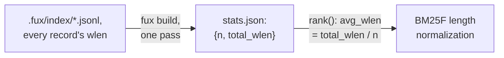

# ADR-RUNTIME-STATS — stats.json, the corpus-wide numbers BM25F needs

- **Name:** `ADR-RUNTIME-STATS` — cite this everywhere; never cite the number
- **Status:** proposed
- **Supersedes (on acceptance):** nothing — `stats.json`'s role was previously
  described only inside [ADR-T1-ACCELERATOR](0011_accelerator.md)'s diagram
  and build.py; this record pulls it out for independent reference and
  changes nothing about that decision
- **Owns (on acceptance):** no module — implemented by
  `derive/build.py::_read_committed()`, which stays owned by
  ADR-T1-ACCELERATOR
- **Laws:** L3 — see [ADR-LAWS](0001_laws.md); never restated here
- **Date:** 2026-08-19
- **Feature:** `.fux/runtime/stats.json`

---

## §1 — For humans

`stats.json` holds exactly two numbers: `n`, the document count, and
`total_wlen`, the sum of every document's word length. No single term's
postings can supply either — they are properties of the whole corpus — and
BM25F's length-normalization term needs `total_wlen / n` (the average
document length) on every scored document, every query. Computing that once
at build time turns a per-query, O(corpus) scan into an O(1) lookup.

**Diagram — Mermaid and its ASCII twin. Update both, always, together.**



<details>
<summary><b>ASCII twin</b> — the same diagram, for terminals, diffs, and any reader without a Mermaid renderer</summary>

```text
   .fux/index/*.jsonl -- every record's wlen, summed across every shard
              |
              |  fux build, one pass
              v
   stats.json: {n: document count, total_wlen: sum of every wlen}
              |
              |  rank(): avg_wlen = total_wlen / n
              v
   BM25F length normalization, applied to every scored document
```

</details>

### Examples

`.fux/runtime/stats.json` in this repo — 128 documents, average length
≈ 1320 words:

```console
$ cat .fux/runtime/stats.json
{"n":128,"total_wlen":168917}
```

---

## §2 — For agents

### Context

BM25F's length-normalization term needs `avg_wlen` for every scored document,
on every query. Neither the committed record nor any single posting carries a
corpus-wide average — it has to be aggregated across every document, and
doing that per query would scale with corpus size on the hot path.

### Decision

**1. Fields: `n` and `total_wlen`.** The two numbers `rank()`'s BM25F length
normalization reads, and nothing else — no per-field breakdown, no
percentiles.

**2. Computed once, at build time, in the same pass `build()` already makes**
over every committed shard — not recomputed per query.

**3. Lives in the derived plane, not the committed plane.** It is a pure
aggregate of information the committed index already carries (each record's
own `wlen`), so committing it separately would be redundant, derivable bytes
— exactly the category [ADR-DOTFUX](0003_fux-directory.md)'s committed/derived
split exists to keep out of git.

**4. One of `DETERMINISTIC_FILES`.** `sort_keys` JSON, byte-identical for the
same committed input.

### Consequences

- `rank()` gets `avg_wlen` as an O(1) lookup instead of an O(corpus) scan on
  every query.
- Because `n`/`total_wlen` are corpus-wide, they are recomputed whenever
  `fux build` runs — adding or removing a document correctly shifts BM25F's
  length normalization for every other document's score too. That is the
  intended BM25F behavior, not a side effect to guard against.

### Alternatives considered

- **Compute `n`/`total_wlen` at query time by scanning `docs.jsonl`.**
  Rejected: turns a build-time, once-paid O(corpus) cost into a per-query
  cost.
- **Fold `n`/`total_wlen` into `manifest.json` instead of a separate file.**
  Rejected: keeps the manifest focused on build fingerprinting and staleness,
  and this file focused on the one thing ranking actually reads — two small
  single-purpose files beat one file serving two unrelated readers.
- **Track richer per-field statistics** (e.g. separate heading-length and
  body-length totals). Rejected for now: nothing in `rank()`'s current BM25F
  implementation needs more than the single `total_wlen`/`n` pair; a real
  requirement is the trigger, not anticipation.

### Reference (required)

- Generator — [`src/fux/derive/build.py`](../../src/fux/derive/build.py)
  (`_read_committed()`, the `stats` dict, the write to `fmt.STATS_NAME`).
- The consumer — [`src/fux/query/rank.py`](../../src/fux/query/rank.py) (BM25F
  length normalization).
- The parent record — [ADR-T1-ACCELERATOR](0011_accelerator.md).
- The scorer that reads this file — [ADR-RANKING](0012_ranking.md).

### Veto condition

**Reopen this decision if** BM25F scoring needs a statistic beyond
`n`/`total_wlen` — that is [ADR-RANKING](0012_ranking.md)'s veto to trigger,
and this record's shape would need to grow alongside it.

**How to check it:**

```bash
grep -n 'stats\[' src/fux/query/rank.py
# expect: only "n" and "total_wlen" are read
```
