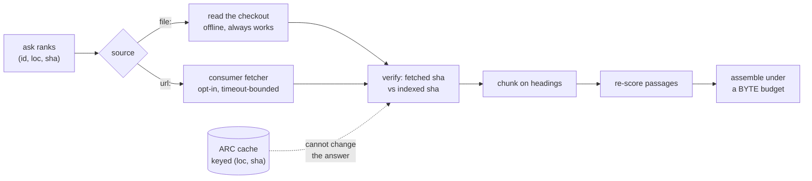

# ADR-REFER — the refer plane

## §1 — For humans

The committed index holds statistics and never content, so an answer that quotes
a document has to go and get it. That is the "refer" half of index-and-refer:
fetch the cited documents, check they still say what the index thinks they say,
cut them into passages, score those passages against the actual question, and
hand back as much as fits in the caller's context window.

**Fux still does not fetch.** The obvious way to build this is to put an HTTP
client in `src/fux/refer/`. Instead the plane reuses the contract
[ADR-FETCHER](0019_fetcher.md) already established: the consumer owns the
fetcher file, fux calls it, and core holds zero network lines. **There is one
fetch mechanism in this engine, not two.**

Two things in the design were forced by a measurement or by a file rather than
chosen: **freshness became a mode rather than an age**, and **the assembler grew
a floor**. Both are in §2.



<details>
<summary><b>ASCII twin</b> — the same diagram, for terminals, diffs, and any reader without a Mermaid renderer</summary>

```text
                        +-- file: --> read the checkout ---+
  ask ranks             |             (offline, always)    |
  (id, loc, sha) --> source                                +--> verify ---> chunk ---> re-score ---> assemble
                        |                                  |    fetched      on         passages     under a
                        +-- url: --> consumer fetcher ------+    sha vs       headings                BYTE budget
                                     (opt-in, timeout)           indexed
                                                                   ^
                                            ARC cache, keyed (loc, sha)
                                            ..... cannot change the answer
```

</details>

### Examples

Verified against the local checkout, with the default `never` policy — no
network, full function:

```python
>>> bundle = refer(root, "restore the previous release", candidates)
>>> bundle.documents[0].as_record()["freshness"]
'current'
>>> bundle.assembled.citations[0].locator
'archive/v0.26/tests_e2e/eval/relational/docs/runbook-rollback.md:L5-L8'
```

An unreachable source degrades honestly — declared, never stale-as-fresh:

```python
>>> bundle = refer(root, "telemetry", url_candidates,
...                policy=Policy(mode="always"), fetcher=broken)
>>> bundle.documents[0].verdict.label, bundle.documents[0].verdict.current
('unverified', None)
>>> bundle.assembled.citations
[]
```

---

## §2 — For agents

### Context

The plane exists because the committed record's field set contains **no
timestamp** and never will hold content. Everything below follows from those two
facts and from the fetcher contract that already ships.

### Decision

**1. Fux does not fetch; the refer plane calls the consumer's fetcher.** The
plane imports no transport — the fetcher is *injected* into `fetch_document`,
never imported by it. A second fetch mechanism inside the refer plane would make
[ADR-FETCHER](0019_fetcher.md)'s veto fire on its own successor. A further
adapter would be a third **template** under `src/fux/templates/`, not code in
core.

**2. A `url:` document is verified with the fetcher it was ingested with**,
because **a document fetched two ways is two documents**: ingest through a
browser and verify through a plain GET compares a rendered page against a shell
and reports a false staleness on every query.

**3. Normalization is shared with ingest, not reimplemented.**
`urlsrc.sanitize` is called by both. **A one-character divergence between two
copies would mark every URL document permanently stale** — a defect that
presents as a working freshness feature. Asserted by *function identity*, not by
a string match.

**4. `max_age_seconds` is refused, and the refusal is the decision.** Fux
compares sanitized shas, so **age is the wrong question**: a ten-second-old
unchanged document and a ten-day-old unchanged document are **the same object**
to fux — an age bound would decline to reuse the second while reusing the first,
and nothing about the index differs between them.

⚠ **This refusal once rested on a different ground — *the record carries no
recorded provenance* — and that ground is dead.** `mtime`, a git **commit**
timestamp, is committed on most records and `[ranking] recency_half_life_days`
already reads it. **The premise is vacated and may not be cited**, by this
record or any other. The refusal survives on decision 5 alone, which never
depended on the absence of a timestamp.

**Reopen when** a consumer needs to bound staleness by *time* for a reason
content verification cannot serve — an audit or compliance rule that demands
"checked within N hours" regardless of whether anything changed. **That is a
different question from *is the index still right***, and it is the only one
decision 5 does not already answer.

**5. Freshness is verified by content, and that is stronger than age.** A fetch
compares the fetched bytes' sha against the recorded sha. This answers *"is the
index still right"* exactly, where an age only ever answered *"is it probably
still right"* — and it reads no clock, so it costs L3 nothing.

**6. The verdict is four-state: `current` / `stale` / `unverified` / `cached`.**
`unverified` is not `stale` and is emphatically **not** `current`. The states
exist so nothing downstream can collapse *"we did not look"* into *"we looked
and it was fine"*.

**`cached` is never folded into `current`.** It is a distinct epistemic position
— *we looked recently* — and it carries its `age_seconds` so a caller can decide
for itself. It also records whether the cached bytes matched the index, because
dropping that would make the verdict a smaller claim than the truth. **Rendering
`cached` as `current` anywhere downstream is decision 4's "knob that lies"
reappearing in a new location.**

**7. `never` still reads a `file:` document.** Reading the local checkout is not
a fetch — no network, no cost, no policy question — and forbidding it would make
an audit unable to quote the repository it is auditing. **What `never` forbids
is going *out*.**

**8. The policy travels in the bundle.** A replay that silently used a different
policy is indistinguishable from a replay that reproduced.

**9. The caches are [ADR-CACHE](0034_cache.md)'s** — the ARC content cache keyed
`(loc, sha)` and the TTL fetch store, together with the rule that the wall clock
lives in that cache and nowhere else. **Named here because a reader of this
record needs to know they exist, not re-argued.** The `cached` verdict stays
decision 6's, because a verdict belongs to the plane that reports it.

**10. The answer limit is a byte budget; `k` is a secondary cap.** Bytes, never
tokens — carrying a tokenizer per model family violates L1, and **an approximate
token count is worse than an exact byte count because it is wrong in a way the
caller cannot see.** The budget bounds the whole rendered answer, so a
per-citation overhead is charged and the caller's `overhead` is deducted before
any citation is selected.

**11. The best answer is seated first, then greedy fills the rest.** Greedy
score-per-byte is *systematically* biased toward short passages — a 50-byte
passage scoring 3 is 0.060/byte, a 400-byte passage scoring 8 is 0.020/byte — so
without a floor the assembler reliably returns the cheapest answer rather than
the best one. **The floor is that the highest *absolute*-scoring passage is
selected first whenever it fits at all.**

**12. A document's first citation is exempt from the per-document cap, and so
is a single-document candidate set.** The cap exists to stop a document
*dominating*, not to stop it *appearing*, and **dominating a field of one is not
a failure mode**. A cap that blocks the first citation excludes the best answer
at small budgets for a reason the caller never asked for. **The cap binds again
the moment a second document competes.**

**13. Selection skips, it does not stop.** A passage too large to fit must not
end assembly — a smaller one further down may still fit, and stopping wastes the
caller's window. `dropped` is reported so truncation is never silent.

**14. Passage sizes are parameters fed from `[refer]`; the exemptions are not.**
`refer()` takes `per_doc_fraction`, `min_passage_bytes` and `max_passage_bytes`
beside `budget`, and `chunk()` / `assemble()` take them as parameters rather
than reading module globals. Every default is unchanged, so an unconfigured
caller gets byte-identical bundles.

**What a `[refer]` key can and cannot reach is why these qualify.** None of them
can change which documents are fetched, or what a citation's `sha` is: they move
passage boundaries and a byte budget, both strictly downstream of every fetch
and every verdict. **Decisions 1–9 are untouchable from that file**, which is
what stops a tunable from becoming a way to configure the freshness record.

⚠ **Decision 12's two exemptions are deliberately NOT tunable.** They are what
keep the cap meaning *do not dominate* rather than *do not appear* — **a knob
able to silence the best answer is a defect with a config key.**
`per_doc_fraction` moves the cap; it cannot move the floor.

**`chunk()`'s two guarantees survive any value**: the split stays deterministic
and total — every byte lands in exactly one passage, and a preamble before the
first heading is still its own passage. The one combination that would make the
split ill-defined, a floor at or above the ceiling, is **refused by the loader**
rather than absorbed here.

**15. The plane records the staleness it discovers.** A `url:` document whose
verdict is definitively `stale` is recorded into the dirty list, where a
narrowed `ingest.run(only_urls=...)` consumes it. Without this the plane
compared shas, rendered the verdict, and **threw the knowledge away** — so a URL
that had changed upstream kept its old terms, stopped ranking into the candidate
window, was never cited again, and nothing ever noticed.

**This buys recall, not correctness.** A changed document could never be
*mis-answered* — decision 6 is what stops that — it could only fail to surface.
That is the weaker good, and it is priced as one. Three restrictions, each
load-bearing:

| restriction | why |
|---|---|
| **`url:` ids only** | a `file:` change already has an event — git observes it and `post-commit` re-indexes, so recording it here would be a second write path into a flow that works |
| **only `current is False`, never `None`** | `None` is *we did not look*, and marking those dirty would churn the list on exactly the days the network is bad |
| **best-effort** | an unwritable `.fux/runtime/` must not fail an answer |

⚠ **It changes no byte of the bundle**, and a test asserts the emitted records
are identical with the list empty and non-empty.

**16. A passage populates exactly two of the five tf fields** — its own heading
and its own text. `title`, `path` and `ctx` are document-level: identical across
every passage of a document, so including them would add the same constant to
every passage's score, change no ordering, and make every vector longer.
**Leaving them zero is not an omission, it is the correct model of what a
passage is.** Rescoring builds pseudo-records with the same five-field shape and
a `flen`, so `score_record` is literally the same call on both sides.

**17. The locator is a line range, with the ordinal as the fallback.**
`path:L12-L40`, because an agent acts on a citation by opening a file at a line.
The ordinal survives as `passage.ordinal` and in the `--json` and MCP payloads,
because **it is stable across a reflow that moves every line number** — which is
exactly when a stored citation would otherwise point somewhere else silently. A
passage carrying no line range falls back to the ordinal form: **a wrong line
number is worse than an honest ordinal.**

### Consequences

- **Offline degradation is honest, and tested.** `file:` sources keep full
  function with no network; an unreachable external source yields `unverified`
  with the reason attached and **zero citations**, so nothing is invented from a
  failed fetch.
- **The ARC differential passes** — cached, cold-cached and uncached bundles are
  byte-identical. ⚠ **It caught a real defect while being written**: the
  cache-hit path originally wrote `"note": "cache hit"` into the bundle, so a
  caller diffing two runs would have seen a difference caused purely by cache
  state. **Cache instrumentation lives on the `ARC` object; the bundle records
  what was learned about the *document*.**
- **The network fence covers every module in the plane.**
  `tests/refer/test_refer_plane.py` parses each module's AST and asserts no
  `urllib`/`socket`/`http`/`ssl` import anywhere.
- **A `git:` document is never TTL-cached.** A local read is free and always
  available, so caching it would buy a staleness window in exchange for nothing.
- **`answer` passes its already-loaded tune down** —
  `query/refer_answer.py::answer_via_refer` takes an optional `tune=` rather
  than reading the file itself. A second read could pick up a different one and
  assemble an answer under sizes that did not choose it, and `--no-tune` would
  become a flag two modules each had to remember to honour.
- **The display cache is a third store and is not this plane's.** It is
  populated at **ingest** time (not query time), keyed on `sha` (not `loc`),
  holds only a title, and answers a narrower question — *what did this
  document's title say*, not *is this citation's content still current*. **A
  hashed document's title in `ask` carries no freshness verdict and is not a
  citation.** Full rationale on [ADR-RECORD](0010_index-record.md).

### Alternatives considered

- **An HTTP client in `src/fux/refer/`.** Rejected: L1, L4 and the adapter cap,
  and it duplicates a contract that already exists and already ships.
- **Age-based freshness.** Rejected on merit — decisions 4 and 5. Comparing shas
  answers the question exactly; age only approximates it.
- **Implementing an age bound against `runtime/stamp.json` mtimes.** Rejected:
  that file is excluded from byte-identity precisely because mtimes are not
  reproducible, so the same query at the same commit could answer differently on
  two machines.
- **A committed `fetched_at` on the record.** Rejected: a local, derived,
  gitignored timestamp answers *should I go out again* without making any
  committed claim.
- **A token budget.** Rejected: L1 (a tokenizer per model family), and an
  approximation the caller cannot audit.
- **Pure greedy score-per-byte, no floor.** Rejected on the arithmetic in
  decision 11, with a test that fails without the floor.
- **Truncating a passage to make it fit.** Rejected: **a truncated citation is a
  misquote with a sha attached.** Citations are whole passages or absent.
- **Putting the TTL cache inside ARC.** Rejected — [ADR-CACHE](0034_cache.md)
  decision 1. It would cost ARC's correctness proof and nothing would notice.
- **Collapsing `cached` into `current`.** Rejected under decision 6, and it is
  veto condition 4.

### Reference (required)

- The plane and its tests: [`src/fux/refer/`](../../src/fux/refer/) ·
  [`tests/refer/`](../../tests/refer/); the benches this record owns:
  [`tools/refer-bench/`](../../tools/refer-bench/) ·
  [`tools/refer-budget-sweep/`](../../tools/refer-budget-sweep/).
- The fetch contract this plane reuses rather than replaces:
  [ADR-FETCHER](0019_fetcher.md), and fux's ingest-side half at
  [`src/fux/ingest/urlsrc.py`](../../src/fux/ingest/urlsrc.py).
- The record's field set, which is why decision 4 exists:
  [ADR-RECORD](0010_index-record.md); the freshness fork it settles:
  [`work/compare/record-freshness.compare.md`](../../work/compare/record-freshness.compare.md).
- The caches: [ADR-CACHE](0034_cache.md), and the fork it settles:
  [`work/compare/cache-policy.compare.md`](../../work/compare/cache-policy.compare.md).
- Megiddo & Modha, *ARC: A Self-Tuning, Low Overhead Replacement Cache*
  (FAST '03) — the cache and its scan resistance:
  <https://www.usenix.org/legacy/events/fast03/tech/full_papers/megiddo/megiddo.pdf>

### Veto condition

**Reopen this decision if any of these becomes true:**

1. **The latency gate fails** — cold k=10 above 3 s or warm above 300 ms on the
   mock-server bench. The plane's shape, not just its constants, is then in
   question.

   **Measured and PASSED**
   ([R4-REFER](../../work/regression/2026-08-20-refer-plane-r4/VERDICT.md)):
   cold p95 **1.113 s** vs a 3 s bar, warm p95 **0.016 s** vs 300 ms, on a
   100 ms mock source. ⚠ **The plane fetches serially, so the bound is a
   statement about the source's latency at k=10, not about fux** — a source
   slower than ~295 ms breaches it. **Re-check on any change to how `refer()`
   iterates candidates.**

2. **The budget sweep is flat across budgets.** If answer-quality-per-byte does
   not move, the greedy assembler is not earning its complexity and plain top-k
   with truncation wins.

   **Measured — neither branch, exactly.** Mean |delta| was 12.55 % in the
   single-document condition (the one `fux answer` ships), so by the letter it
   is **not** flat. But **every measured delta was negative or zero** — the
   greedy assembler never once beat plain top-k, losing by up to 35.5 % at
   realistic budgets and tying only once the per-document cap stopped binding.
   **Root cause: the cap bound even with a single candidate document**, which is
   every real `fux answer` call. The score-per-byte packing itself was not
   implicated.

   **Fixed by decision 12's second exemption**, in a separate change with its
   own tests. On a real query `fux answer` assembles **6 passages / 6 991
   bytes** where it assembled **3 / 3 492** against the same 8 000-byte budget:

   ```console
   $ fux answer "what does the extracted ingest mode promise" --json   # before
   passages=3  bytes=3492

   $ fux answer "what does the extracted ingest mode promise" --json   # after
   passages=6  bytes=6991
   ```

   **The fix is scoped, not a removal**, and
   `tests/refer/test_assemble.py::test_one_document_may_use_the_whole_budget`
   fails if it is reverted. **This condition does not reopen acceptance**: the
   finding was a defect in a constant's *scope*, not in the plane's shape.

3. **`src/fux/` imports a network library anywhere.** That is decision 1 broken,
   and it is checkable in one command.

4. **Anything downstream renders a `cached` verdict as `current`.** That is the
   one collapse decision 6 exists to prevent.

5. ⚠ **A cached copy is served for a document the reader has since lost access
   to.** The TTL cache holds external bytes on local disk, so a permission
   revoked at the source is not observed until the entry expires — a window of
   at most `cache_ttl_seconds`, and unbounded for as long as an entry is
   re-served. `no_cache` exists for sources where that window is unacceptable,
   **but nothing currently detects the case**: it is a policy the operator sets
   in advance, not something the engine notices. If a regulated deployment needs
   it noticed, the TTL cache needs a revalidation path and this decision
   reopens.

**How to check them:**

```bash
# 1 — the latency bench is the check
work/regression/2026-08-20-refer-plane-r4/evidence/reproduce.sh
# cold p95 1.113 s / 3 s, warm p95 0.016 s / 300 ms

# 2 — the budget sweep
python3 tools/refer-budget-sweep/budget_sweep.py

# 3 — the fence
uv run pytest -q tests/refer/test_refer_plane.py tests/refer/test_source.py

# 4 — the four verdict labels, and that `cached` stays its own
uv run pytest -q tests/refer/test_fetchcache.py

# 5 — which sources opted out of caching
grep -rn 'no_cache' .fux/ fux.toml 2>/dev/null
```

---

## References

*Every source this record cites, gathered in one place. §2's **Reference
(required)** names the grounding; this is the complete list. An archived
document is never listed here — the body may name one, but archive is not
evidence.*

**Records** — [ADR-RECORD](0010_index-record.md) ·
[ADR-FETCHER](0019_fetcher.md) · [ADR-CACHE](0034_cache.md) ·
[ADR-TUNE](0038_tuning.md)

**Code**

- [`src/fux/ingest/urlsrc.py`](../../src/fux/ingest/urlsrc.py)
- [`src/fux/refer/`](../../src/fux/refer/)
- [`src/fux/store/displaycache.py`](../../src/fux/store/displaycache.py)
- [`tests/refer/`](../../tests/refer/)
- [`tools/refer-bench/`](../../tools/refer-bench/)
- [`tools/refer-budget-sweep/`](../../tools/refer-budget-sweep/)

**Measured evidence**

- [`work/regression/2026-08-20-refer-plane-r4/VERDICT.md`](../../work/regression/2026-08-20-refer-plane-r4/VERDICT.md)
- [`work/regression/2026-08-22-budget-sweep/report.md`](../../work/regression/2026-08-22-budget-sweep/report.md)

**Project docs**

- [`work/compare/cache-policy.compare.md`](../../work/compare/cache-policy.compare.md)
- [`work/compare/record-freshness.compare.md`](../../work/compare/record-freshness.compare.md)

**Papers and specifications**

- Megiddo & Modha, *ARC: A Self-Tuning, Low Overhead Replacement Cache* (FAST
  '03) — the cache and its scan resistance
  <https://www.usenix.org/legacy/events/fast03/tech/full_papers/megiddo/megiddo.pdf>
