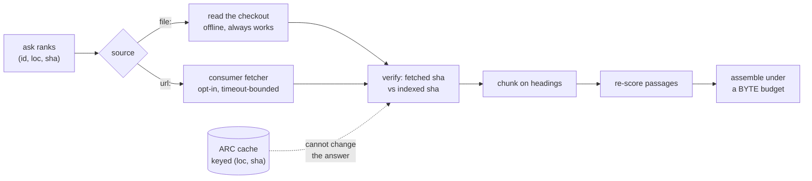

# ADR-REFER: the refer plane

- **Name:** `ADR-REFER` — cite this everywhere; never cite the number
- **Status:** accepted (2026-08-21, PRIORITY.md P6) — **R4 ran 2026-08-20 and
  PASSED** ([R4-REFER](../../work/regression/2026-08-20-refer-plane-r4/VERDICT.md))
  and the plane is now load-bearing in a shipped verb (`fux answer`, default
  path). **Accepted with an open veto condition, not a closed one**: the
  budget sweep (W-59, still unmeasured — condition 2 below) stays exactly as
  checkable as it was under `proposed`, and reopens this record the moment it
  runs flat. Arpit's call, put to him directly rather than assumed, given the
  record's own text tied acceptance to that sweep specifically
- **Date:** 2026-08-20 (accepted 2026-08-21)
- **Feature:** M4 — the refer plane (core landed, R4 bench run, wired into `answer` — the budget sweep is outstanding and reopens acceptance if it fails)
- **Owns:** `src/fux/refer/` · `tools/refer-bench/` — **except `arc.py` and
  `fetchcache.py`**, carved out to [ADR-CACHE](0034_cache.md) on 2026-08-21
  (most specific wins). The bench stays here: `tools/refer-bench/` runs R4 for
  the whole plane, and a component is owned once
- **Laws:** L1, L2, L3, L4

---

## §1 — For humans

The committed index holds statistics and never content, so an answer that
quotes a document has to go and get it. That is the "refer" half of
index-and-refer, and this is it: fetch the cited documents, check they still
say what the index thinks they say, cut them into passages, score those
passages against the actual question, and hand back as much as fits in the
caller's context window.

**Fux still does not fetch.** The obvious way to build this is to put an HTTP
client in `src/fux/refer/`. That breaks three things at once, so instead the
plane reuses the contract ADR-FETCHER already established: the consumer owns
the fetcher file, fux calls `fetch(url) -> str`, and core holds zero network
lines. There is one fetch mechanism in this engine, not two.

**Two things in the design changed while building it, both because a
measurement or a file said so** — the freshness knob became a mode, and the
assembler grew a floor. Both are in §2.



<details>
<summary><b>ASCII twin</b> — the same diagram, for terminals, diffs, and any reader without a Mermaid renderer</summary>

```text
                        +-- file: --> read the checkout ---+
  ask ranks             |             (offline, always)    |
  (id, loc, sha) --> source                                +--> verify ---> chunk ---> re-score ---> assemble
                        |                                  |    fetched      on         passages     under a
                        +-- url: --> consumer fetcher ------+    sha vs       headings                BYTE budget
                                     (opt-in, timeout)           indexed
                                                                   ^
                                            ARC cache, keyed (loc, sha)
                                            ..... cannot change the answer
```

</details>

### Examples

Verified against the local checkout, with the default `never` policy — no
network, full function:

```python
>>> bundle = refer(root, "restore the previous release", candidates)
>>> bundle.documents[0].as_record()["freshness"]
'current'
>>> bundle.assembled.citations[0].locator
'archive/v0.26/tests_e2e/eval/relational/docs/runbook-rollback.md:L5-L8'
```

> **Amended 2026-08-24 (W-76 Phase 5).** The last line read *`'runbook.md#p1'`*
> — the wrong *shape*, under a heading that promises the block was verified
> against the local checkout. `ScoredPassage.locator` is now `path:L12-L40`,
> because **an agent acts on a citation by opening a file at a line**, and a
> passage ordinal forced a second call to work out which lines those were. The
> ordinal did not die: it survives as `passage.ordinal` and in the
> `--json`/MCP payload, because it is stable across a reflow that moves every
> line number, which is exactly when a stored citation would otherwise point
> somewhere else silently. The ordinal form is still what a passage carrying
> no line range falls back to — a wrong line number is worse than an honest
> ordinal.
>
> The path grew because the value above was **re-captured for real** rather
> than re-shaped by hand: that query's top candidate on this checkout today is
> the archived rollback runbook, and the block now says what the code says.

An unreachable source degrades honestly — declared, never stale-as-fresh:

```python
>>> bundle = refer(root, "telemetry", url_candidates,
...                policy=Policy(mode="always"), fetcher=broken)
>>> bundle.documents[0].verdict.label, bundle.documents[0].verdict.current
('unverified', None)
>>> bundle.assembled.citations
[]
```

---

## §2 — For agents

### Context

M4 was specified before three things were true that are true now: the fetcher
contract exists and is shipped (ADR-FETCHER, ADR-HTTP-FETCHER, ADR-CDP-FETCHER);
`fux-lab` — where R4 was to be measured — did not exist yet (W-56, since
resolved: R4 ran there 2026-08-20); and the committed record's field set is
settled and contains no timestamp (ADR-RECORD).

Two proposals graduated here, and have since been archived with their live
successor named as this record:
[`archive/proposals/caller-set-freshness-policy.md`](../../archive/proposals/caller-set-freshness-policy.md)
and
[`archive/proposals/token-budget-retrieval.md`](../../archive/proposals/token-budget-retrieval.md).

### Decision

**1. Fux does not fetch; the refer plane calls the consumer's fetcher.** The
plane imports no transport, and `fetch(url) -> str` is *injected* into
`fetch_document`, never imported by it. A second fetch mechanism inside the
refer plane would make ADR-FETCHER's veto fire on its own successor. The
"HTTP + Confluence adapters" of the original plan therefore become: HTTP is the
already-shipped `.fux/fetchers/http.py`, and Confluence would be a third
**template** under `src/fux/templates/` — not code in core.

**2. A `url:` document is verified with the fetcher it was ingested with.**
This pays the debt ADR-URL-INGEST recorded. Decided this way because *a
document fetched two ways is two documents*: ingest through `cdp` (a browser)
and verify through `http` (a plain GET) compares a rendered page against a
shell and reports a false staleness on every query.

**3. Normalization is shared with ingest, not reimplemented.**
`urlsrc.sanitize` was promoted from `_sanitize` and is called by both. A
one-character divergence between two copies would mark every URL document
permanently stale — a defect that presents as a working freshness feature.
Asserted by function identity, not by a string match.

**4. `max_age_seconds` is NOT implemented, and refusing it is the decision.**
The proposal's shape was `{max_age_seconds, timeout_seconds}` with age measured
against "the ledger's recorded provenance". **There is no such provenance.** A
record carries `id · src · loc · sha · ver · mode · meta · title · phrases ·
terms · wlen · edges`; `ver` is a revision counter, not a time, and
`runtime/stamp.json` holds mtimes but is derived and *explicitly excluded* from
the byte-identity assertion because mtimes are not reproducible.

> **Amended 2026-08-24 (W-76 Phases 1, 2 and 7) — the field list.** This read
> *"A record carries `id · src · loc · sha · ver · mode · meta · title ·
> phrases · terms · wlen · edges`"*, and it is now false in three places at
> once: Phase 1 replaced `wlen` with the per-field `flen`, Phase 2 added the
> `mtime` and `superseded` priors, and Phase 7 added committed per-chunk
> `vectors`. Counted on this repo's 434 committed records today, the names are
> `archived · edges · flen · id · loc · meta · mode · mtime · phrases · sha ·
> src · terms · title · vectors · ver`, plus `title_h` in place of
> `title`/`phrases` on a `hashed` record — [ADR-RECORD](0010_index-record.md)
> owns the schema and carries the same list.
>
> **`ver` is still a revision counter and not a time.** That clause survives
> untouched. What does not survive is the sentence it was written to support —
> see immediately below.

> Shipping the knob anyway would mean shipping one that silently does nothing,
> and a caller passing `max_age_seconds=60` would reasonably believe they had
> bounded their staleness. **The policy is a mode — `never` | `always` — plus
> `timeout_seconds`.** Adding a recorded ingest time is a change to ADR-RECORD
> with a real determinism question attached; filed as **W-58**.

> **W-58 closed 2026-08-20 — Arpit: option D.** No ingest time is added to the
> record. Content verification (comparing the fetched sha against the recorded
> one) is the answer; `max_age_seconds` is struck from the proposal for good,
> not deferred. Decision 4 stands permanently on this ground — see
> [`work/compare/record-freshness.compare.md`](../../work/compare/record-freshness.compare.md).

> **Amended 2026-08-24 (W-76 Phase 2) — the premise died, and this record does
> not get to pretend the conclusion is unaffected.** Decision 4 rests on
> *"There is no such provenance"*, and the block above closes W-58 *"for good,
> not deferred"* and calls the decision permanent **on that ground**. The
> ground is gone. Phase 2 committed `mtime` — a **git commit timestamp**, not a
> filesystem one, chosen that way precisely so a recorded time could be
> committed without costing L3 a thing — and it is present on **414 of this
> repo's 434 records**. `[ranking] recency_half_life_days` already reads it
> and decays a score by it. That is a ledger-recorded provenance, which is
> exactly the thing decision 4 says does not exist.
>
> **What follows from that is a ruling, not an edit, and it is deliberately
> not made here.** Two readings are open. Either the refusal survives on
> decision 5's ground instead — content verification answers *"is the index
> still right"* exactly where an age only ever answered *"probably"*, and that
> argument never once depended on the absence of a timestamp — or
> `max_age_seconds` is **reopenable**, because the single stated reason the
> knob would have lied has been removed and a caller asking to bound staleness
> by age can now be given an honest answer. The two readings differ in what
> they cost, so picking one by default is the wrong move.
>
> **Until Arpit rules, treat decision 4 as standing but unargued**: the
> behaviour is unchanged and nothing downstream should assume otherwise, but
> no one may cite the "no such provenance" sentence as the reason for it.

**5. Freshness is verified by content, and that is stronger than age.** A fetch
compares the fetched bytes' sha against the recorded sha. This answers *"is the
index still right"* exactly, where an age only ever answered *"is it probably
still right"* — and it reads no clock, so it costs L3 nothing.

**5a–5c. The TTL-bounded local fetch cache moved to
[ADR-CACHE](0034_cache.md) on 2026-08-21** (decisions 6–11 there), together
with the store separation and the rule that the wall clock lives in that
cache and nowhere else. **These numbers are retired, not reused.** What
stays here: decision 4 is untouched — the committed record still carries no
ingest time — and the `cached` verdict that the TTL cache produces is
decision 6 below, because a verdict belongs to the plane that reports it.

**6. The verdict is four-state: `current` / `stale` / `unverified` /
`cached`.**
`unverified` is not `stale` and is emphatically not `current`. The states exist
so nothing downstream can collapse *"we did not look"* into *"we looked and it
was fine"*.

**`cached` was added by W-60 and is never folded into `current`.** It is a
distinct epistemic position — *we looked recently* — and it carries its
`age_seconds` so a caller can decide for itself. It also still records whether
the cached bytes matched the index, because dropping that would make the
verdict a smaller claim than the truth. Collapsing `cached` into `current`
anywhere downstream would be decision 4's "knob that lies" reappearing in a new
location, and it is refused for the same reason.

**7. `never` still reads a `file:` document.** Reading the local checkout is
not a fetch — no network, no cost, no policy question — and forbidding it would
make an audit unable to quote the repository it is auditing. What `never`
forbids is going *out*.

**8. The policy travels in the bundle.** A replay that silently used a
different policy is indistinguishable from a replay that reproduced.

**9. The content cache moved to [ADR-CACHE](0034_cache.md) on 2026-08-21**
(decisions 1–5 there): ARC keyed `(loc, sha)`, so a hit is byte-identical to
what a fetch would have returned or it is not a hit, and it therefore cannot
change an answer. **This number is retired, not reused** — a doc citing
"ADR-REFER decision 9" still resolves to the cache, which is now a record of
its own. Decided in
[`work/compare/cache-policy.compare.md`](../../work/compare/cache-policy.compare.md).

**10. The answer limit is a byte budget; `k` is a secondary cap.** Bytes, never
tokens — carrying a tokenizer per model family violates L1, and an approximate
token count is worse than an exact byte count because it is wrong in a way the
caller cannot see. **The budget bounds the whole rendered answer**, so a
per-citation overhead is charged and the caller's `overhead` is deducted before
any citation is selected.

**11. The best answer is seated first, then greedy fills the rest.** Greedy
score-per-byte is *systematically* biased toward short passages — a 50-byte
passage scoring 3 is 0.060/byte, a 400-byte passage scoring 8 is 0.020/byte —
so without a floor the assembler reliably returns the cheapest answer rather
than the best one. The floor is that the highest **absolute**-scoring passage
is selected first whenever it fits at all.

**12. A document's first citation is exempt from the per-document cap.** The
cap exists to stop a document *dominating*, not to stop it *appearing*. A cap
that blocks the first citation excludes the best answer at small budgets for a
reason the caller never asked for.

**13. Selection skips, it does not stop.** A passage too large to fit must not
end assembly — a smaller one further down may still fit, and stopping wastes
the caller's window. `dropped` is reported so truncation is never silent.

### Consequences

- **The R4 bench calls `fux update`, not `fux ingest --refresh-urls`**
  (2026-08-21, W-63). A rename of the command it shells out to, with no
  change to what it measures: `update` runs the same fetch through the same
  consumer-fetcher contract and ends in the same `ingest.run`. Recorded here
  rather than left silent because a bench that stops reproducing is
  indistinguishable from a regression, and the flag it used is hidden from
  `--help` from this release.

- **Both caches, and their consequences, are now
  [ADR-CACHE](0034_cache.md)'s** — the TTL store's disk cap (PRIORITY.md P4,
  2026-08-21) and the ARC differential that keeps a cached bundle
  byte-identical to an uncached one. They are named here because a reader of
  this record needs to know they exist, not re-argued.
- **Offline degradation is honest, and tested.** `file:` sources keep full
  function with no network; an unreachable external source yields `unverified`
  with the reason attached and **zero citations**, so nothing is invented from
  a failed fetch.
- **The ARC differential passes** — cached, cold-cached and uncached bundles
  are byte-identical. **It caught a real defect while being written**: the
  cache-hit path originally wrote `"note": "cache hit"` into the bundle, so a
  caller diffing two runs would have seen a difference caused purely by cache
  state. Cache instrumentation lives on the `ARC` object; the bundle records
  what was learned about the *document*.
- **The network fence now covers seven modules.**
  `tests/refer/test_refer_plane.py` parses each module's AST and asserts no
  `urllib`/`socket`/`http`/`ssl` import anywhere in the plane.
- **`urlsrc._sanitize` became `urlsrc.sanitize`** — a rename in ADR-FETCHER's
  territory, recorded in that record in the same change.
- **R4 PASSED, measured 2026-08-20** —
  [R4-REFER](../../work/regression/2026-08-20-refer-plane-r4/VERDICT.md): cold
  p95 1.113 s vs a 3 s bar, warm p95 0.016 s vs 300 ms, on a 100 ms mock
  source. The plane fetches **serially**, so the bound is a statement about
  the source's latency at k=10, not about fux. The record stays `proposed`
  because one gate passing is not the whole DoD.
- **Two DoD items are still outstanding and are not claimed**: the `max_age`
  sweep (moot — decision 4 removed the knob, so W-58 decides whether it ever
  exists); and the budget sweep reporting answer-quality-per-byte, which needs
  a graded corpus and therefore `fux-playground`, also W-56. Filed as
  **W-59**.
- **`Policy` grew two fields and the bundle's `policy` object grew two keys**
  (`cache_ttl_seconds`, `no_cache`). Additive, and both travel in the bundle
  under decision 8 — a replay that silently used a different cache policy would
  be as invisible as one that used a different freshness mode.
- **A `git:` document is never TTL-cached.** A local read is free and always
  available, so caching it would buy a staleness window in exchange for
  nothing.
- **No verb exposes this yet.** `ask`/`answer` are unchanged, deliberately:
  wiring a plane whose gate has not run into the default surface is how an
  unmeasured thing becomes load-bearing. The CLI surface is a separate change
  once R4 has a number.
- **P5 (2026-08-21) makes `ask`/`find`/`answer` show real titles for `hashed`
  records — this is not that wiring, and does not reopen the line above.**
  The materialise-first display cache
  ([`store/displaycache.py`](../../src/fux/store/displaycache.py)) is a third
  store, unrelated to ARC or the TTL fetch cache this record owns: it is
  populated at **ingest** time (not query time), keyed on `sha` (not `loc`),
  holds only a title (never verified against a live fetch), and answers a
  narrower question — *what did this document's title say*, not *is this
  citation's content still current*. A hashed document's title showing up in
  `ask` carries **no** freshness verdict and is not a citation; the refer
  plane's fetch-verify-cite contract is exactly as unbuilt-into-the-default-
  surface as the bullet above states. Full rationale on
  [ADR-RECORD](0010_index-record.md).

### Alternatives considered

- **An HTTP client in `src/fux/refer/`.** Rejected: L1, L4 and the adapter cap,
  and it duplicates a contract that already exists and already ships.
- **Implementing `max_age_seconds` against `runtime/stamp.json` mtimes.**
  Rejected: that file is excluded from byte-identity precisely because mtimes
  are not reproducible, so the same query at the same commit could answer
  differently on two machines. Decision 4 instead.
- **Implementing `max_age_seconds` by adding a timestamp to the record now.**
  Rejected as out of scope, not as wrong: it changes ADR-RECORD and needs a
  determinism answer (`SOURCE_DATE_EPOCH` or source mtime). W-58.
- **Age-based freshness at all.** Rejected on merit once content verification
  was available: comparing shas answers the question exactly, and age only
  approximates it.
- **A token budget.** Rejected: L1 (a tokenizer per model family), and an
  approximation the caller cannot audit.
- **Pure greedy score-per-byte, no floor.** Rejected on the arithmetic in
  decision 11, with a test that fails without the floor.
- **Truncating a passage to make it fit.** Rejected: a truncated citation is a
  misquote with a sha attached. Citations are whole passages or absent.
- **Wiring the plane into `ask` in this change.** Rejected: see the last
  consequence.
- **Putting the TTL cache inside ARC.** Rejected, and the argument moved with
  the decision — [ADR-CACHE](0034_cache.md) decision 1. It would cost ARC's
  correctness proof and nothing would notice.
- **A committed `fetched_at` on the record.** Rejected: it is exactly what
  decision 4 refused, and W-58 is where that question lives. A local, derived,
  gitignored timestamp answers "should I go out again" without making any
  committed claim.

### Reference (required)

- Megiddo & Modha, *ARC: A Self-Tuning, Low Overhead Replacement Cache*
  (FAST '03) — the cache and its scan resistance —
  <https://www.usenix.org/legacy/events/fast03/tech/full_papers/megiddo/megiddo.pdf>
- The fetch contract this plane reuses rather than replaces:
  [ADR-FETCHER](0019_fetcher.md), and fux's ingest-side half at
  [`src/fux/ingest/urlsrc.py`](../../src/fux/ingest/urlsrc.py)
- The record's field set, which is why decision 4 exists:
  [ADR-RECORD](0010_index-record.md)
- The two graduating proposals:
  [`work/proposals/caller-set-freshness-policy.md`](../../archive/proposals/caller-set-freshness-policy.md) ·
  [`work/proposals/token-budget-retrieval.md`](../../archive/proposals/token-budget-retrieval.md)
- The caches, carved out 2026-08-21: [ADR-CACHE](0034_cache.md), and the fork
  it settles:
  [`work/compare/cache-policy.compare.md`](../../work/compare/cache-policy.compare.md)
- The plane and its tests: [`src/fux/refer/`](../../src/fux/refer/) ·
  [`tests/refer/`](../../tests/refer/)

**Amended 2026-08-23 (W-76 Phase 1).** Passage rescoring builds its pseudo-
records with the **five-field** tf vector and a `flen`, matching the committed
shape so `score_record` is literally the same call on both sides.

**A passage populates exactly two of the five fields** — its own heading and
its own text. `title`, `path` and `ctx` are document-level: they are identical
across every passage of a document, so including them would add the same
constant to every passage's score, change no ordering, and make every vector
longer. Leaving them zero is not an omission, it is the correct model of what
a passage *is*.

### Veto condition

**Reopen this decision if any of these becomes true:**

1. **R4 fails** — cold k=10 above 3 s or warm above 300 ms on the mock-server
   bench. The plane's shape, not just its constants, is then in question.
2. **The budget sweep is flat across budgets.** If answer-quality-per-byte does
   not move, the greedy assembler is not earning its complexity and plain top-k
   with truncation wins. Say so rather than keeping it.

   **Measured 2026-08-22 — neither branch, exactly.** Mean |delta| was 12.55%
   (SINGLE condition, the one `fux answer` ships), so by the letter this is
   **not** flat. But every measured delta was negative or zero — the greedy
   assembler never once beat plain top-k, losing by up to 35.5% at realistic
   budgets (500–2000 bytes) and tying only once the per-document cap stops
   binding (≥4000 bytes). **Root cause identified, not this run's to fix**:
   the per-document cap (`PER_DOC_FRACTION = 0.5`) binds even with a single
   candidate document, which is every real `fux answer` call today
   (`query/refer_answer.py` passes exactly one). The score-per-byte packing
   itself is not implicated — it is byte-identical to naive truncation
   whenever the cap isn't the constraint. See
   [`work/regression/2026-08-22-budget-sweep/`](../../work/regression/2026-08-22-budget-sweep/report.md).

   **FIXED 2026-08-22 (W-72), in a separate change with its own tests.** The
   cap no longer applies when the candidate set spans one document —
   dominating a field of one is not a failure mode, and capping it only
   truncated the answer inside the caller's own budget. On a real query
   `fux answer` now assembles **6 passages / 6 991 bytes** where it assembled
   **3 / 3 492** against the same 8 000-byte budget. **The fix is scoped, not a
   removal:** the cap binds again the moment a second document competes, and
   `tests/refer/test_assemble.py` asserts both directions — the exemption is
   keyed on the candidates' own documents, never on `k` or on caller intent.

   **This condition does not reopen acceptance.** The sweep's finding was a
   defect in a constant's scope, not in the plane's shape, and the assembler's
   two corrections (deterministic ties, the best-answer floor) were never
   implicated.

   > **Output — before and after the fix, same query, same 8 000-byte budget,
   > captured 2026-08-22 on this repo's corpus.**

   ```console
   $ fux answer "what does the extracted ingest mode promise" --json   # before
   passages=3  bytes=3492

   $ fux answer "what does the extracted ingest mode promise" --json   # after
   passages=6  bytes=6991
   ```

   Exactly the wasted half, recovered. The unit test asserts the same shape
   directly — under the old cap a single document could seat only **2 of a
   possible 4** passages, which is what
   `test_one_document_may_use_the_whole_budget` fails on if the fix is reverted.
3. **A record gains a reproducible ingest time.** Then decision 4's premise is
   gone and an age-based mode becomes implementable — at which point it must be
   argued on merit against content verification, not adopted because the
   proposal originally said so. **Checked 2026-08-20 (W-58) — did not fire:**
   Arpit decided against adding one (option D); see
   [`work/compare/record-freshness.compare.md`](../../work/compare/record-freshness.compare.md).
   Reopen trigger there: R4 shows warm-path fetch cost dominating and a caller
   willing to trade staleness for latency.
4. **`src/fux/` imports a network library anywhere.** That is decision 1 broken,
   and it is checkable in one command.
5. **A cached copy is served for a document the reader has since lost access
   to.** The TTL cache holds external bytes on local disk, so a permission
   revoked at the source is not observed until the entry expires — a window of
   at most `cache_ttl_seconds`, and unbounded for as long as an entry is
   re-served. `no_cache` exists for sources where that window is unacceptable,
   **but nothing currently detects the case**: it is a policy the operator sets
   in advance, not something the engine notices. If a regulated deployment
   needs it noticed, the TTL cache needs a revalidation path and this decision
   reopens.
6. **Anything downstream renders a `cached` verdict as `current`.** That is the
   one collapse decisions 5a-6 exist to prevent.

**How to check them:**

```bash
# 1 — R4 ran 2026-08-20 and PASSED on the judged arm; the bench is the check
work/regression/2026-08-20-refer-plane-r4/evidence/reproduce.sh
# cold p95 1.113 s / 3 s, warm p95 0.016 s / 300 ms   -> R4-REFER
# The boundary the verdict names: cold latency is k x the source's latency, so
# a source slower than ~295 ms breaches the bound at k=10. Re-check on any
# change to how refer() iterates candidates.

# 2 — the budget sweep is STILL unmeasured: it needs a graded corpus, and the
#     playground's goldens are unwritten by design (W-57). W-59 stays open.

# 3 — has the record gained a temporal field?
uv run python -c "import json,pathlib; print(sorted(json.loads([l for l in pathlib.Path(sorted(pathlib.Path('.fux/index').glob('*.jsonl'))[0]).read_text().splitlines() if '\"_format\"' not in l][0])))"

# 4 — the fence
uv run pytest -q tests/refer/test_refer_plane.py tests/refer/test_source.py

# 5 — which sources opted out of caching
grep -rn 'no_cache' .fux/ fux.toml 2>/dev/null

# 6 — the four verdict labels, and that `cached` stays its own
uv run pytest -q tests/refer/test_fetchcache.py
```
---

## References

*Every source this record cites, gathered in one place. §2's **Reference
(required)** names the grounding; this is the complete list. An archived
document is never listed here — the body may name one, but archive is not
evidence.*

**Records** — [ADR-RECORD](0010_index-record.md) ·
[ADR-FETCHER](0019_fetcher.md) · [ADR-CACHE](0034_cache.md)

**Code**

- [`src/fux/ingest/urlsrc.py`](../../src/fux/ingest/urlsrc.py)
- [`src/fux/refer/`](../../src/fux/refer/)
- [`src/fux/store/displaycache.py`](../../src/fux/store/displaycache.py)
- [`tests/refer/`](../../tests/refer/)

**Measured evidence**

- [`work/regression/2026-08-20-refer-plane-r4/VERDICT.md`](../../work/regression/2026-08-20-refer-plane-r4/VERDICT.md)
- [`work/regression/2026-08-22-budget-sweep/report.md`](../../work/regression/2026-08-22-budget-sweep/report.md)

**Project docs**

- [`work/compare/cache-policy.compare.md`](../../work/compare/cache-policy.compare.md)
- [`work/compare/record-freshness.compare.md`](../../work/compare/record-freshness.compare.md)

**Papers and specifications**

- Megiddo & Modha, *ARC: A Self-Tuning, Low Overhead Replacement Cache* (FAST
  '03) — the cache and its scan resistance
  <https://www.usenix.org/legacy/events/fast03/tech/full_papers/megiddo/megiddo.pdf>
