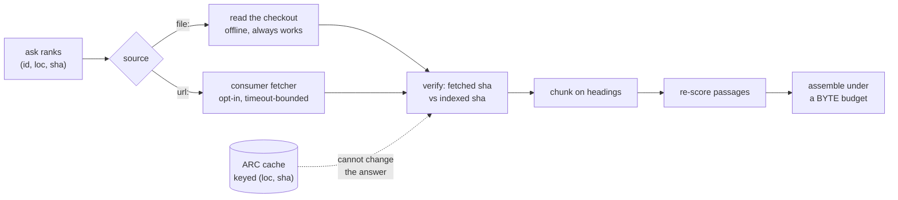

# ADR-REFER: the refer plane

- **Name:** `ADR-REFER` — cite this everywhere; never cite the number
- **Status:** proposed — **accepted requires R4**, which cannot run yet (below)
- **Date:** 2026-08-20
- **Feature:** M4 — the refer plane (core; adapters and the R4 bench outstanding)
- **Owns:** `src/fux/refer/` · `tools/refer-bench/`
- **Laws:** L1, L2, L3, L4

---

## §1 — For humans

The committed index holds statistics and never content, so an answer that
quotes a document has to go and get it. That is the "refer" half of
index-and-refer, and this is it: fetch the cited documents, check they still
say what the index thinks they say, cut them into passages, score those
passages against the actual question, and hand back as much as fits in the
caller's context window.

**Fux still does not fetch.** The obvious way to build this is to put an HTTP
client in `src/fux/refer/`. That breaks three things at once, so instead the
plane reuses the contract ADR-FETCHER already established: the consumer owns
the fetcher file, fux calls `fetch(url) -> str`, and core holds zero network
lines. There is one fetch mechanism in this engine, not two.

**Two things in the design changed while building it, both because a
measurement or a file said so** — the freshness knob became a mode, and the
assembler grew a floor. Both are in §2.



<details>
<summary><b>ASCII twin</b> — the same diagram, for terminals, diffs, and any reader without a Mermaid renderer</summary>

```text
                        +-- file: --> read the checkout ---+
  ask ranks             |             (offline, always)    |
  (id, loc, sha) --> source                                +--> verify ---> chunk ---> re-score ---> assemble
                        |                                  |    fetched      on         passages     under a
                        +-- url: --> consumer fetcher ------+    sha vs       headings                BYTE budget
                                     (opt-in, timeout)           indexed
                                                                   ^
                                            ARC cache, keyed (loc, sha)
                                            ..... cannot change the answer
```

</details>

### Examples

Verified against the local checkout, with the default `never` policy — no
network, full function:

```python
>>> bundle = refer(root, "restore the previous release", candidates)
>>> bundle.documents[0].as_record()["freshness"]
'current'
>>> bundle.assembled.citations[0].locator
'runbook.md#p1'
```

An unreachable source degrades honestly — declared, never stale-as-fresh:

```python
>>> bundle = refer(root, "telemetry", url_candidates,
...                policy=Policy(mode="always"), fetcher=broken)
>>> bundle.documents[0].verdict.label, bundle.documents[0].verdict.current
('unverified', None)
>>> bundle.assembled.citations
[]
```

---

## §2 — For agents

### Context

M4 was specified before three things were true that are true now: the fetcher
contract exists and is shipped (ADR-FETCHER, ADR-HTTP-FETCHER, ADR-CDP-FETCHER);
`fux-lab` — where R4 was to be measured — does not exist (W-56); and the
committed record's field set is settled and contains no timestamp (ADR-RECORD).

Two proposals graduate here:
`work/proposals/caller-set-freshness-policy.md` and
`work/proposals/token-budget-retrieval.md`.

### Decision

**1. Fux does not fetch; the refer plane calls the consumer's fetcher.** The
plane imports no transport, and `fetch(url) -> str` is *injected* into
`fetch_document`, never imported by it. A second fetch mechanism inside the
refer plane would make ADR-FETCHER's veto fire on its own successor. The
"HTTP + Confluence adapters" of the original plan therefore become: HTTP is the
already-shipped `.fux/fetchers/http.py`, and Confluence would be a third
**template** under `src/fux/templates/` — not code in core.

**2. A `url:` document is verified with the fetcher it was ingested with.**
This pays the debt ADR-URL-INGEST recorded. Decided this way because *a
document fetched two ways is two documents*: ingest through `cdp` (a browser)
and verify through `http` (a plain GET) compares a rendered page against a
shell and reports a false staleness on every query.

**3. Normalization is shared with ingest, not reimplemented.**
`urlsrc.sanitize` was promoted from `_sanitize` and is called by both. A
one-character divergence between two copies would mark every URL document
permanently stale — a defect that presents as a working freshness feature.
Asserted by function identity, not by a string match.

**4. `max_age_seconds` is NOT implemented, and refusing it is the decision.**
The proposal's shape was `{max_age_seconds, timeout_seconds}` with age measured
against "the ledger's recorded provenance". **There is no such provenance.** A
record carries `id · src · loc · sha · ver · mode · meta · title · phrases ·
terms · wlen · edges`; `ver` is a revision counter, not a time, and
`runtime/stamp.json` holds mtimes but is derived and *explicitly excluded* from
the byte-identity assertion because mtimes are not reproducible.

> Shipping the knob anyway would mean shipping one that silently does nothing,
> and a caller passing `max_age_seconds=60` would reasonably believe they had
> bounded their staleness. **The policy is a mode — `never` | `always` — plus
> `timeout_seconds`.** Adding a recorded ingest time is a change to ADR-RECORD
> with a real determinism question attached; filed as **W-58**.

> **W-58 closed 2026-08-20 — Arpit: option D.** No ingest time is added to the
> record. Content verification (comparing the fetched sha against the recorded
> one) is the answer; `max_age_seconds` is struck from the proposal for good,
> not deferred. Decision 4 stands permanently on this ground — see
> [`work/compare/record-freshness.compare.md`](../../work/compare/record-freshness.compare.md).

**5. Freshness is verified by content, and that is stronger than age.** A fetch
compares the fetched bytes' sha against the recorded sha. This answers *"is the
index still right"* exactly, where an age only ever answered *"is it probably
still right"* — and it reads no clock, so it costs L3 nothing.

**5a. A TTL-bounded local fetch cache** (added 2026-08-20, W-60, Arpit's
verdict **F**). External fetches may be served from
`.fux/runtime/fetch-cache/` for `cache_ttl_seconds`, default **0 — off**, and
opt-in per caller. `no_cache` refuses caching outright whatever the TTL says:
the escape hatch for access-controlled and regulated sources, where a local
copy outliving the reader's permission is exactly the risk L5 exists for.

> **This is not a latency optimisation and it did not wait for R4.** Confluence
> Cloud's REST API is rate-limited against a shared hourly point budget, and
> Atlassian's own guidance is to cache stable responses. An agent asking ten
> questions about one runbook must not fetch it ten times: at enterprise scale
> that is not slow, it is **throttled** — and a throttled fetch degrades to
> `unverified` for reasons that have nothing to do with the document.

**5b. The TTL store is NOT ARC's store, and the separation is load-bearing.**
ARC is keyed `(loc, sha)`, so a hit is byte-identical to what a fetch would
have returned **or it is not a hit** — that is the entire proof behind decision
9. A TTL entry is served *before* the sha is confirmed; that is what a TTL is.
Putting it in ARC's keyspace would serve bytes under a key that no longer
proves anything, and the proof would be gone with no test to notice.

**5c. Wall clock lives in the TTL cache and nowhere else.** It gets the same
treatment `runtime/stamp.json` already has: derived, per-machine,
non-reproducible, gitignored, and it never reaches a committed record.
**Decision 4 is untouched** — the record still carries no ingest time, and
[W-58](../../work/open/W-58-no-recorded-ingest-time.md) with
[`record-freshness.compare.md`](../../work/compare/record-freshness.compare.md)
remains a separate open question. A reader should not conflate the two: one is
a local note about *when we last looked*, the other would be a committed claim
about *when a document was ingested*.

**6. The verdict is four-state: `current` / `stale` / `unverified` /
`cached`.**
`unverified` is not `stale` and is emphatically not `current`. The states exist
so nothing downstream can collapse *"we did not look"* into *"we looked and it
was fine"*.

**`cached` was added by W-60 and is never folded into `current`.** It is a
distinct epistemic position — *we looked recently* — and it carries its
`age_seconds` so a caller can decide for itself. It also still records whether
the cached bytes matched the index, because dropping that would make the
verdict a smaller claim than the truth. Collapsing `cached` into `current`
anywhere downstream would be decision 4's "knob that lies" reappearing in a new
location, and it is refused for the same reason.

**7. `never` still reads a `file:` document.** Reading the local checkout is
not a fetch — no network, no cost, no policy question — and forbidding it would
make an audit unable to quote the repository it is auditing. What `never`
forbids is going *out*.

**8. The policy travels in the bundle.** A replay that silently used a
different policy is indistinguishable from a replay that reproduced.

**9. ARC, keyed `(loc, sha)`, and it cannot change an answer.** The content
address is *in the key*, so a hit is byte-identical to what a fetch would have
returned or it is not a hit. Recency is a monotonic ordering, never a
timestamp. Scan resistance is the reason it is not an LRU: a hook re-indexing
after a large merge is exactly the bulk scan that flushes an LRU's hot set, and
here a miss costs a network fetch. Decided in
[`work/compare/cache-policy.compare.md`](../../work/compare/cache-policy.compare.md);
built here.

**10. The answer limit is a byte budget; `k` is a secondary cap.** Bytes, never
tokens — carrying a tokenizer per model family violates L1, and an approximate
token count is worse than an exact byte count because it is wrong in a way the
caller cannot see. **The budget bounds the whole rendered answer**, so a
per-citation overhead is charged and the caller's `overhead` is deducted before
any citation is selected.

**11. The best answer is seated first, then greedy fills the rest.** Greedy
score-per-byte is *systematically* biased toward short passages — a 50-byte
passage scoring 3 is 0.060/byte, a 400-byte passage scoring 8 is 0.020/byte —
so without a floor the assembler reliably returns the cheapest answer rather
than the best one. The floor is that the highest **absolute**-scoring passage
is selected first whenever it fits at all.

**12. A document's first citation is exempt from the per-document cap.** The
cap exists to stop a document *dominating*, not to stop it *appearing*. A cap
that blocks the first citation excludes the best answer at small budgets for a
reason the caller never asked for.

**13. Selection skips, it does not stop.** A passage too large to fit must not
end assembly — a smaller one further down may still fit, and stopping wastes
the caller's window. `dropped` is reported so truncation is never silent.

### Consequences

- **Offline degradation is honest, and tested.** `file:` sources keep full
  function with no network; an unreachable external source yields `unverified`
  with the reason attached and **zero citations**, so nothing is invented from
  a failed fetch.
- **The ARC differential passes** — cached, cold-cached and uncached bundles
  are byte-identical. **It caught a real defect while being written**: the
  cache-hit path originally wrote `"note": "cache hit"` into the bundle, so a
  caller diffing two runs would have seen a difference caused purely by cache
  state. Cache instrumentation lives on the `ARC` object; the bundle records
  what was learned about the *document*.
- **The network fence now covers seven modules.**
  `tests/refer/test_refer_plane.py` parses each module's AST and asserts no
  `urllib`/`socket`/`http`/`ssl` import anywhere in the plane.
- **`urlsrc._sanitize` became `urlsrc.sanitize`** — a rename in ADR-FETCHER's
  territory, recorded in that record in the same change.
- **R4 IS NOT MEASURED, and this record is `proposed` because of it.** The
  cold/warm latency prediction runs in `fux-lab`, which does not exist
  ([W-56](../../work/open/W-56-sibling-environments-missing.md)). Under the
  plan's sequencing rule a milestone does not start while its *gating*
  prediction is unmeasured — R4 gates M5, not M4 — so building this was legal
  and **calling it accepted is not**.
- **Three DoD items are outstanding and are not claimed**: R4 itself; the
  `max_age` sweep (moot — decision 4 removed the knob, so W-58 decides whether
  it ever exists); and the budget sweep reporting answer-quality-per-byte,
  which needs a graded corpus and therefore `fux-playground`, also W-56. Filed
  as **W-59**.
- **`Policy` grew two fields and the bundle's `policy` object grew two keys**
  (`cache_ttl_seconds`, `no_cache`). Additive, and both travel in the bundle
  under decision 8 — a replay that silently used a different cache policy would
  be as invisible as one that used a different freshness mode.
- **A `git:` document is never TTL-cached.** A local read is free and always
  available, so caching it would buy a staleness window in exchange for
  nothing.
- **No verb exposes this yet.** `ask`/`answer` are unchanged, deliberately:
  wiring a plane whose gate has not run into the default surface is how an
  unmeasured thing becomes load-bearing. The CLI surface is a separate change
  once R4 has a number.

### Alternatives considered

- **An HTTP client in `src/fux/refer/`.** Rejected: L1, L4 and the adapter cap,
  and it duplicates a contract that already exists and already ships.
- **Implementing `max_age_seconds` against `runtime/stamp.json` mtimes.**
  Rejected: that file is excluded from byte-identity precisely because mtimes
  are not reproducible, so the same query at the same commit could answer
  differently on two machines. Decision 4 instead.
- **Implementing `max_age_seconds` by adding a timestamp to the record now.**
  Rejected as out of scope, not as wrong: it changes ADR-RECORD and needs a
  determinism answer (`SOURCE_DATE_EPOCH` or source mtime). W-58.
- **Age-based freshness at all.** Rejected on merit once content verification
  was available: comparing shas answers the question exactly, and age only
  approximates it.
- **A token budget.** Rejected: L1 (a tokenizer per model family), and an
  approximation the caller cannot audit.
- **Pure greedy score-per-byte, no floor.** Rejected on the arithmetic in
  decision 11, with a test that fails without the floor.
- **Truncating a passage to make it fit.** Rejected: a truncated citation is a
  misquote with a sha attached. Citations are whole passages or absent.
- **Wiring the plane into `ask` in this change.** Rejected: see the last
  consequence.
- **Putting the TTL cache inside ARC.** Rejected: decision 5b. It would cost
  ARC's correctness proof and nothing would notice.
- **A committed `fetched_at` on the record.** Rejected: it is exactly what
  decision 4 refused, and W-58 is where that question lives. A local, derived,
  gitignored timestamp answers "should I go out again" without making any
  committed claim.

### Reference (required)

- Megiddo & Modha, *ARC: A Self-Tuning, Low Overhead Replacement Cache*
  (FAST '03) — the cache and its scan resistance —
  <https://www.usenix.org/legacy/events/fast03/tech/full_papers/megiddo/megiddo.pdf>
- The fetch contract this plane reuses rather than replaces:
  [ADR-FETCHER](0019_fetcher.md), and fux's ingest-side half at
  [`src/fux/ingest/urlsrc.py`](../../src/fux/ingest/urlsrc.py)
- The record's field set, which is why decision 4 exists:
  [ADR-RECORD](0010_index-record.md)
- The two graduating proposals:
  [`work/proposals/caller-set-freshness-policy.md`](../../work/proposals/caller-set-freshness-policy.md) ·
  [`work/proposals/token-budget-retrieval.md`](../../work/proposals/token-budget-retrieval.md)
- The cache decision this builds:
  [`work/compare/cache-policy.compare.md`](../../work/compare/cache-policy.compare.md)
- The plane and its tests: [`src/fux/refer/`](../../src/fux/refer/) ·
  [`tests/refer/`](../../tests/refer/)

### Veto condition

**Reopen this decision if any of these becomes true:**

1. **R4 fails** — cold k=10 above 3 s or warm above 300 ms on the mock-server
   bench. The plane's shape, not just its constants, is then in question.
2. **The budget sweep is flat across budgets.** If answer-quality-per-byte does
   not move, the greedy assembler is not earning its complexity and plain top-k
   with truncation wins. Say so rather than keeping it.
3. **A record gains a reproducible ingest time.** Then decision 4's premise is
   gone and an age-based mode becomes implementable — at which point it must be
   argued on merit against content verification, not adopted because the
   proposal originally said so. **Checked 2026-08-20 (W-58) — did not fire:**
   Arpit decided against adding one (option D); see
   [`work/compare/record-freshness.compare.md`](../../work/compare/record-freshness.compare.md).
   Reopen trigger there: R4 shows warm-path fetch cost dominating and a caller
   willing to trade staleness for latency.
4. **`src/fux/` imports a network library anywhere.** That is decision 1 broken,
   and it is checkable in one command.
5. **A cached copy is served for a document the reader has since lost access
   to.** The TTL cache holds external bytes on local disk, so a permission
   revoked at the source is not observed until the entry expires — a window of
   at most `cache_ttl_seconds`, and unbounded for as long as an entry is
   re-served. `no_cache` exists for sources where that window is unacceptable,
   **but nothing currently detects the case**: it is a policy the operator sets
   in advance, not something the engine notices. If a regulated deployment
   needs it noticed, the TTL cache needs a revalidation path and this decision
   reopens.
6. **Anything downstream renders a `cached` verdict as `current`.** That is the
   one collapse decisions 5a-6 exist to prevent.

**How to check them:**

```bash
# 1, 2 — the bench; needs fux-lab, which does not exist yet (W-56)
#        see work/open/W-59-refer-plane-measurement.md

# 3 — has the record gained a temporal field?
uv run python -c "import json,pathlib; print(sorted(json.loads([l for l in pathlib.Path(sorted(pathlib.Path('.fux/index').glob('*.jsonl'))[0]).read_text().splitlines() if '\"_format\"' not in l][0])))"

# 4 — the fence
uv run pytest -q tests/refer/test_refer_plane.py tests/refer/test_source.py

# 5 — which sources opted out of caching
grep -rn 'no_cache' .fux/ fux.toml 2>/dev/null

# 6 — the four verdict labels, and that `cached` stays its own
uv run pytest -q tests/refer/test_fetchcache.py
```
