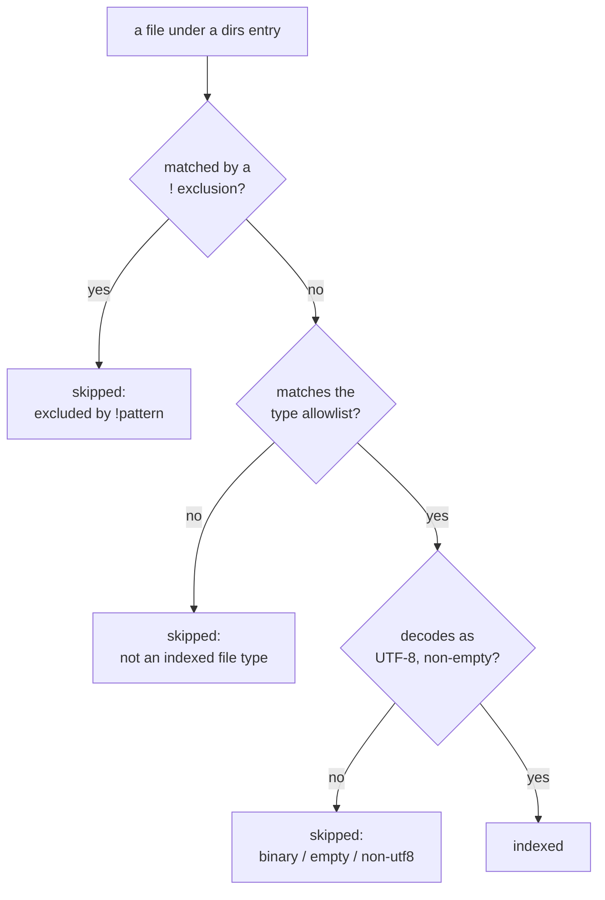

# ADR-TYPES: which files are documents

- **Name:** `ADR-TYPES` — cite this everywhere; never cite the number
- **Status:** accepted — verdict **G**, decided by Arpit 2026-08-20
- **Date:** 2026-08-20
- **Feature:** the file-type allowlist and `.fux/sources/types`
- **Owns:** *(no new component)* — the walker is
  [ADR-INGEST](0007_ingest.md)'s, the grammar is
  [ADR-URL-LIST](0018_url-list.md)'s
- **Amends:** [ADR-INGEST](0007_ingest.md) · [ADR-DIR-LIST](0022_dir-list.md)
- **Laws:** L1, L3

---

## §1 — For humans

Until now fux indexed **anything it could decode as UTF-8**. There was no third
condition after "is it in a configured directory" and "does it decode" — so a
`results.json`, a `fixture.sh` and a `.svg` were all documents.

On this repo that was **21 of 150 documents (14 %), carrying 15 % of the
tokens**, and it was visible in rankings: a raw JSON blob with no prose in it
took second place on a plain query. At scale — a 10⁵–10⁶ document
corpus across thousands of repos, **a deferred target since 2026-08-21 rather
than the design point** (W-65, 2026-08-22) — it means indexing lockfiles,
generated OpenAPI specs and vendored fixtures. The measured 14 % above is on
*this* repo at the current design point, so the decision never needed the
larger number; it is the same waste, one corpus at a time.

**A prose allowlist is compiled in, and a consumer can replace it** by
committing `.fux/sources/types`. Absent means the default applies — never
"index everything", which was the defect, and never "index nothing", which
looks like a broken engine.



<details>
<summary><b>ASCII twin</b> — the same diagram, for terminals, diffs, and any reader without a Mermaid renderer</summary>

```text
  a file under a dirs entry
        |
        v
  matched by a ! exclusion? --yes--> skipped: excluded by !pattern
        | no
        v
  matches the type allowlist? --no--> skipped: not an indexed file type
        | yes
        v
  decodes as UTF-8, non-empty? --no--> skipped: binary / empty / non-utf8
        | yes
        v
     INDEXED
```

</details>

### Examples

The default, with no types file present:

```console
$ fux ingest
ingested 3 docs (3 changed), 4 skipped, 3 shards written
  skip docs/data.json: not an indexed file type
  skip docs/run.sh: not an indexed file type
```

Replacing it — the file wins entirely, and `!` subtracts:

```console
$ cat .fux/sources/types
*.md
!*.gen.md

$ fux ingest --list-skipped
docs/data.json: not an indexed file type
docs/run.sh: not an indexed file type
docs/thing.gen.md: not an indexed file type
```

An empty allowlist is refused rather than silently emptying the index:

```console
$ printf '# nothing\n' > .fux/sources/types && fux ingest
error: .fux/sources/types: lists no file types, so nothing would be indexed.
Delete the file to take the built-in default (*.md, *.markdown, *.txt, *.rst,
*.adoc, *.org), or add at least one pattern
```

---

## §2 — For agents

### Context

`gitdir.py::_candidate_paths` skipped dot-prefixed paths and `_skip_reason`
dropped empty/binary/non-UTF8 content. **There was no third condition, and no
record decided that there should not be** — the absence was an omission rather
than a decision.

Measured on this repo's committed index, 2026-08-20:

| extension | docs | share | tokens | share |
|---|---|---|---|---|
| `.md` | 129 | 86.0 % | 180 144 | 85.0 % |
| `.json` | 9 | 6.0 % | **24 209** | **11.4 %** |
| `.svg` | 6 | 4.0 % | 4 743 | 2.2 % |
| `.sh` | 3 | 2.0 % | 2 088 | 1.0 % |
| `.py` | 2 | 1.3 % | 362 | 0.2 % |
| `.mermaid` | 1 | 0.7 % | 346 | 0.2 % |

`.json` alone carries 11.4 % of the tokens, because a machine-written evidence
file is long and repetitive — exactly the shape that distorts `df` for the
terms real documents are trying to be found by.

### Decision

**1. A prose allowlist is compiled in:** `*.md`, `*.markdown`, `*.txt`,
`*.rst`, `*.adoc`, `*.org`. **Allowlist, not denylist** — a denylist is never
finished, and the next generated format nobody has heard of arrives indexed.

**2. `.fux/sources/types` replaces the default when it exists.** It does not
extend it. One glob per line, `!` subtracts, same grammar as `dirs` and `urls`
and the same parser.

**3. Absent means the default, not "everything" and not "nothing".**
"Everything" is the defect. "Nothing" — the file-only shape — makes the 86 %
case do work for the 14 % case, and a missing or empty file that empties the
index reads as a broken engine rather than a missing config. A types file with
no positive pattern is therefore a **loud error**.

**4. No extensionless files.** Those are `LICENSE`, `Makefile` and
`Dockerfile` far more often than they are documents.

**5. `.mermaid` is excluded, and the call is stated rather than made
silently.** It is diagram source, not prose — and the ASCII twin every record
carries means the diagram's content is already indexed as markdown.

**6. A pattern with no `/` matches the file name anywhere**; one with a `/` is
anchored at the repo root. That is what makes `*.md` mean "every markdown
file" rather than "a markdown file at the root".

**7. The three conditions are a conjunction, deliberately not a priority
order.** A file is indexed **iff** it is under an included `dirs` entry **and**
no `!` exclusion matches it **and** it matches the type allowlist. No rule
overrides another, so there is no order to remember.

**8. Every rejection is reported with its reason.** `not an indexed file type`,
and for exclusions the pattern that did it. A filter nobody can see is the
failure this item was opened about.

**9. This applies to the git-dir walker only.** A URL record is whatever its
fetcher returned as markdown ([ADR-FETCHER](0019_fetcher.md)) — there is no
extension to filter on.

**10. `fux setup` writes the file with the default spelled out, commented.** A
consumer should be able to see what fux considers a document without reading
its source.

### Consequences

- **This is a breaking change for any existing index, including this repo's.**
  21 records disappear on the next ingest and `df` moves for every surviving
  document. **It is therefore also a ranking change**, and this record does
  **not** claim it is an improvement: nothing has been measured.
  [W-52](../../work/open/W-52-df-over-the-union.md)'s pre-registration
  discipline applies, and the two `df` changes should be measured in one run.
  **This repo's committed index was deliberately not re-ingested** in the
  change that landed the mechanism, so the corpus change is a separate,
  measured step rather than a side effect.
- **It removes 14 of W-45's 16 motivating files, but not all of them** — an
  `evidence/report.md` is still prose in a place you do not want indexed. Both
  mechanisms are needed; this one is larger and simpler.
- **The trio under `.fux/sources/` is complete**: `dirs` says *where*, `types`
  says *what*, `urls` says *what else*.
- **A `.txt` or `.org` corpus now works with no configuration**, which is the
  half of the argument that a compiled-in-only allowlist could not deliver.

### Alternatives considered

Full matrix in
[`work/compare/file-type-filter.compare.md`](../../work/compare/file-type-filter.compare.md);
the short version:

- **A — a types file with no built-in default.** Rejected: every consumer
  writes the same four lines before fux indexes anything, and a missing or
  empty file silently produces an empty index.
- **B — a compiled-in allowlist with no override.** Rejected: a team whose
  runbooks are `.adoc` waits for a fux release to index their own documents.
  For a `$0` offline tool that is a hard stop.
- **C — a `types=` attribute per `dirs` line.** Rejected as more expressive
  than the problem, and it repeats the same globs on every line — but **not
  excluded forever**; it is exactly the reopen trigger below.
- **D — a `[sources] types` TOML array.** Rejected: the shape
  [ADR-DIR-LIST](0022_dir-list.md) had just moved away from.
- **E — named type sets, ripgrep-style.** Rejected: ripgrep needs names
  because a human types `-tweb` fifty times a day; fux reads a committed file
  once per ingest. The indirection buys nothing and costs a second grammar.
- **F — content sniffing.** **Disqualified, not merely rejected.** Deciding
  whether bytes "read as prose" is a classifier, it misfires silently, and it
  cannot be reviewed — there is no diff for a judgment made at ingest. This
  repo has already ruled that a heuristic must not decide what a document
  *means* ([ADR-HTTP-FETCHER](0021_http-fetcher.md) decision 3); the same
  argument decides what a document *is*.

### Reference (required)

- **Sphinx `source_suffix`** — allowlist by extension; an unlisted suffix is
  simply not a source —
  <https://www.sphinx-doc.org/en/master/usage/configuration.html>
- **GitHub Linguist** — a default heuristic most repos never touch, with
  declarative committed overrides —
  <https://github.com/github-linguist/linguist/blob/main/docs/overrides.md>
- **ripgrep's type system** — names at the point of use, globs at the point of
  definition; the reason option E was considered and dropped —
  <https://github.com/BurntSushi/ripgrep/blob/master/GUIDE.md>
- The verdict and its matrix:
  [`work/compare/file-type-filter.compare.md`](../../work/compare/file-type-filter.compare.md)
- The code: [`src/fux/ingest/gitdir.py`](../../src/fux/ingest/gitdir.py)
  (`DEFAULT_TYPES`, `read_types`, `walk_sources`) and the shared grammar in
  [`src/fux/ingest/sourcelist.py`](../../src/fux/ingest/sourcelist.py)
  (`TYPES`, `glob_match`)

### Veto condition

**Reopen this decision if any of these becomes true:**

1. **A consumer needs different types for different roots** — `docs/` is
   prose, `runbooks/` is `.adoc`, `vendor/` is nothing. That is option **C**,
   and the migration is additive: a `types=` attribute on a `dirs` line would
   override the global file for that root.
2. **A consumer's corpus is majority non-`.md` prose and the built-in default
   is wrong more often than right.** That is the one claim decision 1 rests on,
   and it is measured on exactly one repo.
3. **A measured run shows the type filter made ranking worse.** It has not been
   measured at all, and this record says so rather than assuming the obvious
   direction.

**How to check them:**

```bash
# 1 — does any consumer's dirs file want per-root types?
grep -rn 'types=' .fux/sources/dirs

# 2 — what fraction of a corpus the default admits
fux ingest --list-skipped | grep -c 'not an indexed file type'

# 3 — unmeasured; it rides with W-52's pre-registration
```
