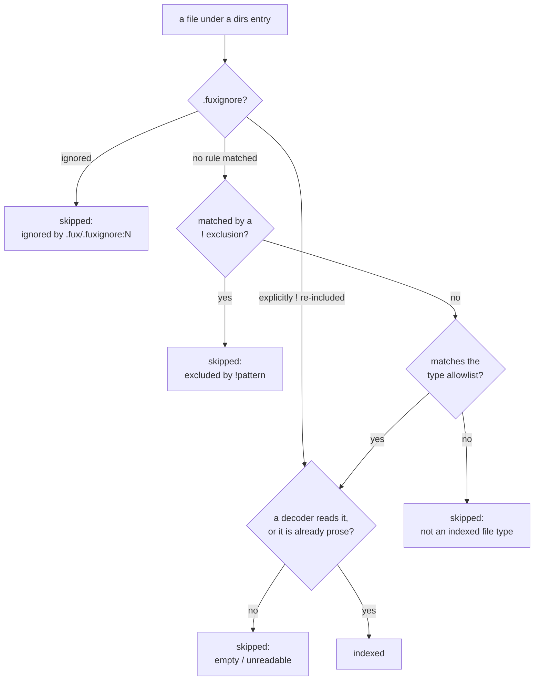

# ADR-TYPES — which files are documents

## §1 — For humans

Fux once indexed **anything it could decode as UTF-8**. There was no third
condition after *is it in a configured directory* and *does it decode* — so a
`results.json`, a `fixture.sh` and a `.svg` were all documents.

On this repo that was **21 of 150 documents (14 %), carrying 15 % of the
tokens**, and it was visible in rankings: a raw JSON blob with no prose in it
took second place on a plain query. Across a corporate estate it means indexing
lockfiles, generated OpenAPI specs and vendored fixtures — the same waste, one
corpus at a time.

**An allowlist is compiled in, and a consumer can replace it** by committing
`.fux/sources/types`. Absent means the default applies — never *index
everything*, which was the defect, and never *index nothing*, which looks like
a broken engine.



<details>
<summary><b>ASCII twin</b> — the same diagram, for terminals, diffs, and any reader without a Mermaid renderer</summary>

```text
  a file under a dirs entry
        |
        v
  .fuxignore says? --ignored--------> skipped: ignored by .fux/.fuxignore:N
        |            --explicitly ! re-included--> straight to the decoder check
        | no rule matched
        v
  matched by a ! exclusion? --yes--> skipped: excluded by !pattern
        | no
        v
  matches the type allowlist? --no--> skipped: not an indexed file type
        | yes
        v
  a decoder reads it, or already prose? --no--> skipped: empty / unreadable
        | yes
        v
     INDEXED

  ONE file on top: .fux/.fuxignore, which decides in both directions.
  BELOW it, still a conjunction. No rule in the trio beats another.
```

</details>

### Examples

Replacing the default — the file wins entirely, and `!` subtracts:

```console
$ cat .fux/sources/types
*.md
!*.gen.md

$ fux ingest --list-skipped
docs/data.json: not an indexed file type
docs/run.sh: not an indexed file type
docs/thing.gen.md: not an indexed file type
```

An empty allowlist is refused rather than silently emptying the index:

```console
$ printf '# nothing\n' > .fux/sources/types && fux ingest
error: .fux/sources/types: lists no file types, so nothing would be indexed.
Delete the file to take the built-in default (…), or add at least one pattern
```

---

## §2 — For agents

### Context

The walker skipped dot-prefixed paths and dropped empty/binary/non-UTF-8
content. **There was no third condition, and no record decided that there should
not be** — the absence was an omission rather than a decision.

Measured on this repo's committed index at the time:

| extension | docs | share | tokens | share |
|---|---|---|---|---|
| `.md` | 129 | 86.0 % | 180 144 | 85.0 % |
| `.json` | 9 | 6.0 % | **24 209** | **11.4 %** |
| `.svg` | 6 | 4.0 % | 4 743 | 2.2 % |
| `.sh` | 3 | 2.0 % | 2 088 | 1.0 % |
| `.py` | 2 | 1.3 % | 362 | 0.2 % |
| `.mermaid` | 1 | 0.7 % | 346 | 0.2 % |

`.json` alone carried 11.4 % of the tokens, because a machine-written evidence
file is long and repetitive — exactly the shape that distorts `df` for the terms
real documents are trying to be found by.

### Decision

**1. The built-in allowlist is prose PLUS every format a built-in decoder
reads.** `_PROSE_TYPES` is the six formats that need no decoder — `*.md`,
`*.markdown`, `*.txt`, `*.rst`, `*.adoc`, `*.org` — and `_default_types()`
unions them with one glob per built-in decoder extension.

**Allowlist, not denylist** — a denylist is never finished, and the next
generated format nobody has heard of arrives indexed.

⚠ **The measurement above stands and was not overturned.** What changed is that
those tokens were **raw bytes** — the file *was* the body, UUIDs and base64
included. Every admitted format now passes through a decoder
([ADR-DECODE](0042_decode.md)) that emits keys as headings and drops ids,
hashes, timestamps and bare numbers. **A different object than the one that was
measured.**

⚠ **A ruling could widen this because the default's *contents* were never a
measurement** — the compare doc's own verdict block calls them *"a defaults
judgment rather than a measurement"*. **The pre-registration rule governs frozen
thresholds, and this was not one.**

**1a. The default is derived from BUILT-IN decoders only, never the live
registry.** A default that grew when a consumer dropped a `logdoc.py` into
`.fux/decoders/` would mean **adding a decoder silently starts indexing a new
file type**. What counts as a document stays a committed line a human wrote.
Pinned by `test_the_default_never_grows_from_a_consumer_decoder`.

**2. `.fux/sources/types` replaces the default when it exists.** It does not
extend it. One glob per line, `!` subtracts, same grammar as `dirs` and `urls`
and the same parser.

**2a. `.fux/.fuxignore` is where exclusions belong; a `!` line here is the
deprecated spelling.** It still works and is still parsed — nothing that
already runs is broken — but [ADR-FUXIGNORE](0048_fuxignore.md) decision 5
makes `.fuxignore` the home, and `fux ingest` warns when the same pattern is
written in both places, naming this file as the line to delete.

**3. Absent means the default, not "everything" and not "nothing".**
*Everything* is the defect. *Nothing* makes the 86 % case do work for the 14 %
case, and a missing or empty file that empties the index reads as a broken
engine rather than a missing config. **A types file with no positive pattern is
a loud error.**

**4. No extensionless files.** Those are `LICENSE`, `Makefile` and `Dockerfile`
far more often than they are documents.

**5. Source code, shell scripts and `.mermaid` stay out, and the calls are
stated rather than made silently.** They have no decoder, and machine data is
not a document. `.mermaid` is diagram source — and the ASCII twin every record
carries means the diagram's content is already indexed as markdown.

⚠ **SVG's exclusion here is REVERSED, and images join it, 2026-08-29
(Arpit).** `svgdoc`, `imagedoc` and `jsonldoc` shipped as built-ins the same
day, and decision 1 applies to them automatically: `.svg`, `.png`, `.jpg`,
`.jpeg`, `.gif` and `.jsonl` now rejoin `DEFAULT_TYPES`. This is the same
move `.json` already made on 2026-08-26 (`jsondoc.py`'s docstring) — **a
different object than the one this record measured**, not a retraction of
the measurement. `svgdoc` reads `<title>`/`<desc>`/`<text>`, never
path/shape geometry; `imagedoc` reads embedded text metadata (PNG
`tEXt`/`zTXt`/`iTXt`, JPEG EXIF IFD0 ASCII tags + `COM`, GIF comment
extensions), never pixels. What is admitted is the words a human put there,
not the machine data this decision was written to keep out — a
geometry-only SVG or a pure-pixel image decodes to `None` and is **not
indexed at all**, a stronger filter than the raw-bytes case this record's
measurement was made against. `.jsonl` was never named by this decision; it
is the line-delimited sibling of `.json`. Source code, shell scripts and
`.mermaid` are unaffected — they still have no decoder.

**6. A pattern with no `/` matches the file name anywhere**; one with a `/` is
anchored at the repo root. That is what makes `*.md` mean *every markdown file*
rather than *a markdown file at the root*.

**7. Below `.fuxignore`, the three conditions are a conjunction, deliberately
not a priority order.** A file `.fux/.fuxignore` says nothing about is indexed
**iff** it is under an included `dirs` entry **and** no `!` exclusion matches it
**and** it matches the type allowlist. **No rule inside that trio overrides
another, so there is no order to remember among them.**

⚠ **There is exactly one thing above the trio, and it decides in both
directions** ([ADR-FUXIGNORE](0048_fuxignore.md) decision 4). A path
`.fux/.fuxignore` **ignores** is skipped whatever this allowlist says; a path it
**explicitly re-includes** with a `!` line is indexed whatever this allowlist
says. **`!*.py` therefore indexes Python as raw bytes** — the exact shape this
record was opened about. It costs one explicit line a human wrote, in one
committed file, and `fux ingest --list-skipped` shows the result.

**This sentence used to read "the three conditions are a conjunction,
deliberately not a priority order", full stop**, and decision 3a of
[ADR-DIR-LIST](0022_dir-list.md) still leans on that reading for `fux add`.
**It still holds for `fux add`, and it no longer holds for `.fuxignore`** —
a CLI verb may not outrank the allowlist, and a committed line in the one file
named after exclusion may. The difference is that the second is visible in a
file you can read; making an `add` win would index a document *for a reason
nobody could see in any list*, which is the argument that decided 3a and is
untouched.

**8. Every rejection is reported with its reason** — `not an indexed file type`,
for a `!` exclusion the pattern that did it, and for `.fuxignore` the file, the
line number and the pattern (`ignored by .fux/.fuxignore:12 \`*.log\``).
**A filter nobody can see is the failure this record was opened about**, and it
is why the one file that now outranks this allowlist has to say which of its
lines did it.

**9. This applies to the git-dir walker only.** A URL record's type comes from
the `Content-Type` its fetcher declared ([ADR-FETCHER](0019_fetcher.md)
decision 5a) — there is no extension to filter on.

**10. `fux setup` writes the file with the default spelled out as LIVE lines.**
A consumer should be able to see what fux considers a document without reading
its source.

⚠ **Amended 2026-08-27. This decision read "spelled out, *commented*", and that
word made the record contradict itself.** A file of nothing but comments has no
active pattern; decision 2 makes a present file replace the default entirely, so
`read_types` raised `lists no file types, so nothing would be indexed` — **`fux
setup` followed by `fux ingest` failed on every fresh repo**, which is the
out-of-the-box path, not an edge case. Nothing caught it because no test
composed the two verbs; `tests/test_setup.py` and `tests/ingest/test_gitdir.py`
between them did not contain the word `types`.

The globs are now written as live lines, **generated from `DEFAULT_TYPES` at the
moment setup runs rather than transcribed**, so the file cannot disagree with the
engine that wrote it and cannot go stale in the source.

⚠ **The list freezes at setup.** Setup is write-if-missing, so a built-in decoder
added after a repo ran setup widens `DEFAULT_TYPES` and does **not** touch that
repo's file. That is a real behaviour change and it is stated rather than
buried: it is decision 1a's rule applied to fux's own decoders, and for any repo
that has run setup it retires the ⚠ consequence below about the default moving
whenever a built-in decoder is added. A repo with **no** types file still tracks
`DEFAULT_TYPES` and still sees that movement.

### Consequences

- ⚠ **Narrowing what counts as a document is a ranking change, and this record
  does not claim it is an improvement.** Records disappear on the next ingest
  and `df` moves for every survivor. **Nothing has been measured.** This repo's
  committed index was deliberately *not* re-ingested in the change that landed
  the mechanism, so the corpus change is a separate, measured step rather than a
  side effect.
- **It does not replace exclusion.** An `evidence/report.md` is still prose in a
  place you do not want indexed. Both are needed; this one is larger and
  simpler — and exclusion now lives in
  [`.fux/.fuxignore`](0048_fuxignore.md) rather than in `!` lines here.
- ⚠ **The allowlist is no longer the last word.** One explicit `!` line in
  `.fux/.fuxignore` admits a format with no decoder, as raw bytes. That is the
  cost ADR-FUXIGNORE decision 4 pays for the file meaning what its name says,
  and **nothing has been measured about how often anyone reaches for it.**
- **The trio under `.fux/sources/` is complete**: `dirs` says *where*, `types`
  says *what*, `urls` says *what else*.
- **A `.txt` or `.org` corpus works with no configuration**, which is the half
  of the argument a compiled-in-only allowlist could not deliver.
- ⚠ **The default now moves whenever a built-in decoder is added.** That is
  decision 1 working as intended and it is a real coupling: adding
  `decode/logdoc.py` widens what every consumer with no types file indexes.
  Decision 1a is what keeps a *consumer's* decoder from doing the same.

### Alternatives considered

Full matrix in
[`work/compare/file-type-filter.compare.md`](../../work/compare/file-type-filter.compare.md);
the short version:

- **A types file with no built-in default.** Rejected: every consumer writes the
  same four lines before fux indexes anything, and a missing or empty file
  silently produces an empty index.
- **A compiled-in allowlist with no override.** Rejected: a team whose runbooks
  are `.adoc` waits for a fux release to index their own documents. For a `$0`
  offline tool that is a hard stop.
- **A `types=` attribute per `dirs` line.** Rejected as more expressive than the
  problem, and it repeats the same globs on every line — but **not excluded
  forever**; it is exactly the reopen trigger below.
- **A `[sources] types` TOML array.** Rejected: the shape
  [ADR-DIR-LIST](0022_dir-list.md) had just moved away from.
- **Named type sets, ripgrep-style.** Rejected: ripgrep needs names because a
  human types `-tweb` fifty times a day; fux reads a committed file once per
  ingest. The indirection buys nothing and costs a second grammar.
- **Content sniffing.** ⚠ **Disqualified, not merely rejected.** Deciding
  whether bytes "read as prose" is a classifier, it misfires silently, and **it
  cannot be reviewed — there is no diff for a judgment made at ingest.** The
  same argument that decides what a document *means*
  ([ADR-HTTP-FETCHER](0021_http-fetcher.md) decision 3) decides what a document
  *is*.

### Reference (required)

- The code: [`src/fux/ingest/gitdir.py`](../../src/fux/ingest/gitdir.py)
  (`_PROSE_TYPES`, `_default_types`, `DEFAULT_TYPES`, `read_types`,
  `walk_sources`) and the shared grammar in
  [`src/fux/ingest/sourcelist.py`](../../src/fux/ingest/sourcelist.py)
  (`TYPES`, `glob_match`); the decoder registry the default unions with —
  [ADR-DECODE](0042_decode.md).
- The verdict and its matrix:
  [`work/compare/file-type-filter.compare.md`](../../work/compare/file-type-filter.compare.md)
- **Sphinx `source_suffix`** — allowlist by extension; an unlisted suffix is
  simply not a source —
  <https://www.sphinx-doc.org/en/master/usage/configuration.html>
- **GitHub Linguist** — a default heuristic most repos never touch, with
  declarative committed overrides —
  <https://github.com/github-linguist/linguist/blob/main/docs/overrides.md>
- **ripgrep's type system** — names at the point of use, globs at the point of
  definition; the reason named type sets were considered and dropped —
  <https://github.com/BurntSushi/ripgrep/blob/master/GUIDE.md>

### Veto condition

**Reopen this decision if any of these becomes true:**

1. **A consumer needs different types for different roots** — `docs/` is prose,
   `runbooks/` is `.adoc`, `vendor/` is nothing. The migration is additive: a
   `types=` attribute on a `dirs` line would override the global file for that
   root.
2. **A consumer's corpus is majority prose in a format the default excludes**,
   so the built-in is wrong more often than right.
3. **A measured run shows the type filter made ranking worse.** ⚠ **It has not
   been measured at all**, and this record says so rather than assuming the
   obvious direction.
4. **The default is ever derived from the live decoder registry** rather than
   from the built-ins — decision 1a.
5. **`.fux/.fuxignore`'s `!` override is measurably used to admit undecoded
   formats**, which would mean the raw-bytes escape hatch has become a habit
   and the allowlist is not doing the work this record claims for it.

**How to check them:**

```bash
# 1 — does any consumer's dirs file want per-root types?
grep -rn 'types=' .fux/sources/dirs

# 2 — what fraction of a corpus the default admits
fux ingest --list-skipped | grep -c 'not an indexed file type'

# 3 — unmeasured; it rides with the df pre-registration

# 4 — the default must union BUILT-IN extensions only
grep -n 'builtin_extensions' src/fux/ingest/gitdir.py
# expect: one call, inside _default_types()
```

---

## References

*Every source this record cites, gathered in one place. §2's **Reference
(required)** names the grounding; this is the complete list. An archived
document is never listed here — the body may name one, but archive is not
evidence.*

**Records** — [ADR-INGEST](0007_ingest.md) · [ADR-URL-LIST](0018_url-list.md) ·
[ADR-FETCHER](0019_fetcher.md) · [ADR-HTTP-FETCHER](0021_http-fetcher.md) ·
[ADR-DIR-LIST](0022_dir-list.md) · [ADR-DECODE](0042_decode.md) ·
[ADR-FUXIGNORE](0048_fuxignore.md)

**Code**

- [`src/fux/ingest/gitdir.py`](../../src/fux/ingest/gitdir.py)
- [`src/fux/ingest/sourcelist.py`](../../src/fux/ingest/sourcelist.py)

**Project docs**

- [`work/compare/file-type-filter.compare.md`](../../work/compare/file-type-filter.compare.md)

**Papers and specifications**

- GitHub Linguist overrides — a default heuristic most repos never touch, with
  declarative committed overrides
  <https://github.com/github-linguist/linguist/blob/main/docs/overrides.md>
- ripgrep's type system — names at the point of use, globs at the point of
  definition
  <https://github.com/BurntSushi/ripgrep/blob/master/GUIDE.md>
- Sphinx `source_suffix` — allowlist by extension; an unlisted suffix is simply
  not a source
  <https://www.sphinx-doc.org/en/master/usage/configuration.html>
