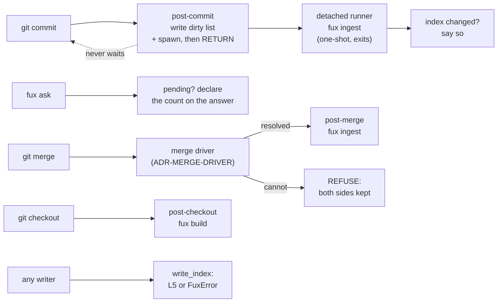

# ADR-MAINTENANCE: keeping the index in step

- **Name:** `ADR-MAINTENANCE` — cite this everywhere; never cite the number
- **Status:** **accepted 2026-08-22** — and *not* because R5 passed. **R5
  measured 2026-08-20 and FAILED** ([R5-HOOK](../../work/regression/2026-08-20-r5-hook-latency/VERDICT.md)):
  44.380 s at the judged 100 000 documents against a 1 s bound, 3.523 s at
  10 000, 0.651 s at 1 000. **Veto condition 1 fired, the fork it opened was
  ruled by Arpit, and this record is accepted describing the behaviour that
  ruling produced** — a deferring hook (decision 1a), not the inline one R5
  judged. **That behaviour is now built** (2026-08-22): the record and the code
  agree. The failing measurement is not restated in looser words anywhere in
  this record, and the frozen pre-registration is untouched: a 1 s bound at
  10 000 documents would be a **new** pre-registration and a **new** verdict.
  Fork: [`hook-at-scale.compare.md`](../../work/compare/hook-at-scale.compare.md),
  ruled **B**. **Built 2026-08-22, all four phases** (W-66, archived).
  R6 and the merge driver's own status moved to
  [ADR-MERGE-DRIVER](0033_merge-driver.md) on 2026-08-21
- **Date:** 2026-08-20
- **Feature:** M5 — maintenance, the hooks half
- **Owns:** `src/fux/maintain/` · `tools/maintenance-bench/` — **except
  `mergedriver.py`**, carved out to [ADR-MERGE-DRIVER](0033_merge-driver.md) on
  2026-08-21 (most specific wins). The harness stays here: one file runs both
  R5 and R6, and a component is owned once
- **Split to:** [ADR-MERGE-DRIVER](0033_merge-driver.md) — decisions 6–9, the
  refusal table, R6, and the add/add limitation
- **Amends:** [ADR-INDEX-LIFECYCLE](0009_index-lifecycle.md) ·
  [ADR-CLI](0002_cli-surface.md)
- **Laws:** L3, L5, L7

---

## §1 — For humans

Three pieces let a committed index survive a real repository with real people
in it. **Two of them are this record**; the third, the merge driver, is
[ADR-MERGE-DRIVER](0033_merge-driver.md) since 2026-08-21.

**Hooks.** `post-commit` and `post-merge` re-index; `post-checkout` rebuilds
the derived plane. All three are best-effort and **cannot block a commit**.

**A merge driver**, registered by the same installer and decided elsewhere:
`fux hooks` writes `merge.fux-index.driver` into the repository's local git
config and the `.fux/index/*.jsonl merge=fux-index` line into `.gitattributes`.
What the driver then *does* is [ADR-MERGE-DRIVER](0033_merge-driver.md).

**L5 moved into the writer.** Hashed meta for non-git sources was enforced in
`ingest/run.py`, which is to say in *one caller*. It now lives in
`write_index`, which is the only way bytes reach a committed shard.



<details>
<summary><b>ASCII twin</b> — the same diagram, for terminals, diffs, and any reader without a Mermaid renderer</summary>

```text
  git commit  --> post-commit: write the dirty list, spawn, RETURN
                     |                                    (never waits)
                     +--> detached runner (one-shot, exits)
                              --> fux ingest
                              --> "the index changed - commit it"

  fux ask     --> anything pending? say so on the answer

  git merge   --> merge driver (ADR-MERGE-DRIVER)
                     |-- resolved --> post-merge (fux ingest)
                     +-- cannot   --> REFUSE, both sides left in place

  git checkout --> post-checkout (fux build, derived plane only)

  any writer at all --> write_index --> L5 holds, or FuxError
```

</details>

### Examples

```console
$ fux hooks
  wrote  post-commit
  wrote  post-merge
  wrote  post-checkout
  merge driver registered: fux-merge-index %O %A %B
```

It refuses rather than clobbers:

```console
$ fux hooks
  REFUSED post-commit — a hook is already there and fux did not write it
  kept   post-merge (already current)
```

> The driver's own captures moved with it, to
> [ADR-MERGE-DRIVER](0033_merge-driver.md) §1.

---

## §2 — For agents

### Context

The index is committed, so it inherits every problem a generated file in git
has: it goes stale the moment content changes, and it conflicts whenever two
people touch the same shard. The staleness half is this record; the conflict
half is [ADR-MERGE-DRIVER](0033_merge-driver.md). Meanwhile L5 — hashed meta
for non-git sources — was a rule enforced by the one code path that happened to
implement it.

### Decision

**0. Hooks are the mechanism, and that was Arpit's call, not this record's.**
[`work/compare/maintenance-trigger.compare.md`](../../work/compare/maintenance-trigger.compare.md)
ruled **A — git hooks** on 2026-08-20, rejecting a CI-triggered rebuild (a bot
committing over the human's diff defeats the doc-major diffable design), a
local watch daemon (an always-on process this architecture has never needed),
and the manual status quo. That verdict is cited here, not re-argued. **What
this record decides is everything the verdict left open** — which hook, what
each one runs, and what happens when the driver cannot resolve.

**1. `post-commit`, not `pre-commit`, and this is the decision worth arguing.**

`pre-commit` looks strictly better: re-index, stage the index, and the
committed index always matches the committed content. **It reads the working
tree, not the staged tree.** With `git add -p`, or any unstaged edit sitting
beside a staged one, a pre-commit hook indexes bytes that are not being
committed and writes that index *into* the commit — producing an index
describing a state no commit ever had. That is **wrong**, where a
post-commit index is merely **late**.

The usual workaround is `git stash --keep-index` around the hook. It is
fragile, and losing a user's uncommitted work to keep an index tidy is not a
trade this project makes.

> **So the committed index lags, and the lag is visible**: the hook prints
> `the index changed — commit .fux/index to keep it in step`, and `fux doctor`
> reports staleness. Late and honest beats current and wrong.
>
> **Amended 2026-08-22 (decision 1a).** This used to read *"lags by at most one
> commit"*. Since the hook defers, the lag is **a few commits**, bounded by how
> long the detached runner takes rather than by one commit — and `fux ask` now
> declares it rather than leaving it to `fux doctor` to be asked. `post-commit`
> vs `pre-commit` is untouched by that change: it was never an argument about
> speed.

**1a. `post-commit` DEFERS: it writes a dirty list, spawns a runner, and
returns.** Ruled by Arpit on 2026-08-22, closing the fork R5's failure opened
([`hook-at-scale.compare.md`](../../work/compare/hook-at-scale.compare.md),
verdict **B**).

**Why the inline hook could not stay.** R5 measured a **20-document commit** —
already a small delta, and already benefiting from delta extraction (decision
1b of [ADR-INGEST](0007_ingest.md), which skips re-extracting unchanged
documents). It still cost 3.523 s at 10 000 documents and 44.380 s at 100 000.
**The cost tracks corpus size, not delta size**, because what remains after
delta extraction is corpus-wide by construction: sha every file to learn what
changed, parse every document because edges need it, resolve every edge because
an edge is a claim about *other* documents, and write every shard. A 10×
speedup still missed the bound by 4.5× at the judged size.

**What the hook does now:**

| step | property |
|---|---|
| write the ids of the changed documents to a **dirty list** | a *list*, not a flag — see below |
| spawn a **detached one-shot** re-index | it drains the dirty list and **exits**; nothing is always-on |
| **return immediately** | commit cost becomes git's cost — 0.22 s at 10k, 0.34 s at 100k, and **constant in the corpus** |

**Three things this decision turns on:**

1. **A list, not a flag.** Recording *which* documents changed costs the hook
   nothing and is the exact input an incremental re-index needs. It is what
   makes option D — *resolve edges only for the dirty set, rebuild only the
   touched shards and segments* — a later increment rather than a rewrite.
   **D is deferred to its own item, not rejected**, and this record does not
   pre-judge it.
2. **A one-shot runner is not the watch daemon that was rejected.**
   [`maintenance-trigger.compare.md`](../../work/compare/maintenance-trigger.compare.md)
   rejected an always-on filesystem watcher; this starts on a commit and exits.
   Its "always-on process this architecture has never needed" objection does not
   transfer, and that document's own consequences left a later layer open. The
   reasoning is worked through in that compare doc's §5 and is not re-argued
   here.
3. **The list alone buys no speedup.** The runner still calls today's
   `fux ingest`, which walks the corpus. B's win is that **nobody waits for
   it** — not that it got smaller. Saying otherwise would be claiming a result
   no measurement supports.

**What this costs, stated rather than discovered.** The index/tree agreement
window widens and becomes less predictable; two commits in quick succession
need a single-writer discipline; and the spawn has to be stdlib-only (L1) on a
Windows-first fleet. Those are **W-66**'s to solve, and they are the reason
this record is accepted for the *decision* while the build is still open.

**1b. `fux ask` declares the pending count.** Ruled in the same breath, and it
is what keeps the widened window honest. The refer plane already refuses to
collapse *"we did not look"* into *"we looked and it was fine"* — its
three-state `current`/`stale`/`unverified` verdict exists for exactly that — and
a lagging index is the same class of claim. `fux doctor` remains the detailed
report; `ask` is where a reader who never runs `doctor` finds out.
**This is a CLI surface change and [ADR-CLI](0002_cli-surface.md) carries it.**

**1c. The runner is observable, and the surface that observes it never mutates
it.** Ruled by Arpit, 2026-08-22, in the same conversation as 1a.

A process that runs detached and exits is invisible by construction. Three
questions have to be answerable from the outside, or the deferral in 1a trades a
slow commit for an opaque one:

| question | why it is not optional |
|---|---|
| is a runner live right now, and which pid | the basic one |
| how many documents are pending | the dirty list's own count |
| **is the lock held, or stale** | 1a's lock can outlive a killed runner; a wedged repo with no way to see it is worse than no lock |
| did the last run fail | a runner that dies leaves the list intact **and says nothing** |

**Where it lives: a check inside `fux doctor`, not a new verb — for now.**
`doctor` already returns `Check(ok, level, name, detail)` and already asserts
the derived plane is present, fresh and uncommitted, so the runner is one more
check in an existing shape. [ADR-CLI](0002_cli-surface.md) veto 1 forbids
`fux <verb> <subverb>` outright, and a new verb costs a record; **`doctor`
gains `--json`, which it does not have today**, because a status an agent cannot
parse is not a status. The promotion criterion to a `fux status` verb is written
into ADR-CLI as a **checkable condition**, not left to whoever next feels
crowded.

**Read-only, and this is a decision rather than an omission.** The check reports
a stale lock and **names the command to clear it**; it does not clear it. A
surface that reports state and can also mutate it will eventually mutate it by
accident, and the specific accident here — clearing a lock whose owner is
actually alive — puts **two runners in `.fux/index/` at once**, which is the one
thing 1a's lock exists to prevent. Automatic "provably stale" detection was
considered and rejected on the same ground: *provably* is a cross-platform pid
claim, and being wrong about it once is a corrupted index.

**1d. A human's explicit command takes over from the runner, and
`fux ingest --stop` is that takeover without the run.** Ruled by Arpit,
2026-08-22.

| command | behaviour |
|---|---|
| `fux ingest` | if a runner holds the lock, **stop it, then run** |
| `fux ingest --stop` | stop it and **do not** run — the same takeover, halted |
| `fux ingest --full` | as ever: re-extract everything rather than reuse by sha |

**Why takeover rather than refuse-or-wait.** Refusing makes a person argue with
a background job they did not start. Waiting reintroduces exactly the latency
1a existed to remove, on a different command. The explicit instruction wins.

**Three consequences, and the first one is the load-bearing one:**

1. **Stopping is now on the mainline, not an edge path.** Every manual
   `fux ingest` may have to stop a runner, so "stop cleanly" is a normal
   requirement rather than a rare one. It must therefore be **cooperative** —
   the runner checks a stop signal at a safe point between units of work and
   exits there. Not a kill: a signal delivered mid-shard-write can leave a
   partial shard, and `write_index` is the only path bytes reach a committed
   shard by. Cooperative also happens to be the portable answer, since Windows
   has no `SIGTERM` in the POSIX sense — **L7 and the Windows-first litmus make
   that the same decision twice.**
2. **A stopped run is a run that did not complete**, so the dirty list survives
   it untouched — identical to the killed-runner case in 1a. There is no third
   state to reason about.
3. **A completed run clears only the entries it actually covered**, never the
   whole list. Takeover makes concurrent addition ordinary: a commit landing
   while a manual run is in flight appends to the list, and a run that clears
   wholesale on success would silently drop that commit's documents. Snapshot at
   start, clear the snapshot on success.

**This does not contradict veto 7.** That condition guards the *status*
surface — `doctor`, and anything that succeeds it — from mutating what it
reports. `fux ingest` is not a status surface; it is the write path, and it is
where a mutation belongs. **`doctor` still never stops a runner and still never
clears a lock** (decision 1c).

**2. `post-merge` re-ingests; `post-checkout` only rebuilds.** A merge brings
in content *and* index lines, and the content is the authority — re-ingesting
derives the index from the merged content and repairs anything the driver had
to refuse. A checkout changes which committed index is present and no content
was authored, so only the gitignored runtime plane needs deriving.

**2a. The hook DOES refresh the derived plane, and it comes free.** The
compare doc left this open — *"should the hook also call `fux build` so
`.fux/runtime/graph.json` refreshes immediately, or is the stale→scan fallback
enough?"* — and the answer is that `fux ingest` already derives the accelerator
and, since [ADR-GRAPH](0029_graph.md), the graph plane in the same pass.
So `post-commit` and `post-merge` get it without a second command.

**`post-checkout` calls `fux build` and nothing else**, because a checkout
authors no content: the committed index is whatever that commit holds, and only
the gitignored runtime plane needs re-deriving.

**The stale→scan fallback stays the safety net, not the plan.**
[ADR-INDEX-LIFECYCLE](0009_index-lifecycle.md) decision 7 means a stale derived
plane degrades to the reference scan rather than answering wrongly — so a
missing hook costs latency, never correctness. That is exactly why decision 3
can make the hooks best-effort: the thing they optimise is speed, and the thing
that protects the answer is somewhere else.

**3. Every hook is best-effort and cannot block anything.** Each begins
`command -v fux >/dev/null 2>&1 || exit 0` and swallows failures. A tool that
blocks a commit because *its own* index step failed has made itself the most
important thing in the repository, which it is not.

**4. Installation refuses rather than clobbers.** A hook fux did not write
(no marker line) is left exactly as it is, the others still install, and the
refusal is printed. Silently replacing a repo's `post-commit` is how a team
loses its own tooling to a tool it installed to help. `--uninstall` is
symmetric: it removes only what it wrote.

**5. Hooks are never committed and never install themselves.** `.git/hooks` is
not tracked, so a hook cannot arrive with a clone — and that is a property to
respect rather than route around, because a tool that installed itself on
clone would execute code no reviewer saw. `fux doctor` can report their
absence; installing stays a decision.

**6–9. The merge driver moved out on 2026-08-21.** Last-writer-wins on
`(ver, sha)`, the four refusal cases and their table, the sorted deterministic
output, and `fux-merge-index` as its own entry point are now
[ADR-MERGE-DRIVER](0033_merge-driver.md), which owns
`src/fux/maintain/mergedriver.py`. **The numbers are retired, not reused** —
decision 10 keeps its number so every doc that cites it stays true. What
remains here is the wiring: `fux hooks` registers the driver in the
repository's local git config and appends the `.gitattributes` line, under
decisions 4 and 5's refuse-rather-than-clobber policy.

**10. L5 is enforced in `write_index`, per record, before any shard is
touched.** A non-git record must **state** `meta`; a missing value means the
policy layer was bypassed and is refused rather than defaulted, because
guessing on a caller's behalf is the leak the law exists to close. `hashed`
must carry `title_h` and **no `title` and no `phrases`**. `plain` remains a
legal, explicit, per-document opt-out
([ADR-URL-LIST](0018_url-list.md) decision 10).

### Consequences

- **There is no path into a committed shard that skips L5.** That is the
  difference between a law and a habit, and it is what W-25's DoD meant by
  "unbypassable" — the test that tries to bypass it calls `write_index`
  directly.
- **A rejected batch leaves the index exactly as it was.** The check runs over
  every record before the first shard is written.
- **The existing corpus already complied**, so this landed without changing a
  single committed byte. That is evidence the rule was right, not evidence it
  was unnecessary.
- **`fux` gains a twelfth verb** and ADR-CLI a sixth group. Flat, as ever.
- **R5 FAILED, measured 2026-08-20** —
  [R5-HOOK](../../work/regression/2026-08-20-r5-hook-latency/VERDICT.md).
  **44.4 s at 100 000 documents against a 1 s bound**, and **0.651 s at 1 000**,
  where it passes. Cost tracks the corpus, not the commit: a 20-document commit
  costs whatever touching the whole corpus costs, because parse, edge
  resolution, the shard write and the derived rebuild are each O(corpus).
  **Veto condition 1 has fired**, and its own words are what happens next —
  *"`post-commit` is too slow to be automatic and the hook becomes opt-in or
  incremental in a way it currently is not."* Which of those is a fork with
  several viable answers, so it is
  [`hook-at-scale.compare.md`](../../work/compare/hook-at-scale.compare.md) and
  Arpit's verdict, not this record's to assume.
- **R6 and everything that follows from it moved to
  [ADR-MERGE-DRIVER](0033_merge-driver.md)** on 2026-08-21 — the INCONCLUSIVE
  verdict, the add/add limitation, and the reproduced false-refusal defect
  ranked P4. **W-61 still carries both gates**, because one open item covers
  M5's measurement whichever record owns the code.
- **The behaviour test in `tests_e2e/test_maintenance.py` is still not R6**,
  and is now superseded as evidence by the runs above rather than standing in
  for them.
- **Decisions 1a–1d are built as of 2026-08-22 (W-66).**
  `src/fux/maintain/runner.py` is the whole of the mechanism: an
  `O_CREAT|O_EXCL` pid lock, a stop file that **names the pid it targets**, a
  `sys.executable -m fux.cli ingest --runner` spawn detached with
  `start_new_session` (POSIX) or `DETACHED_PROCESS|CREATE_NEW_PROCESS_GROUP`
  (Windows), and `ingest.run()`'s `should_stop` polled only **before**
  `write_index`. `post-commit` is now one line, `fux ingest --spawn-runner`.
  **Three things fell out of building it that this record did not anticipate:**
  - **`os.kill(pid, 0)` is not a liveness probe on Windows** — CPython routes
    it through `TerminateProcess`, so the POSIX idiom for *"does this process
    exist"* would **kill** the runner it was asking about. `is_alive` uses
    `OpenProcess`/`WaitForSingleObject` there. This is exactly the
    silently-wrong-on-someone-else's-OS class decision 1a's build was assigned
    to an Opus session for, and it is asserted by a test that reads the source.
  - **An OS advisory lock was available and was not taken.** `fcntl.flock` /
    `msvcrt.locking` release themselves when a holder dies, so a stale lock
    would be impossible. It loses decision 1c: an flock is held by a file
    descriptor nothing outside the process can name, and the runner's state
    has to be *reportable*. The cost is a lock file that outlives a killed
    runner, and the answer to that is the doctor check plus takeover — never a
    background process deciding on its own that a lock is dead.
  - **The stop file has to name its target pid.** Without that, a stop aimed
    at a runner that has already exited silently halts the *next* one, which
    would turn a 50-commit `git rebase` into a repository that indexes nothing.
- **`post-commit` no longer paints a progress bar, and that is W-64's own
  revisit clause being spent.** The hooks still export `FUX_NO_PROGRESS=0`
  (W-64, 2026-08-21) and `post-merge`/`post-checkout` still run inline and
  still want it. But `post-commit` no longer waits for an ingest at all, and
  the ingest that does run is detached with no terminal to paint — so R5's
  44.4 s of silence is answered by removing the wait rather than by narrating
  it. W-64's note said in as many words *"revisit if W-61's fork resolves to
  option B"*; it did, and this is that revisit. The bar's rules remain
  [ADR-CLI](0002_cli-surface.md) decision 9. **`fux-merge-index` stays silent
  regardless** — git owns the merge driver's stdio contract, and the driver is
  per-shard fast. Revisit if W-61's fork resolves to option B: a deferred hook
  costs ~0.3 s and constant, which the bar's count threshold mostly suppresses
  anyway.

> **Amended 2026-08-26 (W-82 §3.2, §3.1) — the dirty list has a second
> producer, and `maintain/` gained `urlstate.py`.**
>
> This record described one writer: `post-commit`, recording the documents a
> commit changed. **The refer plane is now a second** — it records a `url:`
> doc id when a cited document's sha no longer matches the index.
>
> ⚠ **The contract this leans on needs saying rather than assuming.**
> `dirty.py` is *"advisory, never authoritative"*, and that sentence is what
> keeps L3 true: `fux ingest` re-walks the whole corpus regardless, so the list
> can never change a committed byte. A **URL** refresh driven by the list *is*
> authoritative for the URLs it names, because not fetching the rest is the
> entire point. The defence:
>
> > The `url:` half of the index is **already** a mosaic of different moments.
> > Every record holds whatever its last fetch produced, and no two were
> > necessarily fetched together. A partial refresh changes the *spread* of
> > those moments, not the kind of object the index is. L3 is *same sources ->
> > same bytes*, and **a URL is not the same source twice.**
>
> ⚠ **This is not "just index the delta"**, which was ruled *not* the fix for
> R5. That was an offline filesystem walk that is already cheap; this is a
> networked path that is not, and the economics invert.
>
> `maintain/urlstate.py` is covered by this record's existing directory-level
> claim on `src/fux/maintain/`; no ownership row changes. ⚠ **It deliberately
> holds no timestamp** — [`refer/fetchcache.py`](../../src/fux/refer/fetchcache.py)
> states the invariant that *wall clock lives in the TTL store and nowhere
> else*, so freshness here is counted in **networked runs**, not seconds.
> W-75 had specified `validated_at` / `changed_at`; shipping them would have
> been a quiet contradiction of an accepted record.

> **Amended 2026-08-26 — this package's two local state files have a declared
> shape, and the readers use it.**
>
> `maintain/state.schema.json` declares `url-state.json`, its per-URL health
> entry, `url-shas.json` and `last-cited.json`. Both readers now call
> `schema.coerce` instead of hand-rolling per-field suspicion — an
> `_int_or_none` helper in one file, an `isinstance` filter in the other.
>
> **The defensiveness was right and survives.** These files can be truncated by
> a killed runner, hand-edited by someone debugging a failing URL, or written by
> an older fux, so a reporting plane must degrade rather than raise. What
> changed is *where* that tolerance lives: `coerce` keeps declared, well-typed
> fields and drops the rest, so **a new field is declared in one place instead
> of a place plus a reader that must remember it.**
>
> ⚠ **The schema records the constraint that shaped the file**: these counters
> are **runs, never seconds**, because `refer/fetchcache.py` states that wall
> clock lives in the TTL store and nowhere else. W-75 had specified
> `validated_at` and `changed_at`; shipping them would have quietly contradicted
> an accepted record.
>
> **`token` is declared absent on purpose** — it belongs to the optional
> `validate()` fetcher function, which is an unruled fork gated on a
> measurement. Declaring a field nothing writes is how a knob that cannot work
> ships.

### Alternatives considered

- **`pre-commit` with `git stash --keep-index`.** Rejected: decision 1.
- **A `pre-commit` hook that only *warns* when the index is stale.** Genuinely
  attractive, and the reason it is not here is that it adds a second mechanism
  answering the same question `fux doctor` already answers. Reopen if the
  one-commit lag turns out to bite in practice.
- **Committing the hooks into `.fux/hooks/` and symlinking.** Rejected: it
  makes `git clone` install executable code, which is the thing decision 5
  refuses.
- **The merge-driver alternatives** — always taking the higher `ver` including
  on ties, and union-merging the shard — moved with decisions 6–9 to
  [ADR-MERGE-DRIVER](0033_merge-driver.md).
- **Leaving L5 in `ingest/run.py` and documenting the rule.** Rejected on the
  observation that this is what it already was.
- **CI-triggered rebuild · a watch daemon · staying manual.** All three were
  rejected by the accepted compare doc, on grounds this record does not repeat:
  [`maintenance-trigger.compare.md`](../../work/compare/maintenance-trigger.compare.md).

### Reference (required)

- `gitattributes(5)` §"Defining a custom merge driver" — what `fux hooks` has
  to write for git to call the driver at all —
  <https://git-scm.com/docs/gitattributes#_defining_a_custom_merge_driver>
  (the driver's own half of that contract is
  [ADR-MERGE-DRIVER](0033_merge-driver.md))
- `githooks(5)` — that `post-commit` cannot affect the commit's outcome, which
  is why decision 3 is safe —
  <https://git-scm.com/docs/githooks>
- The accepted verdict this record implements:
  [`work/compare/maintenance-trigger.compare.md`](../../work/compare/maintenance-trigger.compare.md)
  (Arpit, 2026-08-20)
- **The accepted verdict decisions 1a and 1b implement:**
  [`work/compare/hook-at-scale.compare.md`](../../work/compare/hook-at-scale.compare.md)
  (Arpit, 2026-08-22) — **B, the hook defers**, and its §5 on why a one-shot
  runner is not the daemon rejected above
- **The measurement that forced it:**
  [R5-HOOK](../../work/regression/2026-08-20-r5-hook-latency/VERDICT.md) — and
  the attribution in its [report](../../work/regression/2026-08-20-r5-hook-latency/report.md) §3,
  which is what shows the cost tracks corpus size rather than delta size
- Prior art for deferring index maintenance off the write path: Lucene's
  near-real-time segment model, where writes append and merging is a background
  concern rather than part of the commit —
  <https://lucene.apache.org/core/9_0_0/core/org/apache/lucene/index/IndexWriter.html>
- The law itself: [ADR-LAWS](0001_laws.md) L5, and the per-document opt-out in
  [ADR-URL-LIST](0018_url-list.md) decision 10.
- The code: [`src/fux/maintain/`](../../src/fux/maintain/) and
  `assert_meta_policy` in [`src/fux/store/writer.py`](../../src/fux/store/writer.py)
- The control-and-treatment merge test:
  [`tests_e2e/test_maintenance.py`](../../tests_e2e/test_maintenance.py)

**Amended 2026-08-23 (W-76 Phases 3 and 9): two things were NOT built, and
both are decisions.**

**Phase 3 — the `git diff` delta hook is not built.** Veto condition 1 fired on
[R5](../../archive/v0.26/conformance/2026-07-23-min-confidence-calibration/report.md) (44.4 s for a
20-document commit at 100 000 documents) and the delta design was the answer.
It is no longer needed at the design point: **a one-document re-ingest is
0.84 s at 10 000 documents**, linear at ~82 us per document, because W-76
Phase 1's removal of the `code` field took **91 % of a full ingest** with it.

Filed as [`2026-08-23-r5-rerun-after-code-removal`](../../work/regression/2026-08-23-r5-rerun-after-code-removal/report.md),
and **re-confirmed after Phase 7** — committed per-chunk vectors made a *full*
ingest 6.8x slower and left the hook unmoved, because carry-forward re-embeds
only changed documents.

> **The reopen condition is a NUMBER, not a size: a measured one-document
> re-ingest above 5 s.**

That replaces veto condition 1's original trigger. R5 itself is **not
retracted** — it measured a real cost on the engine of 2026-08-20.

**Phase 9 — `refs/fux/<tree>` is not built, and could not have been a
correctness path.** `git clone` fetches no custom refs and runs no hooks
(hooks live in `.git/`, which is not cloned), so nothing could fetch a derived
plane on arrival. Arpit's fork A ruling removed the premise anyway by
committing everything the index needs. The residual cache-warmth idea is
recorded in `maintain/hooks.py::REFS_NOTE` and is unbuilt: the accelerator
rebuilds in **0.7 s at 10 000 documents**, and `fux build` is now discoverable
through Phase 0's nudge.

### Veto condition

**Reopen this decision if any of these becomes true:**

1. **SPENT — fired 2026-08-20, ruled 2026-08-22.** R5 failed, `post-commit`
   was found too slow to be automatic, and the hook became **deferring**
   (decision 1a). A condition that has fired and been answered is not a live
   condition; it is kept here, marked, so nobody re-fires it against the
   behaviour it produced. **Its successor is condition 5.**
2. **Moved** — R6's condition went to
   [ADR-MERGE-DRIVER](0033_merge-driver.md) with decisions 6–9 on 2026-08-21.
   The number is retired, not reused.
3. **The lag is observed causing a wrong answer in practice** — an `ask`
   answered from content that the checked-out commit does not contain. That is
   decision 1's whole bet, and **decision 1a raises the stake**: the window is
   now a few commits rather than one. Decision 1b is the mitigation, not the
   answer — a declared staleness is still staleness.
4. **Moved** — the tie condition went to
   [ADR-MERGE-DRIVER](0033_merge-driver.md) on 2026-08-21.
5. **The commit path stops being constant in the corpus** — a deferring hook
   whose cost still grows with corpus size has kept option B's costs and lost
   its benefit. Checkable: `post-commit` wall time must not track corpus size.
6a. **Amended 2026-08-22, after CI found a stranding bug.** The runner
   **re-drains**: after a pass it re-reads the dirty list and runs again while
   there is work, bounded by `runner.MAX_PASSES`. Without that, a commit whose
   spawn was refused (because this runner held the lock) had its ids stranded —
   the live runner clears only its own start-time snapshot, so the newer work
   was left with no process holding it and no guarantee another commit would
   arrive. **Every Linux CI arm failed on it while Windows and macOS passed**,
   which is what this race looks like on a slower box.
   **This is not condition 6 firing.** The bound makes termination provable, so
   the process is still one-shot in the only sense that matters: it ends.
   Leftovers past the cap stay in the list, `fux doctor` reports them, and the
   next commit's spawn collects them — which is where they were before.
   Checkable: `tests/maintain/test_runner.py -k "stranded or bounded"`.
6. **The detached runner turns into something always-on** — a resident process,
   a scheduler, or a watcher. That is option C from
   [`maintenance-trigger.compare.md`](../../work/compare/maintenance-trigger.compare.md),
   which is rejected there and only sidestepped here because the runner exits.
   If it stops exiting, this record and that verdict both reopen.

7. **A status surface mutates the thing it reports** — the doctor check, or any
   successor verb, clears a lock, writes the dirty list, or starts a runner.
   Decision 1c makes read-only the property, and the failure it guards is two
   writers in `.fux/index/`.
8. **A stop leaves a partial shard, or a stopped run clears the dirty list.**
   Either breaks decision 1d: the first means the stop was a kill rather than
   cooperative, the second means a run that did not complete behaved as if it
   had. Checkable: stop a runner mid-corpus and assert the index is byte-clean
   and the list is unchanged.
**How to check them:**

```bash
# 1 — SPENT: fired 2026-08-20 (R5-HOOK), ruled 2026-08-22. Kept for the record:
work/regression/2026-08-20-r5-hook-latency/evidence/reproduce.sh
# 0.651 s @ 1k (passes) · 3.523 s @ 10k · 44.380 s @ 100k (judged, fails)
# Those numbers judged the INLINE hook. Re-running them against the deferring
# hook measures a different thing and is NOT a re-judgement of R5.

# 2 and 4 — moved to ADR-MERGE-DRIVER; check them there.

# 3 — is the committed index behind the working tree?
fux doctor

# 5 — is the commit path constant in the corpus? (must not track corpus size)
work/regression/2026-08-20-r5-hook-latency/evidence/reproduce.sh

# 6 — does anything fux spawned outlive the commit that spawned it?
pgrep -fl fux   # expect: nothing, once the runner has finished

# 7 — the status surface is read-only: reporting must never repair.
#     Run every status path against a held lock and a stale one; the lock file
#     must be byte-identical afterwards.
uv run pytest -q tests/maintain/test_status_readonly.py

# 8 — a stop is cooperative, not a kill: stop mid-corpus, then assert BOTH
#     that the index is byte-clean and that the dirty list is unchanged.
uv run pytest -q tests_e2e/test_maintenance.py -k stop

# the hooks' own behaviour — install, refuse-to-clobber, uninstall
uv run pytest -q tests/maintain/test_hooks.py
```
---

## References

*Every source this record cites, gathered in one place. §2's **Reference
(required)** names the grounding; this is the complete list. An archived
document is never listed here — the body may name one, but archive is not
evidence.*

**Records** — [ADR-LAWS](0001_laws.md) · [ADR-CLI](0002_cli-surface.md) ·
[ADR-INGEST](0007_ingest.md) · [ADR-INDEX-LIFECYCLE](0009_index-lifecycle.md)
· [ADR-URL-LIST](0018_url-list.md) · [ADR-GRAPH](0029_graph.md) ·
[ADR-MERGE-DRIVER](0033_merge-driver.md)

**Code**

- [`src/fux/maintain/`](../../src/fux/maintain/)
- [`src/fux/store/writer.py`](../../src/fux/store/writer.py)
- [`tests_e2e/test_maintenance.py`](../../tests_e2e/test_maintenance.py)

**Measured evidence**

- [`work/regression/2026-08-20-r5-hook-latency/VERDICT.md`](../../work/regression/2026-08-20-r5-hook-latency/VERDICT.md)
- [`work/regression/2026-08-20-r5-hook-latency/report.md`](../../work/regression/2026-08-20-r5-hook-latency/report.md)

**Project docs**

- [`work/compare/hook-at-scale.compare.md`](../../work/compare/hook-at-scale.compare.md)
- [`work/compare/maintenance-trigger.compare.md`](../../work/compare/maintenance-trigger.compare.md)

**Papers and specifications**

- `gitattributes(5)` §Defining a custom merge driver — what the installer must
  write for git to call the driver at all
  <https://git-scm.com/docs/gitattributes#_defining_a_custom_merge_driver>
- `githooks(5)` — that `post-commit` cannot affect the commit's outcome
  <https://git-scm.com/docs/githooks>
- Lucene `IndexWriter` — near-real-time segments; prior art for deferring
  index maintenance off the write path
  <https://lucene.apache.org/core/9_0_0/core/org/apache/lucene/index/IndexWriter.html>
