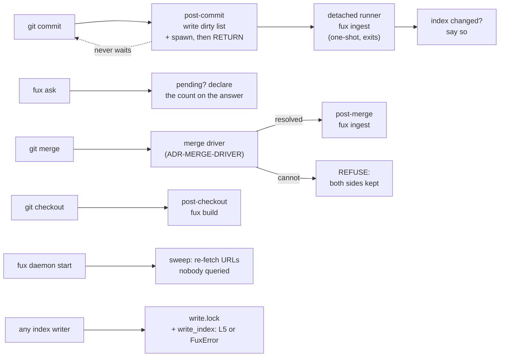

# ADR-MAINTENANCE — keeping the index in step

## §1 — For humans

Four pieces let a committed index survive a real repository with real people in
it. **Three of them are this record**; the fourth, the merge driver, is
[ADR-MERGE-DRIVER](0033_merge-driver.md).

**Hooks.** `post-commit` and `post-merge` re-index; `post-checkout` rebuilds the
derived plane. All three are best-effort, **cannot block a commit**, and
**never touch the network**.

**A write lock.** Every command that writes the index holds it; read verbs hold
nothing.

**A daemon.** `fux daemon start` runs a clock that re-fetches URLs nobody has
queried — the tail that answer-time verification structurally cannot reach.



<details>
<summary><b>ASCII twin</b> — the same diagram, for terminals, diffs, and any reader without a Mermaid renderer</summary>

```text
  git commit  --> post-commit: write the dirty list, spawn, RETURN
                     |                                    (never waits)
                     +--> detached runner (one-shot, exits)
                              --> fux ingest
                              --> "the index changed - commit it"

  fux ask     --> anything pending? say so on the answer

  git merge   --> merge driver (ADR-MERGE-DRIVER)
                     |-- resolved --> post-merge (fux ingest)
                     +-- cannot   --> REFUSE, both sides left in place

  git checkout --> post-checkout (fux build, derived plane only)

  fux daemon start --> a clock: re-fetch the URLs nobody queries

  any index WRITER --> write.lock --> write_index --> L5 holds, or FuxError
  any READ verb    --> holds nothing
```

</details>

### Examples

```console
$ fux hooks
  wrote  post-commit
  wrote  post-merge
  wrote  post-checkout
  merge driver registered: fux-merge-index %O %A %B
```

It refuses rather than clobbers:

```console
$ fux hooks
  REFUSED post-commit — a hook is already there and fux did not write it
  kept   post-merge (already current)
```

---

## §2 — For agents

### Context

The index is committed, so it inherits every problem a generated file in git
has: it goes stale the moment content changes, and it conflicts whenever two
people touch the same shard. The staleness half is this record; the conflict
half is [ADR-MERGE-DRIVER](0033_merge-driver.md). Meanwhile L5 — hashed meta for
non-git sources — was a rule enforced by the one code path that happened to
implement it.

### Decision

**0. Hooks are the mechanism**, ruled in
[`maintenance-trigger.compare.md`](../../work/compare/maintenance-trigger.compare.md)
over a CI-triggered rebuild (a bot committing over the human's diff defeats the
doc-major diffable design), a local watch daemon, and the manual status quo.
That verdict is cited here, not re-argued. **What this record decides is
everything the verdict left open** — which hook, what each one runs, and what
happens when the driver cannot resolve.

**1. `post-commit`, not `pre-commit`, and this is the decision worth arguing.**

`pre-commit` looks strictly better: re-index, stage the index, and the committed
index always matches the committed content. **It reads the working tree, not the
staged tree.** With `git add -p`, or any unstaged edit sitting beside a staged
one, a pre-commit hook indexes bytes that are not being committed and writes
that index *into* the commit — producing an index describing a state no commit
ever had. **That is wrong, where a post-commit index is merely late.**

The usual workaround is `git stash --keep-index` around the hook. It is fragile,
and **losing a user's uncommitted work to keep an index tidy is not a trade this
project makes.**

So the committed index lags, and **the lag is visible**: the hook prints *the
index changed — commit .fux/index to keep it in step*, `fux ask` declares the
pending count, and `fux doctor` reports staleness. **Late and honest beats
current and wrong.**

**1a. `post-commit` DEFERS: it writes a dirty list, spawns a runner, and
returns.**

**Why an inline hook could not stay.** A measured **20-document commit** — a
small delta, already benefiting from delta extraction — still cost **3.523 s at
10 000 documents and 44.380 s at 100 000** against a 1 s bound
([R5-HOOK](../../work/regression/2026-08-20-r5-hook-latency/VERDICT.md), FAIL).
**The cost tracks corpus size, not delta size**, because what remains after
delta extraction is corpus-wide by construction: sha every file to learn what
changed, parse every document because edges need it, resolve every edge because
an edge is a claim about *other* documents, and write every shard.

| step | property |
|---|---|
| write the ids of the changed documents to a **dirty list** | a *list*, not a flag |
| spawn a **detached one-shot** re-index | it drains the dirty list and **exits**; nothing is always-on |
| **return immediately** | commit cost becomes git's cost, and is **constant in the corpus** |

**Three things this turns on:**

1. **A list, not a flag.** Recording *which* documents changed costs the hook
   nothing and is the exact input an incremental re-index needs.
2. **A one-shot runner is not the watch daemon that was rejected.** The compare
   doc rejected an always-on filesystem watcher; this starts on a commit and
   exits.
3. ⚠ **The list alone buys no speedup.** The runner still calls today's
   `fux ingest`, which walks the corpus. **The win is that nobody waits for
   it** — not that it got smaller. Saying otherwise would claim a result no
   measurement supports.

**1b. `fux ask` declares the pending count.** A lagging index is the same class
of claim the refer plane refuses to collapse — *we did not look* is not *we
looked and it was fine*. `fux doctor` remains the detailed report; `ask` is
where a reader who never runs `doctor` finds out.
[ADR-CLI](0002_cli-surface.md) carries the surface.

**1c. The runner is observable, and the surface that observes it never mutates
it.** A process that runs detached and exits is invisible by construction. Four
questions have to be answerable from outside, or the deferral trades a slow
commit for an opaque one:

| question | why it is not optional |
|---|---|
| is a runner live right now, and which pid | the basic one |
| how many documents are pending | the dirty list's own count |
| **is the lock held, or stale** | the lock can outlive a killed runner; a wedged repo with no way to see it is worse than no lock |
| did the last run fail | a runner that dies leaves the list intact **and says nothing** |

**It lives as a check inside `fux doctor`, not a new verb**, because `doctor`
already has the shape and [ADR-CLI](0002_cli-surface.md) veto 1 forbids
`fux <verb> <subverb>`. **`doctor` gained `--json`** — a status an agent cannot
parse is not a status.

⚠ **Read-only, and this is a decision rather than an omission.** The check
reports a stale lock and **names the command to clear it**; it does not clear
it. A surface that reports state and can also mutate it will eventually mutate
it by accident, and **the specific accident here — clearing a lock whose owner
is alive — puts two runners in `.fux/index/` at once.** Automatic
"provably stale" detection was rejected on the same ground: *provably* is a
cross-platform pid claim, and being wrong about it once is a corrupted index.

**1d. A human's explicit command takes over from the runner.**

| command | behaviour |
|---|---|
| `fux ingest` | if a runner holds the lock, **stop it, then run** |
| `fux ingest --stop` | stop it and **do not** run |
| `fux ingest --full` | as ever: re-extract everything rather than reuse by sha |

**Why takeover rather than refuse-or-wait.** Refusing makes a person argue with
a background job they did not start. Waiting reintroduces exactly the latency
1a existed to remove, on a different command.

1. ⚠ **Stopping is on the mainline, not an edge path**, so *stop cleanly* is a
   normal requirement. It is **cooperative** — the runner checks a stop signal
   at a safe point between units of work and exits there. **Not a kill**: a
   signal delivered mid-shard-write can leave a partial shard. Cooperative is
   also the portable answer, since Windows has no `SIGTERM` in the POSIX sense —
   **L7 and the Windows-first litmus make that the same decision twice.**
2. **A stopped run is a run that did not complete**, so the dirty list survives
   it untouched. There is no third state to reason about.
3. **A completed run clears only the entries it actually covered**, never the
   whole list. A commit landing while a manual run is in flight appends to the
   list, and a run that cleared wholesale on success would **silently drop that
   commit's documents.** Snapshot at start, clear the snapshot on success.

**2. `post-merge` re-ingests; `post-checkout` only rebuilds.** A merge brings in
content *and* index lines, and **the content is the authority** — re-ingesting
derives the index from the merged content and repairs anything the driver had to
refuse. A checkout authors no content, so only the gitignored runtime plane
needs deriving.

**2a. The derived plane refresh comes free.** `fux ingest` already derives the
accelerator and the graph plane in the same pass, so `post-commit` and
`post-merge` get it without a second command.

**The stale→scan fallback stays the safety net, not the plan.** A stale derived
plane degrades to the reference scan rather than answering wrongly — so a
missing hook costs latency, never correctness. **That is exactly why decision 3
can make the hooks best-effort**: the thing they optimise is speed, and the
thing that protects the answer is somewhere else.

**3. Every hook is best-effort and cannot block anything.** Each begins
`command -v fux >/dev/null 2>&1 || exit 0` and swallows failures. **A tool that
blocks a commit because *its own* index step failed has made itself the most
important thing in the repository, which it is not.**

**4. Installation refuses rather than clobbers.** A hook fux did not write (no
marker line) is left exactly as it is, the others still install, and the refusal
is printed. **Silently replacing a repo's `post-commit` is how a team loses its
own tooling to a tool it installed to help.** `--uninstall` is symmetric: it
removes only what it wrote.

**5. Hooks are never committed and never install themselves.** `.git/hooks` is
not tracked, so a hook cannot arrive with a clone — **a property to respect
rather than route around, because a tool that installed itself on clone would
execute code no reviewer saw.**

**5a. NO HOOK EVER TOUCHES THE NETWORK.** Without exception — **including** the
commit that edits `.fux/sources/urls`, which is the exception that was
specifically proposed and specifically refused.

- ⚠ **The refused version was narrow and still wrong.** *"Fetch, but only for
  the commit that changes the sources file"* is bounded by a diff and reads as
  self-evidently consented. **The consent is the problem, not the scope.** A
  colleague clones, runs `fux hooks` once because the README said to, and from
  then on some commits send requests to hosts they never chose, from a machine
  that may be on a customer's network — **a one-time, invisible consent buying a
  per-commit, permanent consequence.**
- **What still fetches:** `fux add <URL>` and `fux update`, both explicit
  commands a human typed, and **the daemon**, which is started deliberately and
  stays visible while it runs. **Network in fux is always something someone
  asked for in the moment or chose to leave running.**
- **The cost, stated:** URLs added by hand-editing `.fux/sources/urls` are not
  fetched at commit time. They wait for the daemon's next pass or an explicit
  `fux update`. That is a delay, not a silence — `fux doctor` reports them.
- **Gated, not trusted:**
  [`tests/maintain/test_hooks.py`](../../tests/maintain/test_hooks.py) asserts
  no hook body contains a networking invocation, per hook. **It is a crude
  string check on purpose**: the failure worth catching is a future edit adding
  a refresh back *just for the sources commit*, and a crude check catches that
  the same day it is written.
- **This is L4 at its narrowest point.** A git hook is the one path in fux that
  runs **without anyone deciding to run it**.

**6. `fux hooks` registers the merge driver.** It writes
`merge.fux-index.driver` into the repository's local git config and the
`.fux/index/*.jsonl merge=fux-index` line into `.gitattributes`, under decisions
4 and 5's refuse-rather-than-clobber policy. **What the driver does is
[ADR-MERGE-DRIVER](0033_merge-driver.md)'s.**

**7. L5 is enforced in `write_index`, per record, before any shard is touched.**
A non-git record must **state** `meta`; a missing value means the policy layer
was bypassed and is refused rather than defaulted, because guessing on a
caller's behalf is the leak the law exists to close. `hashed` must carry
`title_h` and **no `title` and no `phrases`**.

**8. One lock, `write.lock`, and every index writer holds it.** `ingest`,
`build`, `add`, `remove` and `update` all pass through `write_lock(root)`.
**Read verbs take nothing** — a lock on the read path would make a search fail
because a re-index was running, which trades a real problem for a worse one.

⚠ **The gap this closed was read from call sites and then reproduced.**
`acquire()` had exactly one caller — the background runner. A foreground
`fux ingest` evicted a runner and then wrote **holding nothing**, so two
foreground ingests raced with nothing noticing.
`test_two_foreground_writers_actually_race_without_it` spawns two processes and
is the reproduction that had to exist before anything was built on the claim.

⚠ **`acquire(required=True)` raises where `acquire()` returns `False`, and the
asymmetry is the point.** The same line meant opposite things to two callers: a
**background runner** that cannot take the lock should decline quietly, because
someone else is already doing the work; a **writer** that cannot take it and
proceeds has inverted the lock's purpose. For the same reason
`except OSError: return False  # degrade, never block` was right for a runner
and **inverted** for a writer — on a read-only or full filesystem the write is
about to happen anyway, and doing it unprotected is the outcome the lock exists
to prevent.

**A runner may re-enter its own lock**, or it would deadlock against itself.
**The file is not called `index.lock`** — git keeps one of those feet away in
the same repo, and a stranded-lock incident with it is already on record.

**9. `fux daemon` — a resident clock.** Owns
[`src/fux/maintain/daemon.py`](../../src/fux/maintain/daemon.py).

**What it is for.** Answer-time verification covers the **head** — a URL is
noticed as changed when someone retrieves it. It cannot reach the **tail**: a
URL nobody queries is never cited, never fetched, and nothing notices. **No
amount of answer-time verification closes that.** The clock does.

⚠ **This is a resident process, and that cost is accepted rather than argued
away.** Fux now owns a lifecycle: start, stop, crash, laptop sleep, double-run,
stale build after upgrade. What it is *not* is the filesystem watcher the
compare doc rejected — **that one fired on every save, with no moment of
choosing.** This starts because a human typed `start`, and the compare verdict
governs how a **local source edit** reaches the index, where this governs how a
**remote URL change** is noticed.

**9a. It writes `.fux/index/` directly and takes the same `write.lock`.** That
makes it a **second writer**, and every consequence is paid explicitly:

- **The same lock**, never a second lock file. **Two locks guarding one resource
  is not locking.**
- **Released between sweeps, never held across the sleep.** An hour-long hold
  would block every `fux ingest` in the repository.
- **The stop is cooperative and is never a signal**, for decision 1d's reason
  unchanged. A `stop` that times out is **reported, not escalated** — and that
  is the honest outcome, not a missing feature.
- **A killed daemon leaves a stale lock**, exactly as a killed runner does, and
  decisions 1c/1d already answer it: `fux doctor` reports, `fux ingest` takes
  over, **nothing decides on its own that a lock is dead.**

**9b. Nothing outside the repository, ever.** Spawned as
`sys.executable -m fux.cli` — the interpreter already running, so the project's
`.venv` is pinned rather than looked up on `PATH`. **No launchd plist, no
systemd unit, no crontab entry, no global install.** Gated by
[`tests/maintain/test_daemon.py`](../../tests/maintain/test_daemon.py), which
strips comments and string literals before checking, so the module may document
the constraint without tripping the test that enforces it.

**9c. Nothing may start it but a human.** Not `fux setup`, not `fux hooks`, not
a hook body — asserted per hook. **The consent is the whole of the argument, so
the moment something else starts it, the argument is void.**

**9c-i. The sweep is verified END TO END, and by a positive control.** Measured
2026-08-27 —
[the daemon-lifecycle capture](../../work/regression/2026-08-27-daemon-lifecycle/report.md).
`start` → sweep → **a page changed under fux, picked up on the next declared
interval, unassisted** → `stop` → pid reaped, `write.lock` free.

- ⚠ **The reason it needed a real run at all is the defect it was proving
  fixed.** `_sweep` did `from ..ingest import run as ingest_run`, binding the
  re-exported *function*, so `ingest_run.run(...)` raised `AttributeError` into
  the broad handler that keeps a daemon alive. **Every sweep, in every
  repository, indexed nothing and the daemon looked healthy.** The test named
  for that path patched the same wrong object and failed on its own
  `monkeypatch` line.
- **So the check is a positive control, not a status read.** A term that exists
  only in the fetched page was absent from the index before `start` and present
  after. A mock cannot tell "the sweep called ingest" from "the sweep called the
  mock"; this can.
- ⚠ **The network was `127.0.0.1`.** No proxy, no TLS, no SSO, no rate limit, no
  DNS — so the rate-limit path was never exercised, and
  [W-82](../../work/OPEN-WORK.md) ruling 3's hold is **narrowed, not lifted.**
- ⚠ **macOS only**, and the detached-process mechanics are the part most likely
  to differ on Windows.

**9d. Cadence is `[sources.url] sweep_minutes`, default 60.** It **has** a
default, unlike `max_parallel`, and the asymmetry is deliberate: `max_parallel`
bounds a blast radius and must be stated; this only decides how often, so
silence is unopinionated rather than dangerous. **No adaptive scheduling** —
proportional-to-change-rate is out of scope.

**10. The dirty list has two producers, and the contract it leans on needs
saying rather than assuming.** `post-commit` records what a commit changed; the
refer plane records a `url:` doc id when a cited document's sha no longer
matches ([ADR-REFER](0030_refer-plane.md) decision 15).

`dirty.py` is **advisory, never authoritative**, and that sentence is what keeps
L3 true: `fux ingest` re-walks the whole corpus regardless, so the list can never
change a committed byte. **A URL refresh driven by the list *is* authoritative
for the URLs it names**, because not fetching the rest is the entire point. The
defence:

> The `url:` half of the index is **already** a mosaic of different moments.
> Every record holds whatever its last fetch produced, and no two were
> necessarily fetched together. A partial refresh changes the *spread* of those
> moments, not the kind of object the index is. L3 is *same sources → same
> bytes*, and **a URL is not the same source twice.**

⚠ **This is not "just index the delta"**, which was ruled *not* the fix for the
hook latency. That was an offline filesystem walk that is already cheap; this is
a networked path that is not, and **the economics invert.**

**11. The package's local state files have a declared shape, and the readers use
it.** `maintain/state.schema.json` declares `url-state.json`, its per-URL health
entry, `url-shas.json` and `last-cited.json`, and the readers call
`schema.coerce` rather than hand-rolling per-field suspicion.

**The defensiveness was right and survives.** These files can be truncated by a
killed runner, hand-edited by someone debugging a failing URL, or written by an
older fux, so a reporting plane must **degrade rather than raise**. What changed
is *where* the tolerance lives: `coerce` keeps declared, well-typed fields and
drops the rest, so **a new field is declared in one place instead of a place
plus a reader that must remember it.**

⚠ **These counters are runs, never seconds**, because
[`refer/fetchcache.py`](../../src/fux/refer/fetchcache.py) states that wall
clock lives in the TTL store and nowhere else. A `validated_at` / `changed_at`
pair was specified and **not shipped**: it would have quietly contradicted an
accepted record. **`token` is declared absent on purpose** — it belongs to an
optional fetcher function that is an unruled fork, and **declaring a field
nothing writes is how a knob that cannot work ships.**

**12. The sweep's status carries a REASON and COUNTS, and the file is declared.**
Ruled by Arpit 2026-08-28.

- **It carried `outcome` and nothing else**, and both halves of that cost
  something real:
  - A `FuxError` about `max_parallel` and a dead network were **the same bare
    `"failed"`**, so a misconfigured repository failed forever with nothing to
    go on.
  - ⚠ **An `"ok"` sweep could skip URLs silently.** Two of seven did in the
    [2026-08-27 real-network run](../../work/regression/2026-08-27-daemon-real-url/report.md),
    and the only surface that said so was a foreground `fux update` nobody runs.
    **`outcome: "ok"` with `skipped: 2` is a state the old shape could not
    express at all.**
- **`reason` explains something or is absent** — never an empty string. A field
  that is always present and usually empty is one a reader learns to skip, which
  is how the bare `"failed"` earned its silence.
- **Bounded at 300 characters, and it carries the FIRST skip, not a list.** This
  file is rewritten every sweep; an unbounded field on it is how a runtime file
  grows without anyone deciding it should. The count says how many.
- **The exception TYPE is carried with the message**: a `FuxError` is the repo's
  own refusal (fix your config), anything else is a surprise (fix fux).
- ⚠ **`daemon.status` shipped UNDECLARED.** It is now in
  [`state.schema.json`](../../src/fux/maintain/state.schema.json), which is the
  gap that file exists to close — two readers were hand-rolling their own
  tolerance for what might be in it.
- **`fux doctor` surfaces it**, because `fux daemon status` is what a person runs
  when they already suspect something and `doctor` is what they run when they do
  not. A daemon that never ran is **not** a finding — a check that fires for
  everyone is one people learn to skip.

**13. `token_sha` — the validation token's hash, and never the token.** W-87 P4
fork 4, ruled 2026-08-28 with fork 3.

- **`sha256(token)` in `url-state.json`.** An `ETag` is opaque to fux but not
  necessarily to everyone: it can be a content hash, a version counter, or an
  internal object id. This file is gitignored and is still exactly the kind of
  local state that ends up in a support bundle. **Hashing compares as well as the
  token does and carries none of it, so L5 is untouched by construction.**
- **Counters, no clocks — unchanged.** A token is an opaque equality witness,
  not a timestamp, even when a server built it from one.
- 🔴 **It was declared, written, and NOT READ BACK for its first hour**, so
  `validate()` learned a token every run and matched none — the optimisation did
  nothing while every test passed. **`state.schema.json`'s own header predicts
  this failure in as many words**: *"add a field and you must remember to teach
  the reader about it, or it is silently dropped on the next read."*
  **Now gated**: `test_every_declared_field_survives_a_round_trip` walks the
  *declared* shape rather than a hard-coded list, so the next field is covered
  without editing the test.

### Consequences

- **There is no path into a committed shard that skips L5.** That is the
  difference between a law and a habit, and the test that tries to bypass it
  calls `write_index` directly.
- **A rejected batch leaves the index exactly as it was.** The check runs over
  every record before the first shard is written.
- **The existing corpus already complied**, so the write-time check landed
  without changing a single committed byte. **That is evidence the rule was
  right, not evidence it was unnecessary.**
- ⚠ **`os.kill(pid, 0)` is not a liveness probe on Windows** — CPython routes it
  through `TerminateProcess`, so the POSIX idiom for *does this process exist*
  would **kill** the runner it was asking about. `is_alive` uses
  `OpenProcess`/`WaitForSingleObject` there, asserted by a test that reads the
  source. **This is the silently-wrong-on-someone-else's-OS class exactly.**
- ⚠ **An OS advisory lock was available and was not taken.** `fcntl.flock` /
  `msvcrt.locking` release themselves when a holder dies, so a stale lock would
  be impossible. **It loses decision 1c**: an flock is held by a file descriptor
  nothing outside the process can name, and the runner's state has to be
  *reportable*. The cost is a lock file that outlives a killed runner, and the
  answer is the doctor check plus takeover — never a background process deciding
  on its own that a lock is dead.
- ⚠ **The stop file names its target pid.** Without that, a stop aimed at a
  runner that has already exited silently halts the *next* one — **which would
  turn a 50-commit `git rebase` into a repository that indexes nothing.**
- ⚠ **The runner re-drains, bounded by `MAX_PASSES`.** After a pass it re-reads
  the dirty list and runs again while there is work. Without that, a commit
  whose spawn was refused had its ids **stranded**: the live runner clears only
  its own start-time snapshot, so newer work was left with no process holding
  it. **Every Linux CI arm failed on this while Windows and macOS passed**,
  which is what the race looks like on a slower box. The bound makes termination
  provable, so the process is still one-shot in the only sense that matters: it
  ends.
- **`post-commit` paints no progress bar.** It no longer waits for an ingest,
  and the ingest that does run is detached with no terminal to paint — so the
  silence is answered by removing the wait rather than by narrating it.
  `post-merge` and `post-checkout` run inline and still export
  `FUX_NO_PROGRESS=0`. **`fux-merge-index` stays silent regardless** — git owns
  the merge driver's stdio contract.
- **A `git diff` delta hook is not built, and the reason is a number.** A
  one-document re-ingest is **0.84 s at 10 000 documents**, linear at ~82 µs per
  document, after the largest per-document cost left extraction
  ([the re-run](../../work/regression/2026-08-23-r5-rerun-after-code-removal/report.md)).
  **The reopen trigger is a measured one-document re-ingest above 5 s** — a
  number, not a size.
- **A custom-ref transport for the derived plane could not have been a
  correctness path.** `git clone` fetches no custom refs and runs no hooks
  (hooks live in `.git/`, which is not cloned), so nothing could fetch a derived
  plane on arrival. The accelerator rebuilds in **0.7 s at 10 000 documents**.

### Alternatives considered

- **`pre-commit` with `git stash --keep-index`.** Rejected: decision 1.
- **A `pre-commit` hook that only *warns* when the index is stale.** Genuinely
  attractive, and the reason it is not here is that it adds a second mechanism
  answering the question `fux doctor` already answers.
- **Committing the hooks into `.fux/hooks/` and symlinking.** Rejected: it makes
  `git clone` install executable code, which is what decision 5 refuses.
- **A hook that fetches, but only for the commit that edits the sources file.**
  Rejected under decision 5a — the consent is the problem, not the scope.
- **Leaving L5 in one caller and documenting the rule.** Rejected on the
  observation that this is what it already was.
- **An OS advisory lock.** Rejected under Consequences: it forfeits
  observability, which decision 1c makes the property.
- **A status surface that repairs what it reports.** Rejected: decision 1c, and
  it is veto condition 4.
- **CI-triggered rebuild · a filesystem watcher · staying manual.** All three
  rejected by the accepted compare doc, on grounds this record does not repeat.

### Reference (required)

- The code: [`src/fux/maintain/`](../../src/fux/maintain/) — `hooks.py`,
  `runner.py`, `daemon.py`, `dirty.py`, `urlstate.py`, `lastcited.py` and
  `state.schema.json`; the write-time law at `assert_meta_policy` in
  [`src/fux/store/writer.py`](../../src/fux/store/writer.py); the harness at
  [`tools/maintenance-bench/`](../../tools/maintenance-bench/).
- The accepted verdicts this record implements:
  [`maintenance-trigger.compare.md`](../../work/compare/maintenance-trigger.compare.md)
  (hooks are the mechanism) and
  [`hook-at-scale.compare.md`](../../work/compare/hook-at-scale.compare.md)
  (**B — the hook defers**, and its §5 on why a one-shot runner is not the
  daemon that verdict rejected).
- **The measurement that forced the deferral:**
  [R5-HOOK](../../work/regression/2026-08-20-r5-hook-latency/VERDICT.md) and the
  attribution in its
  [report](../../work/regression/2026-08-20-r5-hook-latency/report.md) §3, which
  is what shows the cost tracks corpus size rather than delta size; the re-run
  that removed the need for a delta hook,
  [`2026-08-23-r5-rerun-after-code-removal`](../../work/regression/2026-08-23-r5-rerun-after-code-removal/report.md).
- `githooks(5)` — that `post-commit` cannot affect the commit's outcome, which
  is why decision 3 is safe — <https://git-scm.com/docs/githooks>
- `gitattributes(5)` §"Defining a custom merge driver" — what `fux hooks` has to
  write for git to call the driver at all —
  <https://git-scm.com/docs/gitattributes#_defining_a_custom_merge_driver>
- Prior art for deferring index maintenance off the write path: Lucene's
  near-real-time segment model —
  <https://lucene.apache.org/core/9_0_0/core/org/apache/lucene/index/IndexWriter.html>
- The tests: [`tests/maintain/`](../../tests/maintain/) and
  [`tests_e2e/test_maintenance.py`](../../tests_e2e/test_maintenance.py).

### Veto condition

**Reopen this decision if any of these becomes true:**

1. **The lag is observed causing a wrong answer in practice** — an `ask`
   answered from content the checked-out commit does not contain. That is
   decision 1's whole bet, and **decision 1a raises the stake**: the window is a
   few commits rather than one. **Decision 1b is the mitigation, not the answer**
   — a declared staleness is still staleness.
2. **The commit path stops being constant in the corpus.** A deferring hook
   whose cost still grows with corpus size has kept the deferral's costs and lost
   its benefit.
3. ⚠ **The detached RUNNER stops being one-shot.** If `runner.run_once` ever
   loops without `MAX_PASSES`, or `spawn` starts something that outlives its
   work, this fires. **The daemon's existence buys the runner nothing** — that
   is a separate process, started by a human, and decision 9 is its argument.
4. **A status surface mutates the thing it reports** — the doctor check, or any
   successor verb, clears a lock, writes the dirty list, or starts a runner.
   Decision 1c makes read-only the property, and the failure it guards is two
   writers in `.fux/index/`.
5. **A stop leaves a partial shard, or a stopped run clears the dirty list.**
   The first means the stop was a kill rather than cooperative; the second means
   a run that did not complete behaved as if it had.
6. **Anything other than a human starts the daemon** — decision 9c, and the
   whole of the consent argument.
7. **A hook body acquires a networking invocation** — decision 5a.
8. **A one-document re-ingest is measured above 5 s**, which is the delta hook's
   reopen trigger stated as a number rather than a corpus size.
9. ⚠ **A sweep's only evidence is its own status file again.** Decision 9c-i's
   check is a positive control precisely because `"ok"` was reported by a sweep
   that did nothing for a day. If the end-to-end capture is ever replaced by a
   mock-only gate, this fires.
10. **A hook-driven test passes with `fux` unreachable on `PATH`.** The hook's
    first line is `command -v fux >/dev/null 2>&1 || exit 0`, so an absent
    install turns every hook into a no-op that reports success.
    `tests_e2e/test_maintenance.py::test_the_hook_environment_can_actually_find_fux`
    is the guard; **measured 2026-08-27**, removing `fux` from `PATH` fails four
    hook tests and used to leave `test_nothing_fux_spawned_outlives_its_own_run`
    green, because its every assertion is that something is ABSENT. That one now
    carries a positive control of its own.

**How to check them:**

```bash
# 1 — is the committed index behind the working tree?
fux doctor

# 2 — is the commit path constant in the corpus?
work/regression/2026-08-20-r5-hook-latency/evidence/reproduce.sh
# ⚠ those numbers judged the INLINE hook. Re-running them against the deferring
# hook measures a different thing and is NOT a re-judgement of R5.

# 3 — the runner is bounded, and nothing it spawns outlives its work
uv run pytest -q tests/maintain/test_runner.py -k "stranded or bounded"
pgrep -fl 'fux.cli ingest'   # expect: nothing, once the runner has finished

# 4 — the status surface is read-only: reporting must never repair
uv run pytest -q tests/maintain/test_status_readonly.py

# 5 — a stop is cooperative, not a kill: stop mid-corpus, then assert BOTH
#     that the index is byte-clean and that the dirty list is unchanged
uv run pytest -q tests_e2e/test_maintenance.py -k stop

# 6, 7 — nothing but a human starts the daemon; no hook touches the network
uv run pytest -q tests/maintain/test_daemon.py tests/maintain/test_hooks.py
```

---

## References

*Every source this record cites, gathered in one place. §2's **Reference
(required)** names the grounding; this is the complete list. An archived
document is never listed here — the body may name one, but archive is not
evidence.*

**Records** — [ADR-LAWS](0001_laws.md) · [ADR-CLI](0002_cli-surface.md) ·
[ADR-INGEST](0007_ingest.md) · [ADR-INDEX-LIFECYCLE](0009_index-lifecycle.md) ·
[ADR-CONFIG](0014_config.md) · [ADR-URL-LIST](0018_url-list.md) ·
[ADR-GRAPH](0029_graph.md) · [ADR-REFER](0030_refer-plane.md) ·
[ADR-MERGE-DRIVER](0033_merge-driver.md)

**Code**

- [`src/fux/maintain/`](../../src/fux/maintain/)
- [`src/fux/store/writer.py`](../../src/fux/store/writer.py)
- [`tools/maintenance-bench/`](../../tools/maintenance-bench/)
- [`tests/maintain/`](../../tests/maintain/)
- [`tests_e2e/test_maintenance.py`](../../tests_e2e/test_maintenance.py)

**Measured evidence**

- [`work/regression/2026-08-20-r5-hook-latency/VERDICT.md`](../../work/regression/2026-08-20-r5-hook-latency/VERDICT.md)
- [`work/regression/2026-08-20-r5-hook-latency/report.md`](../../work/regression/2026-08-20-r5-hook-latency/report.md)
- [`work/regression/2026-08-23-r5-rerun-after-code-removal/report.md`](../../work/regression/2026-08-23-r5-rerun-after-code-removal/report.md)

**Project docs**

- [`work/compare/hook-at-scale.compare.md`](../../work/compare/hook-at-scale.compare.md)
- [`work/compare/maintenance-trigger.compare.md`](../../work/compare/maintenance-trigger.compare.md)

**Papers and specifications**

- `gitattributes(5)` §Defining a custom merge driver — what the installer must
  write for git to call the driver at all
  <https://git-scm.com/docs/gitattributes#_defining_a_custom_merge_driver>
- `githooks(5)` — that `post-commit` cannot affect the commit's outcome
  <https://git-scm.com/docs/githooks>
- Lucene `IndexWriter` — near-real-time segments; prior art for deferring index
  maintenance off the write path
  <https://lucene.apache.org/core/9_0_0/core/org/apache/lucene/index/IndexWriter.html>
