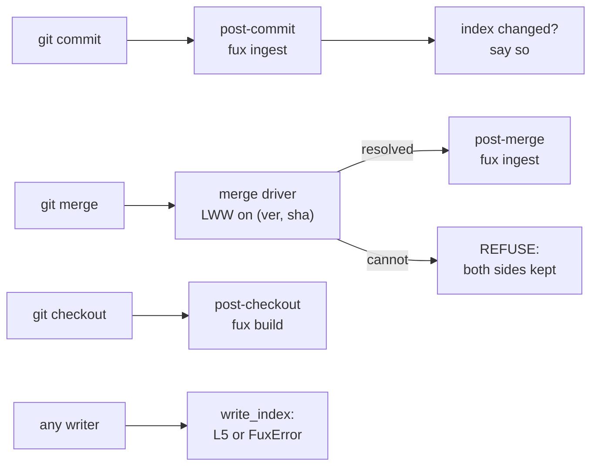

# ADR-MAINTENANCE: keeping the index in step

- **Name:** `ADR-MAINTENANCE` — cite this everywhere; never cite the number
- **Status:** proposed — **R5 measured 2026-08-20 and FAILED**; R6 INCONCLUSIVE.
  Acceptance is not a formality away: veto condition 1 has fired, and what
  replaces the automatic hook is an open fork
  ([`hook-at-scale.compare.md`](../../work/compare/hook-at-scale.compare.md))
- **Date:** 2026-08-20
- **Feature:** M5 — maintenance
- **Owns:** `src/fux/maintain/` · `tools/maintenance-bench/`
- **Amends:** [ADR-INDEX-LIFECYCLE](0009_index-lifecycle.md) ·
  [ADR-CLI](0002_cli-surface.md)
- **Laws:** L3, L5, L7

---

## §1 — For humans

Three pieces that let a committed index survive a real repository with real
people in it.

**Hooks.** `post-commit` and `post-merge` re-index; `post-checkout` rebuilds
the derived plane. All three are best-effort and **cannot block a commit**.

**A merge driver**, so two people working at once do not get a textual conflict
in a machine-written file. It resolves by last-writer-wins on `(ver, sha)` and
**refuses, loudly, whenever it cannot** — leaving both sides for a human.

**L5 moved into the writer.** Hashed meta for non-git sources was enforced in
`ingest/run.py`, which is to say in *one caller*. It now lives in
`write_index`, which is the only way bytes reach a committed shard.



<details>
<summary><b>ASCII twin</b> — the same diagram, for terminals, diffs, and any reader without a Mermaid renderer</summary>

```text
  git commit  --> post-commit (fux ingest) --> "the index changed - commit it"

  git merge   --> merge driver, LWW on (ver, sha)
                     |-- resolved --> post-merge (fux ingest)
                     +-- cannot   --> REFUSE, both sides left in place

  git checkout --> post-checkout (fux build, derived plane only)

  any writer at all --> write_index --> L5 holds, or FuxError
```

</details>

### Examples

```console
$ fux hooks
  wrote  post-commit
  wrote  post-merge
  wrote  post-checkout
  merge driver registered: fux-merge-index %O %A %B
```

It refuses rather than clobbers:

```console
$ fux hooks
  REFUSED post-commit — a hook is already there and fux did not write it
  kept   post-merge (already current)
```

The measured control-and-treatment for the driver — the same merge, twice:

```console
# without the driver
$ git merge x
CONFLICT (content): Merge conflict in .fux/index/ad.jsonl

# with it
$ git merge x
Auto-merging .fux/index/ad.jsonl
Merge made by the 'ort' strategy.
```

---

## §2 — For agents

### Context

The index is committed, so it inherits every problem a generated file in git
has: it goes stale the moment content changes, and it conflicts whenever two
people touch the same shard. Meanwhile L5 — hashed meta for non-git sources —
was a rule enforced by the one code path that happened to implement it.

### Decision

**0. Hooks are the mechanism, and that was Arpit's call, not this record's.**
[`work/compare/maintenance-trigger.compare.md`](../../work/compare/maintenance-trigger.compare.md)
ruled **A — git hooks** on 2026-08-20, rejecting a CI-triggered rebuild (a bot
committing over the human's diff defeats the doc-major diffable design), a
local watch daemon (an always-on process this architecture has never needed),
and the manual status quo. That verdict is cited here, not re-argued. **What
this record decides is everything the verdict left open** — which hook, what
each one runs, and what happens when the driver cannot resolve.

**1. `post-commit`, not `pre-commit`, and this is the decision worth arguing.**

`pre-commit` looks strictly better: re-index, stage the index, and the
committed index always matches the committed content. **It reads the working
tree, not the staged tree.** With `git add -p`, or any unstaged edit sitting
beside a staged one, a pre-commit hook indexes bytes that are not being
committed and writes that index *into* the commit — producing an index
describing a state no commit ever had. That is **wrong**, where a
post-commit index is merely **late**.

The usual workaround is `git stash --keep-index` around the hook. It is
fragile, and losing a user's uncommitted work to keep an index tidy is not a
trade this project makes.

> **So the committed index lags by at most one commit, and the lag is
> visible**: the hook prints `the index changed — commit .fux/index to keep it
> in step`, and `fux doctor` reports staleness. Late and honest beats current
> and wrong.

**2. `post-merge` re-ingests; `post-checkout` only rebuilds.** A merge brings
in content *and* index lines, and the content is the authority — re-ingesting
derives the index from the merged content and repairs anything the driver had
to refuse. A checkout changes which committed index is present and no content
was authored, so only the gitignored runtime plane needs deriving.

**2a. The hook DOES refresh the derived plane, and it comes free.** The
compare doc left this open — *"should the hook also call `fux build` so
`.fux/runtime/graph.json` refreshes immediately, or is the stale→scan fallback
enough?"* — and the answer is that `fux ingest` already derives the accelerator
and, since [ADR-GRAPH](0030_graph.md), the graph plane in the same pass.
So `post-commit` and `post-merge` get it without a second command.

**`post-checkout` calls `fux build` and nothing else**, because a checkout
authors no content: the committed index is whatever that commit holds, and only
the gitignored runtime plane needs re-deriving.

**The stale→scan fallback stays the safety net, not the plan.**
[ADR-INDEX-LIFECYCLE](0009_index-lifecycle.md) decision 7 means a stale derived
plane degrades to the reference scan rather than answering wrongly — so a
missing hook costs latency, never correctness. That is exactly why decision 3
can make the hooks best-effort: the thing they optimise is speed, and the thing
that protects the answer is somewhere else.

**3. Every hook is best-effort and cannot block anything.** Each begins
`command -v fux >/dev/null 2>&1 || exit 0` and swallows failures. A tool that
blocks a commit because *its own* index step failed has made itself the most
important thing in the repository, which it is not.

**4. Installation refuses rather than clobbers.** A hook fux did not write
(no marker line) is left exactly as it is, the others still install, and the
refusal is printed. Silently replacing a repo's `post-commit` is how a team
loses its own tooling to a tool it installed to help. `--uninstall` is
symmetric: it removes only what it wrote.

**5. Hooks are never committed and never install themselves.** `.git/hooks` is
not tracked, so a hook cannot arrive with a clone — and that is a property to
respect rather than route around, because a tool that installed itself on
clone would execute code no reviewer saw. `fux doctor` can report their
absence; installing stays a decision.

**6. The merge driver resolves by last-writer-wins on `(ver, sha)`.** A shard
is a header plus one JSON line per document sorted by `id`, so the union of two
line sets is usually the right answer and a textual merge cannot see it.
`ver` increments exactly when a document's own `sha` changes, so a higher `ver`
is strictly later work.

**7. The driver refuses in four cases, and refusing is the feature.**

| case | why it cannot be resolved |
|---|---|
| same `ver`, different bytes | two branches derived different records at the same revision — one ingested content the other did not have |
| delete racing a modification | one side says gone, the other says changed |
| both added the same id, differently | same as the first, with no ancestor |
| the header differs | a format change is a migration, not a merge |

On refusal it writes **ordinary conflict markers** keeping both sides, exits
non-zero, and names the fix (`fux ingest`, which derives from merged content
rather than from either copy). It never picks a side.

**8. The merged output is sorted by id.** Two machines merging the same three
inputs produce the same bytes. Without this the driver would be a hole in L3
the size of every collaborative repository.

**9. `fux-merge-index` is its own entry point, not a `fux` subcommand.** Git
invokes a merge driver as a bare command with positional arguments and offers
no way to pass a verb.

**10. L5 is enforced in `write_index`, per record, before any shard is
touched.** A non-git record must **state** `meta`; a missing value means the
policy layer was bypassed and is refused rather than defaulted, because
guessing on a caller's behalf is the leak the law exists to close. `hashed`
must carry `title_h` and **no `title` and no `phrases`**. `plain` remains a
legal, explicit, per-document opt-out
([ADR-URL-LIST](0018_url-list.md) decision 10).

### Consequences

- **There is no path into a committed shard that skips L5.** That is the
  difference between a law and a habit, and it is what W-25's DoD meant by
  "unbypassable" — the test that tries to bypass it calls `write_index`
  directly.
- **A rejected batch leaves the index exactly as it was.** The check runs over
  every record before the first shard is written.
- **The existing corpus already complied**, so this landed without changing a
  single committed byte. That is evidence the rule was right, not evidence it
  was unnecessary.
- **git does not invoke a content merge driver for an add/add**, where a shard
  file is created on both branches with no ancestor. Git resolves that at the
  tree level before content merging, and reports `CONFLICT (add/add)`. **This
  is a real limitation and it is not worked around**: the fix is the one the
  driver already prints — re-run `fux ingest`, which regenerates the shard from
  merged content. Observed, not assumed.
- **`fux` gains a twelfth verb** and ADR-CLI a sixth group. Flat, as ever.
- **R5 FAILED, measured 2026-08-20** —
  [R5-HOOK](../../work/regression/2026-08-20-r5-hook-latency/VERDICT.md).
  **44.4 s at 100 000 documents against a 1 s bound**, and **0.651 s at 1 000**,
  where it passes. Cost tracks the corpus, not the commit: a 20-document commit
  costs whatever touching the whole corpus costs, because parse, edge
  resolution, the shard write and the derived rebuild are each O(corpus).
  **Veto condition 1 has fired**, and its own words are what happens next —
  *"`post-commit` is too slow to be automatic and the hook becomes opt-in or
  incremental in a way it currently is not."* Which of those is a fork with
  several viable answers, so it is
  [`hook-at-scale.compare.md`](../../work/compare/hook-at-scale.compare.md) and
  Arpit's verdict, not this record's to assume.
- **R6 is INCONCLUSIVE, and the engine is not the reason** —
  [R6-MERGE](../../work/regression/2026-08-20-r6-merge-driver/VERDICT.md). All
  three tiers matched their expected outcome; tiers 2 and 3 are informative
  against a control arm with the driver unregistered. **Tier 1 merged cleanly
  without the driver too**, so it proves nothing, and the frozen verdict table
  does not cover "all match, some informative". The substance holds — adjacency
  does not conflict, and a same-`ver` disagreement is refused with both sides
  left in the file. Filed as **W-61**.
- **The behaviour test in `tests_e2e/test_maintenance.py` is still not R6**,
  and is now superseded as evidence by the run above rather than standing in
  for it.

### Alternatives considered

- **`pre-commit` with `git stash --keep-index`.** Rejected: decision 1.
- **A `pre-commit` hook that only *warns* when the index is stale.** Genuinely
  attractive, and the reason it is not here is that it adds a second mechanism
  answering the same question `fux doctor` already answers. Reopen if the
  one-commit lag turns out to bite in practice.
- **Committing the hooks into `.fux/hooks/` and symlinking.** Rejected: it
  makes `git clone` install executable code, which is the thing decision 5
  refuses.
- **A merge driver that always takes the higher `ver`, including on ties.**
  Rejected: on a tie there is no later writer, so "last-writer-wins" has no
  answer and picking one publishes a record nobody produced.
- **Union-merging the shard and letting `fux ingest` clean up.** Rejected: a
  union leaves two records with the same `id`, which `write_index` rejects — so
  the repository would be left in a state its own writer refuses to load.
- **Leaving L5 in `ingest/run.py` and documenting the rule.** Rejected on the
  observation that this is what it already was.
- **CI-triggered rebuild · a watch daemon · staying manual.** All three were
  rejected by the accepted compare doc, on grounds this record does not repeat:
  [`maintenance-trigger.compare.md`](../../work/compare/maintenance-trigger.compare.md).

### Reference (required)

- `gitattributes(5)` §"Defining a custom merge driver" — the `%O %A %B`
  contract and the exit-code semantics —
  <https://git-scm.com/docs/gitattributes#_defining_a_custom_merge_driver>
- `githooks(5)` — that `post-commit` cannot affect the commit's outcome, which
  is why decision 3 is safe —
  <https://git-scm.com/docs/githooks>
- The accepted verdict this record implements:
  [`work/compare/maintenance-trigger.compare.md`](../../work/compare/maintenance-trigger.compare.md)
  (Arpit, 2026-08-20)
- The law itself: [ADR-LAWS](0001_laws.md) L5, and the per-document opt-out in
  [ADR-URL-LIST](0018_url-list.md) decision 10.
- The code: [`src/fux/maintain/`](../../src/fux/maintain/) and
  `assert_meta_policy` in [`src/fux/store/writer.py`](../../src/fux/store/writer.py)
- The control-and-treatment merge test:
  [`tests_e2e/test_maintenance.py`](../../tests_e2e/test_maintenance.py)

### Veto condition

**Reopen this decision if any of these becomes true:**

1. **R5 fails** — a 20-document commit does not re-index in under 1 s through
   the hook. Then `post-commit` is too slow to be automatic and the hook
   becomes opt-in or incremental in a way it currently is not.
2. **R6 fails** — the three-tier harness shows a machine plane conflicting, or
   a human conflict silently resolved. Either direction invalidates decision 6.
3. **The one-commit lag is observed causing a wrong answer in practice** — an
   `ask` answered from content that the checked-out commit does not contain.
   That is decision 1's whole bet.
4. **The driver is observed picking a side on a tie.** It must never.

**How to check them:**

```bash
# 1 — FIRED 2026-08-20 (R5-HOOK). Re-check after any change to the commit path:
work/regression/2026-08-20-r5-hook-latency/evidence/reproduce.sh
# 0.651 s @ 1k (passes) · 3.523 s @ 10k · 44.380 s @ 100k (judged, fails)

# 2 — INCONCLUSIVE 2026-08-20 (R6-MERGE): every tier matched, but tier 1 also
#     matched with the driver REMOVED, so it is uninformative. Same harness:
.venv/bin/python tools/maintenance-bench/run.py --only r6

# 3 — is the committed index behind the working tree?
fux doctor

# 4 — the refusal cases, all four
uv run pytest -q tests/maintain/test_mergedriver.py
```
