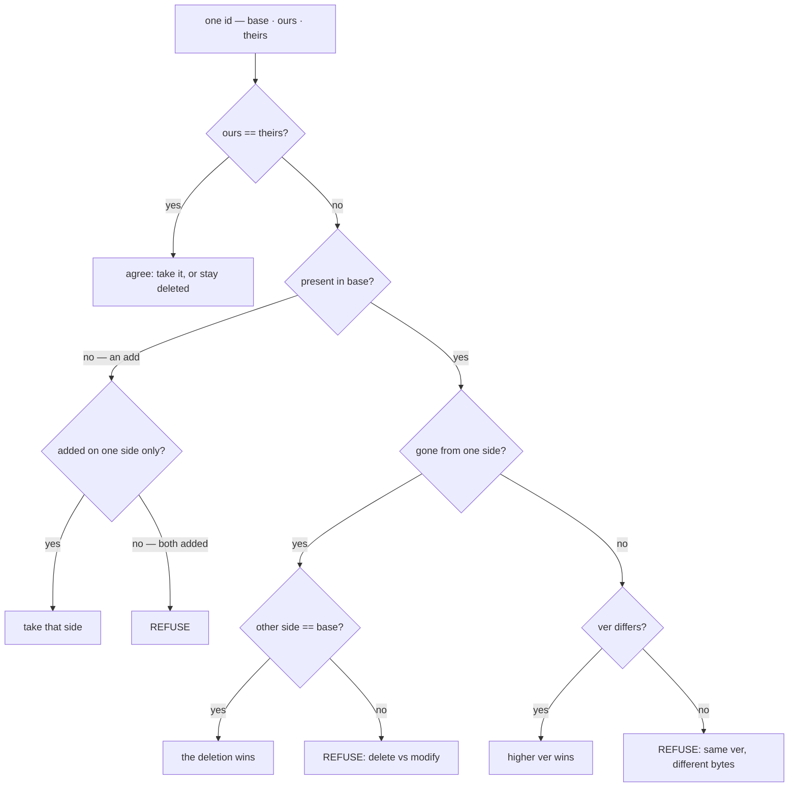

# ADR-MERGE-DRIVER: a machine plane that never conflicts on adjacency

- **Name:** `ADR-MERGE-DRIVER` — cite this everywhere; never cite the number
- **Status:** **accepted 2026-08-22 — and re-grounded on a measurement the same
  day.** It was first accepted on Arpit's *adjudication* of R6, not on a clean
  pass: [R6-MERGE](../../work/regression/2026-08-20-r6-merge-driver/VERDICT.md)
  read **INCONCLUSIVE** because its pre-registration's §3.1 and §3.2 disagree
  about this exact result, and the runner rightly refused to adjudicate it.
  **Arpit ruled §3.1 governs**: an uninformative tier *"does not count toward
  the pass"*, so tier 1 was dropped and the record judged on tiers 2 and 3.
  **W-67 then repaired the instrument and re-ran it:
  [R6-MERGE-RERUN](../../work/regression/2026-08-22-r6-rerun/VERDICT.md) is a
  PASS** — tier 1 re-specified to hash-select a shared shard is now
  *informative*, both machine tiers are informative, all three judged tiers
  match, and the verdict was read from a row written before the run.
  **Veto condition 2 is satisfied**, and this record no longer rests on a
  reading. Veto 5 did not fire: the repair left "does not count toward the
  pass" meaning exactly what it was ruled to mean, and added a `PARTIAL` row
  for the uncovered case rather than redefining the covered ones.
  **Two things this status still does not claim.** It does not claim R6-MERGE
  now reads PASS — **a filed verdict is never edited**, its `verdict:` field
  still says INCONCLUSIVE, and the re-run is a *second* verdict beside it, not
  a replacement. And the 2026-08-20 pre-registration was **not edited either**:
  the repair is a new instrument file, so the frozen one still governs the run
  it governed.
  The false-refusal defect ranked **P4** by the 2026-08-20 audit is fixed
  (Consequences, 2026-08-21)
- **Date:** 2026-08-21
- **Feature:** M5 — maintenance, the merge half
- **Owns:** `src/fux/maintain/mergedriver.py` — carved out of
  ADR-MAINTENANCE's claim on `src/fux/maintain/` on 2026-08-21; most specific
  wins, the same way ADR-CONFIG takes `config.py` out of ADR-DOTFUX. **The
  harness stays with ADR-MAINTENANCE**: `tools/maintenance-bench/` runs R5 and
  R6 from one file, and a component is owned once
- **Split from:** [ADR-MAINTENANCE](0032_hooks.md), which keeps the hooks, the
  installer that registers this driver, and L5 at write time
- **Laws:** L1, L3

---

## §1 — For humans

A shard of the committed index is a header line plus **one JSON line per
document, sorted by `id`**. Two people working at once produce two line sets
whose union is the correct answer — and a textual three-way merge cannot see
that. It sees neighbouring lines and reports a conflict on adjacency alone.
**A machine plane should never conflict on the mere fact that two people worked
at once**, and that is the whole reason this driver exists.

It resolves a document present on both sides by **last-writer-wins on
`(ver, sha)`**: `ver` increments exactly when a document's own `sha` changes,
so a higher `ver` is strictly later work. When it cannot tell who is later, it
**refuses** — ordinary conflict markers, both sides intact, a non-zero exit,
and the fix named in the message. A merge driver is the piece a user cannot
debug when it goes wrong, so its failure mode has to be *leave both sides*,
never *silently pick one*.



<details>
<summary><b>ASCII twin</b> — the same diagram, for terminals, diffs, and any reader without a Mermaid renderer</summary>

```text
  one id: base / ours / theirs
    |
    +-- ours == theirs? ----- yes --> agree: take it, or stay deleted
    |
    +-- no
        |
        +-- present in base? -- no --> added on one side only? -- yes --> take that side
        |                                                      +-- no  --> REFUSE (both added)
        +-- yes
            |
            +-- gone from one side? -- yes --> other side == base? -- yes --> the deletion wins
            |                                                      +-- no  --> REFUSE (delete vs modify)
            +-- no
                |
                +-- ver differs? -- yes --> higher ver wins
                                 +-- no  --> REFUSE (same ver, different bytes)
```

</details>

### Examples

Two branches, one shard: they added different documents, and theirs also
re-ingested `a.md`. The union is taken, the later `ver` wins, and the output is
sorted by id.

```console
$ fux-merge-index base.jsonl ours.jsonl theirs.jsonl ; echo "exit=$?"
exit=0
$ cat ours.jsonl
{"_format":"fux.index.v1","analyzer":"v1","tf_fields":["heading","body"]}
{"id":"file:docs/a.md","sha":"aaa2","ver":2}
{"id":"file:docs/b.md","sha":"bbb1","ver":1}
{"id":"file:docs/c.md","sha":"ccc1","ver":1}
```

The same document, derived differently on both sides at the same `ver` — the
one case last-writer-wins has no answer for:

```console
$ fux-merge-index b_base.jsonl b_ours.jsonl b_theirs.jsonl ; echo "exit=$?"
fux: cannot merge b_ours.jsonl — 1 document(s) changed on both sides at the same revision: file:docs/a.md
     Resolve by re-running `fux ingest`, which derives the index from the merged content rather than from either side's copy.
exit=1
$ cat b_ours.jsonl
<<<<<<< ours
{"_format":"fux.index.v1","analyzer":"v1","tf_fields":["heading","body"]}
{"id":"file:docs/a.md","sha":"aaa2","ver":2}
======= fux could not merge: file:docs/a.md
{"_format":"fux.index.v1","analyzer":"v1","tf_fields":["heading","body"]}
{"id":"file:docs/a.md","sha":"aaa3","ver":2}
>>>>>>> theirs
```

And at the git layer, the same merge twice — the control arm with the driver
unregistered, the treatment arm with it registered (carried over from
ADR-MAINTENANCE, where this record's decisions lived until 2026-08-21):

```console
# without the driver
$ git merge x
CONFLICT (content): Merge conflict in .fux/index/ad.jsonl

# with it
$ git merge x
Auto-merging .fux/index/ad.jsonl
Merge made by the 'ort' strategy.
```

> The first two are captured 2026-08-21 by running `merge_shards`' own `main()` over
> three-line fixture shards. The fixtures are reduced — a real record carries
> `terms`, `code` and `edges` — and the driver reads only `id` and `ver`.

> **Amended 2026-08-24 (W-76 Phases 1, 2 and 7) — one word in the aside.** *"A
> real record carries `terms`, `code` and `edges`"*: `code` was removed in
> Phase 1. A real record carries `terms`, `flen`, `vectors` and `edges`, plus
> the `mtime` and `superseded` priors when it has them —
> [ADR-RECORD](0010_index-record.md) holds the full list.
>
> **The clause it qualifies is the one that matters and it is untouched: the
> driver reads only `id` and `ver`.** That is why the fixture transcripts above
> are still valid evidence and are not re-captured — they would be
> byte-identical, because every field this amendment corrects is a field
> `merge_shards` never looks at. A driver that had to know the schema would
> need re-capturing on every phase of W-76; this one did not need re-capturing
> on any.

---

## §2 — For agents

### Context

The index is committed, which is the design point
([ADR-INDEX-LIFECYCLE](0009_index-lifecycle.md)): it diffs, it reviews, it
travels with the content it describes. The bill for that arrives on the first
merge. Two branches that each ingested a document write lines into the same
shard file, and git's textual merge reports a conflict on **adjacency** — the
lines are neighbours, not disagreements. A user hitting that is being asked to
hand-resolve a machine-written file, which is precisely the failure that makes
teams delete a generated file from git and never come back.

The shard's shape is what makes a better answer possible: a header line, then
one JSON line per document, sorted by `id`, one document per line and nothing
spanning lines ([ADR-POSTINGS](0013_postings.md),
[ADR-RECORD](0010_index-record.md)). A merge that understands the shape can
take the union.

**This record was decisions 6–9 of [ADR-MAINTENANCE](0032_hooks.md) until
2026-08-21.** It was carved out on Arpit's instruction because the driver is a
separate mechanism from the hooks — different failure mode, different gate
(R6, not R5), different blast radius — and it is the component with a
reproduced defect the 2026-08-20 audit ranked **P4**. Under
Law zero the change that fixes that defect must touch the record that owns the
file, and this is now that record. Nothing here is a new decision; what changed
is which file the decisions live in and who owns `mergedriver.py`.

### Decision

**1. Resolve by last-writer-wins on `(ver, sha)`.** For a document present on
both sides: a different `ver` means the higher one wins, and the same `ver`
with the same bytes means they agree. `ver` increments exactly when a
document's own `sha` changes ([ADR-RECORD](0010_index-record.md)), which is
what makes "higher" mean "later" rather than "noisier".

**`ver` is the tiebreak of last resort, not the first test.** The ancestor is
consulted first (decision 4): *"this side is byte-identical to what we both
started from"* is certain in a way `ver` is not — it holds even when the
writer on the other side failed to increment.

**2. Refuse in four cases, and refusing is the feature.**

| case | why it cannot be resolved |
|---|---|
| same `ver`, different bytes, **and neither side matches the ancestor** | two branches derived different records at the same revision — one ingested content the other did not have. The ancestor clause is decision 4: if either side is unchanged there is no disagreement to refuse |
| a deletion racing a modification | one side says gone, the other says changed |
| both sides added the same id, differently | the same disagreement, with no ancestor to appeal to |
| the header differs | a format change is a migration, not a merge |

A fifth case is not a policy but a floor: **a line that does not parse, or
carries no `id`, refuses the whole shard.** A driver that skipped it would
silently drop a document.

**3. A one-sided add is not a conflict, and the branch order is load-bearing.**
An id absent from the ancestor was *added*; if only one side has it, that side
wins. This test must run **before** the delete test, and the code carries the
comment saying so, because reversing them made every disjoint add look like a
delete-vs-modify race. The everyday case in a multi-author repo is two people
documenting different things, and it must cost nothing.

**4. A side byte-identical to the ancestor never wins and never blocks.** It
provably did not touch the document, so the other side's bytes are taken
outright. This arises in both branches, and the rule is the same in each:

- **one side deleted the id.** If the surviving side equals the ancestor,
  nobody disagreed and the deletion stands; if it changed, that is a real
  disagreement and case 2 applies.
- **both sides still have the id.** If either equals the ancestor, the other
  wins — *without consulting `ver`*. Testing `ver` first refuses this as "same
  `ver`, different bytes" whenever the changed side failed to increment (a
  hand repair, an external edit, an ingest edge case), which is a refusal
  where there is nothing to disagree about. That was the defect ranked P4;
  see Consequences.

**5. The merged output is sorted by id.** Two machines merging the same three
inputs produce the same bytes. Order is *rebuilt*, never carried over from
either input. Without this the driver would be a hole in
[ADR-LAWS](0001_laws.md) L3 the size of every collaborative repository.

**6. On refusal: ordinary conflict markers, both sides whole, exit non-zero,
and name the fix.** The markers are the thing a human already knows how to
fix, and the message names `fux ingest` — which derives the index from the
**merged content** rather than from either side's copy, and is therefore the
only resolution that cannot publish a record nobody produced. The driver never
picks a side.

**7. `fux-merge-index` is its own entry point, not a `fux` subcommand.** Git
invokes a merge driver as a bare command with positional arguments
(`%O %A %B`) and offers no way to pass a verb. `%A` is both *ours* and the file
git reads the result back from, so the driver writes its output there — on
success and on refusal alike.

**8. The driver decides behaviour; the installer decides wiring.** Registering
`merge.fux-index.driver` in the repository's **local** git config and appending
the `.fux/index/*.jsonl merge=fux-index` line to `.gitattributes` is
[ADR-MAINTENANCE](0032_hooks.md)'s `fux hooks`, and is not re-decided here.
The split matters for a reason a reader will hit: **an unregistered driver is
invisible, not broken** — git merges those shards textually and nothing
announces it.

### Consequences

- **The false refusal is fixed (P4, 2026-08-21).** Decision 4's ancestor check
  existed in the delete branch and was **missing from the modify/modify
  branch**: when one side's line is byte-identical to the ancestor, that side
  did not touch the document and the other side must simply win — previously
  this fell through to the `ver` comparison and, on an equal `ver`, was
  refused. `merge_shards()` now checks each side against `in_base` **before**
  falling back to `ver`, matching decision 4's own stated rule rather than
  only implementing half of it. Verified:
  `uv run pytest -q tests/maintain/test_mergedriver.py -k ancestor` — see
  `test_a_side_unchanged_from_the_ancestor_never_blocks_the_other_sides_edit`.
  Ranked **P4** by the 2026-08-20 audit, which called
  it the defect that "fires on most merges in a multi-author repo, which is
  the design point". It was a defect in this record's code, **not** a defect
  in decision 1 — the fix makes the driver do what decision 4 already said.
- **CRLF checkouts no longer corrupt the merge or leak into committed output
  (P4, 2026-08-21).** `main()` reads with the default universal-newline
  translation (CRLF/CR/LF all normalize to `\n` on read) and writes with
  `newline="\n"` explicitly, so a Windows checkout parses identically to a
  POSIX one and the driver never commits CRLF regardless of host OS — L3's
  byte-identical guarantee had no stated OS exception, and this closes the
  one place it could have gained one. Verified:
  `test_crlf_input_merges_and_output_is_lf_only`.
- **git does not invoke a content merge driver for an add/add**, where a shard
  file is created on both branches with no ancestor. Git resolves that at the
  tree level and reports `CONFLICT (add/add)`. **This is a real limitation and
  it is not worked around**: the fix is the one the driver already prints — run
  `fux ingest`, which regenerates the shard from merged content. Observed, not
  assumed.
- **R6 is INCONCLUSIVE, and the engine is not the reason** —
  [R6-MERGE](../../work/regression/2026-08-20-r6-merge-driver/VERDICT.md). All
  three tiers matched. Tier 2 (two documents sharing a shard) and tier 3 (a
  genuine disagreement, refused with both sides kept) are informative against a
  control arm with the driver unregistered. **Tier 1 merged cleanly with the
  driver removed as well**, because two documents added on two branches
  usually hash into two *different* shard files — so the everyday case turns
  out not to need the feature, and the tier proves nothing. A post-hoc tier 1b,
  with both documents selected to share a shard, conflicts in the control and
  merges cleanly in the treatment. Whether that reads as PASS under §3.1 or
  not-yet under §3.2 is Arpit's call, filed as
  [W-67](../../archive/open/W-67-r6-instrument-repair.md).
- **This repository does not have the driver registered.** `.gitattributes`
  carries no `merge=fux-index` line, so fux's own committed index merges
  textually today. Dogfooding the driver means running `fux hooks` here, which
  nobody has. Stated because decision 8 makes it silent.
- **A refusal leaves the shard unloadable until it is resolved**, by design:
  the conflict markers are not valid JSONL. That is the same contract a human
  merge conflict has, and it is why the message names the one command that
  resolves it correctly.
- **`ver` is load-bearing outside the writer, but no longer alone.** A writer
  that changes a record's bytes without incrementing `ver` still costs a
  refusal — but only when **both** sides changed, since decision 4 catches
  every case where one of them didn't. That is the difference between a
  latent correctness bug and a rare one. See veto condition 3.

### Alternatives considered

- **Always take the higher `ver`, including on ties.** Rejected: on a tie there
  is no later writer, so last-writer-wins has no answer, and picking one
  publishes a record nobody produced.
- **git's built-in `merge=union`, or a union-merge of the two line sets.**
  Rejected: a union leaves two records with the same `id`, which `write_index`
  rejects — the repository would be left in a state its own writer refuses to
  load.
- **`merge=ours` on the index, and let `fux ingest` clean up.** Rejected: it
  silently discards the other side's ingest, and the discard is invisible in
  the diff. Refusing costs a human thirty seconds; this costs them a document
  they cannot notice is missing.
- **Not committing the index at all**, which dissolves the problem. Out of
  scope here and decided elsewhere — [ADR-DOTFUX](0003_fux-directory.md) and
  [ADR-INDEX-LIFECYCLE](0009_index-lifecycle.md); the diffable committed plane
  is the architecture, not a convenience.
- **Sorting by `id` at write time and relying on git's line merge.** That is
  what already happens, and it is exactly what produces the adjacency conflicts
  this record exists to remove.
- **Teaching the driver to merge two records for the same document field by
  field.** Rejected: it invents a record neither side derived, from an index
  whose only correct source is the content. `fux ingest` does that job with the
  content in hand.

### Reference (required)

- `gitattributes(5)` §"Defining a custom merge driver" — the `%O %A %B`
  contract, that `%A` is read back as the result, and the exit-code semantics —
  <https://git-scm.com/docs/gitattributes#_defining_a_custom_merge_driver>
- The code: [`src/fux/maintain/mergedriver.py`](../../src/fux/maintain/mergedriver.py)
  — `merge_shards`, `MergeConflict`, `_conflict_text`, `main`
- The unit tests, including all four refusal cases:
  [`tests/maintain/test_mergedriver.py`](../../tests/maintain/test_mergedriver.py)
- The measured gate and its frozen threshold:
  [R6-MERGE](../../work/regression/2026-08-20-r6-merge-driver/VERDICT.md) and
  [`tools/maintenance-bench/PRE-REGISTRATION.md`](../../tools/maintenance-bench/PRE-REGISTRATION.md)
  (`d98874d`)
- The control-and-treatment behaviour test:
  [`tests_e2e/test_maintenance.py`](../../tests_e2e/test_maintenance.py)
- `ver` and `sha`, whose relationship decision 1 rests on:
  [ADR-RECORD](0010_index-record.md)
- The determinism law this record is bound by: [ADR-LAWS](0001_laws.md) L3

### Veto condition

**Reopen this decision if any of these becomes true:**

1. **The driver picks a side on a tie.** Same `ver`, different bytes, *neither
   side matching the ancestor*, exit 0. It must never — the ancestor clause is
   decision 4 resolving a non-tie, not a tie being broken.
2. **SPENT — satisfied 2026-08-22.** A re-specified R6 was run
   ([R6-MERGE-RERUN](../../work/regression/2026-08-22-r6-rerun/VERDICT.md)):
   tier 1 rebuilt so its two added documents share a shard, **PASS**, no
   machine plane conflicting and no human conflict silently resolved. Kept
   here, marked, so nobody re-fires a condition that has fired and been
   answered. **Its live successor is condition 6.**
5. **SPENT — did not fire, 2026-08-22.** The §3.1 reading was *not* overturned
   by W-67's repair: "does not count toward the pass" still means what it was
   ruled to mean, and the repair added a `PARTIAL` row for the case the table
   omitted rather than redefining a case it covered. Had the repair inverted
   that reading, this record would have returned to `proposed`.
6. **A future R6 run lands on `PARTIAL`** —
   [`PRE-REGISTRATION-R6-v2.md`](../../tools/maintenance-bench/PRE-REGISTRATION-R6-v2.md)
   §3.2's new row, meaning all tiers match but exactly one machine tier is
   informative. That is the shape of the 2026-08-20 result, and if it recurs
   against the repaired instrument then hash-selection did not fix what it was
   built to fix. The row routes to Arpit by construction; this condition is
   what makes it also reopen the record.
3. **`ver` stops being monotone in a document's own `sha`** — any writer that
   changes a record's bytes without incrementing it. Then "higher `ver`" no
   longer means "later work" and last-writer-wins is unfounded.
4. **A refusal is observed where one side is byte-identical to the ancestor.**
   Decision 4 says that case resolves. A refusal there is a regression, and
   the named test below is its tripwire.

**How to check them:**

```bash
# 1 — the four refusal cases
uv run pytest -q tests/maintain/test_mergedriver.py

# 2 — SPENT: satisfied 2026-08-22 by R6-MERGE-RERUN. 6 — re-run and read the
#     verdict word; PARTIAL reopens this record, FAIL returns it to proposed.
.venv/bin/python tools/maintenance-bench/run.py --only r6
# governed by tools/maintenance-bench/PRE-REGISTRATION-R6-v2.md (NOT the
# 2026-08-20 file, which still governs the run it governed)

# 3 — no writer may change bytes without touching ver
rg -n '"ver"' src/fux/store/ src/fux/ingest/

# 4 — passes (P4 landed 2026-08-21, see Consequences):
uv run pytest -q tests/maintain/test_mergedriver.py -k ancestor
```
---

## References

*Every source this record cites, gathered in one place. §2's **Reference
(required)** names the grounding; this is the complete list. An archived
document is never listed here — the body may name one, but archive is not
evidence.*

**Records** — [ADR-LAWS](0001_laws.md) · [ADR-DOTFUX](0003_fux-directory.md) ·
[ADR-INDEX-LIFECYCLE](0009_index-lifecycle.md) ·
[ADR-RECORD](0010_index-record.md) · [ADR-POSTINGS](0013_postings.md) ·
[ADR-MAINTENANCE](0032_hooks.md)

**Code**

- [`src/fux/maintain/mergedriver.py`](../../src/fux/maintain/mergedriver.py)
- [`tests/maintain/test_mergedriver.py`](../../tests/maintain/test_mergedriver.py)
- [`tests_e2e/test_maintenance.py`](../../tests_e2e/test_maintenance.py)

**Measured evidence**

- [`tools/maintenance-bench/PRE-REGISTRATION-R6-v2.md`](../../tools/maintenance-bench/PRE-REGISTRATION-R6-v2.md)
- [`tools/maintenance-bench/PRE-REGISTRATION.md`](../../tools/maintenance-bench/PRE-REGISTRATION.md)
- [`work/regression/2026-08-20-r6-merge-driver/VERDICT.md`](../../work/regression/2026-08-20-r6-merge-driver/VERDICT.md)
- [`work/regression/2026-08-22-r6-rerun/VERDICT.md`](../../work/regression/2026-08-22-r6-rerun/VERDICT.md)

**Papers and specifications**

- `gitattributes(5)` §Defining a custom merge driver — what the installer must
  write for git to call the driver at all
  <https://git-scm.com/docs/gitattributes#_defining_a_custom_merge_driver>
