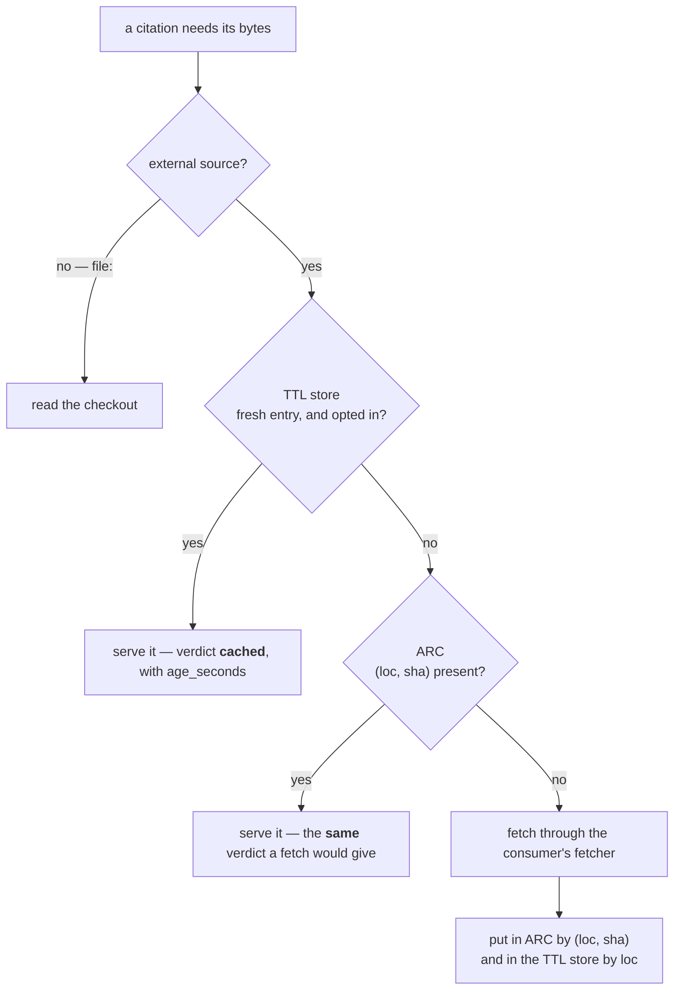

# ADR-CACHE: two caches, and the wall between them

- **Name:** `ADR-CACHE` — cite this everywhere; never cite the number
- **Status:** proposed — carries [ADR-REFER](0030_refer-plane.md)'s status
  unchanged; nothing here is a new decision, and acceptance is Arpit's on the
  same terms
- **Date:** 2026-08-21
- **Feature:** M4 — the refer plane's two caches
- **Owns:** `src/fux/refer/arc.py` · `src/fux/refer/fetchcache.py` — carved out
  of ADR-REFER's claim on `src/fux/refer/` on 2026-08-21; most specific wins,
  the same way [ADR-MERGE-DRIVER](0033_merge-driver.md) takes
  `mergedriver.py` out of ADR-MAINTENANCE's directory-level claim. **The bench
  stays with ADR-REFER**: `tools/refer-bench/` runs R4 for the whole plane, and
  a component is owned once
- **Split from:** [ADR-REFER](0030_refer-plane.md), which keeps the fetch
  contract, verification, chunking, rescoring and the byte budget
- **Laws:** L1, L2, L3, L5 — see [ADR-LAWS](0001_laws.md); never restated here

---

## §1 — For humans

There are **two caches** in the refer plane and they answer two different
questions. `ARC` — an **Adaptive Replacement Cache**, an eviction policy that
self-tunes between recency and frequency — holds *what a fetch returned*.
`FetchCache` — a **TTL** (*time-to-live*) store, where an entry may be served
without consulting the source for a fixed number of seconds after it was
fetched — holds *whether a fetch is needed at all*. They look similar enough
to merge and they must never be merged, because only one of them can prove it
is harmless.

ARC's key is `(loc, sha)` — the content address is **inside the key**. A hit is
therefore byte-identical to what a fetch would have returned, or it is not a
hit, and that single property is what makes the cache safe to be aggressive
with. The TTL store has no such proof available to it: a TTL entry is served
*before* the sha is confirmed, because that is what a TTL is. So it gets its
own store on disk, it is off unless a caller asks for it, and an answer it
serves is labelled `cached`, never `current`.

The order is fixed: ask the TTL store whether to go out, then ask ARC what came
back last time, then go out. Only external sources consult the TTL store — a
`file:` document in the local checkout is not a fetch and has nothing to cache.



<details>
<summary><b>ASCII twin</b> — the same diagram, for terminals, diffs, and any reader without a Mermaid renderer</summary>

```text
  a citation needs its bytes
    |
    +-- external source? -- no (file:) --> read the checkout
    |
    +-- yes
        |
        +-- TTL store: fresh entry AND opted in? -- yes --> serve it
        |                                                   verdict = cached (+ age_seconds)
        +-- no
            |
            +-- ARC: is (loc, sha) present? -- yes --> serve it
            |                                          the SAME verdict a fetch would give
            +-- no
                |
                +-- fetch through the consumer's fetcher
                        |
                        +--> put in ARC      keyed (loc, sha)   [in memory, this process]
                        +--> put in TTL store keyed loc         [on disk, gitignored]
```

</details>

### Examples

The wall between the two stores, as the code states it — ARC's key carries the
content address, the TTL store's key does not:

```console
$ grep -n 'CacheKey = ' src/fux/refer/arc.py
28:CacheKey = tuple[str, str]  # (loc, sha) — the content address is part of the key

$ grep -n 'def _path' -A 3 src/fux/refer/fetchcache.py
    def _path(self, loc: str) -> Path:
        # Hashed filename: a `loc` is a URL and contains `/`, `?` and `:`.
        digest = hashlib.sha256(loc.encode("utf-8")).hexdigest()[:32]
        return self.directory / f"{digest}.json"
```

The default that makes the TTL store unreachable until a caller asks for it —
`cache_ttl_seconds = 0`, and `no_cache` beating any TTL:

```console
$ grep -n 'def caches' -A 3 src/fux/refer/freshness.py
    def caches(self) -> bool:
        """True when a cached copy may be served. `no_cache` always wins."""
        return self.cache_ttl_seconds > 0 and not self.no_cache
```

---

## §2 — For agents

### Context

The refer plane fetches a cited document, checks its bytes against the sha the
index recorded, and quotes it ([ADR-REFER](0030_refer-plane.md) decisions 1–5).
A fetch costs 0.5–2 s of network, and at enterprise scale it costs something
worse: Confluence Cloud's REST API is rate-limited against a shared hourly
point budget, and Atlassian's own avoidance guidance is to cache stable
responses. An agent asking ten questions about one runbook must not fetch it
ten times — that is not slow, it is **throttled**, and a throttled fetch
degrades to `unverified` for reasons that have nothing to do with the document.

So there is real pressure to cache, and caching is exactly where a retrieval
engine loses its correctness guarantees quietly. The whole design problem is
that the two useful caches have **different epistemic standing**, and only one
of them can be proven not to change an answer.

**These decisions were ADR-REFER's 5a, 5b, 5c and 9 until 2026-08-21.** They
were carved out because caching is a separate mechanism from the plane that
uses it — a different failure mode (a wrong answer, or a leaked byte, rather
than a missing citation), a different law surface (L2 and L5, not just L3), and
two files that a future change will touch together and touch alone. Under Law
zero the change that touches `arc.py` or `fetchcache.py` must touch the record
that owns them, and this is now that record. **Nothing here is a new decision**;
what changed is which file the decisions live in and who owns the two modules.
The replacement-policy fork itself was settled earlier, in
[`cache-policy.compare.md`](../../work/compare/cache-policy.compare.md), and the
TTL fork in
[`refer-fetch-cache.compare.md`](../../work/compare/refer-fetch-cache.compare.md)
(Arpit's verdict **F**, 2026-08-20).

### Decision

**1. Two stores, and the separation is load-bearing.** ARC is keyed
`(loc, sha)`; the TTL store is keyed `loc` alone. Putting a TTL entry in ARC's
keyspace would serve bytes under a key that no longer proves anything — and the
proof would be gone with no test left to notice, because ARC's differential
test would still pass on entries that arrived the old way. Two stores, provably
separate: **ARC caches what a fetch returned; the TTL store caches whether a
fetch is needed at all.**

**2. ARC cannot change an answer, and that is a property of the key.** The
content address is in the key, so a hit is byte-identical to what a fetch would
have returned or it is not a hit. A hit therefore yields **the same verdict a
fetch would have yielded** — not a different, softer one. The bundle records
what was learned about the *document*; hit and miss counts are instrumentation
and live on the `ARC` object.

> This was caught being got wrong while it was being written. The first
> cache-hit path wrote `"note": "cache hit"` into the bundle, so a caller
> diffing two runs would have seen a difference caused purely by cache state.
> The differential test is what found it, which is the argument for having one.

**3. ARC, not LRU (least-recently-used), and there is no knob.** A miss here is a network fetch, not
a page fault, so the cost asymmetry is enormous — and a hook re-indexing after
a large merge is exactly the bulk scan that flushes an LRU's hot set. ARC is
scan-resistant and self-tunes between recency and frequency with no
configuration, which matters on a tool where every configurable value is
permanent. ~150 LOC from the FAST '03 paper; the IBM patent has expired.

**4. ARC reads no clock.** Recency is a monotonic ordering over the four lists,
never a timestamp. A cache that reads the clock makes the engine's output
depend on when it ran, and L3 has no exception for "only in the cache".

**5. ARC is bounded in bytes, and so are its ghosts.** `max_bytes` bounds live
content; a single object larger than the whole budget is never admitted rather
than evicting everything else for it. The `b1`/`b2` ghost lists hold keys, not
content — but they are bounded too, at `max_bytes // 64` entries. An unbounded
ghost list is a slow memory leak that looks like nothing, which is the worst
shape a leak can have.

**6. The TTL store is opt-in, and `no_cache` always wins.**
`Policy.cache_ttl_seconds` defaults to **0 — the cache disabled** — and the
disable check runs **first and unconditionally** in `get()`, so a caller who
never opted in cannot be served a cached byte by any code path.
`Policy.no_cache` refuses caching outright whatever the TTL says: the escape
hatch for access-controlled and regulated sources, where a local copy
outliving the reader's permission is the risk L5 exists for. Arpit's TTL
number, when a caller does opt in, is **300 s** (2026-08-20).

**This does not touch L2's single exception** (the per-source `snapshot`
policy). L2 forbids *durable* content; this store is deliberately the opposite
— unindexed, gitignored, TTL-bounded, default-off, and confined to one machine.
Nothing here is ever committed, so there is nothing for L2 to except.

**7. `cached` is a fourth verdict and is never folded into `current`.** A TTL
hit is a distinct epistemic position — *we looked recently* — and it carries
its `age_seconds` so a caller can decide for itself. It still records whether
the cached bytes matched the index, because dropping that would make the
verdict a smaller claim than the truth. Collapsing `cached` into `current`
anywhere downstream is ADR-REFER decision 4's "knob that lies" reappearing in
a new location, and it is refused for the same reason.

**8. Wall clock lives in the TTL store and nowhere else.** It gets the same
treatment `runtime/stamp.json` already has
([ADR-RUNTIME-STAMP](0027_runtime-stamp.md)): derived, per-machine,
non-reproducible, gitignored, never reaching a committed record. The clock is
**injected** (`FetchCache(root, clock=...)`) so a test can pin it. The engine's
*answers* never read the clock; only the decision of whether to re-fetch does.

**Decision 4 of ADR-REFER is untouched by this** — the committed record still
carries no ingest time. A reader must not conflate the two: one is a local note
about *when we last looked*, the other would be a committed claim about *when a
document was ingested*, and that question closed separately as *no*
([`record-freshness.compare.md`](../../work/compare/record-freshness.compare.md)).

**9. The TTL store is bounded on disk, evicting oldest `fetched_at` first.**
`max_bytes`, default **500 MB** — a number chosen here, not specified — bounds
total size under `.fux/runtime/fetch-cache/`. `put()` deletes the oldest
entries by `fetched_at` to make room, and **refuses** a single entry that alone
exceeds the cap rather than evicting everything else for it. Entries that
cannot be read at all are evicted first.

**10. Both caches are disposable, and a corrupt entry is a miss.** A malformed
or hand-edited TTL entry, or a digest collision on the hashed filename, returns
`None` — never an error. A query must not die for a cache, and deleting either
store is always safe: the next query fetches. The directory nests inside the
already-tagged `runtime/` ([ADR-CACHEDIR-TAG](0023_cachedir-tag.md)), so backup
and archive tools skip it for free.

**11. Only external sources consult the TTL store.** Reading a `file:` document
from the local checkout is not a fetch — no network, no cost, no policy
question — so there is nothing to cache and the git strategy skips the store
entirely. This mirrors ADR-REFER decision 7.

**12. The consultation order is TTL store, then ARC, then the network**, and
on a real fetch both stores are written. The TTL store is asked first because
it answers the cheaper question: a hit there means no network call *and* no sha
comparison against a live source.

### Consequences

- **ARC is in-memory and per-process; the TTL store is on disk and outlives
  the process.** That asymmetry is intentional and worth stating, because it is
  the difference a reader will trip on: ARC's lifetime is a query session, and
  a fresh process starts cold no matter what was cached a second ago. Only the
  TTL store spans runs, which is exactly why it is the one with a permission
  question attached.
- **The ARC differential passes.** Cached, cold-cached and uncached bundles are
  byte-identical — the same discipline M2 established for the accelerator, and
  the reason decision 2 is a claim rather than a hope.
- **The ACL-staleness window is real and is accepted, not closed.** An access
  grant can be revoked at the source between a cache write and a
  `cached`-labelled serve inside the TTL. `no_cache` is the mitigation and it
  is **advisory today** — a caller must set it. Veto condition 7 is what turns
  it mandatory, and the short default TTL is what bounds the exposure
  meanwhile.
- **ARC-vs-LRU was measured post-hoc at R4, and Arpit ruled on it directly,
  2026-08-22.** The metric changed after seeing a number that reversed it
  (+0.91 pts overall / +2.50 on hot requests against a 2-pt bar set before
  the run) — post-hoc by definition, and on a synthetic trace where the
  compare doc's trigger asked for a real workload. **Arpit reviewed that
  reasoning directly and ruled it stands: ARC wins.**
  [`cache-policy.compare.md`](../../work/compare/cache-policy.compare.md)'s
  reopen trigger is therefore closed against R4 — it does **not** un-fire on
  its own; a future measurement on real Fux workloads showing no advantage
  over LRU would still reopen this (veto condition 6). Decision 3 rests on
  the published result, the scan-resistance argument, and now this ruling —
  not on a from-scratch Fux measurement, stated plainly rather than left for
  a reader to assume.
- **The size cap on the TTL store landed 2026-08-21** (PRIORITY.md P4).
  `put()` was unbounded: an entry only stopped counting toward `get()` once its
  TTL passed, and nothing ever deleted the file, so a long-lived process
  caching many documents grew the directory without limit.
- **The freshness gate's baseline moved forward, and that is a real cost.**
  A carve-out is retroactive: `0264510` (the P4 size cap) touched
  `fetchcache.py` and ADR-REFER, which was the owning record **at the time**, so
  it was compliant when it was written — reassigning the file makes it look like
  a violation it never was. `docs/adr/RULE-SINCE` moved from `1fc51a7` to
  `301c65a` after re-auditing every commit in between under the pre-carve-out
  table (192 checks, all passing). The price is that those commits are no longer
  re-auditable by the gate, and it is stated here rather than left in a comment
  nobody reads.
- **Both terms are defined in [`docs/GLOSSARY.md`](../GLOSSARY.md), and one of
  them was missing.** `ARC` had an entry that predated this record and still
  pointed only at the compare doc; **`TTL` had no entry at all**, despite being
  a v0.30 recurring term since W-60 landed on 2026-08-20. Both are now defined
  and cite this record — a term used across an ADR, a compare doc, a policy
  field and a verdict label, with no definition, is exactly what the glossary
  rule exists to prevent.
- **Two files move out of ADR-REFER's blast radius.** A change to caching now
  fails the freshness gate against *this* record, which is the point of the
  carve-out. ADR-REFER's decisions 5a/5b/5c and 9 become pointers here and
  their numbers are **retired, not reused**, so every doc citing "ADR-REFER
  decision 9" still resolves to something true.

### Alternatives considered

- **One cache instead of two** — put the TTL entries in ARC's keyspace.
  Rejected: decision 1. It costs ARC's correctness proof, and nothing would
  notice.
- **LRU** (carry the v0.26 profile forward). Rejected: simplest, and
  scan-flushable — precisely the failure mode a re-index after a large merge
  produces, where a miss costs a live fetch. Kept as a drop-in downgrade if the
  compare doc's reopen trigger fires.
- **2Q / TinyLFU-class.** Rejected: comparable gains, more tuning surface, a
  weaker fit for a small dependency-free target.
- **`max_age_seconds` on the committed record instead of a local TTL.**
  Rejected and closed elsewhere — the record carries no ingest time and adding
  one breaks reproducibility
  ([`record-freshness.compare.md`](../../work/compare/record-freshness.compare.md),
  Arpit's verdict D). The TTL lives in gitignored cache metadata precisely so
  that decision stays untouched.
- **Serving a TTL hit as `current`.** Rejected: decision 7. It would make the
  verdict a larger claim than the evidence supports, in the one place a caller
  cannot check.
- **TTL on by default.** Rejected: a default that serves unverified bytes to a
  caller who never asked is the same class of error as a knob that lies. Off
  by default, opt-in per caller, same shape as `mode = snapshot`.

### Reference (required)

- The code — [`src/fux/refer/arc.py`](../../src/fux/refer/arc.py) (`ARC`,
  `CacheKey`, `_evict`, `_trim_ghosts`) and
  [`src/fux/refer/fetchcache.py`](../../src/fux/refer/fetchcache.py)
  (`FetchCache`, `CacheEntry`, `DEFAULT_TTL_SECONDS`, `DEFAULT_MAX_BYTES`,
  `_evict_to_fit`)
- The call site, where the consultation order of decision 12 is written —
  [`src/fux/refer/__init__.py`](../../src/fux/refer/__init__.py) (`_obtain`)
- The verdict and the policy knobs —
  [`src/fux/refer/freshness.py`](../../src/fux/refer/freshness.py) (`Policy`,
  `Verdict.label`, `cached`)
- The tests — [`tests/refer/test_arc.py`](../../tests/refer/test_arc.py) and
  [`tests/refer/test_fetchcache.py`](../../tests/refer/test_fetchcache.py)
- Megiddo & Modha, *ARC: A Self-Tuning, Low Overhead Replacement Cache*,
  FAST '03 — <https://www.usenix.org/legacy/events/fast03/tech/megiddo.html>
- `stale-while-revalidate`, RFC 5861 — the shape decision 7 refuses to blur —
  <https://httpwg.org/specs/rfc5861.html>
- Confluence Cloud rate limiting and Atlassian's own caching guidance — the
  context decision 6 exists for —
  <https://developer.atlassian.com/cloud/confluence/rate-limiting/>
- The forks this record does not re-argue —
  [`cache-policy.compare.md`](../../work/compare/cache-policy.compare.md) ·
  [`refer-fetch-cache.compare.md`](../../work/compare/refer-fetch-cache.compare.md)
- The measured run that exercised the warm path —
  [R4-REFER](../../work/regression/2026-08-20-refer-plane-r4/VERDICT.md)
- The parent record — [ADR-REFER](0030_refer-plane.md), decisions 4, 6, 7
- The precedent for a per-machine, non-reproducible artifact —
  [ADR-RUNTIME-STAMP](0027_runtime-stamp.md)

### Veto condition

**Reopen this decision if any of these becomes true:**

1. **A cached answer differs from an uncached one.** Any byte, anywhere in the
   bundle. Decision 2 is the whole reason ARC is allowed to exist.
2. **`arc.py` reads a clock** — any timestamp, any `time` import, any mtime.
   Decision 4 has no exception.
3. **A `cached` verdict appears when `cache_ttl_seconds` is 0**, or `cached`
   is collapsed into `current` anywhere downstream.
4. **A cached byte reaches a committed file.** Anything under `.fux/index/`, or
   any path git tracks, containing content served from either store.
5. **`.fux/runtime/fetch-cache/` exceeds `max_bytes` on disk.** Decision 9's
   eviction is what stands between a disposable cache and a full disk.
6. **A measured hit-rate on real Fux workloads shows ARC no better than LRU.**
   Then take the simpler code — the interface is identical and the downgrade is
   a drop-in. This is the compare doc's own trigger. R4's post-hoc result does
   **not** count as this happening — Arpit reviewed it 2026-08-22 and ruled ARC
   wins — so this condition still checks only against a future real-workload
   measurement, not against R4.
7. **A real workflow shows the ACL-staleness window produced a wrong-access
   answer** — a caller saw content from a source they had since lost access to,
   inside the TTL. At that point `no_cache` stops being advisory for
   access-controlled sources and becomes mandatory, checked at ingest.

**How to check them:**

```bash
# 1 and 3 — the differential, and the opt-in default
uv run pytest -q tests/refer/test_arc.py tests/refer/test_fetchcache.py

# 2 — the cache that must not know what time it is
rg -n 'time|clock|datetime|mtime' src/fux/refer/arc.py   # expect: no output

# 4 — nothing from either store is tracked
git ls-files | rg 'fetch-cache'                          # expect: no output

# 5 — the directory stays under its cap (default 500 MB)
du -sh .fux/runtime/fetch-cache 2>/dev/null || echo "absent — nothing opted in"

# 6 and 7 — measured/observed, not checkable from the tree; see the compare docs
```
