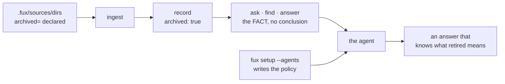

# ADR-AGENT-POLICY: shipping the policy, not just the facts

- **Name:** `ADR-AGENT-POLICY` — cite this everywhere; never cite the number
- **Status:** **accepted 2026-08-22 — and built the same day** (W-68). The
  layering was Arpit's call, the policy text came first, and the installer now
  exists: `fux setup` writes all four renderings by default, `--no-agents` and
  `[agents] install = []` write none, and every path outside `.fux/` is named
  in the output along with how to turn it off. Decision 5's default-on ruling
  is Arpit's, taken 2026-08-22, and is what made the announcement mandatory
  rather than courteous. Graduated from
  [`archive/proposals/consumer-intent-policy.md`](../../archive/proposals/consumer-intent-policy.md)
- **Date:** 2026-08-22
- **Feature:** the agent-facing policy artifacts Fux ships, and their installer
- **Owns:** `src/fux/templates/agents/` — the canonical policy and its four
  per-vendor renderings, shipped as wheel package data. **Both they and the
  installer exist as of 2026-08-22.** **`src/fux/setup.py` stays with
  [ADR-DOTFUX](0003_fux-directory.md)**; this record *amends* it for the call
  site rather than claiming it, because one component is owned once
- **Amends:** [ADR-DOTFUX](0003_fux-directory.md) — `fux setup` gains a second
  kind of output · [ADR-CLI](0002_cli-surface.md) — `fux setup` gains a flag
- **Laws:** L1, L6

---

## §1 — For humans

**Fux's readers are agents.** That is the product's whole premise, and it has a
consequence nobody wrote down until now: **an engine whose output is
systematically misread is an engine that does not work**, however correct its
index. Correctness that does not survive the reader is not correctness.

The concrete case is archived documents.
[ADR-DIR-LIST](0022_dir-list.md) decision 12 makes Fux state a **fact** — *this
document is retired* — and deliberately **states no conclusion**, because the
right conclusion depends on why the question was asked. That is the honest
design, and it leaves a gap: *somebody* has to supply the conclusion.

**This record says who: the consuming agent, using policy Fux ships.**



<details>
<summary><b>ASCII twin</b> — the same diagram, for terminals, diffs, and any reader without a Mermaid renderer</summary>

```text
  .fux/sources/dirs (archived=) --> ingest --> record: archived: true
                                                        |
                                                        v
                                    ask . find . answer  =  THE FACT
                                                        |    (no conclusion)
   fux setup --agents  --> policy files -----------------+--> the agent
                          (Claude . Copilot . Kiro)      |
                                                         v
                                        an answer that knows what retired means

  Fux states what IS. The agent decides what to DO. Neither alone is the mechanism.
```

</details>

### Examples

**What `fux setup` writes, and only when asked:**

```console
$ fux setup
  wrote fux.toml
  wrote .fux/sources/dirs
  wrote .claude/skills/fux-archived-results/SKILL.md
  wrote .github/agents/fux.agent.md
  wrote .github/instructions/fux-archived-results.instructions.md
  wrote .kiro/steering/fux-archived-results.md

  note: the last four are OUTSIDE .fux/ — they teach Claude, Copilot and Kiro
        how to read this index. Turn them off with [agents] install = [] in
        fux.toml, or `fux setup --no-agents`.
```

**The announcement is the safeguard, not a courtesy.** These land in directories
GitHub, AWS and Anthropic own, so a user who did not want them must be able to
learn they exist from the terminal they just ran — not from a later `git status`
on a repository they share with a team.

**Opting out is a declaration, and it persists:**

```console
$ fux setup --no-agents
  wrote fux.toml          # [agents] install = []
  wrote .fux/sources/dirs
```

---

## §2 — For agents

### Context

Fux indexes retired documentation deliberately — it is the honest answer to
*"why does this look the way it does"* — and marks it rather than hiding it.
[ADR-DIR-LIST](0022_dir-list.md) decision 12, amended 2026-08-22, makes the
disclaimer **intent-neutral**: it says what archived *is* and stops, because the
same document is **the answer** to a history question, **misleading** to an
architecture question, and **dangerous** to a build task. Arpit's observation
that opened this: *"the question could be from a business point of view, an
architecture point of view, or an agent building something — and maybe more."*

**The engine must not carry that taxonomy** (ADR-DIR-LIST decision 12 rejects
`--intent=`): the list of stances is open, and a provably incomplete enum invites
callers to squeeze a fourth stance into the closest of three. The
[refer plane](0030_refer-plane.md) set the precedent — it returns
`current`/`stale`/`unverified` and **refuses to collapse "we did not look" into
"we looked and it was fine"**, because *"three callers want three different
answers from the same index."*

So the policy lives with the caller. The question this record answers is whether
Fux **ships** it. Arpit: yes, through `fux setup`.

### Decision

**1. Fux ships agent policy, and it is a product decision rather than a
convenience.** A tool whose stated audience is agents, that emits a fact no
agent knows how to read, has shipped half a feature. The measured case is this
repository's own: *"what is the ingest cache"* returns **5/5 archived**
documents describing a subsystem `CLAUDE.md` forbids porting back. An agent
acting on that answer reintroduces a deleted design, confidently and with
citations.

**2. One canonical policy, carried as a VERBATIM block, not as a restatement.**
`src/fux/templates/agents/POLICY.md` is the source of truth, and the eight rules
live between `<!-- fux:policy:begin v1 -->` and `<!-- fux:policy:end v1 -->`.
**Every rendering includes that block byte for byte.** Format-native framing may
surround it — a Kiro table, a Copilot heading, a skill's worked example — but
the block itself may not be reworded, reordered, or partially included.

**This shape was forced by a failure, on the first run of the check that was
supposed to confirm it.** The renderings had been written to *say the same
thing*: "never drop the mark when you summarise" against "never drop the
archived mark when summarising". Same meaning, different bytes — and **no
substring test can tell a legitimate rewording from a dropped rule**. A test
that cannot fail correctly is worse than no test, because it certifies
agreement it never checked.

So agreement is **exact match on a shared block**, which is the same device this
project already uses for a Mermaid diagram and its ASCII twin: two
representations, one asserted to match. *A rule changed in one rendering and not
the others is worse than no policy at all,* because two agents then disagree
about the same output.

**The renderings stay hand-written** — four short files do not earn a generator,
and L1 keeps the dependency budget at zero. The block is what makes that safe.

**3. Three consumers now, and the set is open by construction.** Claude
(skills), GitHub Copilot (custom agents **and** ambient instructions), Kiro
(steering). Adding a fourth is a template plus a rendering plus a row — **not a
new decision**, so this record does not need reopening for it. What *would*
reopen it is a vendor changing its format, which is veto condition 2.

**4. Copilot gets two files, and they are not alternatives.** The **agent**
(`.github/agents/fux.agent.md`) fires when selected or routed to; the
**instructions** (`applyTo:`) fire on every matching request. **The gap between
them is the dangerous case**: someone runs `fux ask` in a terminal, pastes the
output into chat, and the agent was never invoked — but the archived results are
still there. Ambient instructions cover that. Ship both.

**5. Installed from a DECLARATION, never from detection — and the declaration
ships COMPLETE.** Arpit, 2026-08-22: **`fux setup` installs all three by
default.** `fux.toml` carries

```toml
[agents]
install = ["claude", "copilot", "kiro"]
```

**written out in full by `setup`, not left implicit.** That is not a new idea
here — `setup.py` already does exactly this for the type allowlist, with the
reason in its own comment: *"written with the default spelled out rather than
left implicit: a consumer should be able to see what fux considers a document
without reading its source."* A default a user can read and edit in a file they
own is a different thing from a default buried in the engine.

**Detection is still refused.** Fux never sniffs for `.kiro/` or `.github/` and
infers intent — that is precisely the derivation
[ADR-DIR-LIST](0022_dir-list.md) decision 4 refused for `archived`, and the
reasoning transfers unchanged: a heuristic is exact for the repo it was written
against and a silent convention for everyone else. **Install-all-by-default and
declared-never-derived are compatible** because the declaration is written down,
visibly, at the moment of install.

**Why all three rather than opt-in.** An opt-in flag is a feature nobody knows
exists, so the policy layer would be present in the product and absent in every
repository — and **the failure it prevents is silent**: an agent confidently
citing a deleted design, with a correct-looking citation. Fux's whole premise is
that its readers are agents; shipping an engine whose output is misread by
default is shipping half of it.

**6. `setup` writes outside `.fux/`, and must SAY so — loudly, every time.**
Everything `fux setup` wrote before this record lived in fux's own territory —
`.fux/**` and `fux.toml`. These land in **`.github/`, `.kiro/` and `.claude/`,
which belong to GitHub, AWS and Anthropic.**

Arpit ruled that it writes them by default (decision 5), so **the announcement
is no longer a courtesy — it is the entire remaining safeguard**, and it is
therefore mandatory rather than nice-to-have. `setup` names every path it wrote
outside `.fux/`, and names the `[agents]` key that turns them off. A user who
did not want them must be able to learn that they exist from the terminal they
just ran, not from a later `git status` on a repository they share with a team.

**`--no-agents` exists for the same reason**, and `install = []` in `fux.toml`
is its durable form: a one-shot escape for the run, a declaration for every run
after.

⚠ **The cost this actually carries, stated rather than discovered.** Two of the
four renderings are **ambient** — the Copilot instructions (`applyTo: "**"`) and
the Kiro steering (`inclusion: always`) enter *every* request in that repository,
for every developer, whether or not they are using Fux at that moment. That is a
standing context tax imposed by a tool they installed for something else. Two
things keep it defensible and both are obligations, not observations:
**the renderings stay short** — they are ~2 KB each and any growth is a
regression, not an improvement — and **`setup` announces them**, so the tax is
visible to whoever pays it.

**7. Write-if-missing, inherited rather than reinvented.** `setup.py` already
reads templates out of the wheel (`template_bytes` — *"read, never imported"*)
and lays them down with `_write_if_missing`. A consumer's edit is never
overwritten, on any later `fux setup`. **The corollary is that a stale policy
file is invisible**, which is what decision 8 exists for.

**8. Every rendering carries `policy-version`.** In frontmatter where the vendor
allows it, in a comment where it does not. A file the consumer has edited is
theirs and stays; a file three versions behind is at least **identifiable**, and
`fux doctor` is where that would surface. Without this, write-if-missing means
"install once, drift forever."

### Consequences

- **Fux now owns three third-party formats it does not control.** This is a real
  maintenance liability and it is not hypothetical: **between drafting these
  files and revising them — inside one working session — GitHub's recommended
  surface moved from instructions to custom agents.** Decisions 2, 7 and 8 are
  the mitigations; none of them makes the liability go away.
- **`fux setup` gains a flag**, which is [ADR-CLI](0002_cli-surface.md)'s
  surface to record, and a second *kind* of output, which is
  [ADR-DOTFUX](0003_fux-directory.md)'s scaffolding contract to widen. Both are
  amended by this record rather than claimed.
- **The policy is prose, and prose is not enforceable.** Fux cannot verify that
  an agent obeyed it. What Fux can do — and decision 2's test does — is
  guarantee every agent was *told the same thing*.
- **`--json` is the stable contract, the prose is not.** Every rendering says
  *branch on the `archived` boolean, never on the note's wording*, so a future
  reword cannot break a consumer.

### Alternatives considered

| | why not |
|---|---|
| **Document the policy, ship nothing** | every user writes their own, most write none, and the failure is silent — an agent confidently citing a deleted design |
| **`fux ask --intent=build`** | rejected in [ADR-DIR-LIST](0022_dir-list.md) decision 12: the stance list is open, and it puts policy inside an engine whose argument is that it ships facts |
| **One file for all agents (`AGENTS.md`)** | a real convention and worth watching, but Claude skills and Kiro steering both need their own frontmatter to load at all. A shared file that no tool loads natively is a file nobody reads |
| **Detect installed agents and write accordingly** | derivation, not declaration — decision 5. Exact for the repo it was written against, a silent convention everywhere else |
| **Opt-in behind `--agents`** | **drafted this way, then overruled by Arpit on 2026-08-22.** A flag nobody knows about means the policy layer exists in the product and in no repository, and the failure it prevents is *silent* — an agent citing a deleted design with a correct-looking citation. The trust concern the flag answered is instead met by decision 6's mandatory announcement plus `--no-agents` |
| **Generate the renderings from the canonical policy** | four short files do not earn a generator; the conformance test in decision 2 buys the same guarantee at a fraction of the machinery |

### Reference (required)

- The fact this policy interprets — [ADR-DIR-LIST](0022_dir-list.md) decisions
  11 and 12, and its §1 worked before/after output.
- The precedent for caller-owned policy — [ADR-REFER](0030_refer-plane.md) and
  [`src/fux/refer/freshness.py`](../../src/fux/refer/freshness.py): *"three
  callers want three different answers from the same index, and no single
  engine-wide policy is right for more than one of them."*
- The installer this extends —
  [`src/fux/setup.py`](../../src/fux/setup.py) `run()` / `_write_if_missing` /
  `template_bytes`.
- The measured failure it addresses — the 5/5-archived probe in
  [W-44](../../work/open/W-44-archived-content-signalling.md).
- The proposal this graduated from, with the research —
  [`archive/proposals/consumer-intent-policy.md`](../../archive/proposals/consumer-intent-policy.md)
  and the drafts in
  [`consumer-policy/`](../../src/fux/templates/agents/).
- Claude Agent Skills — <https://code.claude.com/docs/en/skills>
- GitHub Copilot custom agents configuration —
  <https://docs.github.com/en/copilot/reference/custom-agents-configuration>
- GitHub Copilot repository custom instructions —
  <https://docs.github.com/en/copilot/how-tos/configure-custom-instructions-in-your-ide/add-repository-instructions-in-your-ide>
- Kiro steering files and inclusion modes — <https://kiro.dev/docs/steering/>

### Veto condition

**Reopen this decision if any of these becomes true:**

1. **`fux setup` writes an agent file without naming it in its output**, or
   without naming how to turn it off. Since decision 5 makes the install
   default-on, **the announcement is the only safeguard left**, and a silent
   write is the thing decision 6 forbids.
1a. **`install = []` or `--no-agents` still writes an agent file.** The opt-out
   is the whole of a user's control here; if it leaks, decision 5 stops being a
   default and becomes a mandate.
2. **A shipped rendering no longer loads in its vendor's tool** — a renamed
   path, a changed frontmatter key, a retired mechanism. This is the drift
   liability, and it has already fired once during authoring.
3. **The verbatim block differs by a byte** between the canonical policy and any
   rendering — reworded, reordered, partially included, or absent. Two agents
   disagreeing about the same output is the failure decision 2 exists to
   prevent, and an **exact** match is the only check that can detect it: a
   substring or fuzzy test cannot separate a legitimate rewording from a dropped
   rule, and would certify agreement it never verified.
4. **Fux infers which agents to install from the filesystem** — decision 5 is
   declared-never-derived, and a heuristic here would repeat the mistake
   ADR-DIR-LIST decision 4 already refused.
5. **An ambient rendering grows.** The Copilot instructions and the Kiro
   steering enter *every* request in a consumer's repository. They are ~2 KB
   each today. **Growth is a regression**, not an improvement, because the cost
   is paid by developers who may not be using Fux at that moment — and it is
   paid on every prompt, forever. Checkable: `wc -c` on the two ambient files.
6. **The policy tells an agent what the answer is, rather than how to read the
   fact.** The moment a rendering starts encoding Fux's opinion about a
   *document* rather than about *what archived means*, the engine has smuggled
   the intent taxonomy back in through the policy layer.

**How to check them:**

```bash
# 1 and 1a — every agent file setup writes is named in its output, and
#             --no-agents / install = [] writes none of them
uv run pytest -q tests/test_setup_agents.py -k "announces or optout"

# 5 — the ambient renderings have not grown (they are on every prompt, forever)
wc -c src/fux/templates/agents/fux-archived-results.instructions.md \
      src/fux/templates/agents/steering-fux-archived-results.md
# expect: ~2 KB each. Growth here is a regression.

# 2 — the shipped paths and frontmatter keys still match each vendor's docs.
#     No command can check this. It is a quarterly read of the four URLs in
#     §Reference, and `policy-version` is what makes a stale file visible.

# 3 — every rendering carries the canonical block, byte for byte
uv run pytest -q tests/test_agent_policy_agreement.py
python3 - <<'EOF'
import pathlib
d = pathlib.Path("src/fux/templates/agents")
c = (d / "POLICY.md").read_text()
b = c[c.index("<!-- fux:policy:begin v1"):c.index("<!-- fux:policy:end v1 -->") + 26]
for f in d.glob("*"):
    if f.name != "POLICY.md":
        print(f.name, b in f.read_text())   # expect: every line True
EOF

# 4 — no filesystem sniffing decides what gets installed
grep -rn "\.kiro\|\.github\|\.claude" src/fux/setup.py
# expect: only literal write targets, never an exists() branch that selects one

# 5 — read the renderings. Each rule must be about how to READ the archived
#     flag, never about which document is right.
ls src/fux/templates/agents/
```
