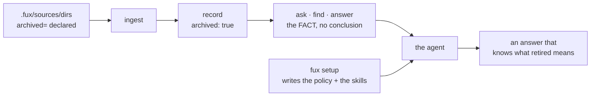

# ADR-AGENT-POLICY — shipping the policy, not just the facts

## §1 — For humans

**Fux's readers are agents.** That is the product's whole premise, and it has a
consequence worth writing down: **an engine whose output is systematically
misread is an engine that does not work**, however correct its index.
Correctness that does not survive the reader is not correctness.

The concrete case is archived documents.
[ADR-ARCHIVED-CONTENT](0037_archived-content.md) decision 7 makes Fux state a
**fact** — *this document is retired* — and deliberately **states no
conclusion**, because the right conclusion depends on why the question was
asked. That is the honest design, and it leaves a gap: *somebody* has to supply
the conclusion.

**This record says who: the consuming agent, using policy Fux ships.**



<details>
<summary><b>ASCII twin</b> — the same diagram, for terminals, diffs, and any reader without a Mermaid renderer</summary>

```text
  .fux/sources/dirs (archived=) --> ingest --> record: archived: true
                                                        |
                                                        v
                                    ask . find . answer  =  THE FACT
                                                        |    (no conclusion)
   fux setup  --> policy + skill files -------------------+--> the agent
                  (Claude . Copilot . Kiro)              |
                                                         v
                                        an answer that knows what retired means

  Fux states what IS. The agent decides what to DO. Neither alone is the mechanism.
```

</details>

### Examples

**What `fux setup` writes, and what it says about it:**

```console
$ fux setup
  wrote fux.toml
  wrote .fux/sources/dirs
  wrote .claude/skills/fux-archived-results/SKILL.md
  wrote .github/agents/fux.agent.md
  wrote .github/instructions/fux-archived-results.instructions.md
  wrote .kiro/steering/fux-archived-results.md

  note: the last four are OUTSIDE .fux/ — they teach Claude, Copilot and Kiro
        how to read this index. Turn them off with [agents] install = [] in
        fux.toml, or `fux setup --no-agents`.
```

**The announcement is the safeguard, not a courtesy.** These land in directories
GitHub, AWS and Anthropic own, so a user who did not want them must be able to
learn they exist from the terminal they just ran — not from a later `git status`
on a repository they share with a team.

**Opting out is a declaration, and it persists:**

```console
$ fux setup --no-agents
  wrote fux.toml          # [agents] install = []
  wrote .fux/sources/dirs
```

---

## §2 — For agents

### Context

Fux indexes retired documentation deliberately — it is the honest answer to
*"why does this look the way it does"* — and marks it rather than hiding it. The
disclaimer is **intent-neutral**: it says what archived *is* and stops, because
the same document is **the answer** to a history question, **misleading** to an
architecture question, and **dangerous** to a build task.

**The engine must not carry that taxonomy.** The list of stances is open, and a
provably incomplete enum invites callers to squeeze a fourth stance into the
closest of three. The [refer plane](0030_refer-plane.md) set the precedent — it
refuses to collapse *we did not look* into *we looked and it was fine*, because
**three callers want three different answers from the same index.**

So the policy lives with the caller. **The question this record answers is
whether Fux ships it.**

### Decision

**1. Fux ships agent policy, and it is a product decision rather than a
convenience.** A tool whose stated audience is agents, that emits a fact no
agent knows how to read, has shipped half a feature. **The measured case is this
repository's own**: *"what is the ingest cache"* returned **5/5 archived**
documents describing a subsystem `CLAUDE.md` forbids porting back. An agent
acting on that answer reintroduces a deleted design, confidently and with
citations.

**2. One canonical policy, carried as a VERBATIM block, not as a restatement.**
`templates/agents/POLICY.md` is the source of truth, and its rules live between
`<!-- fux:policy:begin v1 -->` and `<!-- fux:policy:end v1 -->`. **Every policy
rendering includes that block byte for byte.** Format-native framing may
surround it — a Kiro table, a Copilot heading, a skill's worked example — but the
block itself may not be reworded, reordered, or partially included.

⚠ **This shape was forced by a failure, on the first run of the check that was
supposed to confirm it.** The renderings had been written to *say the same
thing*: *"never drop the mark when you summarise"* against *"never drop the
archived mark when summarising"*. Same meaning, different bytes — and **no
substring test can tell a legitimate rewording from a dropped rule. A test that
cannot fail correctly is worse than no test, because it certifies agreement it
never checked.**

So agreement is **exact match on a shared block** — the same device this project
uses for a Mermaid diagram and its ASCII twin: two representations, one asserted
to match. **A rule changed in one rendering and not the others is worse than no
policy at all**, because two agents then disagree about the same output.

**The renderings stay hand-written** — a handful of short files do not earn a
generator, and L1 keeps the dependency budget at zero. The block is what makes
that safe.

**2a. Three files are exempt from the verbatim block, and the exemption is
pinned.** `ENRICH-SKILL.md`, `USAGE-SKILL.md` and `DECODER-SKILL.md` are
**build procedures and an operating manual**, not renderings of the
archived-results policy — inlining an eight-rule preamble about interpreting
search results into a file about parsing file formats would duplicate a policy
that already has a rendering per vendor. `test_the_exemptions_are_deliberate`
is what keeps widening the exemption a decision.

**3. Three vendors now, and the set is open by construction.** Claude (skills),
GitHub Copilot (custom agents **and** ambient instructions), Kiro (steering
**and** skills). Adding a fourth is a template plus a rendering plus a row —
**not a new decision.** What *would* reopen this record is a vendor changing its
format.

**4. Copilot gets an agent and instructions, and they are not alternatives.**
The **agent** fires when selected or routed to; the **instructions** (`applyTo:`)
fire on every matching request. ⚠ **The gap between them is the dangerous case**:
someone runs `fux ask` in a terminal, pastes the output into chat, and the agent
was never invoked — but the archived results are still there. Ambient
instructions cover that. Ship both.

**5. Installed from a DECLARATION, never from detection — and the declaration
ships COMPLETE.** `fux setup` installs all three vendors by default, and
`fux.toml` carries

```toml
[agents]
install = ["claude", "copilot", "kiro"]
```

**written out in full by `setup`, not left implicit** — the same treatment the
type allowlist gets, for the same reason: **a default a user can read and edit
in a file they own is a different thing from a default buried in the engine.**

**Detection is refused.** Fux never sniffs for `.kiro/` or `.github/` and infers
intent — that is precisely the derivation
[ADR-DIR-LIST](0022_dir-list.md) decision 4 refused for `archived`, and the
reasoning transfers unchanged: **a heuristic is exact for the repo it was
written against and a silent convention for everyone else.**
Install-all-by-default and declared-never-derived are compatible **because the
declaration is written down, visibly, at the moment of install.**

**Why all three rather than opt-in.** An opt-in flag is a feature nobody knows
exists, so the policy layer would be present in the product and absent in every
repository — and **the failure it prevents is silent**: an agent confidently
citing a deleted design, with a correct-looking citation.

**6. `setup` writes outside `.fux/`, and must SAY so — loudly, every time.**
Everything else `fux setup` writes lives in fux's own territory. These land in
**`.github/`, `.kiro/` and `.claude/`, which belong to GitHub, AWS and
Anthropic.**

Because decision 5 makes the install default-on, **the announcement is the
entire remaining safeguard**, and it is therefore mandatory rather than
nice-to-have. `setup` names every path it wrote outside `.fux/`, and names the
key that turns them off. **`--no-agents` is the one-shot escape; `install = []`
is its durable form.**

⚠ **The cost this carries, stated rather than discovered.** Three of the
renderings are **ambient** — Copilot's two `instructions/` files (`applyTo:
"**"`) and Kiro's steering (`inclusion: always`) enter *every* request in that
repository, for every developer, whether or not they are using Fux at that
moment. **That is a standing context tax imposed by a tool they installed for
something else.** Two things keep it defensible and both are obligations:
**the ambient renderings stay short — growth is a regression, not an
improvement** — and **`setup` announces them**, so the tax is visible to whoever
pays it.

**7. Write-if-missing, inherited rather than reinvented.** `setup.py` reads
templates out of the wheel (*read, never imported*) and lays them down with
`_write_if_missing`. A consumer's edit is never overwritten. ⚠ **The corollary
is that a stale policy file is invisible**, which is what decision 8 exists for.

**8. Every policy rendering carries `policy-version`.** In frontmatter where the
vendor allows it, in a comment where it does not. A file the consumer has edited
is theirs and stays; a file three versions behind is at least **identifiable**.
**Without this, write-if-missing means *install once, drift forever*.**

**9. Policy ships as steering; an operating manual ships as a skill.**

| the guidance… | ships as | because |
|---|---|---|
| must shape an answer the agent is *already* giving — the archived-results stance | **steering**, `inclusion: always` / `applyTo: "**"` | an agent not thinking about Fux still must not cite a retired design as evidence. **If it has to be *loaded* to apply, it does not apply** |
| is consulted *while doing a thing* — how to invoke Fux, how to write a decoder | **skill**, progressive disclosure | there is no reason to tax an interaction that never touches Fux |

**The test to apply:** *does an agent that has never heard of Fux still need this
sentence to avoid being wrong?* Yes → steering. No → skill.

⚠ **This is a rule because the tax is not optional on every vendor.** Kiro CLI
supports **no steering inclusion modes** — every file in `.kiro/steering/` enters
every interaction, so `inclusion: manual` protects nobody. Decision 6's
announcement makes the tax visible; **this decision is what keeps it small.**

**9a. A skill that writes committed code must never be ambient on any surface.**
`fux-enrich` and `fux-decoder` write into committed directories and change what
is indexed, so they ship to the two **skill** surfaces — Claude and Kiro — and to
neither ambient one. **A Kiro skill is progressive-disclosure; only Kiro
*steering* is ambient**, which is what admits Kiro here while still excluding
Copilot's `instructions/`.

**10. One template may map to two destinations, and that is stronger than a
conformance test.** Kiro implements the same open Agent Skills standard Claude
does, so the identical `USAGE-SKILL.md` bytes are written to both
`.claude/skills/fux-usage/SKILL.md` and `.kiro/skills/fux-usage/SKILL.md`.
**That is agreement by construction**, strictly stronger than decision 2's
conformance test asserting two separately-maintained files still match.

**11. `fux-usage` teaches a four-rung invocation ladder, and the ladder is
gated.** ⚠ **The defect it closes was live and in this record's own templates.**
`fux.agent.md` read *"If `fux` is not installed or there is no index, say so and
fall back to ordinary search."* But `fux` is a **console script** — on `PATH`
only where its installing environment's `bin/` is — so in any repo whose fux
lives in an unactivated `.venv/`, an agent got `command not found`, concluded
*not installed*, and **silently used grep** while the engine sat there and the
committed index sat beside it. **It did not error. It degraded, and the
degradation read exactly like an honest answer.**

The ladder is `fux` → `uv run fux` → `./.venv/bin/fux` (`.venv\Scripts\fux.exe`
on Windows) → `python -m fux`, probed with `--version` and cached for the
session. Three rules are gated by
[`tests/test_setup_agents_usage.py`](../../tests/test_setup_agents_usage.py):

1. the rungs appear **in order** in every rendering;
2. exhausting them yields *"could not be invoked, here is what I tried"* and
   **never** a claim that the package is absent;
3. **no rendering may tell an agent to activate a virtualenv, modify `PATH`, or
   install anything.** ⚠ **That last one is the failure a well-meaning edit
   introduces, which is why it is a test and not a sentence.**

⚠ **Rung 4 is the spelling a human guesses, not the one that happened to work
first.** An agent reporting *"I tried `python -m fux.cli`"* has named something
no reader recognises as the obvious attempt. `fux.cli` still works and is what
`tests_e2e/` spawns; it is simply no longer what the ladder teaches.

**12. `fux-usage` states which verb yields a line range.** `ask` and `find` are
document-level (`docs/mesh.md`); `answer` is span-level
(`docs/mesh.md:L10-L13`).

⚠ **Omitting it produced a wrong conclusion in the field**: a user ran `fux ask`,
saw no line numbers, and reported that fux does not return them. It does — from
`answer`. **A feature that is built, tested and undocumented is
indistinguishable from one that does not exist.** And it is L4 showing through
the surface rather than an oversight worth designing away: a line range can only
be computed by chunking the *fetched* bytes, and `ask` is offline by default.

⚠ **The shipped usage skill gained the retry rule on 2026-09-05** (W-109):
when a search returns `band: partial` with a non-empty `missing`, re-ask with
the corpus's own word, or keep the question and add `--expand`, or pass a second
phrasing with `-q`. **A wrong guess costs nothing** — expansion terms are scored
below the user's own and a document matching only them is never returned — which
is what makes the retry safe to recommend to an agent.

**It is in the skill because the surface cannot teach it.** `--json` reports
`missing`; nothing in the output says what to do about it, and an agent that
does not know the slot exists re-runs the same failing question.
[ADR-EXPAND](0054_expand.md).

### Consequences

- ⚠ **Fux owns three third-party formats it does not control.** This is a real
  maintenance liability and it is not hypothetical: **between drafting these
  files and revising them — inside one working session — GitHub's recommended
  surface moved from instructions to custom agents.** Decisions 2, 7 and 8 are
  the mitigations; none of them makes the liability go away.
- **`fux setup` gains a flag** ([ADR-CLI](0002_cli-surface.md)'s surface to
  record) and a second *kind* of output
  ([ADR-DOTFUX](0003_fux-directory.md)'s scaffolding contract to widen). Both
  are amended by this record rather than claimed — **`setup.py` itself stays
  with ADR-DOTFUX, because one component is owned once.**
- **The policy is prose, and prose is not enforceable.** Fux cannot verify that
  an agent obeyed it. What Fux can do — and decision 2's test does — is
  guarantee every agent was *told the same thing*.
- **`--json` is the stable contract, the prose is not.** Every rendering says
  *branch on the `archived` boolean, never on the note's wording*, so a future
  reword cannot break a consumer.
- ⚠ **Two things this record states that fux cannot enforce.** Kiro **custom
  agents load neither skills nor steering by default** — they need explicit
  `resources` — so a consumer on a custom agent receives none of these files
  **and gets no error**. Fux cannot write someone's agent config, so the skill
  body says it instead. And a skill's `compatibility` frontmatter field is **a
  declaration nothing checks**, so the ladder lives in the body; putting it only
  in `compatibility` would repeat the *knob that cannot work* failure this
  project has already paid for once.

### Alternatives considered

| | why not |
|---|---|
| **Document the policy, ship nothing** | every user writes their own, most write none, and the failure is silent — an agent confidently citing a deleted design |
| **`fux ask --intent=build`** | rejected in [ADR-ARCHIVED-CONTENT](0037_archived-content.md) decision 7: the stance list is open, and it puts policy inside an engine whose argument is that it ships facts |
| **One file for all agents** | a real convention and worth watching, but Claude skills and Kiro steering both need their own frontmatter to load at all. **A shared file that no tool loads natively is a file nobody reads** |
| **Detect installed agents and write accordingly** | derivation, not declaration — decision 5. Exact for the repo it was written against, a silent convention everywhere else |
| **Opt-in behind a flag** | **drafted this way and overruled.** A flag nobody knows about means the policy layer exists in the product and in no repository, and the failure it prevents is *silent*. The trust concern the flag answered is instead met by decision 6's mandatory announcement plus `--no-agents` |
| **Generate the renderings from the canonical policy** | a handful of short files do not earn a generator; decision 2's conformance test buys the same guarantee at a fraction of the machinery |
| **Ship the skills as steering too, "so they always apply"** | rejected under decision 9a: a skill that writes committed code and changes ranking must never enter every request |

### Reference (required)

- The fact this policy interprets —
  [ADR-ARCHIVED-CONTENT](0037_archived-content.md) decisions 6 and 7.
- The precedent for caller-owned policy — [ADR-REFER](0030_refer-plane.md) and
  [`src/fux/refer/freshness.py`](../../src/fux/refer/freshness.py): *three
  callers want three different answers from the same index, and no single
  engine-wide policy is right for more than one of them.*
- The installer this extends — [`src/fux/setup.py`](../../src/fux/setup.py)
  (`run()`, `_write_if_missing`, `template_bytes`, and the per-vendor mapping);
  the artifacts themselves —
  [`src/fux/templates/agents/`](../../src/fux/templates/agents/).
- The tests that hold the record's claims —
  [`tests/test_setup_agents.py`](../../tests/test_setup_agents.py) and
  [`tests/test_setup_agents_usage.py`](../../tests/test_setup_agents_usage.py).
- Claude Agent Skills — <https://code.claude.com/docs/en/skills>
- GitHub Copilot custom agents configuration —
  <https://docs.github.com/en/copilot/reference/custom-agents-configuration>
- GitHub Copilot repository custom instructions —
  <https://docs.github.com/en/copilot/how-tos/configure-custom-instructions-in-your-ide/add-repository-instructions-in-your-ide>
- Kiro steering files and inclusion modes — <https://kiro.dev/docs/steering/>

### Veto condition

**Reopen this decision if any of these becomes true:**

1. **`fux setup` writes an agent file without naming it in its output**, or
   without naming how to turn it off. Since decision 5 makes the install
   default-on, **the announcement is the only safeguard left.**
2. **`install = []` or `--no-agents` still writes an agent file.** The opt-out is
   the whole of a user's control here; if it leaks, decision 5 stops being a
   default and becomes a mandate.
3. **A shipped rendering no longer loads in its vendor's tool** — a renamed path,
   a changed frontmatter key, a retired mechanism. **This has already fired once
   during authoring.**
4. **The verbatim block differs by a byte** between the canonical policy and any
   non-exempt rendering — reworded, reordered, partially included, or absent.
   **An exact match is the only check that can detect it.**
5. **Fux infers which agents to install from the filesystem** — decision 5 is
   declared-never-derived.
6. **An ambient rendering grows.** They enter *every* request in a consumer's
   repository. **Growth is a regression**, because the cost is paid by developers
   who may not be using Fux at that moment — on every prompt, forever.
7. **A skill that writes committed code ships to an ambient surface** —
   decision 9a.
8. **The policy tells an agent what the answer is, rather than how to read the
   fact.** The moment a rendering encodes Fux's opinion about a *document*
   rather than about *what archived means*, **the engine has smuggled the intent
   taxonomy back in through the policy layer.**

**How to check them:**

```bash
# 1, 2 — every agent file setup writes is named in its output, and
#         --no-agents / install = [] writes none of them
uv run pytest -q tests/test_setup_agents.py -k "announces or optout"

# 3 — the shipped paths and frontmatter keys still match each vendor's docs.
#     No command can check this. It is a periodic read of the four URLs in
#     §Reference, and `policy-version` is what makes a stale file visible.

# 4 — every policy rendering carries the canonical block, byte for byte
uv run pytest -q tests/test_agent_policy_agreement.py

# 5 — no filesystem sniffing decides what gets installed
grep -rn "\.kiro\|\.github\|\.claude" src/fux/setup.py
# expect: only literal write targets, never an exists() branch that selects one

# 6 — the ambient renderings have not grown
wc -c src/fux/templates/agents/fux-archived-results.instructions.md \
      src/fux/templates/agents/fux-usage.instructions.md \
      src/fux/templates/agents/steering-fux-archived-results.md

# 7 — the code-writing skills ship to skill surfaces only
grep -n 'ENRICH-SKILL\|DECODER-SKILL' src/fux/setup.py
# expect: only under `.claude/skills/` and `.kiro/skills/`

# 8 — read the renderings. Each rule must be about how to READ the archived
#     flag, never about which document is right.
ls src/fux/templates/agents/
```

---

## References

*Every source this record cites, gathered in one place. §2's **Reference
(required)** names the grounding; this is the complete list. An archived
document is never listed here — the body may name one, but archive is not
evidence.*

**Records** — [ADR-CLI](0002_cli-surface.md) ·
[ADR-DOTFUX](0003_fux-directory.md) · [ADR-DIR-LIST](0022_dir-list.md) ·
[ADR-REFER](0030_refer-plane.md) ·
[ADR-ARCHIVED-CONTENT](0037_archived-content.md) ·
[ADR-ENRICH](0040_enrich.md) · [ADR-DECODE](0042_decode.md)

**Code**

- [`src/fux/refer/freshness.py`](../../src/fux/refer/freshness.py)
- [`src/fux/setup.py`](../../src/fux/setup.py)
- [`src/fux/templates/agents/`](../../src/fux/templates/agents/)
- [`tests/test_setup_agents.py`](../../tests/test_setup_agents.py)
- [`tests/test_setup_agents_usage.py`](../../tests/test_setup_agents_usage.py)

**Papers and specifications**

- Claude Agent Skills
  <https://code.claude.com/docs/en/skills>
- GitHub Copilot custom agents configuration
  <https://docs.github.com/en/copilot/reference/custom-agents-configuration>
- GitHub Copilot repository custom instructions
  <https://docs.github.com/en/copilot/how-tos/configure-custom-instructions-in-your-ide/add-repository-instructions-in-your-ide>
- Kiro steering files and inclusion modes
  <https://kiro.dev/docs/steering/>
