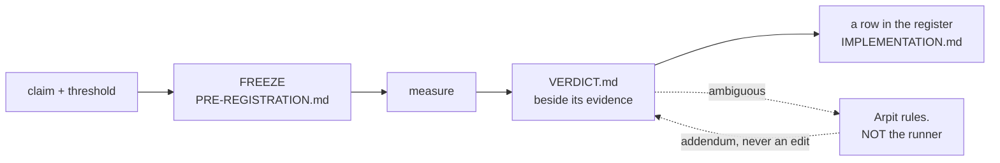

# ADR-RS: the R predictions

- **Name:** `ADR-RS` — cite this everywhere; never cite the number. **Arpit
  asked for `ADR-Rs`, 2026-08-22**; the spelling is uppercase because
  [`tests/test_adr_frontmatter.py`](../../tests/test_adr_frontmatter.py) matches
  `ADR-[A-Z0-9-]+` on the Name line and would reject a lowercase letter. Same
  name, inside the convention it has to live in
- **Status:** **accepted** (2026-08-22) — it codifies a discipline already in
  force and changes none of it. It was held at `proposed` until the register
  check in veto 4 existed, because a record whose central claim is *"the
  register is complete"* should not be accepted while nothing checks that.
  **That check now exists** —
  [`tests/test_prediction_register.py`](../../tests/test_prediction_register.py)
  (W-69), 13 assertions — so the condition this record set for its own
  acceptance is met, and it was met by building the check rather than by
  deciding the check was unnecessary
- **Date:** 2026-08-22
- **Feature:** the prediction system — the R ids, their register, and the rules
  that make a frozen claim mean something
- **Owns:** [`tests/test_regression_runs.py`](../../tests/test_regression_runs.py)
  — the per-run contract, previously unowned — **and `tools/t2-eval/`, by the
  fallback in decision 10.** The other harnesses stay where they are:
  `tools/maintenance-bench/` with [ADR-MAINTENANCE](0032_hooks.md),
  `tools/pruning-eval/` with W-38. A harness belongs to the thing it measures;
  the *discipline* is this record
- **Laws:** L3
- **Amends:** nothing. CLAUDE.md keeps the rules verbatim and stays the
  normative home; this record explains and guards them

---

## §1 — For humans

**An R is a promise made before looking.** You write down the claim and the
number that would settle it, freeze both, *then* measure. Call the pocket, then
take the shot.

That is the whole idea, and everything below exists to stop the one failure it
is vulnerable to: **deciding what counts as success after seeing the result.**



<details>
<summary><b>ASCII twin</b> — the same diagram, for terminals, diffs, and any reader without a Mermaid renderer</summary>

```text
  claim + threshold --> FREEZE (tools/.../PRE-REGISTRATION.md)
                             |
                             v
                          measure
                             |
                             v
                     VERDICT.md (beside its evidence)
                        |            \
                        |             `-- ambiguous --> ARPIT rules, not the runner
                        |                                   |
                        v                                   v
              a row in the register            an ADDENDUM on the verdict,
              (IMPLEMENTATION.md)                 never an edit to it

  The freeze is the point. Everything else protects it.
```

</details>

### The four ways an R can end

| | means | example |
|---|---|---|
| **PASS** | met its frozen threshold | R3, R4, R9 |
| **FAIL** | did not — **and this is a success of the method** | R5, P1 |
| **INCONCLUSIVE** | the instrument could not decide, and said so | R6 |
| **RETIRED** | the question stopped being asked | R7, R8 |

**FAIL is not failure.** P1 ended the pruning design and R5 rewrote how the git
hook works. A recorded negative that stops months of building is the most
valuable thing this system produces, and a project that treats FAIL as
embarrassing will quietly stop producing them.

**RETIRED is not FAIL either**, and conflating them would misreport history.
R7's budget was never missed; the promise was withdrawn.

---

## §2 — For agents

### Context

**Nothing owned this.** The rules lived in CLAUDE.md and were enforced by
`tests/test_regression_runs.py`, but no record claimed the system, so no veto
condition guarded it and no change to it had to update anything.

The gap surfaced on 2026-08-22: **R9 ran, passed, and was cited in six
documents while having no row in the register** — the one table claiming to be
the complete set. Nothing was wrong with the measurement. What was missing was
anything that would notice.

### Decision

**1. An R is a claim frozen before it is measured.** The claim and the number
that settles it are committed *first*, in a `PRE-REGISTRATION.md` under
`tools/`. **A pre-registration is frozen on commit and is never edited** —
not to fix a threshold, not to reword a metric, **not even to repair a dead
link** (W-67 hit exactly that and took the safer branch).

**2. A threshold may never move — and re-judging at a different size is a NEW
prediction.** Not an amendment, not a re-run: a new id, a new pre-registration,
a new verdict. R6's repair is the worked example — `PRE-REGISTRATION-R6-v2.md`
restated the threshold *character for character* and added only the table row
the original lacked.

**3. The register is the table in [`work/IMPLEMENTATION.md`](../../work/IMPLEMENTATION.md),
and it claims to be complete.** Every id, every status, every pointer to its
verdict. **A missing row is the defect this record exists to make visible** —
see veto 4.

**4. Ids are never reused, including retired and superseded ones.** P2–P7 are
spent; R7 and R8 are spent. A reused id makes every prior citation ambiguous,
and citations are how verdicts are reached.

**5. A verdict is never edited — it is added to.** *Nothing supersedes a
measurement except a better measurement.* When Arpit adjudicated R6 on
2026-08-22 the file kept `verdict: INCONCLUSIVE` and gained an **adjudication
addendum** plus a frontmatter key. The measurement and the ruling about it are
different facts and stay visibly different.

**6. An ambiguous result goes to Arpit. The runner does not adjudicate its own
measurement.** R6 fell between its own table's rows; the session that ran it
wrote that up rather than choosing, and was right to. **A session that could
benefit either way from a reading must not be the one that picks it.**

**7. A prediction may not be registered above the design-point ceiling.**
CLAUDE.md §Litmus caps measurement *and commitment* at 10 000 documents. A
threshold above it is a promise nobody may test, which is worse than no
promise — it reads as a live gate and can never fire. **R7 and R8 were
withdrawn under exactly this** on 2026-08-22.

**8. Only Arpit retires a prediction, and retirement is recorded, not deleted.**
The row stays with status RETIRED and the reason. A prediction that vanishes
takes with it the evidence that anyone ever cared about the question.

**9. Never ship a ranking or behaviour change off a single corpus.** Carried
verbatim from CLAUDE.md; it is why W-52 needs a second corpus and not just an
instrument.

**10. A harness whose feature record is retired falls back to this record.**
Added 2026-08-22, the same day it was first needed. A harness normally belongs
to the thing it measures — `tools/maintenance-bench/` to ADR-MAINTENANCE — and
an open item may hold one, as W-38 holds `tools/pruning-eval/`. **But a
retired record cannot own anything, and a proposal is not a valid owner**
(`tests/test_adr_ownership.py` accepts an ADR name or a `W-nn` id, nothing
else). When ADR-T2-SEGMENTS was removed from the register on Arpit's
instruction, `tools/t2-eval/` was orphaned in the same change.

**The fallback is here rather than nowhere**, because a harness that measured a
prediction is prediction apparatus even after the feature question is settled —
and an unowned component is a component whose contract can change with no
record updating. **This is a backstop, not a preference**: a harness moves to
its feature's record the moment one exists.

### Consequences

- **The prediction system is now guardable.** Before this record a change to
  the discipline updated nothing; now it updates this.
- **`tests/test_regression_runs.py` gains an owner**, so its per-run contract
  changes with a record rather than silently.
- **Veto 4 is unbuilt and is the acceptance gate.** A check that walks
  `work/regression/*/VERDICT.md`, reads each `prediction:` id, and asserts a
  matching register row — it would have caught R9 the day it ran. **This record
  stays `proposed` until it exists**, because accepting a record whose central
  claim is *"the register is complete"* while nothing verifies completeness is
  the same class of error as an unmeasured gate.
- **Nothing about any existing R changes.** No verdict, no pre-registration and
  no status is touched by writing this down.

### Alternatives considered

| | why not |
|---|---|
| **Leave it in CLAUDE.md only** | it worked until it didn't — R9 went unregistered and nothing noticed, because no record owned noticing. CLAUDE.md stays the normative home; this adds the ownership and the vetoes |
| **Own the harnesses too** | a harness belongs to the feature it measures — `maintenance-bench` with ADR-MAINTENANCE. Claiming them here would break one-component-one-owner for no gain |
| **Fold predictions into the ADR register** | different lifecycles. A record is superseded by argument; a prediction is superseded only by a better measurement, and mixing them invites exactly the confusion decision 5 forbids |

### Reference (required)

- The rules this codifies — [`CLAUDE.md`](../../CLAUDE.md), §the lifecycle and
  §Litmus. **Verbatim, not restated**, so there is one normative home.
- The register — the prediction table in
  [`work/IMPLEMENTATION.md`](../../work/IMPLEMENTATION.md).
- The per-run contract this record owns —
  [`tests/test_regression_runs.py`](../../tests/test_regression_runs.py) and
  [`work/regression/README.md`](../../work/regression/README.md).
- **Decision 5's worked example** — [R6-MERGE](../../work/regression/2026-08-20-r6-merge-driver/VERDICT.md),
  which still reads INCONCLUSIVE beneath its 2026-08-22 adjudication addendum.
- **Decision 2's worked example** — the R6 re-run at
  [`2026-08-22-r6-rerun`](../../work/regression/2026-08-22-r6-rerun/VERDICT.md),
  a new pre-registration rather than an edited one.
- **Decision 6's worked example, and the reason it is a rule** —
  [R5-HOOK](../../work/regression/2026-08-20-r5-hook-latency/VERDICT.md): a FAIL
  filed at the judged size, with `src/` last touched *before* the
  pre-registration, so nothing could have been tuned to pass.
- Pre-registration as practised in empirical research, and the outcome-reporting
  bias it exists to prevent — <https://www.cos.io/initiatives/prereg>

### Veto condition

**Reopen this decision if any of these becomes true:**

1. **An R id is reused** — including a retired one (P2–P7, R7, R8).
2. **A frozen `PRE-REGISTRATION.md` is edited after any number exists**, for any
   reason including a link repair.
3. **A `VERDICT.md` is edited rather than added to**, or a `verdict:` field is
   changed to reflect a ruling instead of a re-measurement.
4. **A filed verdict has no row in the register** — the R9 case, and the one
   this record most wants made mechanical. **Built 2026-08-22** as
   [`tests/test_prediction_register.py`](../../tests/test_prediction_register.py),
   and this record's acceptance gate is therefore discharged.

   Building it forced one refinement worth recording: the first verdict that is
   **not an `R` prediction** (`W44-SIGNAL`, a feature gate) arrived in the same
   session. Rather than give it an `R` number it never earned — inventing an
   architectural prediction nobody made — `IMPLEMENTATION.md` grew a second
   **feature-gate** table, and the check reads **both**. The completeness claim
   is unchanged and now covers a class the R series was never meant to hold.
5. **A prediction is registered with a threshold above the design-point
   ceiling** (CLAUDE.md §Litmus).
6. **A session adjudicates its own ambiguous result** rather than handing it to
   Arpit.

**How to check them:**

```bash
# 1 — no id appears twice, and no retired id reappears
grep -rn "^prediction:" work/regression/*/VERDICT.md | sort | uniq -d
# expect: nothing

# 2 — a frozen pre-registration changed after its first number
git log --oneline -- 'tools/**/PRE-REGISTRATION*.md'
# expect: one commit each, before the run that used it

# 3 — the per-run contract
uv run pytest -q tests/test_regression_runs.py

# 4 — the register cross-check, BUILT 2026-08-22 (this record's acceptance gate)
uv run pytest -q tests/test_prediction_register.py
# every filed verdict's `prediction:` id must have a row in one of
# work/IMPLEMENTATION.md's two registers. NOT the reverse: a RETIRED id (R7, R8)
# has no verdict and must pass, and there is a test asserting that direction so
# it cannot be silently inverted.

# 5 — no live threshold names a size above the ceiling
grep -rn "100 000\|50 000" tools/*/PRE-REGISTRATION*.md
# expect: only inside frozen historical files, never in a newly registered one
```
