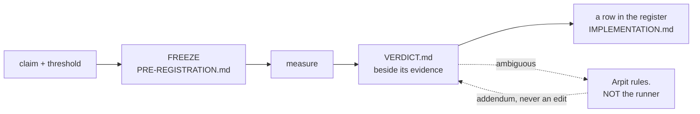

# ADR-RS — the R predictions

> **`CLAUDE.md` is the normative home** and carries these rules verbatim. This
> record explains and guards them; it amends nothing.

## §1 — For humans

**An R is a promise made before looking.** You write down the claim and the
number that would settle it, freeze both, *then* measure. Call the pocket, then
take the shot.

That is the whole idea, and everything below exists to stop the one failure it
is vulnerable to: **deciding what counts as success after seeing the result.**



<details>
<summary><b>ASCII twin</b> — the same diagram, for terminals, diffs, and any reader without a Mermaid renderer</summary>

```text
  claim + threshold --> FREEZE (tools/.../PRE-REGISTRATION.md)
                             |
                             v
                          measure
                             |
                             v
                     VERDICT.md (beside its evidence)
                        |            \
                        |             `-- ambiguous --> ARPIT rules, not the runner
                        |                                   |
                        v                                   v
              a row in the register            an ADDENDUM on the verdict,
              (IMPLEMENTATION.md)                 never an edit to it

  The freeze is the point. Everything else protects it.
```

</details>

### The four ways an R can end

| | means | example |
|---|---|---|
| **PASS** | met its frozen threshold | R3, R4, R9 |
| **FAIL** | did not — **and this is a success of the method** | R5, P1 |
| **INCONCLUSIVE** | the instrument could not decide, and said so | R6 |
| **RETIRED** | the question stopped being asked | R7, R8 |

**FAIL is not failure.** P1 ended the pruning design and R5 rewrote how the git
hook works. **A recorded negative that stops months of building is the most
valuable thing this system produces**, and a project that treats FAIL as
embarrassing will quietly stop producing them.

**RETIRED is not FAIL either**, and conflating them would misreport history.
R7's budget was never missed; the promise was withdrawn.

### Blind and informed — the second half of the same idea

**Pre-registration stops you moving the goalposts after the shot. Run
classification stops you moving the *goal*.**

A prediction freezes the threshold before the number exists. But a threshold is
only half of what a measurement rests on — the other half is the **artifacts**
the run measures: the enrichment text, the prompt that wrote it, the chunking,
the tuned weights, the analysis. If any of those was authored by someone who had
already read the evaluation queries, **the number is about *those queries*, not
about the engine**, and no amount of threshold discipline recovers it.

⚠ **Fux learned this the expensive way.** An enrichment written by an author who
had seen the failing queries measured **+9**; the same intervention written
blind measured **+1**, and a second blind author measured **−1**. **The tell was
not the score — it was that the informed arm broke *nothing*,** on a corpus
where adding vocabulary to nine of ten documents *must* disturb something.

| | means |
|---|---|
| **blind** | every artifact it depends on was authored with no access to the queries, the judgments, or prior per-query scores |
| **informed** | anything else |

**An informed run is not thrown away.** It is filed, cited, and may inform the
corpus — it simply never supplies a delta and is never compared with a blind
one. That is TREC's manual/automatic split, which has worked since 1994, and it
works because **a rule that bans useful work gets routed around, while a rule
that sorts it survives.**

---

## §2 — For agents

### Context

**Nothing owned this.** The rules lived in CLAUDE.md and were enforced by
`tests/test_regression_runs.py`, but no record claimed the system, so no veto
condition guarded it and no change to it had to update anything.

The gap surfaced when **R9 ran, passed, and was cited in six documents while
having no row in the register** — the one table claiming to be the complete set.
Nothing was wrong with the measurement. **What was missing was anything that
would notice.**

### Decision

**1. An R is a claim frozen before it is measured.** The claim and the number
that settles it are committed *first*, in a `PRE-REGISTRATION.md` under
`tools/`. **A pre-registration is frozen on commit and is never edited** — not
to fix a threshold, not to reword a metric, **not even to repair a dead link.**

⚠ **The freeze is absolute, and a wrong pointer is corrected in the CITING
record.** The hard case is a pointer that is **wrong but resolves** — it names a
real file that is not the governing one. Neither gate catches it, and the freeze
forbids fixing it in place. **Three mechanisms were offered and all three are
refused:** a corrected mirror alongside the original (two documents and nothing
in the bytes says which governs); an append-only corrections file beside it; and
a one-line *superseded by X* stub in the frozen file itself. **A permitted edit
is a permitted edit** — the stub in particular trades the whole property for one
line of convenience.

**The correction lives in the record that cites the pre-registration.**
[ADR-MERGE-DRIVER](0033_merge-driver.md)'s prose — *governed by
`PRE-REGISTRATION-R6-v2.md`* — is **the sanctioned pattern**, not a workaround
someone should tidy away later. A record is exactly where a claim's grounding is
stated, so it is exactly where a mis-grounding is corrected. **This is written
down so a future session finding a wrong pointer does not reach for the
mechanism that was just refused.**

**2. A threshold may never move — and re-judging at a different size is a NEW
prediction.** Not an amendment, not a re-run: a new id, a new pre-registration,
a new verdict. R6's repair is the worked example — its v2 pre-registration
restated the threshold *character for character* and added only the table row
the original lacked.

**3. The register is the table in
[`work/IMPLEMENTATION.md`](../../work/IMPLEMENTATION.md), and it claims to be
complete.** Every id, every status, every pointer to its verdict. **A missing
row is the defect this record exists to make visible.**

**4. Ids are never reused, including retired and superseded ones.** P2–P7 are
spent; R7 and R8 are spent. **A reused id makes every prior citation ambiguous,
and citations are how verdicts are reached.**

**5. A verdict is never edited — it is added to.** *Nothing supersedes a
measurement except a better measurement.* When an ambiguous R6 was adjudicated,
the file kept `verdict: INCONCLUSIVE` and gained an **adjudication addendum**
plus a frontmatter key. **The measurement and the ruling about it are different
facts and stay visibly different.**

**6. An ambiguous result goes to Arpit. The runner does not adjudicate its own
measurement.** R6 fell between its own table's rows; the session that ran it
wrote that up rather than choosing, and was right to. **A session that could
benefit either way from a reading must not be the one that picks it.**

**7. A prediction may not be registered above the design-point ceiling.**
CLAUDE.md §Litmus caps measurement *and commitment* at 10 000 documents. **A
threshold above it is a promise nobody may test, which is worse than no
promise** — it reads as a live gate and can never fire. R7 and R8 were withdrawn
under exactly this.

**8. Only Arpit retires a prediction, and retirement is recorded, not deleted.**
The row stays with status RETIRED and the reason. **A prediction that vanishes
takes with it the evidence that anyone ever cared about the question.**

**9. Never ship a ranking or behaviour change off a single corpus.**

**10. A harness whose feature record is retired falls back to this record.** A
harness normally belongs to the thing it measures, and an open item may hold
one. **But a retired record cannot own anything, and a proposal is not a valid
owner** — `tests/test_adr_ownership.py` accepts an ADR name or a `W-nn` id and
nothing else. **The fallback is here rather than nowhere**, because a harness
that measured a prediction is prediction apparatus even after the feature
question is settled, and an unowned component is one whose contract can change
with no record updating. **This is a backstop, not a preference**: a harness
moves to its feature's record the moment one exists.

**11. Every measured run is `blind` or `informed`, and declares which.** A run
is **blind** only if *every* artifact it depends on was authored without access
to the evaluation queries, the judgments, prior per-query scores, or any derived
report of them — a failure list, a dashboard, a ticket naming a query. The
artifacts are: **corpus enrichment, the enrichment prompt, chunking and index
configuration, retriever and reranker settings, and the analysis.** Anything
else is **informed**.

Two things this deliberately does not say. **It does not say *has seen***, the
binary label CONSORT 2025 item 20a tells you to abandon — blindness is
per-person and per-stage. And **it does not name the model, because the artifact
is the contaminated object**, not the model and not the metric.

**12. An informed run is RECLASSIFIED, never banned — and never supplies a
delta.** It is filed, listed, cited, and may inform the corpus. It is **never
compared with a blind run and never used to state a difference between arms.**

**This is the load-bearing decision.** TREC has split manual from automatic runs
since **1994**: manual runs are reported and contribute to the judgment pool,
and are never scored against automatic ones. **A prohibition on useful work gets
routed around quietly; a taxonomy survives** — and a rule that is quietly
violated is worse than no rule, because it also supplies false assurance.

> ⚠ **The scope defect in this wording is KNOWN and DELIBERATELY UNREPAIRED.**
> *"Never supplies a delta"* is written without qualification, and the first run
> filed under the rule was `informed` by construction and made **entirely** of
> deltas — a wheel 30× smaller, an index 22.6 % smaller, an ingest 6.8× faster.
> **As written, decision 12 forbids reporting a file size.**
>
> The distinction the wording is missing is that **contamination requires an
> evaluation set to exist**:
>
> | kind of number | can authorship contaminate it? |
> |---|---|
> | nDCG, pass@k, fixed/broken on a golden set | **yes** — this is what decision 12 is for |
> | bytes on disk, wall-clock, wheel size | **no** — there was nothing to have seen |
> | p95 latency on a *chosen* query set | ⚠ **partly** — the metric cannot be fitted, the **sample** can |
>
> **Arpit ruled the text stands unchanged.** No narrowing to evaluation-set
> metrics, no separate declaration axis for performance numbers. **An informed
> run reporting a cost delta discloses the conflict in its report** rather than
> the rule being loosened to let it through.
>
> ⚠ **This block exists so the defect is not "fixed" by a later session.**
> Editing a measurement rule so that a run passes under it is the
> moving-threshold failure in a different costume, and it is worse here than a
> known-imprecise sentence. **Do not narrow decision 12. Disclose.**
>
> **Reopen when** the disclosure has been written three times — at that point
> the repetition is itself the argument that the wording, not the runs, is what
> costs effort.

**13. The run states who authored each artifact and what evaluation material
they could reach.** Per artifact: the author, and which of *queries / judgments
/ prior scores / none*. The sentence is ARRIVE 2.0 item 5 — *describe who was
aware of the group allocation at the different stages.*

**The burden is on the author to argue exposure was absent**, not on a reader to
demonstrate it was present. Paraphrase-level exposure defeats string matching,
and BIG-bench's canary GUID — embedded precisely so labs could exclude it, and
reproducible by a model trained on it anyway — is the standing proof that *"did
you read the file?"* is not the question. **Disclosure is the fallback; a set
nobody can reach is the control.**

⚠ **The label for an informed number is not "upper bound".** An upper bound
asserts a known direction *and* a bounded magnitude; a leaked measurement has
**unknown bias magnitude**. The honest label is **"not a generalisation
estimate."**

**14. A delta smaller than the set's resolution is reported as "no detected
change", whoever authored it.** Fux's engine is deterministic, so *run-to-run*
variance is zero — **and that is not the variance that matters.** The variance
that matters is **author-to-author**, and it has been sampled exactly twice:
`+1` and `−1` on a 50-query set.

**Provisionally, and explicitly as a placeholder for a measurement rather than a
measurement: on a 50-query set, nothing under ±2 queries (4 pp) is a detected
change.** TREC puts standard MAP error at 50 topics near **2.4 %**; a
meta-analysis of >120 Kaggle competitions recommends **≥10 000 examples** to be
safe from adaptive effects. **Fifty queries is under-powered and this record
says so rather than letting a future reader discover it.**

⚠ **This applies retroactively to fux's own numbers, and that is the point.**
The blind arms' `+1` and `−1` are below the floor: the honest reading is **no
detected effect**, not `+1`. What survives is the **concordance** — both blind
authors broke the same two queries, the informed author preserved exactly those
two, ~0.028 — a different statistic, roughly **17×** the evidential weight of
the *broke nothing* sentence that was actually filed, and the one to cite.

**15. An enrichment change is scored against a decoy set and a placebo — ✅
BUILT 2026-08-28, and BUILT IS NOT PROVEN.** *Neural Retrievers are Biased Towards LLM-Generated Content* (KDD 2024)
establishes **source bias**: retrievers rank LLM-written text higher
independently of whether it informs, and the effect reaches re-rankers. Every
fux enrichment arm added ~70 tokens of fluent LLM prose to nine of ten documents
with **no matched control**, so **text *presence* and text *content* are not
separable in any number this project has filed.**

Two controls close it — a **decoy** query set the enrichment was not aimed at,
and a **content-free placebo** enrichment of matched length — and decision 11
implies a third thing that does not exist either: a **sealed** subset of
queries, held by one owner, never shown to anyone who authors an artifact,
rotated when it leaks. **All three landed** —
[`tools/quality-controls/`](../../tools/quality-controls/README.md): the decoy
set and the placebo on 2026-08-27, the sealed subset on 2026-08-28 once Arpit
ruled its power tension.

| control | state |
|---|---|
| content-free placebo, matched length | ✅ **built** — one shared sentence pool so every placebo has the same vocabulary and cannot discriminate; length matched to within a few words; deterministic from the source sha (L3), no model |
| decoy query set | ✅ **built** — 15 domain-plausible questions the corpus cannot answer. ⚠ **The one kind of evaluation material an agent may author**: no correct answer exists, so there is nothing to fit |
| **sealed subset** | ✅ **built 2026-08-28** — 15 of 50, split by `sha256(id)`: deterministic, seedless, order-independent |

⚠ **The decoys found something on their FIRST run**, which is the argument for
controls in one line: **one of fifteen unanswerable questions is reported
`grounded`**, because `coverage` and `missing` are corpus-wide and its four terms
scatter across four documents. **No ruling on R10 catches it** — its separation
is `0.58`, above the `0.5` R10's selection rule would have picked.
[The run](../../work/regression/2026-08-27-decoy-control/report.md);
[ADR-CONFIDENCE](0045_confidence.md) carries it as a named, untaken decision.

**The power tension, resolved out loud as this decision demanded.** Sealing
shrinks the visible set. Arpit ruled 2026-08-28: **seal 15, grow the set later**.
**35 visible and 15 sealed are both underpowered and that is accepted rather than
hidden** — the ±2-query resolution floor still governs what a delta may claim,
and it does not loosen because a set got smaller; it gets **harder to clear**.
**Sealing buys a claim about contamination. It buys no precision**, and a run
reporting a sealed number as if it were precise is misreading the control.

🔴 **And the sealed half is harder than the visible half: 5 of the 9
`known_failure` goldens landed in the sealed 15** — 33 % against 11 %. **This was
not corrected, and correcting it would be the bug**: balancing by difficulty
means reading the scores, which is the contamination the seal prevents. A sealed
score is therefore **not comparable to a visible score** at this size, and
anyone reporting both must say which half.

⚠ **BUILT IS NOT PROVEN.** None of the three controls has yet been used in a run
that adjudicates anything. **The marker moves from `NOT BUILT` to built; it does
not become evidence.**

⚠ **Running the placebo is not the same as building it.** A placebo arm produces
its value as a **delta between arms**, which decision 12 governs — so grading the
playground three ways needs the blind/informed question answered before any
number from it may be cited.

**16. When a pre-registration's live path is DELETED, the run keeps a mirror of
it — the verdict is not edited.** Decision 1 freezes a pre-registration and
decision 5 freezes a verdict, and between them they assume the file the verdict
*points at* keeps existing. **It does not always**: `DENSE-CHUNK` names a module
whose docstring held the bar, and that module was deleted with the dense lane.

| | |
|---|---|
| edit `pre_registration:` to point somewhere else | **forbidden by decision 5.** A verdict is never edited |
| keep the module alive as a stub so the pointer resolves | a file kept only so a test passes, which is the vestige class this project keeps deleting |
| **mirror the file into the run** | ✅ the measurement stays citable and nothing frozen is touched |

**The rule.** The run carries the pre-registration at its *original path* under
`evidence/pre-registration/`, **byte for byte as it stood when the verdict was
ruled** — verified against the commit that filed the verdict, not copied from
whatever the file had drifted to.
[`tests/test_regression_runs.py`](../../tests/test_regression_runs.py) resolves
the pointer there **only when the live path is gone**, and a second check
refuses a mirror that sits beside a live file, because **two frozen thresholds
for one verdict is exactly the ambiguity decisions 1 and 2 exist to prevent.**

**Why this is not archive-is-not-evidence in disguise.** `archive/` holds
superseded *decisions*, which may be named but never cited as grounding. This
holds a frozen *threshold* a filed measurement was ruled against. **It is the
evidence**, kept beside the run that used it, in the one directory this project
forbids editing. ⚠ **The general problem is not rare**: deleting dead code and
keeping measurements readable would otherwise be in tension, and a project that
has to choose will quietly choose the code — leaving verdicts that point at
nothing.

**17. A run directory holding a frozen pre-registration and NO report is a
legal, complete state — `pre-registered, not yet measured`.** Added 2026-08-27.

- **The situation.** R10's threshold was frozen and committed to
  `work/regression/2026-08-27-r10-separation-floor/evidence/PRE-REGISTRATION.md`
  and the measurement cannot start — it needs `fux-playground`, which does not
  exist on the build machine. The per-run contract demanded a `report.md`, an
  `ANALYSIS.md`, an `evidence/` directory and a `blind`/`informed`
  classification, so the directory failed **four checks** for having done
  nothing wrong.
- **The two ways out were both bad, and that is the argument.** Write a report
  for a run that has not happened — inventing the thing the contract exists to
  demand — or move the frozen file somewhere the test does not scan, which
  **decision 8's freeze forbids** (W-82 ruling 8: no mirror, no `CORRECTIONS.md`,
  no header stub).
- **The rule.** No report ⟹ rows 2, 3, 4 and 7 of the contract do not apply.
  **Row 6 still does**: the directory is listed in
  [`work/regression/README.md`](../../work/regression/README.md), because a
  frozen threshold nobody can find is exactly as useless as a run nobody can
  find.
- ⚠ **Legal ONLY while there is no report.** The moment one lands the full
  contract applies again, so this cannot become a way to file a number without
  its evidence.
- **This is decision 1 being consistent with itself.** Decision 1 says commit
  the threshold *first*, then measure. A contract that makes the interval
  between them illegal is a contract against its own method — and the interval
  is not brief: it is however long the environment takes to exist.


**18. A pre-registration that fixes BOTH a selection rule and a verdict table
must say which governs when they disagree.** Added 2026-08-27, and it is a
correction to a frozen document, living here because decision 1 forbids editing
one (W-82 ruling 8).

- **The case.** `PRE-REG-R10-SEPARATION-FLOOR` froze a selection rule — *"the
  lowest `separation` at which `P(correct)` reaches `t` **and stays at or above
  it for every higher bin**"* — and a verdict table whose fourth row reads
  *"crossing exists but non-monotone → too noisy to read → no change."*
- **The data did both at once**: the curve reached `t` at `0.3`, **fell back at
  `0.4`**, then rose. The selection rule picks `0.5`; row 4 picks *no change*.
  **Neither is wrong** — they were written against different worries and nobody
  noticed they overlap.
- **The outcome was ruled `INCONCLUSIVE` and handed to Arpit**, per `CLAUDE.md`
  §A pre-registered threshold may never move. ⚠ **Picking `0.5` would be the
  moving-threshold failure in its most natural costume**: a defensible reading
  of a frozen sentence that quietly discards the row saying not to.
- ✅ **RULED by Arpit 2026-08-28: the VERDICT TABLE governs.** A crossing that
  is non-monotone is *"too noisy to read → no change"*, and the selection rule
  applies **only once the verdict table has been satisfied**. So on R10's curve
  the answer is **no change** — `SEPARATION_FLOOR` stays `0.10`.
- **The rule going forward, now settled:** *a verdict table outranks a selection
  rule.* A selection rule says **which value** to take; a verdict table says
  **whether a value may be taken at all**, and reading the first without
  clearing the second is how a number gets picked from noise. **Every future
  pre-registration states this ordering explicitly** rather than relying on it.
- ⚠ **R10's `VERDICT.md` is NOT edited and stays `INCONCLUSIVE`.** Decision 5
  freezes a verdict, and **nothing supersedes a measurement except a better
  measurement**. What this ruling settles is the *rule*, not the result: the run
  was genuinely undecidable under the document it was ruled against, and it
  stays that way in the record.
- ⚠ **This ruling does NOT reach the `grounded`-decoy case.** That query
  separates at `0.58` — above the `0.5` the selection rule would have picked —
  so no ruling on R10 catches it either way. `separation` measures
  **decisiveness**, and a corpus of near-misses is decisive about its best
  near-miss. See [ADR-CONFIDENCE](0045_confidence.md) decision 12.
- **Only data could expose the contradiction**, which is the argument for
  freezing the document rather than against it.


**19. The ±2-query resolution floor is measured, it was far too loose, and it
is ADOPTED (Arpit, 2026-08-28).** Computed 2026-08-28,
[the run](../../work/regression/2026-08-28-resolution-floor/report.md).

Two arms graded on the **same** queries is a **paired** comparison: queries both
arms agree on carry no information, and only the ones that **flip** do. That is
McNemar's test, an exact binomial on the discordant pairs — **arithmetic, with
no corpus in it to have been contaminated by.**

| queries that flipped | net difference needed at α = 0.05 |
|---:|---:|
| 2 · 4 | **impossible** — no split clears α |
| 6 | **6** (a total sweep) |
| 8 – 12 | **8** |
| 15 | **9** |
| 20 | **10** |
| 30 | **12** |
| 50 | **16** |

**A net of 6 is the floor of all floors.** ⚠ **Nets of 1, 2, 3, 4 and 5 cannot
clear α at ANY discordant count** — verified by exhausting every split up to
`n = 50`. Their best achievable p-values are `1.00`, `0.50`, `0.25`, `0.125`
and `0.0625`. That single sentence decides more filed claims than the table
does, because it needs no discordant count to apply.

🔴 **At a net of 2 — the current bar — the p-value is never below 0.68.** The
placeholder does not under-protect slightly; **it admits results that are
indistinguishable from a coin flip.**

⚠ **And it is the wrong SHAPE, not just the wrong number.** *"±2 on a 50-query
set"* implies the bar tracks the set size; **it tracks the flips.** Replacing
`2` with `8` would be a better wrong answer.

- 🔴 **Arpit went further than the reporting fix this run proposed.** The run
  asked for the **discordant count**; the ruling is *"record all the questions
  so we can check in detail"* — **per-query results, one row per query per arm,
  filed under `evidence/`.** It is strictly stronger and strictly cheaper to
  comply with: `b`, `c`, the discordant count and every later test are all
  derivable from per-query rows, and from nothing else. `CLAUDE.md`
  §Conformance runs carries it as a numbered obligation.
- ⚠ **CORRECTION, 2026-08-28 — this record and the run's `ANALYSIS.md` both
  stated the reranker case wrongly, in the GENEROUS direction.** Both said the
  `28 → 32` net of **4** *"clears α only if exactly 4 flipped and all 4 went one
  way."* **Four flips all one way gives p = 0.125.** It does not clear.
  **A net of 4 cannot clear α at any discordant count**, so the claim is settled
  by arithmetic and does not depend on the missing count at all. The run's own
  [`evidence/table.txt`](../../work/regression/2026-08-28-resolution-floor/evidence/table.txt)
  already said so; the prose disagreed with the evidence beside it.
- ⚠ **Named and marked, re-judged by nothing** (Arpit's call, 2026-08-28): the
  reranker's `28 → 32` (net 4) and W-78's enrichment deltas were filed under a
  bar since shown to admit chance, **and their claims of improvement are not
  supported by what was filed.** **Nothing supersedes a measurement except a
  better measurement** — so no verdict is reversed here, and none of them can be
  re-run either: W-78's corpora went in the 2026-08-20 lab wipe with their
  generator.
- **The losses are one-sided.** A *"no detected change"* ruling made under a
  loose bar stays true under a stricter one; the exposure is entirely on the
  claims of **improvement**.
- **`α = 0.05` is conventional and stated, not derived.**
- ⚠ **Detectability is not generalisation.** Clearing this says a result is
  unlikely to be chance and says nothing about 10 000 documents; `CLAUDE.md`
  §Litmus governs that separately.

**ADOPTED 2026-08-28 by Arpit**, with the per-query recording requirement added
on top. ⚠ **The cost was accepted with open eyes: it changes how filed results
read.** The losses are one-sided — a *"no detected change"* ruling made under a
loose bar stays true under a stricter one, so the exposure is entirely on the
claims of **improvement**, and those are the ones now marked.

### Consequences

- **The prediction system is guardable.** A change to the discipline updates
  this record; before it, it updated nothing.
- **`tests/test_regression_runs.py` has an owner**, so its per-run contract
  changes with a record rather than silently.
- **The completeness claim is mechanical.**
  [`tests/test_prediction_register.py`](../../tests/test_prediction_register.py)
  walks every filed verdict and asserts a matching register row — it would have
  caught R9 the day it ran. Building it forced one refinement worth recording:
  the first verdict that is **not an `R` prediction** (a feature gate) arrived in
  the same session, and rather than give it an `R` number it never earned —
  **inventing an architectural prediction nobody made** —
  `IMPLEMENTATION.md` grew a second **feature-gate** table and the check reads
  **both**.
- **A run can be wrong in a way the register catches.** Before decision 11, an
  artifact authored against the evaluation set produced a number that looked
  exactly like a clean one. It still can — but the run has to *say* so, and a run
  that says nothing fails the check.
- **Existing runs are exempt by baseline, not by exception.** Every filed report
  is frozen, so the check is anchored to the run's own directory date. **This is
  the only shape that does not require editing frozen evidence to turn a rule
  on.**
- **A surface capture is out of scope**, deliberately: it pre-registers no
  threshold and states no delta, so a classification on it would be a label with
  nothing to label. The check reads the same declaration the evidence rule
  reads, so the two cannot drift apart.
- ⚠ **Fux's own enrichment numbers are downgraded by its own rule** — decision
  14. **A discipline whose first act is to weaken the evidence that motivated it
  is behaving correctly.**

### Alternatives considered

| | why not |
|---|---|
| **Leave it in CLAUDE.md only** | it worked until it didn't — a prediction went unregistered and nothing noticed, because no record owned noticing. CLAUDE.md stays the normative home; this adds the ownership and the vetoes |
| **Own the harnesses too** | a harness belongs to the feature it measures. Claiming them here would break one-component-one-owner for no gain |
| **Fold predictions into the ADR register** | different lifecycles. **A record is superseded by argument; a prediction is superseded only by a better measurement**, and mixing them invites exactly the confusion decision 5 forbids |
| **"An artifact whose author has seen the evaluation set is not evidence"** | **refused.** Four faults, each named by a standard: *has seen* is the binary CONSORT 2025 abandons; *seen* is undefined exactly where teams fail (queries? judgments? a thread naming a bad query?); *is not evidence* is a prohibition and will be violated quietly where TREC's reclassification would not; and *upper bound* asserts a bounded magnitude a leak does not have. It was also silent on power and on controls |
| **Ban informed artifacts outright** | **you cannot unsee.** Everyone working on this project accumulates exposure, so a ban ends with nobody eligible to author anything — and the rule would then be ignored rather than repealed |
| **Rely on disclosure alone, with no sealed set** | BIG-bench's canary is the counter-example: a marker embedded *so that* labs could exclude it, and reproducible by a model trained on it regardless. Disclosure is the fallback; decision 15 owes the control |
| **Enforce it in `fux enrich`** | fux never calls a model — **the author is outside the program**, so there is nothing for the code to check. This is a measurement-protocol rule and its enforcement lives where runs are filed |

### Reference (required)

- The rules this codifies — [`CLAUDE.md`](../../CLAUDE.md), §the lifecycle and
  §Litmus. **Verbatim, not restated**, so there is one normative home.
- The register — the prediction table in
  [`work/IMPLEMENTATION.md`](../../work/IMPLEMENTATION.md).
- The per-run contract this record owns —
  [`tests/test_regression_runs.py`](../../tests/test_regression_runs.py) and
  [`work/regression/README.md`](../../work/regression/README.md); the
  completeness check —
  [`tests/test_prediction_register.py`](../../tests/test_prediction_register.py).
- **Decision 5's worked example** —
  [R6-MERGE](../../work/regression/2026-08-20-r6-merge-driver/VERDICT.md), which
  still reads INCONCLUSIVE beneath its adjudication addendum; **decision 2's** —
  the [re-run](../../work/regression/2026-08-22-r6-rerun/VERDICT.md), a new
  pre-registration rather than an edited one.
- **Decision 6's worked example, and the reason it is a rule** —
  [R5-HOOK](../../work/regression/2026-08-20-r5-hook-latency/VERDICT.md): a FAIL
  filed at the judged size, with `src/` last touched *before* the
  pre-registration, so nothing could have been tuned to pass.
- **The ruling behind decisions 11–15** —
  [`work/compare/blind-authorship-rule.compare.md`](../../work/compare/blind-authorship-rule.compare.md);
  **the measurement that motivated them** — the
  [blind re-grade](../../work/regression/2026-08-24-blind-enrichment-regrade/report.md)
  and the
  [second blind author](../../work/regression/2026-08-24-blind-enrichment-second-author/report.md).
  ⚠ Both are **informed** runs by decision 11 (the analysis was written with the
  scores in hand) and both are below decision 14's floor. **They are cited for
  the concordance, which is what survives.**
- Pre-registration as practised in empirical research, and the
  outcome-reporting bias it exists to prevent —
  <https://www.cos.io/initiatives/prereg>

### Veto condition

**Reopen this decision if any of these becomes true:**

1. **An R id is reused** — including a retired one (P2–P7, R7, R8).
2. **A frozen `PRE-REGISTRATION.md` is edited after any number exists**, for any
   reason including a link repair.
3. **A `VERDICT.md` is edited rather than added to**, or a `verdict:` field is
   changed to reflect a ruling instead of a re-measurement.
4. **A filed verdict has no row in the register.**
5. **A prediction is registered with a threshold above the design-point
   ceiling.**
6. **A session adjudicates its own ambiguous result** rather than handing it to
   Arpit.
7. **A delta is stated across the blind/informed boundary** — an informed arm
   compared with a blind one, or either compared with a baseline the other
   authored. ⚠ **This is the condition most likely to be broken by accident,
   because the two numbers sit in the same table.**
8. **A measured run carries no `classification`**, or names fewer artifacts than
   decision 11 lists.
9. **A delta below decision 14's floor is reported as a change** rather than as
   *no detected change*.
10. ⚠ **Decision 14's floor is cited as measured.** It is a placeholder. If a
    document quotes ±2 queries without the word *provisional*, **the placeholder
    has hardened into a fact nobody measured** — which is the failure R7 and R8
    were withdrawn for, in a different costume.
11. **A `pre_registration:` line is edited to survive a deletion**, or a mirrored
    copy is kept *beside* a live one. Decision 16 allows exactly one shape.

**How to check them:**

```bash
# 1 — no id appears twice, and no retired id reappears
grep -rn "^prediction:" work/regression/*/VERDICT.md | sort | uniq -d
# expect: nothing

# 2 — a frozen pre-registration changed after its first number
git log --oneline -- 'tools/**/PRE-REGISTRATION*.md'
# expect: one commit each, before the run that used it

# 3, 8, 11 — the per-run contract, including classification and the mirror rule
uv run pytest -q tests/test_regression_runs.py

# 4 — the register cross-check
uv run pytest -q tests/test_prediction_register.py
# every filed verdict's `prediction:` id must have a row in one of
# IMPLEMENTATION.md's two registers. NOT the reverse: a RETIRED id has no
# verdict and must pass, and a test asserts that direction so it cannot be
# silently inverted.

# 5 — no live threshold names a size above the ceiling
grep -rn "100 000\|50 000" tools/*/PRE-REGISTRATION*.md
# expect: only inside frozen historical files, never in a newly registered one

# 9, 10 — the floor is quoted as provisional wherever it is quoted at all
grep -rn "no detected change\|resolution floor" work/ docs/ --include=*.md
```

---

## References

*Every source this record cites, gathered in one place. §2's **Reference
(required)** names the grounding; this is the complete list. An archived
document is never listed here — the body may name one, but archive is not
evidence.*

**Records** — [ADR-MAINTENANCE](0032_hooks.md) ·
[ADR-MERGE-DRIVER](0033_merge-driver.md) · [ADR-ENRICH](0040_enrich.md)

**Code**

- [`tests/test_prediction_register.py`](../../tests/test_prediction_register.py)
- [`tests/test_regression_runs.py`](../../tests/test_regression_runs.py)
- [`tools/t2-eval/`](../../tools/t2-eval/)

**Measured evidence**

- [`work/regression/2026-08-20-r5-hook-latency/VERDICT.md`](../../work/regression/2026-08-20-r5-hook-latency/VERDICT.md)
- [`work/regression/2026-08-20-r6-merge-driver/VERDICT.md`](../../work/regression/2026-08-20-r6-merge-driver/VERDICT.md)
- [`work/regression/2026-08-22-r6-rerun/VERDICT.md`](../../work/regression/2026-08-22-r6-rerun/VERDICT.md)
- [`work/regression/2026-08-24-blind-enrichment-regrade/report.md`](../../work/regression/2026-08-24-blind-enrichment-regrade/report.md)
- [`work/regression/2026-08-24-blind-enrichment-second-author/report.md`](../../work/regression/2026-08-24-blind-enrichment-second-author/report.md)
- [`work/regression/README.md`](../../work/regression/README.md)

**Project docs**

- [`CLAUDE.md`](../../CLAUDE.md)
- [`work/IMPLEMENTATION.md`](../../work/IMPLEMENTATION.md)
- [`work/compare/blind-authorship-rule.compare.md`](../../work/compare/blind-authorship-rule.compare.md)

**Papers and specifications**

- Center for Open Science, *Preregistration* — the practice, and the
  outcome-reporting bias it exists to prevent
  <https://www.cos.io/initiatives/prereg>
- **TREC**, the manual/automatic run split, in force since 1994 and restated in
  the Deep Learning Track guidelines — the mechanism decisions 11 and 12 copy:
  *reclassify, do not ban*.
- **CONSORT 2025**, item 20a — abandon binary blinding labels; name **who** was
  blind at **which stage**, analysts included. Decision 11's per-artifact list.
- **ARRIVE 2.0**, item 5 — *"describe who was aware of the group allocation at
  the different stages."* Decision 13's sentence, copied.
- Kaufman, Rosset et al., *Leakage in Data Mining* (KDD 2011) — legitimacy is a
  property of **how a feature came to exist**, not of its values. An enrichment
  note is a feature.
- Kriegeskorte et al., *Circular analysis in systems neuroscience* (Nature
  Neuroscience, 2009) — the same data selecting the artifact and scoring it; the
  closest fit for the **human** role in this failure.
- Dai et al., *Neural Retrievers are Biased Towards LLM-Generated Content*
  (KDD 2024) — **source bias**; decision 15's placebo arm exists because of it.
- Nogueira et al., **doc2query** — document expansion that enforces the split
  mechanically, using training queries only. **Document-side enrichment done
  correctly is not novel; doing it without the split is what was novel here.**
- **BIG-bench**'s canary GUID, and **FrontierMath**'s sealed holdout — the two
  standing demonstrations that disclosure is a fallback and a sealed set is the
  control.
