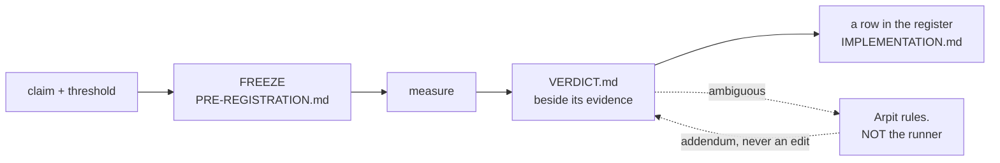

# ADR-RS: the R predictions

- **Name:** `ADR-RS` — cite this everywhere; never cite the number. **Arpit
  asked for `ADR-Rs`, 2026-08-22**; the spelling is uppercase because
  [`tests/test_adr_frontmatter.py`](../../tests/test_adr_frontmatter.py) matches
  `ADR-[A-Z0-9-]+` on the Name line and would reject a lowercase letter. Same
  name, inside the convention it has to live in
- **Status:** **accepted** (2026-08-22) — it codifies a discipline already in
  force and changes none of it. It was held at `proposed` until the register
  check in veto 4 existed, because a record whose central claim is *"the
  register is complete"* should not be accepted while nothing checks that.
  **That check now exists** —
  [`tests/test_prediction_register.py`](../../tests/test_prediction_register.py)
  (W-69), 13 assertions — so the condition this record set for its own
  acceptance is met, and it was met by building the check rather than by
  deciding the check was unnecessary
- **Date:** 2026-08-22
- **Feature:** the prediction system — the R ids, their register, the rules
  that make a frozen claim mean something, and **since 2026-08-25 the
  classification of the runs those claims are measured by**
- **Owns:** [`tests/test_regression_runs.py`](../../tests/test_regression_runs.py)
  — the per-run contract, previously unowned — **and `tools/t2-eval/`, by the
  fallback in decision 10.** The other harnesses stay where they are:
  `tools/maintenance-bench/` with [ADR-MAINTENANCE](0032_hooks.md),
  `tools/pruning-eval/` with W-38. A harness belongs to the thing it measures;
  the *discipline* is this record
- **Laws:** L3
- **Amends:** nothing. CLAUDE.md keeps the rules verbatim and stays the
  normative home; this record explains and guards them

> ## Ruled 2026-08-25 — the run-classification rule is ACCEPTED. What the ruling changed, and what it did not
>
> **Arpit accepted [W-78](../../work/open/W-78-enrichment-was-measured-against-its-own-answers.md)
> ruling 2 on 2026-08-25, in the rewritten form** argued in
> [`blind-authorship-rule.compare.md`](../../work/compare/blind-authorship-rule.compare.md)
> §5. The originally drafted wording — *"an artifact whose author has seen the
> evaluation set is not evidence about that evaluation set"* — was **not**
> accepted, and the compare doc names four reasons it is wrong.
>
> **What the ruling made true, in the change that made it true:**
>
> | what | where |
> |---|---|
> | every measured run is `blind` or `informed` and declares which | decisions 11–13 below; `CLAUDE.md` §Conformance runs |
> | an informed run is **reclassified, never banned** — TREC's mechanism | decision 12 |
> | a delta below the set's resolution is **"no detected change"** | decision 14 |
> | the classification is **checked**, for runs filed from this date | [`tests/test_regression_runs.py`](../../tests/test_regression_runs.py) |
> | the per-run contract gains row 7 | [`work/regression/README.md`](../../work/regression/README.md) |
> | the sealed set and the two controls — **owed, not built** | decision 15, [W-81](../../work/open/W-81-the-sealed-set-and-the-two-controls.md) |
>
> **What it did NOT change.** Not one filed verdict, pre-registration or
> report. **`Amends: nothing` still holds** — CLAUDE.md remains the normative
> home and gains the rule verbatim; this record explains and guards it, which
> is the arrangement decision 1's preamble already described.
>
> ⚠ **The ruling costs this record's own evidence something, and the cost is
> stated rather than absorbed.** Decision 14's floor **retroactively
> reclassifies fux's own blind enrichment arms**: `+1` and `-1` on 50 queries
> are below any defensible resolution, so the honest reading is *"no detected
> effect"*, not *"+1"*. What survives the floor is the **concordance** — both
> blind authors broke the *same two* queries and the informed author preserved
> exactly those two, ~0.028 — which is a different statistic and is the one to
> cite. Three corrections to the filed evidence are recorded in
> [W-78](../../work/open/W-78-enrichment-was-measured-against-its-own-answers.md);
> the reports themselves are frozen and were not edited.
>
> ⚠ **Two of the six rules in the accepted wording are NOT in force**, and
> saying otherwise would be the overclaim this record exists to prevent. The
> sealed query set and the decoy/placebo controls are **build work**, not
> protocol, and they are filed as W-81. Decisions 11–14 are in force today.

---

## §1 — For humans

**An R is a promise made before looking.** You write down the claim and the
number that would settle it, freeze both, *then* measure. Call the pocket, then
take the shot.

That is the whole idea, and everything below exists to stop the one failure it
is vulnerable to: **deciding what counts as success after seeing the result.**



<details>
<summary><b>ASCII twin</b> — the same diagram, for terminals, diffs, and any reader without a Mermaid renderer</summary>

```text
  claim + threshold --> FREEZE (tools/.../PRE-REGISTRATION.md)
                             |
                             v
                          measure
                             |
                             v
                     VERDICT.md (beside its evidence)
                        |            \
                        |             `-- ambiguous --> ARPIT rules, not the runner
                        |                                   |
                        v                                   v
              a row in the register            an ADDENDUM on the verdict,
              (IMPLEMENTATION.md)                 never an edit to it

  The freeze is the point. Everything else protects it.
```

</details>

### The four ways an R can end

| | means | example |
|---|---|---|
| **PASS** | met its frozen threshold | R3, R4, R9 |
| **FAIL** | did not — **and this is a success of the method** | R5, P1 |
| **INCONCLUSIVE** | the instrument could not decide, and said so | R6 |
| **RETIRED** | the question stopped being asked | R7, R8 |

**FAIL is not failure.** P1 ended the pruning design and R5 rewrote how the git
hook works. A recorded negative that stops months of building is the most
valuable thing this system produces, and a project that treats FAIL as
embarrassing will quietly stop producing them.

**RETIRED is not FAIL either**, and conflating them would misreport history.
R7's budget was never missed; the promise was withdrawn.

### Blind and informed — the second half of the same idea

**Pre-registration stops you moving the goalposts after the shot. Run
classification stops you moving the *goal*.**

A prediction freezes the threshold before the number exists. But a threshold is
only half of what a measurement rests on — the other half is the **artifacts**
the run measures: the enrichment text, the prompt that wrote it, the chunking,
the tuned weights, the analysis. If any of those was authored by someone who
had already read the evaluation queries, the number is about *those queries*,
not about the engine, and no amount of threshold discipline recovers it.

Fux learned this the expensive way. An enrichment written by an author who had
seen the failing queries measured **+9**; the same intervention written blind
measured **+1**, and a second blind author measured **-1**. The tell was not
the score — it was that the informed arm broke **nothing**, on a corpus where
adding vocabulary to nine of ten documents *must* disturb something.

**So every run now says which kind it is:**

| | means |
|---|---|
| **blind** | every artifact it depends on was authored with no access to the queries, the judgments, or prior per-query scores |
| **informed** | anything else |

**An informed run is not thrown away.** It is filed, cited, and may inform the
corpus — it simply never supplies a delta and is never compared with a blind
one. That is TREC's manual/automatic split, which has worked since 1994, and it
works because **a rule that bans useful work gets routed around, while a rule
that sorts it survives**.

---

## §2 — For agents

### Context

**Nothing owned this.** The rules lived in CLAUDE.md and were enforced by
`tests/test_regression_runs.py`, but no record claimed the system, so no veto
condition guarded it and no change to it had to update anything.

The gap surfaced on 2026-08-22: **R9 ran, passed, and was cited in six
documents while having no row in the register** — the one table claiming to be
the complete set. Nothing was wrong with the measurement. What was missing was
anything that would notice.

### Decision

**1. An R is a claim frozen before it is measured.** The claim and the number
that settles it are committed *first*, in a `PRE-REGISTRATION.md` under
`tools/`. **A pre-registration is frozen on commit and is never edited** —
not to fix a threshold, not to reword a metric, **not even to repair a dead
link** (W-67 hit exactly that and took the safer branch).

**2. A threshold may never move — and re-judging at a different size is a NEW
prediction.** Not an amendment, not a re-run: a new id, a new pre-registration,
a new verdict. R6's repair is the worked example — `PRE-REGISTRATION-R6-v2.md`
restated the threshold *character for character* and added only the table row
the original lacked.

**3. The register is the table in [`work/IMPLEMENTATION.md`](../../work/IMPLEMENTATION.md),
and it claims to be complete.** Every id, every status, every pointer to its
verdict. **A missing row is the defect this record exists to make visible** —
see veto 4.

**4. Ids are never reused, including retired and superseded ones.** P2–P7 are
spent; R7 and R8 are spent. A reused id makes every prior citation ambiguous,
and citations are how verdicts are reached.

**5. A verdict is never edited — it is added to.** *Nothing supersedes a
measurement except a better measurement.* When Arpit adjudicated R6 on
2026-08-22 the file kept `verdict: INCONCLUSIVE` and gained an **adjudication
addendum** plus a frontmatter key. The measurement and the ruling about it are
different facts and stay visibly different.

**6. An ambiguous result goes to Arpit. The runner does not adjudicate its own
measurement.** R6 fell between its own table's rows; the session that ran it
wrote that up rather than choosing, and was right to. **A session that could
benefit either way from a reading must not be the one that picks it.**

**7. A prediction may not be registered above the design-point ceiling.**
CLAUDE.md §Litmus caps measurement *and commitment* at 10 000 documents. A
threshold above it is a promise nobody may test, which is worse than no
promise — it reads as a live gate and can never fire. **R7 and R8 were
withdrawn under exactly this** on 2026-08-22.

**8. Only Arpit retires a prediction, and retirement is recorded, not deleted.**
The row stays with status RETIRED and the reason. A prediction that vanishes
takes with it the evidence that anyone ever cared about the question.

**9. Never ship a ranking or behaviour change off a single corpus.** Carried
verbatim from CLAUDE.md; it is why W-52 needs a second corpus and not just an
instrument.

**10. A harness whose feature record is retired falls back to this record.**
Added 2026-08-22, the same day it was first needed. A harness normally belongs
to the thing it measures — `tools/maintenance-bench/` to ADR-MAINTENANCE — and
an open item may hold one, as W-38 holds `tools/pruning-eval/`. **But a
retired record cannot own anything, and a proposal is not a valid owner**
(`tests/test_adr_ownership.py` accepts an ADR name or a `W-nn` id, nothing
else). When ADR-T2-SEGMENTS was removed from the register on Arpit's
instruction, `tools/t2-eval/` was orphaned in the same change.

**The fallback is here rather than nowhere**, because a harness that measured a
prediction is prediction apparatus even after the feature question is settled —
and an unowned component is a component whose contract can change with no
record updating. **This is a backstop, not a preference**: a harness moves to
its feature's record the moment one exists.

**11. Every measured run is `blind` or `informed`, and declares which.** A run
is **blind** only if *every* artifact it depends on was authored without access
to the evaluation queries, the judgments, prior per-query scores, or any
derived report of them — a failure list, a dashboard, a ticket naming a query.
The artifacts are: **corpus enrichment, the enrichment prompt, chunking and
index configuration, retriever and reranker settings, and the analysis.**
Anything else is **informed**.

Two things this deliberately does not say. It does not say *"has seen"*, the
binary CONSORT 2025 item 20a tells you to abandon — blindness is per-person and
per-stage, and the drafted wording omitted analysts entirely. And it does not
name the model, because **the artifact is the contaminated object**, not the
model and not the metric. *That* phrasing is kept verbatim from the original
draft; it was the part the draft got right.

**12. An informed run is RECLASSIFIED, never banned — and never supplies a
delta.** It is filed, listed, cited, and may inform the corpus. It is **never
compared with a blind run and never used to state a difference between arms.**

This is the load-bearing decision and it is the one the drafted wording missed.
TREC has split manual from automatic runs since **1994**: manual runs are
reported and contribute to the judgment pool, and are never scored against
automatic ones. **A prohibition on useful work gets routed around quietly; a
taxonomy survives**, and a rule that is quietly violated is worse than no rule
because it also supplies false assurance.

**13. The run states who authored each artifact and what evaluation material
they could reach.** Per artifact: the author, and which of *queries /
judgments / prior scores / none*. The sentence copied is ARRIVE 2.0 item 5 —
*"describe who was aware of the group allocation at the different stages."*

**The burden is on the author to argue exposure was absent**, not on a reader
to demonstrate it was present. Paraphrase-level exposure defeats string
matching, and BIG-bench's canary GUID — embedded precisely so labs could
exclude it, and reproducible by a model that was trained on it anyway — is the
standing proof that *"did you read the file?"* is not the question. Disclosure
is the fallback; a set nobody can reach is the control.

**And the label for an informed number is not "upper bound".** An upper bound
asserts a known direction *and* a bounded magnitude; a leaked measurement has
**unknown bias magnitude**. The honest label is **"not a generalisation
estimate."**

**14. A delta smaller than the set's resolution is reported as "no detected
change", whoever authored it.** Fux's engine is deterministic, so *run-to-run*
variance is zero — and that is not the variance that matters. The variance that
matters is **author-to-author**, and it has been sampled exactly twice: `+1` and
`-1` on fux-playground's 50 queries.

**Provisionally, and explicitly as a placeholder for a measurement rather than
a measurement: on a 50-query set, nothing under ±2 queries (4 pp) is a detected
change.** TREC puts standard MAP error at 50 topics near **2.4 %**; a
meta-analysis of >120 Kaggle competitions recommends **≥10 000 examples** to be
safe from adaptive effects. Fifty queries is under-powered and this record says
so rather than letting a future reader discover it.

⚠ **This applies retroactively to fux's own numbers, and that is the point.**
The blind arms' `+1` and `-1` are below the floor: the honest reading is **no
detected effect**, not `+1`. What survives is the **concordance** — both blind
authors broke the same two queries, the informed author preserved exactly those
two, ~0.028 — a different statistic, roughly **17x** the evidential weight of
the *"broke nothing"* sentence that was actually filed, and the one to cite.

**15. An enrichment change is scored against a decoy set and a placebo — NOT
BUILT, and owed as [W-81](../../work/open/W-81-the-sealed-set-and-the-two-controls.md).**
*Neural Retrievers are Biased Towards LLM-Generated Content* (KDD 2024)
establishes **source bias**: retrievers rank LLM-written text higher
independently of whether it informs, and the effect reaches re-rankers. Every
fux enrichment arm added ~70 tokens of fluent LLM prose to nine of ten
documents with **no matched control**, so text *presence* and text *content*
are not separable in any number this project has filed.

Two controls close it — a **decoy** query set the enrichment was not aimed at,
and a **content-free placebo** enrichment of matched length — and decision 11
implies a third thing that does not exist either: a **sealed** subset of
queries, held by one owner, never shown to anyone who authors an artifact,
rotated when it leaks. **None of the three is built.** They are build work, not
protocol, and this decision is filed as unbuilt rather than written as though
it were in force. ⚠ Sealing also *shrinks* the visible set, which makes
decision 14's power problem worse before it makes it better; W-81 has to
resolve that tension rather than inherit it silently.

**16. When a pre-registration's live path is DELETED, the run keeps a mirror of
it — the verdict is not edited.** Added 2026-08-25, the first day it was needed.

Decision 1 freezes a pre-registration and decision 5 freezes a verdict, and
between them they assume the file the verdict *points at* keeps existing. It
does not always: [DENSE-CHUNK](../../work/regression/2026-08-24-dense-lane-gate/VERDICT.md)
names `src/fux/query/dense.py` — the bar lived in that module's docstring — and
that module was deleted when the dense lane and the embedding model were
removed.

**The three ways out, and why this one:**

| | |
|---|---|
| edit `pre_registration:` to point somewhere else | **forbidden by decision 5.** A verdict is never edited |
| keep the module alive as a stub so the pointer resolves | a file kept only so a test passes, which is the vestige class this project keeps deleting |
| **mirror the file into the run** | ✅ the measurement stays citable and nothing frozen is touched |

**The rule.** The run carries the pre-registration at its *original path* under
`evidence/pre-registration/`, **byte for byte as it stood when the verdict was
ruled** — verified against the commit that filed the verdict, not copied from
whatever the file had drifted to.
[`tests/test_regression_runs.py`](../../tests/test_regression_runs.py) resolves
the pointer there **only when the live path is gone**, and a second check
refuses a mirror that sits beside a live file, because two frozen thresholds
for one verdict is exactly the ambiguity decisions 1 and 2 exist to prevent.

**Why this is not archive-is-not-evidence in disguise.** `archive/` holds
superseded *decisions*, which may be named but never cited as grounding. This
holds a frozen *threshold* a filed measurement was ruled against. **It is the
evidence**, kept beside the run that used it, in the one directory this project
forbids editing.

⚠ **The general problem it solves is not rare.** Deleting dead code and keeping
measurements readable would otherwise be in tension, and a project that has to
choose will quietly choose the code — leaving verdicts that point at nothing.

### Consequences

- **The prediction system is now guardable.** Before this record a change to
  the discipline updated nothing; now it updates this.
- **`tests/test_regression_runs.py` gains an owner**, so its per-run contract
  changes with a record rather than silently.
- **Veto 4 is unbuilt and is the acceptance gate.** A check that walks
  `work/regression/*/VERDICT.md`, reads each `prediction:` id, and asserts a
  matching register row — it would have caught R9 the day it ran. **This record
  stays `proposed` until it exists**, because accepting a record whose central
  claim is *"the register is complete"* while nothing verifies completeness is
  the same class of error as an unmeasured gate.
- **Nothing about any existing R changes.** No verdict, no pre-registration and
  no status is touched by writing this down.

**Added by the 2026-08-25 ruling:**

- **A run can now be wrong in a way the register catches.** Before decision 11,
  an artifact authored against the evaluation set produced a number that looked
  exactly like a clean one. It still can — but the run has to *say* so, and a
  run filed from 2026-08-25 that says nothing fails
  [`tests/test_regression_runs.py`](../../tests/test_regression_runs.py).
- **The existing runs are exempt by baseline, not by exception.** Every filed
  report is frozen (decision 5's sibling rule for reports), so the check is
  anchored to the run's own directory date. This is the `docs/adr/RULE-SINCE`
  pattern applied to a second gate, and it is the only shape that does not
  require editing frozen evidence to turn a rule on.
- **A surface capture is out of scope**, and deliberately: it pre-registers no
  threshold and states no delta, so a classification on it would be a label
  with nothing to label. The check reads the same *"surface capture"*
  declaration the evidence rule already reads, so the two cannot drift apart.
- **Fux's own enrichment numbers are downgraded by its own new rule** — see
  decision 14. A discipline whose first act is to weaken the evidence that
  motivated it is behaving correctly.

### Alternatives considered

| | why not |
|---|---|
| **Leave it in CLAUDE.md only** | it worked until it didn't — R9 went unregistered and nothing noticed, because no record owned noticing. CLAUDE.md stays the normative home; this adds the ownership and the vetoes |
| **Own the harnesses too** | a harness belongs to the feature it measures — `maintenance-bench` with ADR-MAINTENANCE. Claiming them here would break one-component-one-owner for no gain |
| **Fold predictions into the ADR register** | different lifecycles. A record is superseded by argument; a prediction is superseded only by a better measurement, and mixing them invites exactly the confusion decision 5 forbids |
| **The originally drafted wording** — *"an artifact whose author has seen the evaluation set is not evidence"* | **refused 2026-08-25.** Four faults, each named by a standard: *"has seen"* is the binary CONSORT 2025 abandons; *"seen"* is undefined exactly where teams fail (queries? judgments? a Slack thread naming a bad query?); *"is not evidence"* is a prohibition and will be violated quietly where TREC's reclassification would not; and *"upper bound"* asserts a bounded magnitude a leak does not have. It was also silent on power and on controls |
| **Ban informed artifacts outright** | you cannot unsee. Everyone working on this project accumulates exposure, so a ban ends with nobody eligible to author anything — and the rule would then be ignored rather than repealed |
| **Rely on disclosure alone, with no sealed set** | BIG-bench's canary is the counter-example: a marker embedded *so that* labs could exclude it, and reproducible by a model trained on it regardless. FrontierMath's actual fix was a sealed holdout, not a norm. Disclosure is the fallback; decision 15 owes the control |
| **Enforce it in `fux enrich`** | fux never calls a model — the author is outside the program, so there is nothing for the code to check. This is a measurement-protocol rule and its enforcement lives where runs are filed, which is why it landed here and not in [ADR-ENRICH](0040_enrich.md) |

### Reference (required)

- The rules this codifies — [`CLAUDE.md`](../../CLAUDE.md), §the lifecycle and
  §Litmus. **Verbatim, not restated**, so there is one normative home.
- The register — the prediction table in
  [`work/IMPLEMENTATION.md`](../../work/IMPLEMENTATION.md).
- The per-run contract this record owns —
  [`tests/test_regression_runs.py`](../../tests/test_regression_runs.py) and
  [`work/regression/README.md`](../../work/regression/README.md).
- **Decision 5's worked example** — [R6-MERGE](../../work/regression/2026-08-20-r6-merge-driver/VERDICT.md),
  which still reads INCONCLUSIVE beneath its 2026-08-22 adjudication addendum.
- **Decision 2's worked example** — the R6 re-run at
  [`2026-08-22-r6-rerun`](../../work/regression/2026-08-22-r6-rerun/VERDICT.md),
  a new pre-registration rather than an edited one.
- **Decision 6's worked example, and the reason it is a rule** —
  [R5-HOOK](../../work/regression/2026-08-20-r5-hook-latency/VERDICT.md): a FAIL
  filed at the judged size, with `src/` last touched *before* the
  pre-registration, so nothing could have been tuned to pass.
- Pre-registration as practised in empirical research, and the outcome-reporting
  bias it exists to prevent — <https://www.cos.io/initiatives/prereg>
- **The ruling behind decisions 11-15** —
  [`work/compare/blind-authorship-rule.compare.md`](../../work/compare/blind-authorship-rule.compare.md),
  accepted by Arpit 2026-08-25, and
  [W-78](../../work/open/W-78-enrichment-was-measured-against-its-own-answers.md),
  which carries the three corrections to the evidence.
- **The measurement that motivated them** —
  [the blind enrichment re-grade](../../work/regression/2026-08-24-blind-enrichment-regrade/report.md)
  and [the second blind author](../../work/regression/2026-08-24-blind-enrichment-second-author/report.md).
  ⚠ Both are **informed** runs by decision 11 (the analysis was written with the
  scores in hand) and both are below decision 14's floor. They are cited for the
  **concordance**, which is what survives.
- **The unbuilt half** —
  [W-81](../../work/open/W-81-the-sealed-set-and-the-two-controls.md).

### Veto condition

**Reopen this decision if any of these becomes true:**

1. **An R id is reused** — including a retired one (P2–P7, R7, R8).
2. **A frozen `PRE-REGISTRATION.md` is edited after any number exists**, for any
   reason including a link repair.
3. **A `VERDICT.md` is edited rather than added to**, or a `verdict:` field is
   changed to reflect a ruling instead of a re-measurement.
4. **A filed verdict has no row in the register** — the R9 case, and the one
   this record most wants made mechanical. **Built 2026-08-22** as
   [`tests/test_prediction_register.py`](../../tests/test_prediction_register.py),
   and this record's acceptance gate is therefore discharged.

   Building it forced one refinement worth recording: the first verdict that is
   **not an `R` prediction** (`W44-SIGNAL`, a feature gate) arrived in the same
   session. Rather than give it an `R` number it never earned — inventing an
   architectural prediction nobody made — `IMPLEMENTATION.md` grew a second
   **feature-gate** table, and the check reads **both**. The completeness claim
   is unchanged and now covers a class the R series was never meant to hold.
5. **A prediction is registered with a threshold above the design-point
   ceiling** (CLAUDE.md §Litmus).
6. **A session adjudicates its own ambiguous result** rather than handing it to
   Arpit.
7. **A delta is stated across the blind/informed boundary** — an informed arm
   compared with a blind one, or either compared with a baseline the other
   authored. Decision 12 forbids it; this is the condition most likely to be
   broken by accident, because the two numbers sit in the same table.
8. **A measured run filed on or after 2026-08-25 carries no `classification`**,
   or names fewer artifacts than decision 11 lists. **Mechanical** — see check 7
   below.
9. **A delta below decision 14's floor is reported as a change** rather than as
   *no detected change*.
10. **Decision 14's floor is cited as measured.** It is a placeholder. If a
    document quotes ±2 queries without the word *provisional*, the placeholder
    has hardened into a fact nobody measured, which is the failure R7 and R8
    were withdrawn for in a different costume.
11. **A `pre_registration:` line is edited to survive a deletion**, or a
    mirrored copy is kept *beside* a live one. Decision 16 allows exactly one
    shape and the second check enforces it.

**How to check them:**

```bash
# 1 — no id appears twice, and no retired id reappears
grep -rn "^prediction:" work/regression/*/VERDICT.md | sort | uniq -d
# expect: nothing

# 2 — a frozen pre-registration changed after its first number
git log --oneline -- 'tools/**/PRE-REGISTRATION*.md'
# expect: one commit each, before the run that used it

# 3 — the per-run contract
uv run pytest -q tests/test_regression_runs.py

# 4 — the register cross-check, BUILT 2026-08-22 (this record's acceptance gate)
uv run pytest -q tests/test_prediction_register.py
# every filed verdict's `prediction:` id must have a row in one of
# work/IMPLEMENTATION.md's two registers. NOT the reverse: a RETIRED id (R7, R8)
# has no verdict and must pass, and there is a test asserting that direction so
# it cannot be silently inverted.

# 5 — no live threshold names a size above the ceiling
grep -rn "100 000\|50 000" tools/*/PRE-REGISTRATION*.md
# expect: only inside frozen historical files, never in a newly registered one

# 7 — every measured run filed from 2026-08-25 declares blind or informed
uv run pytest -q tests/test_regression_runs.py -k classification
# baselined on the run directory's own date: frozen reports are never edited to
# satisfy a rule written after them. A surface capture is out of scope by
# decision 15's scope note, read from the same declaration the evidence rule uses.

# 9/10 — the floor is quoted as provisional wherever it is quoted at all
grep -rn "no detected change\|resolution floor" work/ docs/ --include=*.md
```
---

## References

*Every source this record cites, gathered in one place. §2's **Reference
(required)** names the grounding; this is the complete list. An archived
document is never listed here — the body may name one, but archive is not
evidence.*

**Records** — [ADR-MAINTENANCE](0032_hooks.md)

**Code**

- [`tests/test_adr_frontmatter.py`](../../tests/test_adr_frontmatter.py)
- [`tests/test_prediction_register.py`](../../tests/test_prediction_register.py)
- [`tests/test_regression_runs.py`](../../tests/test_regression_runs.py)

**Measured evidence**

- [`work/regression/2026-08-20-r5-hook-latency/VERDICT.md`](../../work/regression/2026-08-20-r5-hook-latency/VERDICT.md)
- [`work/regression/2026-08-20-r6-merge-driver/VERDICT.md`](../../work/regression/2026-08-20-r6-merge-driver/VERDICT.md)
- [`work/regression/2026-08-22-r6-rerun/VERDICT.md`](../../work/regression/2026-08-22-r6-rerun/VERDICT.md)
- [`work/regression/README.md`](../../work/regression/README.md)

**Project docs**

- [`CLAUDE.md`](../../CLAUDE.md)
- [`work/IMPLEMENTATION.md`](../../work/IMPLEMENTATION.md)

**Papers and specifications**

- Center for Open Science, *Preregistration* — the practice, and the
  outcome-reporting bias it exists to prevent
  <https://www.cos.io/initiatives/prereg>
- **TREC**, the manual/automatic run split, in force since TREC-2 (1994) and
  restated in the Deep Learning Track guidelines — the mechanism decisions 11
  and 12 copy: *reclassify, do not ban*.
- **CONSORT 2025**, item 20a — abandon binary blinding labels; name **who** was
  blind at **which stage**, analysts included. Decision 11's per-artifact list.
- **ARRIVE 2.0**, item 5 — *"describe who was aware of the group allocation at
  the different stages."* Decision 13's sentence, copied.
- Kaufman, Rosset et al., *Leakage in Data Mining* (KDD 2011) — legitimacy is a
  property of **how a feature came to exist**, not of its values. An enrichment
  note is a feature.
- Kriegeskorte et al., *Circular analysis in systems neuroscience*
  (Nature Neuroscience, 2009) — the same data selecting the artifact and scoring
  it; the closest fit for the **human** role in this failure.
- Dai et al., *Neural Retrievers are Biased Towards LLM-Generated Content*
  (KDD 2024) — **source bias**; decision 15's placebo arm exists because of it.
- Nogueira et al., **doc2query** — document expansion that enforces the split
  mechanically, using training queries only. Document-side enrichment done
  correctly is not novel; doing it without the split is what was novel here.
- **BIG-bench**'s canary GUID, and **FrontierMath**'s sealed holdout — the two
  standing demonstrations that disclosure is a fallback and a sealed set is the
  control (decision 13, decision 15).
