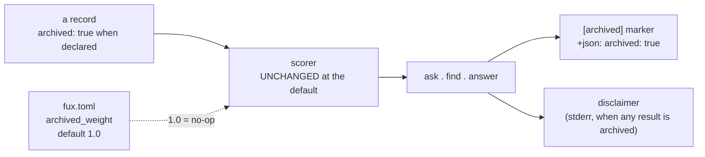

# ADR-ARCHIVED-CONTENT: what "archived" does, once a document carries it

- **Name:** `ADR-ARCHIVED-CONTENT` — cite this everywhere; never cite the number
- **Status:** accepted — **built, all seven decisions** (2026-08-22). The
  demotion weight landed earlier that day; the record property (decision 1),
  the marker (decision 3) and the disclaimer (decision 7) landed the same
  evening when **Arpit lifted decision 5's gate by direct instruction**. The
  instrument decision 5 asked for was written first and **still exists** —
  [`tools/archived-signal-eval/`](../../tools/archived-signal-eval/PRE-REGISTRATION.md),
  frozen before any number — so the gate was satisfied *and* lifted, and the
  measurement stands as evidence rather than as a precondition. See decision
  5's history table.
- **Date:** 2026-08-22
- **Feature:** what happens once a document is declared `archived=true` — the
  record property, ranking, the marker, and the disclaimer. **Not** the file
  or its grammar — that is [ADR-DIR-LIST](0022_dir-list.md).
- **Owns:** no module split from ADR-DIR-LIST's own claim of "nothing new in
  `src/`" — the demotion weight lives in `config.py`'s `archived_weight` field
  and is applied in `query/rank.py::rank()`; `ingest/gitdir.py::archived_dirs()`
  reads the declaration ADR-DIR-LIST's grammar parses. These files are shared
  with ADR-DIR-LIST's narrower scope (the declaration itself); nothing here
  claims a component ADR-DIR-LIST does not already touch.
- **Laws:** L3, L6 — see [ADR-LAWS](0001_laws.md); never restated here
- **Supersedes:** nothing directly. Decisions 1-7 below were authored inside
  [ADR-DIR-LIST](0022_dir-list.md) as its decisions 5, 6, 7, 8, 10, 11 and 12
  between 2026-08-19 and 2026-08-22. **Carved out on Arpit's instruction
  2026-08-22** — the same substance, renumbered into an independently citable
  record, because "how archived content behaves" and "how the directory list
  file works" turned out to be two different questions sharing one document.
  ADR-DIR-LIST keeps decisions 1-4 and 9 (renumbered 1-5) under its own name
  and number; **existing citations to "ADR-DIR-LIST decision 10/11/12" (and
  the few to "decisions 5, 7") are being repointed to this record's decisions
  5, 6, 7 (and 1, 3) in the same change** — except inside frozen regression
  reports and `WORKLOG.md`'s past entries, which are never edited and are
  named explicitly in Consequences below.

---

## §1 — For humans

A directory (or, through [ADR-URL-LIST](0018_url-list.md)'s shared grammar, a
URL) can be declared `archived=true` in `.fux/sources/dirs`. It is still
indexed — an archived document is the honest answer to *"why does this look
the way it does,"* and Fux never stops answering that question. What this
record decides is everything that happens **after** the declaration: does the
record say so, does ranking change, does a verb tell you, and can you ask for
a document like that to matter less.

```console
$ cat .fux/sources/dirs
docs
work
archive/v0.26-docs        archived=true
```

**Diagram — Mermaid and its ASCII twin. Update both, always, together.**



<details>
<summary><b>ASCII twin</b> — the same diagram, for terminals, diffs, and any reader without a Mermaid renderer</summary>

```text
   a record                    fux.toml [ranking] archived_weight
   archived: true when         default 1.0 = no-op, same score, same order
   declared          \         set below 1.0 = the user asked for a demotion
                       \                  |
                        v                 v
                       scorer  <----------+
                          |
                          v
                  ask . find . answer
                    |-- [archived] marker (ask), --json: "archived": true
                    +-- disclaimer on stderr, when any result is archived
```

</details>

### Examples — with and without the signal

**None of the three is shipped** except the demotion capability at its
no-op default. They are what decisions 1, 3, 6 and 7 describe, written down
so the design could be argued about before any of it was built — copied
verbatim from where they were first written, in ADR-DIR-LIST.

**A · Without the signal — what the engine does today.**

```console
$ fux ask "what is the ingest cache" --top 5
5.9021  Ingest cache and chunker        (archive/v0.26-docs/adr/0002-ingest-cache-chunker.md)
4.8813  Per-file cache invalidation     (archive/v0.26-docs/adr/0006-cache-invalidation.md)
3.9902  Chunker tuning                 (archive/v0.26-docs/adr/0009-chunk-sizing.md)
3.1150  Cache observability            (archive/v0.26-docs/adr/0012-debug-observability.md)
2.7734  Substrate storage              (archive/v0.26-docs/adr/0003-sqlite-substrate.md)
```

Five confident, well-written documents describing the **per-file cache**, a
subsystem CLAUDE.md forbids porting back. Nothing says so. The only signal is
a path prefix.

**B · With the signal, at the shipped default (`archived_weight = 1.0`).**

```console
$ fux ask "what is the ingest cache" --top 5
5.9021  [archived] Ingest cache and chunker     (archive/v0.26-docs/adr/0002-...)
4.8813  [archived] Per-file cache invalidation  (archive/v0.26-docs/adr/0006-...)
3.9902  [archived] Chunker tuning               (archive/v0.26-docs/adr/0009-...)
3.1150  [archived] Cache observability          (archive/v0.26-docs/adr/0012-...)
2.7734  [archived] Substrate storage            (archive/v0.26-docs/adr/0003-...)

note: 5 of 5 results are from archived sources — retired from the live
      corpus. An archived document records what was true when it was
      retired, not what is true now.
```

**Every score and the whole order are byte-identical to A** — compare them
column by column. That is decision 2 holding at the default, and it is the
property this record's veto checks.

**C · With a demotion the user asked for.**

```toml
# fux.toml
[ranking]
archived_weight = 0.5
```

```console
$ fux ask "what is the ingest cache" --top 5
3.4417             How ingest works today        (docs/adr/0007_ingest.md)
2.9511  [archived] Ingest cache and chunker      (archive/v0.26-docs/adr/0002-...)
2.4407  [archived] Per-file cache invalidation   (archive/v0.26-docs/adr/0006-...)
2.1188             Delta ingest and reuse        (docs/adr/0007_ingest.md)
1.9951  [archived] Chunker tuning                (archive/v0.26-docs/adr/0009-...)

note: 3 of 5 results are from archived sources (demoted, weight 0.50) —
      retired from the live corpus. An archived document records what was
      true when it was retired, not what is true now.
```

Live documents surface. **This output is unreachable at the shipped
default** — it exists only because someone set the weight, which is the
whole of decision 6's safety argument.

**`--json` carries the flag rather than the prefix**, because a machine
reader should not parse a title:

```console
$ fux ask "what is the ingest cache" --top 1 --json
{"results": [{"id": "...", "title": "Ingest cache and chunker",
              "loc": "archive/v0.26-docs/adr/0002-ingest-cache-chunker.md",
              "score": 5.9021, "archived": true}]}
```

> **`fux find` is why the note is not on stdout.** `find` prints bare paths
> so it can pipe:
>
> ```console
> $ fux find "what is the ingest cache" --top 3
> archive/v0.26-docs/adr/0002-ingest-cache-chunker.md
> archive/v0.26-docs/adr/0006-cache-invalidation.md
> docs/adr/0007_ingest.md
> note: 2 of 3 results are from archived sources.   <-- would be piped
> ```
>
> So the note goes to **stderr**, and `--json` carries `archived` per result.

**The ranking does not change at the default. Not by a byte.** The flag
exists to carry a **fact** into the answer — *this document is retired* —
not to improve a result, and **not to tell the reader what to conclude from
it** (decision 7). **The demotion in C is a separate mechanism with a
separate default**, and conflating the two is how "annotate, never reorder"
would have turned into a reorder without anyone deciding it.

**No attribute means not archived.** Every list that exists today stays
correct.

---

## §2 — For agents

### Context

ADR-DIR-LIST decided the file, its grammar, and that the archived attribute
is **declared, never derived** (its decisions 1-4, staying there). It also
had to decide, in the same document, what happens once that declaration
exists — a record property, whether ranking changes, what verbs show, and
whether a demotion or a disclaimer ships. That second half kept growing:
what started as two decisions (5 and 7) on 2026-08-19 was four more by
2026-08-22 (6 amended, 8, 11, 12) — the document had become two decisions
wearing one name.

Arpit's instruction, 2026-08-22: split it. Everything about *the file* stays
ADR-DIR-LIST. Everything about *what archived does* moves here, keeping its
substance exactly, renumbered so this record can be cited on its own without
a reader needing to know which half of ADR-DIR-LIST they mean.

### Decision

**1. A record from an archived source carries `archived: true`**, written at
ingest and stored per record — the way `mode` and `meta` already are, and for
[ADR-RECORD](0010_index-record.md)'s reason: a record read years later states
the rule it was written under rather than having it inferred by whoever reads
it. Absent when false, so no existing record changes shape.

**2. The ranking is byte-identical *at the default*. This is not permission
to change an order unless someone asks for one.** Scores, sort, and the
differential law between scan and accelerator are untouched. An
implementation that reorders anything at the default has not implemented
this record.

> **Amended 2026-08-22 (Arpit).** This read *"may not change an order,"* full
> stop, until Arpit ruled that archived documents should be demotable and
> that **the demotion is configurable** (decision 6). The words *at the
> default* are the whole amendment, and they are load-bearing: at the shipped
> default the weight is `1.0`, nothing reorders, and this decision's veto
> still fires on any drift. What is now permitted is a **user** asking for a
> demotion — not this record taking one.

**3. Every verb surfaces it, and they agree.** `--json` carries `"archived":
true`; text output prefixes the title with `[archived]`. `find` and `ask`
show the same marker, because [ADR-FIND](0005_find.md) makes `find` a
projection of `ask` rather than a second strategy.

**4. `df` stays out of scope, deliberately.** Computing it over non-archived
documents only is a ranking change across 42% of live terms and belongs to
[W-52](../../work/open/W-52-df-over-the-union.md), behind a pre-registration.
**This record is honest about being partial**: it fixes what a reader is
told, not what the scorer computes.

**5. The signal waits for its instrument; the file does not.** Amended
2026-08-19 (Arpit), because what became this record and what stayed
[ADR-DIR-LIST](0022_dir-list.md) turned out to have different risk:

| half | decisions | state |
|---|---|---|
| the file, the grammar, the declaration | [ADR-DIR-LIST](0022_dir-list.md) decisions 1-4, 9 | **built** — `.fux/sources/dirs` is read, `archived=` is parsed and validated |
| the **signal** — a record property, and a marker in every verb | this record's decisions 1, 3 | **BUILT 2026-08-22.** The gate was met the way it was written — the query set was frozen first ([`tools/archived-signal-eval/`](../../tools/archived-signal-eval/PRE-REGISTRATION.md), 45 queries, three slices) — **and then lifted by Arpit's direct instruction** in the same session. Either alone would have sufficed; both happened, in that order |
| the **disclaimer** — a response-level note when any archived document is returned | this record's decision 7 | **BUILT 2026-08-22.** *"The gate is lifted for W-44 - Arpit order."* The call this row said was his to make, made. It ships on **stderr only**, so stdout stays byte-identical and `find` stays pipeable — the shape ADR-CLI's staleness declaration already set |
| the **demotion weight** — a configurable multiplier | this record's decision 6 | **ungated at the default**, because `1.0` reorders nothing and this record's veto still guards it. **Moving the default is a ranking change** and stays behind [W-52](../../work/open/W-52-df-over-the-union.md)'s pre-registration *plus a second corpus* |

The split is safe in exactly one direction. Parsing a declaration nothing
reads changes no committed byte and no score, so it cannot be wrong;
**changing what a verb says about a document is a claim that needs an
instrument**, and five hand-picked probes is not a measurement — the
playground goldens are a different corpus and cannot see this.

**6. Archived documents are demotable, and the demotion is configurable.**
Ruled by Arpit, 2026-08-22, reversing the "never reorder" half of decision 2.

- **The default is `1.0` — no demotion.** That is what keeps this shippable:
  at the default no score and no order changes, so nothing here is a ranking
  change and CLAUDE.md's *never ship a ranking change off a single corpus*
  rule is not engaged. **What ships is the capability, not the change.**
- **Moving that default IS a ranking change** and is gated — on the
  pre-registered query set *and* a second corpus, per
  [W-52](../../work/open/W-52-df-over-the-union.md)'s trigger. No session may
  move it because a number looked good on this repo.
- **It keys off the declaration, never a path.**
  [ADR-DIR-LIST](0022_dir-list.md) decision 4 stands:
  `loc.startswith("archive/")` is not a test, here or anywhere.
- **Where it lives: `fux.toml`, not `.fux/sources/dirs`.** Arpit left the
  location to this record; both options and their costs are stated so the
  reasoning survives. **A weight is a ranking parameter, not a source
  attribute** — it says what the *scorer* does, where every other attribute
  on a `dirs` line says what a *source is*.
  [ADR-DIR-LIST](0022_dir-list.md) decision 3 caps that file's attribute set
  at exactly one, and a per-source weight would both break that cap and
  create a per-source ranking knob nobody asked for. The cost of choosing
  `fux.toml` is that a reader now looks in two records to understand how an
  archived source is treated, and decision 7's disclaimer is part of why
  that is acceptable: the behaviour announces itself at the point of use.
- **This is not `df`.** A score multiplier on a finished score is a
  different mechanism from computing `df` over a different population —
  decision 4 stands and [W-52](../../work/open/W-52-df-over-the-union.md) is
  untouched by this.

**7. When any archived document is returned, the response carries a
disclaimer.** Ruled by Arpit, 2026-08-22.

- **Response-level, not per-result**, and that is the point. Decision 3's
  `[archived]` prefix marks each row; this states *what archived means*
  once, where it cannot be skimmed past. It is the direct answer to this
  record's own complaint that **"a rule enforced by whether a reader
  notices a path prefix inside a context window is a rule with no
  mechanism"** — a prefix is such a prefix.
- **Conditional.** It appears only when at least one returned document is
  archived. A disclaimer on every answer is a disclaimer nobody reads.
- **It states what archived *is*, not what the reader should *do* about
  it.** Amended 2026-08-22, and this is the substantive part of decision 7.

  > `note: 3 of 5 results are from archived sources — retired from the live`
  > `corpus. An archived document records what was true when it was retired,`
  > `not what is true now.`

  The wording it replaced — *archived content may be named, but the build
  is based on the records* — **silently assumed the reader was building.**
  Fux is queried from at least three stances and the same archived document
  is a different thing under each:

  | the question | archived content is | so the reader wants |
  |---|---|---|
  | *why did we choose X* — history, business | **the answer** | to read it as authoritative for its period |
  | *how does X work now* — architecture | **misleading** | the live document, with this as contrast |
  | *implement X* — an agent building | **dangerous** | never to port from it |

  A single sentence cannot instruct all three, and **the list is not
  closed** — there are stances nobody has enumerated. So the disclaimer
  states the fact and stops. **What to do about the fact is the consumer's
  policy, not the engine's** — see
  [`consumer-intent-policy.md`](../../archive/proposals/consumer-intent-policy.md).
- **Fux does not take an `--intent` flag, and that is a decision.** Carrying
  a taxonomy of reader intents means shipping an enum that is provably
  incomplete on the day it ships, and putting policy inside an engine whose
  whole argument is that it ships **facts** and lets the caller decide. The
  [refer plane](0030_refer-plane.md) already set this precedent: it returns
  `current`/`stale`/`unverified` and **refuses to collapse "we did not
  look" into "we looked and it was fine"** — the caller supplies the
  policy. Archived is the same shape of claim and gets the same treatment.
- **It does not replace decision 3.** Both ship: the marker says *which*,
  the disclaimer says *what that means*.
- **stdout stability applies.** `--json` is a contract and the surface
  captures compare bytes; whether the disclaimer is a new `--json` key or
  stderr-only is an [ADR-CLI](0002_cli-surface.md) decision, taken there,
  not settled in code.

### Consequences

- **All seven decisions are built as of 2026-08-22, and the gate came down
  two ways at once.** The instrument decision 5 demanded was written and
  frozen (45 queries, three slices, a threshold that can return NOT
  WARRANTED) *before* Arpit lifted the gate by instruction. That ordering is
  worth keeping in the record: the measurement is **evidence**, not a
  formality discharged after the fact, and it can still return a result that
  embarrasses the feature. A gate lifted by authority does not make the
  number that was going to be measured stop mattering.
- **`is_archived_loc()` has exactly one definition**, in
  `ingest/gitdir.py`, used by both the ingest stamp and the query-time
  marker. Two copies of that predicate is a differential-law failure waiting
  for them to drift — the property would say one thing and the marker
  another about the same document.
- **The marker reads the record property first and the declaration second.**
  An index committed before the property shipped carries no `archived` key,
  and re-ingesting the world is not a precondition for the marker being
  correct. Both inputs are declarations, so neither path ever derives
  currency from a path convention.
- **`find`'s stdout is deliberately unmarked.** It prints bare paths so it
  can pipe; a `[archived]` prefix there is read by `xargs` as part of a
  filename. The flag rides in `--json` and the note on stderr. This is the
  one place decision 3's *"every verb surfaces it"* is satisfied by the
  machine-readable form rather than the text form, and that is not an
  exception grudgingly made — it is what "surfaces it" has to mean for a
  verb whose entire contract is that its stdout is a list of paths.
- **One test moved rather than broke.** `test_default_weight_is_byte_-
  identical_to_no_archived_dirs` compared whole `AskResult` objects, which
  silently asserted the marker could never exist. It now compares
  `(id, loc, score)` — the ranking, which is what decision 2 actually fixes
  — and a second test asserts the marker is present *and* the order
  unchanged, as a pair. **A test written for a gated feature can quietly
  forbid the feature**, and the only reason this was caught is that the
  suite failed loudly when the flag appeared.
- **The archived declaration is only as honest as the person writing it.**
  A derived signal cannot be forgotten; a declared one can. What it buys is
  working correctly for a consumer whose layout does not match this repo's
  — the trade the design point makes everywhere else too.
- **Splitting this out of ADR-DIR-LIST leaves a small, named, permanent
  scar.** A handful of citations to "ADR-DIR-LIST decision 10/11/12" (and
  two to "decisions 5, 7") sit inside documents this repo's own rules never
  edit — **`WORKLOG.md`** (append-only; `work/WORKLOG.md:640` reads
  "ADR-DIR-LIST decision 6" for what is now this record's decision 2) and
  **frozen regression reports** (`work/regression/2026-08-19-w54/report.md`
  and its `ANALYSIS.md`, both citing "ADR-DIR-LIST decision 10" for what is
  now this record's decision 5). These are deliberately **not** repaired —
  the same class of cost the 2026-08-22 global ADR renumber already
  accepted for four other frozen files, named in
  [`docs/adr/README.md`](README.md)'s own renumbering note. A reader who
  hits one of these resolves it by substance, not by number: the record
  whose decision matches what is being described.
- **Every other citation was repointed in this change** — shipped source
  comments (`config.py`, `ingest/gitdir.py`, `query/rank.py`), tests, other
  ADRs, and the live `work/` tracking docs. See the change's own diff for
  the full list; none of it changes behaviour, only which name a comment
  cites.

### Alternatives considered

| option | why not |
|---|---|
| Down-rank archived documents by default | Rejected under decision 2 as originally written, and it is the ruling the v0.26 line already reached for this failure mode — *annotate, never reorder*. A rank change needs the measurement W-52 is gated on. |
| Filter archived results out by default | Rejected: it makes the historical question unanswerable, which is the reason the set is indexed at all, and trades a visible wrong answer for an invisible missing one. |
| Two attributes, `archived` and `retired`, for different flavours of not-current | Rejected: one word, one meaning. L6 discipline. |
| Carry the split inside ADR-DIR-LIST forever, as one record with two moods | Rejected 2026-08-22, Arpit's call: the document had grown two audiences (a reader standing up the source-list file; a reader asking what a marked document does) and one citation vocabulary for both was already producing exactly the kind of ambiguity CLAUDE.md's cite-by-name rule exists to prevent. |

### Reference (required)

- [ADR-DIR-LIST](0022_dir-list.md) — where these decisions were first made
  (2026-08-19–2026-08-22) and the record this one was carved out of; its
  decisions 1-4 and 9 (renumbered 1-5) are the file and grammar this record's
  behaviour attaches to.
- [ADR-RECORD](0010_index-record.md) — the record schema `archived: true`
  joins, decision 1 above.
- [ADR-FIND](0005_find.md) — why `find` shows the same marker as `ask`.
- [ADR-CLI](0002_cli-surface.md) — stdout stability, governing whether the
  disclaimer is a `--json` key or stderr-only.
- [ADR-REFER](0030_refer-plane.md) — the `current`/`stale`/`unverified`
  precedent for stating a fact and refusing to interpret it, behind
  decision 7.
- [W-44](../../work/open/W-44-archived-content-signalling.md) — the open
  item that owns building the gated half (decisions 1, 3, 7).
- [W-52](../../work/open/W-52-df-over-the-union.md) — the gate on moving the
  demotion default or computing `df` over the live population only.
- [`archive/proposals/consumer-intent-policy.md`](../../archive/proposals/consumer-intent-policy.md)
  — named, never cited as grounding (archive is not evidence): the rejected
  shape where Fux would interpret intent instead of stating a fact.

### Veto condition

**Reopen this decision if** an archived document is ever returned without
the marker once decision 1/3 ship, if a score or an order differs **at the
default weight** between an index built with the property and one without
it, if the demotion default ships as anything other than `1.0` or is moved
without the pre-registered query set *and* a second corpus, if an archived
document is returned with no disclaimer once decision 7 ships, or if the
weight is ever read from anywhere but `fux.toml` or a per-source weight
appears on a `dirs` line (violating [ADR-DIR-LIST](0022_dir-list.md)
decision 3's attribute cap).

**How to check it:**

```bash
# 1. no archived document is returned unmarked, once the marker ships
fux find "ingest cache" --json | python3 -c "import json,sys; rs=json.load(sys.stdin)['results']; \
print([r['loc'] for r in rs if r.get('archived') is None and 'archive' in r['loc']])"
# expect: []  (and note the test is the DECLARATION, not the path — the path is a hint)

# 2. byte-identical at the default
fux ask "<a query with an archived hit>" --top 5 --json > /tmp/a.json
# set archived_weight = 1.0 explicitly and re-run; diff must be empty
diff /tmp/a.json <(fux ask "<same query>" --top 5 --json)

# 3. the weight lives only in fux.toml
grep -rn "archived_weight" src/fux/ --include=*.py
# expect: read only in config.py and consumed only in query/rank.py
```
