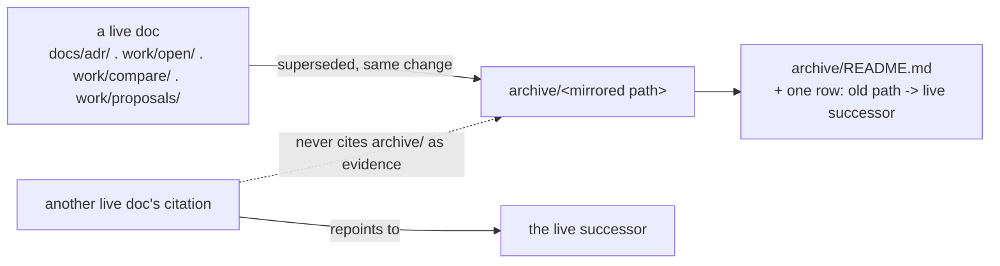

# ADR-ONE-ARCHIVE: there is exactly one archive, and it is at the repo root

- **Name:** `ADR-ONE-ARCHIVE` — cite this everywhere; never cite the number
- **Status:** accepted — ratified by Arpit 2026-08-10, restated 2026-08-18
  after a reorganisation quietly reintroduced a second archive location. This
  record is the first decision record the rule has ever had.
- **Supersedes:** nothing. The rule previously existed only as prose in
  `CLAUDE.md` ("Archive is not evidence") and as
  [`tests/test_archive_law.py`](../../tests/test_archive_law.py) — this record
  gives it a name and a place other records can cite instead of paraphrasing
  it.
- **Owns:** no `src/`/`tools/` component — a repo-organization convention, not
  runtime code.
- **Laws:** none directly bound. Related but distinct: `CLAUDE.md`'s Law zero
  governs *ADR currency* (a behaviour change updates its owning record in the
  same change); this record governs *what happens to a record once something
  else replaces it*. See Reference.

---

## §1 — For humans

Fux's tree has exactly one place retired material goes: [`archive/`](../../archive/README.md)
at the repo root. Superseded ADRs, closed `work/open/` items, retired
proposals and compare docs, the previous engine build — everything that used
to be current and no longer is — moves there, **mirroring the directory it
came from**, in the same change that retires it. Nothing named `archive` may
exist anywhere else in the tree.

This had already been ruled twice — 2026-08-10, restated 2026-08-18 when a
reorganisation quietly reintroduced a second one — and was already enforced by
a test, before it had a decision record of its own. A rule that has to be
*restated* in prose is a rule that needs a name other records can cite instead
of re-arguing it every time it comes up.



<details>
<summary><b>ASCII twin</b> — the same diagram, for terminals, diffs, and any reader without a Mermaid renderer</summary>

```text
   +------------------------+   superseded,     +---------------------------+
   | a live doc             |   same change     | archive/<mirrored path>   |
   | docs/adr/ . work/open/ | ----------------> |                           |
   | work/compare/ . etc.   |                    +---------------------------+
   +------------------------+                                |
                                                               v
                                              +--------------------------------+
                                              | archive/README.md               |
                                              | + one row: old path ->          |
                                              |   live successor                |
                                              +--------------------------------+

   +----------------------------+   repoints to    +----------------------+
   | another live doc's         | ----------------> | the live successor   |
   | citation                   |                    +----------------------+
   +----------------------------+
              :
              :  never cites archive/ as evidence
              v
   (archive/<mirrored path>, above)
```

</details>

### Examples

Real, from [`archive/README.md`](../../archive/README.md) — the map this
record's decision produces:

```
archive/
  README.md              this map
  adr/                   superseded decision records — old number -> successor NAME
  handoff/               executed handoff + prompt pairs of the current build
  open/                  closed work items — the detail file, once its row left the queue
  v0.1/                  build: the first one, pre-reset #1
  v0.26/                 build: the v0.19-0.26 substrate engine, runnable
  v0.26-docs/            build: that engine's frozen doc set
  v0.26-implemented/     build: that line's executed artifacts
  v0.30-rev1-planning/   the rebuild's research phase, frozen
```

One real row, from the same map, showing the shape a retirement takes —
old path, when it closed, and where the live claim actually lives now:

> `W-45-source-exclusion.md` | 2026-08-20 | **Completed — verdict E built.**
> Live successors: [ADR-DIR-LIST](0022_dir-list.md) decisions 2a-2c, and the
> `!` grammar in `ingest/sourcelist.py`.

---

## §2 — For agents

### Context

Three different reorganisations produced a second archive location before
this rule existed as anything more than prose: `work/adr/`, `docs/archive/`,
and `work/handoff/` each briefly looked like a reasonable place to put
something being retired, because whoever was doing the reorg was working
inside `work/` or `docs/` already and archiving in place was one fewer move.
Arpit ruled against this on 2026-08-10 and had to rule again on 2026-08-18 —
the same failure recurring is what `tests/test_archive_law.py`'s own
docstring names directly: *"a rule that has to be restated is a rule that
needs a check."*

The check existed; the decision behind it did not have a record of its own.
Every other standing rule in this project — the laws, the setup-doc/ADR
split, the OPEN-WORK index contract — has exactly one place that states it and
a name other docs cite. This one did not, and a session encountering the rule
for the first time had only CLAUDE.md's prose and a failing test to reconstruct
*why* from.

### Decision

**There is exactly one `archive/` directory, at the repo root.** Retired or
superseded material — a superseded ADR, a closed `work/open/` item, a retired
proposal or compare doc, a previous engine build — moves there, **mirroring
the path it came from** (`work/adr/` retires into `archive/adr/`, the retired
handoff directory into `archive/handoff/`, and so on), **in the same change
that retires it** — never before, so nothing is ever pre-emptively archived
and left half-superseded.

`archive/README.md` is the map. Every archived item gets a row naming its live
successor, or states plainly that it has none (retired by instruction, not by
completion — the map says so rather than implying ratification it never got).

**Archive is not evidence.** A doc under `archive/` may be *named* in a live
record; it may never *back* a live claim — nothing guarantees an archived file
was not edited or overwritten after retirement. A live doc found citing an
archived one for grounding gets repointed at the live successor, never simply
unlinked (an unlinked claim looks grounded and is not, which is worse than a
visible gap).

Enforced by [`tests/test_archive_law.py`](../../tests/test_archive_law.py):
the root archive exists and is mapped; no second directory named `archive`
exists anywhere else in the tree; and no live doc still points at one of the
specific second-archive paths this project has already had (`work/archive/`,
`docs/archive/`, `work/handoff/`).

### Consequences

**Easier.** "Where did this go?" has exactly one answer instead of depending
on which directory someone was reorganising at the time. The archive-is-not-
evidence rule is checked once, mechanically, instead of remembered in however
many places retirement happens to occur. A session doing a reorg has one
command to run (`pytest tests/test_archive_law.py`), not tribal memory of
three past incidents.

**Harder, and what this now owes.** `archive/README.md`'s *rows* are not
mechanically checked — `test_archive_law.py` asserts the map **file exists**,
not that every archived item has a row in it, or that every row's named
successor still exists. That gap is exactly the shape of defect
[`tests/test_doc_registry.py`](../../tests/test_doc_registry.py) closes for
the live-document registry (rule 2 there: "every row's target must exist");
nothing today does the equivalent for `archive/README.md`'s rows. Left as a
named debt rather than assumed away — if it is worth a mechanical check, that
is a new, separate item, not something this record silently claims is already
covered.

### Alternatives considered

| option | why not |
|---|---|
| Multiple archive locations, one per source tree (`docs/archive/`, `work/archive/`) | This is what actually happened, twice, and is the specific failure this record exists to close off. "Where did this go" stops having one answer the moment a second location exists, and the archive-is-not-evidence rule has to be remembered in two places instead of enforced in one. |
| Delete retired material instead of archiving it | Loses the argument that produced a call, not just the call itself — `work/OPEN-WORK.md`'s own rule 3 makes the same trade explicitly ("the reasoning that produced a call is worth keeping, the queue entry is not"). Several archived items are valuable precisely because they contain a claim that was *wrong* (see `archive/README.md`'s `W-32` row) — deleting them would erase the corrective record along with the mistake. |
| Rely on git history alone (`git log` / `git show`) instead of a living directory | Archived docs are meant to be *found and named* from a live record without anyone needing to know a commit sha to check out — "an archived file may be named" only works if it is sitting somewhere a citation can point to. |

### Reference (required)

- [`archive/README.md`](../../archive/README.md) — the map itself; the layout
  table and the `W-45` row quoted in §1's Examples are copied from here
  verbatim.
- [`tests/test_archive_law.py`](../../tests/test_archive_law.py) — the
  mechanical enforcement: one archive exists and is mapped, no second one
  exists, no live doc points at a retired second-archive path.
- `CLAUDE.md` §"Archive is not evidence" — the prose this record formalizes.
  `CLAUDE.md` is an agent-steering file Arpit ratifies directly; this ADR does
  not edit it, and a future session may propose repointing that section to
  cite this record by name rather than restating the rule, as a named diff
  for Arpit to accept.
- `CLAUDE.md` §Law zero — a related but distinct discipline (ADR *currency*:
  a behaviour change updates its owning record in the same change) that this
  record does not restate and is not bound by.
- [`work/OPEN-WORK.md`](../../work/OPEN-WORK.md) rule 3 — "the reasoning that
  produced a call is worth keeping, the queue entry is not," the same
  principle this record's "delete instead" alternative weighs against.

### Veto condition

**Reopen this decision if** a genuinely structural reason emerges for a second,
legitimately separate archive location — for example, a repository boundary
this project does not have today (a true monorepo split) — as opposed to a
reorg finding a second location merely convenient, which is the failure mode
this record exists to close off.

**How to check it:** `pytest tests/test_archive_law.py` still passes, and no
directory named `archive` exists in the tree outside the repo root
(`git ls-files | grep -c '(^|/)archive/'` should show hits only under the
root `archive/` prefix).
