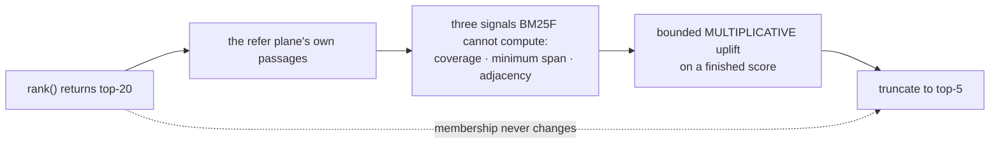

# ADR-RERANK — proximity reranking

## §1 — For humans

BM25F is a bag of words. It cannot see **where** the terms are, and some
questions are entirely about that.

```console
$ fux ask "what is the current decision for east west traffic" --top 2
# rerank_weight = 0            # rerank_weight = 1.0
8.0130  ADR-0007 (superseded)  13.2718  ADR-0019 (current)
6.6359  ADR-0019 (current)     11.7391  ADR-0007 (superseded)
```

The superseded document wins on BM25F because both are dense in the same
vocabulary and **the superseded one is shorter**, so the length normaliser
prefers it. The sentence that settles the question — *"This is the current
decision for east-west traffic."* — is a fact about **adjacency**, and BM25F
cannot see adjacency.

**Diagram — Mermaid and its ASCII twin. Update both, always, together.**



<details>
<summary><b>ASCII twin</b> — the same diagram, for terminals, diffs, and any reader without a Mermaid renderer</summary>

```text
   rank() returns top-20        <- the candidate set, and it NEVER grows
        |
        v
   the refer plane's own passages   (one chunker, not two)
        |
        v
   coverage   ·   minimum span   ·   adjacency
        |
        v
   a bounded MULTIPLICATIVE uplift on a finished score
        |
        v
   truncate to top-5

   It REORDERS. It never RETRIEVES. A document rank() did not
   return cannot be rescued here.
```

</details>

---

## §2 — For agents

### Decision

**1. A neural cross-encoder is REFUSED, and not on cost.** Three reasons, in
the order they matter:

**1a. It would break cross-machine determinism, which is the product.**
[ADR-GRAPH](0029_graph.md) proved fux's float arithmetic is byte-identical
between x86-64 Linux and arm64 macOS — **for pure Python**. An ONNX runtime
dispatches to different SIMD kernels per architecture and reduces GEMMs in a
different order, so **two developers on the same commit would get different
orderings from the same index.** *Clone it and run the query* stops being true,
and **the differential law loses its meaning**: there would be no single right
answer for the accelerator and the scan to agree on.

**1b. Optional-but-on breaks L4; optional-but-off is not a feature.** Either fux
fetches ~35 MB on first use — offline-by-default gone — or the lane ships dark
and nothing is measured. **There is no third position.**

**1c. Nobody knew the number.** Nothing said whether reranking was worth 2
points or 20. **Building the cheap signal first converts the neural question
from a preference into arithmetic.**

**This is a deferral with a price attached, not a rejection on principle.** The
veto states exactly what would reopen it.

**2. Three signals BM25F cannot compute:**

| signal | what it catches | what BM25F does instead |
|---|---|---|
| **coverage** | every query term present, once each | sums per term, so 5× one term beats 1× five |
| **minimum span** | the terms occur *together* | ignores position entirely |
| **adjacency** | query bigrams occur as bigrams, in order | ignores order entirely |

Span is the standard linear sweep over per-term position lists, **not an
all-pairs product**: a common term in a long document has thousands of
positions, and the quadratic form is what makes naive proximity too slow to
ship.

**3. Coverage MULTIPLIES; it is not a weighted addend.** This is the difference
between a reranker that works and one that does not, and **it is measured rather
than argued**: with coverage as an addend the reranker moved **2** of 22 failing
goldens, because every candidate in a corpus about one subject scores 0.85–1.0
and **an 8 % spread cannot overcome a BM25F gap.** Multiplying it — and squaring
it first — moved **4**.

It is also the right shape on the merits. **Span and adjacency are claims about
terms the passage *has*; they are meaningless about a term it lacks.** Scoring
them as though a missing term were a small deduction **rewards a passage for the
tightness of an incomplete match** — precisely how the superseded document was
beating the current one while missing the word *current*, which is the entire
question.

**4. A document scores as its BEST passage.** Measured over whole documents
every candidate reaches coverage 1.0 *somewhere* and **the signal flattens to
noise**. Chunking is the refer plane's own, so **a passage the reranker scored
is a passage `answer` can cite** — one chunker, not two.

**5. It REORDERS; it never retrieves.** The candidate set is exactly what the
ranker produced. A document BM25F did not find cannot be rescued here.

> **The committed plane must be sufficient to answer. The derived plane may make
> an answer faster or better — never possible.**

**6. It retrieves DEEPER than the caller asked** — top-20 → top-5. **A reranker
that can only shuffle the five documents already on screen cannot promote the
sixth, and the sixth is where the recoverable failures are.**

**7. DEFAULT OFF, and the reason is a property rather than timidity.**
`[ranking] rerank_weight` defaults to `0.0`; the measured recommendation is
`1.0`.

⚠ **The reranker reads the working tree at query time, so its output is not a
pure function of the committed index.** Edit a document without re-ingesting and
BM25F scores the old text while the reranker scores the new; **two clones with
identical indexes but different dirty trees rank differently.**

That is defensible — [ADR-REFER](0030_refer-plane.md) already reads live text on
purpose, because *the index finds and the sources speak* — but it is a different
contract from the one `ask` has had, **and it is not a change to make silently
in a released tool.** The differential law is untouched: the accelerator and the
scan read the same live text and agree byte for byte.

**7a. The default stays `0.0` even though the measured bar was met**, and this
is the sharper half. Re-measured unenriched: **`28 → 32`, `+4`, zero broken**,
against a frozen bar of `net >= +2, broken <= 1`. **Met, decisively. It does not
flip.**

⚠ **Because the `+4` is an `informed` number by this project's own rule.** The
`WEIGHT` and `COVERAGE_POWER` constants were chosen from a 4×5 sweep over the 50
goldens — **retriever settings authored with the evaluation in hand**, which is
[ADR-RS](0036_predictions.md) decision 11's own example of an informed artifact,
and decision 12 says an informed run **never supplies a delta**.

⚠ **This corrects a claim this record itself once made** — that reranking's
`+4` was clean because *the author of the arithmetic could not target a query
even in principle*. **True of the algorithm, false of its constants.**

**The honest counter, and it is why this is a hold rather than a rejection:**
those constants were taken **from the middle of a measured plateau rather than a
peak**, explicitly so they would survive a corpus they were not tuned on. **That
is the right mitigation. It is not a substitute for the corpus.** What flips the
default is the reranker graded on **a second corpus with goldens nobody has
tuned on**.

**8. A document it cannot read keeps its score.** Offline, a `url:` document has
no text to rerank against. **Demoting it would make reachability a ranking
signal**, which is the failure the refer plane's offline behaviour exists to
avoid.

⚠ **Import path moved 2026-08-27, behaviour unchanged.** `src/fux/query/rerank.py`
now imports `chunk` from **`fux.refer._chunk`**: the module was made private
because `fux.refer` re-exported the `chunk` *function* over its own submodule of
that name, a shape that had already cost four defects and silently narrowed L4's
network import fence. The function, its signature and its output are untouched —
see [ADR-REFER](0030_refer-plane.md) decision 18 and
[`tests/test_no_shadowed_submodules.py`](../../tests/test_no_shadowed_submodules.py).

**9. `passage_boost` has a SECOND caller, and it is one constant, not two.**
`refer/_rescore.py` multiplies each fetched passage's BM25 score by
`1 + weight * passage_boost(...)` — the same expression `rerank()` applies to
documents, over the same `analyze()` token stream, the same `COVERAGE_POWER`,
and the same bounded multiplicative shape (decision 3).

**The two are the same object by construction.** `boost()` already chunks a
document with the **refer plane's** chunker to score it, so the passage this
record ranked a document by and the passage `answer` cites are the same span.
Scoring the second with different arithmetic would have been a second reranker
that disagrees with this one.

⚠ **Decision 7's DEFAULT OFF therefore governs both.** `[ranking]
rerank_weight` ships at `0.0`, so W-108's passage multiplier is dark out of the
box exactly as this reranker is, and `answer` at the default is byte-identical
to the one that shipped before it
(`tests/refer/test_rescore.py::test_weight_zero_is_byte_identical_to_the_unweighted_score`).
**Turning it on is Arpit's open call on `rerank_weight`, and it now moves two
things rather than one** — that is the fact this decision exists to record.

### Consequences — the measurement

50 goldens, graded on rank. **The reranker was measured before the goldens
carried any prediction about it.**

| configuration | pass | fixed | broken |
|---|---|---|---|
| BM25F alone | **28** / 50 | — | — |
| **+ reranker** | **32** / 50 | 4 | **0** |
| + enrichment (no reranker) | 38 / 50 | 10 | 0 |
| **+ enrichment + reranker** | **41** / 50 | 4 | 1 |

⚠ **The finding that matters is what was left.** Of the 18 goldens still failing
after reranking, **18 were vocabulary gaps and 0 were ordering failures** — the
target document did not contain the searcher's words at all. **The reranker
fixed every ordering failure the corpus had.** That is the honest ceiling of
*any* reranker on this corpus.

⚠ **The enrichment column is contaminated and the reranker column is not.**
*Enrichment is worth 10* came from text written by an author who had already
read the failing queries. Blind, by two independent authors: **`+1` and `−1`,
each breaking the same two queries the contaminated author broke neither of.**
**Identical casualties from two independent agents with different stated
strategies is a property of the task, not of craft** — and both are below
[ADR-RS](0036_predictions.md) decision 14's resolution floor, so the honest
reading is **no detected effect.**

**Cost**, 10 000 real documents, accelerator path: p95 **33.87 ms → 41.87 ms**
against a 150 ms bar. **The cost is O(depth), not O(corpus)** — 20 documents
read per query whatever the corpus size.

**The differential law holds**: 240 accelerator-vs-scan comparisons across five
weights and four depths, 0 divergent.

### Alternatives considered

- **The cross-encoder.** Decision 1.
- **Rank fusion between a BM25F order and a proximity order** instead of a
  bounded multiplicative uplift. Scale-free, which is attractive — but **it gives
  proximity equal authority to BM25F, and proximity computed on a two-term
  overlap is noisy.** The bounded uplift keeps a real term match dominant.
- **Coverage as a weighted addend.** Rejected on measurement — decision 3.
- **Tuning to the peak of the (power, weight) surface.** The 4×5 sweep scores
  30–32 everywhere, with 32 at five different points; the shipped pair was taken
  from the **middle of the plateau**. **A constant read off a spike is an
  overfit to 50 queries.**

### Reference (required)

- The reranker — [`src/fux/query/rerank.py`](../../src/fux/query/rerank.py);
  its tests — [`tests/query/test_rerank.py`](../../tests/query/test_rerank.py).
- The run — [`work/regression/2026-08-24-rerank-and-goldens/`](../../work/regression/2026-08-24-rerank-and-goldens/);
  the re-measurement and the default's hold —
  [`work/regression/2026-08-25-supersession-and-reranker-default/`](../../work/regression/2026-08-25-supersession-and-reranker-default/report.md).
- The determinism result decision 1a rests on — [ADR-GRAPH](0029_graph.md); the
  cross-architecture drift measurement —
  [`work/regression/2026-08-24-crossarch-drift-and-declared-supersession/`](../../work/regression/2026-08-24-crossarch-drift-and-declared-supersession/report.md);
  the rank-flip susceptibility measurement —
  [`work/regression/2026-08-25-rank-flip-susceptibility/`](../../work/regression/2026-08-25-rank-flip-susceptibility/report.md).
- The authorship rule that reclassifies decision 7a's number —
  [ADR-RS](0036_predictions.md) decisions 11–14.
- The passages it scores — [ADR-REFER](0030_refer-plane.md); the scorer it
  multiplies — [ADR-RANKING](0012_ranking.md) decision 6.

### Veto condition

**Veto 1 — the cross-encoder reopens when, and only when, BOTH of these are
measured. They are experiments, not arguments.**

1. **Score-level drift measured below the target corpus's adjacent-gap floor.**
   Run a small ONNX reranker on two architectures and diff the **final scores**.
2. **Value measured on the target corpus** — the specified model, that corpus's
   own goldens. **This record holds no position on the cross-encoder's value;
   anyone reopening supplies the number.**

⚠ **The bar for condition 1 is the adjacent gap, not the rounding, and the
earlier bar was wrong in the strict direction.** A ranking changes when drift
exceeds **the gap to the next document**, not when it exceeds `round(score, 9)`.
Measured over 495 documents and 297 queries: **median adjacent top-5 gap
`0.27`**, and at the drift actually observed (`1.907e-06`, one element of an
intermediate tensor after **one** encoder block) there are **0.00 % order flips,
0.00 % membership flips and 0.00 % at-risk.** The knee is `~1e-4`. A
rounding-derived `5e-10` demanded roughly **200 000×** more precision than the
corpus can resolve.

⚠ **The refusal stands anyway, because nobody has measured the quantity that
decides it.** Six layers compound; a final scalar may average; and **a
cross-encoder reranks ~20 already-similar documents — the regime that
manufactures near-ties — so its own gaps are plausibly tighter than BM25F's.**
The flip measurement is a **lower bound**, not an estimate.

⚠ **Undeclared negation is NOT a reopening condition, and that is deliberate.**
*"BM25F cannot see negation"* is the strongest *argument* for the capability —
a query for the **current** decision loses to a document saying *"no longer
current"*, because the honest phrasing hands the superseded document the query's
own word. But that argues **a problem exists**, not that **this** is the
solution: the same failure recovers deterministically by **declaring** the
relation in frontmatter and demoting with integer arithmetic that already ships.
**A model that has finished thinking before the query arrives has no determinism
problem to solve.** ⚠ What the declared route does *not* cover is every other
negation a document can express — *"this approach was abandoned"*, *"unlike Y"*
— **and nobody has measured how many of those a real corpus contains.**

**Veto 2 — the reranker must never change the membership of a result set.**

**Veto 3 — the differential law.** If `ask --fast` and `ask --scan` ever
disagree with a non-zero `rerank_weight`, this record is wrong.

**Veto 4 — the latency bar.** Reopen if the reranker's marginal p95 cost exceeds
25 ms at the 10 000-document design point (measured: 8 ms).

⚠ **Veto 5 — an exact top-5 tie is broken by `docidx` rather than relevance**,
and **4.38 % of queries contain one.** Deterministic, so it breaks no law — and
**arbitrary, which is what matters when the objective is the right answer.**
Reopen if that fraction grows, or if a tie is ever observed deciding a golden.

**How to check them:**

```bash
# 2 — every path returns the documents it was given
grep -n "def rerank" -A 40 src/fux/query/rerank.py | grep -c "append\|extend"
# 0; the tests assert it directly
pytest -q tests/query/test_rerank.py

# 3 — the differential law at a non-zero weight
diff <(fux ask "any query" --json --top 5) <(fux ask "any query" --json --top 5 --fast)

# 4 — the marginal cost, at the design point
work/regression/2026-08-24-rerank-and-goldens/
```

---

## References

*Every source this record cites, gathered in one place. §2's **Reference
(required)** names the grounding; this is the complete list. An archived
document is never listed here — the body may name one, but archive is not
evidence.*

**Records** — [ADR-LAWS](0001_laws.md) · [ADR-ASK](0004_ask.md) ·
[ADR-RANKING](0012_ranking.md) · [ADR-GRAPH](0029_graph.md) ·
[ADR-REFER](0030_refer-plane.md) · [ADR-RS](0036_predictions.md) ·
[ADR-TUNE](0038_tuning.md) · [ADR-ENRICH](0040_enrich.md)

**Code**

- [`src/fux/query/rerank.py`](../../src/fux/query/rerank.py)
- [`tests/query/test_rerank.py`](../../tests/query/test_rerank.py)

**Measured evidence**

- [`work/regression/2026-08-24-rerank-and-goldens/report.md`](../../work/regression/2026-08-24-rerank-and-goldens/report.md)
- [`work/regression/2026-08-24-crossarch-drift-and-declared-supersession/report.md`](../../work/regression/2026-08-24-crossarch-drift-and-declared-supersession/report.md)
- [`work/regression/2026-08-24-blind-enrichment-regrade/report.md`](../../work/regression/2026-08-24-blind-enrichment-regrade/report.md)
- [`work/regression/2026-08-24-blind-enrichment-second-author/report.md`](../../work/regression/2026-08-24-blind-enrichment-second-author/report.md)
- [`work/regression/2026-08-25-rank-flip-susceptibility/report.md`](../../work/regression/2026-08-25-rank-flip-susceptibility/report.md)
- [`work/regression/2026-08-25-supersession-and-reranker-default/report.md`](../../work/regression/2026-08-25-supersession-and-reranker-default/report.md)

**Project docs**

- [`archive/proposals/playground-goldens-draft.md`](../../archive/proposals/playground-goldens-draft.md) — **named, not cited** (archive is not evidence); the goldens themselves are the playground's `goldens/queries.jsonl`, and the measured uplift is [the rerank/goldens run](../../work/regression/2026-08-24-rerank-and-goldens/report.md)
- [`work/IMPLEMENTATION.md`](../../work/IMPLEMENTATION.md)
