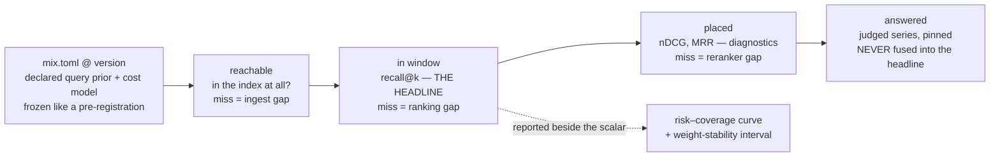

# ADR-QUALITY — what "good" means

**This record ratifies [W-87](../../work/open/W-87-what-good-means.md) Phase 0**
— all six forks, ruled by Arpit on 2026-08-27.

## §1 — For humans

**Fux has always measured carefully and has never said what it was measuring.**
[ADR-RS](0036_predictions.md) governs *how* a claim is frozen and is silent on
*what quantity is worth freezing*. Every quality number this project has
produced therefore carries an undeclared query distribution and an implicit cost
model in which **a fabricated citation and an honest decline score identically.**

**Two runs already passed their number and failed their claim, and a human
caught both** — [P1-GATE](../../work/regression/2026-08-09-pruning-eval/VERDICT.md),
whose 0.00 delta came from a treatment that touched 0–2.5 % of documents, and
[the budget sweep](../../work/regression/2026-08-22-budget-sweep/ANALYSIS.md),
*"satisfied by its letter and violated by its purpose."* Neither was caught by a
gate, because no gate knew what it was looking at.

**This record declares the quantity.** A query is scored against a **declared,
versioned mix**; it passes through **four gates**, each attributing failure to a
different owner; the headline is **`recall@k`**, because retrieval bounds
everything downstream and it is the gate fux most fully controls; and an error
costs a **published, pre-committed** amount, stated as a confidence target
rather than an arbitrary weight.



<details>
<summary><b>ASCII twin</b> — the same diagram, for terminals, diffs, and any reader without a Mermaid renderer</summary>

```text
  mix.toml @ version   declared query prior + cost model, frozen like a pre-registration
        |
        v
  reachable  --->  in window  --->   placed    --->  answered
  in the index     recall@k          nDCG, MRR       judged series, pinned
  at all?          THE HEADLINE      diagnostics     NEVER fused into the headline
  miss = ingest    miss = ranking    miss = reranker

  in window  -..->  risk-coverage curve + weight-stability interval
                    (reported beside the scalar, never instead of it)
```

</details>

---

## §2 — For agents

### Context

**The gap is not that fux measures badly. It is that fux never declared the
quantity**, so a number could satisfy its threshold and still not mean what the
reader took it to mean. Both recorded instances of that failure were caught by
judgment.

Three findings from the retrieval and RAG-evaluation literature set the shape of
what follows, and each is load-bearing rather than decorative:

1. **Retrieval bounds the system.** A generator cannot recover a passage that was
   never retrieved, and the retrieval divergence term dominates the error bound
   ([RAGChecker](https://proceedings.neurips.cc/paper_files/paper/2024/file/27245589131d17368cccdfa990cbf16e-Paper-Datasets_and_Benchmarks_Track.pdf);
   [Retrieval as the Weakest Link](https://medium.com/@nikitamehrotra493/retrieval-as-the-weakest-link-generalization-bounds-for-rag-systems-ccf76e4f0400)).
   **Fux is the retrieval half** — the gate that bounds everything is also the
   one fux fully controls, which is why the headline is a retrieval metric and
   not an end-to-end one.
2. **Accuracy-only scoring pays for fabrication.** It does not merely fail to
   notice a guess; it rewards one over an abstention
   ([*Nature*, 2026](https://www.nature.com/articles/s41586-026-10549-w)).
3. **A judge model is an instrument that drifts silently.** Identical GPT-4o
   evaluator re-runs showed zero coupling between May and June 2026
   ([Who Drifted](https://arxiv.org/abs/2606.15474)).

**Fux's two known failure modes are staleness and confident retrieval of retired
content.** A contract that cannot see either would be measuring around the
problem, which is the reason decision 5 is not negotiable.

### Decision

1. **A quality number is reported as a four-gate funnel, never as one blended
   score:** `reachable` → `in window` → `placed` → `answered`. The funnel
   attributes failure — a drop at `reachable` is an ingest problem, at
   `in window` a ranking problem, at `placed` a reranker problem. A single
   score says something got worse and nothing about what.
2. **`recall@k` is the headline**, reported as a **curve against context bytes**
   and **compared at equal byte budget or not at all**. Recall bought with a
   larger window is not recall earned. It is described as the most directly
   actionable RAG metric
   ([Benchmarking IR Models](https://arxiv.org/pdf/2509.07253)).
3. **`nDCG` and `MRR` are diagnostics, not the headline**, and the demotion is
   structural rather than stylistic. Two conditions both hold in fux: a
   **reranker follows retrieval** ([ADR-RERANK](0041_rerank.md)), so the
   retriever's ordering is discarded before any consumer sees it; and LLM
   attention over long context is **U-shaped**, so a monotonically decaying
   discount asserts a value-by-position curve the consumer demonstrably does not
   have ([RAG Evaluation survey](https://arxiv.org/pdf/2504.14891)). They remain
   the comparable currency against published IR baselines.
4. **The query prior `P(q)` is declared in a versioned
   [`tools/quality/mix.toml`](../../tools/quality/mix.toml), frozen the way a
   pre-registration is frozen, and every report prints `mix@version`.** It
   **starts uniform.** TREC weights topics equally and *states the assumption*
   ([test-collection evaluation](https://link.springer.com/article/10.1007/s10791-016-9281-7));
   the fork was never uniform-vs-weighted, it was **declared vs undeclared**.
5. **`unanswerable` queries are INSIDE the gate**, with an `answerable-only`
   slice reported beside it for continuity with the historical `hit@5` series.
   Excluding them rewards fabrication (decision context, finding 2); abstention
   behaviour is far more sensitive to the abstention reward than to the
   wrong-answer penalty ([I-CALM](https://arxiv.org/html/2604.03904)); and the
   mechanism is settled precedent, not invention — SQuAD 2.0 pairs answerable
   with adversarially unanswerable questions, and the risk–coverage trade-off
   was formalised by El-Yaniv (2010)
   ([Selective QA under Domain Shift](https://arxiv.org/pdf/2006.09462)).
6. **The cost of an error is published, and it is stated as a confidence target,
   not as a bare weight.** `t = 0.75`, from which the penalty follows as
   `c = t/(1-t) = 2`: a correct answer scores `+1`, a decline `0`, a wrong
   answer `−2`.
   - **Only the ratio is identifiable.** Chow's rule fixes the optimal reject
     threshold at `(C_r − C_c)/(C_e − C_c)` — absolute costs do not move the
     decision boundary, the ratio does
     ([reject-option survey](https://arxiv.org/html/2107.11277v3);
     [performance measures with rejection](https://arxiv.org/pdf/1504.02763)).
   - **The confidence-target form is what makes it arguable.** It converts an
     unanswerable question (*what is a stale citation worth?*) into a defensible
     one (*how sure should fux be before it cites?*), and it is the form used to
     state penalties in the open
     ([Why Language Models Hallucinate](https://arxiv.org/pdf/2509.04664)).
   - ⚠ **The ordering is the whole discipline.** Weights set after a score is
     seen are tuning, and a metric chosen to flatter is undetectable later.
     Under-weighting `currency` and `unanswerable` would raise every number fux
     reports while hiding exactly the two failure modes it has.
7. **Every quality verdict publishes a weight-stability interval** — the range of
   `c` over which the verdict does not change. It turns a contested judgment into
   a sensitivity claim, and it is the standard MCDA guard against a result that
   exists only at one weight vector
   ([weight stability intervals](https://www.sciencedirect.com/science/article/pii/S0957417425020792)).
8. **The risk–coverage curve is reported beside the scalar**, with AURC as its
   summary, so the abstention trade is visible rather than baked into one number
   ([Overcoming Common Flaws in Selective Classification Evaluation](https://proceedings.neurips.cc/paper_files/paper/2024/file/047c84ec50bd8ea29349b996fc64af4b-Paper-Conference.pdf)).
   The **Utility–Error curve** serves the same purpose for the cost model
   ([Hallucinations Undermine Trust](https://arxiv.org/pdf/2605.01428)).
9. **The `answered` gate is measured as a separate `judged` series.** L3 is
   **not** the objection — a judge runs in a measurement harness, never the
   maintenance path. **Reproducibility is the objection**, and it is measured
   rather than feared ([Who Drifted](https://arxiv.org/abs/2606.15474);
   [a systematic LLM-as-a-judge evaluation](https://arxiv.org/html/2606.19544v1)).
   Therefore: **pin model AND prompt AND version** in the pre-registration;
   **never fuse** a judged number into the headline; **never compare** across
   judge versions; and **a judged number may inform a prediction but never
   adjudicate one.** It inherits ADR-RS's blind/informed label and adds a third
   axis — *which judge, on what date*.
10. **The deterministic funnel is public; the `judged` series stays internal**
    until 5–10 % of its scores are cross-checked against a human. Publishing a
    metric makes it a target
    ([Goodhart's Law Comes for Every Benchmark You Trust](https://cacm.acm.org/blogcacm/goodharts-law-comes-for-every-benchmark-you-trust/)),
    but an unpublished rubric makes the headline **unauditable** — and for a tool
    whose pitch is a trivially auditable supply chain, that is the worse trade.
    Decision 7's stability interval is what makes publication safe.
11. **No query log is built.** Decision 4's declared prior makes one optional
    rather than blocking. ✅ **The law question this record declined to settle is
    now ruled (Arpit, 2026-08-27): L2 does NOT reach it, and `L8` does** — see
    [ADR-LAWS](0001_laws.md) decision 8. L2 governs *corpus content*; a record of
    what people asked is content-adjacent and privacy-adjacent and no law had
    reached it, so the answer was a new law rather than a stretched one. W-89 is
    closed. If a log is ever built it is **bound by L8** — read the law at its
    one home; this record does not restate it — plus these narrower terms of its
    own: opt-in, class counts only, **never the query text**.

> **No output block appears in this record, and the absence is deliberate.**
> Nothing has been measured under this contract yet — `recall@k` is not computed,
> the `unanswerable` class does not exist, and an invented transcript is worse
> than none. The first captured output belongs to the run that files the first
> verdict under `mix@1`.

### Consequences

**What this buys:** a headline the literature endorses; a metric that stops
paying for fabrication; failure attribution by gate; and a written contract a
future session can be held to.

**What it costs, stated rather than discovered:**

- **`recall@k` is not computed today.** It needs known-relevant sets per query —
  real annotation across the 50 playground goldens.
- **The `unanswerable` class does not exist** and must be authored **blind**, or
  it contaminates the set it is meant to test.
- **Declaring the mix makes some historical numbers incomparable.** That is the
  price of having been undeclared, and it is paid once.
- ⚠ **The ±2-query (4 pp) resolution floor is a placeholder for a measurement,
  not a measurement.** Every "no detected change" ruling currently rests on it.
- ⚠ **Nothing here fixes the lost corpora.** `acme` and `orbit` went in the
  2026-08-20 lab wipe along with their generator, so the measurement half of
  W-87 remains blocked on inputs this record cannot supply.

**The debt is filed**, in [W-87](../../work/open/W-87-what-good-means.md)
(phases P1–P5). The law question decision 11 declined to settle was W-89, and it
is **closed**: [ADR-LAWS](0001_laws.md) decision 8 ruled it as a new law, `L8`,
on 2026-08-27.

### Alternatives considered

- **A flat, declared cost model** — declare the weights uniform and say so. Loses
  because uniform *is* the status quo in which a fabricated citation and an
  honest decline score identically; declaring it changes the documentation and
  not the incentive.
- **Costs derived from real downstream consequence** — measure what a stale
  citation actually costs a consuming agent, and set `c` from that. **The most
  principled option, and it is the reopen trigger rather than the decision:**
  it needs incident or query-log data fux does not have. Adopting it later
  replaces a declared prior with evidence, visibly, which is what decision 4 is
  designed to allow.
- **A full C/W/L user model** — derive the whole metric from a stated model of
  how a consuming agent reads the window
  ([cwl_eval](https://www.microsoft.com/en-us/research/wp-content/uploads/2019/06/CWL_Eval_Sigir_Demo_Paper.pdf)).
  Rigorous, and it reopens decision 3 by making the discount an explicit modelled
  quantity rather than an inherited one. Rejected **for now** on weight, not on
  merit; it is named in veto condition 2.
- **The risk–coverage curve alone, with no scalar** — sidesteps the cost fork
  entirely by never blending. Rejected because a tool that can never say *"this
  got better"* gets tuned by vibes instead; the curve is kept as decision 8
  beside the scalar rather than in place of it.
- **Per-class scores only, with no headline** — the most defensible and least
  usable option, rejected for the same reason.

### Reference (required)

- [`work/compare/what-good-means.compare.md`](../../work/compare/what-good-means.compare.md)
  — the research pass and the fork-by-fork argument this record ratifies
- *Evaluating large language models for accuracy incentivizes hallucinations*,
  *Nature* (2026) — the finding that makes decision 5 non-negotiable
  <https://www.nature.com/articles/s41586-026-10549-w>
- [P1-GATE](../../work/regression/2026-08-09-pruning-eval/VERDICT.md) and
  [the budget sweep](../../work/regression/2026-08-22-budget-sweep/ANALYSIS.md)
  — the two measured cases of a number passing while its claim failed
- [ADR-RS](0036_predictions.md) — the freezing discipline this record supplies a
  quantity for

### Veto condition

**Reopen this decision if any of the following is true.** Each is a condition to
check today, not an event to wait for.

1. **`src/fux/query/rerank.py` no longer exists, or `ask` no longer feeds a
   downstream consumer.** Decision 3's demotion of `nDCG` rests on both; without
   them the classical ranking metrics regain the headline.
   **Check:** `test -f src/fux/query/rerank.py && grep -rn "rerank" src/fux/query/__init__.py`
2. **A `judged` series and the deterministic series disagree on direction across
   three consecutive filed runs.** One of the two is measuring the wrong thing,
   and which one is not obvious in advance.
   **Check:** `ls work/regression/*/VERDICT.md` and compare the two series' signs.
3. **`tools/quality/mix.toml` records a `cost.t` that changed after a score was
   filed under the previous value.** That is the moving-threshold failure in a
   different costume, and it voids decision 6 outright.
   **Check:** `git log --follow -p tools/quality/mix.toml` against the dates in
   `work/regression/`.
4. **A query log exists with real class frequencies.** Decision 4's prior should
   then be replaced by evidence, and the replacement must be a visible version
   bump rather than a silent edit.
   **Check:** `git grep -l "query_log" -- src tools` returns nothing today.
5. **The ±2-query resolution floor is measured** rather than assumed. Every
   "no detected change" ruling rests on it, including rulings under this record.

---

## References

*Every source this record cites, gathered in one place. §2's **Reference
(required)** names the grounding; this is the complete list. An archived
document is never listed here — the body may name one, but archive is not
evidence.*

**Records** — [ADR-RS](0036_predictions.md) · [ADR-RERANK](0041_rerank.md)

**Code**

- [`tools/quality/mix.toml`](../../tools/quality/mix.toml)
- [`src/fux/query/rerank.py`](../../src/fux/query/rerank.py)

**Measured evidence**

- [`work/regression/2026-08-09-pruning-eval/VERDICT.md`](../../work/regression/2026-08-09-pruning-eval/VERDICT.md)
- [`work/regression/2026-08-22-budget-sweep/ANALYSIS.md`](../../work/regression/2026-08-22-budget-sweep/ANALYSIS.md)

**Project docs**

- [`work/compare/what-good-means.compare.md`](../../work/compare/what-good-means.compare.md)
- [`work/open/W-87-what-good-means.md`](../../work/open/W-87-what-good-means.md)
- [`work/open/W-89-does-l2-reach-a-query-log.md`](../../archive/open/W-89-does-l2-reach-a-query-log.md)

**Papers and specifications**

- *Evaluating large language models for accuracy incentivizes hallucinations*,
  *Nature* (2026) — accuracy-only scoring rewards guessing over abstention
  <https://www.nature.com/articles/s41586-026-10549-w>
- *Why Language Models Hallucinate* (2025) — the confidence-target form,
  `penalty = t/(1-t)`, and the natural anchors `t = 0.5 / 0.75 / 0.9`
  <https://arxiv.org/pdf/2509.04664>
- *Machine Learning with a Reject Option: A Survey* — Chow's rule; only the cost
  **ratio** moves the reject threshold
  <https://arxiv.org/html/2107.11277v3>
- *Performance measures for classification systems with rejection* — the
  threshold as `(C_r − C_c)/(C_e − C_c)`
  <https://arxiv.org/pdf/1504.02763>
- *Overcoming Common Flaws in the Evaluation of Selective Classification
  Systems*, NeurIPS (2024) — risk–coverage curves and AURC
  <https://proceedings.neurips.cc/paper_files/paper/2024/file/047c84ec50bd8ea29349b996fc64af4b-Paper-Conference.pdf>
- *I-CALM — Incentivizing Confidence-Aware Abstention* — abstention is far more
  sensitive to the abstention reward than to the error penalty
  <https://arxiv.org/html/2604.03904>
- *Hallucinations Undermine Trust; Metacognition is a Way Forward* — the open
  rubric and the Utility–Error curve
  <https://arxiv.org/pdf/2605.01428>
- *Selective Question Answering under Domain Shift* — SQuAD 2.0's answerable /
  unanswerable pairing and the El-Yaniv risk–coverage lineage
  <https://arxiv.org/pdf/2006.09462>
- *RAGChecker*, NeurIPS (2024) — retriever quality bounds the whole system
  <https://proceedings.neurips.cc/paper_files/paper/2024/file/27245589131d17368cccdfa990cbf16e-Paper-Datasets_and_Benchmarks_Track.pdf>
- *Retrieval as the Weakest Link — generalization bounds for RAG* — the
  divergence term dominates the error bound
  <https://medium.com/@nikitamehrotra493/retrieval-as-the-weakest-link-generalization-bounds-for-rag-systems-ccf76e4f0400>
- *Benchmarking IR Models on Complex Retrieval Tasks* — `recall@k` as the most
  directly actionable RAG metric
  <https://arxiv.org/pdf/2509.07253>
- *RAG Evaluation in the Era of LLMs: A Comprehensive Survey* — position bias
  over long context, and why a decaying discount misdescribes the consumer
  <https://arxiv.org/pdf/2504.14891>
- *Who Drifted: the System or the Judge?* (2026) — a measured GPT-4o evaluator
  collapse, May → June 2026
  <https://arxiv.org/abs/2606.15474>
- *A Systematic, Large-Scale Evaluation of LLM-as-a-Judge* (2026) — judged
  datasets are not authoritative beyond their temporal scope
  <https://arxiv.org/html/2606.19544v1>
- *Information retrieval evaluation using test collections* — TREC weights
  topics equally **and states the assumption**
  <https://link.springer.com/article/10.1007/s10791-016-9281-7>
- *Goodhart's Law Comes for Every Benchmark You Trust*, CACM — publishing a
  metric makes it a target
  <https://cacm.acm.org/blogcacm/goodharts-law-comes-for-every-benchmark-you-trust/>
- *cwl_eval: An Evaluation Tool for Information Retrieval* — the C/W/L
  user-model framework, the rejected alternative in this record
  <https://www.microsoft.com/en-us/research/wp-content/uploads/2019/06/CWL_Eval_Sigir_Demo_Paper.pdf>
- *Weight stability intervals for multi-criteria decision analysis using the
  weighted sum model* — decision 7's guard
  <https://www.sciencedirect.com/science/article/pii/S0957417425020792>
