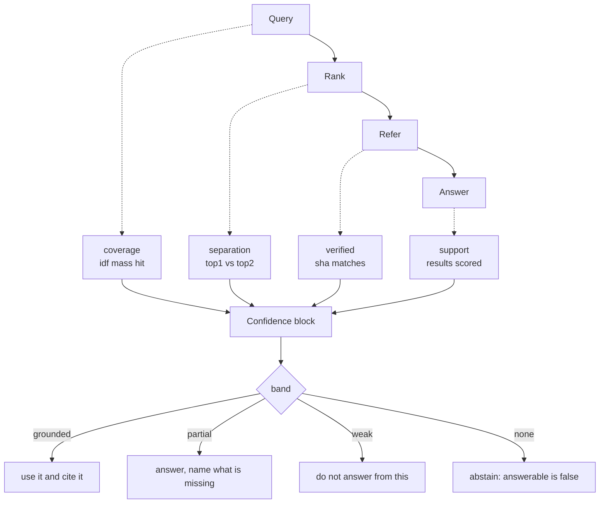

# ADR-CONFIDENCE — how much the index believes its own answer

## §1 — For humans

Fux is read by agents. An agent handed a ranked list has no way to tell *"these
three documents answer your question"* from *"these three documents are the
closest thing in a corpus that does not discuss this at all"* — both arrive as a
score, a title and a citation. The second one is where an agent invents an
answer and cites a real file while doing it.

This record adds a **confidence block** to every answer: four signals computed
from what ranking already produced, and one **band** that names the action a
consumer should take. Nothing fetches, samples, calls a model or reads a clock,
so L1, L3 and L4 are untouched.

**Three of the four band boundaries are structural facts** — nothing scored; a
query term exists in no document; the cited bytes changed since ingest. Only
`grounded` vs `weak` needs a numeric cutoff. That cutoff is **provisional**, and
[ADR-QUALITY](0044_quality-contract.md) decision 6 has **already fixed what it
must be calibrated to**: the confidence target `t = 0.75`. This record does not
get to pick a second one.

⚠ **Since 2026-08-28 both numeric floors are `.fux/tune.toml` keys** —
`[confidence] separation_floor` and `doc_coverage_floor` (decision 13, which
**reverses decision 7**). **A band is therefore no longer comparable across
repos on its own**, so the block now publishes the floor it was judged under.
Read the floor before reading the band.

**Diagram — Mermaid and its ASCII twin. Update both, always, together.**



<details>
<summary><b>ASCII twin</b> — the same diagram, for terminals, diffs, and any reader without a Mermaid renderer</summary>

```text
   +-------+     +------+     +-------+     +--------+
   | Query | --> | Rank | --> | Refer | --> | Answer |
   +-------+     +------+     +-------+     +--------+
       :             :            :              :
       v             v            v              v
   coverage     separation     verified       support
  idf mass hit  top1 vs top2  sha matches  results scored
       |             |            |              |
       +-------------+------+-----+--------------+
                            v
                  +---------------------+
                  |  Confidence block   |
                  +---------------------+
                            |
              +-------------+-------------+
              |           band            |
              +---------------------------+
   grounded -> use it and cite it
   partial  -> answer, but name what is missing
   weak     -> do not answer from this; say what was searched
   none     -> abstain. answerable is false
```

</details>

### Examples

Full coverage and a clear winner — the block is present and the stderr line is
silent, because a note that fires on every healthy query is a note nobody reads
by the second day.

```console
$ fux ask "merge driver conflict resolution" --top 3 --json
{
  "results": [ … 3 results elided … ],
  "confidence": {
    "band": "grounded",
    "answerable": true,
    "coverage": 1.0,
    "separation": 0.105,
    "support": 3,
    "verified": "unverified",
    "missing": []
  }
}
```

A term this corpus has never seen. `missing` carries **the word the user typed**
— `mTLS`, not the `mtl` the index is keyed by.

```console
$ fux ask "how does mTLS rotation work" --top 2 --json
  … "confidence": {"band": "partial", "answerable": true, "coverage": 0.5951,
     "separation": 0.2189, "support": 2, "verified": "unverified",
     "missing": ["mTLS"]}

$ fux ask "how does mTLS rotation work" --top 2 >/dev/null
confidence: partial - answer, but say what is missing. Not in this corpus: mTLS.
```

The case the whole record exists for: **every query term is in the corpus, and
no document is actually about the question.** Coverage cannot see this;
separation can.

```console
$ fux ask "kubernetes helm chart rollout" --top 3 >/dev/null
confidence: weak - the ranking cannot separate the top results
            (separation 0.01, floor 0.10). Report what was searched
            rather than a conclusion.
```

*Captured 2026-08-27 against this repository's own committed index.*

---

## §2 — For agents

### Context

Every surface fux ships states *what* it found and none of them states *how much
it should be believed*. That gap lands on the consumer, and the consumer is
usually a model:

- `ask` and `find` return a ranked list. A list of five is produced whether the
  corpus is full of the answer or empty of the topic — BM25F always ranks
  *something* if a single term matches.
- `answer` states its ceiling in prose (ADR-ANSWER), which an agent parsing
  `--json` never sees.
- The refer plane already computes a rigorous four-state freshness verdict, and
  it is visible only on `answer`'s citation.

The failure this produces is not a wrong ranking. It is a **confidently
narrated** answer built on documents that merely share vocabulary with the
question — and because every citation is real and every sha checks out, nothing
downstream can tell.

**[ADR-QUALITY](0044_quality-contract.md) named the same failure from the
measurement side on the same day** — its decision 5 puts `unanswerable` queries
inside the gate precisely because excluding them *rewards fabrication*. This
record is the runtime half of that: the quality contract measures whether fux
should have declined, and this is the surface on which it declines.

### Decision

1. **Fux computes a confidence block for every answer. Where it is EMITTED
   differs by surface** (⚠ amended 2026-08-27 — see decision 11). It carries
   four signals, a `band`, and an `answerable` boolean.

   | surface | emitted |
   |---|---|
   | `fux_search` MCP result | **always** — a tool call has no flags to pass |
   | `ask` / `find` / `answer`, `--json` and text | **only under `--band`** |

   ⚠ **The block is always COMPUTED.** The flag gates the output, never the
   computation — so `--band` can never change a score, an ordering, or a byte
   in `.fux/index/`, and the differential law (decision 9) still holds with the
   flag absent.

2. **The signals are computed from what ranking already produced.**
   `rank()` writes `df` and `n` into a caller-supplied `stats_out` dict;
   `run_query` builds the block from those plus the **final, post-rerank**
   result scores. Nothing extra is read, fetched or parsed.

3. **The band is derived, in this order, and the first true clause wins.**

   | band | condition | what a consumer does |
   |---|---|---|
   | `none` | nothing scored above zero | abstain; `answerable` is `false` |
   | `partial` | a query term matches no document anywhere, **or** the cited bytes are `stale` | answer, and name what is missing |
   | `weak` | `separation < SEPARATION_FLOOR` | do not answer; report what was searched |
   | `grounded` | otherwise | use it and cite it |

   `stale` lands in `partial` rather than `weak` because it is a **nameable**
   defect, which is what `partial` means; a `weak` result has nothing
   identifiably wrong and the ranking simply cannot choose.

4. **The text-mode declaration goes to stderr, never stdout**, and prints only
   under `--band`. Same contract as `_declare_archived` and `_declare_pending`,
   for the same three reasons: `find` pipes bare paths, `--json` is a contract,
   and this declares rather than gating. ASCII only.

   ⚠ **Silent-at-`grounded` is REVERSED under the flag, and this is a sub-call
   made when the ruling was applied rather than one Arpit stated.** The original
   silence existed so a healthy query would not print a line on every
   invocation. `--band` is an explicit request for the band, so under the flag
   `grounded` prints too — a flag that stays silent exactly when the answer is
   good reads as broken. **If Arpit wanted the flag to keep the silence, this is
   the one line to change** (`Confidence.line()`'s first clause).

5. **`answerable` is a refusal, not the bottom of a scale.** An agent handed
   `0.3` uses it anyway and hedges in prose; an agent handed
   `answerable: false` has nothing to hedge with.
   [ADR-QUALITY](0044_quality-contract.md) decision 5 supplies the measured
   backing: abstention behaviour is far more sensitive to the abstention reward
   than to the wrong-answer penalty, so the abstention has to be a distinct
   action rather than a region of a scale.

6. ⚠ **`SEPARATION_FLOOR` is a PROXY, and fux does not get to pick its own
   abstention threshold.** [ADR-QUALITY](0044_quality-contract.md) decision 6
   already froze the economics — `t = 0.75`, penalty `c = t/(1-t) = 2` — and by
   Chow's rule the optimal reject threshold is fixed by that ratio. **Two
   independent abstention thresholds in one engine is drift with extra steps.**

   Therefore:

   - `SEPARATION_FLOOR = 0.10` is a **starting value with no standing**, not a
     measured optimum. Until R10 is filed, no document may describe the
     `grounded`/`weak` boundary as calibrated.
   - **R10's job is not to find a good-looking cutoff.** It is to find the
     `separation` value at which `P(correct) = t`, with `t` taken from
     `tools/quality/mix.toml` and **never re-derived here**. If `t` moves, this
     floor is re-measured; it is not re-argued.
   - ⚠ **`separation` is an ordinal signal, not a calibrated probability.**
     Chow's rule assumes the latter. That gap is real and is **not closed by
     this record.**
   - ✅ **RULED 2026-08-27 (Arpit): R10 measures the curve and then declares the
     result a HEURISTIC.** Pre-registration frozen at
     [`work/regression/2026-08-27-r10-separation-floor/`](../../work/regression/2026-08-27-r10-separation-floor/evidence/PRE-REGISTRATION.md):
     bin the 50 goldens by `separation`, read observed `P(correct)` per bin, and
     take the floor as the lowest bin reaching `t` **that stays at or above it**
     — a lone crossing that falls back is noise at this sample size. **The
     result is an empirical threshold on an ordinal signal, and a report calling
     it *calibrated* is wrong**; the wording is fixed in the pre-registration so
     a later session cannot quietly upgrade it.
   - ⚠ **Fitting a calibration was considered and REFUSED for that run.**
     Isotonic or Platt on 50 queries yields a mapping that *looks* principled
     and is fit to noise — **worse than an honest heuristic, because it hides
     its own uncertainty.**
   - ⚠ **Three of R10's four frozen outcomes change nothing**, and the power
     analysis says why: ~5 queries per bin resolves a boundary to no better than
     about ±0.2. **The run exists to find out whether a number is findable**,
     and *not yet* is the likeliest honest answer.

7. ⚠ **REVERSED 2026-08-28 — see decision 13. The original text is kept
   because the argument it makes is still true; what changed is who gets to
   decide.**

   > **`SEPARATION_FLOOR` is not a `tune.toml` key.** A consumer who could
   > lower it until their answers read `grounded` would be tuning away the
   > signal rather than the ranking — and under decision 6 it is not fux's
   > number to move locally at all.

   **The half that survives:** lowering the floor still tunes away the signal,
   and a repo-local floor is still not a calibration. **The half that did not:**
   the prohibition. Decision 13 records why, and what replaced it.

8. **`missing` reports the surface form, never the analyzed one.** *"`mtl` is
   not in this corpus"* is worse than silence: a reader cannot tell whether fux
   misunderstood the question or the corpus lacks the topic.
   `analyzer.analyze_pairs` exists for this and for nothing else.

9. **The block is under the differential law.** Both candidate generators derive
   `df` over the same query hashes and report the same `n`, so `--fast` and
   `--scan` cannot disagree about how confident fux is.

10. **Coverage is idf-weighted.** A term with `df == 0` is scored by
    [`bm25f.idf`](../../src/fux/query/bm25f.py) as the rarest possible term, so
    a missed rare word costs far more than a missed common one — correct,
    because the rare word is what made the question specific.

11. ⚠ **`--band` gates the CLI; MCP is always on. RULED by Arpit, 2026-08-27,
    in Cowork — and the cost is accepted rather than argued away.**

    - **Why the split:** an MCP tool call cannot pass a flag, so gating there
      would blind the surface this record was written for. A CLI invocation can,
      and a human running `fux find` in a pipe should not have a confidence
      block arrive uninvited in a declared `--json` shape.
    - ⚠ **The cost, stated plainly: an agent on the invocation ladder that runs
      a bare `fux ask` now gets NO confidence block and no `answerable: false`.**
      That is the exact blindness §1 describes, reintroduced on one of the two
      surfaces. **The mitigation is documentation, and documentation is weaker
      than a default** — [W-82](../../archive/open/W-82-the-consolidated-build.md)
      §3.6's `fux.agent.md` rewrite and the `fux-usage` skill must both teach
      `--band`, or the flag is a feature nothing uses.
    - **`output.schema.json#confidence` becomes conditional on argv.** The key
      is optional when the flag is absent; a consumer may not treat its absence
      as `none`. **Absent means not asked for. It never means not confident.**
    - ✅ **BUILT 2026-08-27.** `--band` on `ask`/`find`/`answer`, resolved once
      in `cli._apply_output_defaults`; `mcp.py` untouched and unconditional;
      `output.schema.json#confidence` is now `required: "band_requested"`, a
      caller-supplied condition rather than a prose promise. **613 passed
      against a 604-passed baseline.**
    - ✅ **The documentation-only mitigation is retired.**
      [ADR-OUTPUT](0047_output-defaults.md) lets a repo commit `band = true` in
      `.fux/output.toml`, so the agent surface gets a **default** rather than
      an instruction it has to have read.
    - **Reopen trigger:** a measured case of an agent answering from a `none`
      or `weak` result because it did not pass `--band`. One is enough.

**13. BOTH FLOORS ARE `tune.toml` KEYS — ruled by Arpit, 2026-08-28, in
Cowork. This reverses decision 7.**

`.fux/tune.toml` gains one table:

```toml
[confidence]
separation_floor   = 0.1   # engine default; the `grounded`/`weak` cutoff
doc_coverage_floor = 0.0   # engine default; 0.0 = the clause is OFF
```

- **Why the reversal.** The standing rule on any configurable value is *state
  the cost, do not clamp the knob* — refuse what is **broken** or what
  **duplicates an existing tool**, and warn, with numbers, about what is merely
  strong. Neither floor is broken at any legal value and neither duplicates
  anything. Decision 7 was the one place in fux where a knob was withheld
  because a consumer might misuse it, and that is not the project's rule.
  ⚠ **The `[priority]` table is the precedent**: it can silently reweight a
  whole corpus, it is far more dangerous than either floor, and it ships with a
  warning rather than a lock.

- ⚠ **What decision 7 was buying, now unguarded, stated plainly.** A consumer
  can set `separation_floor = 0.0` and **no answer is ever `weak` again**. That
  is tuning away the *signal* rather than the ranking, it is silent, and
  **nothing mechanical catches it.** A session reading a `grounded` from a
  tuned repo learns less than it thinks it does.

- **Two things replace the prohibition, and both are weaker than it was.**

  1. 🔴 **The block PUBLISHES the floor it was judged under.** `as_dict()` and
     the MCP result now carry `separation_floor` and `doc_coverage_floor`, so a
     `grounded` at `0.02` is **distinguishable** from a `grounded` at `0.10`
     rather than merely different. **This is the load-bearing half of the
     reversal** — without it, exposing the knob would make the band quietly
     meaningless across repos, which is worse than either the lock or the knob.
  2. **`--no-tune` reaches the band**, not just the ranking. The floors are
     resolved from the same `Tune` that scored the query, so the *"is it me or
     the config?"* switch (ADR-TUNE decision 11) answers for confidence too.

- **The boundary rule is satisfied trivially, and that is worth saying rather
  than assuming.** ADR-TUNE decision 1 asks whether a value leaves `.fux/index/`
  byte-identical. These do — **and they go further: they cannot move a score or
  an ordering either**, because confidence is computed *from* `rank()`'s output
  and nothing downstream feeds back. `[confidence]` is the first table in
  `tune.toml` of which that is true.
  Pinned by `tests/test_tune_boundary.py` (both keys in `MUTATIONS`) and by
  `test_a_tuned_floor_cannot_reach_a_score_or_an_ordering`.

- ⚠ **This does NOT settle R10, and does not let a repo settle it either.**
  The measurement is still owed to ADR-QUALITY's frozen `t`. A repo-local floor
  is a **local preference**; it is never a calibration, and no document may
  describe a tuned floor as measured.

- ⚠ **Decision 6's binding is unchanged and now has a gap it did not have.**
  Decision 6 says fux does not get to pick a second abstention threshold. A
  *consumer* now can. That is a real hole in the argument, accepted rather than
  argued away: fux's engine default stays bound to `t`, and what a consumer sets
  locally is theirs and is published as theirs.

- **`doc_coverage_floor`'s cost is MEASURED, which separates it from the
  other.** At `1.0` — the only value that reads structural — **19 of 50 correct
  answers turn `partial`**, and the single decoy this clause could catch sits at
  `0.710`, inside the goldens' range (decision 12's table). The specimen and the
  module both carry those numbers, so a consumer raising it is paying a stated
  price rather than guessing.

- **Reopen trigger:** a measured run whose arms differ in `separation_floor`.
  Comparing two such arms is a threshold moving inside a comparison, which
  §"a pre-registered threshold may never move" forbids — and the published floor
  is what makes it detectable.

**Output — the differential law on the confidence block, captured 2026-08-27:**

```console
$ fux ask "merge driver conflict resolution" --top 5 --json --scan
scan: {'band': 'grounded', 'answerable': True, 'coverage': 1.0,
       'separation': 0.105, 'support': 5, 'verified': 'unverified', 'missing': []}

$ fux ask "merge driver conflict resolution" --top 5 --json --fast
fast: {'band': 'grounded', 'answerable': True, 'coverage': 1.0,
       'separation': 0.105, 'support': 5, 'verified': 'unverified', 'missing': []}
```

**12. `coverage` is CORPUS-WIDE, and a scattered query therefore looks fully
covered — found 2026-08-27; `doc_coverage` added 2026-08-28, NOT gating.**

[The decoy control's first run](../../work/regression/2026-08-27-decoy-control/report.md):
**one of fifteen questions the corpus cannot answer is reported `grounded`.**

- **The case.** *"What is the SLA we publish for the payments API"* →
  `coverage: 1.0`, `missing: []`, `separation: 0.58`, band **`grounded`**, citing
  the data-retention policy. **No document discusses it.**
- **The mechanism.** Every term occurs — `sla` and `publish` in the retention
  policy, `payments` in the postmortem and deployment tiers, `api` in the mesh
  ADR — in **four different documents**. Corpus-wide coverage cannot see that,
  so both fact-based band clauses pass and the band falls through to
  `separation`.
- ⚠ **This is exactly what §1 and this module's docstring promise to prevent** —
  telling *"these documents answer your question"* from *"these documents are the
  closest thing in a corpus that does not discuss this at all."*
- ⚠ **It is NOT a threshold-value problem.** `0.58` is above the `0.5` that R10's
  selection rule would have picked, so **no ruling on R10 closes it.** It also
  suggests `separation` is answering the wrong question: it measures
  **decisiveness**, and a corpus of near-misses is decisive about its best
  near-miss.
- **The shape of a fix, not taken:** coverage computed against the **cited
  document** rather than the corpus, or both carried. That changes a declared
  signal's meaning, `output.schema.json`, the MCP result and every consumer
  reading the block — **a decision, not a defect fix.**
- ⚠ **No test pins the current behaviour**, deliberately. Pinning a defect is how
  it becomes the contract.

**14. `answer`'s block is computed over THREE results, and `separation` stops
being a constant.** `_fill_confidence` builds the block from the final result
list; `signals()` returns `separation = 1.0` when there is exactly one score,
on the honest ground that *one result separates perfectly — there is no
runner-up to be confused with*.

🔴 **`cmd_answer` retrieved exactly one result, so `fux answer --band`
reported `separation: 1.0` and `support: 1` on EVERY query it had ever
answered.** That was never a claim about the ranking; it was an artefact of the
retrieval width, and it read as the strongest possible separation signal.

**Since W-108 `answer` retrieves `ANSWER_TOP` = 3, the number is real, and it
demotes.** On the 43 graded playground queries **8 answers moved `grounded` ->
`weak`** ([the run](../../work/regression/2026-09-05-answer-top3/report.md)).

⚠ **Nothing was traded to get that.** No floor moved — `separation_floor` is a
`tune.toml` key and decision 13 is untouched. No abstention was implemented;
the band is still reported and gates nothing (that call is Arpit's, and open).
`ask` is unaffected: it always retrieved `--top` results and always computed a
real separation. **What changed is that one verb stopped reporting a number
that could only ever have been `1.0`.**


### Decision 12's outcome — the signal ships, the gate does not

**Ruled in two steps, and the second step reversed the first — which is the
point of measuring.** Arpit ruled *"add per-document coverage alongside, and let
`grounded` require both"*; the field was built, the gate was measured, and shown
the numbers below he ruled again on 2026-08-28: **leave the gate off, publish
the signal.**

✅ **Both rulings are his and the record keeps both**, because the sequence is
the evidence: a rule that looked obviously right cost 19 of 50 correct answers
the moment it met data.

**`doc_coverage` is computed and published** — the same idf mass as `coverage`,
over the **top-ranked document's own terms**. It is handed out through
`rank()`'s `stats_out`, the seam this record already owns, so **the accelerator
and the scan cannot disagree about it**: both reach `rank()` with the same
record dicts, and deriving it anywhere else would mean re-reading the index on
one path and not the other.

**`coverage` is unchanged**, so nothing that reads it changes meaning. That is
why the field was added rather than redefined.

🔴 **The gate is OFF (`DOC_COVERAGE_FLOOR = 0.0`) because the two populations
overlap.** Measured against the playground's 50 goldens and the 15 decoys:

| | n | min | median | max |
|---|---:|---:|---:|---:|
| real goldens reaching this clause | 37 | **0.401** | 0.882 | 1.000 |
| decoys reaching it | 1 | **0.710** | — | 0.710 |

- **The decoy sits INSIDE the goldens' range.** Any floor that catches it
  demotes real answers below it. A floor of `1.0` — which reads structural,
  *"every term the corpus has, the cited document has too"* — turns **19 of 50**
  correct answers `partial`.
- **There is no gap to pick a number in**, and picking one anyway would be
  fitting a threshold to 65 queries. **That is the failure R10 is currently
  `INCONCLUSIVE` over**, in a different costume.
- ⚠ **Fourteen of fifteen decoys never reach this clause at all** — they are
  already `partial` via `missing`, which is the corpus-wide signal working
  correctly. The scattered-terms case is **one query in fifteen**, and the honest
  scale of the original finding is that, not "the band is broken".
- **So the module now REPORTS the case rather than claiming to catch it.** An
  agent gets `doc_coverage: 0.42` beside `band: grounded` and can act on it.

**What would change this:** a decoy set large enough for the two distributions
to be estimated rather than sampled, and a pre-registration that fixes the floor
before any score exists under it. **Not a number picked from this table.**

⚠ **The general lesson, because it will recur:** finding a real case tells you a
defect **exists**. It tells you nothing about whether a **threshold can catch
it**. Those are two measurements, and this record now carries an instance of the
second one contradicting the first.

14. **`_as_dict` and `cmd_ask` in this file gained the `sections` gate — the
    decision is [ADR-OUTPUT](0047_output-defaults.md) decision 21, noted here
    only because the code lives in `src/fux/query/__init__.py`, which this
    record owns.** `sections=False` is the same shape as decision 11's
    `confidence`-under-`--band`: the `headings` key goes absent, and absent
    means *not asked for*, never *nothing matched* — `[]` still carries that
    meaning and is unchanged. Confidence assembly itself (`confidence_out`,
    `_fill_confidence`) is untouched; `headings` is a different key entirely.

### Consequences

**`support` is bounded by `--top`, and cannot honestly be a corpus-wide count.**
A corpus-wide *"47 documents matched"* would be the more useful number. The
accelerator's block bound skips documents it has **proved** cannot reach the top
`k`, so it never scores them, while the reference scan scores everything — a
corpus-wide count would therefore differ between `--fast` and `--scan`, which is
exactly the break [ADR-T1-ACCELERATOR](0011_accelerator.md) forbids. Counting
only what both paths agree on keeps the law intact, and the law is worth more
than the better number. **This was found while building, not while planning.**

**`ask` and `find` can only ever report `verified: unverified`.** They fetch
nothing. Reporting `current` because the index is internally consistent would be
the exact collapse the refer plane's four-state verdict exists to prevent.

**`analyze_pairs` duplicates `analyze`'s loop**, because `analyze` runs over
every token in the corpus at ingest (563 296 on this repo) and making that path
allocate a tuple per token to serve a per-query diagnostic is the wrong trade.
The duplication is gated by
[`tests/query/test_analyzer.py`](../../tests/query/test_analyzer.py), not by
review.

**The band is no longer comparable across repositories on its own.** That is
the direct cost of decision 13 and it lands on every consumer of the block: two
answers both reading `grounded` may have been judged by different floors. The
mitigation is that both floors are emitted — **a reader that ignores them is
making a comparison fux told it not to make.**

**`output.schema.json#confidence` grew two required fields.** Additive, so an
existing consumer keeps working; a consumer that *compares* bands across repos
was already wrong and is now able to find out.

**What we now owe: R10**, and it is owed to ADR-QUALITY's frozen `t`, not to
this record's taste. Filed as
[W-90](../../archive/open/W-90-the-confidence-plane.md).
⚠ **Decision 13 does not reduce that debt.** A tunable floor makes the missing
measurement *easier to paper over*, not less owed.

### Alternatives considered

- **A single 0–10 confidence score.** Rejected. It is uncalibrated, so the
  decimal point is a claim fux cannot support, and it invites exactly the
  behaviour decision 5 exists to prevent — an agent reading `3/10`, using the
  result, and hedging in prose. Four orthogonal signals plus a named band say
  more and promise less.
- **Raw signals only, with no band.** Honest, and it ships zero invented
  numbers. Rejected because every consumer then re-invents the policy in its own
  language, which is the thing fux should own once. The compromise taken is that
  three boundaries are facts and the fourth is declared provisional out loud.
- **Choosing this record's own abstention threshold.** Rejected on contact with
  [ADR-QUALITY](0044_quality-contract.md) decision 6, which had frozen `t` the
  same day. Two thresholds governing one decision is how a system ends up
  declining at one rate and reporting that it declines at another.
- **Calibrating the cutoff against the 50-query golden set now.** Fastest route
  to a defensible-looking band, and rejected on
  [ADR-RS](0036_predictions.md)'s run-classification rule: choosing the number
  by reading the goldens makes the author informed, and an informed run may
  never supply a delta.
- **A cross-encoder or model-scored confidence.** Refused for the reason
  [ADR-RERANK](0041_rerank.md) refused it — not cost, but cross-machine
  determinism, and here additionally L3.
- **Exposing the floors WITHOUT publishing them in the block** (decision 13).
  Rejected, and it is the version that would have been easy: two `tune.toml`
  keys and nothing else. It would have made `band` mean a different thing in
  every repo with no way to tell — a signal that silently varies is worse than
  one that is admittedly provisional.
- **Clamping the range — refusing `separation_floor = 0.0`.** Rejected on the
  standing rule: `0.0` is not broken, it is *strong*. It turns the `weak` band
  off, the specimen says so in capitals, and a consumer who wants it has a
  reason fux does not know. Only genuinely broken values are refused anywhere in
  `tune.toml`, and neither floor has one — the loader's `[0,1]` check is a
  domain check, not a taste check.

### Reference (required)

- [ADR-QUALITY](0044_quality-contract.md) decisions 5 and 6 — the frozen
  confidence target this record's floor must be calibrated to, and the measured
  reason abstention is an action rather than a low score.
- Cronen-Townsend, Zhou & Croft, *Predicting Query Performance* (SIGIR 2002) —
  the clarity score: query performance is predictable from the retrieval
  distribution alone, with no relevance judgments.
  <https://dl.acm.org/doi/10.1145/564376.564429>
- Shtok, Kurland, Carmel, Raiber & Markovits, *Predicting Query Performance by
  Query-Drift Estimation* (TOIS 2012) — NQC: the standard deviation of top-k
  scores predicts query difficulty. `separation` is the cheap two-point form.
  <https://dl.acm.org/doi/10.1145/2094072.2094079>
- [`src/fux/query/confidence.py`](../../src/fux/query/confidence.py) — the
  signals, the bands and the stderr line.

### Veto condition

**Reopen this decision if** the band disagrees with itself across the two
candidate paths — that is, `fux ask <q> --json --scan` and
`fux ask <q> --json --fast` print different `confidence` objects for any query.
That is a differential-law break (decision 9) and the block would be unsafe to
publish until it is fixed.

**How to check it:**

```console
$ fux ask "merge driver conflict resolution" --top 5 --json --scan | jq -c .confidence
{"band":"grounded","answerable":true,"coverage":1.0,"separation":0.105,"support":5,"verified":"unverified","missing":[]}
$ fux ask "merge driver conflict resolution" --top 5 --json --fast | jq -c .confidence
{"band":"grounded","answerable":true,"coverage":1.0,"separation":0.105,"support":5,"verified":"unverified","missing":[]}
# 2026-08-27 — identical; not fired
```

**Reopen it also if** `t` in [`tools/quality/mix.toml`](../../tools/quality/mix.toml)
is no longer `0.75`. Decision 6 binds this floor to that value, so a change
there invalidates the floor without touching this file.

**Reopen it also if** a `confidence` block is emitted anywhere without
`separation_floor`, or a measured run compares two arms whose floors differ.
Decision 13's whole safeguard is that the floor travels with the band; a band
that arrives without its floor is the reversal with its mitigation missing.

```console
$ fux ask "merge driver conflict resolution" --top 5 --json --band | jq -c .confidence.separation_floor
0.1
# 2026-08-28 — present; not fired
```

---

## References

*Every source this record cites, gathered in one place. §2's **Reference
(required)** names the grounding; this is the complete list. An archived
document is never listed here — the body may name one, but archive is not
evidence.*

**Records** — [ADR-LAWS](0001_laws.md) · [ADR-ASK](0004_ask.md) ·
[ADR-ANSWER](0006_answer.md) · [ADR-T1-ACCELERATOR](0011_accelerator.md) ·
[ADR-REFER](0030_refer-plane.md) · [ADR-RS](0036_predictions.md) ·
[ADR-TUNE](0038_tuning.md) · [ADR-MCP](0039_mcp.md) ·
[ADR-RERANK](0041_rerank.md) · [ADR-QUALITY](0044_quality-contract.md)

**Code**

- [`src/fux/query/confidence.py`](../../src/fux/query/confidence.py)
- [`src/fux/query/analyzer.py`](../../src/fux/query/analyzer.py)
- [`src/fux/query/bm25f.py`](../../src/fux/query/bm25f.py)
- [`src/fux/query/output.schema.json`](../../src/fux/query/output.schema.json)
- [`tools/quality/mix.toml`](../../tools/quality/mix.toml)
- [`tests/query/test_confidence.py`](../../tests/query/test_confidence.py)
- [`tests/query/test_analyzer.py`](../../tests/query/test_analyzer.py)

**Project docs**

- [`work/open/W-90-the-confidence-plane.md`](../../archive/open/W-90-the-confidence-plane.md)

**Papers and specifications**

- Cronen-Townsend, Zhou & Croft, *Predicting Query Performance* (SIGIR 2002) —
  that retrieval-time confidence is computable without judgments
  <https://dl.acm.org/doi/10.1145/564376.564429>
- Shtok, Kurland, Carmel, Raiber & Markovits, *Predicting Query Performance by
  Query-Drift Estimation* (TOIS 2012) — score dispersion as a difficulty signal
  <https://dl.acm.org/doi/10.1145/2094072.2094079>
