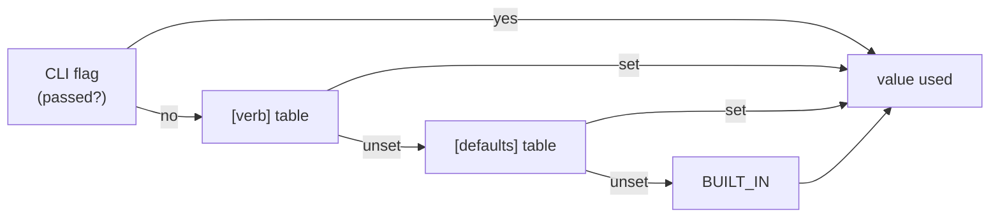

# ADR-OUTPUT — output defaults are configurable, in a third file

## §1 — For humans

**Every default in fux's output is a number somebody picked once.** `--top 5`.
`--json` off. `--hops 2`. And since
[ADR-CONFIDENCE](0045_confidence.md) decision 11, `--band` off. A consumer who
wants a different shape retypes the same flags on every invocation — **and an
MCP client cannot retype anything, because a tool call has no flags.**

This record adds **`.fux/output.toml`**: committed, and read only at the
moment a result is printed. ⚠ **Not "optional" since 2026-08-28** — the file
may be bypassed (`--no-output-config`, or no repo root), but once it is in
effect it is the *sole* source of every key a verb resolves, and a key it
does not set is a hard error, not a silent fallback. See decision 19.

**Why a third file and not a table in `.fux/tune.toml`.** Because the boundary
is different, and the difference is mechanical rather than aesthetic:

| file | the test it applies | asked of |
|---|---|---|
| `fux.toml` | does it change **what is indexed**? | sources, ingest |
| `.fux/tune.toml` | does it change **which documents come back, or their order**? | `k1`, field weights, priority |
| **`.fux/output.toml`** | neither — does it change **how they are shown**? | `top`, `json`, `band`, `hops` |

⚠ **`tune.toml`'s own rule would have admitted these keys.** Its rule is
*"changing the value leaves `.fux/index/` byte-identical"*, which output
defaults satisfy. That is exactly why a second, narrower question was needed —
otherwise `tune.toml` becomes the file where anything that is not ingest goes,
and its one-line header stops being true.

**The one honest boundary case, admitted rather than hidden:** `top` truncates
a ranking, so it passes the rule — but `confidence.support` is bounded by
`top`, so changing it changes a **reported signal**. The shipped specimen says
so on the line itself.

**Precedence, and it is the whole of the mechanism:**



<details><summary>ASCII twin — update together, always</summary>

```text
  CLI flag passed? --yes--> value used
        |
        no
        v
  [verb] table set? --yes--> value used
        |
        no
        v
  [defaults] set?  --yes--> value used
        |
        no
        v
      BUILT_IN     ---------> value used
```
</details>

**`[defaults]` reaches a verb only where that verb declares the key.**
`band = true` under `[defaults]` does not put a band on `doctor`, which has no
such concept — the schema decides, not the table.

### Examples

```console
$ cat .fux/output.toml
[defaults]
band = true

[find]
band = false        # find pipes bare paths

$ fux ask "how does the merge driver work?" --json | jq -r .confidence.band
grounded

$ fux ask "how does the merge driver work?" --no-output-config --json | jq .confidence
null
```

---

## §2 — For agents

### Context

- **Every output default is a single baked constant** — `--top 5` in
  `cli.py`, `hops 2`, `json` off, and `band` off since ADR-CONFIDENCE
  decision 11. A consumer cannot change any of them except per invocation.
- ⚠ **The MCP surface has no flags at all.** `fux_search` is a tool call;
  before this record its output shape was unconfigurable **in principle**, not
  merely inconveniently.
- ⚠ **ADR-CONFIDENCE decision 11 accepted a cost it could only mitigate with
  documentation:** an agent running a bare `fux ask` gets no confidence block
  and no `answerable: false`. Its own text says *"documentation is weaker than
  a default"*. **This record is the default.**
- Fux already has two config files with two different boundaries
  ([ADR-CONFIG](0014_config.md), [ADR-TUNE](0038_tuning.md)), so the question
  was never *"a file or not"* — it was *"which of the two, or a third"*.

### Decision

1. **`.fux/output.toml` exists.** Committed, optional, written once by
   `fux setup` and **never rewritten by fux** — the `tune.toml` precedent
   (ADR-TUNE decision 3b), for the same reason: `tomllib` reads and the stdlib
   does not write TOML, and a file fux promised was yours must stay yours.

2. **The boundary rule is mechanical.** A key belongs here **iff** changing it
   leaves the ranked result set *and its order* identical. It may change what
   is printed; it may never change what is computed.
   ⚠ **`top` is admitted as the boundary case**, with its coupling to
   `confidence.support` stated in the module, in the record and on the
   specimen's own line. It truncates; it does not reorder.

3. ⚠ **AMENDED 2026-08-27 — THREE CATEGORIES, BECAUSE THERE ARE THREE
   CONSUMERS. Ruled by Arpit, in Cowork.** The flat `[defaults]` + per-verb
   layout this decision originally carried lasted one day.

   | category | consumer | shapes |
   |---|---|---|
   | `[cli]` | a **person** | stdout text and the stderr notes |
   | `[cli.json]` | a **machine reading the CLI** | the `--json` payload |
   | `[mcp]` | an **agent** | `fux_search`'s result and its tool schema |

   A key lives in the category whose OUTPUT it shapes; the test is applied per
   key — *change it, and which of the three renderings moves?*

   - **`[mcp]` inherits NOTHING.** This is the whole reason roots exist. Under
     the flat layout a single `[defaults]` fed both surfaces, so
     `[defaults] top = 1` — a line written for a terminal — **silently
     retuned the MCP server's default `k`.** Verified before the change. An
     agent usually wants a different result count than a person does; two
     roots make that difference sayable instead of accidental.
   - **`[cli.json]` DOES inherit from `[cli]`**, because it is the same
     command in a different rendering. It overrides only what should genuinely
     differ between a human reading and a machine parsing.
   - **Precedence, highest first:**
     `flag → [cli.json.<verb>] → [cli.json] → [cli.<verb>] → [cli] → built-in`,
     and for the other root `tool arg → [mcp] → built-in`.
   - ⚠ **`json` is spelled `enabled` and lives only in `[cli.json]`.** TOML
     cannot hold both a key `json` and the table `[cli.json]` under `[cli]`,
     so `[cli] json = true` is not expressible at all — and *"emit the machine
     form by default"* is a fact about the JSON rendering anyway. It is stored
     internally under `json`, the argparse attribute every handler reads;
     `output_config.JSON_ENABLED` is the one place the two names meet.
   - ⚠ **`as_json` is resolved FIRST, in a separate pass.** `json` selects
     which branch every other key walks, so it cannot be resolved alongside
     them — otherwise `[cli.json] top` would be reachable only when `--json`
     was typed and unreachable when the file itself turned JSON on, which is
     the case the table exists for. `cli._apply_output_defaults` is the only
     place that performs the two passes.
   - **A file in the old flat layout is NAMED, not shrugged at.** It parses
     cleanly under the new grammar and would mean something else, so `load()`
     detects `[defaults]` or a bare verb table and says which move to make —
     ADR-TUNE's `_LEGACY_FIELD_KEYS` precedent, same reasoning.

4. **A category table reaches a verb only where that verb declares the key.**
   The per-verb schema in `CLI_VERBS` is the authority; a category table is a
   convenience over it, so `[cli] hops = 3` does not put hops on `doctor`.

5. **The key set is closed, per verb, and a typo is loud.** Same reasoning as
   ADR-TUNE decision 5: this is a file that changes the shape of every
   invocation without changing a byte of the index, so silent acceptance of a
   misspelling is the worst available behaviour. Errors are **collected**, up
   to ten, rather than reported one per run.

6. **`BUILT_IN` is the single source of every default**, and the CLI reads it
   rather than repeating the number in `add_argument`. Two copies of `5` drift;
   one does not.

7. **Six keys are refused BY NAME, with the reason**, rather than reported as
   unknown — each is something a reader will plausibly try:

   | refused | why it is not a preference being denied |
   |---|---|
   | `no_tune` · `tune` | a config that can turn off config-reading defeats the one flag whose job is *"is it me or the config?"* |
   | `no_output_config` | the same loop one level up — this file may not decide whether this file is read |
   | `fast` · `scan` | a **candidate path**, asserted byte-identical, not an output shape. `--scan` exists so a bug report reproduces explicitly, which a configured default would silently defeat |
   | `no_progress` | progress is stderr-only and already TTY-gated; a configured default would fight the detection rather than replace it |

   ⚠ **Everything merely *strong* is allowed.** `top = 500` loads. This follows
   Arpit's standing rule — refuse only what is broken or duplicates a tool that
   exists; state the cost of the rest.

8. **`bool` is checked before `int`, everywhere.** `isinstance(True, int)` is
   `True` in Python, so an unguarded check accepts `top = true` and silently
   means `top = 1` — a result list truncated to one document, which reads as a
   ranking bug and is a config bug.

9. **`--no-output-config` is the escape hatch**, and it does not read the file
   at all — so it still works when the file is what is broken. Mirrors
   ADR-TUNE decision 11.

10. **A gated `store_true` flag must be declared `default=None`.** Otherwise
    `False` means both *"the user passed nothing"* and *"the user passed
    nothing"*, the file can never take effect, and the bug is invisible.
    **This is the only change this record forces on `cli.py`.**

11. ⚠ **`[mcp]` is the table this record exists for.** It carries **`top`
    only** — no `json` (an MCP result is always JSON) and, **corrected during
    the build, no `band`**.

    **The first draft of this decision carried `band` in `[mcp]` and it was
    wrong.** [ADR-CONFIDENCE](0045_confidence.md) decision 11 makes the MCP
    block **unconditional** precisely because a tool call cannot pass a flag,
    so a `[mcp] band = false` would have re-blinded the one surface this record
    exists to serve — a config key that quietly undoes another record's
    decision. It is refused **by name** with that reason, not merely omitted.

    **If the `[mcp]` row is ever dropped entirely, MCP becomes unconfigurable
    again** — there is a test asserting it is present, for that reason.

12. **Nothing on the maintenance path reads it.** Not `ingest`, not `build`,
    not the hooks. L3 says no maintenance output may depend on anything but the
    sources, and a rendering preference is not a source. The module imports
    nothing from `ingest`, `derive`, `maintain` or `store`, and a test asserts
    the fence over its own import block.

13. **`fux output` prints the specimen and exits** — the exact twin of
    `fux tune`, one boundary further in. It writes nothing, here or ever.
    ⚠ Both print with `end=""`, so `fux output > .fux/output.toml` is
    byte-identical to what `fux setup` writes. `_cmd_tune` did not, and the
    two committed files round-tripped differently until 2026-08-27.

14. ⚠ **The specimen carries LIVE lines, not comments. Ruled by Arpit,
    2026-08-27** — the same ruling `.fux/sources/types` got the same day, for
    the same reason: *a file of nothing but comments is a menu, and a consumer
    should be able to read what fux will do without reading fux's source.*
    Every value equals its entry in `BUILT_IN`, asserted key by key against
    every verb, so a fresh repo behaves identically with the file or without
    it.

    **The cost, stated rather than hidden: the defaults FREEZE at setup.**
    `fux setup` is write-if-missing, so a later change to `BUILT_IN` reaches a
    repo that has never run setup and does not reach one that has. Same trade
    `.fux/sources/types` and `fux.toml`'s `max_parallel` already make; the
    remedy is the one ADR-DOTFUX decision 6 names — **a loader refusal or a
    `fux doctor` check, never a rewrite.**

    `[priority]` in `.fux/tune.toml` is the one table that stays commented,
    and it is not an inconsistency: its keys are the consumer's own source
    entries, so an uncommented line there would silently reweight a corpus
    rather than restate a default. Anything unlisted is already `1.0` — an
    empty table IS the default.

15. ⚠ **`--no-output-config` is on EVERY verb that reads the file, `fux mcp`
    included.** It reached only `ask`/`find`/`answer` on the first build,
    which left `explain graph path doctor hooks daemon mcp` reading a
    committed file with no way to bisect it — and made `[doctor] json = true`
    unescapable on the very verb you would run to diagnose the file. **A
    surface you cannot bisect is a surface you cannot debug.** On `mcp` the
    flag is read in `cmd_mcp` rather than folded into `args`, because `mcp` is
    not a CLI verb and has no argparse attributes to fold into.

16. ⚠ **`tools/list` advertises the RESOLVED `top`, not a literal.** The `k`
    schema carries a `default` and an agent reads that number; a `[mcp] top`
    that changed the server's behaviour while still announcing `5` is the W-83
    defect exactly. `mcp._tools(top)` is a function for this reason, and
    `TOOLS` is its built-in rendering.

17. ⚠ **`[mcp]`'s block is loaded ONCE, at `serve()` start-up.** `_search`
    called `load_output(root)` per tool call on the first build — a TOML read
    per search, in a warm process whose entire premise is staying resident,
    for a file that cannot change without a restart being the honest response.

18. ⚠ **`graph` has NO `top` key, and had a dead one.** `[graph] top`
    validated and did nothing: `graph` has no `--top` flag and `cmd_graph`
    reads `seed_depth`/`expand_limit` from `.fux/tune.toml`. It is removed
    rather than wired, because **both of those change WHICH nodes come back** —
    truncating a walk is a ranking change, which this file may not make.

19. ⚠ **THE FILE IS THE SOLE SOURCE OF TRUTH. Ruled by Arpit, in Cowork,
    2026-08-28.** Two changes landed together, because the second only makes
    sense once the first is true.

    **First: decision 3's three-root design is now actually BUILT.** The
    frontmatter's `built: 2026-08-27` was written the day the decision was
    ratified, not the day the code caught up — the module, `cli.py` and
    `mcp.py` still carried the ORIGINAL one-root `[defaults]`/`[<verb>]`
    layout, with a fully-commented specimen, for a full day. `built` above is
    now the day the drift closed. Nothing about decision 3's shape changed
    from this; the closed key sets are named `CLI_VERBS` (the `[cli]` /
    `[cli.json]` side, per verb) and `MCP_KEYS` (the `[mcp]` side) rather than
    a single `SCHEMA` dict keyed by root, since the two sides are validated by
    different code with different inheritance rules and a shared dict implied
    a symmetry that decision 3 explicitly refuses (`[mcp]` inherits nothing).

    **Second: an unset key is now a hard error, not a silent `BUILT_IN`
    fallback.** Every earlier draft of this record let a key the file did not
    set fall through quietly — *"the file is optional, absent means every
    default"*. That is gone. If `.fux/output.toml` is in effect (no
    `--no-output-config`, and a repo root exists) and a verb resolves a key
    the file does not set, `resolve()` / `resolve_json()` / `resolve_mcp()`
    raise `FuxError` naming the key and where to add it
    (`[cli.<verb>] top = 5`, or `[cli.json]`, or `[mcp]`), rather than
    returning a number nobody chose and nobody can see in a diff. `load()`
    itself now raises the same way when the file is missing entirely, naming
    `fux setup` / `fux output > .fux/output.toml` as the fix.

    **`BUILT_IN` is not gone — its job narrowed to three things**: the values
    `fux setup` / `fux output` write into a fresh, LIVE (uncommented)
    specimen (decision 14's shape, now load-bearing rather than cosmetic —
    an all-commented specimen would break every verb on the first run after
    `fux setup`, since a freshly-written file that sets nothing is
    indistinguishable from one that predates every key); what
    `--no-output-config` resolves to; and what a run outside any fux repo
    resolves to, so `--help` / `--version` are never broken by a file that
    cannot exist yet. `DEFAULT_OUTPUT` (`bypass=True`) is the one
    `OutputDefaults` that never raises, by construction.

    ⚠ **The bootstrap edge case this closes a gap on, found while building
    it: `--no-output-config` was only wired to `ask` / `find` / `answer` /
    `mcp`.** `doctor`, `hooks`, `daemon`, `explain`, `graph` and `path` all
    resolve at least `json` through `CLI_VERBS` (several with an empty
    per-verb key tuple, which still walks the `json` pass), so every one of
    them was a `FuxError` waiting for a repo whose `.fux/output.toml` predates
    a key this version needs — with **no flag on the command line to bisect
    it**, on `doctor` in particular, the verb you would run to diagnose
    exactly that. Decision 15 already named this requirement (*"every verb
    that reads the file, `fux mcp` included"*) and was not fully carried out
    on the first build; `_add_output_flags` now runs on all six, closing it.
    `test_every_verb_that_reads_the_file_can_bisect_it` asserts it
    structurally so a seventh verb added later cannot repeat the gap.

    **Why an error over the alternative this record's own §2 Context once
    named** (a silent `fux doctor` warning, ADR-DOTFUX decision 6's usual
    remedy): a rendering default silently drifting from what the repo's own
    committed file states is worse than a verb that refuses to guess. A repo
    that has run `fux setup` (or copied a current `fux output`) never sees
    this at all — every key is live from the day the file is written.

20. ⚠ **A MISSING FILE FALLS BACK; A PRESENT ONE STILL RULES. Ruled by Arpit,
    in Cowork, 2026-08-28.** Decision 19 made `load()` raise when
    `.fux/output.toml` did not exist at all. **That broke every repo that
    predates the file.** The file is write-if-missing
    ([ADR-DOTFUX](0003_fux-directory.md) decision 6), so `fux setup` writes it
    into NEW repos only and never rewrites an existing one — which meant
    `fux ask`, `fux find` and `fux doctor` all exited 1, after an upgrade, in
    every repo that had ever run an older `fux setup`. 49 tests went red on
    `main`, and `doctor` — the verb you would run to find out why — was among
    the broken.

    **The ruling: `load()` returns `ABSENT_OUTPUT` when the file does not
    exist.** Every key resolves to `BUILT_IN`, exactly as under
    `--no-output-config`. **Decision 19 is otherwise untouched**: a file that
    EXISTS and omits a key a verb resolves is still a hard `FuxError`, which
    is the case decision 19 was actually written about.

    **Why this and not a `fux setup` migration.** The alternative was to keep
    the refusal and give `setup` a path that reaches existing repos.
    ADR-DOTFUX decision 6 forbids exactly that — *"a rewrite would eat a
    consumer's annotations"* — and names the two mechanisms that ARE allowed:
    **a loader refusal, or a `doctor` check, never a rewrite.** Decision 19
    chose the refusal, and the refusal is what broke them. So the remedy is
    the other one on decision 6's own list: **`fux doctor` gains an
    `output.toml present` row** (`_output_config_health`), a WARNING naming
    `fux output > .fux/output.toml`, modelled line-for-line on
    `types list usable`, which decision 6 already cites as the worked instance
    of this same situation.

    **Decision 19's own wording is what survives, not what is overturned.** It
    says the file is the sole source of every key *"once it is in effect"*.
    **A file that does not exist is not in effect.** Reading it as *"…and it
    is always in effect"* is what produced the regression; reading it as
    written produces this decision. The one-line change is the honest one.

    ⚠ **`bypass` and `absent` are separate fields, deliberately.** Both
    resolve identically — that is the point — but *"the consumer asked to
    bypass this file"* and *"there is no file to bypass"* are different facts
    about a repo, and only the second is something `doctor` should mention.
    Collapsing them would make the doctor row impossible to write without
    re-statting the file. `DEFAULT_OUTPUT` keeps `absent=False`;
    `ABSENT_OUTPUT` is the new sentinel. **Nothing in the resolve chain
    branches on `absent`** — if anything ever does, the two facts have stopped
    being the same resolution and this note is wrong.

21. **`ask` gained `sections`, and it reaches BOTH renderings. Ruled by
    Arpit, in Cowork, 2026-08-28.** W-84 put the matched headings under each
    `ask` hit as indented `§` lines. They shipped **unconditional, with no
    flag at all** — the one part of `ask`'s output a consumer could not turn
    off. `sections` is now a `[cli.ask]` key and a `--sections` /
    `--no-sections` flag.

    **One key, both renderings.** `sections = false` removes the `§` lines
    from stdout **and** omits `headings` from the `--json` payload. The
    alternative — text-only, leaving the JSON field unconditional — was
    considered and refused: the key answers *"do I want the matched
    headings?"*, and a machine reader who does not want them has exactly the
    same question a human reader does. Two keys for one question would be the
    surface decision 2 exists to keep narrow.

    ⚠ **The absent `headings` key is NOT the W-48 trap, and the distinction is
    the whole justification.** W-48's rule is that an absent key must never be
    the way to say *"nothing matched"*, because a caller cannot tell that from
    *"this fux is too old"*. **`[]` still means nothing matched** — that is
    unchanged and still tested. The new third state means *"the consumer said
    not to compute it"*, which is precisely
    [ADR-CONFIDENCE](0045_confidence.md) decision 11's shape for `confidence`
    under `--band`: **absent means NOT ASKED FOR, never a claim about the
    document.** `output.schema.json` marks it `required: "sections_requested"`
    rather than describing it in prose, the same way `confidence` is
    `band_requested`.

    ⚠ **`--sections`/`--no-sections` is a PAIR, and it has to be.** Every
    other key this file defaults is a `store_true` that is OFF by default, so
    one flag can turn it on. `sections` is ON by default: a lone `--sections`
    `store_true` could only ever re-assert the default, and a repo with
    `[cli.ask] sections = false` would have **no way to get the lines back
    from the command line**. Both halves carry `default=None` — decision 10 —
    because an absent flag must stay distinguishable from an explicit one, or
    the file's value is unreachable and nothing fails to say so.

    **`[mcp]` does not get this key.** MCP returns structured results with no
    text rendering, so the `§` lines do not exist there, and `headings` is
    what an agent actually reads. **`find` does not get it either**: it has no
    `§` lines by design (they would be read as filenames when piped), and its
    `--json` shares `_as_dict`, so its payload is unchanged. Per decision 3,
    `[defaults]`-level `sections` is refused by name — only `[cli.ask]` sets
    it, because only `ask` has the concept.

⚠ **No output default changed on 2026-08-28.** `fux doctor` gained a `url daemon`
row and `fux update` gained `--all`; both print through the existing surfaces and
neither adds a gated flag or a `[verb]` key. Recorded because this record
constrains **every** gated flag in `cli.py` to `default=None`, and `--all` is a
plain `store_true` — it gates nothing and reads no config, so decision 10 does
not reach it.

⚠ **`doc_coverage` added to the confidence block 2026-08-28**, and `output.schema.json` declares it as always-present.
**`coverage` is unchanged**, `rank()` gained one line writing the top-ranked
record's matched hashes into the `stats_out` dict it already fills, and the band
**does not gate on the new field** — the gate is off on a measurement, see
[ADR-CONFIDENCE](0045_confidence.md) decision 12's outcome. **No ordering, no
score and no existing field moved.**

⚠ **`query/__init__.py`'s emission gate (`_show_band`, `_gated`) is unchanged
by the 2026-08-28 tunable-floor change**, but `_fill_confidence` in the same
file now takes a `tune` argument to resolve `separation_floor` /
`doc_coverage_floor` before the block is built ([ADR-CONFIDENCE](0045_confidence.md)
decision 13). Noted here because it touches a file this record shares
ownership of, not because the *shown/hidden* decision moved — `--band`'s
own gating is untouched.

### Consequences

⚠ **Two defects this build produced and caught, recorded because neither was
catchable by the tests that existed when they were written.**

- **`cli._apply_output_defaults` imported `find_root` from `store.fuxdir`,
  where it does not live.** Every unit test passed — they monkeypatch
  `fux.query.find_root` and never reach the CLI's own import — and the failure
  appeared only on a real `python -m fux ask`, as an `ImportError` on **every
  verb**. Caught by *running* it. Gated now by a test that exercises the seam
  with no monkeypatching at all (CLAUDE.md, two strikes).
- **`answer --no-refer` and five verb-level `--json` flags were left at
  `default=False`.** Decision 10's failure, in the wild, on the first build
  that could produce it: the file would silently never take effect for those
  keys and nothing would fail. Found by the **structural** test written for
  decision 10 — which caught a second instance the moment it was added, which
  is the argument for writing it structurally rather than case by case.

- ⚠ **`output.schema.json#confidence` was already conditional on argv** after
  ADR-CONFIDENCE decision 11. It is now additionally conditional on a committed
  file. **That is a net improvement, not a further erosion:** argv is invisible
  to anyone reading the repo, and a committed TOML is visible in a diff and
  reviewable. **Absent still means *not asked for*, never *not confident*.**
- ⚠ **Two repos on the same fux version can emit different shapes.** Accepted,
  and it is the point of a per-repo config. What must never differ is the
  *ranking* — decision 2 is the guard, and it is mechanical.
- **A third file is a third thing to explain.** The three-file table in §1 is
  the mitigation, and it lives in the module docstring, the record and the
  specimen so a reader hits it wherever they land.
- **`fux setup` gains a file to write and `fux doctor` an entry to declare.**
  `.fux/README.md`'s table declares every child, and an undeclared entry is a
  `doctor` warning — so the row is part of shipping this, not a follow-up.

### Alternatives considered

| option | why not |
|---|---|
| **an `[output]` table inside `.fux/tune.toml`** | no new file, and tune's own rule admits the keys. But *"tune"* would then mean two different things, and its one-line header — *"HOW results are ordered"* — stops being true. **The boundary, not the file count, is what makes this wrong.** |
| **an `[output]` table in the repo-root `fux.toml`** | `fux.toml` is *what is indexed*. Mixing rendering into it breaks ADR-CONFIG's boundary and grows the file with the most schema surface already. |
| **flags only, no file** | leaves MCP unconfigurable in principle, and leaves ADR-CONFIDENCE decision 11's cost mitigated by documentation alone. |
| **environment variables** | invisible in a diff, not committed, and per-shell rather than per-repo — every property that makes a committed file the right answer here. |
| **let the file set ranking knobs too** | that is `tune.toml`, and merging them re-creates the boundary problem this record's whole §1 exists to solve. |

### Reference (required)

- [`src/fux/output_config.py`](../../src/fux/output_config.py) — the loader,
  the closed key sets (`CLI_VERBS`, `MCP_KEYS`), the precedence chain, the
  refusals, and the no-fallback resolution decision 19 added.
- [`tests/test_output_config.py`](../../tests/test_output_config.py) — 74
  tests, including the L3 import fence, the `bool`-before-`int` trap, the
  `[mcp]`-row guard, the no-monkeypatch CLI seam, the structural
  `default=None` assertion over every gated flag, and (decision 19) the
  loader-refusal contract and the structural `--no-output-config`-on-every-verb
  assertion.
- ⚠ **Measured, 2026-08-28, against a local mirror — the CLI seam's own
  `device_bash` was unavailable this session, so this is not the repo's own
  test run.** `tests/test_output_config.py`, `tests/test_cli.py`,
  `tests/test_mcp.py` and `tests/test_setup.py` together: **129 passed / 0
  failed**. The wider governance subset (everything under `tests/` except
  `test_quality_controls.py`, which imports a `placebo` module this mirror
  never staged): **624 passed / 3 skipped / 5 failed**, and all five failures
  are pre-existing and unrelated — missing-document assertions
  (`test_adr_ownership.py`, `test_doc_links.py`, `test_doc_registry.py`,
  `test_setup_docs.py`) against docs this mirror never staged, not this
  record's subject. **Re-run `pytest -q tests` on the real repo before
  treating this as landed** — this note names what verified it and what did
  not.
- [ADR-TUNE](0038_tuning.md) — the precedent this follows in structure
  (committed, optional, closed key set, no writer, an `enabled=False` escape
  hatch) and departs from in **boundary**.
- [ADR-CONFIDENCE](0045_confidence.md) decision 11 — the accepted cost this
  record turns from a documentation problem into a default.
- **Prior art for a rendering-only config layer**: git's `[core]`/`[color]`
  split, where `color.ui` changes presentation and cannot change what a
  command computes — the same two-layer separation, and the reason git can
  promise `--porcelain` output is stable while `color.ui` varies per repo.
  <https://git-scm.com/docs/git-config>

### Veto condition

**Check these, do not wait for them.**

1. **A key in `CLI_VERBS` or `MCP_KEYS` changes which documents come back, or
   their order.** Decision 2 is then false and this file has become a second
   `tune.toml`. `top` is the known boundary case and is exempt **only**
   because it truncates without reordering.
2. **Anything under `ingest/`, `derive/`, `maintain/` or `store/` imports
   `output_config`.** L3 is then reachable from a rendering preference.
3. **`MCP_KEYS` is empty, or `[mcp]` gains inheritance from `[cli]`.** The
   first makes MCP unconfigurable again; the second reopens the leak decision
   3 exists to close. Either way
   the record's central justification is gone.
4. **A `store_true` flag that this file can default is left at
   `default=False`.** The file then silently never takes effect for that key —
   the failure decision 10 exists to prevent, and no test outside `cli.py`
   can see it.
5. **`BUILT_IN` and a `cli.py` `default=` disagree.** Decision 6's single
   source has been forked.
6. **A verb resolves a key `.fux/output.toml` does not set and gets a value
   back instead of `FuxError`, while the file is in effect** (no
   `--no-output-config`, a repo root exists). Decision 19 is then false and
   the old silent-fallback behaviour has returned.
7. **A verb that resolves a key through `CLI_VERBS` (or `mcp`, through
   `[mcp]`) has no `--no-output-config` on its parser.** That verb cannot be
   bisected from the file that might be why it fails, and if the file is
   incomplete it cannot be RUN at all — decision 19's bootstrap gap,
   reopened.
8. **`load()` raises, or returns anything but a bypassing `OutputDefaults`,
   for a repo with no `.fux/output.toml`.** Decision 20 is then false and
   every pre-existing repo is exit-1 again on `ask`, `find` and `doctor` —
   the regression that put 49 tests red on `main`, 2026-08-28.
9. **`fux doctor` loses the `output.toml present` row, or it becomes an
   error rather than a warning.** Losing it strands the pre-existing repo
   with no way to learn the file exists — decision 20 traded the refusal for
   this check, and without the check the trade is a silent downgrade.
   Promoting it to an error re-breaks `doctor` by another route.
10. **Anything in the resolve chain branches on `absent`.** The two sentinels
    resolve identically by construction (decision 20); a branch means they no
    longer do, and `--no-output-config` and "no file" have quietly become
    different behaviours.
11. **`ask --no-sections` leaves `headings` in the `--json` payload, or `[]`
    stops meaning "nothing matched".** The first makes decision 21 half-built
    — the ruling was both renderings; the second is the actual W-48 trap,
    which decision 21 explicitly does not open.
12. **`--sections` is reduced to a single `store_true`, or either half loses
    `default=None`.** A repo with `[cli.ask] sections = false` then has no way
    to get the lines back from the command line, which is decision 10's
    failure mode arriving through the one key that defaults to ON.

## References

- [ADR-TUNE](0038_tuning.md) · [ADR-CONFIG](0014_config.md) ·
  [ADR-CONFIDENCE](0045_confidence.md) · [ADR-MCP](0039_mcp.md) ·
  [ADR-CLI](0002_cli-surface.md) · [ADR-FUX-DIR](0003_fux-directory.md)
- [ADR-LAWS](0001_laws.md) — L1 (stdlib only: `tomllib`), L3 (no maintenance
  path reads this), L4 (nothing here reaches the network), L7 (`tomllib`
  requires 3.11+)
