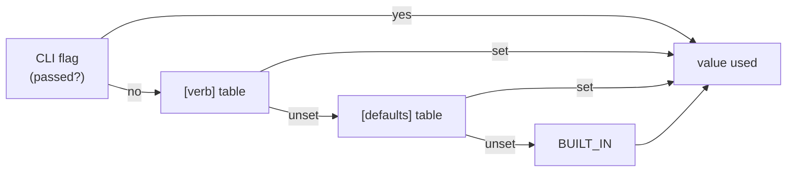

# ADR-OUTPUT — output defaults are configurable, in a third file

## §1 — For humans

**Every default in fux's output is a number somebody picked once.** `--top 5`.
`--json` off. `--hops 2`. And since
[ADR-CONFIDENCE](0045_confidence.md) decision 11, `--band` off. A consumer who
wants a different shape retypes the same flags on every invocation — **and an
MCP client cannot retype anything, because a tool call has no flags.**

This record adds **`.fux/output.toml`**: committed, optional, and read only at
the moment a result is printed.

**Why a third file and not a table in `.fux/tune.toml`.** Because the boundary
is different, and the difference is mechanical rather than aesthetic:

| file | the test it applies | asked of |
|---|---|---|
| `fux.toml` | does it change **what is indexed**? | sources, ingest |
| `.fux/tune.toml` | does it change **which documents come back, or their order**? | `k1`, field weights, priority |
| **`.fux/output.toml`** | neither — does it change **how they are shown**? | `top`, `json`, `band`, `hops` |

⚠ **`tune.toml`'s own rule would have admitted these keys.** Its rule is
*"changing the value leaves `.fux/index/` byte-identical"*, which output
defaults satisfy. That is exactly why a second, narrower question was needed —
otherwise `tune.toml` becomes the file where anything that is not ingest goes,
and its one-line header stops being true.

**The one honest boundary case, admitted rather than hidden:** `top` truncates
a ranking, so it passes the rule — but `confidence.support` is bounded by
`top`, so changing it changes a **reported signal**. The shipped specimen says
so on the line itself.

**Precedence, and it is the whole of the mechanism:**



<details><summary>ASCII twin — update together, always</summary>

```text
  CLI flag passed? --yes--> value used
        |
        no
        v
  [verb] table set? --yes--> value used
        |
        no
        v
  [defaults] set?  --yes--> value used
        |
        no
        v
      BUILT_IN     ---------> value used
```
</details>

**`[defaults]` reaches a verb only where that verb declares the key.**
`band = true` under `[defaults]` does not put a band on `doctor`, which has no
such concept — the schema decides, not the table.

### Examples

```console
$ cat .fux/output.toml
[defaults]
band = true

[find]
band = false        # find pipes bare paths

$ fux ask "how does the merge driver work?" --json | jq -r .confidence.band
grounded

$ fux ask "how does the merge driver work?" --no-output-config --json | jq .confidence
null
```

---

## §2 — For agents

### Context

- **Every output default is a single baked constant** — `--top 5` in
  `cli.py`, `hops 2`, `json` off, and `band` off since ADR-CONFIDENCE
  decision 11. A consumer cannot change any of them except per invocation.
- ⚠ **The MCP surface has no flags at all.** `fux_search` is a tool call;
  before this record its output shape was unconfigurable **in principle**, not
  merely inconveniently.
- ⚠ **ADR-CONFIDENCE decision 11 accepted a cost it could only mitigate with
  documentation:** an agent running a bare `fux ask` gets no confidence block
  and no `answerable: false`. Its own text says *"documentation is weaker than
  a default"*. **This record is the default.**
- Fux already has two config files with two different boundaries
  ([ADR-CONFIG](0014_config.md), [ADR-TUNE](0038_tuning.md)), so the question
  was never *"a file or not"* — it was *"which of the two, or a third"*.

### Decision

1. **`.fux/output.toml` exists.** Committed, optional, written once by
   `fux setup` and **never rewritten by fux** — the `tune.toml` precedent
   (ADR-TUNE decision 3b), for the same reason: `tomllib` reads and the stdlib
   does not write TOML, and a file fux promised was yours must stay yours.

2. **The boundary rule is mechanical.** A key belongs here **iff** changing it
   leaves the ranked result set *and its order* identical. It may change what
   is printed; it may never change what is computed.
   ⚠ **`top` is admitted as the boundary case**, with its coupling to
   `confidence.support` stated in the module, in the record and on the
   specimen's own line. It truncates; it does not reorder.

3. ⚠ **AMENDED 2026-08-27 — THREE CATEGORIES, BECAUSE THERE ARE THREE
   CONSUMERS. Ruled by Arpit, in Cowork.** The flat `[defaults]` + per-verb
   layout this decision originally carried lasted one day.

   | category | consumer | shapes |
   |---|---|---|
   | `[cli]` | a **person** | stdout text and the stderr notes |
   | `[cli.json]` | a **machine reading the CLI** | the `--json` payload |
   | `[mcp]` | an **agent** | `fux_search`'s result and its tool schema |

   A key lives in the category whose OUTPUT it shapes; the test is applied per
   key — *change it, and which of the three renderings moves?*

   - **`[mcp]` inherits NOTHING.** This is the whole reason roots exist. Under
     the flat layout a single `[defaults]` fed both surfaces, so
     `[defaults] top = 1` — a line written for a terminal — **silently
     retuned the MCP server's default `k`.** Verified before the change. An
     agent usually wants a different result count than a person does; two
     roots make that difference sayable instead of accidental.
   - **`[cli.json]` DOES inherit from `[cli]`**, because it is the same
     command in a different rendering. It overrides only what should genuinely
     differ between a human reading and a machine parsing.
   - **Precedence, highest first:**
     `flag → [cli.json.<verb>] → [cli.json] → [cli.<verb>] → [cli] → built-in`,
     and for the other root `tool arg → [mcp] → built-in`.
   - ⚠ **`json` is spelled `enabled` and lives only in `[cli.json]`.** TOML
     cannot hold both a key `json` and the table `[cli.json]` under `[cli]`,
     so `[cli] json = true` is not expressible at all — and *"emit the machine
     form by default"* is a fact about the JSON rendering anyway. It is stored
     internally under `json`, the argparse attribute every handler reads;
     `output_config.JSON_ENABLED` is the one place the two names meet.
   - ⚠ **`as_json` is resolved FIRST, in a separate pass.** `json` selects
     which branch every other key walks, so it cannot be resolved alongside
     them — otherwise `[cli.json] top` would be reachable only when `--json`
     was typed and unreachable when the file itself turned JSON on, which is
     the case the table exists for. `cli._apply_output_defaults` is the only
     place that performs the two passes.
   - **A file in the old flat layout is NAMED, not shrugged at.** It parses
     cleanly under the new grammar and would mean something else, so `load()`
     detects `[defaults]` or a bare verb table and says which move to make —
     ADR-TUNE's `_LEGACY_FIELD_KEYS` precedent, same reasoning.

4. **A category table reaches a verb only where that verb declares the key.**
   The per-verb schema in `CLI_VERBS` is the authority; a category table is a
   convenience over it, so `[cli] hops = 3` does not put hops on `doctor`.

5. **The key set is closed, per verb, and a typo is loud.** Same reasoning as
   ADR-TUNE decision 5: this is a file that changes the shape of every
   invocation without changing a byte of the index, so silent acceptance of a
   misspelling is the worst available behaviour. Errors are **collected**, up
   to ten, rather than reported one per run.

6. **`BUILT_IN` is the single source of every default**, and the CLI reads it
   rather than repeating the number in `add_argument`. Two copies of `5` drift;
   one does not.

7. **Six keys are refused BY NAME, with the reason**, rather than reported as
   unknown — each is something a reader will plausibly try:

   | refused | why it is not a preference being denied |
   |---|---|
   | `no_tune` · `tune` | a config that can turn off config-reading defeats the one flag whose job is *"is it me or the config?"* |
   | `no_output_config` | the same loop one level up — this file may not decide whether this file is read |
   | `fast` · `scan` | a **candidate path**, asserted byte-identical, not an output shape. `--scan` exists so a bug report reproduces explicitly, which a configured default would silently defeat |
   | `no_progress` | progress is stderr-only and already TTY-gated; a configured default would fight the detection rather than replace it |

   ⚠ **Everything merely *strong* is allowed.** `top = 500` loads. This follows
   Arpit's standing rule — refuse only what is broken or duplicates a tool that
   exists; state the cost of the rest.

8. **`bool` is checked before `int`, everywhere.** `isinstance(True, int)` is
   `True` in Python, so an unguarded check accepts `top = true` and silently
   means `top = 1` — a result list truncated to one document, which reads as a
   ranking bug and is a config bug.

9. **`--no-output-config` is the escape hatch**, and it does not read the file
   at all — so it still works when the file is what is broken. Mirrors
   ADR-TUNE decision 11.

10. **A gated `store_true` flag must be declared `default=None`.** Otherwise
    `False` means both *"the user passed nothing"* and *"the user passed
    nothing"*, the file can never take effect, and the bug is invisible.
    **This is the only change this record forces on `cli.py`.**

11. ⚠ **`[mcp]` is the table this record exists for.** It carries **`top`
    only** — no `json` (an MCP result is always JSON) and, **corrected during
    the build, no `band`**.

    **The first draft of this decision carried `band` in `[mcp]` and it was
    wrong.** [ADR-CONFIDENCE](0045_confidence.md) decision 11 makes the MCP
    block **unconditional** precisely because a tool call cannot pass a flag,
    so a `[mcp] band = false` would have re-blinded the one surface this record
    exists to serve — a config key that quietly undoes another record's
    decision. It is refused **by name** with that reason, not merely omitted.

    **If the `[mcp]` row is ever dropped entirely, MCP becomes unconfigurable
    again** — there is a test asserting it is present, for that reason.

12. **Nothing on the maintenance path reads it.** Not `ingest`, not `build`,
    not the hooks. L3 says no maintenance output may depend on anything but the
    sources, and a rendering preference is not a source. The module imports
    nothing from `ingest`, `derive`, `maintain` or `store`, and a test asserts
    the fence over its own import block.

13. **`fux output` prints the specimen and exits** — the exact twin of
    `fux tune`, one boundary further in. It writes nothing, here or ever.
    ⚠ Both print with `end=""`, so `fux output > .fux/output.toml` is
    byte-identical to what `fux setup` writes. `_cmd_tune` did not, and the
    two committed files round-tripped differently until 2026-08-27.

14. ⚠ **The specimen carries LIVE lines, not comments. Ruled by Arpit,
    2026-08-27** — the same ruling `.fux/sources/types` got the same day, for
    the same reason: *a file of nothing but comments is a menu, and a consumer
    should be able to read what fux will do without reading fux's source.*
    Every value equals its entry in `BUILT_IN`, asserted key by key against
    every verb, so a fresh repo behaves identically with the file or without
    it.

    **The cost, stated rather than hidden: the defaults FREEZE at setup.**
    `fux setup` is write-if-missing, so a later change to `BUILT_IN` reaches a
    repo that has never run setup and does not reach one that has. Same trade
    `.fux/sources/types` and `fux.toml`'s `max_parallel` already make; the
    remedy is the one ADR-DOTFUX decision 6 names — **a loader refusal or a
    `fux doctor` check, never a rewrite.**

    `[priority]` in `.fux/tune.toml` is the one table that stays commented,
    and it is not an inconsistency: its keys are the consumer's own source
    entries, so an uncommented line there would silently reweight a corpus
    rather than restate a default. Anything unlisted is already `1.0` — an
    empty table IS the default.

15. ⚠ **`--no-output-config` is on EVERY verb that reads the file, `fux mcp`
    included.** It reached only `ask`/`find`/`answer` on the first build,
    which left `explain graph path doctor hooks daemon mcp` reading a
    committed file with no way to bisect it — and made `[doctor] json = true`
    unescapable on the very verb you would run to diagnose the file. **A
    surface you cannot bisect is a surface you cannot debug.** On `mcp` the
    flag is read in `cmd_mcp` rather than folded into `args`, because `mcp` is
    not a CLI verb and has no argparse attributes to fold into.

16. ⚠ **`tools/list` advertises the RESOLVED `top`, not a literal.** The `k`
    schema carries a `default` and an agent reads that number; a `[mcp] top`
    that changed the server's behaviour while still announcing `5` is the W-83
    defect exactly. `mcp._tools(top)` is a function for this reason, and
    `TOOLS` is its built-in rendering.

17. ⚠ **`[mcp]`'s block is loaded ONCE, at `serve()` start-up.** `_search`
    called `load_output(root)` per tool call on the first build — a TOML read
    per search, in a warm process whose entire premise is staying resident,
    for a file that cannot change without a restart being the honest response.

18. ⚠ **`graph` has NO `top` key, and had a dead one.** `[graph] top`
    validated and did nothing: `graph` has no `--top` flag and `cmd_graph`
    reads `seed_depth`/`expand_limit` from `.fux/tune.toml`. It is removed
    rather than wired, because **both of those change WHICH nodes come back** —
    truncating a walk is a ranking change, which this file may not make.

### Consequences

⚠ **Two defects this build produced and caught, recorded because neither was
catchable by the tests that existed when they were written.**

- **`cli._apply_output_defaults` imported `find_root` from `store.fuxdir`,
  where it does not live.** Every unit test passed — they monkeypatch
  `fux.query.find_root` and never reach the CLI's own import — and the failure
  appeared only on a real `python -m fux ask`, as an `ImportError` on **every
  verb**. Caught by *running* it. Gated now by a test that exercises the seam
  with no monkeypatching at all (CLAUDE.md, two strikes).
- **`answer --no-refer` and five verb-level `--json` flags were left at
  `default=False`.** Decision 10's failure, in the wild, on the first build
  that could produce it: the file would silently never take effect for those
  keys and nothing would fail. Found by the **structural** test written for
  decision 10 — which caught a second instance the moment it was added, which
  is the argument for writing it structurally rather than case by case.

- ⚠ **`output.schema.json#confidence` was already conditional on argv** after
  ADR-CONFIDENCE decision 11. It is now additionally conditional on a committed
  file. **That is a net improvement, not a further erosion:** argv is invisible
  to anyone reading the repo, and a committed TOML is visible in a diff and
  reviewable. **Absent still means *not asked for*, never *not confident*.**
- ⚠ **Two repos on the same fux version can emit different shapes.** Accepted,
  and it is the point of a per-repo config. What must never differ is the
  *ranking* — decision 2 is the guard, and it is mechanical.
- **A third file is a third thing to explain.** The three-file table in §1 is
  the mitigation, and it lives in the module docstring, the record and the
  specimen so a reader hits it wherever they land.
- **`fux setup` gains a file to write and `fux doctor` an entry to declare.**
  `.fux/README.md`'s table declares every child, and an undeclared entry is a
  `doctor` warning — so the row is part of shipping this, not a follow-up.

### Alternatives considered

| option | why not |
|---|---|
| **an `[output]` table inside `.fux/tune.toml`** | no new file, and tune's own rule admits the keys. But *"tune"* would then mean two different things, and its one-line header — *"HOW results are ordered"* — stops being true. **The boundary, not the file count, is what makes this wrong.** |
| **an `[output]` table in the repo-root `fux.toml`** | `fux.toml` is *what is indexed*. Mixing rendering into it breaks ADR-CONFIG's boundary and grows the file with the most schema surface already. |
| **flags only, no file** | leaves MCP unconfigurable in principle, and leaves ADR-CONFIDENCE decision 11's cost mitigated by documentation alone. |
| **environment variables** | invisible in a diff, not committed, and per-shell rather than per-repo — every property that makes a committed file the right answer here. |
| **let the file set ranking knobs too** | that is `tune.toml`, and merging them re-creates the boundary problem this record's whole §1 exists to solve. |

### Reference (required)

- [`src/fux/output_config.py`](../../src/fux/output_config.py) — the loader,
  the closed schema, the precedence chain, the refusals.
- [`tests/test_output_config.py`](../../tests/test_output_config.py) — 56
  tests, including the L3 import fence, the `bool`-before-`int` trap, the
  `[mcp]`-row guard, the no-monkeypatch CLI seam, and the structural
  `default=None` assertion over every gated flag.
- **Measured, 2026-08-27:** the whole staged suite is **613 passed / 0 failed**
  against a **604-passed baseline** taken before any of this landed — so the
  nine added tests are the entire delta and nothing regressed.
- [ADR-TUNE](0038_tuning.md) — the precedent this follows in structure
  (committed, optional, closed key set, no writer, an `enabled=False` escape
  hatch) and departs from in **boundary**.
- [ADR-CONFIDENCE](0045_confidence.md) decision 11 — the accepted cost this
  record turns from a documentation problem into a default.
- **Prior art for a rendering-only config layer**: git's `[core]`/`[color]`
  split, where `color.ui` changes presentation and cannot change what a
  command computes — the same two-layer separation, and the reason git can
  promise `--porcelain` output is stable while `color.ui` varies per repo.
  <https://git-scm.com/docs/git-config>

### Veto condition

**Check these, do not wait for them.**

1. **A key in `SCHEMA` changes which documents come back, or their order.**
   Decision 2 is then false and this file has become a second `tune.toml`.
   `top` is the known boundary case and is exempt **only** because it
   truncates without reordering.
2. **Anything under `ingest/`, `derive/`, `maintain/` or `store/` imports
   `output_config`.** L3 is then reachable from a rendering preference.
3. **`MCP_KEYS` is empty, or `[mcp]` gains inheritance from `[cli]`.** The
   first makes MCP unconfigurable again; the second reopens the leak decision
   3 exists to close. Either way
   the record's central justification is gone.
4. **A `store_true` flag that this file can default is left at
   `default=False`.** The file then silently never takes effect for that key —
   the failure decision 10 exists to prevent, and no test outside `cli.py`
   can see it.
5. **`BUILT_IN` and a `cli.py` `default=` disagree.** Decision 6's single
   source has been forked.

## References

- [ADR-TUNE](0038_tuning.md) · [ADR-CONFIG](0014_config.md) ·
  [ADR-CONFIDENCE](0045_confidence.md) · [ADR-MCP](0039_mcp.md) ·
  [ADR-CLI](0002_cli-surface.md) · [ADR-FUX-DIR](0003_fux-directory.md)
- [ADR-LAWS](0001_laws.md) — L1 (stdlib only: `tomllib`), L3 (no maintenance
  path reads this), L4 (nothing here reaches the network), L7 (`tomllib`
  requires 3.11+)
